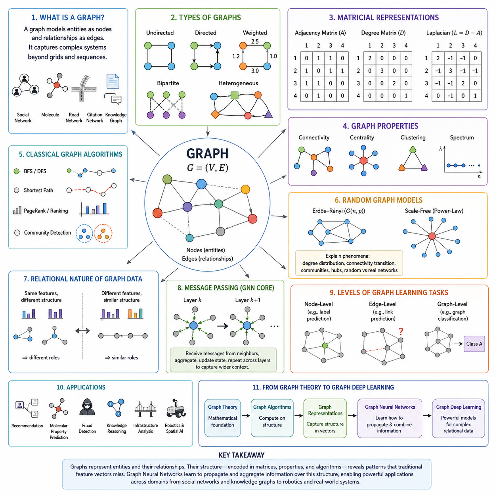
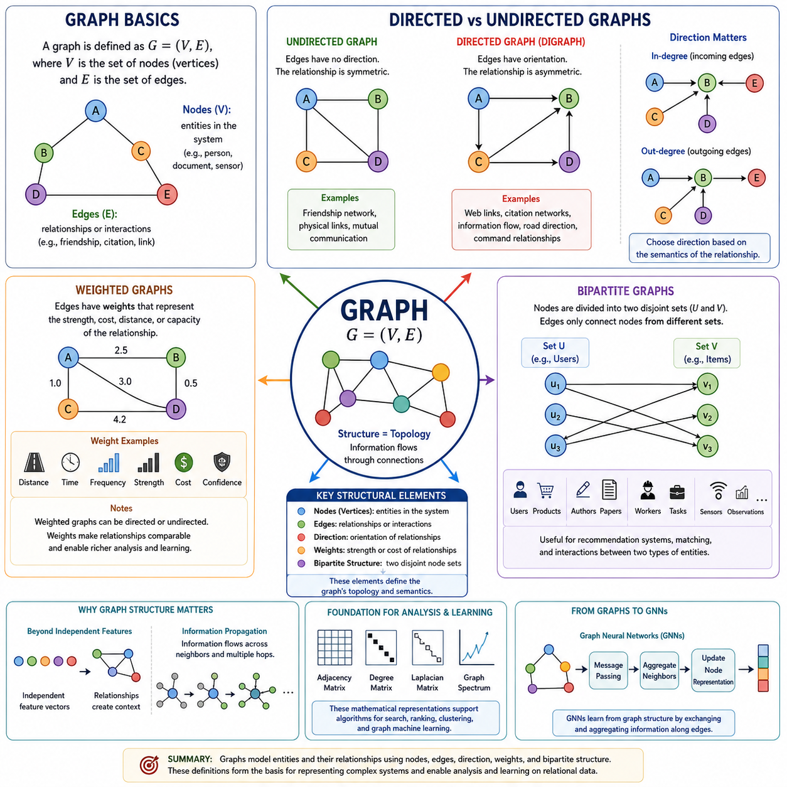
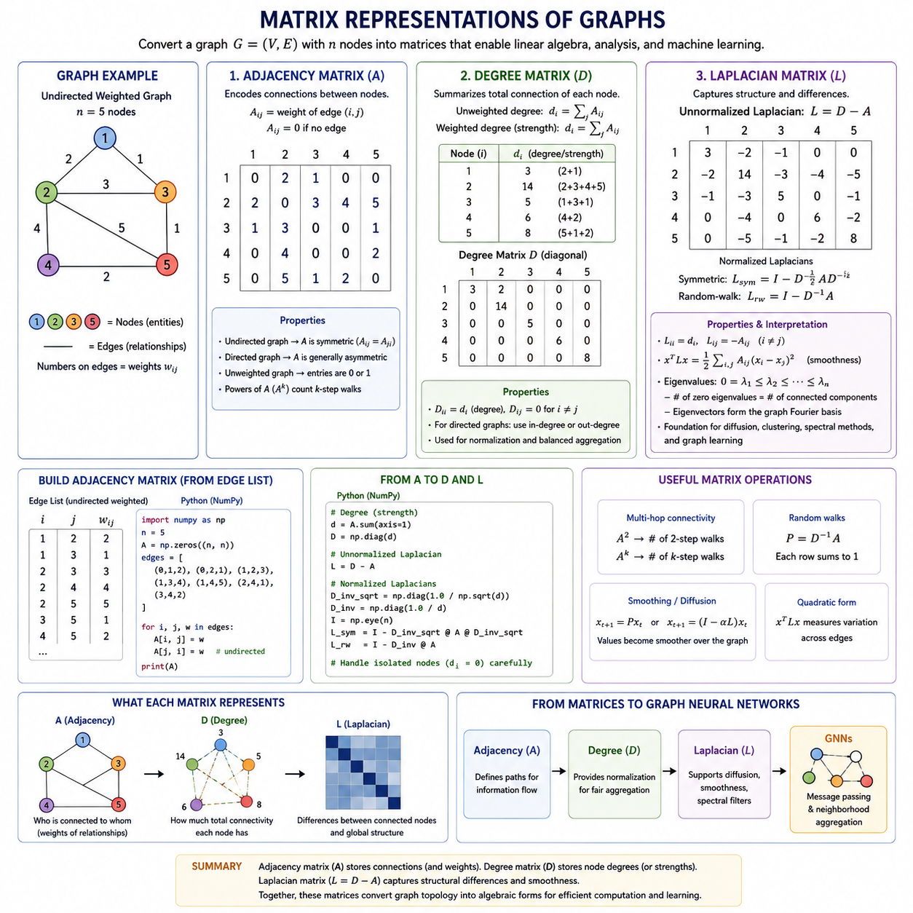
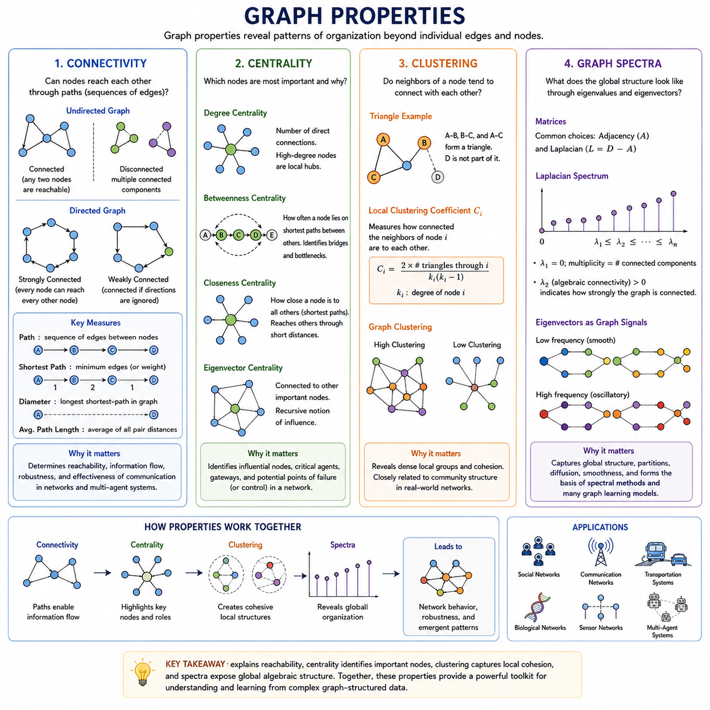
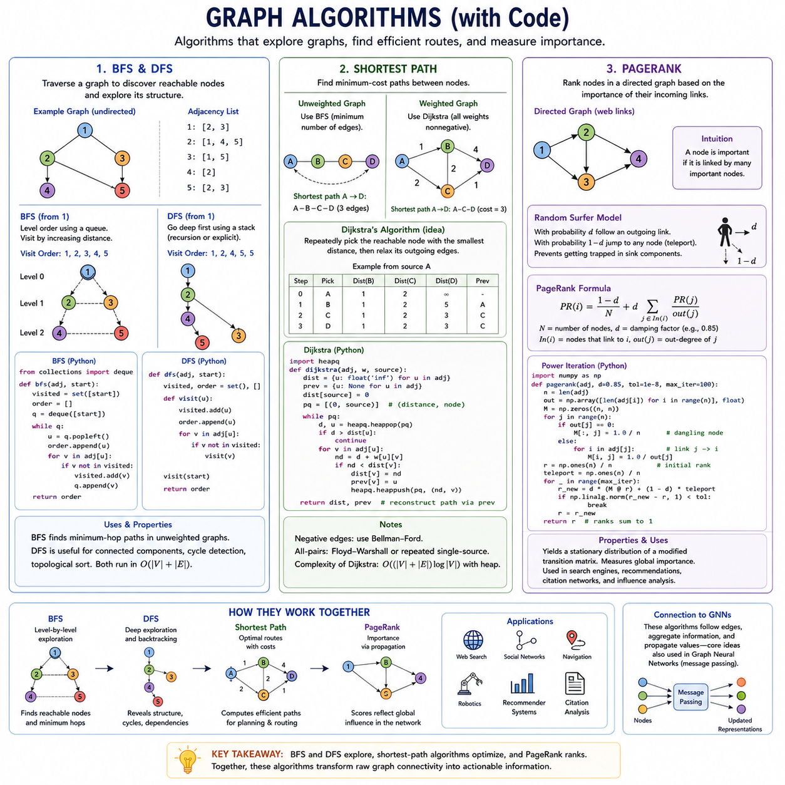
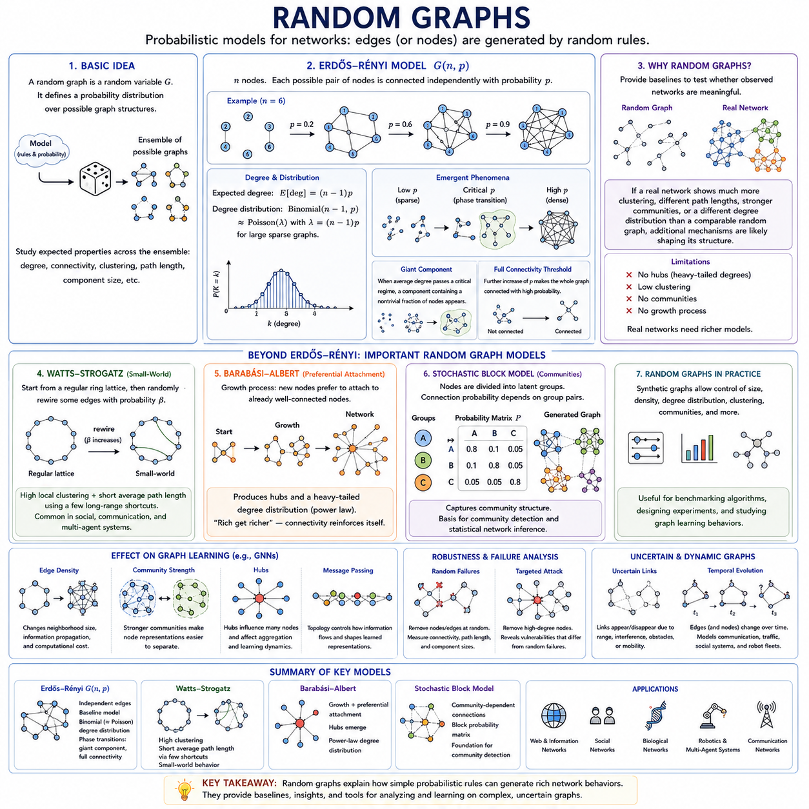
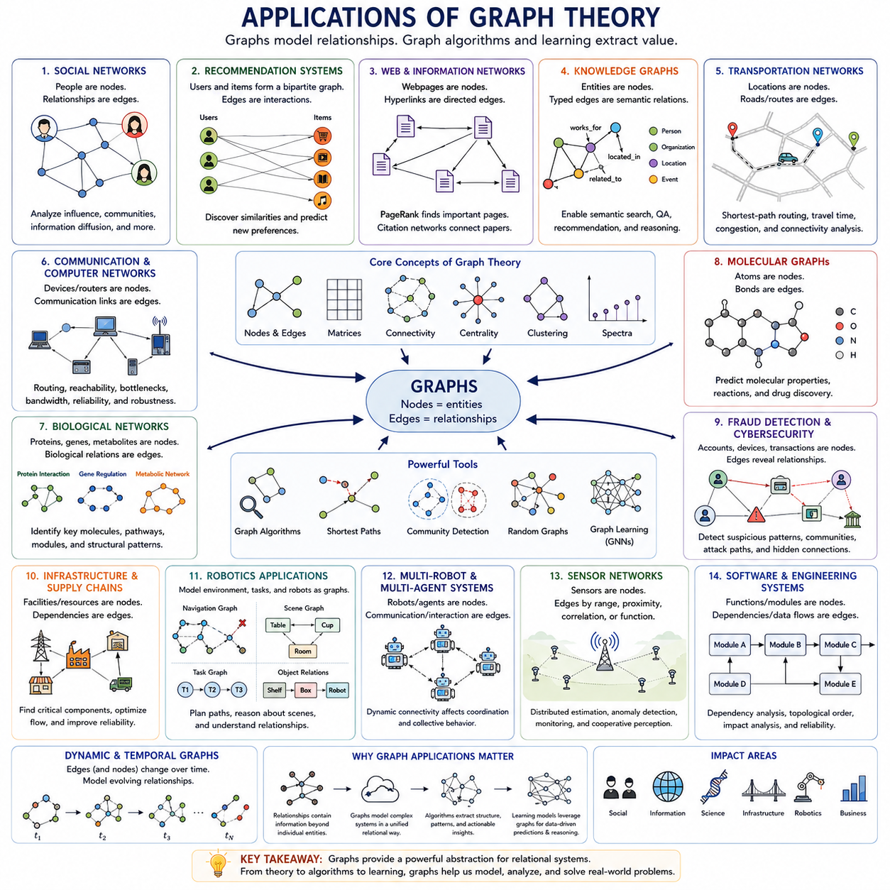

**Volume 29. Graph Deep Learning**

# Chapter 01. Graph Theory Basics

## 01.00. Overview

{width="7.268055555555556in" height="7.268055555555556in"}

그래프 이론(Graph Theory)은 개별 개체(Entity)뿐만 아니라 개체 사이의 관계(Relationship)에 의해 동작이 결정되는 시스템을 설명하기 위한 수학적 언어(Mathematical Language)를 제공한다. 그래프(Graph)는 개체를 노드(Node)로, 관계를 엣지(Edge)로 표현하여 기존의 격자(Grid)나 시퀀스(Sequence)에 의존하지 않고 복잡한 구조를 나타낼 수 있게 한다. 이러한 관계적 관점(Relational Viewpoint)은 그래프 표현 학습(Graph Representation Learning)과 그래프 딥러닝(Graph Deep Learning)의 개념적 기반을 형성한다.

이미지(Image)가 일반적으로 규칙적인 2차원 격자(Two-Dimensional Grid)에 배열되고 텍스트(Text)가 순서가 있는 시퀀스(Ordered Sequence)를 따르는 것과 달리, 그래프 데이터(Graph Data)는 불규칙한 연결성(Irregular Connectivity)을 가진다. 하나의 노드(Node)는 단 하나의 이웃(Neighbor)을 가질 수도 있고 수천 개의 이웃을 가질 수도 있으며, 그래프의 위상 구조(Topology) 자체가 중요한 정보를 포함할 수 있다. 따라서 그래프 학습(Graph Learning)은 개체의 속성과 연결 관계가 형성하는 구조적 패턴(Structural Pattern)을 함께 처리할 수 있어야 한다.

그래프(Graph)는 일반적으로 G = (V, E)로 표현되며, 여기서 V는 정점(Vertex) 또는 노드(Node)의 집합을 의미하고 E는 노드 쌍을 연결하는 엣지(Edge)의 집합을 의미한다. 노드는 사람, 문서, 분자, 도로 교차점, 로봇, 센서 또는 추상적인 개념을 나타낼 수 있다. 엣지는 친구 관계, 인용, 화학 결합, 도로, 통신 링크, 공간 관계 또는 개체 사이에 존재하는 다양한 의미 있는 상호작용(Interaction)을 표현할 수 있다.

엣지(Edge)의 의미는 모델링되는 시스템에 따라 크게 달라진다. 무방향 그래프(Undirected Graph)에서 엣지는 두 장치 사이의 상호 연결처럼 대칭적인 관계(Symmetric Relationship)를 표현한다. 방향 그래프(Directed Graph)에서는 한 웹페이지가 다른 웹페이지를 연결하는 것처럼 관계가 방향성(Direction)을 가진다. 또한 엣지는 거리, 강도, 확률, 비용, 용량, 유사도 등의 정량적 특성을 나타내는 가중치(Weight)를 포함할 수 있다.

그래프(Graph)는 여러 종류의 노드(Node)와 관계(Relationship)를 포함할 수도 있다. 예를 들어 이분 그래프(Bipartite Graph)는 노드를 두 개의 그룹으로 분리하고 주로 서로 다른 그룹 사이의 연결을 허용하므로 추천 시스템(Recommendation System)에서 사용자(User)와 제품(Product)의 관계를 표현하는 데 적합하다. 보다 일반적인 이종 그래프(Heterogeneous Graph)는 여러 노드 유형과 엣지 유형을 포함할 수 있어 지식 그래프(Knowledge Graph), 멀티모달 시스템(Multimodal System), 복잡한 산업 환경(Industrial Environment)을 자연스럽게 표현할 수 있다.

그래프 구조(Graph Structure)는 행렬(Matrix)을 이용하여 대수적으로 표현할 수 있다. 인접 행렬(Adjacency Matrix)은 어떤 노드들이 서로 연결되어 있는지를 기록하며, 차수 행렬(Degree Matrix)은 각 노드가 가지는 연결의 개수 또는 가중 연결 강도를 요약한다. 이러한 구조를 결합하면 그래프 라플라시안(Graph Laplacian)을 얻을 수 있으며, 이는 그래프 위상 구조(Graph Topology)를 선형대수(Linear Algebra), 스펙트럴 분석(Spectral Analysis), 확산 과정(Diffusion Process), 다양한 그래프 학습 알고리즘(Graph Learning Algorithm)과 연결하는 핵심적인 수학적 객체이다.

중요한 그래프 속성(Graph Property)은 네트워크(Network) 전체에 정보와 연결성이 어떻게 분포하는지를 설명한다. 연결성(Connectivity)은 경로(Path)를 통해 노드들이 서로 도달할 수 있는지를 나타내고, 중심성(Centrality)은 구조적으로 영향력이 높은 노드를 식별하며, 군집화(Clustering)는 서로 인접한 노드들이 밀접하게 연결된 그룹을 형성하는 경향을 측정한다. 그래프 스펙트럼(Graph Spectrum)은 그래프 행렬에서 얻어진 고유값(Eigenvalue)과 고유벡터(Eigenvector)를 이용하여 추가적인 전역 구조 특성(Global Structural Characteristic)을 나타낸다.

고전적인 그래프 알고리즘(Graph Algorithm)은 이러한 구조를 탐색하기 위한 계산 메커니즘(Computational Mechanism)을 제공한다. 너비 우선 탐색(Breadth-First Search, BFS)과 깊이 우선 탐색(Depth-First Search, DFS)은 연결된 노드를 체계적으로 탐색하고, 최단 경로 알고리즘(Shortest-Path Algorithm)은 네트워크를 통과하는 효율적인 경로를 찾는다. 페이지랭크(PageRank)와 같은 순위 알고리즘(Ranking Algorithm)은 연결 패턴을 이용하여 노드의 상대적인 중요도를 평가한다.

실제 세계의 그래프(Real-World Graph)는 결정론적 구조(Deterministic Structure)만으로 특성을 설명하기에는 지나치게 복잡한 경우가 많기 때문에 랜덤 그래프 모델(Random Graph Model)이 중요한 이론적 도구가 된다. 랜덤 그래프(Random Graph)는 확률적인 연결 규칙(Probabilistic Connection Rule)을 이용하여 네트워크 특성이 어떻게 발생하는지를 연구할 수 있게 한다. 이를 통해 차수 분포(Degree Distribution), 연결성 전이(Connectivity Transition), 커뮤니티(Community), 허브(Hub), 무작위 네트워크와 구조화된 실제 네트워크 사이의 차이를 분석할 수 있다.

그래프 데이터(Graph Data)와 기존의 특징 벡터(Feature Vector)를 구분하는 핵심적인 차이는 관계(Relationship)가 단순한 보조 메타데이터(Auxiliary Metadata)가 아니라 데이터 자체의 일부라는 점이다. 비슷한 속성을 가진 두 노드라도 서로 다른 구조적 위치(Structural Position)에 존재한다면 다른 동작을 보일 수 있다. 반대로 서로 다른 로컬 특징(Local Feature)을 가진 노드들도 이웃 구조와 연결 패턴이 구조적으로 유사하다면 비슷한 기능을 수행할 수 있다.

이러한 특성은 머신러닝(Machine Learning)에서 특히 중요하다. 기존 신경망(Neural Network)은 일반적으로 샘플을 거의 독립적인 관측값(Independent Observation)으로 처리하거나 규칙적인 공간 및 순차 구조를 가정한다. 반면 그래프 신경망(Graph Neural Network, GNN)은 관계를 통해 정보를 전파하고 집계한다. 따라서 노드 표현(Node Representation)은 이웃 노드의 정보를 이용하여 갱신될 수 있으며, 학습된 표현(Learned Representation)은 로컬 속성과 관계적 맥락(Relational Context)을 동시에 포함할 수 있다.

이러한 메커니즘은 일반적으로 메시지 패싱(Message Passing)을 통해 이해할 수 있다. 각각의 노드(Node)는 연결된 이웃으로부터 정보를 전달받고, 해당 메시지를 변환하거나 집계한 뒤 기존 상태와 결합한다. 이 연산을 여러 계층(Layer)에 걸쳐 반복하면 유효 수용 영역(Effective Receptive Field)이 확장되며, 그래프의 관계적 구조를 유지하면서 점점 더 멀리 떨어진 노드의 정보까지 현재 노드 표현에 영향을 줄 수 있다.

따라서 그래프 학습(Graph Learning) 작업은 여러 수준에서 수행될 수 있다. 노드 수준 예측(Node-Level Prediction)은 개별 개체에 속성이나 레이블(Label)을 할당하고, 엣지 수준 예측(Edge-Level Prediction)은 개체 사이의 관계를 추정하며, 그래프 수준 예측(Graph-Level Prediction)은 전체 그래프의 특성을 판단한다. 이러한 관점은 문서 분류, 추천, 분자 특성 예측, 사기 탐지, 지식 추론(Knowledge Reasoning), 인프라 분석(Infrastructure Analysis) 등 다양한 응용 분야를 지원한다.

그래프 이론(Graph Theory)은 또한 수학적 구조(Mathematical Structure)와 물리적 시스템(Physical System)을 연결하는 역할을 한다. 교통 네트워크(Transportation Network)는 경로로 연결된 위치로, 통신 시스템(Communication System)은 링크로 연결된 장치로, 로봇 환경(Robotic Environment)은 공간적 또는 기능적 관계로 연결된 객체, 장소, 센서 및 에이전트(Agent)로 모델링할 수 있다. 따라서 그래프는 독립적인 특징 벡터만으로 충분히 설명하기 어려운 상호작용을 표현하기 위한 유연한 추상화(Abstraction)를 제공한다.

로보틱스(Robotics)와 공간 AI(Spatial AI)에서는 이러한 관계적 관점이 기하학적 표현(Geometric Representation)을 보완할 수 있다. 장면 그래프(Scene Graph)는 객체와 객체 사이의 의미적 또는 공간적 관계를 표현하고, 맵 그래프(Map Graph)는 이동 가능한 위치와 연결성을 나타내며, 센서 관계 그래프(Sensor Relationship Graph)는 서로 다른 센싱 소스(Sensing Source) 사이의 의존성을 표현할 수 있다. 이러한 구조는 원시 픽셀, 포인트 클라우드(Point Cloud), 좌표 측정만을 사용하는 것보다 높은 수준에서 환경을 추론하기 위한 기반을 제공한다.

동일한 원리는 대규모 상호연결 시스템(Interconnected System)으로 확장된다. 교통 네트워크, 유틸리티 네트워크(Utility Network), 소셜 네트워크(Social Network), 생물학적 상호작용 네트워크(Biological Interaction Network), 지식 그래프, 분산 AI 시스템(Distributed AI System)은 모두 개체의 의미가 관계에 의해 결정되는 특성을 가진다. 그래프 표현(Graph Representation)은 이러한 의존성을 명시적으로 나타내며 로컬 이웃, 전역 위상 구조, 경로, 커뮤니티, 동적으로 변화하는 연결 관계에 대한 알고리즘적 추론을 가능하게 한다.

그래프 딥러닝(Graph Deep Learning)은 이러한 기반 위에서 그래프 구조(Graph Structure)와 학습된 표현(Learned Representation)을 결합한다. 그래프 합성곱 신경망(Graph Convolutional Network, GCN), 그래프 어텐션 네트워크(Graph Attention Network, GAT), 메시지 패싱 아키텍처(Message-Passing Architecture), 그래프 임베딩(Graph Embedding), 그래프 트랜스포머(Graph Transformer), 그래프 생성 모델(Graph Generative Model)은 관계 구조로부터 정보를 학습하기 위한 점점 더 강력한 메커니즘으로 이해할 수 있다.

따라서 그래프 정의(Graph Definition)에서 행렬 표현(Matrix Representation), 구조적 속성(Structural Property), 고전적 알고리즘(Classical Algorithm), 랜덤 그래프(Random Graph), 응용(Application)으로 이어지는 흐름은 이후의 그래프 딥러닝(Graph Deep Learning)을 이해하기 위한 기초를 확립한다. 이러한 개념들은 명시적으로 설계된 그래프 연산에서 출발하여 복잡한 관계 구조 전체에서 정보가 어떻게 전파되고, 결합되고, 변환되어야 하는지를 학습하는 신경망 아키텍처(Neural Network Architecture)로 발전하기 위한 기반을 제공한다.

## 01.01. Graph Definitions

{width="7.268055555555556in" height="7.268055555555556in"}

그래프(Graph)는 개체(Entity)와 개체를 연결하는 관계(Relationship)를 형식적으로 표현하는 방법을 제공한다. 일반적으로 G = (V, E)로 표기하며, 여기서 V는 정점(Vertex) 또는 노드(Node)의 집합이고 E는 엣지(Edge)의 집합이다. 이러한 단순한 추상화(Abstraction)를 통해 소셜 네트워크(Social Network), 인용 네트워크(Citation Network), 분자, 교통 시스템, 지식 그래프(Knowledge Graph), 통신 네트워크, 로봇 환경 등 다양한 구조를 표현할 수 있다.

노드(Node)는 그래프 내부의 기본적인 개체(Entity)를 나타낸다. 응용 분야에 따라 노드는 사람, 문서, 제품, 단백질, 도로 교차점, 컴퓨터, 센서, 로봇, 위치 또는 개념적 객체에 대응할 수 있다. 노드는 또한 노드 특징(Node Feature)이라고 하는 속성을 포함할 수 있으며, 여기에는 범주, 위치, 측정값, 의미적 속성 또는 그래프 기반 머신러닝(Graph-Based Machine Learning) 모델에서 사용되는 학습된 수치 표현이 포함될 수 있다.

엣지(Edge)는 노드 사이의 관계(Relationship) 또는 상호작용(Interaction)을 나타낸다. 노드 u와 v를 연결하는 엣지는 두 개체 사이에 정의된 관계가 존재한다는 것을 의미한다. 이러한 관계는 물리적 연결, 통신, 유사성, 인용, 친구 관계, 화학 결합, 공간적 근접성 또는 정보 교환 등을 나타낼 수 있다. 따라서 그래프 구조(Graph Structure)는 독립적인 특징 벡터(Feature Vector)의 집합만으로는 표현하기 어려운 의존 관계를 명시적으로 나타낸다.

노드의 이웃(Neighborhood)은 엣지를 통해 해당 노드와 연결된 다른 노드들로 구성된다. 이러한 로컬 연결성(Local Connectivity)은 그래프 딥러닝(Graph Deep Learning)에서 특히 중요하다. 그래프 신경망(Graph Neural Network, GNN)은 일반적으로 이러한 연결을 사용하여 이웃 노드의 정보를 집계하며, 각 노드 표현(Node Representation)이 자체 속성뿐 아니라 주변의 관계적 맥락(Relational Context)까지 반영하도록 한다.

그래프(Graph)는 엣지가 방향(Direction)을 가지는지에 따라 분류할 수 있다. 무방향 그래프(Undirected Graph)에서 노드 u와 v 사이의 엣지는 대칭 관계(Symmetric Relationship)를 나타내므로 u에서 v로의 연결과 v에서 u로의 연결은 동일하다. 특정 친구 관계 네트워크, 물리적 링크, 상호 통신 구조처럼 관계 자체가 출발점과 도착점을 본질적으로 구분하지 않는 경우가 이에 해당한다.

방향 그래프(Directed Graph) 또는 다이그래프(Digraph)는 각각의 엣지에 방향을 부여한다. 따라서 엣지 u → v는 u에서 시작하여 v에서 끝나는 관계를 의미하며, 반대 방향인 v → u의 관계가 자동으로 존재한다는 의미는 아니다. 방향 그래프는 웹페이지 하이퍼링크, 인용 네트워크, 의존성 구조, 정보 흐름, 명령 관계, 교통 방향 및 다양한 비대칭 상호작용(Asymmetric Interaction)을 자연스럽게 표현한다.

방향(Direction)은 이웃 관계와 연결성(Connectivity)을 해석하는 방식에도 영향을 준다. 방향 그래프의 노드는 들어오는 엣지(Incoming Edge)와 나가는 엣지(Outgoing Edge)를 가질 수 있으며, 이에 따라 진입 차수(In-Degree)와 진출 차수(Out-Degree)를 정의할 수 있다. 이러한 구분을 통해 그래프 알고리즘과 학습 시스템은 특정 노드가 주로 정보를 수신하는지, 전달하는지 또는 두 역할을 모두 수행하는지를 파악할 수 있다.

방향 그래프(Directed Graph)와 무방향 그래프(Undirected Graph) 중 어떤 표현을 선택할지는 계산상의 편의보다 모델링하려는 관계의 의미(Semantics)를 반영해야 한다. 방향 그래프를 무방향 그래프로 변환하면 처리는 단순해질 수 있지만 인과적, 시간적, 기능적 또는 통신상의 방향 정보가 사라질 수 있다. 반대로 본질적으로 대칭적인 관계에 인위적인 방향을 부여하면 실제 시스템에 존재하지 않는 구분이 추가될 수 있다.

엣지(Edge)는 연결 정보뿐 아니라 수치 값을 포함할 수도 있으며, 이러한 그래프를 가중 그래프(Weighted Graph)라고 한다. 가중 엣지(Weighted Edge)는 두 노드 사이의 관계에 값 w(u,v)를 할당한다. 이 가중치(Weight)는 모델링되는 응용의 의미에 따라 거리, 이동 시간, 통신 지연, 대역폭, 상호작용 빈도, 유사도, 확률, 비용, 용량, 신뢰도 또는 물리적 강도 등을 표현할 수 있다.

가중치(Weight)를 사용하면 구조적으로 동일하게 보이는 관계 사이의 차이를 표현할 수 있다. 예를 들어 두 도로가 모두 인접한 위치를 연결하더라도 이동 시간은 크게 다를 수 있으며, 두 통신 링크도 서로 다른 대역폭이나 지연 시간(Latency)을 가질 수 있다. 마찬가지로 추천 시스템이나 지식 시스템의 관계에도 서로 다른 신뢰 수준이 존재할 수 있으므로 가중 그래프는 연결성과 관계의 강도를 동시에 표현할 수 있다.

그래프 알고리즘(Graph Algorithm)은 경로, 순위, 흐름 또는 유사성을 결정할 때 가중치(Weight)를 자주 사용한다. 예를 들어 최단 경로 문제(Shortest-Path Problem)에서 엣지 개수를 최소화하는 것과 전체 거리 또는 비용을 최소화하는 것은 서로 다른 결과를 만들 수 있다. 그래프 학습 모델(Graph Learning Model) 역시 엣지 가중치를 메시지 집계(Message Aggregation)에 포함하여 더 강하거나 신뢰성이 높거나 관련성이 높은 연결이 학습된 노드 표현에 서로 다른 영향을 주도록 할 수 있다.

가중 그래프(Weighted Graph)는 방향 그래프 또는 무방향 그래프가 될 수 있으며, 이는 그래프의 특성들이 상호 배타적인 범주가 아니라 서로 결합될 수 있음을 보여준다. 교통 네트워크는 이동 시간 가중치를 가진 방향성 도로를 포함할 수 있고, 통신 네트워크는 대역폭 가중치를 가진 대칭 링크를 포함할 수 있다. 따라서 실제 그래프 시스템에서는 관계를 정확하게 표현하기 위해 여러 구조적 특성을 함께 사용하는 경우가 많다.

이분 그래프(Bipartite Graph)는 노드 집합을 일반적으로 U와 V로 표기되는 서로 겹치지 않는 두 그룹으로 나누는 또 다른 중요한 구조를 제공한다. 엣지(Edge)는 동일한 그룹 내부의 노드가 아니라 서로 다른 그룹에 속한 노드들을 연결한다. 이러한 구조는 서로 다른 두 종류의 개체 사이에서 발생하는 상호작용을 명시적으로 표현하며 다양한 머신러닝과 정보 시스템에서 자연스럽게 나타난다.

추천 시스템(Recommendation System)은 이분 그래프 구조의 대표적인 사례이다. 한 그룹의 노드는 사용자(User)를 나타내고 다른 그룹은 제품, 영화, 문서 또는 서비스를 나타낼 수 있다. 엣지는 구매, 평가, 클릭 또는 조회와 같은 상호작용을 의미한다. 이러한 연결에서 패턴을 학습하면 사용자의 선호와 항목의 특성을 파악할 수 있으며, 이전에 관찰되지 않았던 연결이 발생할 가능성을 추정할 수 있다.

이분 그래프(Bipartite Graph)는 저자와 출판물, 고객과 거래, 작업자와 작업, 센서와 관측값 또는 로봇과 할당된 자원 사이의 관계를 표현하는 데에도 유용하다. 서로 다른 개체 클래스를 명시적으로 분리함으로써 본질적으로 다른 종류의 객체가 동일한 유형의 노드로 취급되는 것을 방지하면서도 하나의 통합된 관계 표현(Relational Representation) 안에서 이들의 상호작용을 유지할 수 있다.

노드(Node), 엣지(Edge), 방향(Direction), 가중치(Weight), 이분 구조(Bipartite Structure)는 그래프 구조 데이터(Graph-Structured Data)를 설명하기 위한 기본적인 어휘를 구성한다. 이러한 개념은 어떤 개체가 존재하는지, 어떻게 상호작용하는지, 관계에 방향성이 있는지, 관계의 강도가 어떻게 표현되는지, 그리고 노드가 서로 다른 구조적 클래스에 속하는지를 결정한다. 결과적으로 이후의 그래프 분석(Graph Analysis)과 그래프 학습(Graph Learning)이 수행되는 위상 구조(Topology)를 정의한다.

이러한 그래프 정의(Graph Definition)는 인접 행렬(Adjacency Matrix), 차수 행렬(Degree Matrix), 그래프 라플라시안(Graph Laplacian)과 같은 수학적 표현의 기반도 형성한다. 특히 그래프 딥러닝(Graph Deep Learning)의 관점에서는 정보가 전파될 수 있는 경로를 결정한다는 점이 중요하다. 따라서 그래프 표현(Graph Representation)은 관계를 비형식적인 설명에서 명시적인 계산 구조(Computational Structure)로 변환하여 알고리즘으로 분석하고 궁극적으로 그래프 신경망(Graph Neural Network, GNN)이 학습할 수 있도록 한다.

## 01.02. Matrix Representations

{width="7.268055555555556in" height="7.268055555555556in"}

그래프(Graph)의 수학적 표현(Mathematical Representation)은 관계 구조(Relational Structure)를 선형대수(Linear Algebra)와 머신러닝(Machine Learning) 알고리즘으로 처리할 수 있는 수치적 객체(Numerical Object)로 변환한다. n개의 노드를 포함하는 그래프 G = (V, E)에 대해 행렬(Matrix)은 연결성, 노드 차수(Node Degree), 구조적 관계를 체계적으로 인코딩하는 방법을 제공한다. 가장 기본적인 표현에는 인접 행렬(Adjacency Matrix), 차수 행렬(Degree Matrix), 그래프 라플라시안(Graph Laplacian)이 있다.

인접 행렬(Adjacency Matrix) A는 어떤 노드들이 서로 연결되어 있는지를 직접적으로 표현한다. n개의 노드를 가진 비가중 그래프(Unweighted Graph)에서 A는 n × n 행렬이며, 노드 i와 j 사이에 엣지(Edge)가 존재하면 Aᵢⱼ = 1이고 존재하지 않으면 Aᵢⱼ = 0이다. 따라서 이 행렬은 엣지들의 집합을 행렬 연산(Matrix Operation)으로 처리할 수 있는 규칙적인 수치 구조로 변환한다.

무방향 그래프(Undirected Graph)에서는 연결 관계가 대칭적이므로 Aᵢⱼ = Aⱼᵢ가 성립하며, 인접 행렬(Adjacency Matrix)은 주대각선(Main Diagonal)을 기준으로 대칭 행렬(Symmetric Matrix)이 된다. 반면 방향 그래프(Directed Graph)에서는 Aᵢⱼ가 노드 i에서 노드 j로 향하는 엣지를 나타내더라도 Aⱼᵢ가 반드시 존재할 필요는 없다. 따라서 행렬은 관계의 방향을 보존하면서 진입 연결과 진출 연결을 구분할 수 있다.

가중 그래프(Weighted Graph)는 단순한 이진 표시(Binary Indicator) 대신 엣지 가중치(Edge Weight)를 저장하는 방식으로 이러한 표현을 확장한다. 노드 i와 j 사이의 엣지가 가중치 wᵢⱼ를 가진다면 해당 행렬 원소는 Aᵢⱼ = wᵢⱼ로 정의할 수 있다. 응용 분야에 따라 이러한 값은 거리, 유사도, 확률, 상호작용 강도, 대역폭, 비용 또는 관계의 다른 정량적 특성을 나타낼 수 있다.

인접 행렬(Adjacency Matrix)은 직관적인 표현을 제공하지만 대규모 희소 그래프(Sparse Graph)에서는 비효율적일 수 있다. 수백만 개의 노드를 가진 그래프에서도 각 노드는 소수의 엣지만 가질 수 있지만, 밀집 n × n 행렬(Dense Matrix)은 가능한 모든 노드 쌍을 위한 저장 공간을 확보한다. 따라서 실제 그래프 소프트웨어에서는 인접 관계의 동일한 수학적 의미를 유지하면서 희소 행렬 형식(Sparse Matrix Format)이나 엣지 리스트(Edge List)를 자주 사용한다.

인접 행렬(Adjacency Matrix)은 유용한 구조적 계산(Structural Computation)도 지원한다. 행렬 곱셈(Matrix Multiplication)은 다중 홉 연결성(Multi-Hop Connectivity)을 나타낼 수 있는데, A의 거듭제곱이 그래프를 통과하는 워크(Walk)에 관한 정보를 인코딩하기 때문이다. 예를 들어 A²의 원소는 노드 쌍 사이에 존재하는 2단계 워크(Two-Step Walk)의 개수와 관련된다. 이러한 대수적 해석은 그래프 탐색, 이웃 집계(Neighborhood Aggregation), 이후의 그래프 신경망 연산을 연결하는 중요한 기반이 된다.

실제 구현에서 인접 행렬(Adjacency Matrix)은 NumPy, SciPy 또는 그래프 처리 프레임워크(Graph-Processing Framework)와 같은 수치 계산 라이브러리를 사용하여 엣지 리스트(Edge List)로부터 생성할 수 있다. 작은 그래프에서는 코드로 n × n 영행렬(Zero Matrix)을 초기화한 후 엣지에 해당하는 위치에 값을 할당할 수 있다. 무방향 그래프에서는 Aᵢⱼ와 Aⱼᵢ를 모두 갱신하지만, 방향 그래프에서는 지정된 방향의 원소만 갱신한다.

노드의 차수(Degree)는 해당 노드가 주변 그래프와 얼마나 연결되어 있는지를 요약한다. 단순한 비가중 무방향 그래프(Unweighted Undirected Graph)에서 노드 i의 차수 dᵢ는 해당 노드에 연결된 엣지의 개수와 같다. 인접 행렬을 사용하면 이 값은 dᵢ = Σⱼ Aᵢⱼ로 계산할 수 있으며, 이를 통해 로컬 연결성(Local Connectivity)을 행렬 표현으로부터 직접 추출할 수 있다.

차수 행렬(Degree Matrix) D는 이러한 노드 차수(Node Degree)를 n × n 대각 행렬(Diagonal Matrix)로 구성한다. 대각 원소는 Dᵢᵢ = dᵢ를 만족하고 모든 비대각 원소(Off-Diagonal Element)는 0이다. 노드 쌍의 연결 관계를 나타내는 인접 행렬과 달리 차수 행렬은 각 개별 노드가 가진 전체 연결성을 요약하여 중요한 로컬 구조 특성(Local Structural Property)을 표현한다.

가중 그래프(Weighted Graph)에서는 노드 차수를 가중 차수(Weighted Degree)로 일반화할 수 있으며, 이를 노드 강도(Node Strength)라고 부르기도 한다. 단순히 이웃 엣지의 개수를 계산하는 대신 연결된 엣지의 가중치를 합산한다. 방향 그래프(Directed Graph)에서는 진입 차수(In-Degree)와 진출 차수(Out-Degree)를 추가로 구분해야 하며, 채택한 행렬 규칙에 따라 인접 행렬의 적절한 열(Column) 또는 행(Row)을 합산하여 계산할 수 있다.

차수 행렬(Degree Matrix)은 정규화(Normalization)에서 핵심적인 역할을 한다. 실제 네트워크의 노드들은 서로 매우 다른 수의 이웃을 가질 수 있기 때문에 단순 집계(Simple Aggregation)를 사용하면 차수가 높은 노드가 차수가 낮은 노드보다 훨씬 큰 값을 누적할 수 있다. 차수 기반 정규화(Degree-Based Normalization)는 이러한 불균형을 보정하며, 그래프 정보가 여러 계산 계층을 통해 반복적으로 전파될 때 특히 중요해진다.

그래프 라플라시안(Graph Laplacian)은 인접 정보와 차수 정보를 하나의 행렬로 결합하여 그래프 구조의 중요한 특성을 표현한다. 기본적인 비정규화 라플라시안(Unnormalized Laplacian)은 L = D − A로 정의된다. 대각 원소는 노드 차수를 나타내고 비대각 원소는 음의 인접 관계(Negative Adjacency Relationship)를 인코딩한다. 이처럼 단순해 보이는 구성은 그래프 이론(Graph Theory)과 선형대수(Linear Algebra)를 연결하는 가장 중요한 수학적 구조 중 하나이다.

라플라시안(Laplacian)은 서로 연결된 노드 사이의 차이라는 관점에서 해석할 수 있다. 하나의 벡터가 각 노드에 수치 값을 할당한다고 할 때 L을 곱하는 연산은 각 노드의 값과 이웃에 존재하는 값들을 비교한다. 따라서 라플라시안은 그래프 구조를 따라 나타나는 평활성(Smoothness), 확산(Diffusion), 흐름(Flow), 변화(Variation)를 자연스럽게 기술하며 군집화, 신호 처리, 최적화 및 그래프 기반 머신러닝에서 활용된다.

라플라시안과 관련된 기본적인 표현 중 하나는 xᵀLx이며, 이는 노드에 정의된 신호(Node-Valued Signal) x가 서로 연결된 노드 사이에서 얼마나 변화하는지를 측정한다. 이웃 노드들이 유사한 값을 가지면 이 값은 작아지는 경향이 있으며, 강하게 연결된 노드들이 크게 다른 값을 가지면 값이 커진다. 이러한 특성은 표현 학습(Representation Learning)에서 자주 사용되는 그래프 평활성 가정(Graph Smoothness Assumption)의 수학적 기반을 제공한다.

정규화 라플라시안(Normalized Laplacian)은 노드 차이뿐 아니라 노드 차수의 차이까지 보정한다. 일반적으로 사용되는 대칭형은 L_sym = I − D⁻¹ᐟ²AD⁻¹ᐟ²이며, 또 다른 형태는 랜덤 워크 라플라시안(Random-Walk Laplacian) L_rw = I − D⁻¹A이다. 이러한 표현은 노드 차수에 따라 연결성의 영향을 조절하며 확산, 랜덤 워크(Random Walk), 스펙트럴 기법(Spectral Method), 정규화된 그래프 전파(Normalized Graph Propagation)를 해석하는 데 유용하다.

그래프 라플라시안(Graph Laplacian)의 고유값(Eigenvalue)과 고유벡터(Eigenvector)는 개별 엣지만으로 관찰하기 어려운 전역 구조 특성(Global Structural Property)을 나타낸다. 가장 작은 고유값은 기본적인 연결 구조와 관련되며, 추가적인 고유값과 고유벡터는 연결 요소(Connected Component), 그래프 분할(Graph Partition), 평활한 그래프 신호(Smooth Graph Signal), 스펙트럴 구조(Spectral Organization)에 관한 정보를 제공한다. 이것이 스펙트럴 그래프 이론(Spectral Graph Theory)의 기반을 형성한다.

라플라시안 행렬(Laplacian Matrix)과 스펙트럴 분석(Spectral Analysis)의 연결은 그래프 딥러닝(Graph Deep Learning)에서 특히 중요하다. 초기 스펙트럴 그래프 합성곱(Spectral Graph Convolution) 방법은 라플라시안의 고유벡터를 그래프의 푸리에 기저(Fourier Basis)에 대응하는 것으로 해석하여 필터링 연산을 정의했다. 이후 그래프 합성곱 신경망(Graph Convolutional Network, GCN)은 이러한 연산을 단순화했지만, 차수 정규화와 인접 관계 기반 전파는 많은 현대 GNN 구조에 여전히 핵심적으로 사용된다.

구현 관점에서 라플라시안(Laplacian)의 생성 과정은 앞에서 정의한 행렬 표현으로부터 직접 이어진다. 먼저 코드로 인접 행렬 A를 생성하고, 적절한 인접 값들을 합산하여 노드 차수를 계산한 다음 대각 행렬 D를 구성하고 L = D − A를 계산한다. 정규화된 형태에서는 추가적으로 역차수(Inverse Degree) 또는 역제곱근 차수(Inverse Square-Root Degree)가 필요하며, 차수가 0인 고립 노드(Isolated Node)에 대해서는 별도의 처리가 필요하다.

인접 행렬(Adjacency Matrix), 차수 행렬(Degree Matrix), 라플라시안(Laplacian)은 동일한 그래프의 서로 보완적인 측면을 표현한다. A는 어떤 노드가 어떤 노드와 연결되어 있는지를 기록하고, D는 각 노드가 얼마나 많은 연결성을 가지고 있는지를 요약하며, L은 이 두 정보를 결합하여 관계적 차이(Relational Difference)와 구조적 변화(Structural Variation)를 나타낸다. 이들은 함께 그래프 위상 구조(Graph Topology)를 효율적인 계산과 이론적 분석에 적합한 대수적 형태(Algebraic Form)로 변환한다.

이러한 행렬 표현(Matrix Representation)은 고전적인 그래프 이론(Classical Graph Theory)에서 그래프 딥러닝(Graph Deep Learning)으로 이어지는 수학적 연결 고리를 확립한다. 인접 관계(Adjacency)는 정보가 이동할 수 있는 경로를 결정하고, 차수 정보(Degree Information)는 이웃의 기여를 어떻게 정규화할지를 제어하며, 라플라시안 구조(Laplacian Structure)는 확산과 스펙트럴 추론의 기반을 제공한다. 이들의 결합은 궁극적으로 현대 그래프 신경망(Graph Neural Network, GNN)에서 사용되는 이웃 집계(Neighborhood Aggregation)와 메시지 패싱(Message Passing) 메커니즘을 지원한다.

## 01.03. Graph Properties

{width="7.268055555555556in" height="7.268055555555556in"}

그래프 속성(Graph Properties)은 네트워크(Network) 내부에서 노드(Node)와 엣지(Edge)가 어떻게 구성되어 있는지를 정량적이고 구조적으로 설명한다. 인접 행렬(Adjacency Matrix)이 개별 연결 관계를 기록한다면, 그래프 속성은 정보가 네트워크 전체로 전달될 수 있는지, 어떤 노드가 영향력 있는 위치를 차지하는지, 밀집된 로컬 그룹이 존재하는지, 그리고 전역 위상 구조(Global Topology)를 스펙트럴 구조(Spectral Structure)를 통해 어떻게 특성화할 수 있는지와 같은 상위 수준의 패턴을 나타낸다.

연결성(Connectivity)은 경로(Path)라고 하는 엣지의 연속을 통해 노드들이 서로 도달할 수 있는지를 설명한다. 무방향 그래프(Undirected Graph)에서 두 노드 사이에 하나 이상의 경로가 존재하면 두 노드는 연결되어 있으며, 모든 노드 쌍이 서로 도달 가능하면 전체 그래프가 연결되어 있다고 한다. 이 조건을 만족하지 못하면 그래프는 연결 요소(Connected Component)로 분리되며, 각각은 내부적으로 서로 도달 가능한 최대 노드 그룹을 나타낸다.

방향 그래프(Directed Graph)에서는 노드 u에서 노드 v로 향하는 경로가 존재한다고 해서 v에서 u로 향하는 경로가 반드시 존재하는 것은 아니므로 연결성(Connectivity)이 더욱 복잡해진다. 모든 노드가 엣지 방향을 따르면서 다른 모든 노드에 도달할 수 있으면 강연결(Strongly Connected)이라고 한다. 약연결(Weak Connectivity)은 엣지 방향을 무시했을 때 그래프가 연결되는지를 평가하여 전역 도달 가능성(Global Reachability)을 보다 완화된 형태로 설명한다.

경로(Path)는 노드 사이의 거리(Distance)에 관한 정보도 제공한다. 최단 경로 거리(Shortest-Path Distance)는 두 노드 사이를 이동하는 데 필요한 최소 엣지 수이며, 가중 그래프(Weighted Graph)에서는 최소 누적 가중치로 정의할 수 있다. 그래프 지름(Graph Diameter)과 평균 경로 길이(Average Path Length) 같은 측정값은 네트워크 전체의 거리를 요약하며 정보, 자원 또는 영향력이 얼마나 효율적으로 전파될 수 있는지를 특성화하는 데 도움을 준다.

연결성(Connectivity)은 통신 네트워크, 교통 시스템, 분산 컴퓨팅(Distributed Computing), 다중 에이전트 시스템(Multi-Agent System)에서 특히 중요하다. 연결이 끊어진 통신 그래프에서는 일부 에이전트까지 정보가 전달되지 못할 수 있는 반면, 중복 경로(Redundant Path)는 개별 링크가 실패했을 때 강건성(Robustness)을 높일 수 있다. 그래프 학습(Graph Learning)에서는 연결성이 반복적인 이웃 집계(Neighborhood Aggregation)나 메시지 패싱(Message Passing)을 통해 어떤 노드들이 최종적으로 정보를 교환할 수 있는지를 결정한다.

중심성(Centrality)은 그래프 내부에서 구조적으로 중요한 위치를 차지하는 노드를 식별하기 위한 척도이다. 중요성(Importance)은 여러 의미를 가질 수 있으므로 서로 다른 중심성 척도는 서로 다른 구조적 역할을 포착한다. 노드는 많은 직접적인 이웃을 가지고 있거나, 다수의 통신 경로 위에 위치하거나, 네트워크의 다른 부분과 가까이 있거나, 또는 다른 영향력 높은 노드들과 연결되어 있기 때문에 중요할 수 있다.

차수 중심성(Degree Centrality)은 가장 단순한 중심성 척도 중 하나이며 노드에 연결된 직접적인 연결의 수를 이용하여 중요도를 평가한다. 차수가 높은 노드는 많은 이웃과 직접 상호작용하므로 로컬 허브(Local Hub)의 역할을 수행할 수 있다. 방향 그래프에서는 진입 차수 중심성(In-Degree Centrality)과 진출 차수 중심성(Out-Degree Centrality)을 구분하여 많은 연결을 받는 노드와 많은 연결을 생성하거나 전달하는 노드를 구별한다.

매개 중심성(Betweenness Centrality)은 특정 노드가 다른 노드 쌍을 연결하는 최단 경로(Shortest Path)에 얼마나 자주 위치하는지를 측정한다. 따라서 직접적인 이웃이 상대적으로 적은 노드라도 네트워크의 서로 다른 커뮤니티(Community)나 영역을 연결하는 중요한 브리지(Bridge)가 될 수 있다. 이러한 노드를 제거하면 정보 흐름이 크게 방해될 수 있으므로 매개 중심성은 병목 지점(Bottleneck), 게이트웨이(Gateway), 구조적으로 중요한 중개 노드를 식별하는 데 유용하다.

근접 중심성(Closeness Centrality)은 최단 경로 거리를 기준으로 하나의 노드가 다른 노드들과 얼마나 가까운지를 평가한다. 근접 중심성이 높은 노드는 비교적 짧은 경로를 통해 연결된 네트워크의 나머지 부분에 도달할 수 있다. 고유벡터 기반 중심성(Eigenvector-Based Centrality)은 중요한 노드와 연결된 노드에 더 높은 중요도를 부여하는 또 다른 관점을 제공하며, 이러한 재귀적 영향력(Recursive Influence)의 정의는 페이지랭크(PageRank)와 관련된 순위 기법의 기반이 된다.

군집화(Clustering)는 서로 이웃한 노드들이 밀접하게 상호 연결된 로컬 그룹(Local Group)을 형성하는 경향을 설명한다. 노드 u가 노드 v와 w에 연결되어 있고 v와 w도 서로 연결되어 있다면 세 노드는 삼각형(Triangle)을 형성한다. 이러한 삼각형이 나타나는 빈도는 로컬 응집성(Local Cohesion)을 직관적으로 측정하며, 이웃 사이에 강한 내부 관계가 존재하는 네트워크와 트리(Tree)에 가깝거나 희소한 로컬 구조를 가진 네트워크를 구분하는 데 도움을 준다.

로컬 군집 계수(Local Clustering Coefficient)는 특정 노드의 이웃들이 서로 얼마나 완전하게 연결되어 있는지를 측정한다. 값이 1에 가까우면 이웃 사이에 가능한 연결 대부분이 존재한다는 것을 의미하고, 0에 가까우면 해당 이웃들이 서로 직접적으로 연결되는 경우가 거의 없다는 것을 의미한다. 모든 노드의 로컬 군집 계수를 평균하면 전체 그래프의 군집화 경향(Clustering Tendency)을 요약하는 하나의 방법이 된다.

군집화(Clustering)는 커뮤니티 구조(Community Structure)와 밀접하게 관련되어 있지만 동일한 개념은 아니다. 커뮤니티는 일반적으로 내부 연결은 상대적으로 밀집되어 있고 외부 연결은 상대적으로 희소한 더 큰 노드 그룹을 의미하는 반면, 군집 계수(Clustering Coefficient)는 주로 로컬 삼각 관계(Local Triangular Relationship)를 설명한다. 그러나 높은 로컬 군집화는 더 광범위한 커뮤니티 조직을 형성하는 응집된 그룹의 존재를 보여주는 중요한 단서가 될 수 있다.

실제 세계의 네트워크(Real-World Network)는 짧은 경로 길이와 높은 수준의 군집화를 동시에 나타내는 경우가 많다. 소셜 네트워크, 생물학적 상호작용 네트워크, 지식 구조, 인프라 시스템 등은 긴밀하게 연결된 로컬 영역을 포함하면서도 소수의 브리지 연결을 통해 전체적으로 도달 가능한 구조를 형성할 수 있다. 이러한 균형을 이해하면 복잡한 네트워크에서 로컬 조직(Local Organization)과 전역 통신(Global Communication)이 어떻게 공존하는지를 설명할 수 있다.

그래프 스펙트럼(Graph Spectra)은 그래프와 관련된 행렬(Matrix)의 고유값(Eigenvalue)과 고유벡터(Eigenvector)를 분석함으로써 근본적으로 다른 관점에서 그래프를 이해한다. 대표적으로 인접 행렬(Adjacency Matrix)과 그래프 라플라시안(Graph Laplacian)이 사용된다. 개별 노드나 엣지를 직접 분석하는 대신 스펙트럴 분석(Spectral Analysis)은 그래프 구조를 연결성, 분할, 확산, 평활성(Smoothness), 구조적 조직과 관련된 전역 패턴을 나타내는 대수적 값으로 변환한다.

그래프 라플라시안(Graph Laplacian)의 스펙트럼(Spectrum)은 특히 중요하다. 무방향 그래프에서 라플라시안의 고유값은 실수이며 음수가 아니고, 0인 고유값의 중복도(Multiplicity)는 그래프의 연결 요소(Connected Component) 개수와 대응한다. 따라서 스펙트럴 정보(Spectral Information)를 사용하면 가능한 모든 관계를 기존 방식으로 직접 탐색하지 않고도 그래프의 연결 여부를 판단할 수 있다.

두 번째로 작은 라플라시안 고유값은 일반적으로 대수적 연결성(Algebraic Connectivity) 또는 피들러 값(Fiedler Value)이라고 하며 그래프가 얼마나 강하게 연결되어 있는지에 관한 정보를 제공한다. 이 값이 0이면 그래프가 연결되지 않았음을 나타내며, 일반적으로 더 큰 양의 값은 더 강한 구조적 연결성을 의미한다. 이에 대응하는 피들러 벡터(Fiedler Vector)는 노드를 그룹으로 분리하는 데 활용될 수 있어 스펙트럴 분할(Spectral Partitioning)과 스펙트럴 군집화(Spectral Clustering)의 기반을 제공한다.

그래프 고유벡터(Graph Eigenvector)는 그래프 주파수 성분(Graph-Frequency Component)으로도 해석할 수 있으며, 이를 통해 기존 신호 처리(Signal Processing)의 개념을 불규칙한 도메인(Irregular Domain)으로 확장할 수 있다. 평활한 고유벡터는 강하게 연결된 노드 사이에서 천천히 변화하는 반면, 높은 주파수 성분은 엣지를 따라 더 빠르게 변화한다. 이러한 해석을 통해 그래프 신호(Graph Signal)를 그래프 위상 구조에 따라 분석하고, 필터링하고, 평활화하며, 분해할 수 있다.

스펙트럴 속성(Spectral Property)은 그래프 머신러닝(Graph Machine Learning)과 직접적으로 연결된다. 초기 스펙트럴 그래프 합성곱(Spectral Graph Convolution)은 그래프 라플라시안의 고유 구조(Eigenstructure)를 이용하여 필터링 연산을 정의했으며, 현대의 그래프 신경망(Graph Neural Network, GNN)은 주로 이웃 집계와 정규화된 인접 연산(Normalized Adjacency Operation)을 통해 이러한 개념을 로컬하게 근사한다. 구현 방식은 달라졌지만 관계 구조에 따라 정보를 변환한다는 기본 목적은 밀접하게 연결되어 있다.

연결성(Connectivity), 중심성(Centrality), 군집화(Clustering), 그래프 스펙트럼(Graph Spectra)은 그래프 조직(Graph Organization)의 서로 보완적인 측면을 설명한다. 연결성은 도달 가능성을 설명하고, 중심성은 구조적으로 중요한 노드를 식별하며, 군집화는 로컬 응집성을 특성화하고, 스펙트럼은 전역적인 대수 구조(Global Algebraic Structure)를 드러낸다. 이들을 함께 사용하면 개별 엣지나 노드 특징(Node Feature)만으로는 얻기 어려운 풍부한 구조적 정보를 확보할 수 있다.

이러한 속성은 그래프가 물리적 시스템(Physical System)이나 분산 시스템(Distributed System)을 나타낼 때 특히 중요해진다. 로봇 플릿(Robotic Fleet), 센서 네트워크, 교통 시스템 또는 다중 에이전트 환경에서 연결성은 통신 가능성을 결정하고, 중심성은 핵심 에이전트나 인프라를 식별하며, 군집화는 운영 그룹을 발견할 수 있게 한다. 스펙트럴 속성은 동기화(Synchronization), 확산(Diffusion), 강건성(Robustness), 집단적 정보 흐름(Collective Information Flow)을 특성화하는 데 활용될 수 있다.

이러한 그래프 속성(Graph Properties)을 이해하는 것은 그래프 딥러닝(Graph Deep Learning)의 중요한 기반을 형성한다. 학습된 표현(Learned Representation)은 위상 구조(Topology)의 영향을 크게 받기 때문이다. 메시지 패싱(Message Passing)은 연결성을 따라 진행되고, 집계(Aggregation)는 중심성과 차수의 영향을 받을 수 있으며, 커뮤니티는 상관된 이웃 구조를 형성하고, 스펙트럴 구조는 중요한 그래프 평활화(Graph Smoothing)와 전파(Propagation)의 특성을 결정한다. 따라서 그래프 속성은 고전적인 네트워크 분석(Classical Network Analysis)을 현대 그래프 신경망(Graph Neural Network)의 동작 및 한계와 직접 연결한다.

## 01.04. Graph Algorithms [w/Code]

{width="7.268055555555556in" height="7.268055555555556in"}

그래프 알고리즘(Graph Algorithm)은 그래프 구조(Graph Structure)를 탐색하고 분석하며 그 안에서 정보를 추출하기 위한 체계적인 절차를 제공한다. 행렬(Matrix)이 연결성을 대수적으로 표현한다면, 알고리즘은 노드(Node)와 엣지(Edge)를 따라 동작하면서 어떤 노드에 도달할 수 있는지, 두 위치를 어떻게 효율적으로 연결할 수 있는지, 어떤 개체가 구조적으로 중요한지를 판단한다. 너비 우선 탐색(Breadth-First Search), 깊이 우선 탐색(Depth-First Search), 최단 경로(Shortest Path), 페이지랭크(PageRank)는 대표적인 기본 알고리즘이다.

너비 우선 탐색(Breadth-First Search, BFS)은 선택한 시작 노드(Source Node)에서 그래프를 바깥쪽으로 한 단계의 이웃(Neighborhood)씩 확장하면서 탐색한다. 먼저 시작 노드를 방문한 다음 직접 연결된 모든 이웃을 방문하고, 이어서 두 개의 엣지만큼 떨어진 노드들을 탐색하며 도달 가능한 미탐색 노드가 없어질 때까지 계속한다. 일반적으로 큐(Queue)를 사용하여 이러한 레벨 단위의 탐색 순서를 유지하고, 방문 여부를 기록하는 구조를 사용하여 동일한 노드가 반복 처리되는 것을 방지한다.

BFS는 노드들이 시작점으로부터 어떻게 발견되는지를 나타내는 너비 우선 탐색 트리(Breadth-First Search Tree)를 자연스럽게 생성한다. 비가중 그래프(Unweighted Graph)에서는 BFS가 어떤 노드에 처음 도달했을 때의 경로가 시작 노드로부터 가능한 최소 개수의 엣지를 포함하는 경로에 해당한다. 따라서 BFS는 단순한 그래프 탐색뿐 아니라 비가중 최단 경로 계산, 연결성 검사, 이웃 탐색, 거리 기반 그래프 분석에도 유용하다.

일반적인 BFS 구현은 큐(Queue)에 시작 노드를 삽입하고 해당 노드를 방문한 것으로 표시하면서 시작한다. 알고리즘은 반복적으로 큐에서 가장 오래된 노드를 제거하고 해당 노드의 인접 리스트(Adjacency List)를 검사한 다음 방문하지 않은 모든 이웃을 큐에 추가한다. 인접 리스트 표현을 사용할 경우 시간 복잡도(Time Complexity)는 일반적으로 O(\|V\| + \|E\|)로 표현되는데, 각 노드와 엣지를 제한된 횟수만 검사하면 되기 때문이다.

깊이 우선 탐색(Depth-First Search, DFS)은 다른 탐색 전략을 사용한다. 가까운 모든 노드를 먼저 확장하는 대신 아직 탐색하지 않은 하나의 이웃을 선택하여 더 이상 진행할 수 없을 때까지 해당 분기(Branch)를 따라 깊게 탐색한다. 이후 아직 탐색하지 않은 이웃이 존재하는 가장 최근의 노드로 역추적(Backtracking)한다. 이러한 동작은 호출 스택(Call Stack)을 이용한 재귀 방식이나 명시적인 스택(Stack) 자료구조를 이용한 반복 방식으로 구현할 수 있다.

DFS는 시작 노드로부터의 거리보다 경로의 구조가 중요한 경우에 특히 유용하다. 연결 요소(Connected Component) 탐색, 사이클 검출(Cycle Detection), 위상 정렬(Topological Sorting), 의존성 분석(Dependency Analysis) 및 다양한 그래프 처리 과정에 활용된다. BFS와 마찬가지로 인접 리스트를 사용할 경우 일반적으로 O(\|V\| + \|E\|)의 시간 복잡도를 가지지만, 두 알고리즘은 서로 다른 탐색 순서를 생성하고 그래프 구조에 대해 서로 다른 관점을 제공한다.

따라서 BFS와 DFS의 실질적인 차이는 그래프 탐색의 목적에 의해 결정된다. BFS는 거리 계층(Distance Layer)을 중심으로 탐색하므로 최소 홉 경로(Minimum-Hop Path)나 가장 가까운 도달 가능 노드를 찾아야 할 때 적합하다. DFS는 깊은 구조 탐색과 역추적을 강조한다. 두 알고리즘 모두 이후 그래프 학습(Graph Learning)에서도 나타나는 기본 원칙, 즉 계산이 그래프 엣지에 의해 정의된 연결성을 따라 진행된다는 개념을 보여준다.

최단 경로 알고리즘(Shortest-Path Algorithm)은 노드 사이에서 효율적인 경로를 찾는 문제를 일반화한다. 경로(Path)는 서로 연결된 엣지의 연속으로 구성되며, 경로 비용(Path Cost)은 엣지 개수 또는 엣지 가중치의 합으로 정의할 수 있다. 최단 경로는 전체 비용이 가장 작은 유효 경로이며, 경로 탐색, 내비게이션, 통신, 물류, 의존성 분석, 로봇 계획(Robotic Planning) 등에서 기본적인 계산으로 사용된다.

비가중 그래프(Unweighted Graph)에서는 BFS를 통해 엣지 개수를 기준으로 최단 경로를 직접 구할 수 있다. 가중 그래프(Weighted Graph)에서는 수치적인 엣지 비용을 고려하는 알고리즘이 필요하다. 다익스트라 알고리즘(Dijkstra\'s Algorithm)은 모든 엣지 가중치가 음수가 아닐 때 사용할 수 있는 대표적인 방법이다. 현재 도달 가능한 노드 중 알려진 거리가 가장 작은 노드를 반복적으로 선택하고 해당 노드의 엣지를 완화(Relaxation)하여 더 짧은 경로가 발견되는지를 확인한다.

완화(Relaxation)는 많은 최단 경로 알고리즘에서 핵심적인 연산이다. 시작점 s에서 노드 u까지 현재 알려진 거리가 d(u)이고 u에서 v로 연결되는 엣지의 가중치가 w(u,v)라면, v까지의 새로운 후보 거리는 d(u) + w(u,v)가 된다. 이 후보 값이 현재의 d(v)보다 작으면 거리와 선행 노드(Predecessor) 정보를 갱신한다. 이러한 완화를 반복함으로써 시작점으로부터 최적 경로를 점진적으로 구성한다.

효율적인 다익스트라 알고리즘(Dijkstra\'s Algorithm)의 구현에서는 잠정 거리(Tentative Distance)가 가장 작은 노드를 빠르게 선택하기 위해 우선순위 큐(Priority Queue)를 사용하는 경우가 많다. 코드는 일반적으로 거리 테이블(Distance Table), 선행 노드 정보, 후보 노드를 저장하는 힙(Heap)을 유지한다. 거리 값만으로는 경로 비용만 알 수 있지만, 선행 노드 연결을 사용하면 실제 최단 경로를 구성하는 노드의 순서를 복원할 수 있다.

모든 최단 경로 문제에 다익스트라 알고리즘의 가정을 적용할 수 있는 것은 아니다. 음수 엣지 가중치(Negative Edge Weight)를 포함하는 그래프에는 벨만-포드 알고리즘(Bellman-Ford)과 같은 방법이 필요하며, 모든 노드 쌍의 최단 경로(All-Pairs Shortest Path)는 플로이드-워셜 알고리즘(Floyd-Warshall) 또는 반복적인 단일 시작점 탐색을 통해 계산할 수 있다. 따라서 알고리즘 선택은 그래프 크기, 희소성(Sparsity), 엣지 가중치 특성, 필요한 거리의 범위에 따라 달라진다.

페이지랭크(PageRank)는 다른 종류의 그래프 문제, 즉 방향성 연결 구조(Directed Connectivity)를 이용하여 노드의 상대적인 중요도를 추정하는 문제를 다룬다. 원래 웹페이지의 순위를 결정하기 위해 개발되었으며, 하이퍼링크(Hyperlink)를 하나의 페이지가 다른 페이지에 일정한 중요도를 전달하는 관계로 해석한다. 핵심 개념은 단순히 많은 노드가 연결된 노드가 아니라 중요한 노드들로부터 연결을 받는 노드가 높은 점수를 가져야 한다는 것이다.

이러한 원리는 중요도(Importance)에 대한 재귀적 정의(Recursive Definition)를 만든다. 개념적으로 노드 i의 페이지랭크 점수(PageRank Score)는 i를 가리키는 노드들의 기여도에 따라 결정되며, 각각의 출발 노드는 자신의 영향력을 진출 링크(Outgoing Link)들에 분배한다. 따라서 동일한 수의 진입 엣지(Incoming Edge)를 가진 두 노드라도 구조적으로 중요한 노드들로부터 연결을 받은 노드가 더 높은 점수를 얻을 수 있다.

페이지랭크(PageRank)는 일반적으로 랜덤 서퍼(Random Surfer)라는 관점으로 설명할 수 있다. 하나의 에이전트가 방향 그래프를 따라 이동하면서 진출 엣지를 선택한다고 생각할 수 있다. 감쇠 계수(Damping Factor)라고 하는 확률 d로 그래프의 링크를 따라 이동하고, 확률 1 − d로 텔레포테이션 분포(Teleportation Distribution)에 따라 다른 노드로 이동한다. 이러한 메커니즘은 순위 계산 과정이 특정 그래프 구조에 갇히는 것을 방지한다.

행렬 형태(Matrix Form)에서 페이지랭크는 수정된 전이 행렬(Transition Matrix)과 관련된 정상 분포(Stationary Distribution)를 구하는 문제로 이해할 수 있다. 실제 구현에서는 거듭제곱 반복법(Power Iteration)을 자주 사용한다. 초기 노드 점수를 설정하고, 진출 링크를 통해 점수를 반복적으로 분배하며, 텔레포테이션 기여도를 추가하고, 점수 변화가 충분히 작아질 때까지 계산을 반복한다. 진출 엣지가 없는 댕글링 노드(Dangling Node)는 별도로 처리해야 한다.

페이지랭크(PageRank)는 로컬 관계(Local Relationship)가 어떻게 전역적인 중요도 척도(Global Importance Measure)를 생성할 수 있는지를 보여준다. 각각의 반복에서는 이웃 연결 정보만 사용하지만, 반복적인 전파(Propagation)를 수행하면 그래프의 멀리 떨어진 영역에서 발생한 정보까지 각 노드의 최종 순위에 영향을 줄 수 있다. 이러한 원리는 반복적인 메시지 패싱(Message Passing)을 통해 수용 영역(Receptive Field)을 확장하고 더 넓은 구조적 맥락을 통합하는 이후의 그래프 학습 메커니즘과 유사하다.

구현 방식의 선택은 그래프 알고리즘(Graph Algorithm)의 효율성에 큰 영향을 미친다. 대규모 실제 그래프는 일반적으로 희소 그래프(Sparse Graph)이므로 가능한 경우 밀집 표현(Dense Representation)보다 인접 리스트(Adjacency List), 희소 행렬(Sparse Matrix), 큐, 스택, 힙 및 반복적인 수치 계산 방법을 사용하는 것이 적합하다. NetworkX와 같은 라이브러리는 편리한 참조 구현을 제공하며, 대규모 그래프 처리에서는 전문 프레임워크나 사용자 정의 자료구조가 필요할 수 있다.

BFS, DFS, 최단 경로 알고리즘(Shortest-Path Algorithm), 페이지랭크(PageRank)는 그래프 계산(Graph Computation)의 여러 기본적인 형태를 함께 보여준다. BFS는 이웃 거리(Neighborhood Distance)를 기준으로 정보를 구성하고, DFS는 깊은 구조적 관계를 탐색하며, 최단 경로 알고리즘은 이동 비용을 최적화하고, 페이지랭크는 방향성 링크를 통해 중요도를 전파한다. 각 알고리즘은 원시 연결 구조(Raw Connectivity)를 추론, 의사결정, 순위화 또는 계획에 사용할 수 있는 정보로 변환한다.

이러한 고전적 알고리즘(Classical Algorithm)은 그래프 딥러닝(Graph Deep Learning)의 개념적 기반도 제공한다. 그래프 신경망(Graph Neural Network, GNN) 역시 엣지를 따라 연산하고, 이웃으로부터 정보를 수집하며, 변환된 값을 그래프 구조를 통해 반복적으로 전파한다. 고전적인 그래프 알고리즘이 명시적으로 설계된 규칙을 사용하는 반면, GNN은 많은 변환 함수와 집계 함수(Aggregation Function)를 데이터로부터 학습한다. 이는 알고리즘 기반 그래프 처리에서 학습 기반 관계 계산(Learned Relational Computation)으로 이어지는 자연스러운 발전 과정이다.

## 01.05. Random Graphs

{width="7.268055555555556in" height="7.268055555555556in"}

랜덤 그래프(Random Graph)는 엣지(Edge), 노드(Node) 또는 구조적 속성이 확률적 규칙(Probabilistic Rule)에 따라 생성되는 네트워크를 연구하기 위한 수학적 모델을 제공한다. 모든 연결을 명시적으로 정의하는 대신 랜덤 그래프는 가능한 그래프 구조에 대한 확률 분포(Probability Distribution)를 정의한다. 이러한 접근을 통해 단순한 확률적 메커니즘(Stochastic Mechanism)으로부터 복잡한 네트워크 특성이 어떻게 출현할 수 있는지를 분석할 수 있다.

핵심적인 개념은 그래프 G를 하나의 고정된 구조가 아니라 확률 변수(Random Variable)로 취급하는 것이다. 랜덤 그래프 모델(Random Graph Model)은 가능한 그래프들의 앙상블(Ensemble)과 각 그래프가 발생할 가능성을 나타내는 확률을 정의한다. 이를 통해 하나의 관측된 네트워크만 분석하는 대신 앙상블 전체에 걸쳐 기대 차수(Expected Degree), 연결성(Connectivity), 군집화(Clustering), 경로 길이(Path Length), 연결 요소 크기(Component Size) 등의 속성을 연구할 수 있다.

가장 단순하면서도 영향력 있는 랜덤 그래프 모델 중 하나는 에르되시-레니 모델(Erdős--Rényi Model)이다. G(n,p) 표현에서 그래프는 n개의 노드를 가지며 가능한 모든 노드 쌍은 서로 독립적으로 확률 p에 따라 연결된다. p가 작으면 생성된 그래프는 희소 그래프(Sparse Graph)가 되며, p가 증가하면 점차 더 많은 엣지가 추가되어 결국 밀집된 네트워크(Dense Network)가 형성된다.

무방향 에르되시-레니 그래프(Undirected Erdős--Rényi Graph)에서 각각의 노드는 n − 1개의 가능한 이웃을 가지며 기대 차수(Expected Degree)는 대략 (n − 1)p가 된다. 각각의 잠재적인 엣지가 독립적인 베르누이 시행(Bernoulli Trial)을 통해 생성되므로 차수 분포(Degree Distribution)는 이항 분포(Binomial Distribution)를 따른다. 적절한 조건의 대규모 희소 그래프에서는 이를 포아송 분포(Poisson Distribution)로 근사할 수 있다.

랜덤 그래프(Random Graph)는 로컬 확률 매개변수(Local Probability Parameter)가 조금만 변하더라도 전역적인 네트워크 동작이 급격하게 변화할 수 있음을 보여준다. 연결 확률이 증가하면 고립 노드(Isolated Node)가 작은 연결 요소에 포함되기 시작하고, 연결 요소들이 서로 결합하며, 결국 하나의 거대한 연결 구조가 출현할 수 있다. 이러한 급격한 구조 변화는 일반적으로 상전이(Phase Transition)라고 하며 복잡 네트워크(Complex Network) 연구의 핵심적인 현상이다.

특히 중요한 현상 중 하나는 거대 연결 요소(Giant Component)의 출현이다. 엣지 밀도(Edge Density)가 충분히 낮을 때 대부분의 연결 요소는 상대적으로 작은 크기를 유지한다. 그러나 평균 차수(Average Degree)가 임계 영역(Critical Regime)을 넘어서면 전체 노드의 상당한 비율을 포함하는 하나의 연결 요소가 나타날 수 있다. 이는 전체 네트워크를 명시적으로 조직하는 중앙 메커니즘 없이도 대규모 연결성이 출현할 수 있음을 보여준다.

또 다른 중요한 임계점(Threshold)은 그래프 전체의 완전한 연결성(Graph Connectivity)과 관련된다. 거대 연결 요소가 출현했다고 해서 모든 노드가 동일한 연결 요소에 포함된 것은 아니다. 하나의 지배적인 연결 요소가 존재하면서도 고립 노드나 작은 비연결 그룹이 남아 있을 수 있다. 엣지 확률이 더욱 증가하면 전체 그래프가 하나의 연결된 구조가 될 확률이 급격하게 증가할 수 있다.

따라서 랜덤 그래프 모델(Random Graph Model)은 관측된 네트워크 구조가 실제로 의미 있는지를 판단하기 위한 유용한 기준선(Baseline)을 제공한다. 실제 네트워크가 유사한 랜덤 그래프보다 훨씬 높은 군집화, 다른 경로 길이, 강한 커뮤니티(Community), 또는 서로 다른 차수 분포를 보인다면 이러한 차이는 단순히 독립적인 무작위 엣지 생성만으로 설명되지 않는 추가적인 조직 메커니즘이 존재한다는 것을 의미할 수 있다.

기본적인 에르되시-레니 모델(Erdős--Rényi Model)의 한계 역시 중요한 정보를 제공한다. 많은 실제 네트워크에는 허브(Hub), 불균일한 차수 분포(Heterogeneous Degree Distribution), 높은 로컬 군집화(Local Clustering), 커뮤니티 또는 성장 과정(Growth Process)이 존재하며, 이러한 특성은 독립적인 엣지 생성만으로 정확하게 재현하기 어렵다. 따라서 사회, 생물학, 기술 및 정보 네트워크에서 관찰되는 특정 구조적 특성을 표현하기 위해 다양한 랜덤 그래프 모델이 개발되었다.

와츠-스트로가츠 모델(Watts--Strogatz Model)은 스몰월드 네트워크(Small-World Network)의 동작을 표현하기 위해 제안되었다. 이 모델은 노드가 주로 가까운 이웃과 연결되는 규칙적인 격자 형태의 네트워크에서 시작하여 일부 엣지를 무작위로 재연결(Rewiring)한다. 이를 통해 비교적 높은 로컬 군집화는 유지하면서 평균 경로 길이(Average Path Length)를 크게 줄일 수 있으며, 많은 실제 네트워크에서 발견되는 로컬 응집성과 전역 도달 가능성(Global Reachability)의 결합을 재현한다.

스몰월드 특성(Small-World Behavior)은 멀리 떨어진 네트워크 영역을 짧은 경로로 연결하기 위해 소수의 장거리 연결(Long-Range Connection)만 필요할 수 있음을 보여준다. 대부분의 관계가 로컬에 유지되더라도 일부 지름길 엣지(Shortcut Edge)가 원래 분리되어 있던 영역들을 연결할 수 있다. 이러한 원리는 효율적인 전역 정보 교환이 필요한 통신 네트워크, 사회적 상호작용, 분산 시스템(Distributed System), 다중 에이전트 구조(Multi-Agent Structure)와 관련된다.

바라바시-알베르트 모델(Barabási--Albert Model)은 실제 네트워크에서 나타나는 또 다른 특성인 매우 불균등한 노드 차수(Node Degree)에 초점을 맞춘다. 이 모델은 성장(Growth)과 선호적 연결(Preferential Attachment)을 통해 네트워크를 생성하며, 새롭게 추가되는 노드는 이미 많은 연결을 가진 노드와 연결될 가능성이 더 높다. 이러한 메커니즘은 허브 구조와 두꺼운 꼬리 차수 분포(Heavy-Tailed Degree Distribution)를 생성하며 단순한 에르되시-레니 그래프의 비교적 균일한 차수 구조와 근본적으로 다른 특성을 만든다.

선호적 연결(Preferential Attachment)은 연결성이 스스로 강화될 수 있다는 직관적인 원리를 표현한다. 이미 높은 연결성을 가진 노드는 추가적인 관계를 얻을 기회가 더 많기 때문에 구조적 이점이 시간에 따라 누적될 수 있다. 이 메커니즘이 모든 실제 네트워크를 설명하는 것은 아니지만, 동적인 네트워크 형성 규칙(Dynamic Formation Rule)이 독립적인 무작위 연결과 크게 다른 그래프 구조를 생성할 수 있음을 보여주는 중요한 사례이다.

다른 확률적 그래프 모델(Probabilistic Graph Model)은 커뮤니티 구조(Community Structure)를 강조한다. 확률적 블록 모델(Stochastic Block Model)은 노드를 잠재적인 그룹(Latent Group)으로 나누고 그룹 쌍마다 서로 다른 연결 확률을 할당한다. 동일한 그룹에 속한 노드 사이에는 높은 연결 확률을 설정하고 서로 다른 그룹의 노드 사이에는 낮은 연결 확률을 설정할 수 있다. 이렇게 생성된 그래프는 커뮤니티와 통계적 네트워크 추론(Statistical Network Inference)을 연구하기 위한 수학적 기반을 제공한다.

랜덤 그래프 생성(Random Graph Generation)은 그래프 알고리즘(Graph Algorithm)과 그래프 신경망(Graph Neural Network, GNN)을 실험하는 데에도 유용하다. 합성 그래프(Synthetic Graph)를 사용하면 그래프 크기, 밀도, 차수 분포, 군집화, 커뮤니티 및 기타 구조적 특성을 통제할 수 있다. 따라서 구조적 특성을 분리하기 어려운 고정된 실제 데이터셋에만 의존하지 않고 체계적으로 조건을 변화시키면서 알고리즘을 평가할 수 있다.

그래프 학습(Graph Learning)의 관점에서 랜덤 그래프는 위상 구조(Topology)가 메시지 패싱(Message Passing)에 어떤 영향을 주는지를 조사하기 위한 통제된 환경으로 사용할 수 있다. 엣지 밀도가 증가하면 이웃의 크기, 정보 전파, 계산 비용이 변화한다. 커뮤니티 강도를 변경하면 노드 표현을 그룹으로 분리하는 난이도가 달라지고, 허브를 추가하면 집계 패턴(Aggregation Pattern)이 변화하여 소수의 노드가 그래프의 넓은 영역에 영향을 줄 수 있다.

랜덤 그래프(Random Graph)는 강건성(Robustness)과 고장 분석(Failure Analysis)에도 밀접하게 연결된다. 노드나 엣지를 무작위로 제거하여 고장, 통신 손실, 센서 장애 또는 사용 불가능한 에이전트를 모델링할 수 있다. 이후 그래프가 연결 상태를 유지하는지, 경로 길이가 어떻게 변화하는지, 또는 언제 네트워크가 분할되는지를 측정할 수 있다. 높은 차수의 노드를 의도적으로 제거하면 순수한 무작위 고장과 다른 취약성(Vulnerability)을 분석할 수도 있다.

분산 로보틱스(Distributed Robotics)와 다중 에이전트 시스템(Multi-Agent System)에서는 랜덤 그래프 개념을 이용하여 불확실한 통신 및 상호작용 구조를 모델링할 수 있다. 무선 링크는 통신 거리, 간섭, 장애물 또는 이동성 때문에 생성되거나 사라질 수 있으며 이에 따라 통신 그래프(Communication Graph)가 시간에 따라 변화한다. 확률적 그래프 모델은 이러한 불확실한 연결성에서도 집단적 정보 교환(Collective Information Exchange)이 가능한지를 분석하기 위한 유용한 추상화를 제공한다.

정적 랜덤 그래프(Static Random Graph)가 하나의 샘플링된 위상 구조를 나타낸다면, 동적 랜덤 그래프(Dynamic Random Graph) 또는 시간적 랜덤 그래프(Temporal Random Graph)는 엣지와 경우에 따라 노드까지 시간에 따라 변화하도록 한다. 이러한 확장은 관계가 영구적이지 않은 시스템에서 중요하다. 통신 네트워크, 교통 상호작용, 사회 시스템, 로봇 플릿(Robotic Fleet)은 지속적으로 변화하는 연결성을 가지므로 그래프 구조뿐 아니라 확률적인 시간적 변화까지 표현하는 모델이 필요하다.

따라서 랜덤 그래프(Random Graph)는 불확실한 로컬 상호작용(Local Interaction)이 네트워크 규모에서 예측 가능한 통계적 특성을 어떻게 생성하는지를 설명함으로써 확률 이론(Probability Theory)과 그래프 이론(Graph Theory)을 연결한다. 에르되시-레니 그래프는 독립적인 엣지 생성의 기본 기준선을 제공하고, 스몰월드 모델은 군집화와 짧은 경로를 표현하며, 선호적 연결 모델은 허브를 생성하고, 확률적 블록 모델은 커뮤니티 의존적 연결성을 표현한다.

이러한 모델을 이해하면 결정론적 그래프 구조(Deterministic Graph Structure)에서 확률적 표현(Probabilistic Representation)과 학습된 표현(Learned Representation)으로 확장하기 위한 기반을 마련할 수 있다. 그래프 딥러닝(Graph Deep Learning)은 불완전하거나, 잡음이 존재하거나, 동적이거나, 불확실한 네트워크에서 동작하는 경우가 많으므로 확률적 사고(Probabilistic Thinking)가 점점 중요해진다. 랜덤 그래프 이론(Random Graph Theory)은 이러한 불확실성을 분석하고 위상 구조 자체가 정보 전파, 강건성, 학습 동작에 어떠한 영향을 미치는지를 이해하기 위한 기반을 제공한다.

## 01.06. Applications

{width="7.268055555555556in" height="7.268055555555556in"}

그래프 이론(Graph Theory)은 개체(Entity) 자체만큼이나 개체 사이의 관계(Relationship)가 중요한 시스템에서 특히 높은 가치를 가진다. 많은 실제 시스템은 노드(Node)가 객체, 에이전트(Agent), 위치 또는 개념을 나타내고 엣지(Edge)가 상호작용이나 의존성을 나타내는 네트워크(Network)로 자연스럽게 표현할 수 있다. 이러한 관계적 표현(Relational Representation)을 통해 그래프 알고리즘(Graph Algorithm)은 독립적인 특징 벡터(Feature Vector)만으로 표현하기 어려운 구조를 분석할 수 있다.

소셜 네트워크(Social Network)는 가장 친숙한 그래프 응용(Graph Application) 중 하나이다. 사용자는 노드(Node)로 표현하고 친구 관계, 팔로우, 메시지 또는 기타 상호작용은 엣지(Edge)로 표현할 수 있다. 차수(Degree), 중심성(Centrality), 군집화(Clustering), 커뮤니티(Community), 최단 경로(Shortest Path)와 같은 그래프 속성을 이용하면 사회적 구조를 설명하고 영향력 있는 사용자를 식별하며 강한 내부 관계를 가진 그룹과 정보가 네트워크를 통해 확산되는 방식을 분석할 수 있다.

추천 시스템(Recommendation System) 역시 그래프 표현(Graph Representation)을 자연스럽게 활용한다. 사용자(User)와 항목(Item)은 이분 그래프(Bipartite Graph)를 형성할 수 있으며, 엣지는 구매, 평가, 클릭, 조회 또는 기타 상호작용을 나타낸다. 이웃 관계(Neighborhood)와 연결 패턴(Connectivity Pattern)을 분석하면 사용자와 항목 사이의 유사성을 추정하고 특정 사용자가 선호할 가능성이 있는 제품이나 콘텐츠와 같은 이전에 관측되지 않은 관계를 예측할 수 있다.

웹 및 정보 네트워크(Web and Information Network)는 또 다른 중요한 응용 분야이다. 웹페이지를 노드(Node), 하이퍼링크(Hyperlink)를 방향성 엣지(Directed Edge)로 모델링하면 거대한 방향 그래프(Directed Graph)를 구성할 수 있다. 페이지랭크(PageRank)와 같은 알고리즘은 진입 링크(Incoming Link)와 해당 링크 출처의 중요성을 기반으로 페이지의 상대적 중요도를 추정한다. 인용 네트워크(Citation Network)에서도 과학 논문, 특허 또는 문서 사이의 관계에 유사한 개념을 적용할 수 있다.

지식 그래프(Knowledge Graph)는 개체(Entity)와 의미적 관계(Semantic Relationship)를 구조화된 관계 형태로 표현한다. 노드는 사람, 조직, 위치, 제품, 사건 또는 추상적 개념에 대응할 수 있으며, 유형이 지정된 엣지(Typed Edge)는 위치함(Located-In), 소속됨(Works-For), 생성됨(Created-By), 관련됨(Related-To) 등의 관계를 나타낸다. 이러한 그래프는 의미 검색(Semantic Search), 질의응답(Question Answering), 추천, 지식 발견(Knowledge Discovery), 상호 연결된 정보에 대한 추론(Reasoning)을 지원한다.

교통 시스템(Transportation System)은 교차로, 역, 공항 또는 지리적 위치를 노드(Node)로, 도로, 철도, 노선 또는 교통 연결을 엣지(Edge)로 표현하는 그래프로 모델링할 수 있다. 엣지 가중치(Edge Weight)는 거리, 이동 시간, 에너지 소비, 혼잡도 또는 비용을 나타낼 수 있다. 최단 경로 및 라우팅 알고리즘(Routing Algorithm)을 이용하면 효율적인 경로를 결정할 수 있으며, 그래프 연결성(Connectivity)을 통해 목적지에 계속 도달할 수 있는지를 분석할 수 있다.

통신 및 컴퓨터 네트워크(Communication and Computer Network)는 그래프의 또 다른 직접적인 응용 사례를 제공한다. 라우터, 서버, 장치, 센서 또는 컴퓨팅 노드를 정점(Vertex)으로 표현하고 유선 또는 무선 통신 링크로 연결할 수 있다. 그래프 알고리즘을 이용하면 라우팅, 네트워크 도달 가능성(Reachability), 병목 지점(Bottleneck), 중복성(Redundancy), 고장 허용성(Fault Tolerance)을 분석할 수 있다. 가중 엣지는 대역폭, 지연 시간(Latency), 신뢰성 또는 통신 비용을 추가로 표현할 수 있다.

생물학적 시스템(Biological System)은 그래프로 자연스럽게 모델링할 수 있는 복잡한 관계 구조를 자주 포함한다. 단백질은 단백질 상호작용 네트워크(Protein-Interaction Network)를 구성할 수 있고, 유전자는 조절 관계(Regulatory Relationship)를 통해 연결될 수 있으며, 대사물질은 생화학적 반응 네트워크에 참여할 수 있다. 그래프 분석은 개별 생물학적 개체만 분석해서는 발견하기 어려운 중요한 분자, 기능적 모듈(Functional Module), 경로(Pathway), 구조적 패턴을 식별하는 데 도움을 준다.

분자(Molecule) 자체도 그래프로 직접 표현할 수 있다. 원자(Atom)는 노드(Node)가 되고 화학 결합(Chemical Bond)은 엣지(Edge)가 되며, 노드 특징(Node Feature)은 원소 유형과 같은 특성을 나타내고 엣지 특징(Edge Feature)은 결합 유형을 표현한다. 이러한 표현은 로컬 원자 상호작용이 결합되어 전체 분자 구조의 동작을 어떻게 결정하는지를 학습함으로써 분자 특성을 예측할 수 있기 때문에 그래프 머신러닝(Graph Machine Learning)에서 특히 중요하다.

사기 탐지(Fraud Detection)와 사이버 보안(Cybersecurity)은 관계성이 매우 중요한 문제이다. 계정, 거래, 장치, 주소 또는 신원 정보를 서로 연결된 개체로 표현할 수 있다. 의심스러운 행동은 하나의 거래만으로 나타나지 않고 여러 개체 사이의 비정상적인 연결 패턴을 통해 드러날 수 있다. 따라서 그래프 구조를 활용하면 기존의 테이블형 데이터(Tabular Data)에서는 숨겨질 수 있는 조직적인 사기, 비정상 거래 커뮤니티, 공격 경로(Attack Path), 개체 간 관계를 발견할 수 있다.

전력망, 상수도 네트워크, 물류 시스템, 공급망(Supply Chain)과 같은 인프라 시스템(Infrastructure System) 역시 그래프를 이용하여 모델링할 수 있다. 시설이나 자원을 노드(Node)로, 물리적 또는 운영상의 의존성을 엣지(Edge)로 표현한다. 연결성 분석은 핵심 구성요소를 식별하고, 최단 경로 방법은 라우팅과 분배를 지원하며, 중심성 척도(Centrality Measure)는 고장 발생 시 전체 시스템 운영에 큰 영향을 미칠 수 있는 노드를 파악하는 데 활용할 수 있다.

그래프 표현(Graph Representation)은 로봇 시스템이 서로 관계를 가진 다양한 개체로 구성된 환경과 상호작용하기 때문에 로보틱스(Robotics)에서 특히 중요하다. 로봇은 랜드마크(Landmark), 객체, 방, 내비게이션 지점, 센서, 작업 또는 다른 로봇을 노드로 표현할 수 있다. 엣지는 공간적 근접성, 이동 가능성(Navigability), 가시성, 통신, 의미적 관계, 작업 의존성 또는 물리적 상호작용을 인코딩하여 원시 센서 측정값을 넘어서는 구조화된 표현을 생성할 수 있다.

내비게이션 그래프(Navigation Graph)는 이를 직접적으로 보여주는 사례이다. 위치 또는 웨이포인트(Waypoint)를 노드(Node)로 표현하고 이동 가능한 연결을 엣지(Edge)로 표현한다. 엣지 가중치는 기하학적 거리, 이동 시간, 지형 난이도, 에너지 소비 또는 추정 위험을 나타낼 수 있다. 고전적인 최단 경로 알고리즘을 이용하여 실행 가능한 경로를 탐색할 수 있으며, 장애물, 비용 또는 접근 가능성이 변화하면 동적인 그래프 갱신(Dynamic Graph Update)을 통해 표현을 적응시킬 수 있다.

장면 그래프(Scene Graph)는 객체와 객체 사이의 관계를 함께 기술함으로써 환경을 보다 높은 수준에서 표현한다. 장면을 픽셀(Pixel)이나 포인트 클라우드(Point Cloud)만으로 표현하는 대신 그래프를 사용하여 어떤 객체가 다른 객체 옆에 있는지, 방 내부에 위치하는지, 표면 위에 놓여 있는지 또는 특정 기능과 관련되어 있는지를 인코딩할 수 있다. 이러한 관계 구조는 의미적 추론(Semantic Reasoning)과 환경 이해(Environment Understanding)를 지원한다.

다중 로봇 및 다중 에이전트 시스템(Multi-Robot and Multi-Agent System)은 개별 에이전트를 노드(Node)로, 통신, 센싱, 협조 또는 상호작용 관계를 엣지(Edge)로 나타내는 그래프를 자연스럽게 형성한다. 에이전트가 이동함에 따라 이러한 링크가 변화할 수 있으므로 결과적으로 동적 그래프(Dynamic Graph)가 형성된다. 협력 행동(Coordinated Behavior)은 정보가 에이전트 사이 또는 집단 전체에 전파될 수 있는지에 의존하기 때문에 연결성(Connectivity)이 핵심적인 요소가 된다.

센서 네트워크(Sensor Network)는 이와 밀접하게 관련된 응용 분야이다. 센서는 통신 범위, 공간적 근접성, 측정 상관관계(Measurement Correlation) 또는 기능적 의존성에 따라 연결되는 노드로 모델링할 수 있다. 그래프 기반 처리(Graph-Based Processing)를 사용하면 이러한 관계에 따라 여러 센서의 정보를 결합할 수 있다. 이를 통해 분산 추정(Distributed Estimation), 이상 탐지(Anomaly Detection), 환경 모니터링, 이종 센싱 시스템(Heterogeneous Sensing System) 사이의 협력 인지(Cooperative Perception)를 지원할 수 있다.

그래프는 소프트웨어 및 엔지니어링 시스템(Engineering System)의 의존성을 표현하는 데에도 유용하다. 함수, 모듈, 서비스, 작업 또는 하드웨어 구성요소를 노드(Node)로 표현하고 의존성과 데이터 흐름(Data Flow)을 방향성 엣지(Directed Edge)로 나타낼 수 있다. 그래프 탐색(Graph Traversal)은 의존성 체인을 발견하고, 위상 정렬(Topological Ordering)은 유효한 실행 순서를 결정하며, 중심성이나 연결성 분석은 전체 시스템에서 구조적으로 중요한 구성요소를 식별할 수 있게 한다.

많은 응용에서는 정적인 그래프(Static Graph)가 아니라 시간에 따라 변화하는 그래프가 필요하다. 사회적 상호작용은 변화하고, 교통 상황은 달라지며, 통신 링크는 생성되거나 사라지고, 거래는 지속적으로 발생하며, 로봇은 변화하는 환경을 이동한다. 시간적 그래프(Temporal Graph)와 동적 그래프(Dynamic Graph)는 이러한 변화를 기존 그래프 표현에 통합하여 알고리즘이 관계 구조뿐 아니라 관계 구조의 시간적 변화까지 함께 추론할 수 있도록 한다.

동일한 응용 분야는 점차 그래프 머신러닝(Graph Machine Learning)과 그래프 신경망(Graph Neural Network, GNN)의 필요성으로 이어지고 있다. 고전적인 그래프 알고리즘은 명시적으로 설계된 규칙에 따라 동작하는 반면, 학습 기반 그래프 모델은 노드 속성, 엣지 정보, 위상 구조(Topology)로부터 유용한 표현을 직접 학습할 수 있다. 이를 통해 노드 분류(Node Classification), 링크 예측(Link Prediction), 그래프 분류(Graph Classification), 이상 탐지, 추천, 관계 추론(Relational Reasoning)과 같은 데이터 기반 작업을 수행할 수 있다.

따라서 서로 다른 분야의 그래프 응용(Graph Application)은 하나의 공통된 원리를 공유한다. 즉, 개체를 독립적으로 분석하는 것만으로는 완전히 이해할 수 없는 정보가 관계(Relationship) 안에 존재한다는 것이다. 그래프 이론(Graph Theory)은 이러한 관계를 표현하기 위한 수학적 프레임워크를 제공하고, 그래프 알고리즘(Graph Algorithm)은 연결성, 경로, 중요도, 커뮤니티 및 기타 구조적 특성을 추출한다. 이러한 기반은 그래프 이론에서 학습된 그래프 표현(Learned Graph Representation)으로 발전하기 위한 준비 단계가 된다.

소셜 및 정보 네트워크에서 분자, 인프라, 로보틱스(Robotics), 다중 에이전트 지능(Multi-Agent Intelligence)에 이르기까지 그래프(Graph)는 관계적 시스템(Relational System)을 표현하기 위한 통합된 추상화(Unified Abstraction)를 제공한다. 그래프 이론 기초에서 다룬 노드, 엣지, 행렬(Matrix), 연결성, 중심성, 군집화, 스펙트럼(Spectra), 알고리즘, 랜덤 그래프(Random Graph)의 개념들은 실제 시스템을 모델링하기 위한 실용적인 도구가 되며 현대 그래프 딥러닝(Graph Deep Learning)이 구축되는 기반을 형성한다.
