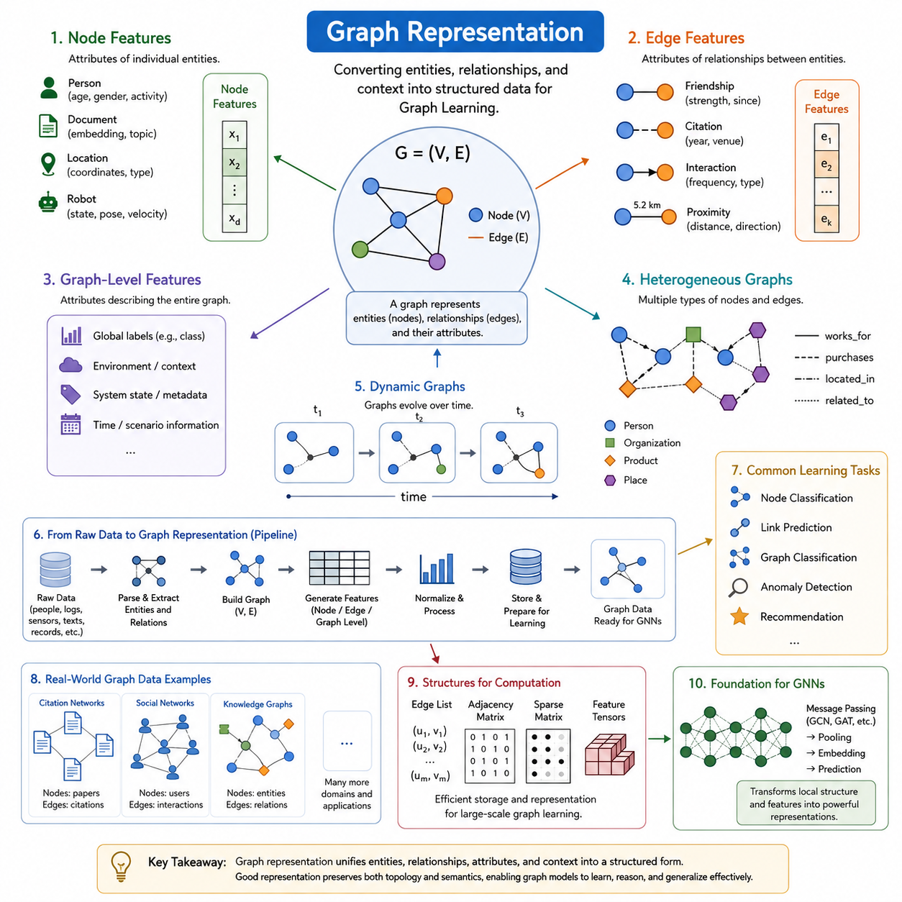
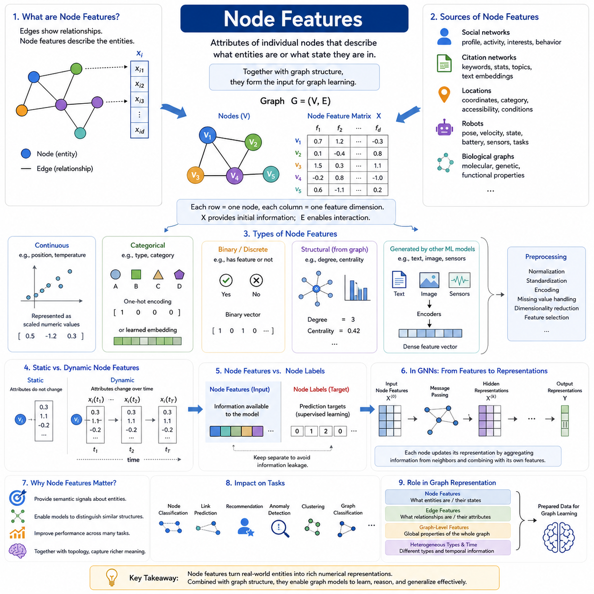
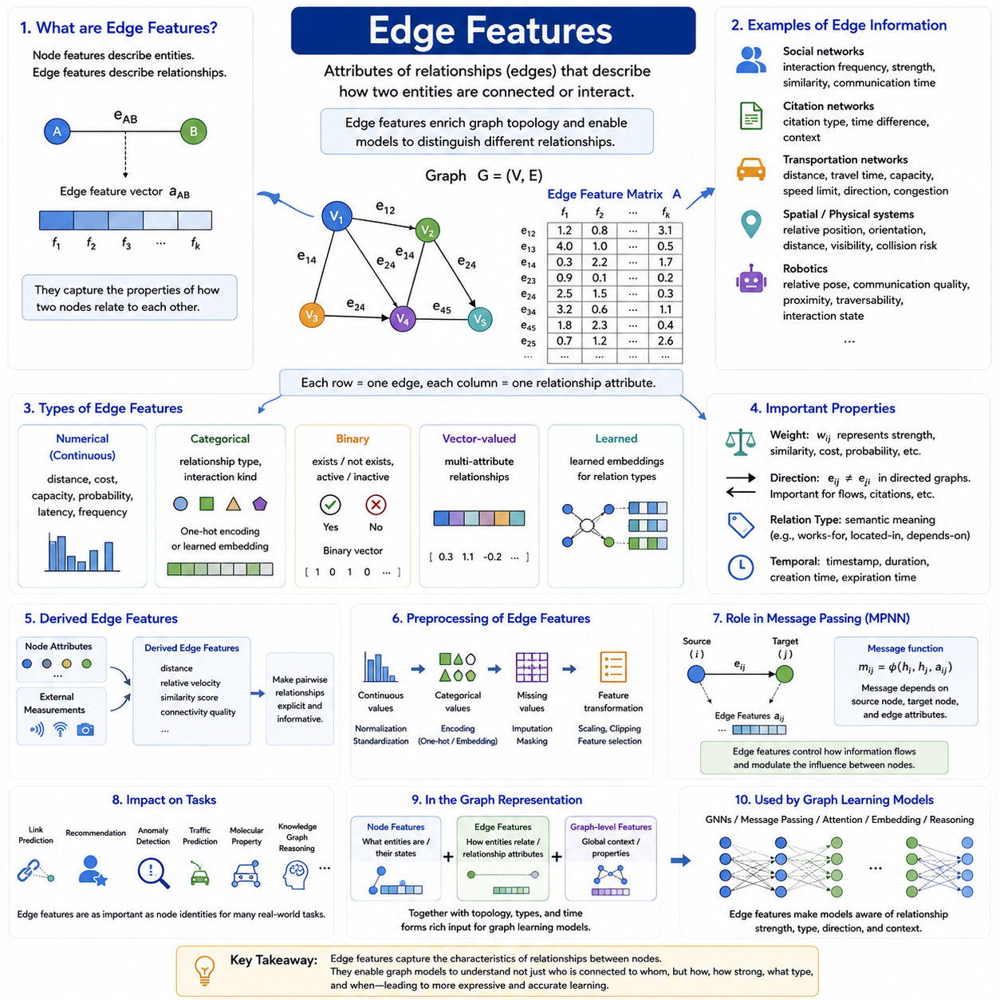
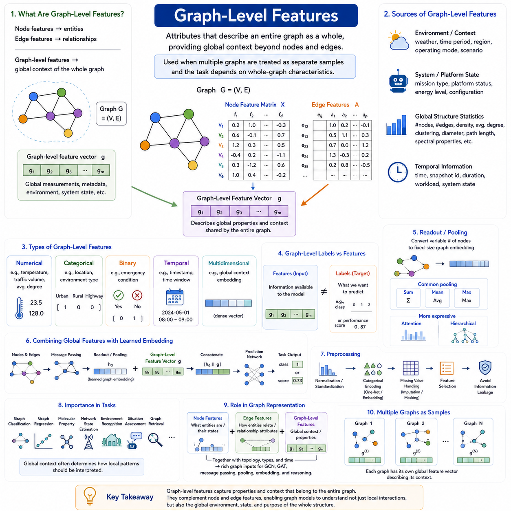
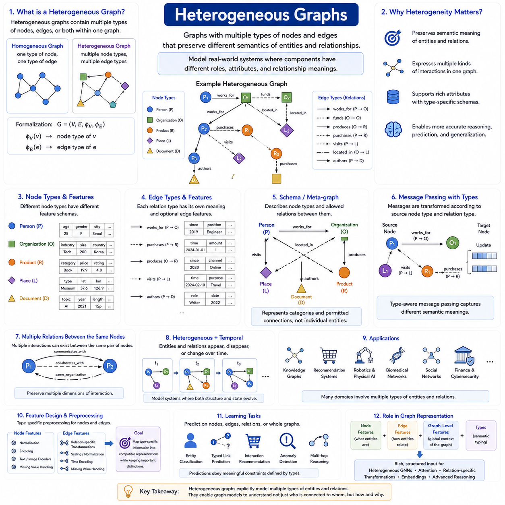
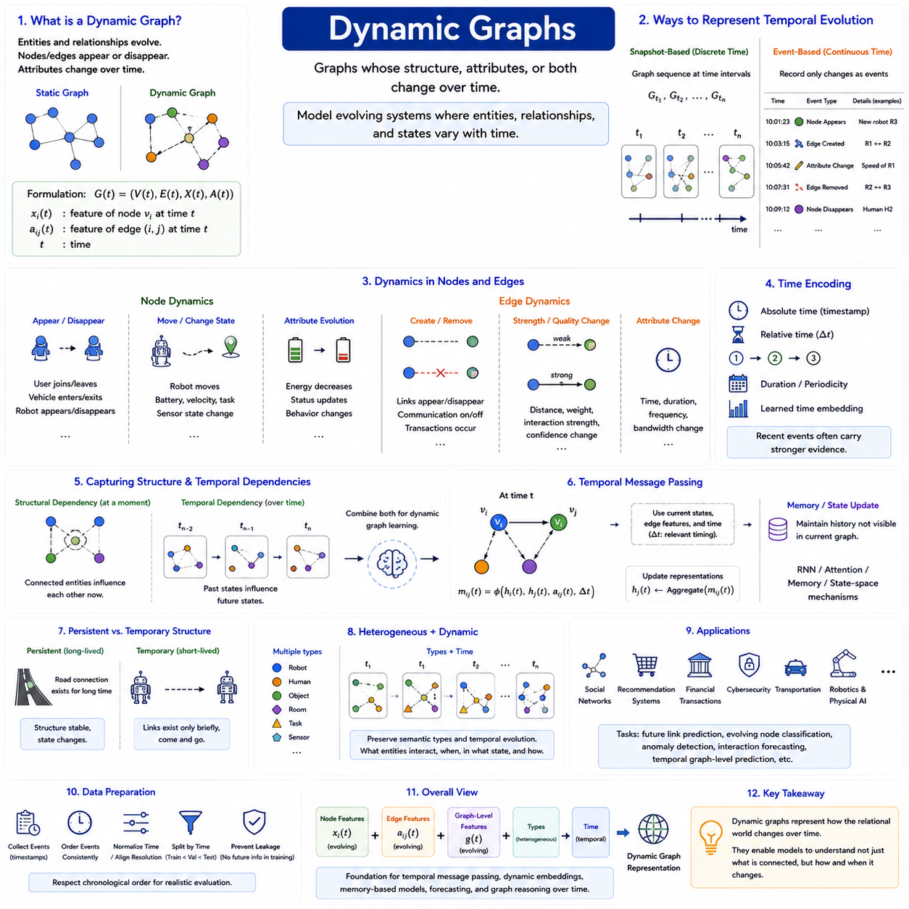
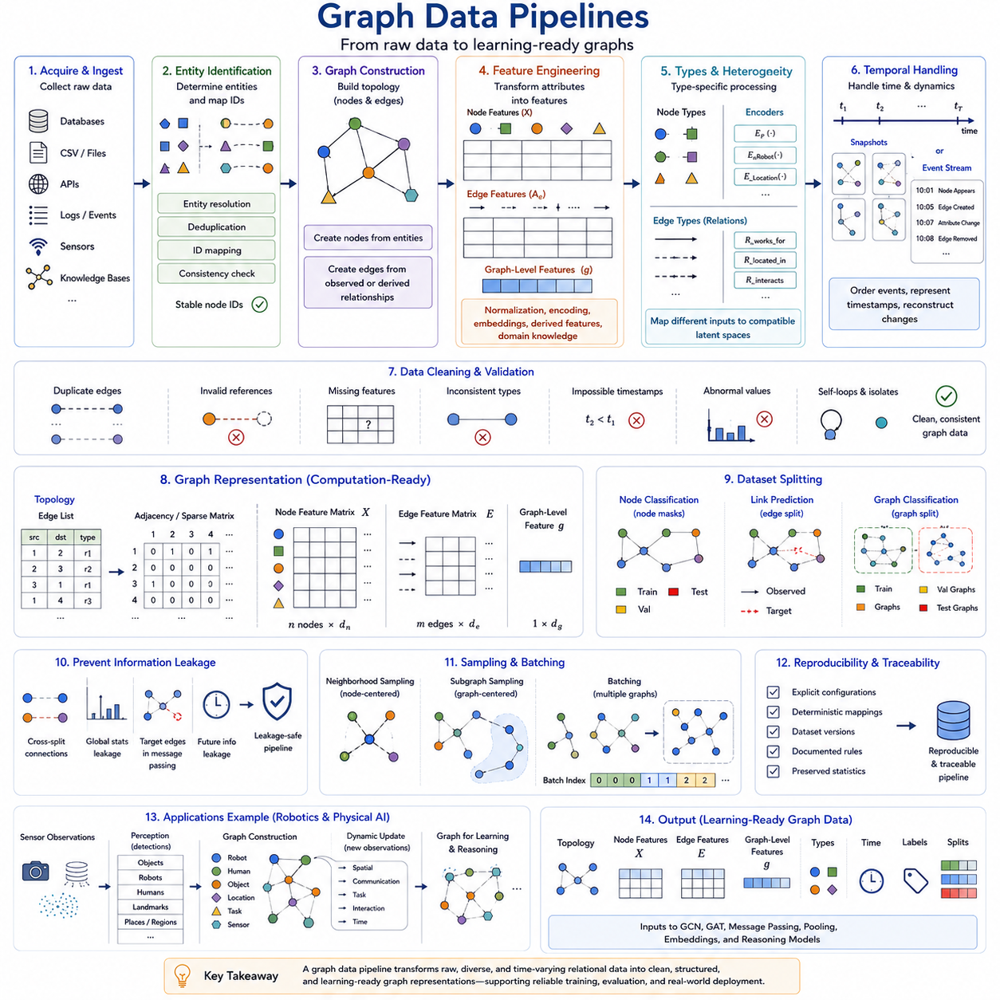
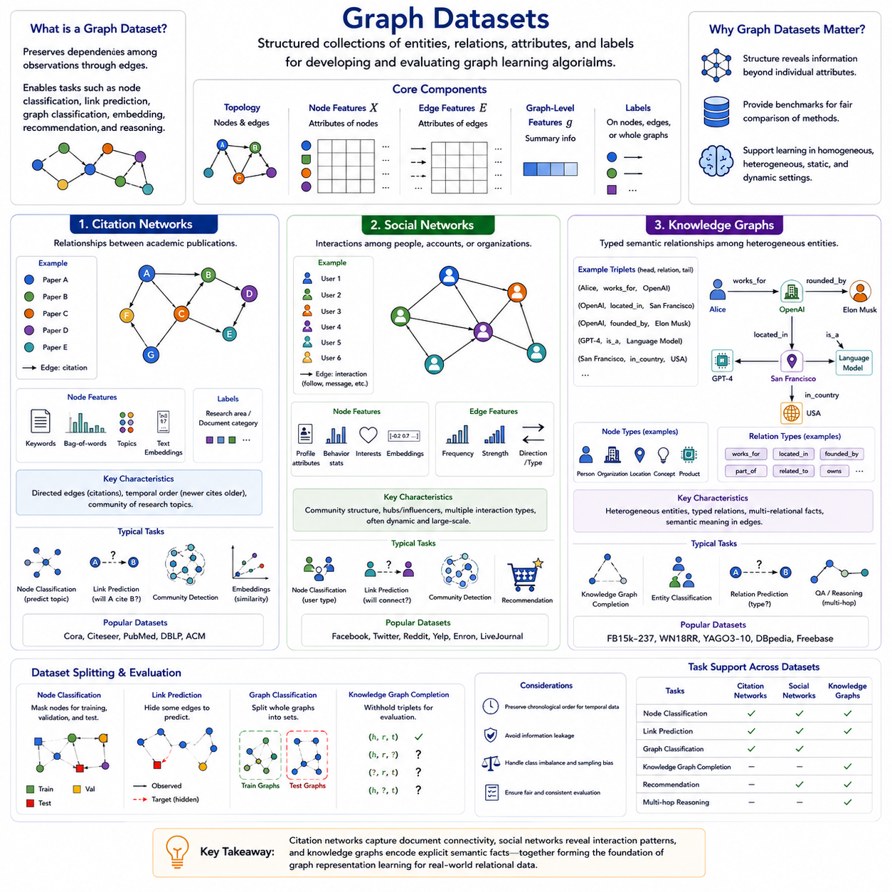

**Volume 29. Graph Deep Learning**

# Chapter 02. Graph Representation

## 02.00. Overview

{width="7.268055555555556in" height="7.268055555555556in"}

Graph representation is the process of converting entities, relationships, and contextual information into a structured form that graph learning algorithms can process. Unlike conventional data arranged as fixed-length vectors, sequences, or regular grids, graph data describes a collection of objects together with the connections among them. A graph therefore provides both attribute information and relational structure, allowing learning systems to reason about what individual entities are and how they interact.

A graph is commonly expressed as (G=(V,E)), where (V) denotes a set of nodes and (E) denotes a set of edges. In practical machine learning systems, this structural definition is usually extended with node features, edge features, graph-level attributes, labels, timestamps, and type information. The resulting representation combines topology with data, transforming an abstract mathematical graph into an input structure suitable for graph neural networks and other graph learning methods.

Node features describe properties associated with individual entities. A node representing a person might contain demographic or behavioral attributes, while a node representing a document may contain textual embeddings or topic information. In robotics, nodes can represent objects, locations, sensors, robots, or landmarks. Their features may encode position, velocity, semantic class, confidence, physical state, or learned latent representations, enabling graph models to reason about entities beyond connectivity alone.

Edge features provide information about relationships between nodes. An edge can indicate friendship in a social network, citation in a document network, connectivity in infrastructure, spatial proximity between objects, or communication between robots. Relationships may also carry attributes such as distance, direction, capacity, interaction frequency, confidence, or relative pose. Consequently, edges are not merely links; they can become information-rich representations of how entities influence or constrain one another.

Graph-level features describe properties that apply to an entire graph rather than to individual nodes or edges. Such information can include environmental conditions, system states, molecular properties, global labels, operating modes, or contextual metadata. Graph-level representations are especially important when the prediction target concerns the complete structure, as in molecular property prediction, scene classification, infrastructure assessment, or classification of an entire interaction network.

Graph representation must also accommodate heterogeneous structures. Many real systems contain several categories of entities and relationships rather than a single node and edge type. A knowledge graph may connect people, organizations, products, places, and concepts through multiple semantic relations. A robotic scene graph may similarly connect robots, objects, rooms, landmarks, and tasks. Heterogeneous representations preserve these distinctions so that learning algorithms can treat different semantic relationships appropriately.

Another important dimension is time. Static graphs assume that nodes, edges, and their attributes remain fixed during analysis, but many practical networks continuously evolve. Social interactions appear and disappear, traffic networks change state, financial transactions occur sequentially, and robots move through changing environments. Dynamic graph representations therefore incorporate timestamps, temporal events, snapshots, or continuously updated features so that models can learn not only relational structure but also how that structure evolves.

The choice of representation directly affects what information a graph learning model can recover. Two graphs with identical connectivity can describe completely different systems when their node and edge attributes differ. Conversely, similar entity attributes may produce different behavior when their relational topology changes. Effective graph representation therefore requires careful preservation of both feature semantics and structural relationships while avoiding unnecessary information that increases computational complexity without improving the learning objective.

Graph data must eventually be transformed into computational structures suitable for training and inference. Common implementations store connectivity through edge lists, adjacency structures, sparse matrices, or indexed tensors, while attributes are organized into node, edge, and graph-level feature tensors. Graph data pipelines perform tasks such as parsing raw records, assigning identifiers, constructing edges, generating features, normalizing attributes, splitting datasets, batching graphs, and preparing structures for accelerated processing.

Representation design also depends strongly on the learning objective. Node classification requires representations that preserve information useful for predicting properties of individual nodes, whereas link prediction emphasizes relationships and neighborhood structure. Graph classification requires effective aggregation of local information into global representations. Other tasks, including anomaly detection, recommendation, knowledge graph completion, spatial reasoning, and graph generation, impose different requirements on topology, attributes, labels, and sampling strategies.

Real-world datasets demonstrate the diversity of graph representations. Citation networks model publications as nodes and citations as edges, social networks represent users and their interactions, and knowledge graphs encode entities connected through semantic relations. These categories form important examples for understanding how the same mathematical graph abstraction can represent fundamentally different domains while supporting a common family of graph learning techniques.

Graph representation provides the bridge between graph theory and graph deep learning. Classical graph theory establishes concepts such as nodes, edges, adjacency, degree, connectivity, and graph structure, while representation engineering attaches machine-readable features and semantics to those structures. Once these representations are established, graph convolution, attention, message passing, pooling, and embedding methods can transform local relational information into learned representations for downstream prediction and reasoning.

This progression explains the position of graph representation between graph theory basics and later graph neural network architectures in the broader learning sequence. The chapter establishes node features, edge features, graph-level features, heterogeneous graphs, dynamic graphs, graph data pipelines, and representative datasets before moving toward GCNs, GATs, message passing, pooling, and modern GNN architectures. Graph representation is therefore the data-modeling foundation upon which subsequent graph deep learning methods operate.

## 02.01. Node Features

{width="7.268055555555556in" height="7.268055555555556in"}

Node features are the attributes associated with individual vertices in a graph and provide the descriptive information that complements graph topology. While edges specify which entities are related, node features describe what those entities are or what state they currently occupy. In graph deep learning, each node is therefore represented not only by its position within the connectivity structure but also by a collection of numerical, categorical, semantic, or learned attributes.

For a graph (G=(V,E)), a node (v_i \\in V) can be associated with a feature vector (x_i). Collecting these vectors produces a node feature matrix (X), where each row corresponds to one node and each column represents a feature dimension. This matrix provides the initial information processed by graph learning models, while the graph structure determines how information from different rows can interact through their relationships.

Node features can originate directly from measurable properties of the represented entities. In a social network, a user node may contain profile characteristics, activity statistics, interests, or behavioral indicators. In a citation network, a publication node may contain keywords, document statistics, topic descriptors, or a text embedding derived from its contents. The graph representation combines these attributes with connections such as friendships or citations.

Different domains naturally produce different feature semantics. A node representing a physical location may include coordinates, category, accessibility, occupancy, or environmental conditions. A robot node may contain pose, velocity, operating state, battery status, sensor observations, or task information. In biological graphs, node features can represent molecular, genetic, or functional properties. Graph learning provides a common framework for processing these diverse entity descriptions together with their relationships.

Node features may be continuous, discrete, categorical, binary, or multidimensional. Continuous quantities such as position, temperature, distance, or velocity can often be represented directly as numerical values after appropriate scaling. Categorical properties generally require an encoding scheme, while binary features can represent the presence or absence of particular characteristics. Complex observations such as text, images, or sensor signals are often transformed into compact feature vectors before entering the graph model.

Categorical node information can be represented using one-hot encoding when the number of possible categories is manageable. Each category is assigned a separate feature dimension, and a node activates the dimension corresponding to its category. For large categorical spaces, learned embeddings are often more efficient because they map identifiers or categories into dense vectors. These embeddings can capture similarities that cannot be expressed naturally through independent one-hot dimensions.

In some graphs, useful node attributes are unavailable or incomplete. Structural information can then contribute to the initial representation. Quantities such as node degree, neighborhood statistics, centrality measures, clustering characteristics, or positional encodings can provide signals about a node\'s role within the graph. Such structural features are especially valuable when nodes have few intrinsic attributes but their positions and connectivity patterns contain information relevant to the learning task.

Node features can also be produced by other machine learning models. Text associated with a node may be transformed using a language encoder, images may be represented using a visual encoder, and sensor observations may be compressed into learned latent vectors. This allows graph models to operate on multimodal representations in which each node summarizes complex information while graph edges specify relationships among the encoded entities.

Feature preprocessing is important because different node attributes may have incompatible scales and statistical distributions. Large numerical ranges can dominate smaller quantities during optimization, while missing or noisy values can degrade representation quality. Normalization, standardization, categorical encoding, missing-value handling, dimensionality reduction, and feature selection can therefore become important parts of the graph data pipeline before node features are supplied to a learning architecture.

Node features may be static or dynamic depending on the application. A permanent object category may remain unchanged throughout the lifetime of a graph, whereas position, velocity, interaction state, sensor measurements, or operational conditions can vary continuously. In dynamic graphs, the representation of node (v_i) can consequently become (x_i(t)), allowing the same entity to retain its identity while its observable or latent state evolves over time.

The meaning of node features should be distinguished from node labels. Features constitute information available to the model as input, whereas labels generally represent prediction targets used for supervised learning. For example, attributes of a document may form its node features while its research category becomes the target label. Maintaining this distinction is essential for preventing information leakage and for constructing valid training, validation, and test procedures.

Graph neural networks progressively transform initial node features into learned node representations. During message passing, each node receives information derived from neighboring nodes and combines that relational context with its own representation. Repeated layers can therefore encode increasingly broad neighborhoods. The resulting hidden representation reflects both the original attributes of the node and structural information gathered from its surrounding graph.

This transformation is one of the central reasons node features matter in graph deep learning. Two nodes with similar initial attributes can acquire different representations when they occupy different relational contexts, while initially different nodes can become similar when their neighborhoods provide comparable evidence. Graph learning thus moves beyond independent feature processing by making the meaning of an entity dependent partly on the entities and relationships surrounding it.

The quality of node features directly influences downstream tasks such as node classification, link prediction, recommendation, anomaly detection, clustering, graph classification, and relational reasoning. Informative features provide useful semantic signals, but topology can enrich those signals through neighborhood aggregation. Conversely, poorly designed features may introduce irrelevant variation or hide important distinctions that graph connectivity alone cannot recover.

Within graph representation, node features form one layer of a broader data model that also includes edge features, graph-level features, heterogeneous node and relationship types, temporal information, and graph data pipelines. This organization prepares the data for later graph convolution, attention, message passing, pooling, and embedding methods. Node representation is therefore the fundamental mechanism by which real-world entities become computational objects that graph deep learning systems can learn from.

## 02.02. Edge Features

{width="7.268055555555556in" height="7.268055555555556in"}

Edge features describe the properties of relationships connecting pairs of nodes in a graph. While node features characterize individual entities, edge features explain how two entities are related, interact, or influence one another. They enrich graph topology by attaching information to connections, allowing graph learning models to distinguish relationships that would otherwise appear identical when represented only as links between nodes.

For a graph (G=(V,E)), an edge (e_{ij}\\in E) connects node (v_i) with node (v_j). The edge can be associated with a feature vector (a_{ij}) containing attributes of that relationship. Collecting these vectors forms an edge feature matrix in which each row corresponds to an edge and each column represents a relationship property. This representation allows connectivity and relationship attributes to be processed together by graph learning algorithms.

Edge features can represent many kinds of information depending on the application domain. In a social network, an edge may contain interaction frequency, relationship strength, communication duration, or similarity between users. In citation networks, edges can contain citation type, publication time difference, or contextual information. In transportation networks, an edge may represent road length, travel time, capacity, speed limit, congestion, or direction of movement.

Physical and spatial systems often rely heavily on informative edge attributes. Relationships between objects can contain relative position, orientation, distance, visibility, collision risk, or spatial constraints. In robotics, edges between robots, landmarks, sensors, objects, and locations may encode relative pose, communication quality, proximity, traversability, or interaction state. These attributes enable graph models to represent physical relationships that cannot be captured adequately through connectivity alone.

Edge features may be numerical, categorical, binary, vector-valued, or learned. Numerical attributes include quantities such as distance, cost, latency, probability, capacity, or interaction frequency. Categorical features can identify relationship types, while binary attributes may indicate whether a particular condition exists. More complex relationships can be represented by multidimensional vectors that combine several properties into a unified edge representation suitable for neural processing.

A fundamental edge property is weight. A weighted graph assigns a numerical value (w_{ij}) to an edge, representing quantities such as similarity, importance, distance, probability, or connection strength. Edge weights may directly influence graph computation by determining how strongly information travels between nodes. However, a general edge feature vector is broader than a single weight because it can simultaneously represent multiple characteristics of the same relationship.

Direction is another important component of edge representation. In an undirected graph, the relationship between (v_i) and (v_j) is treated symmetrically, whereas a directed graph distinguishes (e_{ij}) from (e_{ji}). This distinction is essential for relationships such as citation, information flow, dependency, transportation, and command structures. Direction can be represented structurally through directed edges and supplemented with features describing the properties of each directional interaction.

Edge features can also encode semantic relationship types. In heterogeneous graphs, different edges may represent relations such as works-for, located-in, owns, communicates-with, connected-to, or depends-on. These relations have fundamentally different meanings even when they connect the same categories of nodes. Explicit relationship types allow heterogeneous graph models to apply different transformations or message-passing rules according to the semantics of each connection.

Temporal information is especially important when relationships change over time. An interaction edge may contain a timestamp, duration, creation time, expiration time, or sequence index. Dynamic graph systems can use such information to determine when relationships existed and how their properties evolved. An edge can therefore be represented as a time-dependent relationship (e_{ij}(t)), with features (a_{ij}(t)) describing its changing state at different moments.

Some edge features are directly observed, whereas others are derived from node attributes or external measurements. For example, geographic coordinates stored as node features can be used to calculate distance between connected nodes. Relative velocity can be derived from individual motion states, and similarity scores can be computed from node embeddings. Derived edge features can make relationships more explicit and reduce the burden on the graph model to infer important pairwise quantities indirectly.

As with node features, edge attributes often require preprocessing before training. Continuous values may need normalization or standardization, categorical relationships may require one-hot encoding or learned embeddings, and missing edge values must be handled consistently. Feature transformations should preserve the semantics of the relationship because inappropriate scaling or encoding can distort the relative importance of different interactions during message passing and optimization.

Edge features play a direct role in message passing neural networks. Instead of generating a message solely from the representation of a neighboring node, a model can compute a message using the source node, destination node, and their connecting edge. Conceptually, a message may be expressed as (m_{ij}=\\phi(h_i,h_j,a_{ij})), where (h_i) and (h_j) are node representations and (a_{ij}) contains edge attributes. The function (\\phi) learns how relationship information should modify communication between nodes.

This edge-aware message passing provides substantially richer relational modeling. The same neighboring node can contribute differently depending on distance, relationship type, confidence, direction, or interaction strength. A nearby object may influence a robot more strongly than a distant object, while a high-capacity communication link may carry different significance from an unreliable connection. Edge features therefore act as contextual information controlling how relational evidence is interpreted and propagated.

The importance of edge features varies across graph learning tasks. Link prediction may use them to estimate whether relationships should exist or how they may evolve. Recommendation systems can represent interaction type and frequency, while anomaly detection can identify unusual relationship patterns. Transportation, molecular, knowledge, social, and robotic graphs frequently depend on edge attributes because the characteristics of interactions are as important as the identities of the connected entities.

Within the overall graph representation structure, edge features complement node features and graph-level features. Node features describe what individual entities are, edge features describe how those entities relate, and graph-level features characterize the global context containing them. Together with heterogeneous types, temporal information, and graph topology, these representations provide the structured input required by later graph convolution, attention, message passing, embedding, and reasoning methods.

## 02.03. Graph Level Features

{width="7.268055555555556in" height="7.268055555555556in"}

Graph-level features describe properties that belong to an entire graph rather than to individual nodes or edges. While node features characterize entities and edge features characterize relationships, graph-level features provide global context about the complete structure being modeled. They are especially important when multiple graphs are treated as separate samples and the learning objective depends on characteristics of each graph as a whole.

For a graph (G=(V,E)), graph-level information can be represented by a feature vector (g) associated with the complete graph. Its dimensions may encode global measurements, metadata, environmental conditions, operating states, or other contextual variables. A graph learning system can combine (g) with node feature matrix (X) and edge attributes, producing a representation that simultaneously captures local entities, relationships, and global context.

Graph-level features should be distinguished from graph-level representations learned by a neural network. A graph-level feature is typically supplied as input information, whereas a learned graph representation or graph embedding is generated by aggregating information from nodes and edges. The two can be combined: externally provided global attributes describe known context, while learned embeddings summarize structural and semantic patterns discovered from the graph itself.

Many graph-level features originate from metadata describing the environment or system in which a graph exists. A transportation graph might include weather, traffic period, regional conditions, or operating mode. A robotic scene graph may include mission type, environment category, platform state, or scenario information. These variables affect the interpretation of many nodes and edges simultaneously and are therefore naturally represented at the global graph level.

Global structural statistics can also be used as graph-level features. Examples include the number of nodes and edges, graph density, average degree, degree distribution statistics, connected-component counts, clustering coefficients, diameter, path-length statistics, or spectral properties. Such quantities summarize aspects of topology that may be difficult to recover efficiently from raw connectivity when they are directly relevant to the prediction problem.

The usefulness of structural features depends on the application and should not be assumed automatically. Node count may be highly informative in one task but irrelevant or even misleading in another. Similarly, graph density or average degree can unintentionally reveal dataset-specific biases. Graph-level feature engineering therefore requires understanding whether a global statistic represents meaningful domain information or merely reflects artifacts of data collection and preprocessing.

Graph-level features may be numerical, categorical, binary, temporal, or multidimensional. Continuous quantities can represent physical measurements or global statistics, categorical variables can identify environments or operating modes, and binary values can indicate global conditions. Complex graph context can also be encoded as a dense vector, allowing multiple global properties to be supplied to the model in a unified numerical representation.

Temporal context can become a graph-level feature when an entire graph corresponds to a particular time interval or system state. For example, successive graphs may represent snapshots (G_{t_1},G_{t_2},\...,G_{t_n}) of an evolving network. Each snapshot can contain global variables describing time, environmental conditions, workload, or scenario state. This allows temporal graph models to distinguish structural changes caused by local interactions from changes associated with global conditions.

Graph-level labels are related to but conceptually different from graph-level features. Features provide information available to the model, whereas labels represent targets to be predicted during supervised learning. A molecular graph may contain global experimental conditions as features while molecular toxicity is used as a target. Similarly, a system graph may include operating conditions as input while failure state or performance class becomes the prediction label.

A central operation in graph-level learning is readout or pooling, which converts a variable number of node representations into a fixed-dimensional graph representation. Common approaches conceptually aggregate node information using operations such as sum, mean, or maximum, while more advanced methods learn attention-based or hierarchical aggregation. The resulting vector provides a compact summary that can be used for graph classification, regression, retrieval, comparison, or downstream reasoning.

Simple pooling methods encode different assumptions. Sum pooling preserves information related to graph size because contributions accumulate as the number of nodes increases. Mean pooling emphasizes the average characteristics of nodes and reduces direct dependence on graph size. Maximum pooling retains strong feature activations occurring anywhere in the graph. Selecting an aggregation method therefore influences which global properties are emphasized in the learned graph representation.

More expressive graph-level representations can be obtained when aggregation is learned rather than fixed. Attention mechanisms can assign different importance to nodes according to the current task, while hierarchical pooling can progressively group nodes into higher-level structures before producing a global embedding. These approaches allow the model to identify important subgraphs, communities, functional components, or spatial regions rather than treating every node as equally informative.

Externally supplied graph-level features can be fused with learned graph embeddings before prediction. Conceptually, a pooled representation (h_G) can be combined with global input vector (g), producing a joint representation such as ([h_G \\Vert g]). A prediction network can then use both relational information learned from nodes and edges and contextual information describing the entire graph. This is useful when global conditions influence how local patterns should be interpreted.

Preprocessing graph-level attributes follows principles similar to node and edge feature preparation. Numerical variables may require normalization or standardization, categorical variables may use one-hot encoding or learned embeddings, and missing values require consistent treatment. Particular care is necessary when global features encode information correlated with prediction labels, because inappropriate feature construction can create information leakage and produce misleading evaluation results.

Graph-level features and representations support applications in which the complete graph is the fundamental unit of prediction. Molecular graphs can be classified according to chemical properties, interaction graphs according to behavioral patterns, and infrastructure networks according to operational states. In robotics and spatial AI, complete scene or system graphs can support environment recognition, situation assessment, mission-level reasoning, and comparison between different operational configurations.

Within the overall graph representation framework, graph-level features complete a hierarchy of information. Node features describe individual entities, edge features describe relationships between them, and graph-level features describe the global environment, state, or properties shared by the complete structure. Together with heterogeneous types, dynamic information, and graph topology, these components create rich graph inputs for later GCN, GAT, message-passing, pooling, embedding, and graph reasoning methods.

## 02.04. Heterogeneous Graphs

{width="7.268055555555556in" height="7.268055555555556in"}

Heterogeneous graphs represent systems containing multiple types of nodes, edges, or both within a single graph structure. Unlike homogeneous graphs, where nodes and relationships are usually treated as belonging to the same semantic category, heterogeneous graphs preserve distinctions among different kinds of entities and interactions. This makes them suitable for modeling complex real-world systems whose components have different roles, attributes, and relationship meanings.

A heterogeneous graph can be described as (G=(V,E)) together with node-type and edge-type mappings. A node-type function assigns each node to a semantic category, while an edge-type function identifies the meaning of each relationship. Consequently, two nodes may have different feature spaces, and two edges connecting similar entities may represent fundamentally different interactions. Type information therefore becomes an explicit part of the graph representation.

Consider a knowledge graph containing people, organizations, products, places, and documents. A person may work for an organization, purchase a product, visit a place, or author a document. These relations cannot be interpreted as interchangeable connections because each expresses a different semantic meaning. A heterogeneous representation retains these distinctions and enables a graph learning model to reason about both entity identity and relationship semantics.

Node types often possess different feature schemas. A person node might contain demographic or behavioral attributes, an organization node may contain industry and size information, and a product node may contain category, price, and technical properties. Because these features have different meanings and dimensions, heterogeneous graph models frequently use type-specific encoders that transform different raw attributes into compatible latent representations before relational learning begins.

Edge heterogeneity introduces another level of complexity. Relationships such as works-for, owns, located-in, communicates-with, purchases, and depends-on can connect different combinations of node types. Each relation may also contain its own edge features, including strength, frequency, timestamp, confidence, distance, or direction. Preserving these relationship types prevents semantically different interactions from being collapsed into a single generic adjacency structure.

A useful abstraction for heterogeneous graphs is the graph schema or network schema. The schema describes which node types exist and which relation types are permitted between them. Instead of representing individual entities, it represents categories and their allowable connections. This higher-level description helps define the semantic organization of the graph and provides graph learning models with information about how different classes of entities can interact.

Typed relationships are often represented as triplets such as ((\\text{source type},\\text{relation type},\\text{destination type})). For example, ((Person, works_for, Organization)) and ((Organization, produces, Product)) represent different semantic channels. Graph learning systems can associate separate parameters or transformation functions with these relation types, allowing information to be processed according to the meaning of each connection rather than treating every edge identically.

Message passing in heterogeneous graphs must therefore account for type information. A message sent from a sensor to a robot may require a different transformation from a message sent from another robot, object, or location. The model can first transform information according to source node type and relation type, aggregate messages arriving through different relations, and then update the destination node representation according to its own semantic role.

Relation-specific processing increases expressive power because identical node features can have different meanings depending on how entities are connected. Information received through a located-in relation should not necessarily be interpreted in the same way as information received through an owns or communicates-with relation. Heterogeneous graph learning explicitly models these semantic differences and can learn which relation types are most informative for a particular prediction or reasoning task.

Heterogeneous graphs can also contain multiple relations between the same pair of nodes. Two users may communicate, collaborate, and belong to the same organization simultaneously. A robot and a location may have relations describing current occupancy, navigation history, accessibility, and task assignment. Such multi-relational structures preserve several dimensions of interaction that would be lost if all connections were reduced to a single edge type.

Temporal information can further extend heterogeneous graph representation. Different node and edge types may appear, disappear, or change attributes over time. A robot can move between locations, an object can change ownership, and communication links can vary in quality or availability. Combining heterogeneous and dynamic graph concepts therefore enables representation of systems in which both semantic structure and relational state evolve continuously.

Robotic and physical AI systems provide natural examples of heterogeneous graphs. Nodes may represent robots, humans, objects, rooms, landmarks, sensors, tasks, or infrastructure components. Relations may describe observes, located-in, connected-to, assigned-to, communicates-with, near, carries, or interacts-with. Such representations integrate spatial, semantic, operational, and relational information into a common structure suitable for scene understanding and multi-agent reasoning.

Knowledge graphs are another important application because their fundamental purpose is to organize different entity and relation types. Recommendation systems can similarly represent users, products, categories, and interactions within one network. Other applications include biomedical networks, academic graphs, financial systems, cybersecurity networks, transportation systems, and industrial environments where multiple classes of entities participate in different kinds of relationships.

Designing heterogeneous graph features requires careful preprocessing. Different node types may require separate normalization, categorical encoding, text or image encoders, and missing-value strategies. Relation types may also require individual feature transformations. The objective is not to force all raw data into identical semantics, but to map type-specific information into representations that can interact meaningfully during graph learning while retaining important distinctions.

The output of heterogeneous graph learning can target nodes, edges, relations, or complete graphs. Models may classify entities, predict missing typed links, recommend interactions, detect anomalous relationships, or infer multi-step semantic connections. Because the graph explicitly preserves entity and relation types, predictions can obey meaningful constraints, such as determining which categories of entities can participate in a particular relationship.

Within graph representation, heterogeneous graphs extend node features, edge features, and graph-level features by adding explicit semantic typing. They transform a graph from a generic network of vertices and connections into a structured relational model containing multiple classes of entities and interactions. This foundation prepares the data for heterogeneous message passing, attention, relation-specific transformations, embeddings, and advanced graph reasoning methods used in modern graph deep learning.

## 02.05. Dynamic Graphs

{width="7.268055555555556in" height="7.268055555555556in"}

Dynamic graphs represent systems whose structure, attributes, or both change over time. In a static graph, the node set, edge set, and associated features are treated as fixed during analysis. A dynamic graph instead models an evolving state in which entities may appear or disappear, relationships may be created or removed, and node or edge attributes may continuously change as the underlying system develops.

A dynamic graph can be expressed conceptually as (G(t)=(V(t),E(t))), where the graph depends on time (t). Node features may similarly become (x_i(t)), while edge features can be represented as (a_{ij}(t)). This formulation makes time an explicit component of graph representation and allows the same graph system to describe changing connectivity, evolving entity states, and time-dependent relationships.

Dynamic graphs are commonly represented using either discrete snapshots or continuous event streams. In a snapshot representation, the evolving system is divided into graphs (G_{t_1},G_{t_2},\...,G_{t_n}), each describing the state during a particular time interval. This approach provides a sequence of static graphs and is convenient when observations naturally arrive at regular intervals or when temporal resolution can be discretized.

Event-based representation records individual changes rather than reconstructing the entire graph at every time step. An event can indicate that a node appeared, an edge was created, an interaction occurred, or an attribute changed. Each event is associated with a timestamp and relevant features. This representation can preserve fine-grained temporal information and is useful for systems in which interactions occur asynchronously or at irregular intervals.

Node dynamics describe how entities and their states evolve. A user can join or leave a social platform, a vehicle can enter or exit a transportation network, and a robot can move between locations while its battery, velocity, task, and sensor state change. Dynamic node features preserve entity identity while allowing its representation to evolve, enabling models to distinguish persistent entities from their changing conditions.

Edge dynamics describe changes in relationships between entities. Communication links can appear or disappear, transactions can occur between accounts, roads can become congested, and robots can establish temporary coordination relationships. Edge attributes such as distance, interaction strength, communication quality, confidence, or relative pose may also change even when the underlying connection remains present.

Time itself can be encoded in several ways. A graph representation may include absolute timestamps, relative time differences, event ordering, duration, periodic information, or learned temporal embeddings. Relative time is particularly useful because the significance of an interaction often depends on how recently it occurred. A recent event may provide stronger evidence about the current state than an otherwise similar interaction observed much earlier.

Dynamic graphs require models to capture two complementary dimensions of information: structural dependency and temporal dependency. Structural dependency explains how connected entities influence one another at a particular moment, while temporal dependency explains how previous graph states influence later states. Effective dynamic graph learning therefore combines relational reasoning across nodes and edges with mechanisms that preserve and update information through time.

Temporal message passing extends conventional graph message passing by considering when interactions occur. A message from node (v_i) to (v_j) can depend on their current representations, edge attributes, and temporal information. Conceptually, a temporal message may be written as (m_{ij}(t)=\\phi(h_i(t),h_j(t),a_{ij}(t),\\Delta t)), where (\\Delta t) describes relevant timing information associated with the interaction.

Memory mechanisms can help maintain historical information that is not visible in the current graph alone. A node\'s current representation may depend not only on its present neighbors but also on previous interactions and earlier states. Recurrent networks, temporal attention, state-space mechanisms, or learned memory modules can update representations as events arrive, allowing the graph model to maintain compact summaries of historical relational activity.

Dynamic graph learning must also address the distinction between persistent and temporary structure. Some relationships remain stable for long periods, while others exist only briefly. A road connection may be structurally permanent even though its traffic state changes rapidly, whereas a communication link between mobile robots may appear only when they are within range. Separating structural persistence from dynamic state can produce more meaningful representations.

Heterogeneity and dynamics frequently occur together in real systems. A robotic environment may contain robots, humans, objects, sensors, rooms, and tasks whose attributes and relationships change over time. A heterogeneous dynamic graph can preserve both semantic type information and temporal evolution, enabling a model to distinguish not only what kinds of entities interact but also when, in what state, and through which type of relationship.

Dynamic graphs are particularly important in robotics and physical AI because physical environments are inherently time dependent. Robots move, objects change position, humans enter and leave scenes, tasks are reassigned, communication conditions vary, and sensor observations continuously update. A dynamic graph can provide a structured representation of this evolving world and support prediction, planning, coordination, and situation understanding.

Other important applications include social networks, recommendation systems, financial transaction networks, cybersecurity, transportation, communication systems, and scientific interaction networks. These domains contain events and relationships whose temporal ordering carries essential information. Dynamic graph models can support tasks such as future link prediction, evolving node classification, anomaly detection, interaction forecasting, and temporal graph-level prediction.

Preparing dynamic graph data requires careful synchronization and temporal splitting. Events must be ordered consistently, timestamps normalized when necessary, and observations aligned with the temporal resolution of the task. Training, validation, and test sets should generally respect chronological order when predicting future behavior, because randomly mixing future events into training data can create temporal information leakage and unrealistic evaluation results.

Within graph representation, dynamic graphs add the dimension of time to node features, edge features, graph-level features, and heterogeneous structures. They transform a graph from a fixed description of relationships into an evolving representation of entities, interactions, and states. This foundation enables temporal message passing, dynamic embeddings, memory-based graph models, forecasting, and later graph reasoning methods that must understand not only what is connected, but how the relational world changes over time.

## 02.06. Graph Data Pipelines [w/Code]

{width="7.268055555555556in" height="7.268055555555556in"}

A graph data pipeline is the sequence of operations that transforms raw relational data into graph structures that can be used reliably by graph learning models. Real-world data rarely arrives as a ready-to-train graph. Instead, information may be distributed across databases, tables, logs, sensor streams, documents, or event records. The pipeline converts these sources into nodes, edges, features, labels, and graph-level information while preserving their intended semantics.

The first stage is data acquisition and ingestion. Raw information may come from relational databases, CSV files, APIs, transaction logs, knowledge bases, simulation environments, sensors, or distributed systems. At this stage, the objective is to collect the entities and interactions required by the graph definition. Metadata such as timestamps, identifiers, source information, and measurement confidence should also be retained when they may later contribute to graph construction or validation.

Entity identification determines which records should become nodes and how their identities are maintained across data sources. A single physical or logical entity may appear under multiple identifiers, while different entities may accidentally share similar names or attributes. Entity resolution, deduplication, identifier mapping, and consistency checking are therefore important operations. Stable node identifiers allow relationships and features to be attached to the correct entities throughout the pipeline.

Graph construction converts identified entities and interactions into a topology. Nodes are created from entities, while edges are generated from observed or defined relationships. Edge construction may follow explicit records such as transactions and citations, or derived rules such as spatial proximity, similarity thresholds, communication range, or temporal interaction. The construction policy is important because it determines which relational dependencies the learning model will be able to observe.

Feature engineering transforms raw attributes into machine-readable node, edge, and graph-level features. Numerical measurements may be normalized, categorical variables encoded, text transformed into embeddings, and images or sensor observations processed by specialized encoders. Derived features such as relative distance, interaction frequency, centrality, or temporal intervals may also be computed. The objective is to preserve useful domain information while producing representations suitable for graph computation.

Graph pipelines must accommodate different feature schemas when heterogeneous graphs are involved. Each node type may require its own preprocessing and encoder, while different relation types may contain distinct edge attributes. A robot, sensor, task, and location should not necessarily share the same raw feature representation. Type-specific processing can map these different inputs into compatible latent spaces while preserving their semantic distinctions for later heterogeneous message passing.

Dynamic graph pipelines introduce additional temporal requirements. Events must be ordered by time, timestamps must be represented consistently, and changes in nodes, edges, and attributes must be reconstructed correctly. Depending on the learning method, the pipeline may create discrete graph snapshots or retain events as a continuous temporal stream. Temporal ordering is particularly important because future information must not accidentally influence representations intended to model earlier states.

Data cleaning and validation ensure that the constructed graph is internally consistent. Pipelines may detect duplicated edges, invalid node references, missing features, impossible timestamps, inconsistent relationship types, or abnormal numerical values. Self-loops and isolated nodes must be handled according to the intended graph model rather than removed automatically. Validation should confirm that graph transformations preserve the semantics required by the downstream learning objective.

After construction, graph data is commonly converted into computational representations such as edge lists, adjacency structures, sparse matrices, and indexed tensors. Node features may be stored in matrix (X), connectivity in an edge index or adjacency representation, and edge features in a corresponding attribute tensor. Sparse representations are particularly important because many real graphs contain far fewer edges than the maximum number of possible node pairs.

Dataset splitting is a critical part of the graph pipeline because relational dependencies make conventional random splitting potentially problematic. Node classification may require node-level masks, graph classification may divide complete graphs into separate subsets, and link prediction must carefully separate observed and target edges. Dynamic graphs generally require chronological splitting so that training data precedes validation and test periods, preventing unrealistic access to future information.

Information leakage deserves particular attention in graph datasets. A node in the training set may be connected to validation or test nodes, and preprocessing operations can unintentionally use statistics calculated from the entire dataset. Link prediction can leak target edges into message passing, while temporal tasks can expose future events. A correct pipeline therefore defines explicitly which information is available at each training and evaluation stage rather than assuming that ordinary dataset splitting is sufficient.

Large graphs often require sampling because processing every node and edge simultaneously may exceed memory or computation limits. Neighborhood sampling selects a subset of neighbors around target nodes, while subgraph sampling extracts smaller relational regions for training. Graph-level datasets may instead batch multiple independent graphs. Sampling strategies should preserve enough local and structural information for learning while controlling computational cost and avoiding systematic sampling bias.

Batching graph data differs from batching fixed-size vectors or images because graphs can contain different numbers of nodes and edges. Multiple graphs can be combined into a disconnected larger graph while retaining an index indicating which nodes belong to each original sample. For node-centered tasks, sampled neighborhoods can form mini-batches. Efficient batching enables parallel processing on accelerators without requiring every graph to have identical dimensions.

Graph pipelines also need reproducibility and traceability. The transformation from raw records to training graphs should be governed by explicit configurations, deterministic mappings where possible, dataset versions, and documented preprocessing rules. Feature definitions, graph construction thresholds, split policies, and normalization statistics should be preserved with the dataset. This allows experiments to be repeated and prevents silent changes in preprocessing from being mistaken for improvements in model architecture.

For robotics and physical AI, graph data pipelines can connect perception and relational learning. Sensor observations may first produce detected objects, robots, humans, landmarks, traversable regions, or semantic locations. These entities become nodes, while spatial, communication, task, or interaction relationships become edges. As new observations arrive, the graph can be updated dynamically, creating a structured interface between raw physical-world observations and higher-level graph reasoning.

The final output of a graph data pipeline is not simply a graph file but a learning-ready representation containing topology, node features, edge features, graph-level context, type information, temporal information, labels, and dataset partitions as required by the task. These components become inputs to later GCN, GAT, message-passing, pooling, embedding, and reasoning models. A well-designed pipeline therefore forms the operational bridge between raw relational data and graph deep learning.

## 02.07. Graph Datasets

{width="7.268055555555556in" height="7.268055555555556in"}

Graph datasets provide structured collections of entities, relationships, attributes, and labels for developing and evaluating graph learning algorithms. Unlike conventional datasets composed of independent samples, graph datasets preserve dependencies among observations through edges. Their organization determines which relational patterns a model can learn and strongly influences tasks such as node classification, link prediction, graph classification, embedding, recommendation, and relational reasoning.

A graph dataset generally contains topology together with node, edge, and sometimes graph-level information. Nodes represent entities, edges encode relationships, and features provide measurable or learned attributes associated with them. Labels may be attached to nodes, edges, or complete graphs depending on the learning objective. Dataset preparation therefore involves not only collecting samples but also defining how entities and relationships should be represented computationally.

Citation networks are a widely used category of graph datasets in graph machine learning. Publications are typically represented as nodes, while citations between publications form edges. Node features can encode document content through keywords, bag-of-words representations, topic information, or learned text embeddings. Labels commonly represent research areas or document categories, making citation networks particularly suitable for studying node classification and representation learning.

Citation relationships provide information beyond the content of individual documents. Papers addressing related subjects frequently cite overlapping or related literature, producing neighborhoods with meaningful academic structure. Graph learning models can therefore combine document features with citation connectivity when constructing node representations. This makes citation networks useful for demonstrating how relational context can improve predictions beyond independent feature-based classification.

Citation networks can also support link prediction and scientific network analysis. A model may estimate whether one publication is likely to cite another, identify related research communities, or learn embeddings that reflect structural and semantic similarity. Citation direction and publication time can additionally provide important information because citations normally connect newer work to previously available research, introducing both directed and temporal characteristics into the graph.

Social networks represent people, accounts, organizations, communities, or other social entities as nodes connected through interactions or relationships. Edges may indicate friendship, following, communication, collaboration, membership, or other forms of association. Node features can contain profile attributes, behavioral statistics, interests, activity patterns, or learned representations, while edge features can describe interaction frequency, strength, direction, duration, or type.

Social graph datasets illustrate how connectivity can reveal information that is not directly available from individual attributes. Communities often emerge from dense interaction patterns, influential nodes can occupy structurally important positions, and similar users may form characteristic neighborhoods. These properties make social networks useful for node classification, community detection, recommendation, influence analysis, link prediction, anomaly detection, and graph representation learning.

Social networks may be homogeneous or heterogeneous depending on their construction. A simple friendship network can contain one user type and one relationship type, while a richer platform graph may contain users, posts, groups, topics, and organizations connected through multiple relations. Social interactions are also naturally dynamic because connections, communication patterns, interests, and activity levels change over time, making temporal graph representations particularly relevant.

Privacy, sampling, and bias are important considerations when working with social network datasets. Observed networks may represent only a subset of a larger social system, and data collection policies can strongly affect connectivity patterns. Missing interactions, inactive accounts, platform-specific behavior, and demographic or activity imbalance can influence learned representations. Graph structure should therefore not automatically be interpreted as a complete or unbiased description of real social relationships.

Knowledge graphs represent entities and semantic relationships in a structured relational form. Nodes may correspond to people, organizations, places, products, events, concepts, documents, or other identifiable entities. Edges represent typed relations such as located-in, works-for, created-by, part-of, related-to, or owns. This multi-relational structure makes knowledge graphs a major example of heterogeneous graph representation.

A common representation in knowledge graphs is the triplet ((head, relation, tail)). For example, a relation may connect a person to an organization through works-for or connect an organization to a location through located-in. The relation itself carries explicit semantic meaning rather than acting as a generic connection. Knowledge graph learning must therefore model both entity representations and relation representations to capture these structured facts.

Knowledge graph datasets are frequently used for knowledge graph completion, where the objective is to infer missing relationships from existing facts. Given two components of a triplet, a model may predict the missing entity or relation. Other tasks include entity classification, relation prediction, semantic search, question answering, recommendation, and multi-hop reasoning. Learned embeddings can encode entities and relations in continuous spaces while preserving useful relational patterns.

Citation networks, social networks, and knowledge graphs differ in their dominant graph semantics. Citation networks emphasize relationships among documents, social networks emphasize interactions among social entities, and knowledge graphs emphasize typed semantic facts among heterogeneous entities. Nevertheless, all three categories share the central graph-learning principle that an entity should be interpreted partly through its attributes and partly through its relational context.

These datasets also demonstrate increasing representational complexity. A basic citation graph may use document features and citation edges, while a social graph can introduce multiple interactions, temporal behavior, and richer attributes. Knowledge graphs explicitly introduce multiple entity and relation types and often require relation-specific reasoning. Understanding these differences helps determine whether a learning problem requires homogeneous, heterogeneous, static, dynamic, directed, weighted, or multi-relational graph representations.

Dataset splitting and evaluation must reflect the intended graph task. Node classification commonly separates labeled nodes into training, validation, and test subsets, while link prediction separates relationships that models must reconstruct or predict. Knowledge graph completion typically withholds selected triplets for evaluation. Temporal datasets should preserve chronological ordering where future interactions are predicted, preventing information from later observations from leaking into training.

Graph datasets therefore serve as more than collections of examples; they define the relational environment within which graph learning occurs. Citation networks demonstrate document connectivity, social networks expose interaction structure, and knowledge graphs encode explicit semantic relations. Together, these dataset families provide representative foundations for studying graph representation before progressing to GCNs, GATs, message passing, graph embeddings, heterogeneous learning, and advanced relational reasoning.
