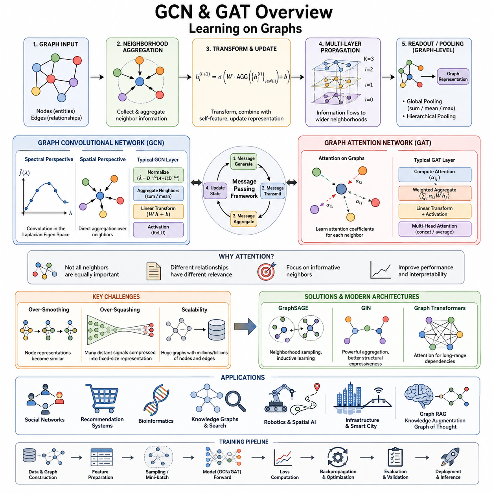
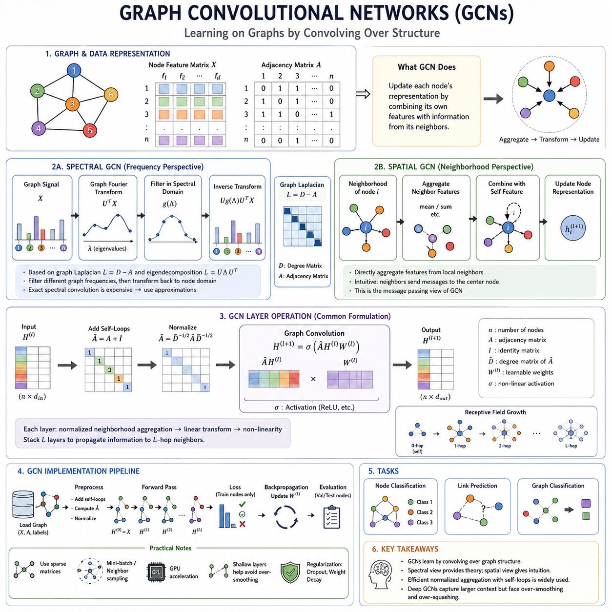
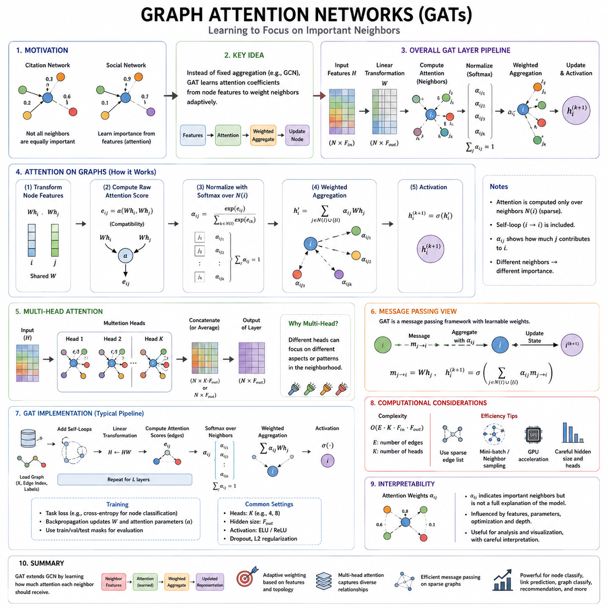
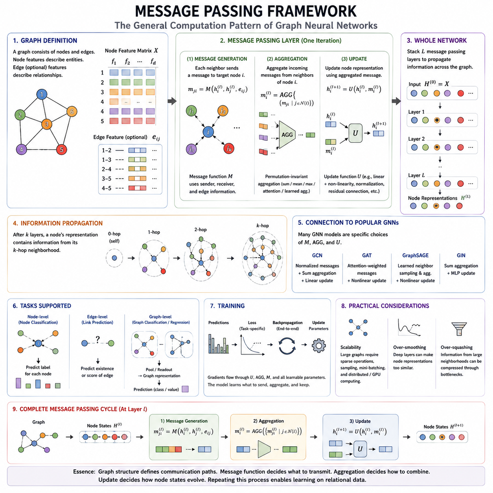
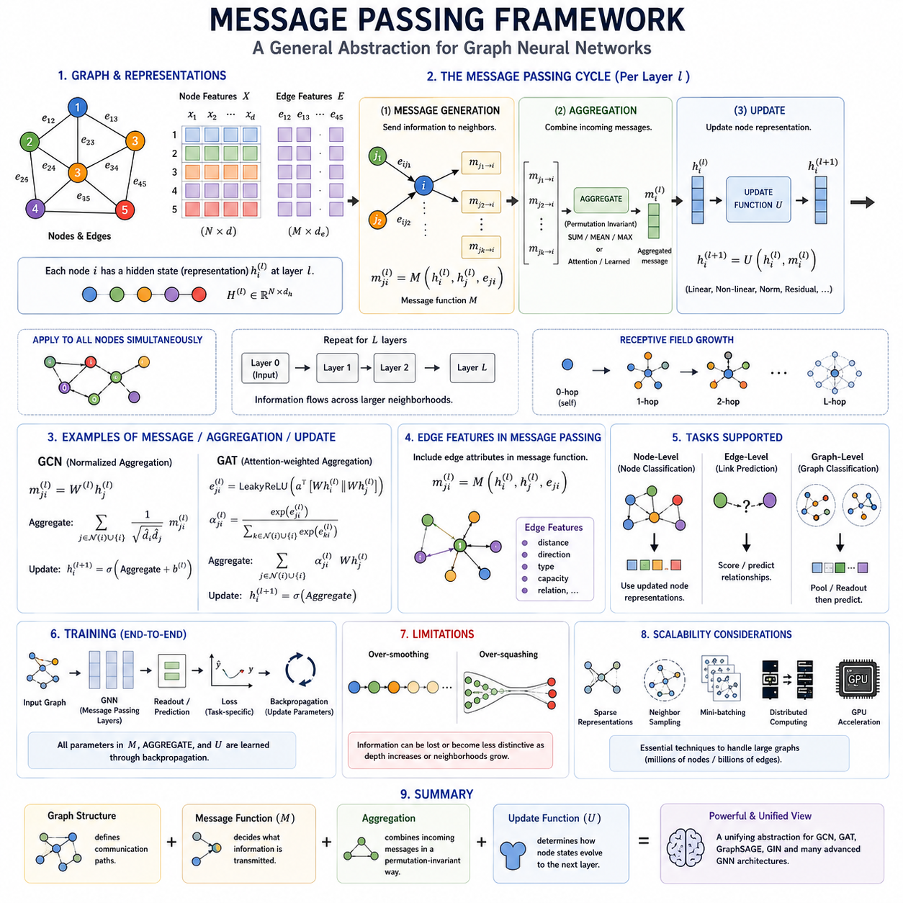
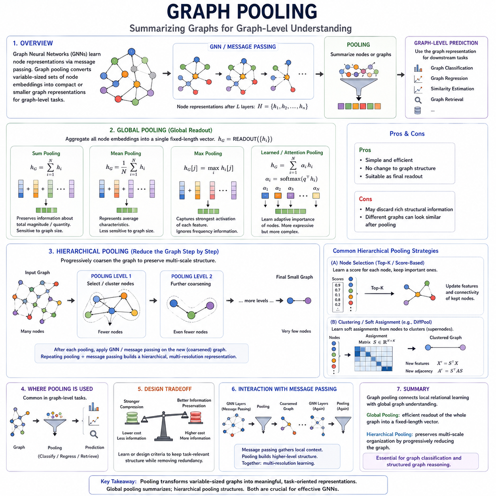
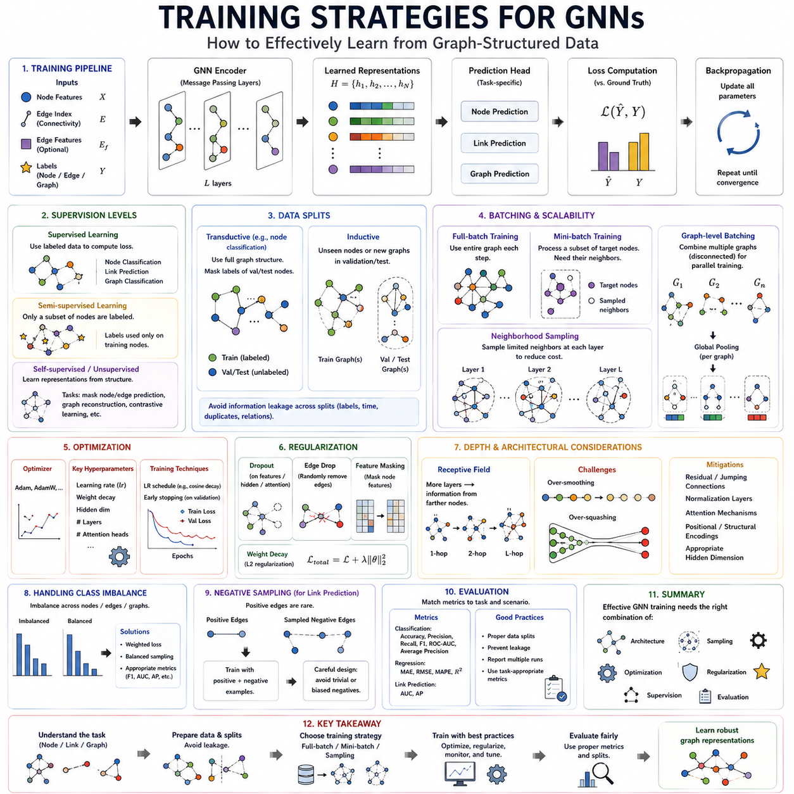
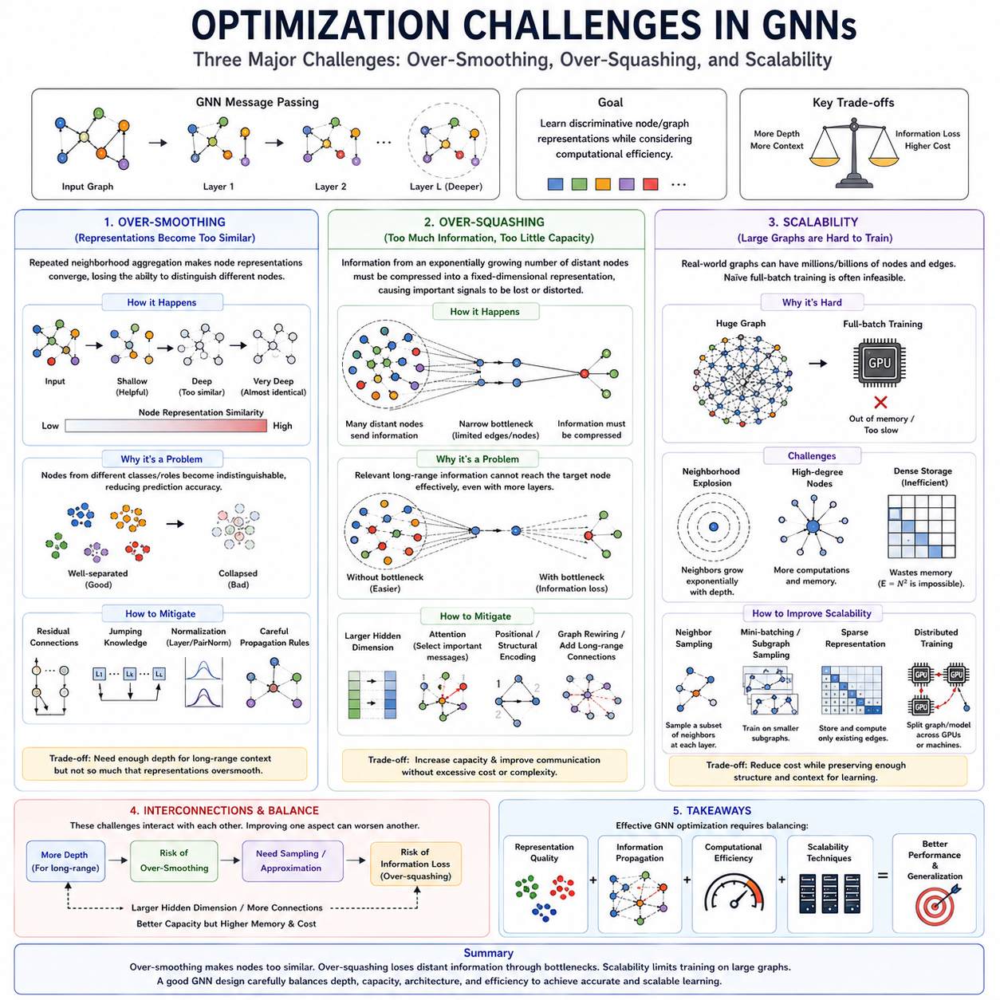
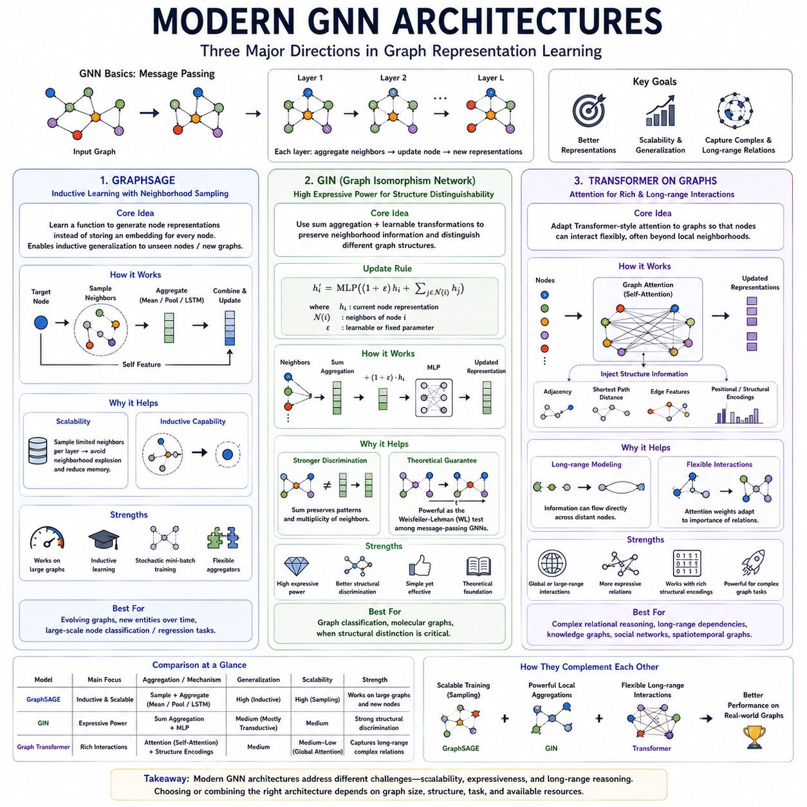

**Volume 29. Graph Deep Learning**


# Chapter 03. GCN and GAT

##  

## 03.00. Overview

{width="7.268055555555556in" height="7.268055555555556in"}

Graph Convolutional Networks and Graph Attention Networks are two central architectures in graph deep learning. They extend neural computation from regular structures such as images and sequences to graphs, where entities are represented as nodes and relationships as edges. Instead of processing each node independently, these models construct representations by combining a node's own features with information obtained from its local graph neighborhood.

The central idea behind these architectures is neighborhood aggregation. For a node to understand its structural context, information from adjacent nodes is collected, transformed, and integrated into a new representation. Repeating this operation across multiple layers allows information to propagate over increasingly distant regions of the graph. A shallow model captures local relationships, while deeper models can represent broader structural dependencies.

Graph Convolutional Networks, commonly called GCNs, provide a systematic way to perform convolution-like operations on graph structures. Unlike image convolution, where neighboring pixels occupy fixed positions on a grid, graph nodes can have different numbers of neighbors and no universal ordering. GCNs therefore define convolution through graph connectivity, transforming and aggregating neighboring node features according to the graph topology.

GCNs can be understood from both spectral and spatial perspectives. Spectral methods originate from graph signal processing and describe convolution through the eigenstructure of graph operators such as the Laplacian. Spatial methods instead describe computation directly as aggregation over neighboring nodes. Although their mathematical interpretations differ, both perspectives explain how graph structure determines the flow and transformation of information between connected entities.

A typical GCN layer combines neighboring feature vectors, applies learnable transformations, and produces an updated representation for every node. Normalization is important because graph nodes may have widely different degrees. Without appropriate normalization, highly connected nodes could dominate feature propagation. Self-connections are also commonly introduced so that a node preserves and transforms its own information while incorporating information received from surrounding nodes.

Graph Attention Networks, or GATs, extend neighborhood aggregation by allowing the model to learn how important individual neighbors are. A GCN generally aggregates neighboring information according to a predefined normalization rule, whereas a GAT computes attention coefficients from node representations. These coefficients determine how strongly each neighboring node contributes to the updated representation, enabling graph propagation to become adaptive and dependent on learned feature relationships.

Attention on graphs is especially useful when neighboring relationships are not equally informative. In a social network, some connections may strongly influence a user while others contribute little. In a citation network, certain referenced papers may provide more relevant information than others. A GAT can assign different weights to these relationships during computation, allowing the learned representation to emphasize informative neighbors while reducing the influence of less relevant ones.

Both GCN and GAT architectures can be expressed through the broader message passing framework. In this view, connected nodes generate messages, messages are transmitted along edges, incoming messages are aggregated, and each node updates its hidden state. This abstraction separates graph neural computation into reusable operations and provides a common language for describing many GNN architectures beyond the original convolutional and attention-based formulations.

Message passing also explains how receptive fields grow with network depth. After one layer, a node normally contains information from its immediate neighborhood. After two layers, information can arrive from nodes approximately two hops away, and additional layers continue expanding this effective neighborhood. This enables graph networks to combine local observations with progressively wider relational context, although excessive propagation can introduce important optimization and representation problems.

Graph pooling provides another essential operation when predictions must be produced for an entire graph rather than individual nodes or edges. Global pooling summarizes node representations through operations such as summation, averaging, or maximum aggregation. Hierarchical pooling instead learns progressively coarser graph representations, reducing the graph while attempting to preserve important structural information and meaningful groups of interconnected nodes.

Training GCNs and GATs follows familiar deep-learning principles, including differentiable objectives, backpropagation, gradient-based optimization, regularization, and validation. However, graph data introduces additional dependencies because training examples may be connected rather than independent. Node classification, link prediction, and graph classification therefore require careful construction of training splits, neighborhood sampling procedures, mini-batches, and evaluation protocols.

Several characteristic difficulties emerge as graph networks become deeper or operate on larger graphs. Over-smoothing occurs when repeated aggregation makes node representations increasingly similar, reducing their ability to distinguish different nodes. Over-squashing occurs when information from a rapidly expanding neighborhood must be compressed into a fixed-size representation. Scalability becomes another major concern when graphs contain millions or billions of nodes and edges.

These challenges have motivated architectures that extend the basic GCN and GAT principles. GraphSAGE introduces neighborhood sampling and aggregation mechanisms that support inductive learning and large graphs. Graph Isomorphism Networks, or GINs, strengthen structural discrimination through carefully designed aggregation functions. Graph Transformers incorporate transformer-inspired attention mechanisms to model richer dependencies and potentially capture relationships beyond strictly local neighborhoods.

GCNs, GATs, message passing, pooling, and modern GNN architectures should therefore be viewed as parts of one evolving computational framework rather than isolated algorithms. GCN establishes efficient topology-aware propagation, GAT introduces adaptive neighbor weighting, and message passing provides their general abstraction. Pooling extends node representations toward graph-level reasoning, while newer architectures address expressiveness, long-range dependencies, and computational scale.

Together, these methods form the main neural foundation for learning directly from relational structure. They transform graphs from static collections of nodes and edges into trainable computational systems in which information flows through relationships. This foundation supports later developments in graph embeddings, graph generation, knowledge reasoning, robotics and spatial AI, infrastructure networks, and integrations between graphs and large language models described elsewhere in the volume.

그래프 합성곱 신경망(Graph Convolutional Networks)과 그래프 어텐션 신경망(Graph Attention Networks)은 그래프 딥러닝(Graph Deep Learning)의 핵심 아키텍처(architecture)이다. 이들은 이미지나 시퀀스(sequence)와 같은 규칙적인 구조에서 수행되던 신경망 연산을 그래프로 확장한다. 그래프에서는 개체(entity)를 노드(node)로, 관계(relationship)를 엣지(edge)로 표현한다. 각 노드를 독립적으로 처리하는 대신, 자신의 특징(feature)과 주변 그래프 이웃(graph neighborhood)에서 얻은 정보를 결합하여 표현(representation)을 구성한다.

이러한 아키텍처의 중심 개념은 이웃 집계(neighborhood aggregation)이다. 하나의 노드가 자신의 구조적 맥락(structural context)을 이해하기 위해 인접 노드의 정보를 수집하고 변환한 뒤 새로운 표현으로 통합한다. 이러한 연산을 여러 계층(layer)에 걸쳐 반복하면 정보가 그래프의 점점 더 먼 영역까지 전파될 수 있다. 얕은 모델(shallow model)은 국소적 관계(local relationship)를 포착하고, 깊은 모델(deep model)은 더 넓은 구조적 의존성(structural dependency)을 표현할 수 있다.

그래프 합성곱 신경망(Graph Convolutional Networks, GCNs)은 그래프 구조에서 합성곱(convolution)과 유사한 연산을 수행하는 체계적인 방법을 제공한다. 이미지 합성곱에서는 인접 픽셀(pixel)이 격자(grid) 위의 고정된 위치에 존재하지만, 그래프의 노드는 서로 다른 수의 이웃을 가질 수 있으며 보편적인 순서도 존재하지 않는다. 따라서 GCN은 그래프 연결성(graph connectivity)을 이용하여 합성곱을 정의하고, 그래프 토폴로지(graph topology)에 따라 이웃 노드 특징을 변환하고 집계한다.

GCN은 스펙트럴 관점(spectral perspective)과 공간적 관점(spatial perspective) 모두에서 이해할 수 있다. 스펙트럴 방법(spectral method)은 그래프 신호 처리(graph signal processing)에서 출발하며 라플라시안(Laplacian)과 같은 그래프 연산자의 고유구조(eigenstructure)를 이용해 합성곱을 설명한다. 공간적 방법(spatial method)은 이웃 노드에 대한 집계 연산으로 계산을 직접 설명한다. 수학적 해석은 다르지만, 두 관점 모두 그래프 구조가 연결된 개체 사이의 정보 흐름과 변환을 어떻게 결정하는지를 설명한다.

일반적인 GCN 계층(GCN layer)은 이웃의 특징 벡터(feature vector)를 결합하고 학습 가능한 변환(learnable transformation)을 적용하여 각 노드의 새로운 표현을 생성한다. 그래프 노드는 서로 매우 다른 차수(degree)를 가질 수 있기 때문에 정규화(normalization)가 중요하다. 적절한 정규화가 없다면 연결이 많은 노드가 특징 전파(feature propagation)를 지배할 수 있다. 또한 자기 연결(self-connection)을 사용하여 주변 노드의 정보를 받아들이는 동시에 자신의 정보도 보존하고 변환할 수 있도록 한다.

그래프 어텐션 신경망(Graph Attention Networks, GATs)은 개별 이웃이 얼마나 중요한지를 모델이 직접 학습할 수 있도록 이웃 집계 방식을 확장한다. GCN은 일반적으로 미리 정의된 정규화 규칙(normalization rule)에 따라 이웃 정보를 집계하지만, GAT는 노드 표현으로부터 어텐션 계수(attention coefficient)를 계산한다. 이 계수는 각각의 이웃 노드가 갱신된 표현에 얼마나 강하게 기여할지를 결정하여 그래프의 정보 전파를 학습된 특징 관계에 따라 적응적으로 수행하도록 한다.

그래프 어텐션(graph attention)은 이웃 관계가 동일한 정보적 가치를 가지지 않을 때 특히 유용하다. 소셜 네트워크(social network)에서는 일부 연결이 특정 사용자에게 강한 영향을 미치는 반면 다른 연결은 거의 영향을 주지 않을 수 있다. 인용 네트워크(citation network)에서도 특정 논문이 다른 논문보다 더 중요한 정보를 제공할 수 있다. GAT는 이러한 관계에 서로 다른 가중치(weight)를 할당하여 중요한 이웃을 강조하고 상대적으로 관련성이 낮은 이웃의 영향을 줄일 수 있다.

GCN과 GAT는 모두 더 일반적인 메시지 패싱 프레임워크(message passing framework)를 통해 표현할 수 있다. 이 관점에서 연결된 노드는 메시지(message)를 생성하고, 메시지는 엣지를 따라 전달되며, 수신된 메시지는 집계된 후 각 노드의 은닉 상태(hidden state)를 갱신한다. 이러한 추상화(abstraction)는 그래프 신경망 계산을 재사용 가능한 연산으로 분리하며, 초기 합성곱 및 어텐션 기반 모델을 넘어 다양한 그래프 신경망(Graph Neural Network, GNN) 아키텍처를 설명하는 공통 언어를 제공한다.

메시지 패싱(message passing)은 네트워크 깊이(network depth)에 따라 수용 영역(receptive field)이 어떻게 확장되는지도 설명한다. 한 계층을 통과하면 노드는 일반적으로 직접 연결된 이웃의 정보를 포함한다. 두 계층을 통과하면 약 두 홉(two-hop) 떨어진 노드의 정보까지 전달될 수 있으며, 계층이 추가될수록 유효 이웃 영역(effective neighborhood)이 계속 확장된다. 이를 통해 그래프 신경망은 국소적 관찰(local observation)과 더 넓은 관계적 맥락(relational context)을 결합할 수 있지만, 지나친 전파는 최적화와 표현상의 문제를 발생시킬 수 있다.

그래프 풀링(graph pooling)은 개별 노드나 엣지가 아니라 전체 그래프에 대한 예측이 필요한 경우 중요한 연산을 제공한다. 전역 풀링(global pooling)은 합계(sum), 평균(average), 최댓값(maximum) 등의 연산을 통해 노드 표현을 하나의 그래프 표현으로 요약한다. 계층적 풀링(hierarchical pooling)은 그래프를 점진적으로 더 거친 구조(coarse structure)로 축소하면서 중요한 구조적 정보와 의미 있는 상호 연결 노드 집단을 보존하려 한다.

GCN과 GAT의 학습(training)은 미분 가능한 목적 함수(differentiable objective), 역전파(backpropagation), 경사 기반 최적화(gradient-based optimization), 정규화(regularization), 검증(validation) 등 일반적인 딥러닝 원리를 따른다. 그러나 그래프 데이터에서는 학습 샘플들이 서로 독립적이지 않고 연결되어 있을 수 있다는 추가적인 특성이 존재한다. 따라서 노드 분류(node classification), 링크 예측(link prediction), 그래프 분류(graph classification)를 수행할 때 학습 데이터 분할, 이웃 샘플링(neighborhood sampling), 미니배치(mini-batch), 평가 프로토콜(evaluation protocol)을 신중하게 설계해야 한다.

그래프 신경망이 깊어지거나 더 큰 그래프를 처리하면 몇 가지 특징적인 문제가 나타난다. 과도한 평활화(over-smoothing)는 반복적인 집계로 인해 서로 다른 노드의 표현이 점점 비슷해져 노드를 구별하는 능력이 감소하는 현상이다. 과도한 압축(over-squashing)은 빠르게 확장되는 이웃의 정보를 고정된 크기의 표현에 압축해야 할 때 발생한다. 또한 그래프가 수백만 또는 수십억 개의 노드와 엣지를 포함하게 되면 확장성(scalability)이 중요한 문제로 등장한다.

이러한 문제들은 기본적인 GCN과 GAT 원리를 확장한 새로운 아키텍처의 발전을 촉진하였다. 그래프세이지(GraphSAGE)는 이웃 샘플링(neighborhood sampling)과 집계 메커니즘(aggregation mechanism)을 도입하여 귀납적 학습(inductive learning)과 대규모 그래프 처리를 지원한다. 그래프 동형성 신경망(Graph Isomorphism Networks, GINs)은 정교하게 설계된 집계 함수를 통해 구조적 구별 능력(structural discrimination)을 강화한다. 그래프 트랜스포머(Graph Transformers)는 트랜스포머 기반 어텐션(transformer-inspired attention)을 사용하여 더욱 풍부한 의존성과 국소 이웃을 넘어서는 관계를 모델링한다.

GCN, GAT, 메시지 패싱(message passing), 풀링(pooling), 현대적 GNN 아키텍처(modern GNN architectures)는 서로 분리된 알고리즘이라기보다 하나의 발전하는 계산 프레임워크(computational framework)의 구성 요소로 이해하는 것이 적절하다. GCN은 효율적인 토폴로지 인식 정보 전파(topology-aware propagation)를 확립하고, GAT는 적응적 이웃 가중치(adaptive neighbor weighting)를 도입하며, 메시지 패싱은 이들을 포괄하는 일반적인 추상화를 제공한다. 풀링은 노드 표현을 그래프 수준 추론(graph-level reasoning)으로 확장하며, 새로운 아키텍처들은 표현력(expressiveness), 장거리 의존성(long-range dependency), 계산 규모(computational scale)의 문제를 다룬다.

이러한 방법들은 관계적 구조(relational structure)로부터 직접 학습하기 위한 핵심 신경망 기반을 형성한다. 그래프를 단순한 노드와 엣지의 정적인 집합이 아니라 관계를 통해 정보가 흐르는 학습 가능한 계산 시스템(trainable computational system)으로 변환한다. 이러한 기반은 이후 그래프 임베딩(graph embedding), 그래프 생성(graph generation), 지식 추론(knowledge reasoning), 로보틱스 및 공간 AI(robotics and spatial AI), 인프라 네트워크(infrastructure network), 그래프와 대규모 언어 모델(Large Language Model, LLM)의 통합으로 확장된다.

##  

## 03.01. Graph Convolutional Networks

{width="7.268055555555556in" height="7.268055555555556in"}

Graph Convolutional Networks, or GCNs, are neural architectures designed to learn representations from data organized as graphs. Unlike conventional neural networks that operate on vectors, grids, or sequences, GCNs explicitly use connections between nodes during computation. Each node representation is updated using its own features together with information propagated from neighboring nodes.

The fundamental operation of a GCN is graph convolution, which generalizes the idea of convolution from regular grids to irregular graph structures. In an image, convolution processes pixels through spatially fixed neighborhoods. A graph has no fixed grid, and nodes can have different numbers of neighbors. Graph convolution therefore relies on graph connectivity to determine which features should interact during representation learning.

A graph can be represented using a node feature matrix X and an adjacency matrix A. The feature matrix contains the attributes associated with each node, while the adjacency matrix describes which pairs of nodes are connected. GCN computation combines these two forms of information so that learned representations reflect both node attributes and relational structure rather than treating either source independently.

Spectral GCNs originate from spectral graph theory and graph signal processing. Their central idea is to define convolution in the graph Fourier domain using the eigenvectors and eigenvalues of the graph Laplacian. The Laplacian captures important structural properties of the graph, while its eigendecomposition provides a frequency-like basis in which signals defined over graph nodes can be analyzed and transformed.

From the spectral perspective, a node feature can be interpreted as a signal distributed across the graph. Graph Fourier transformation maps this signal into the spectral domain, where learnable filters can modify different graph-frequency components. The transformed signal is then mapped back to the node domain. This establishes a mathematical connection between classical convolution, frequency-domain filtering, and learning over irregular graph structures.

Direct spectral convolution can be computationally expensive because eigendecomposition of a large graph Laplacian is costly. It can also depend strongly on a particular graph structure, making transfer to different graphs difficult. Practical GCN formulations simplify spectral filtering through approximations, producing efficient propagation rules that avoid explicit eigendecomposition while retaining the idea of structure-aware feature smoothing.

A widely used GCN formulation augments the adjacency matrix with self-loops so that each node participates in its own update. The resulting adjacency matrix is normalized using node degrees before features are propagated. Conceptually, a layer performs normalized neighborhood aggregation followed by a learnable linear transformation and nonlinear activation. This prevents nodes with many connections from overwhelming nodes with fewer neighbors.

Spatial GCNs describe graph convolution directly in terms of local neighborhoods rather than graph frequencies. For each node, the model identifies connected neighbors, gathers their feature representations, combines them with an aggregation function, and updates the node state. This interpretation closely matches the intuitive idea that connected entities exchange information and is particularly useful for understanding practical graph neural network implementations.

The spatial perspective naturally leads to message passing. A neighboring node creates information that can be interpreted as a message, the graph edge determines where that message can travel, and the receiving node aggregates messages arriving from its neighborhood. A learnable update function then converts the aggregated information and the node\'s existing representation into a new hidden representation for the next layer.

Stacking GCN layers expands the effective receptive field of each node. A single layer primarily incorporates information from one-hop neighbors, while two layers allow information from approximately two-hop neighborhoods to influence a node. Additional layers extend this propagation farther across the graph, enabling the network to capture relationships that cannot be represented from immediate neighbors alone.

However, deeper propagation does not automatically produce better representations. Repeated neighborhood averaging can cause over-smoothing, where initially distinct node representations become increasingly similar. Information from large neighborhoods can also become compressed into limited-dimensional hidden states, contributing to over-squashing. These effects explain why practical GCN architectures often remain relatively shallow or incorporate improved propagation and residual mechanisms.

GCN implementations typically begin by preparing node features, graph connectivity, labels, and masks or splits for training and evaluation. The adjacency representation is augmented with self-connections and normalized, after which graph convolution layers propagate features through the network. Hidden layers commonly combine graph aggregation, linear transformations, activation functions, and regularization before producing task-specific output representations.

In a basic implementation, a GCN layer can be viewed conceptually as H\' = σ(ÂHW), where H represents the current node features, W is a learnable weight matrix, Â represents normalized graph connectivity, and σ is a nonlinear activation function. For the first layer H corresponds to the input feature matrix X. Repeating this computation allows graph structure to participate directly in every stage of feature transformation.

For node classification, the final GCN layer usually produces one representation or prediction vector for each node. A classification objective compares predictions with labels for the training nodes, and backpropagation updates the learnable parameters. Validation and test masks can separate nodes used for optimization from those used for model selection and final evaluation while preserving the underlying graph connections.

GCN implementation can use dense adjacency matrices for small educational examples, but real graphs are usually sparse. Sparse representations store only existing edges rather than every possible node pair, substantially reducing memory and unnecessary computation. Modern graph learning frameworks further provide optimized message-passing primitives, neighborhood sampling, mini-batching, and GPU operations for processing graphs that cannot be handled efficiently as dense matrices.

The spectral and spatial interpretations should not be regarded as competing descriptions. Spectral GCNs provide a mathematical foundation based on graph Laplacians, graph frequencies, and filtering, while spatial GCNs provide an operational interpretation based on neighborhood aggregation and message passing. Many practical GCN models can be understood from both perspectives, linking theoretical graph signal processing with implementable neural computation.

GCNs provide a foundation for numerous later graph neural network architectures. Their normalized propagation mechanism demonstrates how relational structure can become part of a differentiable learning system, while their limitations motivate models such as GraphSAGE, Graph Attention Networks, and more advanced message-passing networks. Understanding spectral GCNs, spatial GCNs, and their implementation therefore establishes the core computational principles required for modern graph deep learning.

그래프 합성곱 신경망(Graph Convolutional Networks, GCNs)은 그래프(graph) 형태로 구성된 데이터에서 표현(representation)을 학습하도록 설계된 신경망 아키텍처(neural architecture)이다. 벡터(vector), 격자(grid), 시퀀스(sequence)를 처리하는 기존 신경망과 달리 GCN은 계산 과정에서 노드(node) 사이의 연결 관계를 명시적으로 사용한다. 각 노드 표현은 자신의 특징(feature)과 이웃 노드로부터 전달된 정보를 함께 사용하여 갱신된다.

GCN의 기본 연산은 그래프 합성곱(graph convolution)이며, 이는 규칙적인 격자 구조에서 사용되는 합성곱(convolution)의 개념을 불규칙한 그래프 구조로 일반화한다. 이미지에서는 합성곱이 공간적으로 고정된 이웃 영역의 픽셀(pixel)을 처리한다. 그러나 그래프에는 고정된 격자가 없고 각 노드가 서로 다른 수의 이웃을 가질 수 있으므로, 그래프 합성곱은 그래프 연결성(graph connectivity)을 이용하여 어떤 특징들이 상호작용해야 하는지를 결정한다.

그래프는 노드 특징 행렬(node feature matrix) X와 인접 행렬(adjacency matrix) A를 사용하여 표현할 수 있다. 특징 행렬은 각 노드와 연관된 속성(attribute)을 포함하며, 인접 행렬은 어떤 노드 쌍이 서로 연결되어 있는지를 나타낸다. GCN 계산은 이 두 종류의 정보를 결합하여 노드 속성이나 관계 구조 중 하나만 독립적으로 처리하지 않고 두 정보를 모두 반영하는 학습된 표현을 생성한다.

스펙트럴 GCN(Spectral GCN)은 스펙트럴 그래프 이론(spectral graph theory)과 그래프 신호 처리(graph signal processing)에서 출발한다. 핵심 아이디어는 그래프 라플라시안(graph Laplacian)의 고유벡터(eigenvector)와 고유값(eigenvalue)을 이용하여 그래프 푸리에 영역(graph Fourier domain)에서 합성곱을 정의하는 것이다. 라플라시안은 그래프의 중요한 구조적 특성을 나타내며, 고유분해(eigendecomposition)는 그래프 노드에 정의된 신호를 분석하고 변환할 수 있는 주파수와 유사한 기저(frequency-like basis)를 제공한다.

스펙트럴 관점(spectral perspective)에서는 노드 특징을 그래프 전체에 분포된 신호(signal)로 해석할 수 있다. 그래프 푸리에 변환(graph Fourier transform)은 이 신호를 스펙트럴 영역(spectral domain)으로 변환하고, 이 영역에서 학습 가능한 필터(learnable filter)가 서로 다른 그래프 주파수 성분(graph-frequency component)을 조절한다. 이후 변환된 신호를 다시 노드 영역(node domain)으로 되돌린다. 이를 통해 전통적인 합성곱, 주파수 영역 필터링(frequency-domain filtering), 불규칙 그래프 구조에서의 학습 사이에 수학적 연결이 형성된다.

직접적인 스펙트럴 합성곱(spectral convolution)은 대규모 그래프 라플라시안의 고유분해에 많은 계산 비용이 필요하기 때문에 비효율적일 수 있다. 또한 특정 그래프 구조에 강하게 의존하여 서로 다른 그래프로 학습 결과를 전이하기 어려울 수 있다. 실용적인 GCN은 스펙트럴 필터링(spectral filtering)을 근사화하여 명시적인 고유분해를 수행하지 않으면서도 구조를 고려한 특징 평활화(structure-aware feature smoothing)의 개념을 유지하는 효율적인 전파 규칙(propagation rule)을 사용한다.

널리 사용되는 GCN 구성에서는 각 노드가 자신의 갱신 과정에도 참여할 수 있도록 인접 행렬에 자기 루프(self-loop)를 추가한다. 이렇게 생성된 인접 행렬은 특징을 전파하기 전에 노드 차수(node degree)를 이용하여 정규화(normalization)된다. 개념적으로 하나의 계층은 정규화된 이웃 집계(normalized neighborhood aggregation)를 수행한 후 학습 가능한 선형 변환(linear transformation)과 비선형 활성화(nonlinear activation)를 적용한다. 이를 통해 연결이 많은 노드가 연결이 적은 노드의 정보를 압도하는 현상을 줄일 수 있다.

공간적 GCN(Spatial GCN)은 그래프 주파수 대신 국소 이웃(local neighborhood)을 중심으로 그래프 합성곱을 직접 설명한다. 각 노드에 대해 모델은 연결된 이웃을 식별하고, 이웃의 특징 표현(feature representation)을 수집한 다음, 집계 함수(aggregation function)를 사용하여 결합하고 노드 상태(node state)를 갱신한다. 이러한 해석은 연결된 개체들이 서로 정보를 교환한다는 직관적인 개념과 잘 대응되며 실제 그래프 신경망 구현을 이해하는 데 특히 유용하다.

공간적 관점(spatial perspective)은 자연스럽게 메시지 패싱(message passing)으로 이어진다. 이웃 노드는 메시지(message)로 해석할 수 있는 정보를 생성하고, 그래프 엣지(graph edge)는 해당 메시지가 이동할 수 있는 경로를 결정한다. 수신 노드는 자신의 이웃으로부터 도착한 메시지를 집계하며, 학습 가능한 갱신 함수(learnable update function)는 집계된 정보와 기존 노드 표현을 결합하여 다음 계층에서 사용할 새로운 은닉 표현(hidden representation)을 생성한다.

GCN 계층을 여러 개 쌓으면 각 노드의 유효 수용 영역(effective receptive field)이 확장된다. 하나의 계층은 주로 1-홉 이웃(one-hop neighbor)의 정보를 통합하며, 두 개의 계층에서는 약 2-홉 이웃(two-hop neighborhood)의 정보가 해당 노드에 영향을 줄 수 있다. 계층을 추가하면 정보가 그래프의 더 먼 영역까지 전파되므로 즉각적인 이웃만으로 표현하기 어려운 관계까지 네트워크가 포착할 수 있다.

그러나 더 깊은 정보 전파(deeper propagation)가 항상 더 좋은 표현을 생성하는 것은 아니다. 반복적인 이웃 평균화(neighborhood averaging)는 처음에는 서로 달랐던 노드 표현이 점차 유사해지는 과도한 평활화(over-smoothing)를 발생시킬 수 있다. 또한 넓은 이웃에서 전달되는 많은 정보가 제한된 차원의 은닉 상태(hidden state)에 압축되면서 과도한 압축(over-squashing)이 발생할 수 있다. 이러한 이유로 실제 GCN 아키텍처는 비교적 얕게 구성되거나 개선된 전파 및 잔차 메커니즘(residual mechanism)을 사용하기도 한다.

GCN 구현(GCN implementation)은 일반적으로 노드 특징, 그래프 연결 관계, 레이블(label), 그리고 학습 및 평가를 위한 마스크(mask) 또는 데이터 분할(split)을 준비하는 과정에서 시작한다. 인접 표현(adjacency representation)에 자기 연결(self-connection)을 추가하고 정규화한 다음, 그래프 합성곱 계층을 통해 특징을 네트워크 내부로 전파한다. 은닉 계층(hidden layer)은 일반적으로 그래프 집계, 선형 변환, 활성화 함수(activation function), 정규화 기법(regularization)을 결합하여 작업별 출력 표현(task-specific output representation)을 생성한다.

기본적인 구현에서 하나의 GCN 계층은 개념적으로 H\' = σ(ÂHW)로 표현할 수 있다. 여기서 H는 현재 노드 특징, W는 학습 가능한 가중치 행렬(weight matrix), Â는 정규화된 그래프 연결 관계(normalized graph connectivity), σ는 비선형 활성화 함수(nonlinear activation function)를 의미한다. 첫 번째 계층에서 H는 입력 특징 행렬(input feature matrix) X에 해당한다. 이러한 계산을 반복함으로써 그래프 구조가 특징 변환의 모든 단계에 직접 참여할 수 있다.

노드 분류(node classification)의 경우 마지막 GCN 계층은 일반적으로 각 노드마다 하나의 표현 또는 예측 벡터(prediction vector)를 생성한다. 분류 목적 함수(classification objective)는 학습 노드의 예측과 레이블을 비교하며, 역전파(backpropagation)를 통해 학습 가능한 매개변수(parameter)를 갱신한다. 검증 및 테스트 마스크(validation and test mask)를 이용하면 기본 그래프 연결 관계를 유지하면서 최적화에 사용하는 노드와 모델 선택 및 최종 평가에 사용하는 노드를 분리할 수 있다.

GCN 구현에서는 소규모 교육용 예제에 밀집 인접 행렬(dense adjacency matrix)을 사용할 수 있지만, 실제 그래프는 일반적으로 희소 구조(sparse structure)를 가진다. 희소 표현(sparse representation)은 가능한 모든 노드 쌍을 저장하는 대신 실제 존재하는 엣지만 저장하여 메모리 사용량과 불필요한 계산을 크게 줄인다. 현대적인 그래프 학습 프레임워크(graph learning framework)는 대규모 그래프 처리를 위해 최적화된 메시지 패싱 연산, 이웃 샘플링(neighborhood sampling), 미니배치(mini-batching), GPU 연산도 제공한다.

스펙트럴 해석(spectral interpretation)과 공간적 해석(spatial interpretation)은 서로 경쟁하는 설명으로 이해할 필요가 없다. 스펙트럴 GCN은 그래프 라플라시안, 그래프 주파수(graph frequency), 필터링(filtering)을 기반으로 수학적 토대를 제공하며, 공간적 GCN은 이웃 집계와 메시지 패싱을 기반으로 실제 연산 과정을 설명한다. 많은 실용적인 GCN 모델은 두 관점 모두에서 이해할 수 있으며, 이론적인 그래프 신호 처리와 실제 구현 가능한 신경망 계산을 연결한다.

GCN은 이후 등장한 다양한 그래프 신경망(Graph Neural Network, GNN) 아키텍처의 기반을 제공한다. 정규화된 전파 메커니즘(normalized propagation mechanism)은 관계적 구조(relational structure)를 미분 가능한 학습 시스템(differentiable learning system)에 포함하는 방법을 보여주며, 동시에 GCN의 한계는 그래프세이지(GraphSAGE), 그래프 어텐션 신경망(Graph Attention Networks), 그리고 더욱 발전된 메시지 패싱 네트워크(message-passing network)의 등장을 촉진하였다. 따라서 스펙트럴 GCN, 공간적 GCN, 그리고 실제 구현 방법을 이해하는 것은 현대 그래프 딥러닝(Graph Deep Learning)에 필요한 핵심 계산 원리를 이해하는 기초가 된다.

##  

## 03.02. Graph Attention Networks

{width="7.268055555555556in" height="7.268055555555556in"}

Graph Attention Networks, or GATs, are graph neural networks that use attention mechanisms to determine how strongly neighboring nodes should influence one another. Instead of treating every connected neighbor according to a fixed aggregation rule, a GAT learns attention coefficients from node features. This allows graph representation learning to adapt dynamically to the relevance of relationships within each local neighborhood.

The motivation for graph attention comes from the observation that graph connections are not necessarily equally informative. In a citation network, one referenced paper may be more relevant than another, while in a social network some relationships may exert stronger influence. Attention provides a learnable mechanism that assigns different importance to neighboring nodes according to their current feature representations.

A GAT layer begins with node feature vectors that describe the current representation of every node. A learnable linear transformation is first applied to these features, mapping them into a new representation space. The transformed features are then used to calculate pairwise attention scores between a target node and the neighboring nodes connected to it through the graph structure.

For a node i and one of its neighbors j, an attention mechanism computes an unnormalized score describing their compatibility or relevance. A common formulation applies a shared learnable attention function to the transformed representations of both nodes. Because the same parameters can be reused across graph locations, the model does not depend on a fixed ordering or fixed number of neighboring nodes.

Raw attention scores cannot be directly interpreted as normalized contributions because different nodes may have different neighborhood sizes. GAT therefore commonly applies a softmax operation over the neighbors of each target node. The resulting attention coefficient αij represents the normalized importance of neighbor j when constructing the next representation of node i, with coefficients competing within the local neighborhood.

After attention coefficients have been calculated, neighboring feature vectors are multiplied by their corresponding coefficients and aggregated. More influential neighbors therefore contribute more strongly to the updated node representation. A nonlinear activation function is typically applied after aggregation, producing a new hidden representation that contains both graph connectivity information and feature-dependent relational importance.

This mechanism differs fundamentally from fixed neighborhood aggregation. A conventional GCN generally uses graph structure and degree-based normalization to determine propagation weights, whereas a GAT can learn different propagation strengths for different connected node pairs. Even when two nodes have the same degree and similar graph positions, their neighbors can receive different attention weights because their feature relationships are different.

Attention on graphs remains constrained by graph topology in the standard GAT formulation. A node normally calculates attention only over nodes connected to it, rather than attending globally to every node in the graph. This preserves the sparse relational structure of graph computation while introducing adaptive weighting. Stacking several GAT layers allows information to propagate beyond immediate neighbors into progressively larger neighborhoods.

Multi-head attention is an important component of GAT architectures. Instead of relying on a single attention mechanism, several independent attention heads compute different coefficients and transformed representations. Their outputs can be concatenated to produce richer hidden features or averaged when generating final predictions. Multiple heads can stabilize learning while allowing different relational patterns to be captured simultaneously.

Different attention heads may emphasize different aspects of a neighborhood. One head might focus on neighbors with similar attributes, while another may emphasize structurally or semantically complementary nodes. These interpretations are not guaranteed automatically, but multiple heads increase representational capacity by allowing several attention patterns to operate over the same graph connectivity during a single layer.

A practical GAT implementation starts with node features, edge connectivity, labels, and appropriate training, validation, and test splits. The graph connectivity identifies which node pairs are eligible for attention. Node features are transformed by learnable weight matrices, attention scores are computed for connected pairs, and neighborhood-wise normalization converts those scores into attention coefficients before weighted aggregation is performed.

Conceptually, the update for node i can be written as a weighted sum of transformed neighboring representations. If W is a learnable transformation and αij is the normalized attention coefficient between nodes i and j, the new representation can be expressed as h\'i = σ(Σj αij Whj). This equation captures the central GAT principle: graph neighbors contribute according to learned, feature-dependent weights rather than identical or predetermined importance.

Self-loops are commonly included so that each node can attend to its own transformed representation as well as to its neighbors. Without a self-connection, a node update could become dominated entirely by external information. Including the node itself in the attention neighborhood enables the model to learn how much of its previous information should be preserved relative to information received from connected nodes.

During training, the output of one or more GAT layers is connected to a task-specific objective. For node classification, the final layer produces predictions for individual nodes and the loss is computed over labeled training nodes. Backpropagation propagates gradients through the output transformations, weighted aggregation, attention coefficients, and feature transformations, allowing both representation parameters and attention mechanisms to be learned jointly.

Efficient implementation is particularly important because explicitly computing attention for every possible node pair would be prohibitively expensive on large graphs. Standard GAT computation exploits sparse graph connectivity and evaluates attention primarily for existing edges and self-connections. Graph learning libraries can represent connectivity with edge indices or sparse structures and provide optimized scatter, aggregation, and GPU operations.

GATs offer greater flexibility than fixed aggregation methods, but this flexibility introduces additional computational cost. Attention coefficients must be calculated and normalized for edges, and multi-head attention multiplies portions of this work. Large neighborhoods can therefore increase memory and computation substantially. Sampling, sparse operations, mini-batching, and carefully selected hidden dimensions are important when scaling GATs to large graphs.

Attention weights can also provide useful clues about which neighboring nodes contributed strongly to a representation, but they should not automatically be treated as complete explanations of model behavior. Learned coefficients are internal computational quantities influenced by features, parameters, optimization, and network depth. They can support analysis and visualization, yet rigorous interpretability generally requires additional evaluation beyond simply inspecting attention values.

Graph Attention Networks extend the message-passing framework by making message aggregation adaptive. Nodes still exchange information along graph edges, but the receiver learns how strongly each incoming message should influence its next state. This connects GATs naturally to the broader progression from GCNs toward increasingly expressive graph architectures and provides an important bridge between graph neural networks and attention-based models.

그래프 어텐션 신경망(Graph Attention Networks, GATs)은 어텐션 메커니즘(attention mechanism)을 사용하여 이웃 노드가 서로에게 얼마나 강하게 영향을 미쳐야 하는지를 결정하는 그래프 신경망(Graph Neural Network)이다. 모든 연결된 이웃을 고정된 집계 규칙에 따라 처리하는 대신, GAT는 노드 특징(node feature)으로부터 어텐션 계수(attention coefficient)를 학습한다. 이를 통해 그래프 표현 학습(graph representation learning)은 각 국소 이웃(local neighborhood)에서 관계의 중요성에 따라 동적으로 적응할 수 있다.

그래프 어텐션(graph attention)의 필요성은 그래프의 모든 연결이 반드시 동일한 정보적 가치를 가지는 것은 아니라는 관찰에서 출발한다. 인용 네트워크(citation network)에서는 어떤 참조 논문이 다른 논문보다 더 관련성이 높을 수 있으며, 소셜 네트워크(social network)에서는 일부 관계가 더 강한 영향을 미칠 수 있다. 어텐션은 현재의 특징 표현(feature representation)을 바탕으로 이웃 노드에 서로 다른 중요도를 할당하는 학습 가능한 메커니즘을 제공한다.

GAT 계층(GAT layer)은 각 노드의 현재 표현을 나타내는 노드 특징 벡터(node feature vector)에서 시작한다. 먼저 학습 가능한 선형 변환(learnable linear transformation)을 이러한 특징에 적용하여 새로운 표현 공간(representation space)으로 매핑한다. 이후 변환된 특징을 사용하여 대상 노드(target node)와 그래프 구조를 통해 연결된 이웃 노드 사이의 쌍별 어텐션 점수(pairwise attention score)를 계산한다.

노드 i와 그 이웃 노드 j에 대해 어텐션 메커니즘은 두 노드 사이의 호환성(compatibility) 또는 관련성(relevance)을 나타내는 정규화되지 않은 점수(unnormalized score)를 계산한다. 일반적인 구성에서는 두 노드의 변환된 표현에 공유된 학습 가능 어텐션 함수(shared learnable attention function)를 적용한다. 동일한 매개변수를 그래프의 여러 위치에서 재사용할 수 있으므로 모델은 고정된 노드 순서나 고정된 이웃 수에 의존하지 않는다.

원시 어텐션 점수(raw attention score)는 노드마다 이웃의 수가 다를 수 있기 때문에 그대로 정규화된 기여도로 해석할 수 없다. 따라서 GAT는 일반적으로 각 대상 노드의 이웃에 대해 소프트맥스(softmax) 연산을 적용한다. 그 결과 얻어지는 어텐션 계수 αij는 노드 i의 다음 표현을 구성할 때 이웃 노드 j가 가지는 정규화된 중요도를 나타내며, 각 계수는 해당 국소 이웃 내부에서 서로 경쟁하며 결정된다.

어텐션 계수가 계산되면 이웃의 특징 벡터에 각각 대응되는 계수를 곱한 뒤 이를 집계한다. 따라서 영향력이 높은 이웃은 갱신된 노드 표현(updated node representation)에 더 강하게 기여한다. 일반적으로 집계 이후 비선형 활성화 함수(nonlinear activation function)를 적용하며, 이를 통해 그래프 연결 정보(graph connectivity information)와 특징에 따라 달라지는 관계적 중요도(feature-dependent relational importance)를 함께 포함하는 새로운 은닉 표현(hidden representation)을 생성한다.

이러한 메커니즘은 고정된 이웃 집계(fixed neighborhood aggregation)와 근본적인 차이가 있다. 일반적인 그래프 합성곱 신경망(Graph Convolutional Network, GCN)은 그래프 구조와 차수 기반 정규화(degree-based normalization)를 이용하여 전파 가중치(propagation weight)를 결정하지만, GAT는 연결된 노드 쌍마다 서로 다른 전파 강도를 학습할 수 있다. 두 노드의 차수와 그래프상의 위치가 유사하더라도 특징 관계가 다르면 각각의 이웃에 서로 다른 어텐션 가중치가 부여될 수 있다.

표준 GAT 구성에서 그래프 어텐션은 그래프 토폴로지(graph topology)에 의해 제한된다. 일반적으로 하나의 노드는 그래프 전체의 모든 노드에 대해 어텐션을 계산하는 것이 아니라 자신과 연결된 노드에 대해서만 어텐션을 계산한다. 이를 통해 그래프 계산의 희소 관계 구조(sparse relational structure)를 유지하면서 적응형 가중치(adaptive weighting)를 도입할 수 있다. 여러 GAT 계층을 쌓으면 정보가 직접적인 이웃을 넘어 점진적으로 더 넓은 이웃 영역으로 전파된다.

다중 헤드 어텐션(multi-head attention)은 GAT 아키텍처의 중요한 구성 요소이다. 하나의 어텐션 메커니즘에만 의존하지 않고 여러 개의 독립적인 어텐션 헤드(attention head)가 서로 다른 계수와 변환된 표현을 계산한다. 각 헤드의 출력은 더 풍부한 은닉 특징(hidden feature)을 만들기 위해 연결(concatenation)하거나 최종 예측을 생성할 때 평균(average)할 수 있다. 여러 헤드는 학습을 안정화하면서 서로 다른 관계 패턴을 동시에 포착할 수 있도록 한다.

서로 다른 어텐션 헤드는 이웃 관계의 서로 다른 측면을 강조할 수 있다. 하나의 헤드는 유사한 속성을 가진 이웃에 집중하고, 다른 헤드는 구조적 또는 의미적으로 상호보완적인 노드를 강조할 수 있다. 이러한 해석이 자동으로 보장되는 것은 아니지만, 다중 헤드는 하나의 계층에서 동일한 그래프 연결 관계에 여러 종류의 어텐션 패턴을 적용할 수 있도록 하여 표현 능력(representational capacity)을 높인다.

실제 GAT 구현(GAT implementation)은 노드 특징, 엣지 연결 관계(edge connectivity), 레이블(label), 그리고 적절한 학습·검증·테스트 데이터 분할(training, validation, and test split)을 준비하는 과정에서 시작한다. 그래프 연결 관계는 어떤 노드 쌍에 대해 어텐션을 계산할 수 있는지를 결정한다. 노드 특징을 학습 가능한 가중치 행렬로 변환하고 연결된 노드 쌍의 어텐션 점수를 계산한 뒤, 이웃 단위 정규화(neighborhood-wise normalization)를 통해 어텐션 계수로 변환하고 가중 집계(weighted aggregation)를 수행한다.

개념적으로 노드 i의 갱신은 변환된 이웃 표현의 가중합(weighted sum)으로 나타낼 수 있다. W가 학습 가능한 변환이고 αij가 노드 i와 j 사이의 정규화된 어텐션 계수라면 새로운 표현은 h\'i = σ(Σj αij Whj)로 표현할 수 있다. 이 식은 그래프 이웃이 동일하거나 미리 정해진 중요도로 기여하는 것이 아니라 학습되고 특징에 따라 달라지는 가중치(feature-dependent weight)에 따라 기여한다는 GAT의 핵심 원리를 나타낸다.

각 노드가 자신의 변환된 표현뿐만 아니라 이웃의 표현에도 어텐션을 적용할 수 있도록 자기 루프(self-loop)가 일반적으로 포함된다. 자기 연결(self-connection)이 없다면 노드 갱신이 외부에서 전달되는 정보에 지나치게 지배될 수 있다. 노드 자신을 어텐션 이웃(attention neighborhood)에 포함하면 기존 정보를 어느 정도 유지하고 연결된 노드에서 전달된 정보를 어느 정도 받아들일지를 모델이 학습할 수 있다.

학습 과정에서 하나 이상의 GAT 계층 출력은 작업별 목적 함수(task-specific objective)에 연결된다. 노드 분류(node classification)의 경우 마지막 계층은 개별 노드에 대한 예측을 생성하며, 레이블이 존재하는 학습 노드를 대상으로 손실(loss)을 계산한다. 역전파(backpropagation)는 출력 변환, 가중 집계, 어텐션 계수, 특징 변환을 거슬러 그래디언트(gradient)를 전달하며, 표현 매개변수와 어텐션 메커니즘을 함께 학습하도록 한다.

모든 가능한 노드 쌍에 대해 명시적으로 어텐션을 계산하면 대규모 그래프에서 계산 비용이 지나치게 커지므로 효율적인 구현이 특히 중요하다. 표준 GAT 계산은 그래프의 희소 연결성(sparse graph connectivity)을 활용하여 주로 실제 존재하는 엣지와 자기 연결에 대해서만 어텐션을 계산한다. 그래프 학습 라이브러리(graph learning library)는 엣지 인덱스(edge index) 또는 희소 구조를 이용해 연결 관계를 표현하고 최적화된 스캐터(scatter), 집계, GPU 연산을 제공할 수 있다.

GAT는 고정된 집계 방식보다 높은 유연성을 제공하지만 이러한 유연성에는 추가적인 계산 비용이 따른다. 엣지마다 어텐션 계수를 계산하고 정규화해야 하며, 다중 헤드 어텐션은 이러한 연산의 일부를 여러 번 수행한다. 따라서 큰 이웃 영역은 메모리와 계산량을 크게 증가시킬 수 있다. 대규모 그래프로 GAT를 확장할 때는 샘플링(sampling), 희소 연산(sparse operation), 미니배치(mini-batching), 적절한 은닉 차원(hidden dimension) 선택이 중요하다.

어텐션 가중치(attention weight)는 어떤 이웃 노드가 표현 생성에 강하게 기여했는지를 파악하는 유용한 단서를 제공할 수 있지만, 이를 자동으로 모델 행동에 대한 완전한 설명으로 간주해서는 안 된다. 학습된 계수는 특징, 매개변수, 최적화 과정, 네트워크 깊이의 영향을 받는 내부 계산 값이다. 따라서 분석과 시각화에 활용할 수 있지만 엄밀한 해석 가능성(interpretability)을 확보하려면 단순히 어텐션 값을 확인하는 것 이상의 추가적인 평가가 필요하다.

그래프 어텐션 신경망(Graph Attention Networks)은 메시지 집계(message aggregation)를 적응적으로 만들어 메시지 패싱 프레임워크(message-passing framework)를 확장한다. 노드들은 여전히 그래프 엣지를 따라 정보를 교환하지만, 정보를 받는 노드는 각각의 입력 메시지가 자신의 다음 상태에 얼마나 강하게 영향을 미칠지를 학습한다. 이러한 특성은 GAT를 GCN에서 더욱 표현력이 높은 그래프 아키텍처로 발전하는 흐름과 자연스럽게 연결하며, 그래프 신경망과 어텐션 기반 모델(attention-based model)을 연결하는 중요한 기반을 제공한다.

##  

## 03.03. Message Passing Framework

{width="7.268055555555556in" height="7.268055555555556in"}

{width="7.268055555555556in" height="7.268055555555556in"}

Message Passing Framework provides a general computational abstraction for Graph Neural Networks by describing learning as repeated information exchange between connected nodes. Instead of defining every graph architecture as a separate mechanism, message passing expresses graph computation through a common sequence: generate messages, aggregate incoming information, and update node representations. GCNs, GATs, and many modern GNNs can be interpreted within this framework.

A graph consists of nodes connected by edges, with node features describing entities and optional edge features describing relationships. In message passing, every node maintains a hidden representation that summarizes information currently available to it. During each layer, neighboring nodes communicate through edges, allowing local relational information to become part of the representation used for prediction, classification, or further reasoning.

The first major component is message generation. For a directed interaction from node j to node i, a message is constructed from information associated with the sender, receiver, edge, or combinations of these elements. Conceptually, this operation can be written as mji = M(hi, hj, eij), where M is a message function, hi and hj are node representations, and eij represents optional edge information.

The message function can take many forms depending on the graph architecture. A simple model may transmit a transformed version of the neighboring node feature, while a more expressive model may combine sender features, receiver features, edge attributes, distances, relation types, or learned attention coefficients. Because the message function is usually differentiable and parameterized, the network can learn what information should be transmitted through graph relationships.

Once messages have been generated, the receiving node must combine messages arriving from its neighborhood. This operation is called message aggregation. Because graph neighborhoods have no universal ordering and may contain different numbers of nodes, aggregation should generally be permutation invariant. Common operations include summation, averaging, and maximum aggregation, while more advanced models can use attention or learned aggregation mechanisms.

Permutation invariance is fundamental because the identity of a graph should not depend on the arbitrary ordering used to store its neighbors. If the same neighboring nodes are listed in a different sequence, the aggregated representation should normally remain consistent. Functions such as sum, mean, and maximum naturally satisfy this requirement, making them suitable building blocks for graph neural computation over unordered relational structures.

After aggregation, the node update stage combines the aggregated neighborhood information with the node\'s existing hidden state. Conceptually, the update can be expressed as hi(l+1) = U(hi(l), mi(l)), where mi represents the aggregated incoming message and U is an update function. The update may contain linear transformations, nonlinear activation functions, normalization, residual connections, or more complex neural modules.

A complete message-passing layer can therefore be understood as a local communication cycle. Neighboring nodes generate messages, edges determine where those messages travel, the receiver aggregates the incoming messages, and an update function creates the next node representation. Applying this process simultaneously across the graph transforms the entire set of node representations while preserving the relational structure encoded by graph connectivity.

Stacking multiple message-passing layers enables information to travel over increasingly large graph distances. After one layer, a node primarily incorporates information from its immediate one-hop neighborhood. After two layers, information originating approximately two hops away can influence its representation. Deeper networks continue expanding this receptive field, allowing local communication to construct representations containing broader structural context.

This propagation mechanism explains how graph neural networks perform relational reasoning without requiring every node to interact directly with every other node. Information can move through intermediate nodes along graph paths. Consequently, a node representation can eventually encode information about distant parts of the graph, although the effectiveness of this process depends on network depth, graph topology, aggregation functions, and representation capacity.

GCNs provide a straightforward example of message passing. Neighboring node features are transformed and aggregated using normalization derived from graph connectivity and node degrees. The resulting information is used to update each node representation. From this viewpoint, graph convolution is not an isolated operation but a particular choice of message, aggregation, and update functions within the more general message-passing framework.

GATs provide another important example. Instead of assigning neighboring messages according to fixed degree-based normalization, GATs learn attention coefficients that determine the relative importance of incoming information. Each neighboring message is weighted before aggregation, allowing the receiving node to emphasize some relationships more strongly than others. GAT can therefore be interpreted as attention-weighted message passing.

Edge features can significantly increase the expressive power of message passing. In many graphs, relationships contain meaningful information beyond simple connectivity, such as distance, direction, interaction type, capacity, or semantic relation. Incorporating these attributes into the message function allows two connected node pairs with similar node features to exchange different messages according to the properties of their relationships.

Message passing can support node-level, edge-level, and graph-level learning tasks. Node classification uses updated node representations directly, while link prediction evaluates relationships between pairs of node embeddings. Graph-level prediction typically introduces a readout or pooling operation that aggregates node representations into a single graph representation, which can then be used for classification, regression, or other global predictions.

Training message-passing networks follows end-to-end differentiable learning. A task-specific loss is computed from model predictions, and backpropagation propagates gradients through update functions, aggregation operations, message functions, and learnable transformations. Parameters are therefore optimized according to the final task rather than requiring manually designed rules for deciding which relational information should be propagated.

Despite its flexibility, message passing has important limitations. Repeated aggregation can produce over-smoothing, where node representations become increasingly similar as network depth grows. Over-squashing occurs when information from rapidly expanding neighborhoods must pass through limited-dimensional representations or narrow graph bottlenecks. These problems can prevent distant information from being preserved even when sufficient message-passing layers are theoretically available.

Scalability is another major consideration because large graphs may contain millions of nodes and billions of edges. Processing every neighboring message in every training step can become computationally expensive. Sparse graph representations, neighborhood sampling, mini-batching, distributed computation, and optimized GPU operations are therefore important engineering techniques for applying message-passing networks to large real-world graphs.

The Message Passing Framework ultimately provides a unified language for understanding graph neural computation. Graph structure defines communication pathways, message functions determine what information is transmitted, aggregation determines how incoming information is combined, and update functions determine how node states evolve. This abstraction connects GCN, GAT, GraphSAGE, GIN, and more advanced graph architectures within a common foundation for relational learning.

메시지 패싱 프레임워크(Message Passing Framework)는 연결된 노드(node) 사이에서 반복적으로 정보를 교환하는 과정으로 학습을 설명하는 그래프 신경망(Graph Neural Network, GNN)의 일반적인 계산 추상화(computational abstraction)를 제공한다. 각각의 그래프 아키텍처를 별도의 메커니즘으로 정의하는 대신, 메시지 패싱은 메시지 생성(message generation), 입력 정보 집계(aggregation), 노드 표현 갱신(node representation update)이라는 공통 과정으로 그래프 계산을 표현한다. GCN, GAT를 비롯한 다양한 현대적 GNN을 이 프레임워크를 통해 통합적으로 이해할 수 있다.

그래프(graph)는 엣지(edge)로 연결된 노드로 구성되며, 노드 특징(node feature)은 개체(entity)를 설명하고 선택적인 엣지 특징(edge feature)은 관계(relationship)를 설명한다. 메시지 패싱 과정에서 각각의 노드는 현재 자신이 이용할 수 있는 정보를 요약하는 은닉 표현(hidden representation)을 유지한다. 각 계층(layer)에서는 이웃 노드가 엣지를 통해 정보를 교환하며, 이를 통해 국소적인 관계 정보(local relational information)가 예측, 분류 또는 추가적인 추론에 사용되는 표현의 일부가 된다.

첫 번째 주요 구성 요소는 메시지 생성(message generation)이다. 노드 j에서 노드 i로 향하는 방향성 상호작용(directed interaction)의 경우 송신 노드(sender), 수신 노드(receiver), 엣지 또는 이러한 요소들의 조합으로부터 메시지가 생성된다. 개념적으로 이 연산은 mji = M(hi, hj, eij)로 표현할 수 있으며, 여기서 M은 메시지 함수(message function), hi와 hj는 노드 표현, eij는 선택적인 엣지 정보(edge information)를 의미한다.

메시지 함수(message function)는 그래프 아키텍처에 따라 다양한 형태를 가질 수 있다. 단순한 모델에서는 이웃 노드 특징을 변환하여 전달할 수 있으며, 더 높은 표현력을 가진 모델에서는 송신 노드 특징, 수신 노드 특징, 엣지 속성(edge attribute), 거리(distance), 관계 유형(relation type), 학습된 어텐션 계수(attention coefficient)를 결합할 수 있다. 메시지 함수는 일반적으로 미분 가능하고 매개변수화(parameterized)되어 있기 때문에 네트워크는 그래프 관계를 통해 어떤 정보를 전달해야 하는지를 학습할 수 있다.

메시지가 생성되면 수신 노드는 자신의 이웃에서 전달된 메시지를 결합해야 한다. 이러한 연산을 메시지 집계(message aggregation)라고 한다. 그래프의 이웃은 보편적인 순서가 존재하지 않으며 서로 다른 수의 노드를 포함할 수 있기 때문에 집계 연산은 일반적으로 순열 불변성(permutation invariance)을 가져야 한다. 대표적인 연산으로 합계(sum), 평균(mean), 최댓값(maximum)이 있으며, 더욱 발전된 모델에서는 어텐션(attention)이나 학습 가능한 집계 메커니즘(learned aggregation mechanism)을 사용할 수 있다.

순열 불변성(permutation invariance)은 그래프의 특성이 이웃을 저장할 때 사용한 임의의 순서에 따라 달라져서는 안 된다는 점에서 중요하다. 동일한 이웃 노드가 서로 다른 순서로 나열되더라도 집계된 표현은 일반적으로 동일하게 유지되어야 한다. 합계, 평균, 최댓값과 같은 함수는 이러한 요구 조건을 자연스럽게 만족하므로 순서가 없는 관계 구조(unordered relational structure)를 처리하는 그래프 신경망 계산에 적합한 기본 연산이 된다.

집계 이후에는 노드 갱신 단계(node update stage)가 집계된 이웃 정보와 기존 노드의 은닉 상태(hidden state)를 결합한다. 개념적으로 이 과정은 hi(l+1) = U(hi(l), mi(l))로 표현할 수 있으며, 여기서 mi는 집계된 입력 메시지(aggregated incoming message), U는 갱신 함수(update function)를 의미한다. 갱신 과정에는 선형 변환(linear transformation), 비선형 활성화 함수(nonlinear activation function), 정규화(normalization), 잔차 연결(residual connection), 또는 더욱 복잡한 신경망 모듈(neural module)이 포함될 수 있다.

따라서 하나의 완전한 메시지 패싱 계층(message-passing layer)은 국소적인 통신 주기(local communication cycle)로 이해할 수 있다. 이웃 노드는 메시지를 생성하고, 엣지는 메시지가 이동하는 경로를 결정하며, 수신 노드는 들어오는 메시지를 집계하고, 갱신 함수는 다음 노드 표현을 생성한다. 이러한 과정을 그래프 전체에서 동시에 적용하면 그래프 연결성(graph connectivity)에 포함된 관계 구조를 유지하면서 모든 노드 표현을 변환할 수 있다.

여러 메시지 패싱 계층을 쌓으면 정보가 점점 더 먼 그래프 거리(graph distance)까지 전달될 수 있다. 하나의 계층 이후 노드는 주로 직접 연결된 1-홉 이웃(one-hop neighborhood)의 정보를 포함한다. 두 계층 이후에는 약 2-홉(two-hop) 떨어진 곳에서 시작된 정보가 해당 노드 표현에 영향을 줄 수 있다. 더 깊은 네트워크는 이러한 수용 영역(receptive field)을 계속 확장하여 국소적인 통신으로부터 더 넓은 구조적 맥락(structural context)을 포함하는 표현을 생성한다.

이러한 전파 메커니즘(propagation mechanism)은 모든 노드가 다른 모든 노드와 직접 상호작용하지 않고도 그래프 신경망이 관계적 추론(relational reasoning)을 수행할 수 있는 이유를 설명한다. 정보는 그래프 경로(graph path)를 따라 중간 노드를 통과하면서 이동할 수 있다. 따라서 하나의 노드 표현은 궁극적으로 그래프의 먼 영역에 대한 정보를 포함할 수 있지만, 이러한 과정의 효율성은 네트워크 깊이, 그래프 토폴로지(graph topology), 집계 함수, 표현 용량(representation capacity)에 따라 달라진다.

그래프 합성곱 신경망(Graph Convolutional Networks, GCNs)은 메시지 패싱의 대표적인 예를 제공한다. 이웃 노드 특징은 그래프 연결성과 노드 차수(node degree)에서 유도된 정규화(normalization)를 이용하여 변환되고 집계된다. 이렇게 생성된 정보는 각 노드 표현을 갱신하는 데 사용된다. 이러한 관점에서 그래프 합성곱(graph convolution)은 독립된 연산이 아니라 더 일반적인 메시지 패싱 프레임워크 안에서 메시지, 집계, 갱신 함수를 특정한 방식으로 구성한 것으로 이해할 수 있다.

그래프 어텐션 신경망(Graph Attention Networks, GATs)은 또 다른 중요한 예를 제공한다. GAT는 고정된 차수 기반 정규화(degree-based normalization)에 따라 이웃 메시지를 처리하는 대신 입력 정보의 상대적인 중요도를 결정하는 어텐션 계수(attention coefficient)를 학습한다. 각각의 이웃 메시지는 집계 전에 가중치가 적용되므로 수신 노드는 일부 관계를 다른 관계보다 더 강하게 강조할 수 있다. 따라서 GAT는 어텐션 가중 메시지 패싱(attention-weighted message passing)으로 해석할 수 있다.

엣지 특징(edge feature)은 메시지 패싱의 표현력(expressive power)을 크게 향상시킬 수 있다. 많은 그래프에서 관계는 단순한 연결 여부 이상의 의미 있는 정보를 포함하며, 대표적으로 거리, 방향, 상호작용 유형(interaction type), 용량(capacity), 의미적 관계(semantic relation) 등이 있다. 이러한 속성을 메시지 함수에 포함하면 노드 특징이 유사한 두 연결된 노드 쌍이라도 각각의 관계 특성에 따라 서로 다른 메시지를 교환할 수 있다.

메시지 패싱은 노드 수준(node-level), 엣지 수준(edge-level), 그래프 수준(graph-level)의 학습 작업을 모두 지원할 수 있다. 노드 분류(node classification)는 갱신된 노드 표현을 직접 사용하고, 링크 예측(link prediction)은 노드 임베딩(node embedding) 쌍 사이의 관계를 평가한다. 그래프 수준 예측(graph-level prediction)은 일반적으로 노드 표현을 하나의 그래프 표현(graph representation)으로 집계하는 리드아웃(readout) 또는 풀링(pooling)을 추가하며, 이를 분류, 회귀(regression) 또는 기타 전역 예측(global prediction)에 사용할 수 있다.

메시지 패싱 네트워크(message-passing network)의 학습은 종단간 미분 가능 학습(end-to-end differentiable learning)을 따른다. 모델 예측으로부터 작업별 손실(task-specific loss)을 계산하고, 역전파(backpropagation)를 통해 갱신 함수, 집계 연산, 메시지 함수 및 학습 가능한 변환으로 그래디언트(gradient)를 전달한다. 따라서 어떤 관계 정보를 전달할지를 사람이 직접 규칙으로 설계하기보다 최종 작업의 목적에 따라 네트워크의 매개변수가 최적화된다.

메시지 패싱은 높은 유연성을 제공하지만 중요한 한계도 존재한다. 반복적인 집계는 네트워크가 깊어질수록 노드 표현이 점차 유사해지는 과도한 평활화(over-smoothing)를 발생시킬 수 있다. 과도한 압축(over-squashing)은 빠르게 확장되는 이웃의 정보가 제한된 차원의 표현이나 좁은 그래프 병목(graph bottleneck)을 통과해야 할 때 발생한다. 이러한 문제 때문에 이론적으로 충분한 메시지 패싱 계층이 있더라도 먼 거리의 정보가 효과적으로 보존되지 않을 수 있다.

확장성(scalability) 역시 중요한 고려 사항이다. 대규모 그래프에는 수백만 개의 노드와 수십억 개의 엣지가 존재할 수 있으므로 모든 학습 단계에서 모든 이웃 메시지를 처리하는 것은 매우 높은 계산 비용을 요구할 수 있다. 따라서 희소 그래프 표현(sparse graph representation), 이웃 샘플링(neighborhood sampling), 미니배치(mini-batching), 분산 계산(distributed computation), 최적화된 GPU 연산은 실제 대규모 그래프에 메시지 패싱 네트워크를 적용하기 위한 중요한 엔지니어링 기술이다.

메시지 패싱 프레임워크(Message Passing Framework)는 궁극적으로 그래프 신경망 계산을 이해하기 위한 통합된 언어를 제공한다. 그래프 구조는 정보가 이동하는 통신 경로를 정의하고, 메시지 함수는 어떤 정보를 전달할지를 결정하며, 집계 함수는 전달된 정보를 어떻게 결합할지를 결정하고, 갱신 함수는 노드 상태가 어떻게 변화할지를 결정한다. 이러한 추상화는 GCN, GAT, 그래프세이지(GraphSAGE), 그래프 동형성 신경망(Graph Isomorphism Network, GIN) 및 더욱 발전된 그래프 아키텍처를 관계 학습(relational learning)이라는 하나의 공통 기반으로 연결한다.

##  

## 03.04. Graph Pooling

{width="7.268055555555556in" height="7.268055555555556in"}

Graph pooling is a fundamental operation that converts collections of node representations into smaller or more compact graph representations. While graph convolution and message passing propagate information among connected nodes, pooling reduces the amount of structural information that must be processed. It is especially important when a model must produce predictions for an entire graph rather than for individual nodes or edges.

The purpose of pooling is similar to dimensional reduction in conventional neural networks, but graphs require special treatment because their nodes have no fixed ordering and different graphs may contain different numbers of nodes. A pooling operation must therefore summarize variable-sized relational structures while preserving information relevant to the downstream task, such as classification, regression, similarity estimation, or graph-level reasoning.

Graph pooling can broadly be divided into global pooling and hierarchical pooling. Global pooling directly summarizes all node representations into a single fixed-dimensional vector, usually near the end of a graph neural network. Hierarchical pooling progressively reduces the graph itself, producing intermediate graphs with fewer nodes while attempting to preserve important structural relationships and higher-level organization.

Global pooling, also called global readout, treats the collection of node embeddings as a set and applies a permutation-invariant aggregation function. If H contains the final node representations, a global pooling function produces a graph representation hG = READOUT({hi}). The resulting vector has a fixed dimensionality regardless of how many nodes were present in the original graph, making comparisons across differently sized graphs possible.

Global sum pooling adds all node representations together. It preserves information related to the accumulated magnitude or quantity of features across the graph and can therefore distinguish graphs containing different numbers of similar nodes. Sum pooling is particularly useful when the total contribution of graph components is meaningful, although its output magnitude may naturally increase as graph size grows.

Global mean pooling calculates the average of all node representations. Unlike sum pooling, its scale is relatively insensitive to the number of nodes, making it useful when the model should represent the typical or average characteristics of a graph. However, averaging may remove information about graph size because two graphs containing different numbers of similar nodes can produce nearly identical mean representations.

Global max pooling selects the maximum activation for each feature dimension across all nodes. This operation emphasizes whether strongly activated patterns appear anywhere in the graph rather than how frequently they occur. It can detect salient node-level characteristics effectively, but information about the number, distribution, and relative organization of activated nodes may be lost during the reduction.

More expressive global readout mechanisms can learn how strongly different nodes should contribute to the graph representation. Attention-based pooling, gated pooling, or learned set functions can assign adaptive importance to node embeddings before combining them. These methods can capture task-dependent relevance more effectively than fixed sum, mean, or maximum operations, although they introduce additional parameters and computational complexity.

Global pooling is computationally simple and does not require explicit modification of graph connectivity. After several GNN layers have propagated relational information into node embeddings, the pooling stage assumes that these embeddings already encode the structural context needed for prediction. The graph is then compressed directly into a single representation that can be passed to fully connected layers or another prediction head.

However, direct global pooling can discard substantial structural information. Two graphs with different internal organizations may produce similar pooled representations when their node embeddings have similar aggregate statistics. This limitation motivates hierarchical pooling, which attempts to preserve multi-scale structure by reducing the graph gradually instead of collapsing all nodes into a single vector in one operation.

Hierarchical pooling constructs a sequence of progressively coarser graph representations. A graph with many nodes is transformed into a smaller graph, which can then be processed by additional graph neural network layers and pooled again. This resembles hierarchical feature extraction in convolutional neural networks, where spatial resolution decreases while increasingly abstract features are learned at deeper stages.

One approach to hierarchical pooling selects a subset of important nodes and removes or suppresses less important ones. A learned scoring function can estimate the relevance of each node, after which highly ranked nodes are retained to form a reduced graph. Their features and connectivity are updated so that subsequent GNN layers operate on a smaller structure while preserving information considered important for the task.

Another approach learns soft assignments from original nodes to clusters or supernodes. Instead of selecting individual nodes directly, the model estimates how strongly each node belongs to a smaller set of latent groups. Node features are aggregated according to these assignments, and the original adjacency structure is transformed into connectivity among the resulting clusters, producing a learned coarse representation of the graph.

This cluster-based interpretation is closely associated with differentiable pooling methods such as DiffPool. A neural network learns an assignment matrix that maps nodes from one graph resolution to another, while another network learns node embeddings. Through differentiable matrix operations, both the cluster assignments and graph representations can be optimized jointly with the final prediction objective using standard backpropagation.

Hierarchical pooling can reveal meaningful multi-scale organization when the graph naturally contains communities, functional modules, spatial regions, molecular substructures, or other nested patterns. Lower layers can represent individual entities and local neighborhoods, while higher pooled levels can represent groups of entities and interactions among groups. This enables graph representations to evolve from fine-grained relationships toward more abstract structural concepts.

The design of hierarchical pooling involves an important tradeoff between compression and information preservation. Aggressive reduction lowers computational cost but may remove nodes or edges that contain useful signals. Weak reduction preserves more information but provides less computational benefit. Effective pooling therefore depends on learning or designing criteria that retain task-relevant structure while eliminating redundancy.

Pooling also interacts closely with message passing. Message-passing layers typically operate before pooling so that nodes accumulate contextual information from their neighborhoods. After hierarchical pooling creates a reduced graph, additional message-passing layers can propagate information among the newly formed nodes or clusters. Repeating message passing and pooling creates a multi-resolution architecture capable of learning increasingly abstract relational representations.

Global and hierarchical pooling therefore serve complementary roles rather than representing mutually exclusive strategies. Global pooling provides a simple final readout for transforming node embeddings into a graph-level vector, while hierarchical pooling restructures the graph during intermediate stages of learning. A hierarchical architecture may ultimately apply global pooling to its final reduced graph before producing a graph-level prediction.

Graph pooling completes an important transition from local relational learning to global graph understanding. Message passing and graph convolution explain how information moves among nodes, while pooling determines how distributed node-level knowledge is compressed into higher-level representations. Global pooling emphasizes efficient graph-level summarization, whereas hierarchical pooling preserves multi-scale organization, providing a foundation for graph classification and structured graph reasoning.

그래프 풀링(Graph Pooling)은 여러 노드 표현(node representation)을 더 작고 압축된 그래프 표현(graph representation)으로 변환하는 핵심 연산이다. 그래프 합성곱(graph convolution)과 메시지 패싱(message passing)이 연결된 노드 사이에서 정보를 전파하는 역할을 한다면, 풀링(pooling)은 이후 처리해야 하는 구조적 정보의 양을 줄인다. 특히 개별 노드나 엣지가 아니라 전체 그래프에 대한 예측을 생성해야 할 때 중요한 역할을 한다.

풀링의 목적은 기존 신경망에서 사용하는 차원 축소(dimensional reduction)와 유사하지만, 그래프에서는 노드의 고정된 순서가 존재하지 않고 그래프마다 서로 다른 수의 노드를 가질 수 있기 때문에 특별한 처리가 필요하다. 따라서 풀링 연산은 크기가 가변적인 관계 구조(variable-sized relational structure)를 요약하면서 분류(classification), 회귀(regression), 유사도 추정(similarity estimation), 그래프 수준 추론(graph-level reasoning)과 같은 후속 작업에 필요한 정보를 보존해야 한다.

그래프 풀링은 크게 전역 풀링(global pooling)과 계층적 풀링(hierarchical pooling)으로 구분할 수 있다. 전역 풀링은 일반적으로 그래프 신경망의 마지막 부분에서 모든 노드 표현을 하나의 고정 차원 벡터(fixed-dimensional vector)로 직접 요약한다. 계층적 풀링은 그래프 자체를 단계적으로 축소하여 중요한 구조적 관계와 상위 수준의 조직을 보존하면서 더 적은 수의 노드를 가진 중간 그래프(intermediate graph)를 생성한다.

전역 리드아웃(global readout)이라고도 불리는 전역 풀링은 노드 임베딩(node embedding)의 집합을 하나의 세트(set)로 간주하고 순열 불변 집계 함수(permutation-invariant aggregation function)를 적용한다. H가 최종 노드 표현을 포함한다면 전역 풀링 함수는 hG = READOUT({hi}) 형태로 그래프 표현을 생성한다. 결과 벡터는 원래 그래프에 존재하는 노드 수와 관계없이 고정된 차원을 가지므로 서로 다른 크기의 그래프를 비교할 수 있다.

전역 합 풀링(global sum pooling)은 모든 노드 표현을 더한다. 이는 그래프 전체에서 특징의 누적 크기 또는 수량과 관련된 정보를 보존하므로 유사한 노드를 서로 다른 수만큼 포함하는 그래프를 구별할 수 있다. 합 풀링은 그래프 구성 요소의 전체적인 기여량이 중요한 경우 특히 유용하지만, 그래프 크기가 증가함에 따라 출력의 크기도 자연스럽게 증가할 수 있다.

전역 평균 풀링(global mean pooling)은 모든 노드 표현의 평균을 계산한다. 합 풀링과 달리 출력의 스케일(scale)이 노드 수에 상대적으로 덜 민감하기 때문에 모델이 그래프의 전형적이거나 평균적인 특성을 표현해야 하는 경우 유용하다. 그러나 서로 다른 수의 유사한 노드를 포함하는 두 그래프가 거의 동일한 평균 표현을 생성할 수 있으므로 그래프 크기에 대한 정보가 사라질 수 있다.

전역 최대 풀링(global max pooling)은 모든 노드에 대해 각 특징 차원(feature dimension)의 최대 활성화(maximum activation)를 선택한다. 이 연산은 특정 패턴이 그래프 어디에든 강하게 나타나는지를 강조하며, 해당 패턴이 얼마나 자주 나타나는지는 상대적으로 덜 중요하게 처리한다. 두드러진 노드 수준 특징을 효과적으로 탐지할 수 있지만 활성화된 노드의 개수, 분포, 상대적 구조에 관한 정보는 축소 과정에서 손실될 수 있다.

더 높은 표현력을 가진 전역 리드아웃(global readout)은 서로 다른 노드가 그래프 표현에 얼마나 강하게 기여해야 하는지를 학습할 수 있다. 어텐션 기반 풀링(attention-based pooling), 게이트 풀링(gated pooling), 학습 가능한 집합 함수(learned set function)는 노드 임베딩을 결합하기 전에 적응적인 중요도를 부여할 수 있다. 이러한 방법은 고정된 합계, 평균, 최댓값 연산보다 작업 의존적인 관련성(task-dependent relevance)을 효과적으로 포착할 수 있지만 추가적인 매개변수와 계산 복잡도가 필요하다.

전역 풀링은 계산적으로 단순하며 그래프 연결성(graph connectivity)을 명시적으로 변경할 필요가 없다. 여러 GNN 계층을 통해 관계 정보가 노드 임베딩에 전파된 후 풀링 단계에서는 이러한 임베딩이 예측에 필요한 구조적 맥락(structural context)을 이미 포함한다고 가정한다. 이후 그래프를 하나의 표현으로 직접 압축하여 완전 연결 계층(fully connected layer)이나 다른 예측 헤드(prediction head)에 전달할 수 있다.

그러나 직접적인 전역 풀링은 상당한 구조적 정보를 제거할 수 있다. 내부 구조가 서로 다른 두 그래프라도 노드 임베딩의 집계 통계(aggregate statistics)가 유사하면 비슷한 풀링 표현을 생성할 수 있다. 이러한 한계는 모든 노드를 한 번에 하나의 벡터로 축소하는 대신 그래프를 점진적으로 축소하여 다중 스케일 구조(multi-scale structure)를 보존하려는 계층적 풀링(hierarchical pooling)의 필요성을 제공한다.

계층적 풀링은 점점 더 거친 그래프 표현(coarser graph representation)의 연속적인 계층을 구성한다. 많은 노드를 가진 그래프를 더 작은 그래프로 변환하고, 이후 추가적인 그래프 신경망 계층을 통해 처리한 다음 다시 풀링할 수 있다. 이는 합성곱 신경망(Convolutional Neural Network, CNN)에서 공간 해상도(spatial resolution)를 점차 감소시키면서 더 깊은 단계에서 점점 추상적인 특징을 학습하는 계층적 특징 추출(hierarchical feature extraction)과 유사하다.

계층적 풀링의 한 가지 접근법은 중요한 노드의 일부를 선택하고 상대적으로 중요하지 않은 노드를 제거하거나 억제하는 것이다. 학습 가능한 점수 함수(learned scoring function)를 통해 각 노드의 관련성을 평가한 후 높은 점수를 가진 노드를 유지하여 축소된 그래프(reduced graph)를 구성할 수 있다. 이후 노드 특징과 연결 관계를 갱신하여 작업에 중요하다고 판단되는 정보를 유지하면서 다음 GNN 계층이 더 작은 그래프 구조에서 연산하도록 한다.

또 다른 접근법은 원래 노드를 클러스터(cluster) 또는 슈퍼노드(supernode)에 할당하는 소프트 할당(soft assignment)을 학습하는 것이다. 개별 노드를 직접 선택하는 대신 각 노드가 더 작은 잠재 그룹(latent group)에 어느 정도 속하는지를 모델이 추정한다. 이러한 할당에 따라 노드 특징을 집계하고 원래의 인접 구조(adjacency structure)를 생성된 클러스터 사이의 연결 관계로 변환하여 학습된 거친 그래프 표현(coarse graph representation)을 생성한다.

이러한 클러스터 기반 해석(cluster-based interpretation)은 디프풀(Differentiable Pooling, DiffPool)과 같은 미분 가능한 풀링 방법과 밀접하게 관련된다. 하나의 신경망은 노드를 한 그래프 해상도(graph resolution)에서 다른 해상도로 매핑하는 할당 행렬(assignment matrix)을 학습하고, 다른 신경망은 노드 임베딩을 학습한다. 미분 가능한 행렬 연산을 통해 클러스터 할당과 그래프 표현 모두를 최종 예측 목적 함수와 함께 표준 역전파(backpropagation)로 공동 최적화할 수 있다.

계층적 풀링은 그래프가 자연스럽게 커뮤니티(community), 기능적 모듈(functional module), 공간 영역(spatial region), 분자 하위구조(molecular substructure) 또는 기타 중첩 패턴(nested pattern)을 포함할 때 의미 있는 다중 스케일 조직을 표현할 수 있다. 하위 계층은 개별 개체와 국소 이웃을 나타내고, 상위 풀링 계층은 개체 집단과 집단 사이의 상호작용을 표현한다. 이를 통해 세밀한 관계에서 보다 추상적인 구조적 개념으로 그래프 표현을 발전시킬 수 있다.

계층적 풀링을 설계할 때는 압축(compression)과 정보 보존(information preservation) 사이의 중요한 절충 관계(tradeoff)를 고려해야 한다. 지나치게 강한 축소는 계산 비용을 낮추지만 유용한 신호를 포함하는 노드나 엣지를 제거할 수 있다. 반대로 약한 축소는 더 많은 정보를 보존하지만 계산 효율 향상의 효과가 감소한다. 따라서 효과적인 풀링은 중복 정보를 제거하면서 작업에 필요한 구조를 유지하는 기준을 설계하거나 학습해야 한다.

풀링은 메시지 패싱(message passing)과도 밀접하게 상호작용한다. 메시지 패싱 계층은 일반적으로 풀링 전에 동작하여 노드가 자신의 이웃으로부터 맥락 정보를 축적하도록 한다. 계층적 풀링이 축소된 그래프를 생성한 후에는 추가적인 메시지 패싱 계층이 새롭게 형성된 노드 또는 클러스터 사이에서 정보를 다시 전파할 수 있다. 메시지 패싱과 풀링을 반복하면 점점 더 추상적인 관계 표현을 학습할 수 있는 다중 해상도 아키텍처(multi-resolution architecture)를 구성할 수 있다.

따라서 전역 풀링과 계층적 풀링은 서로 배타적인 전략이라기보다 상호보완적인 역할을 수행한다. 전역 풀링은 노드 임베딩을 그래프 수준 벡터(graph-level vector)로 변환하는 단순한 최종 리드아웃을 제공하고, 계층적 풀링은 학습의 중간 단계에서 그래프 구조 자체를 재구성한다. 계층적 아키텍처도 최종적으로 축소된 그래프에 전역 풀링을 적용하여 그래프 수준 예측을 생성할 수 있다.

그래프 풀링은 국소적인 관계 학습(local relational learning)에서 전역적인 그래프 이해(global graph understanding)로 전환하는 중요한 과정을 완성한다. 메시지 패싱과 그래프 합성곱은 정보가 노드 사이에서 어떻게 이동하는지를 설명하고, 풀링은 분산된 노드 수준 지식을 어떻게 상위 수준 표현으로 압축하는지를 결정한다. 전역 풀링은 효율적인 그래프 수준 요약을 강조하고, 계층적 풀링은 다중 스케일 조직을 보존함으로써 그래프 분류(graph classification)와 구조적 그래프 추론(structured graph reasoning)의 기반을 제공한다.

##  

## 03.05. Training Strategies [w/Code]

{width="7.268055555555556in" height="7.268055555555556in"}

Training strategies for Graph Neural Networks determine how effectively a model learns useful representations from graph-structured data. Although GCNs, GATs, and other message-passing architectures can be optimized with standard gradient-based methods, graph learning introduces dependencies between samples because nodes and edges are interconnected. Training must therefore consider graph structure, supervision level, sampling, regularization, and computational scalability.

A typical training pipeline begins with node features, edge connectivity, optional edge features, and labels associated with nodes, edges, or entire graphs. These inputs are processed through multiple graph neural network layers to produce learned representations. A task-specific prediction head then converts those representations into outputs, and a loss function measures the difference between predictions and target values before backpropagation updates model parameters.

Supervised learning is commonly used when reliable labels are available. Node classification may predict categories for individual nodes, link prediction may determine whether relationships exist between node pairs, and graph classification may assign labels to complete graphs. The loss is calculated from labeled examples, while gradients propagate through pooling, message passing, attention, aggregation, and feature transformations to optimize the network jointly.

Graph learning often operates in a semi-supervised setting because only a fraction of nodes may have labels even though the entire graph structure is available. A GNN can propagate information through labeled and unlabeled regions while computing supervised loss only on selected training nodes. This allows connectivity and neighboring features to provide useful context even when direct annotations are sparse, which is particularly valuable for large relational datasets.

Training, validation, and test splits require careful design because graph samples may not be independent. In transductive node classification, the model can observe the connectivity and features of validation or test nodes during message passing while their labels remain hidden during training. In inductive settings, unseen nodes or entirely new graphs are withheld so that evaluation measures whether learned relational patterns generalize beyond the training graph.

Full-batch training processes the complete graph during each optimization step. This approach is conceptually simple and works well for small or moderately sized graphs because every node can aggregate information from its complete neighborhood. However, memory and computation increase rapidly with graph size, making full-batch training impractical when graphs contain millions of nodes or very large numbers of edges.

Mini-batch training addresses scalability by processing subsets of graph information during each optimization step. Unlike ordinary independent samples, however, selected graph nodes depend on their neighbors for message passing. A mini-batch may therefore require additional neighboring nodes that are not direct training targets. Constructing efficient graph batches requires balancing computational cost with preservation of sufficient neighborhood information.

Neighborhood sampling reduces this cost by selecting only a subset of neighbors at each message-passing layer. Instead of expanding through every connected node, the training process samples a limited number of neighbors for each target. This strategy reduces memory usage and enables stochastic optimization on large graphs, although aggressive sampling may remove useful relational information and introduce additional variance into the learned representation.

Graph-level datasets provide a different batching situation because each training example may be an independent graph. Several graphs can be combined into a disconnected larger graph for efficient parallel computation, while bookkeeping information records which nodes belong to which original graph. Message passing remains confined within each graph, and graph pooling later produces separate graph-level representations for prediction and loss calculation.

The choice of optimization method follows standard deep-learning principles but interacts with graph-specific architecture. Adaptive optimizers such as Adam are frequently used, while learning rate, weight decay, hidden dimension, number of layers, and attention heads can strongly influence performance. Learning-rate schedules and early stopping based on validation performance can improve convergence and reduce unnecessary training after generalization begins to deteriorate.

Regularization is particularly important because GNNs can overfit both node attributes and graph connectivity. Dropout can be applied to hidden representations, feature transformations, or attention coefficients, while weight decay constrains parameter growth. Some methods randomly remove edges or mask node features during training, forcing the model to avoid excessive dependence on particular connections and potentially improving robustness to structural variation.

Network depth must be selected carefully. Adding layers expands the receptive field and allows information from more distant nodes to influence a representation, but excessive depth can lead to over-smoothing. Residual connections, normalization layers, jumping connections, and modified propagation mechanisms can help preserve distinguishable node information while still allowing deeper architectures to exploit wider graph neighborhoods.

Over-squashing presents another training challenge when information from exponentially expanding neighborhoods must be compressed into fixed-dimensional node representations. Increasing depth alone may not solve this problem because graph bottlenecks restrict information flow. Architectural changes, improved connectivity, attention mechanisms, positional or structural encodings, and appropriate hidden dimensions can help models preserve information from distant but relevant regions.

Class imbalance can strongly affect graph learning when some node, edge, or graph categories occur much less frequently than others. A model trained with an unadjusted objective may favor dominant classes while performing poorly on rare categories. Weighted losses, balanced sampling, appropriate evaluation metrics, or task-specific sampling procedures can reduce this bias and provide a more representative assessment of model performance.

Self-supervised and unsupervised strategies can be useful when graph labels are scarce. A model may learn representations by predicting masked node attributes, reconstructing graph relationships, distinguishing positive and negative graph views, or optimizing contrastive objectives. The learned encoder can subsequently be fine-tuned for a supervised downstream task, allowing large amounts of unlabeled relational data to contribute to representation learning.

Negative sampling is especially important for link prediction because the number of absent edges is usually much larger than the number of observed edges. Rather than evaluating every possible unconnected node pair, training selects a manageable subset as negative examples. The sampling strategy must be designed carefully because trivially easy negatives may provide little learning signal, while inappropriate negatives can distort the intended relationship prediction task.

Evaluation should match the graph learning objective and deployment scenario. Accuracy may be appropriate for balanced classification, while precision, recall, F1 score, ROC-AUC, or average precision may be more informative for imbalanced node or link tasks. Graph regression can use error-based metrics. More importantly, data splitting must prevent unintended information leakage through labels, temporal structure, duplicated graphs, or relational dependencies.

Efficient GNN training ultimately requires coordination between model architecture, graph sampling, optimization, regularization, and evaluation. Small graphs may support full-batch learning, while large graphs often require sparse representations, neighborhood sampling, mini-batching, and GPU acceleration. The appropriate strategy depends not only on graph size but also on topology, task type, supervision availability, and the distance over which useful relational information must propagate.

Training strategies transform GCNs, GATs, pooling methods, and message-passing mechanisms from mathematical architectures into practical learning systems. Effective training must preserve useful graph relationships while controlling computational cost, overfitting, over-smoothing, and information bottlenecks. Together, optimization, sampling, regularization, supervision, and rigorous evaluation provide the foundation for reliable graph representation learning across diverse applications.

그래프 신경망(Graph Neural Network, GNN)의 학습 전략(training strategy)은 모델이 그래프 구조 데이터(graph-structured data)로부터 유용한 표현(representation)을 얼마나 효과적으로 학습할 수 있는지를 결정한다. GCN, GAT 및 기타 메시지 패싱(message passing) 아키텍처는 일반적인 경사 기반 최적화(gradient-based optimization) 방법으로 학습할 수 있지만, 그래프에서는 노드와 엣지가 서로 연결되어 있어 샘플 간 의존성이 존재한다. 따라서 학습 과정에서는 그래프 구조, 지도 수준(supervision level), 샘플링(sampling), 정규화(regularization), 계산 확장성(computational scalability)을 함께 고려해야 한다.

일반적인 학습 파이프라인(training pipeline)은 노드 특징(node feature), 엣지 연결 관계(edge connectivity), 선택적인 엣지 특징(edge feature), 그리고 노드, 엣지 또는 전체 그래프에 연결된 레이블(label)을 준비하는 과정에서 시작한다. 이러한 입력은 여러 그래프 신경망 계층을 통과하여 학습된 표현을 생성한다. 이후 작업별 예측 헤드(task-specific prediction head)가 표현을 출력으로 변환하고, 손실 함수(loss function)가 예측값과 목표값의 차이를 측정한 다음 역전파(backpropagation)를 통해 모델 매개변수를 갱신한다.

지도 학습(supervised learning)은 신뢰할 수 있는 레이블이 제공되는 경우 일반적으로 사용된다. 노드 분류(node classification)는 개별 노드의 범주를 예측하고, 링크 예측(link prediction)은 노드 쌍 사이에 관계가 존재하는지를 판단하며, 그래프 분류(graph classification)는 전체 그래프에 레이블을 할당할 수 있다. 손실은 레이블이 있는 학습 샘플에서 계산되며, 그래디언트(gradient)는 풀링(pooling), 메시지 패싱, 어텐션(attention), 집계(aggregation), 특징 변환(feature transformation)을 통해 전달되어 전체 네트워크를 공동으로 최적화한다.

그래프 학습은 전체 노드 중 일부에만 레이블이 존재하지만 전체 그래프 구조를 사용할 수 있기 때문에 준지도 학습(semi-supervised learning) 환경에서 자주 수행된다. GNN은 레이블이 있는 영역과 없는 영역을 통해 정보를 전파하면서 선택된 학습 노드에 대해서만 지도 손실(supervised loss)을 계산할 수 있다. 이를 통해 직접적인 주석(annotation)이 부족한 경우에도 연결 관계와 이웃 특징이 유용한 맥락 정보를 제공할 수 있으며, 이는 대규모 관계 데이터셋에서 특히 유용하다.

학습, 검증, 테스트 분할(training, validation, and test split)은 그래프 샘플이 서로 독립적이지 않을 수 있기 때문에 신중하게 설계해야 한다. 변환적 노드 분류(transductive node classification)에서는 검증 또는 테스트 노드의 레이블을 학습 과정에서 숨긴 상태로 해당 노드의 연결 관계와 특징을 메시지 패싱에 사용할 수 있다. 귀납적 환경(inductive setting)에서는 보지 못한 노드 또는 완전히 새로운 그래프를 제외하여 학습된 관계 패턴이 학습 그래프 외부로 일반화되는지를 평가한다.

전체 배치 학습(full-batch training)은 각 최적화 단계에서 전체 그래프를 처리한다. 모든 노드가 자신의 완전한 이웃 영역으로부터 정보를 집계할 수 있기 때문에 개념적으로 단순하며 소규모 또는 중간 규모 그래프에서 효과적으로 사용할 수 있다. 그러나 그래프 크기가 증가함에 따라 메모리 사용량과 계산량도 빠르게 증가하므로 수백만 개의 노드나 매우 많은 엣지를 포함하는 그래프에서는 전체 배치 학습을 적용하기 어려워진다.

미니배치 학습(mini-batch training)은 각 최적화 단계에서 그래프 정보의 일부만 처리하여 확장성 문제를 완화한다. 그러나 일반적인 독립 샘플과 달리 선택된 그래프 노드는 메시지 패싱을 위해 자신의 이웃에 의존한다. 따라서 하나의 미니배치에는 직접적인 학습 대상이 아닌 추가적인 이웃 노드가 필요할 수 있다. 효율적인 그래프 배치를 구성하려면 계산 비용과 충분한 이웃 정보 보존 사이의 균형을 고려해야 한다.

이웃 샘플링(neighborhood sampling)은 각 메시지 패싱 계층에서 일부 이웃만 선택하여 이러한 비용을 줄인다. 모든 연결된 노드로 확장하는 대신 학습 과정에서 각 대상 노드에 대해 제한된 수의 이웃을 샘플링한다. 이 전략은 메모리 사용량을 줄이고 대규모 그래프에서 확률적 최적화(stochastic optimization)를 가능하게 하지만, 지나치게 강한 샘플링은 유용한 관계 정보를 제거하고 학습된 표현에 추가적인 분산(variance)을 발생시킬 수 있다.

그래프 수준 데이터셋(graph-level dataset)은 각각의 학습 샘플이 독립적인 그래프일 수 있기 때문에 다른 형태의 배치 구성을 사용한다. 여러 그래프를 연결되지 않은 하나의 큰 그래프로 결합하여 병렬로 효율적으로 계산하면서 각 노드가 어느 원본 그래프에 속하는지를 별도의 정보로 관리할 수 있다. 메시지 패싱은 각 그래프 내부에서만 수행되며, 이후 그래프 풀링(graph pooling)을 통해 각각의 그래프 수준 표현을 생성하여 예측과 손실 계산에 사용한다.

최적화 방법(optimization method)의 선택은 일반적인 딥러닝 원리를 따르지만 그래프 고유의 아키텍처와 상호작용한다. Adam과 같은 적응형 옵티마이저(adaptive optimizer)가 자주 사용되며, 학습률(learning rate), 가중치 감쇠(weight decay), 은닉 차원(hidden dimension), 계층 수(number of layers), 어텐션 헤드(attention head)의 수가 성능에 큰 영향을 줄 수 있다. 학습률 스케줄(learning-rate schedule)과 검증 성능에 기반한 조기 종료(early stopping)는 수렴을 개선하고 일반화 성능이 악화되기 시작한 이후의 불필요한 학습을 줄일 수 있다.

GNN은 노드 속성과 그래프 연결 관계 모두에 과적합(overfitting)될 수 있기 때문에 정규화(regularization)가 특히 중요하다. 드롭아웃(dropout)은 은닉 표현, 특징 변환 또는 어텐션 계수에 적용할 수 있으며, 가중치 감쇠는 매개변수의 지나친 증가를 제한한다. 일부 방법은 학습 중 엣지를 무작위로 제거하거나 노드 특징을 마스킹(masking)하여 특정 연결에 지나치게 의존하는 것을 방지하고 구조 변화(structural variation)에 대한 강건성(robustness)을 향상시킬 수 있다.

네트워크 깊이(network depth)는 신중하게 선택해야 한다. 계층을 추가하면 수용 영역(receptive field)이 확장되어 더 멀리 떨어진 노드의 정보가 표현에 영향을 줄 수 있지만, 지나치게 깊어지면 과도한 평활화(over-smoothing)가 발생할 수 있다. 잔차 연결(residual connection), 정규화 계층(normalization layer), 점핑 연결(jumping connection), 개선된 전파 메커니즘(propagation mechanism)은 더 넓은 그래프 이웃을 활용하면서도 노드 표현의 구별 가능성을 유지하는 데 도움을 줄 수 있다.

과도한 압축(over-squashing)은 기하급수적으로 확장되는 이웃의 정보가 고정 차원의 노드 표현으로 압축되어야 할 때 발생하는 또 다른 학습 문제이다. 그래프 병목(graph bottleneck)이 정보 흐름을 제한하기 때문에 단순히 네트워크 깊이를 증가시키는 것만으로는 해결되지 않을 수 있다. 아키텍처 변경, 개선된 연결성(connectivity), 어텐션 메커니즘, 위치 또는 구조 인코딩(positional or structural encoding), 적절한 은닉 차원을 통해 멀리 떨어져 있지만 중요한 영역의 정보를 보존할 수 있다.

클래스 불균형(class imbalance)은 일부 노드, 엣지 또는 그래프 범주가 다른 범주보다 훨씬 적게 존재할 때 그래프 학습에 큰 영향을 줄 수 있다. 조정되지 않은 목적 함수(objective)로 학습하면 모델이 다수 클래스를 선호하고 희소 클래스에서 낮은 성능을 보일 수 있다. 가중 손실(weighted loss), 균형 샘플링(balanced sampling), 적절한 평가 지표(evaluation metric), 작업별 샘플링 절차를 사용하면 이러한 편향을 줄이고 모델 성능을 더욱 대표성 있게 평가할 수 있다.

자기지도 학습(self-supervised learning)과 비지도 학습(unsupervised learning)은 그래프 레이블이 부족한 경우 유용하게 사용할 수 있다. 모델은 마스킹된 노드 속성(masked node attribute)을 예측하거나, 그래프 관계를 복원하거나, 긍정 및 부정 그래프 뷰(positive and negative graph view)를 구별하거나, 대조 학습 목적 함수(contrastive objective)를 최적화하면서 표현을 학습할 수 있다. 이후 학습된 인코더(encoder)를 지도 방식의 다운스트림 작업(downstream task)에 미세조정(fine-tuning)하여 많은 양의 비레이블 관계 데이터를 표현 학습에 활용할 수 있다.

네거티브 샘플링(negative sampling)은 관측된 엣지보다 존재하지 않는 엣지의 수가 일반적으로 훨씬 많은 링크 예측에서 특히 중요하다. 연결되지 않은 모든 가능한 노드 쌍을 평가하는 대신 학습 과정에서 관리 가능한 일부를 부정 샘플(negative example)로 선택한다. 지나치게 쉬운 부정 샘플은 충분한 학습 신호를 제공하지 못할 수 있으며, 부적절한 부정 샘플은 의도한 관계 예측 작업을 왜곡할 수 있으므로 샘플링 전략을 신중하게 설계해야 한다.

평가(evaluation)는 그래프 학습의 목적과 실제 배포 환경(deployment scenario)에 적합해야 한다. 균형 잡힌 분류에서는 정확도(accuracy)를 사용할 수 있지만, 불균형한 노드 또는 링크 작업에서는 정밀도(precision), 재현율(recall), F1 점수(F1 score), ROC-AUC, 평균 정밀도(average precision)가 더 유용할 수 있다. 그래프 회귀(graph regression)에서는 오차 기반 지표를 사용할 수 있다. 특히 데이터 분할 과정에서 레이블, 시간 구조, 중복 그래프 또는 관계 의존성을 통한 의도하지 않은 정보 누출(information leakage)을 방지해야 한다.

효율적인 GNN 학습은 궁극적으로 모델 아키텍처, 그래프 샘플링, 최적화, 정규화, 평가를 조화롭게 구성해야 한다. 작은 그래프에서는 전체 배치 학습을 사용할 수 있지만, 대규모 그래프에서는 희소 표현(sparse representation), 이웃 샘플링, 미니배치, GPU 가속(GPU acceleration)이 필요한 경우가 많다. 적절한 전략은 그래프 크기뿐만 아니라 토폴로지(topology), 작업 유형, 지도 정보의 가용성, 유용한 관계 정보가 전파되어야 하는 거리에도 따라 달라진다.

학습 전략(training strategy)은 GCN, GAT, 풀링 방법(pooling method), 메시지 패싱 메커니즘을 수학적 아키텍처에서 실제로 작동하는 학습 시스템으로 전환한다. 효과적인 학습은 계산 비용, 과적합, 과도한 평활화, 정보 병목(information bottleneck)을 제어하면서 유용한 그래프 관계를 보존해야 한다. 최적화, 샘플링, 정규화, 지도 방식(supervision), 엄밀한 평가를 함께 구성하는 것이 다양한 응용 분야에서 신뢰할 수 있는 그래프 표현 학습(graph representation learning)을 구현하기 위한 기반이 된다.

##  

## 03.06. Optimization Challenges

{width="7.268055555555556in" height="7.268055555555556in"}

Optimization challenges in Graph Neural Networks arise because learning must operate simultaneously over node features, graph topology, and repeated information propagation. Increasing network depth can theoretically capture broader relational context, but deeper message passing may degrade representations or create severe information bottlenecks. At the same time, large graphs introduce memory and computational demands that make straightforward training increasingly difficult.

Over-smoothing occurs when repeated neighborhood aggregation causes node representations to become progressively more similar. Each message-passing layer mixes a node's features with information from its neighbors, which can be beneficial initially because local context is incorporated. However, after many propagation steps, representations from different nodes may converge toward similar values and lose the distinctions required for accurate prediction.

The phenomenon can be understood as excessive diffusion of information across the graph. Early GNN layers preserve considerable local identity while incorporating nearby context, but deeper layers repeatedly average or combine representations across increasingly large neighborhoods. Eventually, nodes belonging to different classes, roles, or structural positions may become difficult to distinguish because their embeddings occupy similar regions of the representation space.

Over-smoothing creates an important tradeoff between receptive field and discriminability. A deeper network allows information from distant nodes to reach a target node, potentially capturing long-range dependencies. Yet every additional propagation layer also increases feature mixing. The objective is therefore not simply to maximize depth, but to obtain sufficient relational context while maintaining informative differences among node representations.

Several architectural techniques can reduce over-smoothing. Residual connections allow later layers to preserve information from earlier representations instead of completely replacing it with aggregated features. Jumping connections can combine representations from several depths, while normalization and carefully designed propagation rules can control excessive diffusion. These mechanisms help maintain node-specific information while still enabling communication across wider neighborhoods.

Over-squashing is a different problem. It occurs when information from a rapidly expanding number of distant nodes must be compressed into a fixed-dimensional representation. In many graphs, the number of nodes reachable within several hops grows quickly. Although message passing theoretically allows all of these nodes to influence a target, their information must pass through limited-dimensional vectors and potentially narrow structural bottlenecks.

A useful distinction is that over-smoothing concerns representations becoming too similar, whereas over-squashing concerns too much information being compressed into insufficient representational capacity. A model may therefore experience over-squashing even when node embeddings remain distinguishable. The central difficulty is that relevant long-range signals can become weakened, distorted, or lost before reaching the node that needs them.

Graph topology strongly influences over-squashing. When many communication paths converge through a small number of nodes or edges, those locations become information bottlenecks. Messages originating from large regions of the graph must be compressed as they cross these narrow pathways. Increasing the number of message-passing layers does not necessarily solve the problem because additional depth can increase the amount of information competing for limited capacity.

Methods for mitigating over-squashing attempt to improve either information capacity or communication structure. Larger hidden representations can provide more space for aggregated information, while attention mechanisms can prioritize important messages. Structural or positional encodings can preserve information about graph location. Graph rewiring and alternative connectivity strategies can introduce communication paths that shorten important distances and reduce severe bottlenecks.

Over-smoothing and over-squashing can appear together in deep GNNs but should not be treated as the same optimization problem. Over-smoothing reduces representational diversity through repeated mixing, while over-squashing restricts the transmission of information from large or distant neighborhoods. Effective architecture design must therefore control both the amount of feature diffusion and the capacity of communication pathways.

Scalability introduces a third major challenge because real-world graphs can contain millions or billions of nodes and edges. A full-batch GNN that stores the complete graph and computes every message during each optimization step may exceed available CPU or GPU memory. Even when memory is sufficient, repeatedly processing all edges can make training prohibitively slow for large relational datasets.

The scalability problem becomes more severe as GNN depth increases. To compute the representation of a target node, the model may need its immediate neighbors, their neighbors, and additional neighborhoods for every subsequent layer. This recursive expansion is often called neighborhood explosion. High-degree nodes can cause the number of required computations to grow rapidly, making naive mini-batch construction inefficient.

Neighborhood sampling addresses this problem by selecting a limited subset of neighbors rather than expanding through every available connection. This reduces memory consumption and computation while enabling stochastic mini-batch training. The tradeoff is that sampled neighborhoods provide only an approximation of the complete graph context, so important neighbors may occasionally be omitted and additional sampling variance can influence optimization.

Sparse graph representations are also essential for scalability. Most real graphs contain far fewer edges than the number of all possible node pairs, so storing a dense adjacency matrix wastes substantial memory and computation. Sparse edge lists, sparse matrices, and optimized message-passing kernels process primarily existing relationships, allowing GNN systems to exploit the natural sparsity of large graphs.

Mini-batching, graph partitioning, and subgraph sampling provide additional strategies for large-scale training. A graph can be divided into smaller regions that fit within available memory, and optimization can proceed over selected partitions or sampled subgraphs. However, partition boundaries must be handled carefully because cutting connections between regions can remove useful relational information or reduce the effective context available during message passing.

Distributed computation extends scalability beyond a single accelerator or machine. Graph data, node features, and model operations can be partitioned across multiple GPUs or computing nodes. This increases available memory and processing capacity but introduces communication overhead, synchronization requirements, and load-balancing problems. Efficient distributed GNN systems must therefore balance local computation against the cost of transferring graph information.

Scalability is not only a hardware problem but also an architectural one. Increasing hidden dimensions, message-passing depth, attention heads, or complex edge computations may improve expressive capacity while substantially increasing memory and runtime. Practical GNN design must therefore consider accuracy and efficiency together, selecting an architecture whose computational requirements remain compatible with graph size and deployment constraints.

Optimization challenges are closely interconnected. Increasing depth to capture long-range dependencies can intensify over-smoothing, while the expanding receptive field can worsen over-squashing and neighborhood explosion. Increasing hidden dimensions may reduce information compression but raises memory requirements. Sampling improves scalability but can remove useful relational context. Consequently, solving one limitation can sometimes increase another.

Effective GNN optimization therefore requires balancing representation quality, information propagation, and computational efficiency. Over-smoothing must be controlled so that nodes remain distinguishable, over-squashing must be reduced so that important distant information can survive propagation, and scalability techniques must keep training feasible on large graphs. Together, these challenges define key practical limits of deep message-passing architectures and motivate more advanced GNN designs.

그래프 신경망(Graph Neural Network, GNN)의 최적화 문제(optimization challenge)는 노드 특징(node feature), 그래프 토폴로지(graph topology), 반복적인 정보 전파(information propagation)를 동시에 고려하면서 학습해야 하기 때문에 발생한다. 네트워크 깊이를 증가시키면 이론적으로 더 넓은 관계적 맥락(relational context)을 포착할 수 있지만, 깊은 메시지 패싱(message passing)은 표현을 저하시키거나 심각한 정보 병목(information bottleneck)을 만들 수 있다. 동시에 대규모 그래프는 메모리와 계산 요구량을 증가시켜 단순한 방식의 학습을 점점 어렵게 만든다.

과도한 평활화(over-smoothing)는 반복적인 이웃 집계(neighborhood aggregation)로 인해 노드 표현(node representation)이 점차 서로 비슷해지는 현상이다. 각 메시지 패싱 계층은 노드의 특징과 이웃에서 전달된 정보를 혼합하며, 초기에는 국소적인 맥락(local context)을 포함할 수 있어 유용하다. 그러나 전파가 여러 단계 반복되면 서로 다른 노드의 표현이 유사한 값으로 수렴하여 정확한 예측에 필요한 차별성을 잃을 수 있다.

이 현상은 그래프 전체에서 정보가 지나치게 확산되는 과정(excessive diffusion)으로 이해할 수 있다. 초기 GNN 계층은 주변의 맥락을 받아들이면서도 상당한 수준의 국소적 정체성(local identity)을 유지한다. 그러나 깊은 계층에서는 점점 더 넓은 이웃에 걸쳐 표현을 반복적으로 평균화하거나 결합한다. 결국 서로 다른 클래스(class), 역할(role), 구조적 위치(structural position)에 속한 노드의 임베딩(embedding)이 표현 공간에서 비슷해지면서 구별하기 어려워질 수 있다.

과도한 평활화는 수용 영역(receptive field)과 구별 가능성(discriminability) 사이에 중요한 절충 관계(tradeoff)를 만든다. 깊은 네트워크는 먼 노드의 정보가 대상 노드까지 도달하도록 하여 장거리 의존성(long-range dependency)을 포착할 수 있다. 그러나 전파 계층이 추가될 때마다 특징 혼합(feature mixing)도 증가한다. 따라서 목표는 단순히 깊이를 최대화하는 것이 아니라 충분한 관계적 맥락을 확보하면서 노드 표현 사이의 유용한 차이를 유지하는 것이다.

과도한 평활화를 완화하기 위해 여러 아키텍처 기법(architectural technique)을 사용할 수 있다. 잔차 연결(residual connection)은 이후 계층이 집계된 특징으로 기존 표현을 완전히 대체하지 않고 이전 표현의 정보를 유지하도록 한다. 점핑 연결(jumping connection)은 여러 깊이의 표현을 결합할 수 있으며, 정규화(normalization)와 신중하게 설계된 전파 규칙(propagation rule)은 과도한 확산을 제어할 수 있다. 이러한 메커니즘은 더 넓은 이웃과 통신하면서도 노드 고유 정보를 유지하는 데 도움을 준다.

과도한 압축(over-squashing)은 이와 다른 문제이다. 이는 빠르게 증가하는 수많은 원거리 노드의 정보가 고정 차원의 표현(fixed-dimensional representation)으로 압축되어야 할 때 발생한다. 많은 그래프에서는 몇 개의 홉(hop)만 확장해도 도달 가능한 노드 수가 빠르게 증가한다. 메시지 패싱을 통해 이 모든 노드가 이론적으로 대상 노드에 영향을 줄 수 있지만, 해당 정보는 제한된 차원의 벡터와 잠재적으로 좁은 구조적 병목(structural bottleneck)을 통과해야 한다.

두 현상의 중요한 차이는 과도한 평활화가 노드 표현들이 지나치게 비슷해지는 문제인 반면, 과도한 압축은 너무 많은 정보가 불충분한 표현 용량(representational capacity)에 압축되는 문제라는 점이다. 따라서 노드 임베딩이 서로 구별 가능한 상태에서도 과도한 압축이 발생할 수 있다. 핵심 문제는 관련성이 높은 장거리 신호(long-range signal)가 필요한 노드에 도달하기 전에 약화되거나 왜곡되거나 손실될 수 있다는 것이다.

그래프 토폴로지는 과도한 압축에 큰 영향을 미친다. 많은 통신 경로(communication path)가 소수의 노드나 엣지를 통해 집중되면 해당 위치가 정보 병목(information bottleneck)이 된다. 그래프의 넓은 영역에서 생성된 메시지는 이러한 좁은 경로를 통과하면서 압축되어야 한다. 메시지 패싱 계층의 수를 단순히 증가시키는 것만으로는 문제가 해결되지 않으며, 오히려 제한된 용량을 두고 경쟁하는 정보의 양을 증가시킬 수 있다.

과도한 압축을 완화하는 방법은 정보 용량(information capacity)이나 통신 구조(communication structure)를 개선하는 데 초점을 맞춘다. 더 큰 은닉 표현(hidden representation)은 집계된 정보를 저장할 공간을 늘릴 수 있으며, 어텐션 메커니즘(attention mechanism)은 중요한 메시지를 우선적으로 처리할 수 있다. 구조 또는 위치 인코딩(structural or positional encoding)은 그래프상의 위치 정보를 보존하며, 그래프 재연결(graph rewiring)과 대안적인 연결 전략은 중요한 통신 거리를 줄이고 심각한 병목을 완화할 수 있다.

과도한 평활화와 과도한 압축은 깊은 GNN에서 동시에 나타날 수 있지만 동일한 최적화 문제로 취급해서는 안 된다. 과도한 평활화는 반복적인 혼합을 통해 표현 다양성(representational diversity)을 감소시키는 반면, 과도한 압축은 크거나 멀리 떨어진 이웃으로부터 정보를 전달하는 능력을 제한한다. 따라서 효과적인 아키텍처 설계는 특징 확산(feature diffusion)의 정도와 통신 경로의 정보 용량을 모두 제어해야 한다.

확장성(scalability)은 실제 그래프가 수백만 또는 수십억 개의 노드와 엣지를 포함할 수 있기 때문에 세 번째 주요 문제로 등장한다. 전체 그래프를 저장하고 각 최적화 단계마다 모든 메시지를 계산하는 전체 배치 GNN(full-batch GNN)은 사용 가능한 CPU 또는 GPU 메모리를 초과할 수 있다. 메모리가 충분한 경우에도 모든 엣지를 반복적으로 처리하면 대규모 관계 데이터셋에서 학습 시간이 지나치게 길어질 수 있다.

GNN의 깊이가 증가할수록 확장성 문제는 더욱 심각해진다. 대상 노드의 표현을 계산하려면 모델이 직접적인 이웃, 그 이웃의 이웃, 그리고 이후 각 계층에 필요한 추가적인 이웃까지 처리해야 할 수 있다. 이러한 재귀적인 확장을 이웃 폭발(neighborhood explosion)이라고 한다. 차수(degree)가 높은 노드는 필요한 계산량을 빠르게 증가시킬 수 있기 때문에 단순한 미니배치(mini-batch) 구성이 비효율적으로 변할 수 있다.

이웃 샘플링(neighborhood sampling)은 사용 가능한 모든 연결을 확장하는 대신 제한된 수의 이웃을 선택하여 이러한 문제를 완화한다. 이를 통해 메모리 사용량과 계산량을 줄이고 확률적 미니배치 학습(stochastic mini-batch training)을 수행할 수 있다. 그러나 샘플링된 이웃은 전체 그래프 맥락에 대한 근사치만 제공하므로 중요한 이웃이 제외될 수 있으며, 추가적인 샘플링 분산(sampling variance)이 최적화 과정에 영향을 줄 수 있다.

희소 그래프 표현(sparse graph representation) 역시 확장성을 확보하는 데 필수적이다. 대부분의 실제 그래프는 가능한 모든 노드 쌍의 수보다 실제 엣지 수가 훨씬 적기 때문에 밀집 인접 행렬(dense adjacency matrix)을 저장하면 상당한 메모리와 계산 자원이 낭비된다. 희소 엣지 리스트(sparse edge list), 희소 행렬(sparse matrix), 최적화된 메시지 패싱 커널(message-passing kernel)은 실제로 존재하는 관계를 중심으로 처리하여 대규모 그래프의 자연적인 희소성(sparsity)을 활용할 수 있도록 한다.

미니배칭(mini-batching), 그래프 분할(graph partitioning), 서브그래프 샘플링(subgraph sampling)은 대규모 학습을 위한 추가적인 전략을 제공한다. 그래프를 사용 가능한 메모리에 들어가는 작은 영역으로 나누고 선택된 파티션(partition)이나 샘플링된 서브그래프를 이용하여 최적화를 수행할 수 있다. 그러나 영역 사이의 연결을 절단하면 유용한 관계 정보가 제거되거나 메시지 패싱 과정에서 사용할 수 있는 유효 맥락(effective context)이 감소할 수 있으므로 파티션 경계를 신중하게 처리해야 한다.

분산 계산(distributed computation)은 단일 가속기(accelerator) 또는 단일 컴퓨터를 넘어 확장성을 향상시킨다. 그래프 데이터, 노드 특징, 모델 연산을 여러 GPU 또는 컴퓨팅 노드(computing node)에 분산할 수 있다. 이를 통해 사용 가능한 메모리와 처리 능력을 증가시킬 수 있지만 통신 오버헤드(communication overhead), 동기화(synchronization), 부하 균형(load balancing) 문제가 발생한다. 따라서 효율적인 분산 GNN 시스템은 로컬 계산과 그래프 정보 전송 비용 사이의 균형을 맞춰야 한다.

확장성은 단순한 하드웨어 문제가 아니라 아키텍처 문제이기도 하다. 은닉 차원(hidden dimension), 메시지 패싱 깊이, 어텐션 헤드(attention head)의 수 또는 복잡한 엣지 연산을 증가시키면 표현 능력(expressive capacity)이 향상될 수 있지만 동시에 메모리 사용량과 실행 시간이 크게 증가한다. 따라서 실용적인 GNN 설계에서는 정확도와 효율성을 함께 고려하여 그래프 크기와 배포 제약(deployment constraint)에 적합한 계산 요구량을 가진 아키텍처를 선택해야 한다.

이러한 최적화 문제들은 서로 밀접하게 연결되어 있다. 장거리 의존성을 포착하기 위해 깊이를 증가시키면 과도한 평활화가 심해질 수 있으며, 수용 영역이 확대되면 과도한 압축과 이웃 폭발도 악화될 수 있다. 은닉 차원을 증가시키면 정보 압축을 완화할 수 있지만 메모리 요구량은 증가한다. 샘플링은 확장성을 향상시키지만 유용한 관계적 맥락을 제거할 수 있다. 따라서 하나의 한계를 해결하는 과정에서 다른 문제가 증가할 수도 있다.

효과적인 GNN 최적화는 결국 표현 품질(representation quality), 정보 전파(information propagation), 계산 효율성(computational efficiency) 사이의 균형을 요구한다. 노드가 서로 구별될 수 있도록 과도한 평활화를 제어하고, 중요한 원거리 정보가 전파 과정에서 유지되도록 과도한 압축을 줄이며, 대규모 그래프에서도 학습이 가능하도록 확장성 기술을 적용해야 한다. 이러한 문제들은 깊은 메시지 패싱 아키텍처의 핵심적인 실용적 한계를 정의하며 더욱 발전된 GNN 설계를 촉진하는 중요한 배경이 된다.

##  

## 03.07. Modern GNN Architectures

{width="7.268055555555556in" height="7.268055555555556in"}

Modern GNN architectures extend basic graph convolution and message passing to improve scalability, expressive power, and long-range relational modeling. GraphSAGE focuses on inductive learning and efficient neighborhood sampling, GIN strengthens the ability to distinguish different graph structures, and graph Transformers introduce attention-based mechanisms for richer interactions. Together, they represent major directions in the evolution of graph representation learning.

GraphSAGE, or Graph Sample and Aggregate, was designed to learn functions that generate node representations rather than storing a separate embedding for every node. This distinction enables inductive learning, where a trained model can produce representations for previously unseen nodes or new graphs as long as suitable node features and neighborhood information are available.

The central operation of GraphSAGE is neighborhood sampling and aggregation. For each target node, the model samples a limited number of neighboring nodes instead of processing the complete neighborhood. Their representations are aggregated using functions such as mean, pooling, or recurrent aggregation, and the resulting neighborhood representation is combined with the target node's current representation to produce an updated embedding.

Sampling makes GraphSAGE particularly useful for large graphs. In conventional multi-layer message passing, recursively expanding all neighbors can cause neighborhood explosion, where the number of nodes required for one target grows rapidly with depth. GraphSAGE limits this expansion by controlling the number of sampled neighbors at each layer, reducing memory consumption and enabling stochastic mini-batch training.

GraphSAGE also provides an important conceptual transition from transductive to inductive graph learning. Rather than learning only representations tied to nodes observed during training, it learns parameterized aggregation functions that can be reused elsewhere. This makes the architecture suitable for evolving networks in which new users, devices, documents, robots, transactions, or other entities may continuously appear after training.

Graph Isomorphism Network, or GIN, was developed with a different objective: improving the expressive power of message-passing GNNs. A central question in graph learning is whether two nodes or graphs with different structures can receive distinguishable representations. If an aggregation mechanism maps structurally different neighborhoods to the same embedding, subsequent layers may be unable to recover the lost distinction.

GIN uses sum aggregation combined with learnable transformations to preserve neighborhood information effectively. A typical update combines the current node representation with the sum of neighboring representations and applies a multilayer perceptron. Conceptually, this can be expressed as h\'i = MLP((1 + ε)hi + Σj hj), where ε may be fixed or learned and controls the contribution of the node's own representation.

The use of summation is important because mean or maximum aggregation can map different multisets of neighboring features to identical outputs more easily. Sum aggregation can preserve information about both feature patterns and multiplicity. Combined with sufficiently expressive neural transformations, this gives GIN strong discriminative capability within the theoretical limits of standard message-passing graph neural networks.

GIN is closely connected to the Weisfeiler-Lehman graph isomorphism test, a classical procedure for distinguishing graph structures through iterative neighborhood refinement. This connection provides a theoretical framework for analyzing GNN expressiveness. GIN demonstrates that careful design of aggregation and update functions can substantially influence whether structurally different neighborhoods remain distinguishable after message passing.

Graph Transformers represent another major direction by adapting Transformer-style attention to graph-structured data. Standard Transformers allow tokens to interact through self-attention, while graph Transformers treat nodes or other graph elements as entities whose interactions can be determined through attention. This can provide more flexible relational modeling than strictly local neighborhood aggregation.

Directly applying ordinary Transformer attention to graph nodes, however, does not automatically encode graph topology. Graph Transformers therefore often incorporate structural information through adjacency relationships, shortest-path distances, edge features, positional encodings, centrality measures, or other graph-derived biases. These signals inform attention about how nodes are related structurally rather than relying only on their feature similarity.

Graph attention and Transformer attention should also be distinguished conceptually. A conventional GAT usually computes attention within local graph neighborhoods defined by existing edges. A graph Transformer may allow broader or even global attention among nodes, depending on the architecture. This can improve long-range information exchange because distant nodes may communicate without requiring many intermediate message-passing layers.

Global attention can reduce some limitations of local propagation, particularly when important dependencies span large graph distances. Instead of forcing information through a sequence of intermediate nodes, attention can establish more direct interactions. However, global attention may require computation proportional to the square of the number of nodes, creating serious memory and runtime challenges for large graphs.

Modern graph Transformers therefore frequently combine local graph structure with restricted, sparse, hierarchical, or approximate attention. Some architectures use message passing for nearby relationships and attention for selected long-range interactions. Others introduce virtual nodes, structural tokens, or compressed representations. These hybrid strategies seek to obtain broader relational context without paying the full computational cost of unrestricted global attention.

Positional and structural encodings are particularly important because graphs do not provide the natural sequential positions available in language models. Laplacian eigenvectors, random-walk statistics, shortest-path distances, node degrees, and learned structural encodings can provide information about where a node lies within the graph. Such encodings help attention mechanisms distinguish nodes that might otherwise have similar feature representations.

GraphSAGE, GIN, and graph Transformers address different weaknesses of earlier GNNs. GraphSAGE emphasizes inductive generalization and scalability through sampling. GIN emphasizes structural discriminability through expressive aggregation. Graph Transformers emphasize flexible and potentially long-range interaction through attention. Their differences illustrate that no single graph architecture is optimal for every relational learning problem.

These architectures can also be combined rather than treated as isolated alternatives. Sampling strategies inspired by GraphSAGE can support scalable training, expressive aggregation principles from GIN can strengthen local message passing, and Transformer-based attention can model selected long-range dependencies. Modern GNN systems increasingly integrate these ideas according to graph size, topology, task requirements, and available computational resources.

The progression from GCN and GAT toward GraphSAGE, GIN, and graph Transformers reflects the broader development of graph deep learning. Early architectures established effective neighborhood propagation, while later models increasingly address generalization, structural expressiveness, information bottlenecks, and long-range reasoning. Understanding these modern architectures therefore provides a foundation for selecting and designing GNNs for complex real-world relational systems.

현대적인 GNN 아키텍처(Modern GNN Architectures)는 기본적인 그래프 합성곱(graph convolution)과 메시지 패싱(message passing)을 확장하여 확장성(scalability), 표현력(expressive power), 장거리 관계 모델링(long-range relational modeling)을 개선한다. 그래프세이지(GraphSAGE)는 귀납적 학습(inductive learning)과 효율적인 이웃 샘플링(neighborhood sampling)에 초점을 맞추고, 그래프 동형성 신경망(Graph Isomorphism Network, GIN)은 서로 다른 그래프 구조를 구별하는 능력을 강화하며, 그래프 트랜스포머(Graph Transformer)는 더욱 풍부한 상호작용을 위해 어텐션 기반 메커니즘(attention-based mechanism)을 도입한다. 이들은 그래프 표현 학습(graph representation learning)의 발전을 대표하는 주요 방향이다.

그래프세이지(GraphSAGE, Graph Sample and Aggregate)는 모든 노드에 대해 개별적인 임베딩(embedding)을 저장하는 대신 노드 표현을 생성하는 함수(function)를 학습하도록 설계되었다. 이러한 차이는 학습된 모델이 적절한 노드 특징(node feature)과 이웃 정보(neighborhood information)를 이용할 수 있다면 학습 과정에서 보지 못했던 새로운 노드나 새로운 그래프에 대해서도 표현을 생성할 수 있는 귀납적 학습(inductive learning)을 가능하게 한다.

그래프세이지(GraphSAGE)의 핵심 연산은 이웃 샘플링(neighborhood sampling)과 집계(aggregation)이다. 각각의 대상 노드(target node)에 대해 모델은 전체 이웃을 처리하는 대신 제한된 수의 이웃 노드를 샘플링한다. 이후 평균(mean), 풀링(pooling), 순환 집계(recurrent aggregation)와 같은 함수를 이용해 이웃 표현을 집계하고, 생성된 이웃 표현을 대상 노드의 현재 표현과 결합하여 갱신된 임베딩(updated embedding)을 생성한다.

샘플링(sampling)은 그래프세이지(GraphSAGE)를 대규모 그래프에서 특히 유용하게 만든다. 일반적인 다계층 메시지 패싱(multi-layer message passing)에서는 모든 이웃을 재귀적으로 확장하면 하나의 대상 노드에 필요한 노드 수가 깊이에 따라 빠르게 증가하는 이웃 폭발(neighborhood explosion)이 발생할 수 있다. 그래프세이지는 각 계층에서 샘플링하는 이웃 수를 제한하여 이러한 확장을 제어하고, 메모리 사용량을 줄이며 확률적 미니배치 학습(stochastic mini-batch training)을 가능하게 한다.

그래프세이지(GraphSAGE)는 또한 변환적 그래프 학습(transductive graph learning)에서 귀납적 그래프 학습(inductive graph learning)으로 전환하는 중요한 개념을 제공한다. 학습 과정에서 관찰된 특정 노드에 연결된 표현만 학습하는 것이 아니라 다른 위치에서도 재사용할 수 있는 매개변수화된 집계 함수(parameterized aggregation function)를 학습한다. 따라서 새로운 사용자, 장치, 문서, 로봇, 거래 또는 기타 개체가 학습 이후에도 지속적으로 추가되는 동적 네트워크에 적합하다.

그래프 동형성 신경망(Graph Isomorphism Network, GIN)은 다른 목표, 즉 메시지 패싱 GNN(message-passing GNN)의 표현력(expressive power)을 향상시키기 위해 개발되었다. 그래프 학습에서 중요한 질문 중 하나는 서로 다른 구조를 가진 두 노드 또는 그래프에 대해 서로 구별 가능한 표현을 생성할 수 있는가이다. 집계 메커니즘이 구조적으로 서로 다른 이웃을 동일한 임베딩으로 변환한다면 이후 계층에서는 손실된 차이를 복구하기 어려울 수 있다.

GIN은 이웃 정보를 효과적으로 보존하기 위해 합 집계(sum aggregation)와 학습 가능한 변환(learnable transformation)을 함께 사용한다. 일반적인 갱신 과정에서는 현재 노드 표현과 이웃 표현의 합을 결합한 뒤 다층 퍼셉트론(Multilayer Perceptron, MLP)을 적용한다. 개념적으로 h\'i = MLP((1 + ε)hi + Σj hj)로 표현할 수 있으며, 여기서 ε는 고정하거나 학습할 수 있으며 노드 자신의 표현이 얼마나 기여할지를 조절한다.

합계(summation)를 사용하는 것은 평균(mean)이나 최댓값(maximum) 집계보다 서로 다른 이웃 특징의 다중집합(multiset)을 동일한 출력으로 변환할 가능성을 줄일 수 있다는 점에서 중요하다. 합 집계는 특징 패턴(feature pattern)뿐만 아니라 동일한 특징이 몇 번 나타나는지에 관한 중복도(multiplicity) 정보도 보존할 수 있다. 충분한 표현력을 가진 신경망 변환과 결합하면 표준 메시지 패싱 그래프 신경망의 이론적 한계 안에서 GIN은 강력한 구조 구별 능력(structural discriminative capability)을 가질 수 있다.

GIN은 그래프 구조를 반복적인 이웃 정제(neighborhood refinement)를 통해 구별하는 고전적인 방법인 바이스파일러-레만 그래프 동형성 검사(Weisfeiler-Lehman Graph Isomorphism Test)와 밀접하게 연결되어 있다. 이러한 연관성은 GNN의 표현력(expressiveness)을 분석할 수 있는 이론적 프레임워크를 제공한다. GIN은 집계 함수와 갱신 함수를 신중하게 설계하는 것이 메시지 패싱 이후에도 구조적으로 다른 이웃을 구별할 수 있는지에 큰 영향을 미친다는 점을 보여준다.

그래프 트랜스포머(Graph Transformer)는 트랜스포머(Transformer) 방식의 어텐션(attention)을 그래프 구조 데이터에 적용하는 또 다른 주요 발전 방향이다. 표준 트랜스포머는 자기 어텐션(self-attention)을 통해 토큰(token) 사이의 상호작용을 처리하는 반면, 그래프 트랜스포머는 노드 또는 다른 그래프 구성 요소를 어텐션을 통해 상호작용하는 개체로 처리한다. 이를 통해 엄격하게 국소적인 이웃 집계보다 유연한 관계 모델링(relational modeling)을 수행할 수 있다.

그러나 일반적인 트랜스포머 어텐션을 그래프 노드에 직접 적용한다고 해서 그래프 토폴로지(graph topology)가 자동으로 표현되는 것은 아니다. 따라서 그래프 트랜스포머는 인접 관계(adjacency relationship), 최단 경로 거리(shortest-path distance), 엣지 특징(edge feature), 위치 인코딩(positional encoding), 중심성 측정(centrality measure) 또는 기타 그래프에서 유도된 편향(graph-derived bias)을 통해 구조 정보를 포함하는 경우가 많다. 이러한 신호는 단순한 특징 유사성뿐만 아니라 노드가 구조적으로 어떻게 연결되어 있는지를 어텐션 메커니즘에 알려준다.

그래프 어텐션(graph attention)과 트랜스포머 어텐션(Transformer attention)은 개념적으로 구분할 필요가 있다. 일반적인 그래프 어텐션 신경망(Graph Attention Network, GAT)은 기존 엣지에 의해 정의되는 국소 그래프 이웃(local graph neighborhood) 내부에서 어텐션을 계산한다. 반면 그래프 트랜스포머는 아키텍처에 따라 더 넓은 범위 또는 전체 노드 사이에서 전역 어텐션(global attention)을 수행할 수 있다. 이를 통해 여러 메시지 패싱 계층을 거치지 않고도 원거리 노드 사이의 정보 교환을 개선할 수 있다.

전역 어텐션(global attention)은 중요한 의존성이 긴 그래프 거리에 걸쳐 존재하는 경우 국소 전파(local propagation)의 일부 한계를 완화할 수 있다. 정보를 여러 중간 노드의 연속적인 경로를 통해 전달하는 대신 어텐션을 이용하여 더 직접적인 상호작용을 구성할 수 있다. 그러나 전역 어텐션은 노드 수의 제곱에 비례하는 계산이 필요할 수 있기 때문에 대규모 그래프에서는 심각한 메모리 및 실행 시간 문제를 발생시킬 수 있다.

따라서 현대적인 그래프 트랜스포머는 국소 그래프 구조와 제한적(restricted), 희소(sparse), 계층적(hierarchical) 또는 근사적 어텐션(approximate attention)을 결합하는 경우가 많다. 일부 아키텍처는 가까운 관계에는 메시지 패싱을 사용하고 선택된 장거리 상호작용에는 어텐션을 사용한다. 다른 방법은 가상 노드(virtual node), 구조 토큰(structural token), 압축 표현(compressed representation)을 도입한다. 이러한 하이브리드 전략(hybrid strategy)은 제한 없는 전역 어텐션의 전체 계산 비용을 지불하지 않으면서 더 넓은 관계적 맥락을 확보하는 것을 목표로 한다.

그래프는 언어 모델에서 사용할 수 있는 자연적인 순차 위치(sequential position)를 제공하지 않기 때문에 위치 및 구조 인코딩(positional and structural encoding)이 특히 중요하다. 라플라시안 고유벡터(Laplacian eigenvector), 랜덤 워크 통계(random-walk statistics), 최단 경로 거리, 노드 차수(node degree), 학습된 구조 인코딩(learned structural encoding)은 노드가 그래프에서 어느 위치에 존재하는지에 관한 정보를 제공할 수 있다. 이러한 인코딩은 특징 표현이 유사한 노드들을 어텐션 메커니즘이 서로 구별하는 데 도움을 준다.

그래프세이지(GraphSAGE), GIN, 그래프 트랜스포머는 초기 GNN의 서로 다른 약점을 해결한다. 그래프세이지는 샘플링을 통한 귀납적 일반화(inductive generalization)와 확장성을 강조하고, GIN은 표현력이 높은 집계를 통한 구조적 구별 능력(structural discriminability)을 강조하며, 그래프 트랜스포머는 어텐션을 통한 유연하고 잠재적으로 장거리까지 확장되는 상호작용을 강조한다. 이러한 차이는 모든 관계 학습 문제에 최적인 단일 그래프 아키텍처가 존재하지 않는다는 점을 보여준다.

이러한 아키텍처는 서로 독립적인 대안으로만 취급할 필요가 없으며 결합하여 사용할 수도 있다. 그래프세이지에서 발전한 샘플링 전략은 확장 가능한 학습을 지원하고, GIN의 표현력 높은 집계 원리는 국소 메시지 패싱(local message passing)을 강화하며, 트랜스포머 기반 어텐션은 선택적인 장거리 의존성(long-range dependency)을 모델링할 수 있다. 현대적인 GNN 시스템은 그래프 크기, 토폴로지, 작업 요구사항, 사용 가능한 계산 자원에 따라 이러한 아이디어를 점점 더 통합하고 있다.

GCN과 GAT에서 그래프세이지(GraphSAGE), GIN, 그래프 트랜스포머(Graph Transformer)로 이어지는 발전 과정은 그래프 딥러닝(Graph Deep Learning)의 전반적인 진화를 보여준다. 초기 아키텍처가 효과적인 이웃 정보 전파(neighborhood propagation)를 확립했다면, 이후 모델은 일반화(generalization), 구조적 표현력(structural expressiveness), 정보 병목(information bottleneck), 장거리 추론(long-range reasoning)의 문제를 점점 더 적극적으로 다룬다. 따라서 이러한 현대적인 아키텍처를 이해하는 것은 복잡한 실제 관계 시스템(real-world relational system)에 적합한 GNN을 선택하고 설계하기 위한 중요한 기반이 된다.
