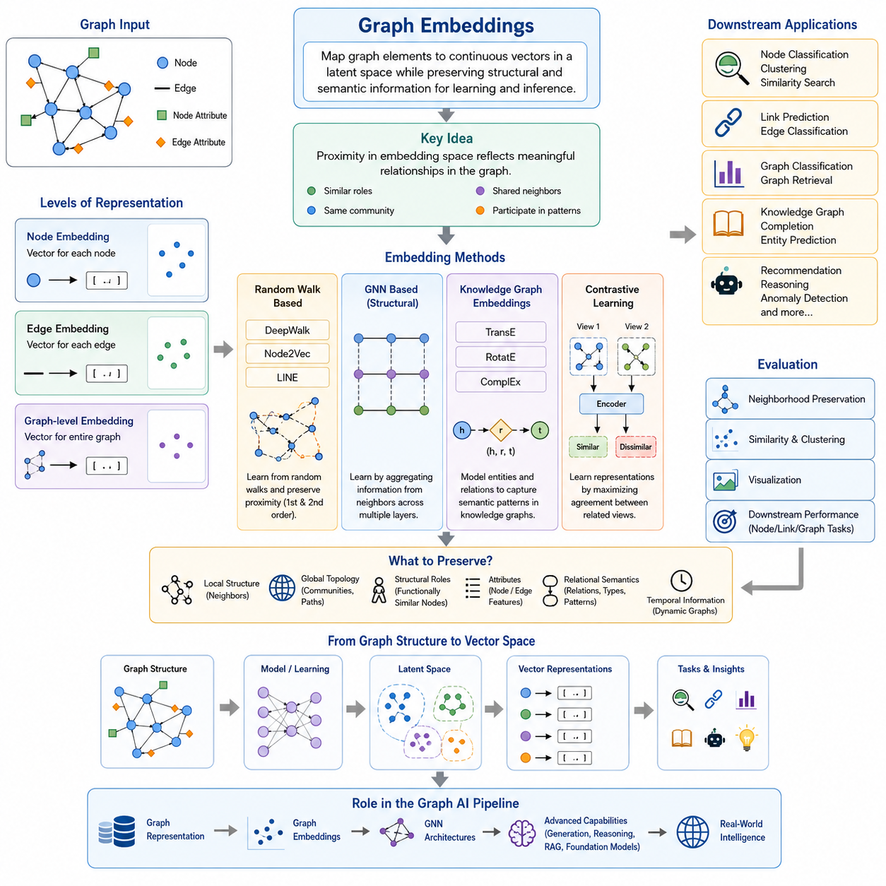
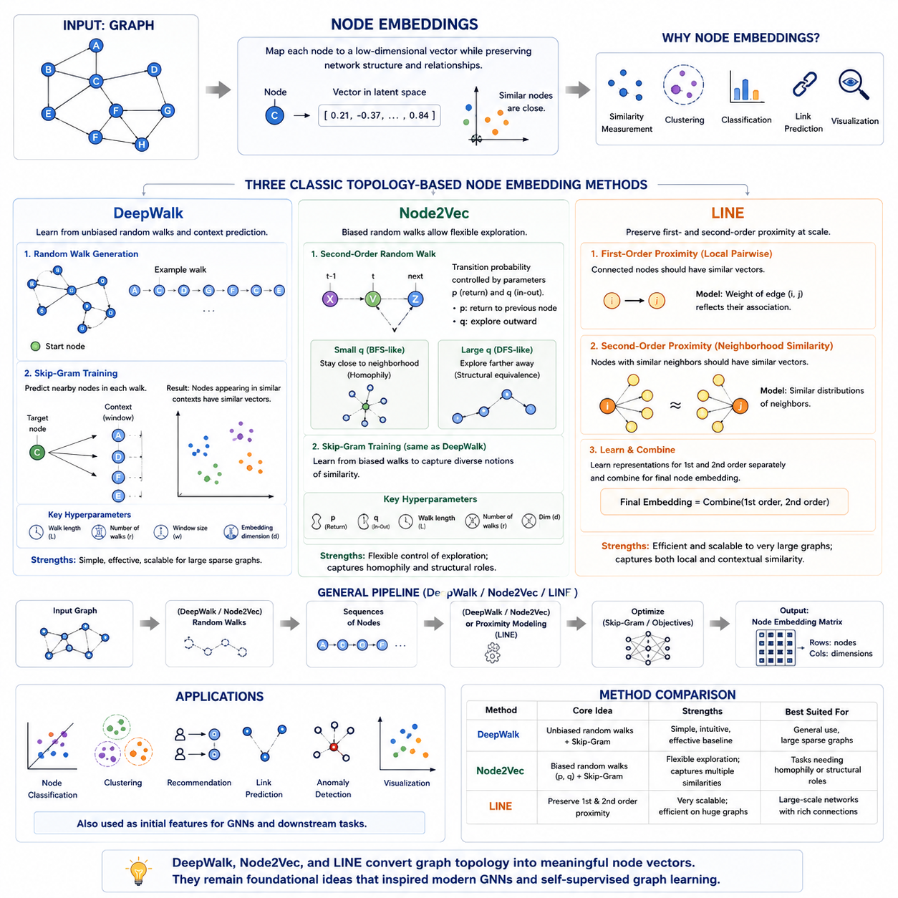
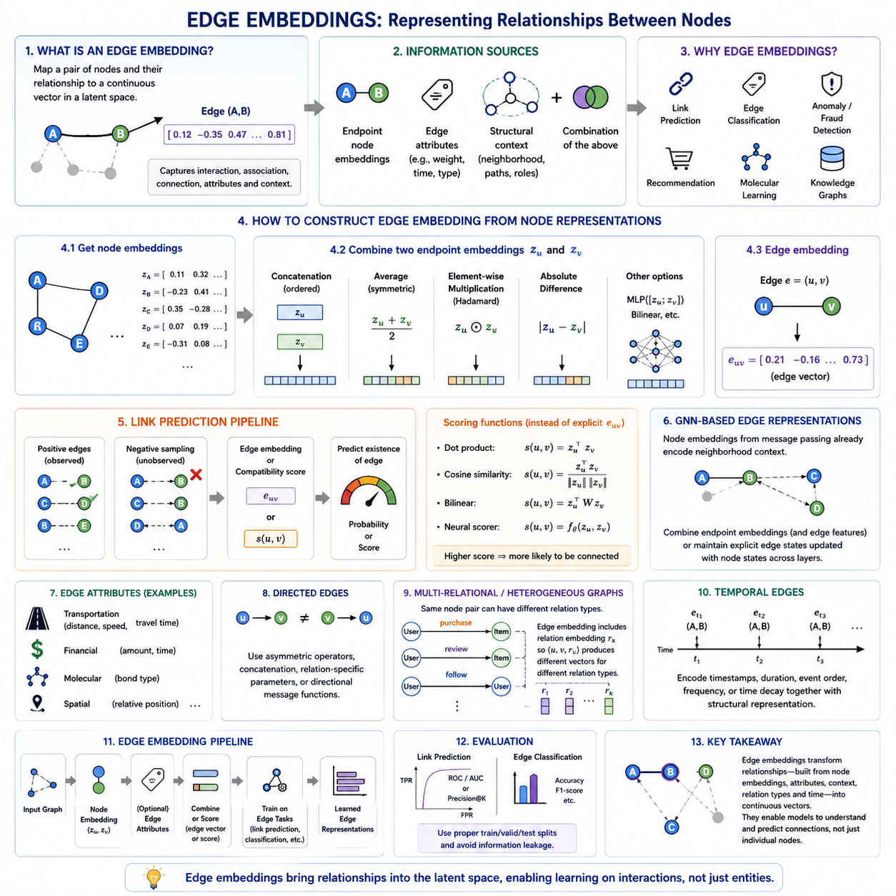
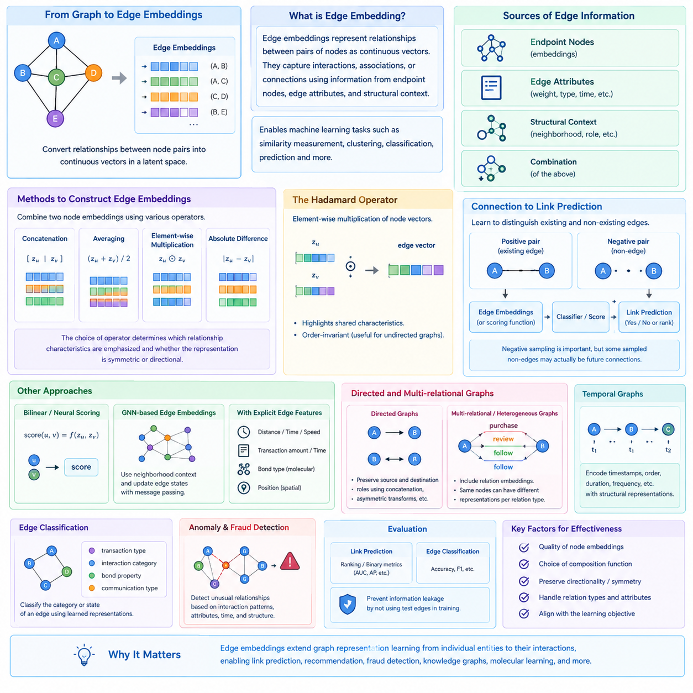
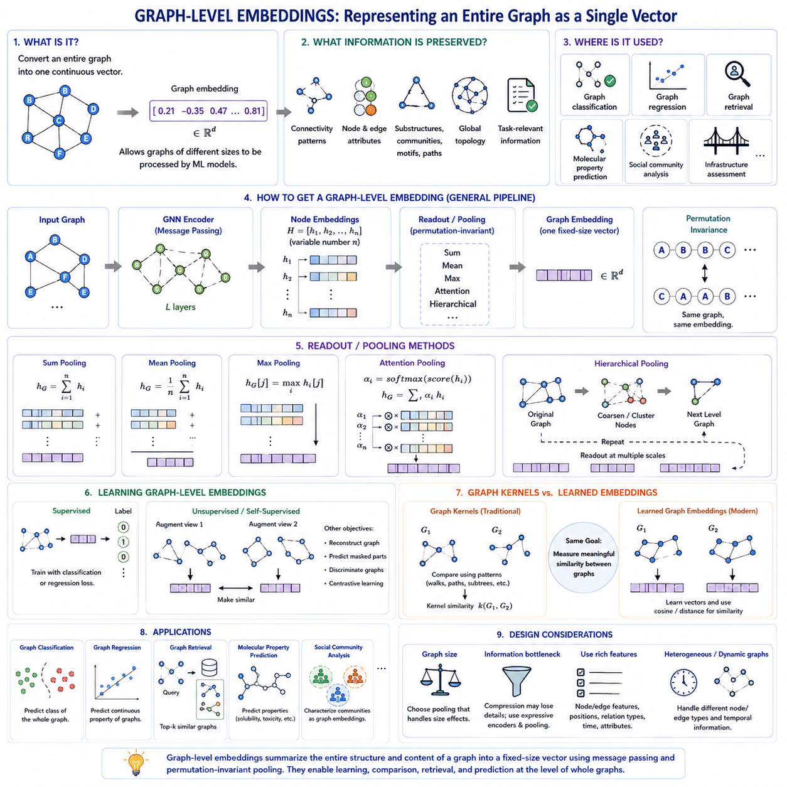
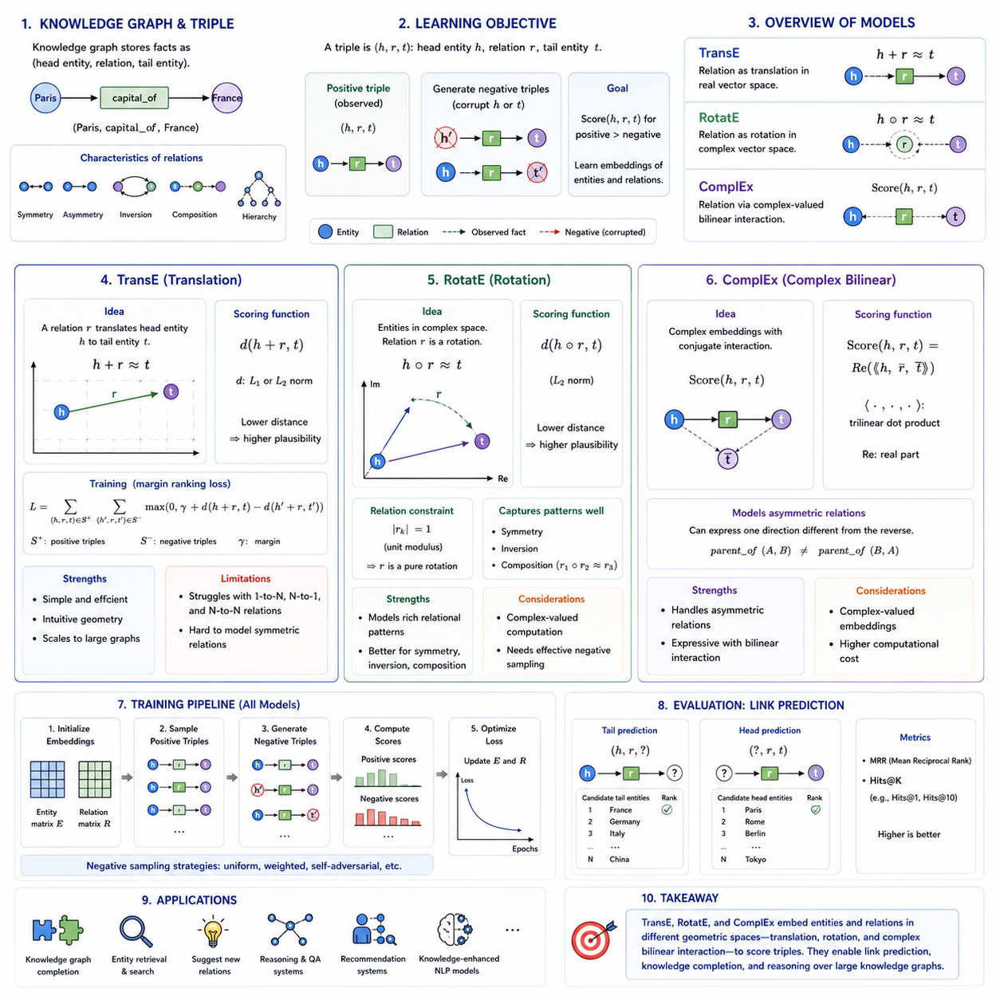
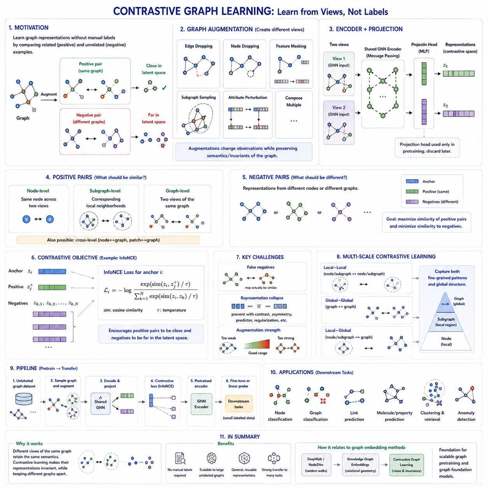
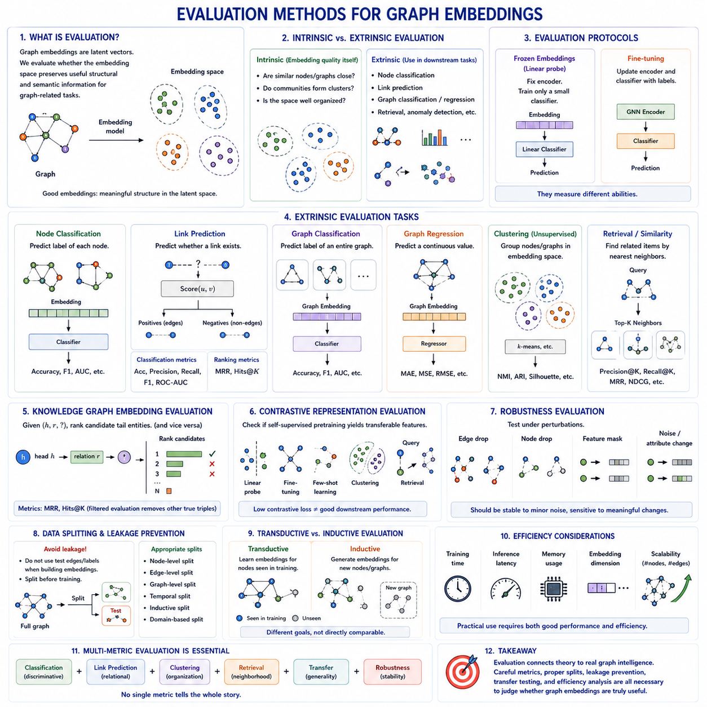

**Volume 29. Graph Deep Learning**

# Chapter 04. Graph Embeddings

## 04.00. Overview

{width="7.268055555555556in" height="7.268055555555556in"}

그래프 임베딩(Graph Embeddings)은 이산적인 그래프 구조(Discrete Graph Structures)를 머신러닝(Machine Learning) 모델이 효율적으로 처리할 수 있는 연속 벡터 표현(Continuous Vector Representations)으로 변환하는 방법을 제공합니다. 그래프(Graph)는 노드(Node), 엣지(Edge), 속성(Attribute), 복잡한 연결 패턴(Connectivity Patterns)을 포함할 수 있지만, 이러한 구조를 기존 학습 알고리즘에 항상 직접 사용할 수 있는 것은 아닙니다. 임베딩 방법(Embedding Methods)은 중요한 구조적·의미적 정보(Structural and Semantic Information)를 보존하면서 선택된 그래프 요소를 잠재 벡터 공간(Latent Vector Space)으로 매핑합니다.

핵심 개념은 임베딩 공간(Embedding Space)에서의 근접성(Proximity)이 원래 그래프에서의 의미 있는 관계를 반영하도록 만드는 것입니다. 유사한 구조적 역할(Structural Roles)을 수행하거나, 동일한 커뮤니티(Community)에 속하거나, 공통 이웃(Shared Neighbors)을 가지거나, 관련된 패턴에 참여하는 노드들은 서로 가까운 벡터로 표현될 수 있습니다. 유사성(Similarity)의 정의는 임베딩 목적(Embedding Objective)에 따라 달라지므로, 서로 다른 기법들은 지역 연결성(Local Connectivity), 전역 위상(Global Topology), 속성(Attributes), 관계 의미론(Relational Semantics)을 서로 다른 방식으로 보존합니다.

그래프 임베딩(Graph Embeddings)은 여러 표현 수준(Representation Levels)에서 동작할 수 있습니다. 노드 임베딩(Node Embeddings)은 각 노드에 하나의 벡터를 할당하며 노드 분류(Node Classification), 군집화(Clustering), 추천(Recommendation), 유사도 검색(Similarity Search)에 활용됩니다. 엣지 임베딩(Edge Embeddings)은 노드 쌍 사이의 관계를 표현하며 링크 예측(Link Prediction)을 지원합니다. 그래프 수준 임베딩(Graph-Level Embeddings)은 전체 그래프를 하나의 표현으로 압축하여 완전한 그래프들을 개별 데이터 객체로 비교하거나 분류할 수 있도록 합니다.

초기의 그래프 임베딩(Graph Embedding) 방법들은 깊은 메시지 전달 네트워크(Deep Message-Passing Networks)에 의존하지 않고 그래프 위상(Graph Topology)으로부터 직접 표현을 학습하는 경우가 많았습니다. 딥워크(DeepWalk)는 그래프에서의 랜덤 워크(Random Walk)를 시퀀스(Sequence)로 해석하고 동시 출현 패턴(Co-occurrence Patterns)을 이용해 노드 표현을 학습합니다. 노드투벡(Node2Vec)은 랜덤 워크의 동작을 조절하여 지역 이웃(Local Neighborhoods) 또는 더 넓은 구조적 역할(Structural Roles)을 강조하도록 확장합니다. 라인(LINE)은 대규모 네트워크에서 1차 근접성(First-Order Proximity)과 2차 근접성(Second-Order Proximity)을 보존하는 데 초점을 둡니다.

이러한 접근법은 그래프 학습(Graph Learning)과 분포적 표현 학습(Distributional Representation Learning) 사이의 중요한 연결 관계를 보여줍니다. 비슷한 언어적 문맥(Linguistic Contexts)에 등장하는 단어들이 유사한 단어 임베딩(Word Embeddings)을 얻는 것처럼, 비슷한 그래프 이웃(Graph Neighborhoods)에 등장하는 노드들도 유사한 그래프 임베딩(Graph Embeddings)을 얻을 수 있습니다. 랜덤 워크(Random Walk)는 사실상 그래프 기반 문맥(Graph-Based Contexts)을 생성하여 위상 구조(Topology)를 시퀀스로 변환하고, 표현 학습 목적(Representation-Learning Objectives)이 그 안의 규칙성을 추출하도록 합니다. 이러한 관점은 고전적 임베딩(Classical Embeddings)에서 현대적인 자기지도 그래프 학습(Self-Supervised Graph Learning)으로 이어지는 직관적인 연결고리를 제공합니다.

현대적인 그래프 신경망(Graph Neural Networks, GNNs)은 반복적인 이웃 집계(Neighborhood Aggregation)를 통해 임베딩을 학습함으로써 이러한 개념을 일반화합니다. 위상 구조(Topology)를 단순히 랜덤 워크 시퀀스의 원천으로 사용하는 대신, 그래프 신경망(GNN)은 연결된 노드의 정보, 엣지 관계(Edge Relationships), 사용 가능한 속성(Attributes)을 결합합니다. 연속된 계층은 수용 영역(Receptive Field)을 확장하여 각 표현이 점점 더 넓은 구조적 문맥(Structural Context)을 인코딩하도록 합니다. 따라서 생성된 임베딩은 고정된 그래프 위상 설명이 아니라 작업 적응형 표현(Task-Adaptive Representations)이 됩니다.

지식 그래프 임베딩(Knowledge Graph Embeddings)은 엣지 자체가 명시적인 의미 유형(Semantic Types)을 가지므로 추가적인 표현 요구사항을 갖습니다. 지식 그래프(Knowledge Graph)는 일반적으로 헤드 엔티티(Head Entity), 관계(Relation), 테일 엔티티(Tail Entity)로 구성된 트리플(Triple) 형태로 정보를 표현합니다. 따라서 임베딩 모델은 엔티티(Entity)와 관계(Relation)를 함께 표현하는 벡터 또는 변환(Transformation)을 학습합니다. 트랜스E(TransE), 로테이트E(RotatE), 컴플렉스(ComplEx)와 같은 방법들은 서로 다른 기하학적 가정(Geometric Assumptions)을 이용하여 관계 패턴(Relational Patterns)을 표현하고 엔티티 예측(Entity Prediction)과 지식 그래프 완성(Knowledge Graph Completion)을 지원합니다.

트랜스E(TransE)는 관계(Relation)를 엔티티 벡터(Entity Vectors) 사이의 이동(Translation)으로 근사하여 관계 구조에 대한 단순한 기하학적 해석을 제공합니다. 로테이트E(RotatE)는 복소수 임베딩 공간(Complex-Valued Embedding Space)에서 관계를 회전(Rotation)으로 표현하여 여러 중요한 관계 패턴을 보다 자연스럽게 포착할 수 있습니다. 컴플렉스(ComplEx) 역시 복소수 표현(Complex-Valued Representations)을 사용하지만 비대칭 관계(Asymmetric Relationships)를 모델링할 수 있는 점수 계산 방식(Scoring Formulation)을 사용합니다. 이러한 방법들은 잠재 공간(Latent Space)의 기하학적 구조가 임베딩이 표현할 수 있는 관계 구조를 결정한다는 점을 보여줍니다.

대조 그래프 학습(Contrastive Graph Learning)은 임베딩을 자기지도 표현 학습(Self-Supervised Representation Learning)의 영역으로 확장합니다. 모든 학습 샘플에 명시적인 레이블(Label)을 요구하는 대신, 모델은 노드(Node), 서브그래프(Subgraph), 전체 그래프(Graph)의 서로 관련된 뷰(View)를 생성하고 관련된 표현은 가깝게, 부적절한 대응 관계는 멀어지도록 학습할 수 있습니다. 그래프 증강(Graph Augmentation)은 중요한 의미 정보를 유지하면서 특징(Feature)이나 위상 구조(Topology)를 변경할 수 있으며, 이를 통해 잠재 공간이 우연한 세부 정보보다 안정적인 특성을 보존하도록 유도합니다.

따라서 임베딩을 출력 표현(Output Representation)으로 보는 것과 학습 메커니즘(Learning Mechanism)으로 보는 것을 구분하는 것이 유용합니다. 랜덤 워크 알고리즘(Random-Walk Algorithms), 행렬 기반 접근법(Matrix-Based Approaches), 지식 그래프 모델(Knowledge Graph Models), 그래프 신경망 인코더(GNN Encoders), 대조 학습 방법(Contrastive Methods)은 서로 매우 다른 학습 절차를 사용할 수 있지만, 모두 그래프 객체(Graph Objects)의 연속적인 표현을 생성할 수 있습니다. 임베딩은 구조적 관계를 통계적 학습 및 신경망 학습 알고리즘이 처리할 수 있도록 만드는 잠재 좌표계(Latent Coordinate System)라고 볼 수 있습니다.

임베딩의 품질(Embedding Quality)은 목표 문제(Target Problem)를 해결하기 위해 어떤 정보를 보존해야 하는가에 따라 결정됩니다. 지역 이웃 보존(Local Neighborhood Preservation)은 커뮤니티 중심 작업에 충분할 수 있지만, 구조적 역할 발견(Structural-Role Discovery)은 서로 멀리 떨어져 있더라도 유사한 기능을 수행하는 노드를 인식하는 표현을 요구할 수 있습니다. 지식 그래프는 관계 의미론(Relational Semantics)을 필요로 하고, 동적 그래프(Dynamic Graphs)는 시간 정보(Temporal Information)를 요구할 수 있으며, 속성 그래프(Attributed Graphs)는 연결 구조와 노드 또는 엣지 특징 사이의 균형을 유지해야 합니다. 따라서 모든 그래프 문제에 최적인 하나의 임베딩 기하 구조(Embedding Geometry)는 존재하지 않습니다.

평가(Evaluation)는 결과적으로 임베딩 자체의 표현 특성과 다운스트림 성능(Downstream Performance)을 모두 고려해야 합니다. 임베딩은 이웃 보존(Neighborhood Preservation), 유사도 관계(Similarity Relationships), 군집화 품질(Clustering Quality), 시각화(Visualization)를 통해 분석할 수 있지만, 실제 활용성은 일반적으로 노드 분류(Node Classification), 링크 예측(Link Prediction), 그래프 분류(Graph Classification), 검색(Retrieval) 등의 목표 작업을 통해 평가됩니다. 따라서 이 장의 구조에서는 노드, 엣지, 그래프 수준, 지식 그래프, 대조 임베딩 이후에 평가 방법(Evaluation Methods)을 배치하여 다양한 임베딩 계열 전반에서 평가가 공통적인 핵심 요소임을 강조합니다.

그래프 임베딩(Graph Embeddings)은 궁극적으로 기호적 관계 구조(Symbolic Relational Structure)와 수치적 학습(Numerical Learning) 사이를 연결하는 다리 역할을 합니다. 연결성(Connectivity), 이웃 관계(Neighborhoods), 구조적 역할(Roles), 속성(Attributes), 의미적 관계(Semantic Relations)를 신경망과 다른 머신러닝 알고리즘이 처리할 수 있는 표현으로 변환합니다. 이러한 연결은 그래프가 관계적 조직(Relational Organization)에서 얻어진 정보를 유지하면서 예측(Prediction), 검색(Retrieval), 추천(Recommendation), 추론(Reasoning), 군집화(Clustering), 표현 전이(Representation Transfer)에 활용될 수 있도록 하므로 현대 그래프 AI(Graph AI)의 핵심 기반이 됩니다.

더 넓은 그래프 딥러닝(Graph Deep Learning) 파이프라인에서 임베딩은 그래프 표현(Graph Representation)과 그래프 신경망(GNN) 아키텍처를 그래프 생성(Graph Generation), 지식 그래프 추론(Knowledge Graph Reasoning), 그래프 RAG(Graph RAG), 멀티모달 그래프(Multimodal Graphs), 그래프 파운데이션 모델(Foundation Models for Graphs)과 같은 고급 기능으로 연결합니다. 따라서 그래프 구조에서 학습된 잠재 표현(Learned Latent Representation)으로의 발전은 단순한 차원 축소(Dimensionality Reduction) 과정이 아니라, 더욱 정교한 그래프 지능(Graph Intelligence)을 구축하기 위한 표현적 기반(Representational Foundation)을 확립하는 과정입니다.

## 04.01. Node Embeddings

{width="7.268055555555556in" height="7.268055555555556in"}

노드 임베딩(Node Embeddings)은 그래프(Graph)의 개별 노드를 연속적인 저차원 벡터(Continuous Low-Dimensional Vectors)로 변환하면서 네트워크(Network) 내부에서 노드가 가지는 위치와 관계에 대한 유용한 정보를 보존합니다. 노드를 단순한 이산 식별자(Discrete Identifier)로 표현하는 대신, 임베딩 방법(Embedding Methods)은 잠재 공간(Latent Space)에서 각 노드에 수치 좌표를 할당합니다. 따라서 유사한 이웃 관계(Neighborhoods), 연결 패턴(Connectivity Patterns), 구조적 역할(Structural Roles)을 가진 노드들은 서로 유사한 벡터 표현(Vector Representations)을 얻을 수 있습니다.

이러한 변환을 통해 그래프 정보(Graph Information)를 유사도 측정(Similarity Measurement), 군집화(Clustering), 분류(Classification), 예측(Prediction)과 같은 기존 머신러닝(Machine Learning) 연산에 사용할 수 있습니다. 노드가 벡터로 표현되면 코사인 유사도(Cosine Similarity)나 유클리드 거리(Euclidean Distance)를 이용하여 원래 그래프 위상(Graph Topology)에 간접적으로 표현되어 있던 관계를 측정할 수 있습니다. 따라서 노드 임베딩은 이산적인 네트워크 구조(Discrete Network Structures)와 연속적인 표현 학습(Continuous Representation Learning)을 연결하는 중요한 역할을 합니다.

핵심적인 문제는 잠재 공간(Latent Space)이 어떤 종류의 그래프 유사성(Graph Similarity)을 보존해야 하는지를 결정하는 것입니다. 두 노드는 직접 연결되어 있거나, 많은 이웃을 공유하거나, 동일한 커뮤니티(Community)에 속하거나, 유사한 경로에 등장하거나, 비슷한 구조적 역할을 수행하기 때문에 유사하다고 판단될 수 있습니다. 서로 다른 노드 임베딩 알고리즘(Node Embedding Algorithms)은 서로 다른 근접성(Proximity)을 인코딩하므로 지역 이웃(Local Neighborhoods), 광범위한 위상 구조(Broader Topology), 구조적 동등성(Structural Equivalence)을 서로 다르게 강조할 수 있습니다.

딥워크(DeepWalk)는 랜덤 워크(Random Walk)와 자연어 표현 학습(Natural Language Representation Learning)의 개념을 결합한 영향력 있는 접근법을 제시했습니다. 그래프의 노드에서 시작하여 알고리즘은 반복적으로 랜덤 워크를 수행하고 방문한 노드의 시퀀스(Sequence)를 생성합니다. 이러한 시퀀스는 문장(Sentence)과 유사하게 해석할 수 있으며, 여기에서 노드는 단어(Word)에 대응하고 그래프 이웃(Graph Neighborhoods)은 분산 표현(Distributed Representations)을 학습하기 위한 문맥 관계(Contextual Relationships)를 생성합니다.

랜덤 워크가 생성된 이후 딥워크(DeepWalk)는 일반적으로 스킵그램(Skip-Gram) 방식의 목적 함수(Objective)를 적용하여 각 워크 내부에서 가까이 위치한 노드를 예측합니다. 두 노드가 유사한 랜덤 워크 문맥(Random-Walk Contexts)에 자주 등장하면 잠재 공간에서 두 노드의 임베딩이 가까워지도록 학습됩니다. 이러한 방식으로 딥워크는 대규모 행렬 분해(Matrix Factorization)를 명시적으로 수행하지 않고 그래프 근접성(Graph Proximity)을 포착할 수 있으며, 비교적 큰 희소 네트워크(Sparse Networks)에도 적용할 수 있습니다.

최소한의 딥워크(DeepWalk) 구현은 개념적으로 두 단계로 구성됩니다. 첫 번째 단계에서는 그래프로부터 다수의 랜덤 워크(Random Walks)를 샘플링하며, 일반적으로 여러 노드에서 시작하여 이웃 노드를 반복적으로 선택합니다. 두 번째 단계에서는 생성된 노드 시퀀스를 임베딩 모델(Embedding Model)의 학습 데이터로 사용합니다. 워크 길이(Walk Length), 워크 횟수(Number of Walks), 문맥 윈도 크기(Context-Window Size), 임베딩 차원(Embedding Dimension)은 학습되는 표현을 결정하는 중요한 하이퍼파라미터(Hyperparameters)가 됩니다.

노드투벡(Node2Vec)은 딥워크의 랜덤 워크 원리를 확장하여 편향된 2차 랜덤 워크(Biased Second-Order Random Walk)를 도입합니다. 모든 이웃 노드를 동일한 확률로 선택하는 대신, 노드투벡은 이전 노드(Previous Node), 현재 노드(Current Node), 가능한 다음 노드(Next Node) 사이의 관계에 따라 전이 확률(Transition Probabilities)을 조절합니다. 이를 통해 샘플링 과정이 지역 이웃(Local Neighborhoods)과 보다 멀리 떨어진 구조적 패턴(Structural Patterns)을 어떻게 탐색할 것인지 명시적으로 제어할 수 있습니다.

일반적으로 p와 q로 표현되는 두 개의 파라미터가 이러한 동작을 제어합니다. 복귀 파라미터(Return Parameter) p는 직전에 방문했던 노드로 즉시 돌아갈 가능성에 영향을 주며, 진출 파라미터(In-Out Parameter) q는 워크가 현재 이웃 영역에 머무를지 또는 그래프의 바깥 방향으로 이동할지를 조절합니다. 이러한 파라미터를 조정하면 노드투벡(Node2Vec)은 너비 우선 탐색(Breadth-First Search)과 유사한 탐색에서 깊이 우선 탐색(Depth-First Search)과 유사한 탐색까지 다양한 동작을 구현할 수 있습니다.

너비 중심 샘플링(Breadth-Oriented Sampling)은 유사한 지역 커뮤니티(Local Communities)에 연결된 노드들이 비슷한 표현을 얻는 동질성(Homophily)을 강조하는 경향이 있습니다. 반면 깊이 중심 탐색(Depth-Oriented Exploration)은 서로 같은 이웃에 존재하지 않더라도 비슷한 네트워크 역할(Network Roles)을 수행하는 노드들을 유사하게 표현하는 구조적 동등성(Structural Equivalence)을 포착할 수 있습니다. 따라서 노드투벡은 서로 다른 그래프 작업(Graph Tasks)이 서로 다른 유사성 개념을 요구할 때 비편향 랜덤 워크(Unbiased Random Walk)보다 높은 유연성을 제공합니다.

구현 관점에서 노드투벡(Node2Vec)은 딥워크와 유사한 파이프라인(Pipeline)을 사용하지만 워크 생성 과정(Walk-Generation Procedure)을 변경합니다. 그래프 구조와 p 및 q 파라미터를 이용하여 전이 확률을 계산하고, 편향된 워크(Biased Walks)를 샘플링한 다음 생성된 시퀀스를 스킵그램(Skip-Gram) 형태의 임베딩 학습기에 전달합니다. 학습된 벡터는 이후 각 행(Row)이 그래프의 하나의 노드를 표현하는 임베딩 행렬(Embedding Matrix)로 출력할 수 있습니다.

딥워크(DeepWalk)와 노드투벡(Node2Vec)은 그래프 표현 학습(Graph Representation Learning)을 문맥 예측 문제(Context-Prediction Problem)로 변환한다는 점에서 특히 직관적입니다. 이들의 성능은 샘플링된 경로(Sampled Paths)에 크게 의존합니다. 랜덤 워크는 어떤 노드들이 반복적으로 함께 등장하는지를 결정하고, 결과적으로 어떤 관계가 학습 목적 함수에 노출되는지를 결정합니다. 표준 형태에서 이들은 학습 그래프에 존재하는 노드의 임베딩을 직접 학습하기 때문에 변환적 방법(Transductive Methods)에 해당하며, 일반적인 노드 인코더(Node Encoder)를 통해 새로운 노드의 표현을 생성하는 방식과는 차이가 있습니다.

라인(LINE, Large-scale Information Network Embedding)은 노드 표현(Node Representation)에 대해 다른 관점에서 접근합니다. 랜덤 워크 시퀀스에 주로 의존하는 대신, 라인은 대규모 네트워크에서 관찰되는 근접 관계(Proximity Relationships)를 명시적으로 보존하려고 합니다. 특히 확장성(Scalability)을 중요하게 고려하여 설계되었으며, 효율적인 엣지 샘플링(Edge Sampling)과 최적화 전략(Optimization Strategies)을 통해 매우 많은 노드와 엣지를 포함하는 그래프에서도 동작할 수 있습니다.

라인(LINE)의 1차 근접성(First-Order Proximity)은 노드 사이의 직접적인 관계를 나타냅니다. 두 노드가 높은 가중치(Weight)를 가진 엣지로 연결되어 있다면 해당 임베딩은 이러한 직접적인 연관성을 반영해야 합니다. 따라서 1차 근접성을 보존하는 것은 지역적인 쌍별 구조(Local Pairwise Structure)를 포착하며, 그래프의 엣지가 엔티티(Entity) 사이의 상호작용, 연관성, 통신 또는 다른 의미 있는 관계를 직접 나타내는 경우 특히 자연스럽게 적용됩니다.

2차 근접성(Second-Order Proximity)은 단순한 직접 연결보다 이웃 분포(Neighborhood Distributions)의 유사성에 초점을 맞춥니다. 두 노드가 서로 직접 연결되어 있지 않더라도 비슷한 이웃 노드 집합과 상호작용한다면 두 노드를 유사하다고 판단할 수 있습니다. 라인(LINE)은 노드와 그 문맥(Context)에 대응하는 별도의 표현을 이용하여 이러한 관계를 모델링하고, 보다 넓은 의미의 지역 네트워크 구조(Local Network Structure)를 보존할 수 있도록 합니다.

1차 및 2차 라인 표현(First-Order and Second-Order LINE Representations)은 각각 별도로 학습한 후 결합하여 더욱 풍부한 노드 표현을 구성할 수 있습니다. 이러한 구분은 그래프 임베딩의 일반적인 원리를 보여줍니다. 즉, 직접 연결성(Direct Connectivity)과 문맥적 유사성(Contextual Similarity)은 서로 관련되어 있지만 동일한 정보는 아닙니다. 두 가지를 모두 보존하면 직접적인 그래프 관계뿐만 아니라 유사한 이웃 환경(Neighborhood Environments)에 존재하는 노드까지 포착할 수 있습니다.

따라서 딥워크(DeepWalk), 노드투벡(Node2Vec), 라인(LINE)은 위상 구조 기반 노드 임베딩(Topology-Driven Node Embedding)을 대표하는 세 가지 기초적인 접근법입니다. 딥워크는 비편향 랜덤 워크 문맥(Unbiased Random-Walk Contexts)에서 학습하고, 노드투벡은 편향 랜덤 워크(Biased Random Walks)를 통해 탐색 방식을 제어하며, 라인은 1차 및 2차 네트워크 근접성(Network Proximity)을 직접 모델링합니다. 최적화 과정은 서로 다르지만 세 방법 모두 원래 그래프 구조의 유용한 관계 정보를 유지하는 압축된 잠재 공간(Compact Latent Space)을 구축하는 것을 목표로 합니다.

학습된 임베딩은 이후 노드 분류(Node Classification), 군집화(Clustering), 추천(Recommendation), 이상 탐지(Anomaly Detection), 시각화(Visualization), 링크 예측(Link Prediction)을 위한 특징(Features)으로 활용될 수 있습니다. 또한 보다 발전된 그래프 학습 시스템(Graph Learning Systems)의 초기 노드 표현(Initial Node Representations)으로도 사용할 수 있습니다. 이 방법들의 역사적 중요성은 직접적인 응용을 넘어 이후 그래프 신경망(Graph Neural Networks), 자기지도 그래프 학습(Self-Supervised Graph Learning), 현대 그래프 표현 모델(Graph Representation Models)로 일반화된 여러 핵심 원리를 확립했다는 데 있습니다.

관찰된 각 노드에 하나의 벡터를 직접 최적화하는 고전적인 노드 임베딩(Classical Node Embedding) 방법과 달리, 현대적인 그래프 신경망 기반 접근법(GNN-Based Approaches)은 특징과 이웃 정보를 집계하여 표현을 생성하는 매개변수화 함수(Parameterized Functions)를 학습합니다. 이러한 차이는 새로운 노드(New Nodes)나 변화하는 그래프(Changing Graphs)를 처리해야 하는 상황에서 특히 중요합니다. 그럼에도 딥워크(DeepWalk), 노드투벡(Node2Vec), 라인(LINE)은 그래프 위상 구조(Graph Topology)가 어떻게 의미 있는 연속 표현(Continuous Representations)으로 변환될 수 있는지를 이해하기 위한 중요한 개념적 기반으로 남아 있습니다.

## 04.02. Edge Embeddings

{width="7.268055555555556in" height="7.268055555555556in"}

{width="7.268055555555556in" height="7.268055555555556in"}

엣지 임베딩(Edge Embeddings)은 노드 쌍(Pairs of Nodes) 사이의 관계를 잠재 공간(Latent Space)의 연속 벡터(Continuous Vectors)로 표현합니다. 노드 임베딩(Node Embeddings)이 개별 엔티티(Entity)를 설명하는 반면, 엣지 임베딩은 이러한 엔티티 사이의 상호작용(Interactions), 연관성(Associations), 연결 관계(Connections)에 초점을 맞춥니다. 많은 그래프 학습(Graph Learning) 문제는 노드 자체가 무엇을 나타내는지뿐만 아니라 관찰되거나 잠재적인 엣지를 통해 노드 쌍이 어떻게 관계를 맺는지를 이해해야 하므로 이러한 구분은 중요합니다.

엣지(Edge)는 양 끝점 노드(Endpoint Nodes), 명시적인 엣지 속성(Edge Attributes), 구조적 문맥(Structural Context), 또는 이러한 정보의 조합으로부터 얻어진 정보를 포함할 수 있습니다. 예를 들어 소셜 네트워크(Social Network)의 엣지는 친구 관계를 나타낼 수 있으며, 거래 네트워크(Transaction Network)의 엣지는 금액과 타임스탬프(Timestamp)를 포함하는 결제를 나타낼 수 있습니다. 엣지 임베딩은 서로 다른 형태의 관계 정보를 머신러닝(Machine Learning) 모델이 처리할 수 있는 통합된 수치 표현으로 제공합니다.

일반적인 전략은 두 끝점 노드의 임베딩으로부터 엣지 임베딩을 구성하는 것입니다. 노드 u와 v가 각각 벡터 z_u와 z_v를 가진다면 두 벡터를 결합하는 연산자(Operator)를 이용하여 엣지 표현을 생성할 수 있습니다. 어떤 연산자를 선택하는가에 따라 관계의 어떤 특성이 강조되는지가 결정되며, 생성된 표현이 두 끝점을 대칭적으로 처리할 것인지 또는 각 노드의 방향적 역할(Directional Roles)을 유지할 것인지도 달라집니다.

간단한 결합 방법에는 연결(Concatenation), 평균(Averaging), 원소별 곱(Element-Wise Multiplication), 절댓값 차이(Absolute Difference)가 있습니다. 연결은 두 끝점의 전체 표현과 순서를 유지할 수 있어 방향 관계(Directed Relationships)에 유용합니다. 평균은 압축된 대칭 표현(Symmetric Representation)을 생성하고, 원소별 곱은 두 노드가 모두 강하게 반응하는 차원을 강조합니다. 절댓값 차이는 두 노드 벡터가 각각의 차원에서 얼마나 다른지를 표현합니다.

하다마드 연산자(Hadamard Operator)는 엣지 표현을 구성하기 위해 널리 사용되는 원소별 곱(Element-Wise Multiplication) 방법입니다. 두 노드 임베딩의 대응하는 차원을 서로 곱하여 엣지 벡터를 생성합니다. 노드 임베딩이 서로 호환되는 잠재 특성(Latent Properties)을 인코딩하고 있다면 이 연산은 두 끝점이 공유하는 특성을 강조할 수 있습니다. 또한 두 노드의 순서를 바꾸어도 동일한 표현이 생성되므로 무방향 그래프(Undirected Graphs)에 편리하게 적용할 수 있습니다.

엣지 임베딩은 그래프 표현 학습(Graph Representation Learning)의 핵심 작업 중 하나인 링크 예측(Link Prediction)과 밀접하게 연결됩니다. 링크 예측은 현재 연결되지 않은 두 노드 사이에 엣지가 존재해야 하는지 또는 관찰된 연결이 앞으로 유지될 가능성이 있는지를 판단합니다. 모델은 기존 엣지를 나타내는 양성 노드 쌍(Positive Node Pairs)과 연결되지 않은 노드 쌍을 나타내는 음성 쌍(Negative Pairs)의 임베딩을 생성한 후, 이들을 구분하는 분류기(Classifier) 또는 점수 함수(Scoring Function)를 학습할 수 있습니다.

따라서 음성 샘플링(Negative Sampling)은 많은 엣지 임베딩 파이프라인(Edge-Embedding Pipelines)에서 중요한 부분입니다. 그래프는 관찰된 엣지를 명시적으로 제공하지만 일반적으로 레이블이 지정된 모든 비연결 엣지(Non-Edges)를 제공하지는 않습니다. 연결되지 않은 노드 쌍을 샘플링하여 음성 예제(Negative Examples)로 사용함으로써 학습 데이터를 생성할 수 있습니다. 그러나 일부 비연결 노드는 실제로 불가능한 관계가 아니라 아직 관찰되지 않은 관계일 수도 있으므로 주의가 필요합니다.

엣지 벡터를 명시적으로 생성하는 대신 일부 방법은 끝점 임베딩으로부터 직접 호환성 점수(Compatibility Score)를 계산합니다. 내적(Dot Product), 코사인 유사도(Cosine Similarity), 쌍선형 함수(Bilinear Functions), 신경망 점수 함수(Neural Scoring Networks)를 이용하여 두 노드가 얼마나 잘 연결될 수 있는지를 평가할 수 있습니다. 높은 점수는 더 높은 연결 확률을 나타낼 수 있습니다. 이러한 방식은 디코더(Decoder)가 잠재 노드 표현으로부터 그래프 연결성을 복원하는 그래프 오토인코더(Graph Autoencoders)와 링크 예측 시스템에서 일반적으로 사용됩니다.

그래프 신경망(Graph Neural Networks, GNNs)은 이웃 문맥(Neighborhood Context)을 포함하여 더욱 풍부한 엣지 표현을 생성할 수 있습니다. 메시지 전달(Message Passing)을 통해 생성된 노드 임베딩은 이미 주변 그래프 영역의 정보를 요약하고 있으므로 이러한 두 노드 임베딩을 결합하면 단순한 끝점 정보 이상의 구조적 문맥을 반영할 수 있습니다. 일부 아키텍처는 명시적인 엣지 상태(Edge States)를 유지하고 메시지 전달 과정에서 노드 상태와 함께 업데이트하여 여러 네트워크 계층을 거치면서 관계 특징(Relational Features)이 발전하도록 합니다.

연결 자체가 고유한 속성을 가지는 경우 명시적인 엣지 특징(Explicit Edge Features)은 특히 중요합니다. 교통 네트워크(Transportation Networks)는 도로에 거리, 제한 속도, 이동 시간을 연결할 수 있고, 금융 그래프(Financial Graphs)는 거래 금액과 시간을 포함할 수 있습니다. 분자 그래프(Molecular Graphs)는 결합 유형(Bond Type)을 표현하며, 공간 그래프(Spatial Graphs)는 상대 위치(Relative Position)를 인코딩할 수 있습니다. 이러한 경우 엣지 임베딩은 끝점 표현과 인코딩된 엣지 속성을 결합하여 엔티티와 상호작용을 함께 표현할 수 있습니다.

방향 그래프(Directed Graphs)는 u에서 v로 향하는 엣지가 v에서 u로 향하는 엣지와 다른 의미를 가질 수 있기 때문에 특별한 고려가 필요합니다. 평균이나 절댓값 차이와 같은 대칭 연산자(Symmetric Operators)는 이러한 방향을 구별할 수 없습니다. 연결(Concatenation), 비대칭 변환(Asymmetric Transformations), 관계별 파라미터(Relation-Specific Parameters), 방향성 메시지 함수(Directional Message Functions)를 사용하면 출발 노드(Source)와 도착 노드(Destination)의 역할을 유지할 수 있습니다. 따라서 임베딩 설계는 기반 그래프의 관계 의미와 일치해야 합니다.

다중 관계 그래프(Multi-Relational Graphs)와 이종 그래프(Heterogeneous Graphs)는 동일한 노드 쌍이 서로 다른 관계 유형(Relation Types)에 참여할 수 있기 때문에 추가적인 표현 차원을 요구합니다. 사용자는 상품을 구매하거나 리뷰할 수 있고 다른 사용자를 팔로우할 수도 있으며, 지식 그래프(Knowledge Graphs)는 명시적으로 유형이 지정된 의미 관계(Semantic Relations)를 포함합니다. 이러한 그래프의 엣지 표현은 일반적으로 관계 임베딩(Relation Embeddings)을 포함하여 동일한 끝점 노드라도 모델링되는 연결 유형에 따라 서로 다른 표현을 생성할 수 있도록 합니다.

시간 그래프(Temporal Graphs)는 시간(Time)을 도입함으로써 엣지 임베딩을 더욱 확장합니다. 관계는 생성되거나 사라지고, 반복되거나, 강도가 변화할 수 있으므로 일부 응용에서는 정적인 엣지 벡터(Static Edge Vector)만으로 충분하지 않습니다. 타임스탬프(Timestamps), 이벤트 순서(Event Order), 지속 시간(Duration), 상호작용 빈도(Interaction Frequency)와 같은 시간 정보를 구조적 표현과 함께 인코딩할 수 있습니다. 이를 통해 구조적으로 유사하지만 변화하는 그래프의 서로 다른 시점에 발생하는 관계를 구분할 수 있습니다.

엣지 임베딩은 연결의 존재 여부가 아니라 연결의 범주나 상태를 식별하는 엣지 분류(Edge Classification)에도 활용할 수 있습니다. 예를 들어 거래 유형(Transaction Types)을 분류하거나, 상호작용 범주(Interaction Categories)를 식별하거나, 분자 결합 특성(Molecular Bond Properties)을 예측하거나, 통신 네트워크의 서로 다른 관계를 구분할 수 있습니다. 학습된 엣지 표현은 관계 패턴(Relational Patterns)을 사전에 정의된 클래스로 매핑하는 분류기의 입력으로 사용됩니다.

이상 탐지(Anomaly Detection)와 사기 탐지(Fraud Detection) 역시 중요한 활용 분야입니다. 개별적으로는 정상으로 보이는 노드들이 서로 결합되었을 때 비정상적인 관계를 형성할 수 있습니다. 엣지 표현을 사용하면 모델은 해당 상호작용 자체를 일반적인 연결 패턴과 비교하여 평가할 수 있습니다. 따라서 비정상적인 끝점 조합, 속성, 시간적 행동(Temporal Behavior), 구조적 문맥을 비정상 엣지(Anomalous Edges)로 탐지할 수 있습니다.

엣지 임베딩의 효과는 기반이 되는 노드 표현의 품질과 선택한 결합 함수(Composition Function)에 크게 의존합니다. 우수한 두 개의 노드 임베딩이 모든 관계에 대해 자동으로 최적의 엣지 표현을 생성하는 것은 아닙니다. 학습 목적 함수(Learning Objective)는 목표 엣지 작업에 필요한 정보를 잠재 공간이 유지하도록 설계되어야 하며, 결합 메커니즘은 필요한 경우 방향성(Directionality), 대칭성(Symmetry), 관계 유형(Relation Type), 엣지 속성(Edge Attributes)을 보존해야 합니다.

평가(Evaluation)는 일반적으로 링크 예측(Link Prediction)이나 엣지 분류(Edge Classification)와 같은 다운스트림 관계 작업(Downstream Relational Tasks)을 통해 수행됩니다. 링크 예측에서는 모델이 실제 연결을 음성 쌍보다 얼마나 효과적으로 높은 순위에 배치하는지를 이진 예측(Binary Prediction)이나 순위 평가(Ranking)에 적합한 지표를 이용하여 측정할 수 있습니다. 또한 테스트 엣지를 이용해 생성된 임베딩이 모델이 예측해야 할 관계 정보를 미리 노출할 수 있으므로 평가 과정에서는 정보 누출(Information Leakage)을 방지해야 합니다.

엣지 임베딩(Edge Embeddings)은 궁극적으로 그래프 표현 학습을 개별 엔티티를 설명하는 수준에서 엔티티 사이의 상호작용을 설명하는 수준으로 확장합니다. 노드 쌍, 구조적 문맥, 엣지 속성, 관계 유형, 시간 정보를 연속적인 표현으로 변환함으로써 관계 자체를 학습 알고리즘이 직접 처리할 수 있도록 합니다. 이러한 능력은 링크 예측, 추천(Recommendation), 사기 탐지, 지식 그래프, 분자 학습(Molecular Learning) 등 고립된 노드보다 연결 관계를 이해하는 것이 중요한 다양한 그래프 AI(Graph AI) 시스템의 핵심 기반을 형성합니다.

## 04.03. Graph Level Embeddings

{width="7.268055555555556in" height="7.268055555555556in"}

그래프 수준 임베딩(Graph-Level Embeddings)은 전체 그래프(Entire Graph)를 하나의 연속적인 벡터 표현(Continuous Vector Representation)으로 변환합니다. 노드 임베딩(Node Embeddings)이 개별 엔티티(Entity)를 설명하고 엣지 임베딩(Edge Embeddings)이 관계(Relationship)를 설명하는 반면, 그래프 수준 임베딩은 완전한 그래프의 구조와 내용을 하나의 표현으로 요약합니다. 이를 통해 서로 다른 수의 노드와 엣지를 가진 그래프도 고정 차원 객체(Fixed-Dimensional Objects)로 변환하여 기존 머신러닝(Machine Learning) 모델에서 처리할 수 있습니다.

목표는 단순히 모든 노드 표현을 더 작은 벡터로 압축하는 것이 아니라, 하나의 그래프를 다른 그래프와 구별하는 정보를 보존하는 것입니다. 중요한 정보에는 연결 패턴(Connectivity Patterns), 노드 및 엣지 속성(Node and Edge Attributes), 하위 구조(Substructures), 커뮤니티(Communities), 모티프(Motifs), 경로(Paths), 전역 위상 구조(Global Topology) 등이 포함될 수 있습니다. 유용한 그래프 임베딩은 다운스트림 작업(Downstream Task)에 필요한 특성을 유지하면서 관련성이 낮은 구조적 변형은 제거해야 합니다.

각각의 학습 샘플 자체가 하나의 그래프인 경우 그래프 수준 표현(Graph-Level Representation)은 필수적입니다. 예를 들어 분자 학습(Molecular Learning)에서는 개별 분자를 원자(Atom)를 노드로, 화학 결합(Chemical Bond)을 엣지로 하는 그래프로 표현할 수 있습니다. 다른 분야에서는 그래프가 단백질(Protein), 소셜 커뮤니티(Social Community), 거래(Transaction), 프로그램 구조(Program Structure), 장면(Scene), 인프라 네트워크(Infrastructure Network)를 나타낼 수 있습니다. 따라서 분류, 회귀, 검색, 비교를 수행하기 전에 각각의 전체 그래프에 대해 하나의 표현을 생성해야 합니다.

일반적인 접근법은 먼저 개별 노드의 표현을 학습한 다음 리드아웃(Readout) 또는 풀링(Pooling) 연산을 적용하는 것입니다. 그래프에 h1, h2에서 hn까지의 노드 임베딩이 존재한다면 리드아웃 함수(Readout Function)는 크기가 가변적인 노드 집합을 하나의 고정 차원 그래프 벡터(Fixed-Dimensional Graph Vector)로 집계합니다. 이를 통해 지역 정보(Local Information)를 먼저 노드 수준에서 인코딩하고 이후 하나의 전역 그래프 표현(Global Graph Representation)으로 요약하는 일반적인 파이프라인을 구성할 수 있습니다.

간단한 전역 풀링(Global Pooling) 방법에는 합 풀링(Sum Pooling), 평균 풀링(Mean Pooling), 최대 풀링(Max Pooling)이 있습니다. 합 풀링은 모든 노드의 정보를 누적하므로 그래프 크기나 반복되는 구조와 관련된 신호를 보존할 수 있습니다. 평균 풀링은 노드들의 평균적인 특성을 표현하여 그래프 크기에 대한 민감도를 줄입니다. 최대 풀링은 각 임베딩 차원에서 가장 강한 활성값을 선택하여 특정 잠재 패턴(Latent Pattern)이 그래프의 어느 위치에든 존재하는지를 강조할 수 있습니다.

그래프 풀링(Graph Pooling)의 중요한 요구사항은 순열 불변성(Permutation Invariance)입니다. 일반적으로 그래프는 노드가 나열되는 순서가 바뀌어도 동일한 그래프이므로 그래프 수준 표현 역시 노드 순서 변경에 영향을 받아서는 안 됩니다. 합, 평균, 최대와 같은 연산은 결과가 노드 표현이 제시되는 순서가 아니라 노드 표현의 집합 자체에 의해 결정되므로 이러한 요구사항을 자연스럽게 만족합니다.

단순한 풀링의 품질은 집계되는 노드 임베딩의 품질에 크게 의존합니다. 메시지 전달(Message Passing)을 통해 각 노드 표현이 이미 주변 이웃 정보를 포함하고 있다면 전역 풀링은 지역 특징과 구조적 문맥(Structural Context)을 함께 요약할 수 있습니다. 풀링 이전에 더 깊은 그래프 신경망(Graph Neural Network, GNN) 계층을 사용하면 수용 영역(Receptive Field)을 확대할 수 있지만, 지나치게 깊어지면 과도한 평활화(Over-Smoothing)나 구별 가능한 지역 정보의 손실과 같은 문제가 발생할 수 있습니다.

더욱 표현력이 높은 리드아웃 메커니즘(Readout Mechanisms)은 서로 다른 노드가 최종 그래프 표현에 얼마나 기여하는지를 학습할 수 있습니다. 어텐션 기반 풀링(Attention-Based Pooling)은 모든 노드를 동일하게 처리하지 않고 서로 다른 중요도를 할당합니다. 학습된 점수 함수(Learned Scoring Function)는 목표 작업에 특히 중요한 노드나 하위 구조를 식별하여 최종 표현에 더 큰 영향을 주도록 만들 수 있습니다. 이는 대규모 그래프의 일부 영역만이 클래스, 속성 또는 동작을 결정하는 경우 유용합니다.

계층적 그래프 풀링(Hierarchical Graph Pooling)은 모든 노드를 즉시 하나의 벡터로 축소하는 대신 그래프를 점진적으로 축소함으로써 이러한 개념을 확장합니다. 노드를 그룹화하거나 선택하거나 더 높은 수준의 구조로 조대화(Coarsening)한 다음 추가적인 그래프 처리를 수행할 수 있습니다. 여러 단계의 풀링을 반복하면 다중 스케일 표현(Multi-Scale Representations)이 형성되어 노드, 지역 서브그래프(Local Subgraphs), 커뮤니티, 전체 그래프 사이의 관계를 함께 포착할 수 있습니다.

그래프 수준 임베딩은 지도 레이블(Supervised Labels)에만 의존하지 않고 학습할 수도 있습니다. 비지도 및 자기지도 목적 함수(Unsupervised and Self-Supervised Objectives)는 구조적 또는 의미적으로 관련된 그래프가 잠재 공간에서 가까운 위치에 존재하도록 학습할 수 있습니다. 모델은 그래프 정보를 재구성하거나, 마스킹된 구성 요소(Masked Components)를 예측하거나, 그래프 인스턴스를 구별하거나, 동일한 그래프에서 생성된 증강 뷰(Augmented Views) 사이의 일치성을 학습할 수 있습니다. 이러한 방식은 레이블이 지정된 그래프가 부족한 경우에도 그래프 표현 학습을 가능하게 합니다.

대조 그래프 학습(Contrastive Graph Learning)은 그래프 수준 표현에 특히 유용합니다. 동일한 그래프에서 노드 특징, 엣지 또는 하위 구조를 변경하면서 의미적 정체성(Semantic Identity)은 유지하도록 두 개의 증강 뷰를 생성할 수 있습니다. 이 두 그래프 임베딩은 서로 유사해지도록 학습하고, 관련이 없는 그래프의 표현은 서로 멀어지도록 학습합니다. 이를 통해 잠재 공간은 허용 가능한 구조적 변화(Structural Perturbations)에서도 안정적으로 유지되는 그래프 특성을 포착할 수 있습니다.

전통적인 그래프 커널(Graph Kernels)은 학습 기반 그래프 임베딩의 중요한 개념적 선행 방법입니다. 그래프 커널은 명시적인 신경망 표현을 반드시 생성하지 않더라도 워크(Walk), 경로(Path), 이웃(Neighborhood), 서브트리(Subtree)와 같은 패턴을 이용하여 그래프를 비교합니다. 반면 현대적인 그래프 임베딩 방법은 다운스트림 목적 함수와 공동으로 최적화할 수 있는 연속 벡터를 학습합니다. 두 접근법 모두 복잡한 그래프 구조 사이의 의미 있는 유사성을 측정한다는 동일한 근본적 문제를 해결합니다.

그래프 수준 임베딩은 각각의 그래프가 하나의 이산 범주(Discrete Category)에 속하는 그래프 분류(Graph Classification)를 지원합니다. 예를 들어 분자 그래프는 생물학적 특성(Biological Property)에 따라 분류될 수 있으며, 다른 그래프는 구조 유형이나 기능적 동작(Functional Behavior)에 따라 분류될 수 있습니다. 전체 그래프가 하나의 벡터로 매핑되면 기존 분류기(Classifier)나 신경망 예측 헤드(Neural Prediction Head)가 이미지 또는 문서 임베딩을 처리하는 것과 유사한 방식으로 해당 표현을 처리할 수 있습니다.

그래프 회귀(Graph Regression)는 동일한 표현 원리를 사용하지만 연속적인 속성(Continuous Properties)을 예측합니다. 분자 응용에서는 전체 분자와 관련된 물리적 또는 화학적 특성이 목표값이 될 수 있습니다. 엔지니어링 또는 인프라 그래프에서는 그래프 벡터를 이용하여 시스템 수준의 수치(System-Level Quantities)를 예측할 수 있습니다. 따라서 임베딩은 분산된 지역 정보를 전역적인 수치 결과를 예측하는 데 유용한 표현으로 통합해야 합니다.

그래프 검색(Graph Retrieval)과 유사도 검색(Similarity Search) 역시 자연스러운 응용 분야입니다. 그래프 임베딩을 벡터 공간에 저장하면 질의 그래프(Query Graph)의 표현과 가까운 그래프들을 검색할 수 있습니다. 계산 비용이 높은 구조적 그래프 매칭(Structural Graph Matching)을 반복적으로 수행하는 대신 벡터 거리(Vector Distance)나 코사인 유사도(Cosine Similarity)를 사용하여 유사성을 근사할 수 있습니다. 따라서 학습된 그래프 표현은 대규모 구조화 객체 컬렉션을 효율적으로 검색하는 데 활용될 수 있습니다.

그래프 크기(Graph Size)는 중요한 설계 과제를 제시합니다. 두 그래프가 유사한 현상을 표현하면서도 서로 매우 다른 수의 노드와 엣지를 포함할 수 있습니다. 합 풀링은 큰 그래프에서 더 큰 크기의 값을 생성할 수 있는 반면, 평균 풀링은 그래프 크기에 관한 유용한 정보를 제거할 수 있습니다. 따라서 적절한 리드아웃 메커니즘은 그래프 크기 자체가 의미 있는 정보인지, 그리고 구조적 규모(Structural Scale)가 목표 예측 문제와 어떻게 관련되는지를 고려하여 선택해야 합니다.

또 다른 과제는 압축 과정에서 세밀한 구조(Fine-Grained Structure)를 보존하는 것입니다. 전체 그래프를 하나의 고정 차원 벡터로 매핑하는 것은 필연적으로 정보 병목(Information Bottleneck)을 발생시킵니다. 서로 다른 그래프라도 풀링된 노드 표현이 지나치게 유사하면 구분하기 어려워질 수 있습니다. 더욱 표현력이 높은 GNN 인코더(GNN Encoders), 계층적 풀링, 어텐션 메커니즘(Attention Mechanisms), 구조적 특징(Structural Features), 신중하게 설계된 학습 목적 함수를 통해 이러한 손실을 줄일 수 있지만 근본적인 압축의 트레이드오프(Compression Tradeoff)를 완전히 제거할 수는 없습니다.

그래프 수준 임베딩은 위상 구조(Topology) 이상의 정보를 포함할 수 있습니다. 노드 특징(Node Features), 엣지 속성(Edge Attributes), 위치 또는 구조 인코딩(Positional or Structural Encodings), 관계 유형(Relation Types), 시간 정보(Temporal Information)는 모두 풀링 이전이나 풀링 과정에서 표현에 기여할 수 있습니다. 이종 그래프(Heterogeneous Graphs) 또는 동적 그래프(Dynamic Graphs)의 경우 리드아웃 메커니즘은 모든 그래프 구성 요소를 동일하게 처리하는 대신 서로 다른 노드 유형, 관계 범주, 시간에 따라 변화하는 상호작용을 구분해야 할 수 있습니다.

평가(Evaluation)는 학습된 표현의 목적에 맞추어 수행해야 합니다. 지도 학습 그래프 임베딩(Supervised Graph Embeddings)은 그래프 분류 또는 회귀 성능으로 평가할 수 있으며, 범용 표현(General-Purpose Representations)은 군집화, 검색, 전이 학습(Transfer Learning), 유사도 작업을 통해서도 평가할 수 있습니다. 특히 그래프들이 관련된 하위 구조를 공유하거나 상관관계가 높은 데이터 소스에서 생성되는 경우 정보 누출(Information Leakage)이 발생할 수 있으므로 학습, 검증, 테스트 데이터의 신중한 분리가 필수적입니다.

그래프 수준 임베딩(Graph-Level Embeddings)은 궁극적으로 가변 크기의 관계 구조(Variable-Sized Relational Structures)를 학습, 비교, 검색에 적합한 고정 차원 표현으로 변환합니다. 핵심 과제는 그래프 전체를 정의하는 구조적 특성을 잃지 않으면서 지역적인 노드 및 엣지 정보를 집계하는 것입니다. 메시지 전달, 풀링, 계층적 추상화(Hierarchical Abstraction), 표현 학습(Representation Learning)을 연결함으로써 그래프 수준 임베딩은 더 넓은 그래프 AI(Graph AI) 파이프라인에서 노드 임베딩과 엣지 임베딩에 대응하는 그래프 전체 수준의 표현 기반을 제공합니다.

## 04.04. Knowledge Graph Embeddings

{width="7.268055555555556in" height="7.268055555555556in"}

지식 그래프 임베딩(Knowledge Graph Embeddings)은 지식 그래프(Knowledge Graph)의 엔티티(Entity)와 관계(Relation)를 연속적인 벡터 표현(Continuous Vector Representations)으로 변환하면서 그래프 트리플(Graph Triples)에 표현된 의미적 패턴(Semantic Patterns)을 보존합니다. 지식 그래프는 일반적으로 (헤드 엔티티(Head Entity), 관계(Relation), 테일 엔티티(Tail Entity)) 형태로 사실을 저장하며, 예를 들어 (Paris, capital_of, France)와 같이 표현할 수 있습니다. 임베딩 모델은 이러한 구성 요소에 수치 표현을 할당하여 타당한 사실이 타당하지 않은 조합보다 높은 호환성 점수(Compatibility Score)를 얻도록 합니다.

일반적인 그래프와 달리 지식 그래프는 명시적으로 유형이 지정된 관계(Typed Relations)를 포함합니다. 두 엔티티는 여러 의미적 관계(Semantic Relationships)를 통해 연결될 수 있으며, 각각의 관계는 대칭성(Symmetry), 비대칭성(Asymmetry), 역관계(Inversion), 합성(Composition), 계층성(Hierarchy)과 같은 특성을 가질 수 있습니다. 따라서 지식 그래프 임베딩 모델은 어떤 엔티티가 서로 관련되어 있는지만 표현하는 것이 아니라 관계 유형이 두 엔티티 사이의 의미적 연결을 어떻게 변환하거나 제약하는지도 표현해야 합니다.

기본적인 학습 문제는 (h, r, t) 형태의 트리플로 표현할 수 있으며, 여기서 h는 헤드 엔티티(Head Entity), r은 관계(Relation), t는 테일 엔티티(Tail Entity)를 의미합니다. 학습 과정에서 관찰된 트리플은 양성 사실(Positive Facts)로 처리되고, 헤드 또는 테일 엔티티를 다른 엔티티로 교체하여 손상된 트리플(Corrupted Triples)을 생성할 수 있습니다. 모델은 관찰된 트리플에는 높은 타당성(Plausibility)을 부여하고 부적절한 조합에는 낮은 타당성을 부여하도록 파라미터를 학습합니다.

트랜스E(TransE)는 지식 그래프 관계에 대한 가장 단순하면서도 영향력 있는 기하학적 해석(Geometric Interpretation) 중 하나를 제공합니다. 트랜스E는 엔티티와 관계를 동일한 임베딩 공간(Embedding Space)의 벡터로 표현하고, 유효한 트리플을 h + r ≈ t라는 근사 관계로 모델링합니다. 이러한 해석에서 관계 벡터(Relation Vector)는 헤드 엔티티를 대응하는 테일 엔티티의 위치 방향으로 이동시키는 평행이동(Translation)의 역할을 합니다.

예를 들어 관계가 capital_of를 나타낸다면 학습된 관계의 평행이동을 수도(Capital City)의 임베딩에 적용했을 때 해당 국가(Country)의 표현 방향으로 이동해야 합니다. 학습 과정에서는 유효한 트리플에 대해 h + r과 t 사이의 거리를 최소화하고, 손상된 트리플은 더 큰 거리를 갖도록 합니다. 일반적으로 L1 노름(L1 Norm)이나 L2 노름(L2 Norm)과 같은 거리 함수(Distance Functions)를 사용하여 트리플의 타당성을 평가하는 간단한 점수 메커니즘(Scoring Mechanism)을 구성합니다.

최소한의 트랜스E(TransE) 구현에서는 먼저 모든 엔티티와 관계에 학습 가능한 임베딩 벡터(Trainable Embedding Vectors)를 할당합니다. 양성 트리플의 배치(Batch)를 샘플링한 후 선택된 헤드 또는 테일 엔티티를 교체하여 음성 트리플(Negative Triples)을 생성합니다. 평행이동 거리를 이용해 양성과 음성 점수를 계산하고, 마진 기반 순위 손실(Margin-Based Ranking Loss) 또는 관련 목적 함수(Objective)를 이용하여 양성 트리플이 손상된 트리플보다 더 좋은 점수를 얻도록 학습합니다.

트랜스E의 단순성은 여러 실용적인 장점을 제공합니다. 점수 함수(Scoring Function)의 계산 비용이 낮고 기하학적인 해석이 직관적이며, 비교적 큰 지식 그래프에서도 엔티티와 관계 임베딩을 효율적으로 학습할 수 있습니다. 또한 이후 등장한 지식 그래프 임베딩 방법들을 이해하기 위한 중요한 개념적 기반을 제공하며, 많은 후속 방법은 관계 변환(Relational Transformations)을 표현하기 위해 사용되는 잠재 공간의 기하 구조를 변경하거나 확장합니다.

그러나 하나의 평행이동 벡터만으로 모든 관계 패턴(Relational Patterns)을 자연스럽게 표현할 수 있는 것은 아닙니다. 일대다(One-to-Many), 다대일(Many-to-One), 다대다(Many-to-Many) 관계에서는 여러 엔티티가 유사한 위치로 모이도록 강제되어 표현 유연성이 감소할 수 있습니다. 또한 대칭 관계(Symmetric Relations)는 동일한 0이 아닌 평행이동을 양방향으로 적용해야 하는 경우 대칭성에 필요한 기하 구조와 충돌하기 때문에 단순한 평행이동만으로 모델링하기 어렵습니다.

로테이트E(RotatE)는 엔티티를 복소수 임베딩 공간(Complex-Valued Embedding Space)에 표현하고 각각의 관계를 회전(Rotation)으로 해석함으로써 이러한 한계 중 일부를 해결합니다. 유효한 트리플에 대해 모델은 대략 h ∘ r ≈ t에 해당하는 관계를 만족하도록 학습하며, 관계는 복소수 공간에서 원소별 곱(Element-Wise Multiplication)을 통해 헤드 표현을 회전시킵니다. 관계의 각 성분은 단위 크기(Unit Magnitude)를 갖도록 제한되어 주로 회전 정보를 인코딩합니다.

이러한 회전 기하 구조(Rotational Geometry)는 여러 중요한 관계 패턴을 표현할 수 있는 직관적인 메커니즘을 제공합니다. 대칭 관계는 자기 자신의 역변환(Inverse)이 되는 회전에 대응할 수 있으며, 역관계(Inverse Relations)는 서로 반대 방향의 회전으로 표현할 수 있습니다. 관계 합성(Relation Composition) 역시 연속적인 회전을 통해 모델링할 수 있으므로 여러 관계의 조합을 임베딩 공간에서 변환의 합성으로 자연스럽게 표현할 수 있습니다.

따라서 로테이트E(RotatE)는 지식 그래프 추론(Knowledge Graph Reasoning)을 단순한 평행이동이 아니라 위상(Phase)을 이용한 변환으로 해석합니다. 엔티티는 복소수 공간의 위치를 차지하고 관계는 엔티티의 위상을 어떻게 회전시킬지를 결정합니다. 이러한 기하 구조는 비교적 구조적이고 해석 가능한 수학적 형태를 유지하면서 대칭성, 역관계, 관계 합성과 관련된 패턴을 더욱 풍부하게 표현할 수 있습니다.

로테이트E에서도 음성 샘플링(Negative Sampling)은 중요합니다. 모델은 어떤 후보 엔티티가 트리플을 완성해서는 안 되는지를 학습해야 하기 때문입니다. 더욱 정보량이 높은 음성 예제(Negative Examples)는 모델이 그럴듯한 대안과 올바른 엔티티를 구별하도록 만들어 학습 성능을 향상시킬 수 있습니다. 따라서 현대적인 구현에서는 어려운 음성 트리플이 최적화에 더 큰 영향을 주도록 가중 음성 샘플링(Weighted Negative Sampling)이나 자기 적대적 음성 샘플링(Self-Adversarial Negative Sampling)을 사용할 수 있습니다.

컴플렉스(ComplEx)는 또 다른 복소수 기반 접근법이지만 명시적인 기하학적 회전 대신 쌍선형 점수 함수(Bilinear Scoring Function)를 통해 관계를 모델링합니다. 엔티티와 관계는 복소수 벡터(Complex Vectors)로 표현되고, 트리플의 타당성은 헤드, 관계, 켤레 복소수 테일 임베딩(Conjugated Tail Embedding) 사이의 상호작용을 통해 계산됩니다. 복소수 켤레(Complex Conjugation)의 사용은 점수 함수가 비대칭 관계를 표현할 수 있도록 한다는 점에서 매우 중요합니다.

이러한 능력은 컴플렉스(ComplEx)를 단순한 실수 기반 대칭 쌍선형 모델(Real-Valued Symmetric Bilinear Models)과 구별합니다. parent_of와 같은 관계가 한 엔티티에서 다른 엔티티 방향으로 성립한다고 해서 반대 방향의 관계가 자동으로 동일한 점수를 받아서는 안 됩니다. 복소수 기반 상호작용은 이러한 방향을 구별하면서도 학습된 관계 표현이 대칭적인 동작을 지원하는 경우에는 대칭 관계 역시 모델링할 수 있도록 합니다.

따라서 세 모델은 서로 다른 잠재 기하 구조(Latent Geometries)를 통해 관계 지식을 표현합니다. 트랜스E(TransE)는 관계를 평행이동(Translation)으로 처리하고, 로테이트E(RotatE)는 복소수 공간에서의 회전(Rotation)으로 처리하며, 컴플렉스(ComplEx)는 복소수 기반 쌍선형 상호작용(Complex-Valued Bilinear Interactions)을 통해 관계를 표현합니다. 이러한 차이는 지식 그래프 임베딩의 핵심 원리를 보여줍니다. 즉, 잠재 공간의 수학적 구조가 어떤 관계 패턴을 효율적으로 표현할 수 있는지를 결정합니다.

지식 그래프 임베딩 모델은 일반적으로 링크 예측(Link Prediction)을 통해 평가됩니다. (h, r, ?)와 같이 일부만 주어진 트리플에서 모델은 후보 엔티티에 점수를 부여하고 가능한 테일 엔티티의 순위를 계산합니다. 동일한 방법으로 누락된 헤드 엔티티도 예측할 수 있습니다. 평균 역순위(Mean Reciprocal Rank, MRR)와 Hits@K 같은 지표를 사용하여 올바른 엔티티가 순위 상위에 위치하는지를 측정하고 학습된 관계 표현의 품질을 평가합니다.

지식 그래프 완성(Knowledge Graph Completion)은 이러한 능력을 활용하는 대표적인 응용 분야입니다. 실제 지식 그래프는 유효한 관계가 모두 명시적으로 기록되어 있지 않기 때문에 불완전합니다. 임베딩 모델은 기존 사실에서 학습한 패턴과 일치하는 누락된 트리플에 높은 타당성을 부여할 수 있습니다. 이러한 예측은 새로운 관계를 제안하고, 엔티티 검색(Entity Retrieval)을 지원하며, 검색 시스템을 강화하고, 이후 검증할 새로운 후보 관계를 제공할 수 있습니다.

학습된 임베딩은 다운스트림 추론(Downstream Reasoning)과 지식 강화 AI(Knowledge-Enhanced AI) 시스템을 위한 관계 표현으로도 활용할 수 있습니다. 엔티티 벡터는 관계적 문맥(Relational Context)의 패턴을 포착하고 관계 임베딩은 반복적으로 나타나는 변환이나 상호작용 구조를 인코딩합니다. 따라서 독립적인 링크 예측 메커니즘으로만 사용되는 것이 아니라 기호적 그래프 탐색(Symbolic Graph Traversal), 신경망 추론(Neural Reasoning), 추천(Recommendation), 의미 검색(Semantic Search), 지식 증강 언어 모델(Knowledge-Augmented Language Models)을 보완할 수 있습니다.

트랜스E(TransE), 로테이트E(RotatE), 컴플렉스(ComplEx)는 단순한 기하학적 평행이동에서 더욱 풍부한 관계 표현으로 발전하는 과정을 함께 보여줍니다. 트랜스E는 직관적인 기준 모델(Baseline)과 구현 기반을 제공하고, 로테이트E는 중요한 관계 패턴을 포착할 수 있는 회전 기하 구조를 도입하며, 컴플렉스는 복소수 기반 쌍선형 상호작용을 이용하여 비대칭 의미론(Asymmetric Semantics)을 모델링합니다. 이들은 함께 현대적인 지식 그래프 표현 학습(Knowledge Graph Representation Learning)을 이해하기 위한 핵심 개념적 기반을 형성합니다.

## 04.05. Contrastive Graph Learning [w/Code]

{width="7.268055555555556in" height="7.268055555555556in"}

대조 그래프 학습(Contrastive Graph Learning)은 서로 관련된 그래프 표현과 관련되지 않은 그래프 표현을 비교하여 그래프 인코더(Graph Encoder)를 학습하는 자기지도 표현 학습(Self-Supervised Representation Learning) 접근법입니다. 수작업으로 레이블(Label)이 지정된 예제를 요구하는 대신, 모델은 서로 유사한 임베딩을 가져야 하는 양성 쌍(Positive Pairs)과 서로 구별되어야 하는 음성 쌍(Negative Pairs)을 구성합니다. 이를 통해 레이블이 없는 대규모 그래프 데이터로부터 구조적 및 의미적 지식(Structural and Semantic Knowledge)을 직접 학습할 수 있습니다.

핵심 원리는 불변성(Invariance)입니다. 동일한 그래프에서 생성된 서로 다르지만 의미적으로 일관된 뷰(View)의 표현은 잠재 공간(Latent Space)에서 서로 가까운 위치를 유지해야 하며, 관련되지 않은 그래프 객체의 표현은 서로 분리되어야 합니다. 따라서 학습 과정에서는 어떤 정보가 동등한 것으로 간주되는지, 그리고 다운스트림 작업(Downstream Tasks)에 필요한 그래프 의미론(Graph Semantics)을 파괴하지 않으면서 어떤 변환을 적용할 수 있는지를 신중하게 정의해야 합니다.

그래프 증강(Graph Augmentation)은 대조 학습에 필요한 서로 다른 뷰를 제공합니다. 이미지 증강(Image Augmentation)에서는 자르기(Cropping)나 색상 변환이 비교적 직관적이지만, 그래프 증강은 이산적인 관계 구조(Discrete Relational Structures)를 변경합니다. 일반적인 전략에는 엣지 제거(Edge Dropping), 노드 제거 또는 샘플링(Node Removal or Sampling), 노드 특징 마스킹(Node Feature Masking), 속성 교란(Attribute Perturbation), 서브그래프 추출(Subgraph Extraction), 여러 변환의 결합 등이 있습니다. 각각의 증강은 의미 있는 그래프 정체성(Graph Identity)을 유지하면서 관측 형태를 변화시키는 것을 목표로 합니다.

엣지 제거(Edge Dropping)는 선택된 연결을 무작위로 제거하여 연결성이 일정 수준 변화하더라도 인코더가 안정적인 표현을 생성하도록 유도합니다. 특징 마스킹(Feature Masking)은 노드 속성의 일부를 숨겨 모델이 남아 있는 구조적·의미적 증거에 의존하도록 만듭니다. 노드 제거(Node Dropping) 또는 서브그래프 샘플링(Subgraph Sampling)은 관측 가능한 그래프 영역을 더욱 크게 변화시키며, 일부 관계 정보만 주어진 상황에서도 유용한 표현을 학습하도록 합니다.

증강 강도(Augmentation Strength)는 지나친 교란이 그래프의 의미 자체를 변경할 수 있으므로 신중하게 선택해야 합니다. 소셜 네트워크에서 소수의 연결을 제거하는 것은 커뮤니티 정체성(Community Identity)을 유지할 수 있지만, 분자 그래프에서 화학적으로 중요한 결합을 제거하면 하나의 분자 구조가 다른 구조로 바뀔 수 있습니다. 따라서 효과적인 대조 그래프 학습은 임의의 구조적 잡음(Structural Noise)을 적용하는 것이 아니라 해당 응용 도메인에서 유효한 불변성을 반영하는 증강에 의존합니다.

증강 이후 두 개의 그래프 뷰는 공유되거나 서로 관련된 그래프 인코더(Graph Encoder)를 통과합니다. 일반적으로 그래프 신경망(Graph Neural Network, GNN)은 각각의 뷰에서 메시지 전달(Message Passing)을 수행하고 지역 구조적 문맥(Local Structural Context)을 포함하는 노드 수준 표현을 생성합니다. 학습 목적에 따라 이러한 노드 임베딩(Node Embeddings)을 직접 사용하거나 순열 불변 리드아웃 함수(Permutation-Invariant Readout Function)를 통해 집계하여 전체 증강 뷰를 표현하는 그래프 수준 임베딩(Graph-Level Embeddings)을 생성할 수 있습니다.

많은 대조 학습 프레임워크(Contrastive Frameworks)는 그래프 인코더 이후에 프로젝션 헤드(Projection Head)를 추가합니다. 인코더는 일반적으로 유용한 정보를 포함하는 표현을 생성하고, 프로젝션 네트워크(Projection Network)는 이를 대조 목적 함수(Contrastive Objective)가 최적화되는 또 다른 잠재 공간으로 매핑합니다. 사전학습(Pretraining)이 완료된 이후에는 프로젝션 헤드를 제거하고 인코더 표현을 유지하여 다운스트림 분류(Classification), 회귀(Regression), 검색(Retrieval) 또는 다른 그래프 학습 작업에 사용할 수 있습니다.

양성 쌍(Positive Pairs)은 여러 수준에서 정의할 수 있습니다. 동일한 노드에서 생성된 두 개의 증강 버전은 노드 수준 양성 쌍(Node-Level Positive Pair)을 형성할 수 있으며, 대응하는 지역 이웃은 서브그래프 수준 학습(Subgraph-Level Learning)에 활용될 수 있습니다. 동일한 전체 그래프에서 생성된 두 개의 증강 뷰는 그래프 수준 양성 쌍(Graph-Level Positive Pair)을 형성할 수 있습니다. 교차 수준 목적 함수(Cross-Level Objectives)는 지역 노드 또는 패치 표현과 전역 그래프 표현(Global Graph Representations)을 추가로 비교하여 여러 구조적 스케일 사이의 일관성을 학습하도록 할 수 있습니다.

음성 쌍(Negative Pairs)은 전통적으로 서로 다른 노드나 그래프에서 생성된 표현으로 구성됩니다. 목적 함수는 양성 쌍이 음성 쌍보다 높은 유사도를 갖도록 유도하며, 일반적으로 투영된 잠재 공간에서 코사인 유사도(Cosine Similarity)를 사용할 수 있습니다. 온도 파라미터(Temperature Parameter)는 유사도 차이가 최적화에 얼마나 강하게 영향을 미치는지를 조절합니다. 그 결과 임베딩 공간은 의미적으로 일관된 관측들이 서로 응집된 표현을 형성하도록 구성됩니다.

인포NCE(InfoNCE)는 널리 사용되는 대조 목적 함수(Contrastive Objective)입니다. 하나의 앵커 표현(Anchor Representation)에 대해 대응하는 양성 표현을 여러 대안 표현과 비교하고, 모델이 이들 가운데 올바른 양성을 식별하도록 학습합니다. 분모에는 경쟁하는 표현들이 포함되므로 목적 함수는 양성 유사도를 증가시키는 동시에 음성에 대한 상대적 유사도를 감소시킵니다. 더욱 크고 다양한 음성 집합은 강력한 구별 신호(Discrimination Signal)를 제공할 수 있습니다.

그러나 음성 샘플링(Negative Sampling)은 거짓 음성(False Negatives)이 발생할 가능성을 포함합니다. 서로 관련이 없는 것으로 처리된 두 그래프가 실제로는 동일한 의미적 클래스(Semantic Class)에 속하거나 중요한 구조적 특성을 공유할 수 있습니다. 이러한 예제들을 강제로 멀어지게 만들면 표현 공간의 품질이 저하될 수 있습니다. 이러한 문제 때문에 음성 선택을 개선하는 방법뿐만 아니라 표현 붕괴를 방지하면서 명시적인 음성 예제에 대한 의존성을 줄이거나 제거하는 접근법도 발전해 왔습니다.

표현 붕괴(Representation Collapse)는 인코더가 대부분 또는 모든 입력을 거의 동일한 벡터로 매핑하는 현상을 의미합니다. 이러한 해는 양성 쌍을 쉽게 유사하게 만들 수 있지만 그래프 인스턴스 사이의 차이에 관한 유용한 정보를 제거합니다. 대조 목적 함수는 음성에 대한 구별을 통해 이를 방지하며, 비대조 자기지도 접근법(Non-Contrastive Self-Supervised Approaches)은 아키텍처 비대칭성(Architectural Asymmetry), 그래디언트 중단(Stop-Gradient), 예측기(Predictor), 정규화(Regularization), 통계적 제약(Statistical Constraints) 등을 사용하여 다양한 표현을 유지할 수 있습니다.

그래프 대조 학습(Graph Contrastive Learning)은 지역 수준(Local) 또는 전역 수준(Global)에서 수행될 수 있습니다. 지역-지역 목적 함수(Local-Local Objectives)는 노드 또는 서브그래프 표현을 비교하고, 전역-전역 목적 함수(Global-Global Objectives)는 전체 그래프 임베딩을 비교합니다. 지역-전역 목적 함수(Local-Global Objectives)는 노드 수준 표현이 자신이 속한 그래프에 관한 정보를 유지하도록 합니다. 이러한 여러 스케일을 결합하면 세밀한 이웃 패턴과 더 넓은 구조적 조직을 함께 포착하는 데 도움이 됩니다.

영향력 있는 접근법 중 하나는 지역 표현과 전역 표현 사이의 일치도(Agreement)를 최대화하는 것입니다. 노드 임베딩은 자신이 속한 그래프의 표현과 일관된 정보를 포함해야 하며, 관련되지 않은 문맥의 노드나 그래프는 대조 예제로 사용될 수 있습니다. 이러한 개념은 대조 그래프 학습을 상호정보량 기반 목적 함수(Mutual-Information-Inspired Objectives)와 연결하며, 여러 수준의 그래프 구조에 걸쳐 존재하는 의존성을 표현이 포착하도록 유도합니다.

그래프CL(GraphCL)과 같은 방법은 그래프 증강을 이용한 그래프 수준 대조 학습(Graph-Level Contrastive Learning)을 강조합니다. 각각의 그래프에서 여러 변환된 뷰를 생성하고 이를 인코딩하고 투영한 다음 대조 목적 함수를 통해 비교합니다. 서로 다른 그래프 도메인은 서로 다른 변환에서도 의미를 유지하기 때문에 증강의 선택과 조합이 핵심적인 설계 요소가 됩니다. 그래프CL은 다른 데이터 모달리티에서 발전한 증강 기반 대조 학습 원리를 그래프 구조 데이터에 적용할 수 있음을 보여줍니다.

그레이스(GRACE)는 관련된 원리를 주로 노드 수준 표현 학습(Node-Level Representation Learning)에 적용합니다. 위상 구조와 속성 증강(Topology and Attribute Augmentation)을 이용하여 변형된 그래프 뷰를 구성하고, 이를 그래프 인코더로 처리한 다음 서로 다른 뷰에서 대응하는 노드 표현 사이의 일치도를 최대화합니다. 이를 통해 노드 임베딩이 교란에도 안정성을 유지하면서 그래프 내부의 서로 다른 노드를 구별하는 데 필요한 정보를 보존하도록 합니다.

대조 사전학습(Contrastive Pretraining)은 표현 획득(Representation Acquisition)과 다운스트림 지도 학습(Downstream Supervision)을 분리합니다. 그래프 인코더는 먼저 대규모 비레이블 데이터셋(Unlabeled Dataset)으로부터 학습한 후 더 작은 레이블 데이터셋을 이용하여 미세조정(Fine-Tuning)할 수 있습니다. 또는 임베딩을 고정(Frozen)하고 가벼운 예측 모델에 입력할 수도 있습니다. 이러한 전략은 그래프 레이블을 확보하는 비용은 높지만 레이블이 없는 관계 데이터가 풍부한 환경에서 특히 유용합니다.

학습된 표현은 노드 분류(Node Classification), 그래프 분류(Graph Classification), 링크 예측(Link Prediction), 분자 특성 예측(Molecular Property Prediction), 군집화(Clustering), 검색(Retrieval), 이상 탐지(Anomaly Detection), 전이 학습(Transfer Learning)을 지원할 수 있습니다. 이러한 표현의 유용성은 사전학습 목적 함수가 다운스트림 작업에 필요한 정보를 얼마나 잘 보존하는지에 따라 결정됩니다. 부적절한 불변성을 중심으로 최적화된 표현은 대조 학습 손실이 낮더라도 실제 작업에서는 낮은 성능을 보일 수 있습니다.

따라서 대조 그래프 학습은 단순히 하나의 손실 함수(Loss Function)를 선택하는 문제 이상입니다. 성능은 그래프 증강(Graph Augmentation), 인코더 아키텍처(Encoder Architecture), 풀링(Pooling), 프로젝션(Projection), 유사도 측정(Similarity Measurement), 양성 쌍 구성(Positive-Pair Construction), 음성 샘플링(Negative Sampling), 사전학습 데이터(Pretraining Data)의 상호작용에서 결정됩니다. 이러한 구성 요소들은 어떤 그래프 특성이 불변성을 갖게 되는지, 어떤 차이가 구별 가능한 상태로 유지되는지, 그리고 생성된 잠재 표현이 얼마나 높은 전이 가능성(Transferability)을 갖는지를 함께 결정합니다.

그래프 임베딩(Graph Embeddings)의 관점에서 대조 학습은 그래프 객체에 직접 벡터를 할당하는 방식에서 자기지도 학습을 통해 재사용 가능한 그래프 인코더(Reusable Graph Encoders)를 학습하는 방식으로의 전환을 나타냅니다. 딥워크(DeepWalk)와 노드투벡(Node2Vec)은 랜덤 워크(Random Walk)에서 문맥을 생성하고, 지식 그래프 임베딩(Knowledge Graph Embeddings)은 관계의 기하 구조(Relational Geometry)를 인코딩하는 반면, 대조 그래프 학습은 그래프 데이터의 서로 다른 뷰로부터 학습 신호를 생성합니다. 따라서 이는 확장 가능한 그래프 사전학습(Scalable Graph Pretraining)과 현대적인 그래프 파운데이션 모델(Graph Foundation Models)을 위한 중요한 기반을 형성합니다.

## 04.06. Evaluation Methods

{width="7.268055555555556in" height="7.268055555555556in"}

그래프 임베딩(Graph Embeddings)의 평가 방법(Evaluation Methods)은 학습된 표현이 그래프 관련 작업에 유용한 정보를 보존하고 있는지를 판단합니다. 임베딩은 그 자체가 객관적인 결과라기보다 압축된 잠재 표현(Compressed Latent Representation)이므로 단순히 벡터 값을 관찰하는 것만으로는 품질을 판단할 수 없습니다. 평가는 임베딩 공간(Embedding Space)의 거리, 유사도, 이웃 관계, 결정 경계(Decision Boundaries)가 원래 그래프의 의미 있는 특성과 대응하는지를 확인해야 합니다.

기본적으로 내재적 평가(Intrinsic Evaluation)와 외재적 평가(Extrinsic Evaluation)를 구분할 수 있습니다. 내재적 평가는 구조적으로 관련된 노드가 가까운 위치를 유지하는지 또는 알려진 커뮤니티가 일관된 군집을 형성하는지처럼 임베딩 공간 자체의 특성을 평가합니다. 외재적 평가는 임베딩이 노드 분류(Node Classification), 링크 예측(Link Prediction), 그래프 분류(Graph Classification), 회귀(Regression), 검색(Retrieval), 이상 탐지(Anomaly Detection) 등의 다운스트림 작업(Downstream Tasks)을 얼마나 효과적으로 지원하는지를 측정합니다.

노드 분류(Node Classification)는 노드 임베딩(Node Embeddings)을 평가하는 가장 일반적인 작업 중 하나입니다. 각 노드에 대한 표현을 학습한 후 이를 노드 레이블을 예측하는 분류기(Classifier)의 입력으로 사용합니다. 높은 분류 성능은 임베딩이 목표 범주와 연관된 정보를 포함한다는 것을 의미합니다. 특히 선형 분류기(Linear Classifier)는 학습된 잠재 표현에서 작업 관련 정보를 얼마나 쉽게 추출할 수 있는지를 보여주므로 유용합니다.

평가 프로토콜(Evaluation Protocols)은 고정 임베딩(Frozen Embeddings) 또는 미세조정된 인코더(Fine-Tuned Encoders)를 사용할 수 있습니다. 고정 평가에서는 표현 모델을 변경하지 않고 가벼운 분류기만 학습하므로 표현 자체의 품질을 비교적 직접적으로 측정할 수 있습니다. 미세조정(Fine-Tuning)은 레이블 데이터를 이용하여 인코더까지 업데이트하고 사전학습된 표현이 목표 작업에 얼마나 효과적으로 적응하는지를 평가합니다. 두 프로토콜은 서로 다른 능력을 평가하므로 동일한 것으로 취급해서는 안 됩니다.

링크 예측(Link Prediction)은 임베딩이 그래프 연결성(Graph Connectivity)에 관한 정보를 얼마나 잘 보존하는지를 평가합니다. 기존 엣지는 일반적으로 양성 예제(Positive Examples)로 사용하고, 선택된 비연결 노드 쌍은 음성 예제(Negative Examples)로 사용합니다. 내적(Dot Product), 코사인 유사도(Cosine Similarity), 거리(Distance), 학습된 디코더(Learned Decoder) 등을 기반으로 하는 점수 함수가 각 노드 쌍의 연결 가능성을 평가합니다. 좋은 임베딩은 실제 링크에 적절하게 샘플링된 음성 쌍보다 높은 호환성을 부여해야 합니다.

링크 예측은 이진 분류(Binary Classification) 또는 순위 문제(Ranking Problem)로 평가할 수 있습니다. 분류 중심 평가에서는 정확도(Accuracy), 정밀도(Precision), 재현율(Recall), F1 점수(F1 Score), ROC 곡선 아래 면적(Area Under the ROC Curve, AUC) 등을 사용할 수 있습니다. 순위 중심 평가에서는 실제 이웃이나 누락된 엔티티가 후보 목록의 상위에 위치하는지를 평가하며, 특히 지식 그래프 임베딩(Knowledge Graph Embedding)과 완성(Completion) 작업에서는 평균 역순위(Mean Reciprocal Rank, MRR)와 Hits@K 등을 사용할 수 있습니다.

그래프 분류(Graph Classification)는 각각의 샘플이 하나의 전체 그래프를 나타내는 경우 그래프 수준 임베딩(Graph-Level Embeddings)을 평가합니다. 학습된 그래프 벡터를 분류기에 입력하여 전체 구조와 관련된 범주를 예측합니다. 분자 그래프(Molecular Graphs), 단백질(Proteins), 소셜 네트워크(Social Networks), 프로그램 그래프(Program Graphs) 등이 대표적인 예입니다. 성능은 풀링(Pooling)과 그래프 인코딩(Graph Encoding)이 그래프 클래스를 구분하는 데 필요한 전역 정보를 얼마나 성공적으로 보존했는지를 보여줍니다.

그래프 회귀(Graph Regression)는 동일한 표현 원리를 사용하지만 이산적인 레이블 대신 연속적인 값을 예측합니다. 응용 분야에 따라 평균 절대 오차(Mean Absolute Error, MAE), 평균 제곱 오차(Mean Squared Error, MSE), 평균 제곱근 오차(Root Mean Squared Error, RMSE) 등의 지표를 사용할 수 있습니다. 회귀는 그래프가 물리적, 화학적, 공학적 또는 관계적 시스템을 표현하고 분산된 구조 정보로부터 전체 시스템의 특성을 예측해야 하는 경우 특히 중요합니다.

군집화(Clustering)는 임베딩 공간의 구성을 분석하기 위한 비지도 평가 방법(Unsupervised Evaluation Method)을 제공합니다. K-평균(K-Means)과 같은 알고리즘은 잠재 공간에서 노드 또는 그래프 벡터의 위치를 기준으로 그룹을 형성할 수 있습니다. 참조 레이블이 평가 목적으로만 존재하는 경우 정규화 상호정보량(Normalized Mutual Information, NMI)이나 조정 랜드 지수(Adjusted Rand Index, ARI)를 이용하여 발견된 군집과 실제 범주를 비교할 수 있습니다. 시각화는 이러한 분석을 보완할 수 있지만 정량적 평가를 대체해서는 안 됩니다.

임베딩 시각화(Embedding Visualization)는 일반적으로 주성분 분석(Principal Component Analysis, PCA), t-SNE, UMAP과 같은 차원 축소(Dimensionality Reduction) 기법을 이용하여 고차원 벡터를 2차원 또는 3차원으로 투영합니다. 이러한 시각화는 군집, 이상치(Outliers), 변화 경향, 잠재적인 구조적 조직을 확인하는 데 도움이 됩니다. 그러나 투영 과정에서는 일부 관계가 필연적으로 왜곡되므로 시각적인 분리가 표현 품질에 대한 결정적인 증거라기보다 탐색적 증거(Exploratory Evidence)로 해석되어야 합니다.

유사도 및 검색 평가(Similarity and Retrieval Evaluation)는 가까운 벡터들이 실제로 의미적으로 관련된 그래프 객체에 대응하는지를 분석합니다. 노드 임베딩에서는 최근접 이웃 질의(Nearest-Neighbor Query)를 통해 유사한 커뮤니티나 구조적 역할을 가진 노드를 검색할 수 있습니다. 그래프 수준 임베딩에서는 질의 그래프(Query Graph)를 이용하여 데이터베이스에서 관련 그래프를 검색할 수 있습니다. Precision@K, Recall@K 또는 다양한 순위 지표를 사용하여 잠재 공간의 기하 구조가 검색을 얼마나 효과적으로 지원하는지 정량화할 수 있습니다.

지식 그래프 임베딩(Knowledge Graph Embeddings)은 관계 예측(Relational Prediction)에 맞추어진 평가 절차가 필요합니다. (헤드(Head), 관계(Relation), ?)와 같은 트리플이 주어지면 후보 테일 엔티티에 점수를 부여하고 순위를 계산하며, 동일한 방법으로 누락된 헤드도 예측할 수 있습니다. 평균 역순위(MRR)와 Hits@K는 올바른 엔티티가 후보들 가운데 얼마나 높은 순위에 위치하는지를 측정합니다. 필터링 평가(Filtered Evaluation)는 다른 알려진 참 트리플(Known True Triples)을 음성 후보에서 제거하여 보다 정확한 평가를 수행할 수 있도록 합니다.

대조 그래프 표현(Contrastive Graph Representations)의 평가는 자기지도 사전학습(Self-Supervised Pretraining)이 단순히 사전학습 목적 함수를 최적화하는 것을 넘어 전이 가능한 특징(Transferable Features)을 생성하는지를 확인해야 합니다. 낮은 대조 손실(Contrastive Loss)이 반드시 높은 다운스트림 성능을 보장하는 것은 아닙니다. 선형 프로빙(Linear Probing), 미세조정(Fine-Tuning), 퓨샷 평가(Few-Shot Evaluation), 군집화, 검색 등을 통해 증강 기반 학습 과정에서 형성된 불변성이 실제로 유용한 의미 정보를 보존하는지 평가할 수 있습니다.

전이 평가(Transfer Evaluation)는 임베딩을 재사용 가능한 표현으로 활용하려는 경우 특히 중요합니다. 모델을 하나의 그래프 데이터 집합에서 사전학습한 후 관련되지만 서로 다른 데이터셋이나 작업에서 평가할 수 있습니다. 높은 전이 성능은 인코더가 특정 데이터셋에 존재하는 상관관계를 단순히 암기한 것이 아니라 일반적인 구조적 또는 의미적 패턴을 학습했다는 것을 의미합니다. 이러한 특성은 대규모 그래프 사전학습(Large-Scale Graph Pretraining)에서 더욱 중요해집니다.

강건성 평가(Robustness Evaluation)는 그래프 입력이 교란되었을 때 표현이 어떻게 변화하는지를 분석합니다. 노드, 엣지 또는 속성이 누락되거나 잡음이 추가되거나 손상되거나 조금 변경될 수 있습니다. 안정적인 임베딩은 합리적인 수준의 교란을 견디면서도 실제 그래프 의미를 변화시키는 중요한 변화에는 민감하게 반응해야 합니다. 이러한 구분은 증강을 통해 선택된 형태의 불변성을 명시적으로 학습하는 대조 학습(Contrastive Learning)에서 특히 중요합니다.

중요한 방법론적 문제 중 하나는 정보 누출(Information Leakage)입니다. 테스트 엣지, 레이블, 미래의 상호작용 또는 그래프 구성 요소가 학습 중 임베딩 생성에 영향을 미친다면 다운스트림 결과는 실제 일반화 성능(Generalization Performance)을 크게 과대평가할 수 있습니다. 특히 링크 예측에서는 전체 그래프를 사용하여 임베딩을 생성하면 이후 테스트 대상으로 사용되는 엣지 정보가 미리 노출될 수 있으므로 취약합니다. 따라서 데이터셋 분할(Dataset Splitting)은 파이프라인의 적절한 단계에서 수행되어야 합니다.

그래프 데이터는 관측값들이 서로 관계적으로 의존하기 때문에 무작위 분할(Random Split)만으로 충분하지 않은 경우가 많습니다. 학습 노드와 테스트 노드가 동일한 이웃을 공유할 수 있고, 서브그래프가 서로 중첩될 수 있으며, 동일한 데이터 소스에서 생성된 그래프들이 매우 유사한 구조를 포함할 수도 있습니다. 따라서 실제 응용 환경에 따라 노드 수준(Node-Level), 엣지 수준(Edge-Level), 그래프 수준(Graph-Level), 시간 기반(Temporal), 귀납적(Inductive), 도메인 기반(Domain-Based) 분할이 필요할 수 있습니다.

변환적 평가(Transductive Evaluation)와 귀납적 평가(Inductive Evaluation)는 서로 다른 능력을 측정합니다. 딥워크(DeepWalk)나 노드투벡(Node2Vec)과 같은 고전적인 변환적 방법(Transductive Methods)은 일반적으로 학습 과정에 이미 존재했던 노드의 임베딩을 학습합니다. 반면 귀납적 평가는 인코더가 이전에 보지 못했던 새로운 노드나 그래프에 대해서도 유용한 표현을 생성할 수 있는지를 평가합니다. 이러한 차이는 고전적인 임베딩 알고리즘과 학습 그래프 외부로 일반화하도록 설계된 매개변수화 GNN 인코더(Parameterized GNN Encoders)를 비교할 때 매우 중요합니다.

평가에서는 표현 품질뿐만 아니라 효율성(Efficiency)도 고려해야 합니다. 학습 시간(Training Time), 추론 지연(Inference Latency), 메모리 사용량(Memory Consumption), 임베딩 차원(Embedding Dimension), 노드와 엣지 수가 증가할 때의 확장성(Scalability)은 실제 응용에서 특정 방법을 사용할 수 있는지를 결정할 수 있습니다. 예측 성능이 유사한 두 모델이라도 대규모 그래프에 배포할 경우 계산 요구량은 크게 다를 수 있습니다.

하나의 평가 지표만으로 그래프 임베딩을 완전하게 평가할 수는 없습니다. 분류(Classification)는 판별 정보(Discriminative Information)를 평가하고, 링크 예측은 관계 구조(Relational Structure)를 평가하며, 군집화는 잠재 공간의 조직을 측정합니다. 검색은 이웃 품질(Neighborhood Quality), 전이 평가는 일반성(Generality), 강건성 평가는 안정성(Stability)을 평가합니다. 따라서 신뢰할 수 있는 평가는 단순히 편리한 벤치마크를 선택하는 것이 아니라 표현이 실제로 사용될 목적과 일치하는 여러 평가 지표를 결합해야 합니다.

평가 방법(Evaluation Methods)은 궁극적으로 그래프 임베딩 이론(Graph Embedding Theory)을 측정 가능한 그래프 지능(Graph Intelligence)과 연결합니다. 노드, 엣지, 그래프 수준, 지식 그래프, 대조 임베딩은 서로 다른 목적 함수를 사용하지만, 모두 잠재 표현이 의미 있는 작업에 필요한 정보를 보존한다는 것을 입증해야 합니다. 따라서 신중한 평가 지표(Metrics), 적절한 데이터 분할(Data Splits), 정보 누출 방지(Leakage Prevention), 전이 성능 검증(Transfer Testing), 계산 효율성 분석(Computational Analysis)은 그래프 표현이 실제로 유용한지를 판단하기 위한 필수 요소입니다.
