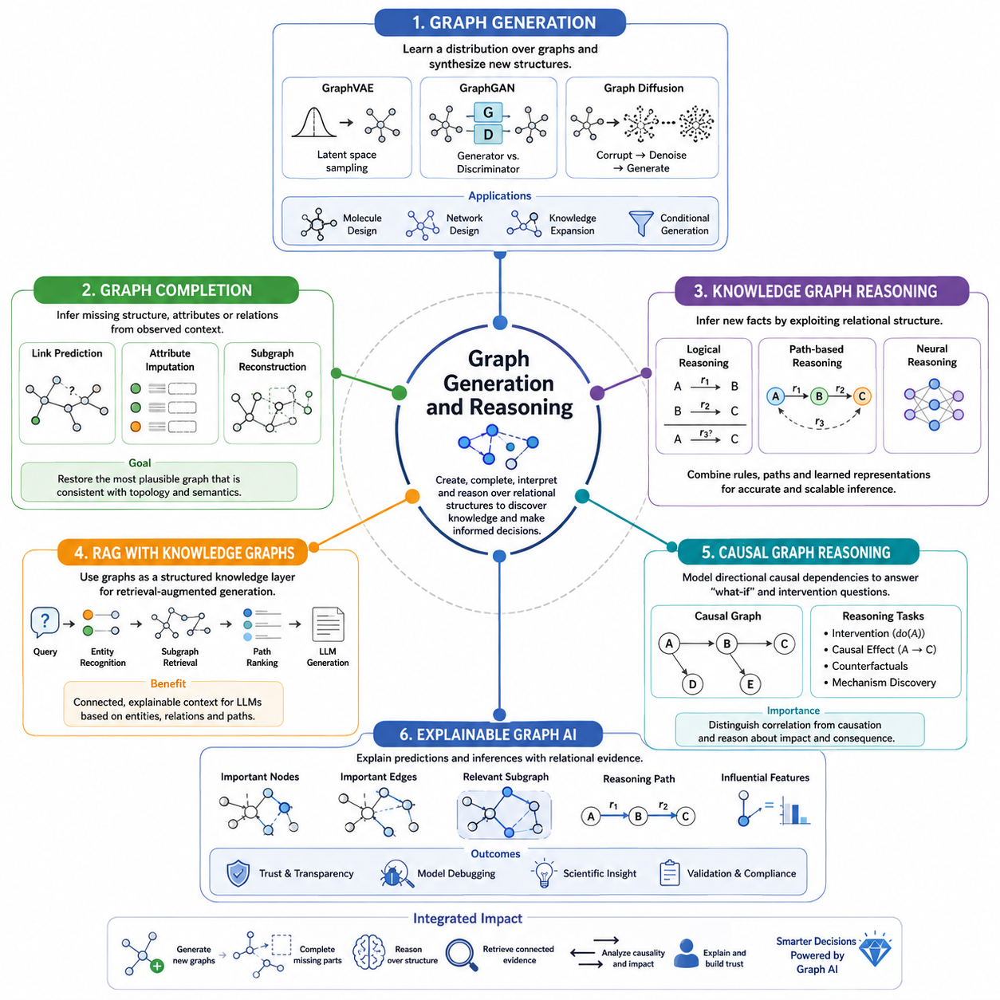
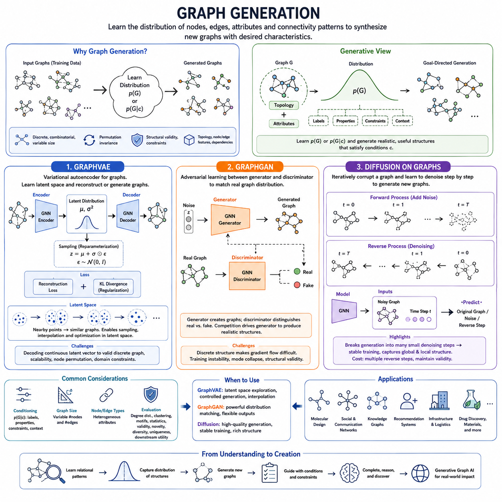
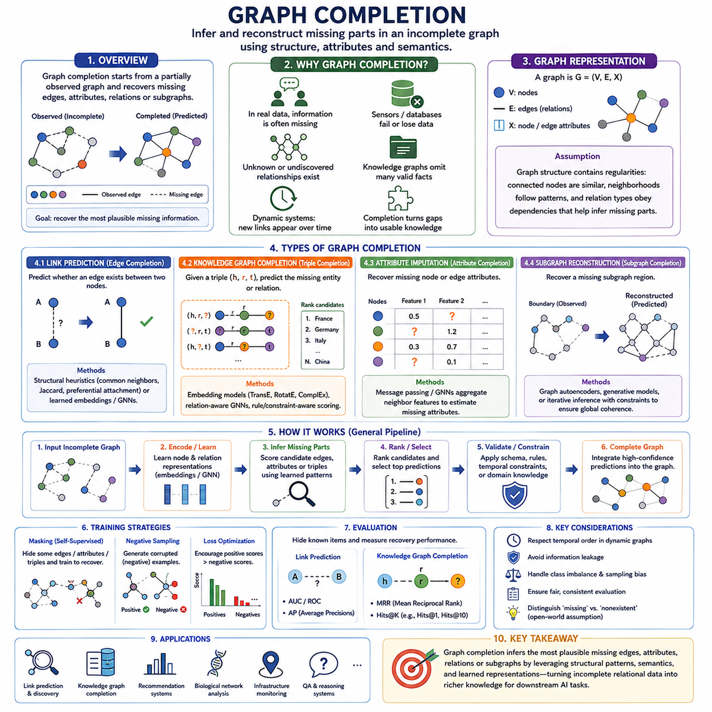
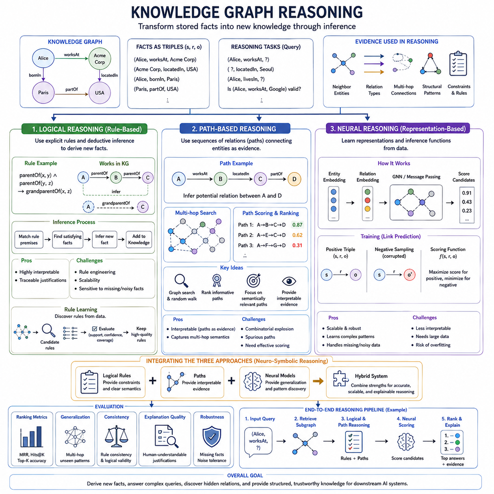
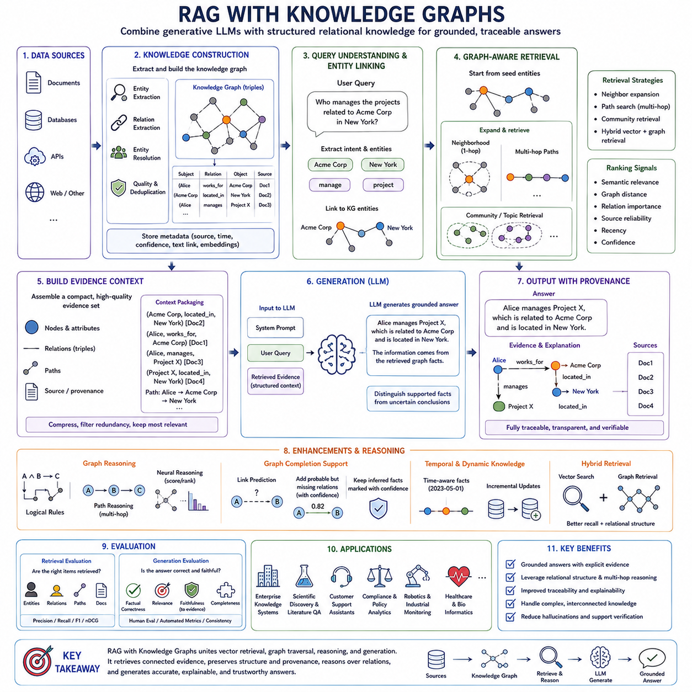
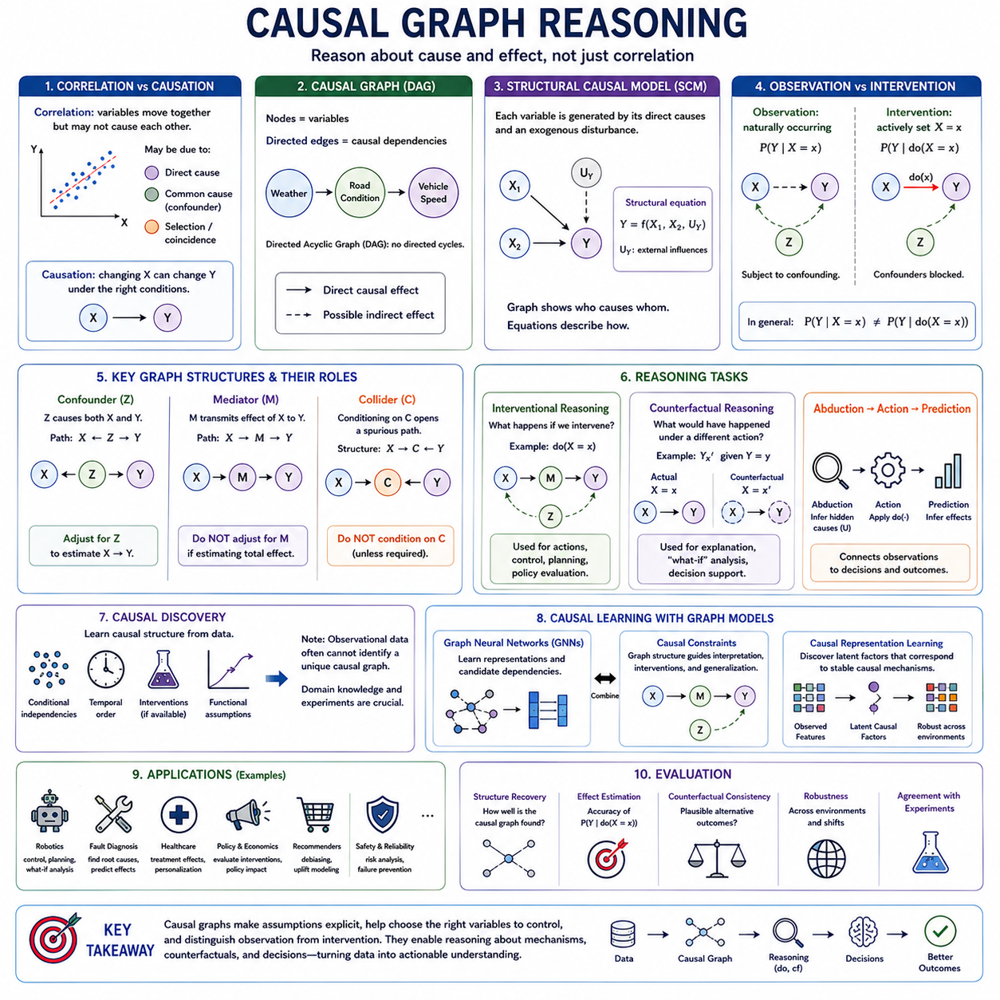
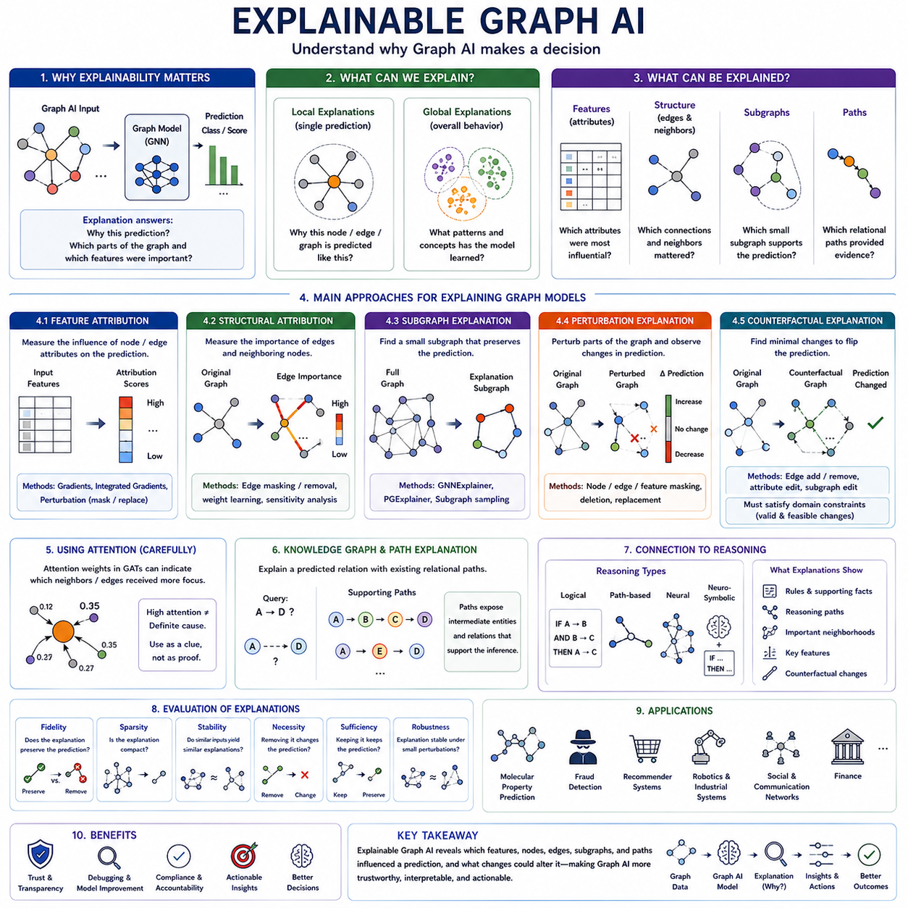

**Volume 29. Graph Deep Learning**

# Chapter 05. Graph Generation and Reasoning

## 05.00. Overview

{width="7.268055555555556in" height="7.268055555555556in"}

그래프 생성(Graph Generation)과 추론(Reasoning)은 그래프 딥러닝(Graph Deep Learning)을 표현(Representation)과 예측(Prediction)의 범위를 넘어 관계 구조(Relational Structure)를 구성하고, 완성하고, 해석하며, 그 위에서 추론할 수 있는 시스템으로 확장합니다. 그래프가 고정되고 완전히 관측되었다고 가정하는 대신, 노드(Node), 엣지(Edge), 속성(Attribute), 고차 관계(Higher-Order Relationship)를 생성하거나 추론하고 수정하며 질의할 수 있는 대상으로 다룹니다. 이러한 관점은 관계 구조 자체에 발견하거나 생성해야 할 지식(Knowledge)이 포함되어 있을 때 특히 중요합니다.

그래프 생성 모델(Graph Generative Model)은 가능한 그래프 구조(Graph Structure)와 속성(Attribute)에 대한 분포(Distribution)를 학습합니다. 응용 분야에 따라 전체 그래프를 생성하거나 기존 그래프에 노드와 엣지를 추가하고, 원하는 특성에 조건화된 그래프를 생성할 수 있습니다. 이미지 생성(Image Generation)과 달리 그래프 생성은 순열 불변성(Permutation Invariance), 가변적인 그래프 크기(Variable Graph Size), 이산 연결성(Discrete Connectivity), 구조적 제약(Structural Constraint)을 고려해야 하므로 독특한 형태의 구조적 생성 모델링(Structured Generative Modeling)이 됩니다.

GraphVAE와 같은 변분 접근법(Variational Approach)은 그래프를 잠재 변수(Latent Variable)를 통해 표현하고, 이러한 변수를 후보 노드(Node), 엣지(Edge), 속성(Attribute)으로 디코딩(Decoding)합니다. 잠재 공간(Latent Space)은 반복적으로 나타나는 구조적 패턴을 포착하고 새로운 그래프를 샘플링할 수 있는 연속 표현(Continuous Representation)을 제공합니다. 생성적 적대 접근법(Generative Adversarial Approach)은 생성자(Generator)와 판별자(Discriminator)의 경쟁적 목적함수를 사용하며, 그래프 확산(Graph Diffusion)은 그래프 구조를 점진적으로 손상시킨 후 이를 역으로 복원하여 새로운 그래프를 생성하는 방법을 학습합니다.

그래프 생성(Graph Generation)은 원하는 출력이 개별 관측값을 단순히 재현하는 것이 아니라 관계(Relationship)를 만족해야 할 때 특히 유용합니다. 분자 발견(Molecular Discovery)에서는 후보 분자 그래프를 생성할 수 있고, 네트워크 설계(Network Design)에서는 다양한 연결 구조를 탐색할 수 있으며, 지식 시스템(Knowledge System)에서는 누락된 엔티티(Entity)나 관계(Relation)를 제안할 수 있습니다. 조건부 생성(Conditional Generation)을 이용하면 목표 속성, 제약 조건, 문맥 정보에 따라 그래프 구조를 생성할 수 있어 생성 모델링과 최적화(Optimization), 구조적 의사결정(Structured Decision Making)을 연결할 수 있습니다.

그래프 완성(Graph Completion)은 이와 관련되지만 다른 문제를 다룹니다. 그래프 자체는 이미 존재하지만 구조나 정보의 일부가 누락된 상황을 대상으로 합니다. 모델은 관측된 관계적 문맥(Relational Context)을 이용하여 누락된 엣지, 노드 속성, 관계 유형(Relation Type), 서브그래프(Subgraph)를 추정할 수 있습니다. 따라서 링크 예측(Link Prediction)은 그래프 완성의 중요한 형태이지만, 더 넓게는 불완전한 관계 구조를 재구성하고 어떤 추가 정보가 기존 위상 구조(Topology)와 의미적 증거(Semantic Evidence)에 가장 일관되는지를 추정하는 문제까지 포함합니다.

그래프 추론(Graph Reasoning)은 명시적인 관계 구조를 추론(Inference)의 기반으로 활용합니다. 지식 그래프(Knowledge Graph)에서는 엔티티(Entity)를 노드로, 의미 관계(Semantic Relation)를 유형화된 엣지(Typed Edge)로 표현하므로 개별 특징 벡터(Feature Vector)가 아니라 관계의 연쇄(Chain of Relationships)를 따라 추론할 수 있습니다. 따라서 알려지지 않은 관계에 대한 질의는 기존 사실(Fact), 경로(Path), 이웃(Neighborhood), 관계 조합(Relation Composition), 학습된 표현(Learned Representation)을 함께 분석하여 결론을 뒷받침하는 증거를 찾는 방식으로 처리할 수 있습니다.

지식 그래프 추론(Knowledge Graph Reasoning)은 논리적 추론(Logical Reasoning), 경로 기반 추론(Path-Based Reasoning), 신경망 추론(Neural Reasoning)을 결합할 수 있습니다. 논리적 추론은 규칙(Rule)이나 관계 조합을 적용하여 새로운 사실을 도출하고, 경로 기반 추론은 엔티티를 연결하는 의미 있는 관계의 연속을 탐색합니다. 신경망 추론은 데이터로부터 미분 가능한 표현(Differentiable Representation)과 변환을 학습하여 추론을 근사합니다. 현대 시스템에서는 이러한 방법을 분리하기보다 기호적 제약(Symbolic Constraint)과 학습된 그래프 표현을 결합하여 유연성과 구조화된 추론(Structured Inference)을 동시에 확보하는 방향으로 발전하고 있습니다.

경로 기반 추론(Path-Based Reasoning)은 경로가 일련의 의미적 변환(Semantic Transformation)을 나타낼 수 있다는 점에서 특히 직관적입니다. 하나의 엔티티가 여러 의미 있는 관계를 거쳐 다른 엔티티와 연결되어 있다면 전체 경로는 개별 엣지만으로는 얻기 어려운 증거를 제공할 수 있습니다. 신경망 모델(Neural Model)은 어떤 경로, 중간 엔티티(Intermediate Entity), 관계 조합이 중요한지를 학습할 수 있으며, 이를 통해 그래프 탐색(Graph Traversal)을 수동으로 정의된 절차에서 대규모 관계 공간(Relational Space)을 처리할 수 있는 학습 가능한 추론 메커니즘으로 확장할 수 있습니다.

그래프 추론은 지식 그래프를 활용한 검색 증강 생성(Retrieval-Augmented Generation, RAG)의 자연스러운 기반도 제공합니다. 벡터 유사도(Vector Similarity)만을 이용해 서로 독립적인 텍스트 구절을 검색하는 대신, 시스템은 관련 엔티티를 식별하고 그 관계를 탐색하여 구조화된 문맥(Structured Context)을 구성할 수 있습니다. 이를 통해 검색 과정에서 사실 사이의 연결성을 유지하고, 언어 모델(Language Model)에 분리된 텍스트 조각이 아니라 엔티티, 관계, 경로, 이웃 구조를 중심으로 구성된 증거를 제공할 수 있습니다.

지식 그래프 기반 검색(Knowledge-Graph-Based Retrieval)은 하나의 질문에 답하기 위해 서로 연결된 여러 사실이 필요한 경우 특히 유용합니다. 시스템은 먼저 질의(Query)에 포함된 엔티티를 식별하고, 해당 엔티티의 로컬 서브그래프(Local Subgraph)를 검색한 뒤, 선택된 관계를 따라 확장하고 후보 경로를 평가하여 결과 증거를 생성 모델(Generative Model)의 문맥으로 변환할 수 있습니다. 따라서 그래프 구조는 검색(Retrieval)과 생성(Generation) 사이에서 중간 추론 계층(Intermediate Reasoning Layer)으로 작동하며, 명시적인 관계적 의존성(Relational Dependency)에 따라 증거를 조직하도록 지원합니다.

인과 그래프 추론(Causal Graph Reasoning)은 엣지(Edge)에 더욱 강한 의미를 부여합니다. 일반적인 그래프에서는 엣지가 연관성(Association), 유사성(Similarity), 상호작용(Interaction), 의미 관계를 나타낼 수 있지만, 인과 그래프(Causal Graph)는 변화가 시스템을 통해 어떻게 전파되는지와 관련된 방향성 의존관계(Directional Dependency)를 표현하려 합니다. 이러한 구조에서의 추론은 개입(Intervention), 인과 메커니즘(Causal Mechanism), 가능한 결과(Consequence)에 관한 질문을 지원하며, 그래프 AI(Graph AI)를 패턴 인식(Pattern Recognition)에서 관계적 상관관계와 가정된 인과 영향(Causal Influence)을 구별하는 모델로 확장합니다.

이러한 구별이 중요한 이유는 예측 관계(Predictive Relationship)가 자동으로 인과적 결론(Causal Conclusion)을 정당화하지 않기 때문입니다. 그래프 모델이 두 변수 사이의 강한 연결을 정확하게 발견하더라도 한 변수를 변화시키는 것이 다른 변수의 변화를 실제로 발생시킨다는 사실까지 증명하는 것은 아닙니다. 따라서 인과 그래프 추론에는 일반적인 메시지 패싱(Message Passing)을 넘어 인과적 가정(Causal Assumption), 구조적 정보(Structural Information), 실험적 증거(Experimental Evidence), 인과 모델링 원리(Causal Modeling Principle)가 필요합니다. 이러한 요소가 확보되면 그래프 표현은 인과 변수와 의존관계를 조직하는 강력한 프레임워크가 됩니다.

설명 가능한 그래프 AI(Explainable Graph AI)는 그래프 모델이 특정 결과를 생성한 이유를 이해하는 또 하나의 핵심 요구사항을 다룹니다. 그래프 예측은 이웃 구조, 경로, 엣지 유형, 노드 속성, 여러 단계의 메시지 패싱에 의존할 수 있으므로 설명 과정에서는 어떤 관계적 증거(Relational Evidence)가 출력에 영향을 주었는지를 식별해야 합니다. 설명은 영향력이 높은 노드, 중요한 엣지, 관련 서브그래프, 결정적인 특징(Feature), 또는 예측이나 관계 추론에 크게 기여한 추론 경로(Reasoning Path)를 강조하는 형태로 제공될 수 있습니다.

그래프 설명(Graph Explanation)은 단순한 수치적 특징 중요도(Feature Importance)를 넘어 구조 자체를 보여줄 수 있다는 점에서 의미가 있습니다. 사기 탐지(Fraud Detection)는 의심스러운 거래 서브네트워크(Transaction Subnetwork)를 통해 설명할 수 있고, 생물학적 예측(Biological Prediction)은 특정 분자 하위구조(Molecular Substructure)를 통해 설명할 수 있으며, 지식 추론(Knowledge Inference)은 두 엔티티를 연결하는 관계의 연쇄를 통해 설명할 수 있습니다. 이러한 설명은 모델이 해당 응용 분야에서 타당한 관계를 이용하는지 보여줌으로써 디버깅(Debugging), 과학적 해석(Scientific Interpretation), 신뢰성 평가(Trust Assessment), 검증(Validation)을 지원합니다.

종합하면 그래프 생성(Graph Generation), 그래프 완성(Graph Completion), 추론(Reasoning), 검색(Retrieval), 인과 분석(Causal Analysis), 설명 가능성(Explainability)은 그래프를 수동적인 입력 구조에서 진화하는 지식(Evolving Knowledge)을 표현하고 처리하는 능동적 계산 표현(Active Computational Representation)으로 전환합니다. 생성은 새로운 관계 구조를 제안하고, 완성은 누락된 정보를 복원하며, 추론은 새로운 결론을 도출합니다. 그래프 기반 검색은 연결된 증거를 구성하고, 인과 모델은 방향성 의존관계를 분석하며, 설명은 모델 행동의 관계적 근거를 드러냅니다. 이러한 기능들은 그래프 표현 학습(Graph Representation Learning)에서 지식 중심(Knowledge-Centered) 및 추론 중심(Reasoning-Oriented) 그래프 AI로 발전하기 위한 핵심적인 개념적 연결고리를 형성합니다.

## 05.01. Graph Generation

{width="7.268055555555556in" height="7.268055555555556in"}

그래프 생성(Graph Generation)은 이미 존재하는 관계 구조(Relational Structure)를 단순히 분석하는 것을 넘어, 관계 구조 자체가 어떻게 생성될 수 있는지를 학습하는 데 초점을 둡니다. 생성형 그래프 모델(Generative Graph Model)은 학습 데이터에서 관측되는 노드(Node), 엣지(Edge), 속성(Attribute), 연결 패턴(Connectivity Pattern)의 기저 분포(Underlying Distribution)를 학습한 뒤, 이 분포를 이용하여 새로운 그래프를 구성합니다. 이를 통해 그래프 딥러닝(Graph Deep Learning)은 기존 구조의 특성을 예측하는 단계에서 원하는 특성을 가진 타당한 관계 구조를 합성하는 단계로 확장됩니다.

그래프 생성은 그래프가 이산적(Discrete)이고 조합적(Combinatorial)이며 크기가 가변적(Variable)이라는 점에서 이미지, 텍스트, 일반적인 벡터 생성과 근본적으로 다릅니다. 또한 동일한 그래프라도 노드의 순서를 다르게 지정하면 여러 표현이 가능하지만 그래프의 의미 자체는 변하지 않습니다. 따라서 성공적인 그래프 생성 모델은 순열 불변성(Permutation Invariance), 구조적 유효성(Structural Validity), 가변적인 노드와 엣지의 수, 그리고 위상 구조(Topology), 노드 특징(Node Feature), 엣지 속성(Edge Attribute) 사이의 복잡한 의존관계를 함께 고려해야 합니다.

그래프 생성 과정(Graph Generative Process)은 일반적으로 그래프에 대한 확률 분포(Probability Distribution)를 학습하는 과정으로 이해할 수 있으며, 개념적으로는 p(G)로 표현할 수 있습니다. 여기서 G는 그래프 위상 구조와 관련 특징을 포함합니다. 조건부 모델(Conditional Model)은 이를 p(G\|c)로 확장하며, c는 원하는 속성, 레이블(Label), 제약 조건(Constraint), 문맥 정보(Contextual Information)를 나타낼 수 있습니다. 이러한 표현은 그래프 생성을 목표 지향적(Goal-Directed) 과정으로 확장하여 현실적일 뿐 아니라 특정 작업에 유용한 구조를 탐색하도록 합니다.

GraphVAE는 변분 오토인코더(Variational Autoencoder, VAE) 프레임워크를 그래프 구조 데이터에 적용합니다. 인코더(Encoder)는 관측된 그래프를 일반적으로 평균(Mean)과 분산(Variance)으로 매개변수화된 확률적 잠재 표현(Probabilistic Latent Representation)으로 변환합니다. 이 분포에서 잠재 벡터(Latent Vector)를 샘플링하고 디코더(Decoder)에 전달하면 노드 속성, 엣지 확률, 인접 구조(Adjacency Structure)와 같은 그래프 구성 요소를 재구성합니다. 학습 과정에서는 재구성 품질(Reconstruction Quality)과 잠재 분포의 정규화(Regularization) 사이의 균형을 맞춥니다.

GraphVAE가 학습하는 잠재 공간(Latent Space)은 단순한 그래프 재구성 이상의 기능을 제공합니다. 서로 가까운 잠재 벡터는 구조적 또는 의미적으로 유사한 그래프에 대응할 수 있으므로 새로운 구조를 샘플링하고, 여러 그래프 사이를 보간(Interpolation)하며, 후보 설계를 탐색할 수 있습니다. 이러한 특성은 그래프 생성을 탐색 문제(Search Problem)로 다룰 때 특히 유용합니다. 연속적인 잠재 공간에서 최적화(Optimization)를 수행한 뒤 후보 표현을 이산적인 그래프 구조로 디코딩할 수 있기 때문입니다.

최소한의 GraphVAE 구현에서는 입력 그래프를 잠재 매개변수 μ와 log σ²으로 인코딩합니다. 재매개변수화(Reparameterization)를 통해 z = μ + σ ⊙ ε을 생성하며, 여기서 ε은 표준 정규 분포(Standard Normal Distribution)에서 샘플링됩니다. 디코더는 z를 그래프 구조와 속성에 대한 예측으로 변환합니다. 일반적인 목적함수(Objective Function)는 재구성 손실(Reconstruction Loss)과 쿨백-라이블러 발산(Kullback--Leibler Divergence, KL Divergence)을 결합하여 유용한 재구성을 학습하면서 잠재 분포가 다루기 쉬운 사전 분포(Prior Distribution)에 가까워지도록 합니다.

GraphVAE의 주요 어려움은 연속적인 잠재 표현을 유효한 이산 그래프(Discrete Graph)로 디코딩하는 데 있습니다. 인접 행렬(Adjacency Matrix)을 직접 예측하는 방법은 그래프 크기가 증가하면 계산 비용이 커질 수 있으며, 서로 다른 노드 순서가 동일한 그래프를 표현할 수도 있습니다. 또한 실제 응용 분야에서는 도메인별 유효성 제약(Domain-Specific Validity Constraint)이 존재할 수 있습니다. 따라서 실용적인 그래프 변분 모델은 특수한 디코더, 매칭 절차(Matching Procedure), 제약 기반 생성 메커니즘 또는 대상 도메인의 구조에 적합한 표현을 필요로 하는 경우가 많습니다.

GraphGAN은 적대적 학습(Adversarial Learning)을 통해 그래프 생성 문제에 접근합니다. 개념적으로 생성자(Generator)는 실제 데이터 분포에서 관측되는 그래프 구조 또는 그래프 관련 샘플과 유사한 결과를 생성하려 하고, 판별자(Discriminator)는 생성된 샘플과 실제 샘플을 구별하려 합니다. 이러한 경쟁을 통해 생성자는 판별자가 합성 데이터라고 구별하기 어려운 결과를 만들도록 점진적으로 구조적 패턴(Structural Pattern)을 학습합니다.

적대적 그래프 생성(Adversarial Graph Generation)이 어려운 이유는 기존 생성적 적대 신경망(Generative Adversarial Network, GAN)이 연속적인 텐서(Continuous Tensor)를 자연스럽게 처리하는 반면, 그래프 연결성(Graph Connectivity)은 대부분 이산적이기 때문입니다. 샘플링된 엣지나 그래프 구성 결정 과정에서는 그래디언트(Gradient)가 직접 전달되기 어려울 수 있습니다. 따라서 GraphGAN 계열 시스템은 이웃 구조, 연결 패턴, 노드 관계, 랜덤 워크(Random Walk) 등 그래프 구조를 적대적 최적화(Adversarial Optimization)에 적합한 형태로 표현하는 메커니즘을 필요로 합니다.

적대적 학습의 장점은 모든 구조적 구성에 대해 명시적인 가능도(Likelihood)를 정의하지 않고도 복잡한 그래프 분포를 학습할 수 있다는 것입니다. 판별자는 생성된 샘플이 현실적인 관계 구조와 유사하도록 유도하는 학습된 품질 신호(Quality Signal)로 작동합니다. 그러나 그래프 적대적 학습 역시 불안정한 최적화(Unstable Optimization)와 모드 붕괴(Mode Collapse) 같은 기존 GAN의 문제를 가지며, 여기에 이산적인 위상 구조와 구조적 제약이라는 그래프 고유의 어려움이 추가됩니다.

그래프 확산(Graph Diffusion)은 이와 다른 생성 원리(Generative Principle)를 사용합니다. 완성된 그래프를 한 번에 직접 생성하는 대신 순방향 과정(Forward Process)을 통해 원래 구조를 식별하기 어려워질 때까지 그래프 정보를 점진적으로 손상시킵니다. 이후 학습된 역방향 과정(Reverse Process)은 이러한 손상을 단계적으로 제거하는 방법을 추정합니다. 적절하게 노이즈가 적용된 그래프 상태에서 시작하여 반복적인 디노이징(Denoising)을 수행하면 학습 데이터에서 습득한 구조적 패턴을 따르는 새로운 그래프를 생성할 수 있습니다.

그래프 확산에서는 그래프 데이터에 적합한 손상(Corruption)과 디노이징 연산을 정의해야 합니다. 노이즈(Noise)는 노드 속성, 엣지 속성, 연결 구조 또는 이러한 요소들의 조합에 적용될 수 있습니다. 엣지와 노드 범주가 연속값이 아니라 이산값일 수 있기 때문에 이미지 확산(Image Diffusion) 방식을 그대로 적용할 수 없는 경우가 많습니다. 따라서 전이 과정(Transition Process)은 수학적으로 처리 가능한 생성 궤적(Generative Trajectory)을 유지하면서 역방향 모델이 의미 있는 관계 구조를 복원할 수 있도록 설계되어야 합니다.

단순화된 그래프 확산 구현에서는 먼저 정상적인 그래프를 샘플링한 뒤 확산 단계(Diffusion Step)에 따라 점점 강한 교란(Perturbation)을 적용합니다. 신경망(Neural Network)은 손상된 그래프와 현재 단계 정보를 입력받아 원래 구조, 적용된 노이즈 또는 역방향 전이(Reverse Transition)를 예측합니다. 학습에서는 모델이 다양한 손상 수준을 반복적으로 경험하도록 하고, 생성에서는 노이즈 상태에서 시작하여 일관된 그래프가 나타날 때까지 학습된 역방향 전이를 반복적으로 적용합니다.

단일 단계 생성(One-Shot Generation)과 비교하면 확산 모델은 어려운 그래프 합성 문제를 여러 개의 작은 디노이징 결정으로 분해합니다. 이를 통해 비교적 안정적인 학습이 가능하며 전역 구조(Global Structure)와 지역 구조(Local Structure)를 점진적으로 정제할 수 있습니다. 반면 여러 단계의 역방향 연산이 필요하기 때문에 생성 비용이 증가하며, 특히 대규모 그래프나 엄격한 구조적·의미적 제약을 가진 도메인에서는 전체 생성 과정에서 유효한 그래프 구조를 유지하는 것이 어려울 수 있습니다.

따라서 GraphVAE, GraphGAN, 그래프 확산(Graph Diffusion)은 그래프 생성에 대한 세 가지 상호보완적인 관점을 제공합니다. GraphVAE는 확률적 잠재 표현(Probabilistic Latent Representation)과 재구성을 중심으로 하고, GraphGAN은 생성된 그래프와 실제 그래프 분포 사이의 적대적 분포 정합(Adversarial Distribution Matching)을 중심으로 하며, 그래프 확산은 반복적인 손상과 디노이징을 중심으로 합니다. 구조는 서로 다르지만 모두 기존 그래프를 분류하는 것을 넘어 새로운 관계 객체(Relational Object)를 생성하는 데 필요한 구조적 규칙성을 학습한다는 공통점을 가집니다.

어떤 접근법이 적합한지는 생성 목표와 그래프 도메인의 특성에 따라 달라집니다. 연속 표현과 제어된 탐색이 중요하다면 잠재 변수 모델(Latent-Variable Model)이 유용하고, 적대적 접근법은 분포 정합을 위한 또 다른 방법을 제공합니다. 확산 모델(Diffusion Model)은 강력한 반복적 생성 능력을 제공합니다. 실제로는 그래프 크기, 희소성(Sparsity), 노드와 엣지 유형, 유효성 제약, 조건 정보, 생성 속도, 평가 요구사항 등이 모델 구조 선택에 큰 영향을 미칩니다.

평가(Evaluation)는 생성된 그래프가 학습 데이터와 시각적 또는 통계적으로 유사한지만 확인해서는 충분하지 않습니다. 유용한 그래프 생성기는 의미 있는 구조적 특성을 재현하면서 다양성(Diversity)을 유지하고 단순한 학습 데이터 암기(Memorization)를 피해야 합니다. 도메인에 따라 차수 분포(Degree Distribution), 연결성(Connectivity), 클러스터링 패턴(Clustering Pattern), 모티프(Motif), 그래프 수준 통계(Graph-Level Statistics), 유효성, 신규성(Novelty), 고유성(Uniqueness), 다운스트림 활용성(Downstream Utility) 등을 평가할 수 있으며, 실제 응용에서는 도메인별 요구사항이 일반적인 유사도 지표보다 더 중요할 수 있습니다.

결과적으로 그래프 생성(Graph Generation)은 그래프 표현 학습(Graph Representation Learning)과 생성형 AI(Generative AI)를 연결하는 역할을 합니다. 시스템은 더 이상 기존 그래프가 무엇을 의미하는지만 질문하지 않고, 어떤 관계 구조가 존재할 수 있는지, 어떤 구조가 특정 조건을 만족하는지, 학습된 관계 지식을 이용하여 새로운 후보 구조를 어떻게 구성할 수 있는지를 다루게 됩니다. GraphVAE, GraphGAN, 그래프 확산은 이러한 능력을 구현하는 주요 개념적 경로이며, 이후의 그래프 완성(Graph Completion), 지식 추론(Knowledge Reasoning), 구조적 발견(Structured Discovery), 그리고 더욱 생성적인 형태의 그래프 AI(Graph AI)를 위한 기반을 형성합니다.

## 05.02. Graph Completion

{width="7.268055555555556in" height="7.268055555555556in"}

그래프 완성(Graph Completion)은 기존 그래프에 누락되거나 불확실한 정보를 복원하는 문제를 다룹니다. 새로운 그래프 구조를 합성하는 그래프 생성(Graph Generation)과 달리, 그래프 완성은 부분적으로 관측된 그래프에서 시작하여 이용 가능한 문맥(Context)을 바탕으로 가장 타당한 누락 요소를 복원합니다. 이러한 요소에는 엣지(Edge), 노드 속성(Node Attribute), 관계 유형(Relation Type), 또는 서브그래프(Subgraph)의 일부가 포함될 수 있으며, 불완전한 실제 관계형 데이터(Relational Data)를 처리하기 위한 핵심 기능입니다.

실제 환경의 그래프는 완전한 경우가 거의 없습니다. 소셜 네트워크(Social Network)에는 아직 관측되지 않은 상호작용이 존재하고, 지식 그래프(Knowledge Graph)에는 유효한 사실이 누락될 수 있으며, 생물학적 네트워크(Biological Network)에는 아직 발견되지 않은 관계가 존재합니다. 또한 인프라 그래프(Infrastructure Graph)는 센서나 데이터베이스 장애로 정보를 잃을 수 있습니다. 그래프 완성은 관측되지 않은 정보를 단순히 존재하지 않는 것으로 간주하지 않고, 학습된 구조적 패턴을 이용하여 이러한 공백을 추론 문제(Inference Problem)로 처리합니다.

그래프는 G = (V, E, X)로 표현할 수 있으며, 여기서 V는 노드(Node), E는 엣지(Edge), X는 노드 또는 그래프 속성(Attribute)을 나타냅니다. 그래프 완성은 관측된 G의 일부를 이용하여 알려지지 않은 요소를 추정합니다. 기본적인 가정은 그래프 구조에 일정한 규칙성(Regularity)이 존재한다는 것입니다. 연결된 노드는 의미 있는 유사성을 가지는 경우가 많고, 이웃 구조(Neighborhood)는 반복적인 패턴을 형성하며, 관계 유형은 누락된 정보를 추론하는 증거가 되는 구조적 또는 의미적 의존관계를 가질 수 있습니다.

링크 예측(Link Prediction)은 가장 일반적인 그래프 완성 작업 중 하나입니다. 관측된 엣지가 존재하지 않는 두 노드가 주어졌을 때 모델은 두 노드 사이에 의미 있는 관계가 존재해야 하는지를 추정합니다. 전통적인 방법은 공통 이웃(Common Neighbors), 자카드 유사도(Jaccard Similarity), 선호적 연결(Preferential Attachment) 등의 구조적 휴리스틱(Structural Heuristic)을 이용합니다. 학습 기반 방법은 그래프 위상 구조와 속성에서 노드 표현(Node Representation)을 학습한 뒤 이를 이용하여 후보 연결의 가능성 또는 점수를 계산합니다.

예를 들어 노드 A와 B가 직접 연결되어 있지 않더라도 여러 이웃을 공유하고 유사한 구조적 문맥에 참여한다면 그래프 기반 학습 이후 두 노드의 표현이 유사해질 수 있습니다. 이에 따라 두 노드 사이에 엣지가 존재할 것으로 예측되는 확률이 증가할 수 있습니다. 지식 그래프에서는 단순히 두 엔티티(Entity)가 연결되는지를 예측하는 것뿐 아니라 어떤 유형화된 의미 관계(Typed Semantic Relation)가 두 엔티티를 연결하는지까지 예측해야 하므로 문제가 더욱 구체화됩니다.

지식 그래프 완성(Knowledge Graph Completion)은 일반적으로 (h, r, t) 형태의 트리플(Triple)을 대상으로 수행되며, 여기서 h는 헤드 엔티티(Head Entity), r은 관계(Relation), t는 테일 엔티티(Tail Entity)를 의미합니다. 평가 과정에서는 알려진 트리플의 일부를 숨겨 (h, r, ?), (?, r, t), 또는 경우에 따라 (h, ?, t)와 같은 질의를 생성합니다. 모델은 후보 엔티티나 관계의 순위를 계산하고 올바른 누락 요소가 순위 상위에 위치하도록 학습합니다.

임베딩 방법(Embedding Method)은 이러한 과정의 효율적인 기반을 제공합니다. TransE, RotatE, ComplEx와 같은 모델은 엔티티와 관계를 연속적인 기하 공간(Continuous Geometric Space)에 표현하고 후보 트리플을 평가하는 점수 함수(Scoring Function)를 정의합니다. 알려진 트리플에는 높은 적합도를 갖는 점수가 부여되도록 하고, 손상되거나 타당하지 않은 트리플에는 낮은 적합도의 점수가 부여되도록 학습합니다. 학습 후에는 점수 함수를 이용하여 이전에 관측되지 않은 트리플을 평가하고 지식 그래프를 완성할 수 있는 타당한 사실을 식별합니다.

그래프 신경망(Graph Neural Network, GNN)은 이웃 정보를 직접 통합하여 그래프 완성을 확장합니다. 메시지 패싱(Message Passing)을 통해 각 노드는 연결된 노드와 엣지의 정보를 집계하여 지역적인 구조적 문맥(Local Structural Context)을 반영하는 표현을 생성합니다. 이후 디코더(Decoder)는 노드 표현의 쌍을 비교하여 누락된 엣지를 예측할 수 있습니다. 관계 인식 그래프 신경망(Relation-Aware GNN)은 엣지 유형까지 함께 처리하여 서로 다른 연결이 다른 의미를 갖는 이종 그래프(Heterogeneous Graph)나 다중 관계 그래프(Multi-Relational Graph)의 완성을 지원합니다.

속성 대치(Attribute Imputation)는 그래프 완성의 또 다른 주요 형태입니다. 이 경우 그래프 위상 구조는 존재하지만 일부 노드 또는 엣지 특징(Feature)이 누락되어 있습니다. 모델은 연결성을 예측하는 대신 이웃 특징과 구조적 문맥을 이용하여 알려지지 않은 속성을 복원합니다. 연결된 노드들이 유사한 특성을 공유하거나 예측 가능한 의존관계를 가진다면 메시지 패싱을 통해 이용 가능한 정보를 집계하고 속성이 불완전한 노드의 값을 추정할 수 있습니다.

속성 완성(Attribute Completion)은 범주형 레이블(Categorical Label), 연속 측정값(Continuous Measurement), 의미 특징(Semantic Feature), 기타 메타데이터(Metadata)를 대상으로 할 수 있습니다. 누락이 무작위가 아니라 체계적으로 발생하는 경우에는 관측된 이웃 자체가 편향되거나 불완전할 수 있기 때문에 문제가 더욱 어려워집니다. 특히 과학적 또는 운영적 의사결정에 그래프 완성을 적용한다면 실제 관계적 증거와 데이터 수집 과정에서 발생한 인위적인 편향을 구별할 수 있어야 합니다.

서브그래프 재구성(Subgraph Reconstruction)은 개별 엣지나 속성이 아니라 더 큰 누락 영역을 대상으로 합니다. 노드, 엣지 또는 관계의 일부 영역을 사용할 수 없을 때 시스템은 주변 경계(Boundary)와 학습된 그래프 패턴을 이용하여 일관성 있는 지역 구조(Local Structure)를 복원합니다. 이 과정에서는 여러 구성 요소를 동시에 고려해야 합니다. 각각의 엣지를 독립적으로 예측하면 개별적으로는 가능성이 높더라도 전체적으로는 일관되지 않는 연결 구조가 만들어질 수 있기 때문입니다.

그래프 오토인코더(Graph Autoencoder)는 구조 재구성을 위한 일반적인 아키텍처를 제공합니다. 일반적으로 그래프 신경망을 사용하는 인코더(Encoder)가 관측된 그래프 정보를 잠재 노드 표현(Latent Node Representation)으로 변환하고, 디코더가 이러한 임베딩에서 인접 구조(Adjacency Structure)를 재구성하거나 후보 링크를 예측합니다. 학습 과정에서는 재구성 결과를 알려진 그래프 구조와 비교하여 잠재 표현이 연결 패턴을 포착하도록 하며, 이후 의도적으로 숨기거나 실제로 누락된 엣지를 추정하는 데 활용합니다.

자기지도 학습(Self-Supervised Learning)은 그래프 자체에서 학습 목표를 생성할 수 있기 때문에 그래프 완성과 자연스럽게 결합됩니다. 기존 엣지, 속성 또는 하위 구조를 의도적으로 마스킹(Masking)하거나 제거한 뒤, 모델이 남아 있는 문맥으로부터 이를 복원하도록 학습합니다. 이를 통해 그래프 완성을 다른 인공지능 분야의 마스크 예측(Masked Prediction)과 유사한 학습 목표로 변환하면서도 그래프 고유의 관계적 의존성(Relational Dependency)을 유지할 수 있습니다.

부정 샘플링(Negative Sampling)은 가능한 비존재 엣지나 트리플의 수가 매우 많기 때문에 링크 및 지식 그래프 완성 모델을 학습할 때 중요합니다. 가능한 모든 부정 후보를 평가하는 대신 관리 가능한 일부 손상 사례(Corrupted Example)를 선택합니다. 균일 샘플링(Uniform Sampling), 가중 샘플링(Weighted Sampling), 자기 적대적 샘플링(Self-Adversarial Sampling) 등의 전략을 사용할 수 있으며, 모델은 관측된 긍정 관계가 샘플링된 부정 후보보다 더 높은 점수를 갖도록 학습합니다.

누락된 관계(Missing Relation)와 실제로 존재하지 않는 관계(Nonexistent Relation)를 구분하는 것은 매우 중요합니다. 대부분의 실제 그래프는 개방 세계 가정(Open-World Assumption)을 따르므로 데이터셋에 존재하지 않는다고 해서 해당 사실이 반드시 거짓인 것은 아닙니다. 따라서 관측되지 않은 모든 엣지를 부정 사례로 처리하면 잘못된 지도 신호(Supervision)가 발생할 수 있습니다. 이는 새로운 관계가 지속적으로 발견되는 지식 그래프, 과학 네트워크, 동적 시스템에서 특히 중요한 문제입니다.

그래프 완성에는 의미적 제약(Semantic Constraint)을 함께 적용할 수도 있습니다. 후보 엣지가 구조적으로는 타당해 보이더라도 도메인 지식(Domain Knowledge), 관계 유형, 시간 순서(Temporal Order), 논리적 일관성(Logical Consistency)을 위반할 수 있습니다. 예를 들어 이종 그래프에서는 특정 노드 유형 사이에 특정 관계만 허용될 수 있습니다. 따라서 학습된 예측을 스키마 제약(Schema Constraint), 논리 규칙(Logical Rule), 도메인별 유효성 검사와 결합하면 복원된 그래프 정보의 신뢰성을 향상시킬 수 있습니다.

시간 그래프(Temporal Graph)는 그래프 완성이 시간의 흐름을 고려해야 한다는 추가적인 문제를 제기합니다. 미래에 유효해지는 관계가 과거 시점의 그래프를 복원하는 학습 데이터에 유출되어서는 안 됩니다. 따라서 필요한 경우 데이터셋을 구성할 때 시간 순서(Chronological Ordering)를 유지하고 학습(Training), 검증(Validation), 테스트(Test) 사이의 정보 누출(Information Leakage)을 방지해야 합니다. 이러한 고려사항은 동적인 관계형 데이터에서 그래프 완성을 평가할 때 특히 중요합니다.

평가(Evaluation)는 일반적으로 알려진 엣지나 트리플을 숨긴 뒤 모델이 이를 성공적으로 복원하는지를 측정합니다. 지식 그래프 완성에서는 후보 엔티티의 순위를 계산하여 헤드 또는 테일 예측을 평가하며, 평균 역순위(Mean Reciprocal Rank, MRR)와 Hits@K 등의 지표를 통해 정답 엔티티가 얼마나 높은 순위에 위치하는지를 측정합니다. 또한 정보 누출, 샘플링 편향(Sampling Bias), 클래스 불균형(Class Imbalance), 데이터 분할 일관성(Split Consistency)을 제어하여 평가 결과가 실제 그래프 완성 능력을 반영하도록 해야 합니다.

높은 그래프 완성 정확도(Completion Accuracy)만으로 유용한 재구성이 보장되는 것은 아닙니다. 예측 결과는 구조적으로 일관되고 의미적으로 유효해야 하며, 불확실성이 중요한 경우에는 보정된 신뢰도(Calibrated Confidence)를 제공하고 누락되거나 잡음이 포함된 관측에 대해서도 강건해야 합니다. 실제 시스템에서는 높은 신뢰도의 예측을 자동으로 반영하고 불확실한 후보는 사람의 검토(Human Review)나 추가적인 증거 수집 대상으로 유지함으로써 불확실한 예측이 권위 있는 그래프 사실처럼 취급되는 것을 방지할 수 있습니다.

결과적으로 그래프 완성(Graph Completion)은 표현 학습(Representation Learning), 링크 예측(Link Prediction), 지식 그래프 임베딩(Knowledge Graph Embedding), 그래프 신경망 메시지 패싱(GNN Message Passing), 마스크 모델링(Masked Modeling), 관계적 추론(Relational Reasoning)을 연결합니다. 핵심 목적은 단순히 데이터 구조의 빈 공간을 채우는 것이 아니라 관측된 위상 구조와 의미론(Semantics)에 일관되는 가장 타당한 누락 정보를 추론하는 것입니다. 이러한 능력은 불완전한 관계형 데이터를 점진적으로 풍부하게 만들며 이후의 검색(Search), 추천(Recommendation), 추론(Reasoning), 지식 기반 인공지능(Knowledge-Driven AI) 시스템을 위한 기반을 제공합니다.

## 05.03. Knowledge Graph Reasoning

{width="7.268055555555556in" height="7.268055555555556in"}

지식 그래프 추론(Knowledge Graph Reasoning)은 지식 그래프(Knowledge Graph)를 단순히 구조화된 사실을 저장하는 공간에서 추론(Inference)을 수행하는 계산적 기반(Computational Substrate)으로 확장합니다. 엔티티(Entity)는 노드(Node)로, 의미 관계(Semantic Relation)는 유형화된 엣지(Typed Edge)로 표현되며, 일반적으로 (주어(Subject), 관계(Relation), 목적어(Object)) 형태의 트리플(Triple)로 구성됩니다. 추론의 목적은 알려진 관계, 구조적 패턴, 규칙, 경로, 학습된 표현을 활용하여 그래프에 명시적으로 저장되지 않은 새로운 사실을 도출하는 것입니다.

일반적인 추론 작업(Reasoning Task)은 (Alice, worksAt, ?), (?, locatedIn, Seoul)과 같은 불완전한 질의(Query) 또는 두 엔티티 사이의 후보 관계가 유효한지를 판단하는 문제에서 시작할 수 있습니다. 시스템은 각각의 트리플을 독립적으로 처리하는 대신 주변 그래프 구조를 함께 분석합니다. 인접 엔티티, 관계 유형, 다중 홉 연결(Multi-Hop Connection), 반복되는 구조적 패턴, 의미적 제약(Semantic Constraint)이 결합되어 누락된 엔티티나 관계를 추론하기 위한 증거를 제공합니다.

지식 그래프 추론은 크게 논리적 추론(Logical Reasoning), 경로 기반 추론(Path-Based Reasoning), 신경망 추론(Neural Reasoning)을 결합할 수 있습니다. 논리적 추론은 명시적인 규칙과 해석 가능한 연역(Deduction)을 강조하고, 경로 기반 추론은 엔티티를 연결하는 관계의 연속을 활용하며, 신경망 추론은 데이터에서 분산 표현(Distributed Representation)과 미분 가능한 추론 메커니즘(Differentiable Inference Mechanism)을 학습합니다. 이들은 동일한 관계적 추론 문제를 기호적(Symbolic), 구조적(Structural), 통계적(Statistical) 관점에서 상호보완적으로 해결합니다.

논리적 추론은 새로운 사실을 어떻게 도출할 수 있는지를 정의하는 사실(Fact)과 규칙(Rule)을 통해 지식을 표현합니다. 예를 들어 그래프에 parentOf(A, B)와 parentOf(B, C)라는 관계가 존재한다면, 이러한 관계의 조합을 정의하는 규칙을 통해 grandparentOf(A, C)를 추론할 수 있습니다. 조직 소속, 지리적 포함 관계, 소유권, 범주 계층(Category Hierarchy)과 관련된 규칙도 그래프에 직접 입력되지 않은 새로운 관계를 도출하는 데 사용할 수 있습니다.

규칙은 개념적으로 r1(x,y) ∧ r2(y,z) → r3(x,z)와 같은 함의(Implication) 형태로 표현할 수 있습니다. 왼쪽 부분은 충족되어야 하는 조건을 나타내고 오른쪽 부분은 추론할 수 있는 관계를 정의합니다. 추론 시스템은 규칙의 전제(Premise)를 알려진 그래프 사실과 반복적으로 매칭하고 유효한 결론을 추가합니다. 이를 통해 명시적 지식(Explicit Knowledge)을 파생 지식(Derived Knowledge)으로 확장하면서 추론 과정을 추적할 수 있는 체계적인 메커니즘을 구성합니다.

논리적 추론의 주요 장점 중 하나는 해석 가능성(Interpretability)입니다. 새로운 관계가 추론되면 시스템은 해당 결론을 생성한 기존 사실과 적용된 규칙을 식별할 수 있습니다. 이는 예측 점수 이상의 설명이 필요한 과학, 기업, 법률 또는 안전 중심의 지식 시스템에서 중요합니다. 반면 수작업으로 구축된 규칙 시스템은 규모가 커질수록 관리하기 어려워지며, 누락되거나 잡음이 있고 불확실하거나 지속적으로 변화하는 그래프에서는 경직된 규칙만으로 대응하기 어려울 수 있습니다.

따라서 현대적인 논리적 그래프 추론(Logical Graph Reasoning)은 규칙 학습(Rule Learning)을 함께 활용하는 경우가 많습니다. 모든 관계 조합을 사람이 직접 정의하는 대신 알고리즘이 그래프를 탐색하면서 다른 관계를 안정적으로 암시하는 반복적인 패턴을 발견합니다. 후보 규칙은 지지도(Support), 신뢰도(Confidence), 커버리지(Coverage) 등의 기준으로 평가할 수 있습니다. 이를 통해 데이터로부터 기호적 추론 구조를 발견하면서 학습된 지식을 비교적 이해하기 쉬운 관계 형태로 표현할 수 있습니다.

경로 기반 추론은 엔티티를 연결하는 일련의 엣지(Edge)를 이용하여 추론합니다. worksAt, locatedIn, partOf라는 관계로 구성된 A → B → C → D 경로를 생각할 수 있습니다. A와 D 사이에 직접적인 관계가 존재하지 않더라도 전체 경로가 의미 있는 관계를 추론하기에 충분한 관계적 증거(Relational Evidence)를 제공할 수 있습니다. 따라서 경로(Path)는 정보가 지식 그래프를 통해 어떻게 전달되는지를 나타내는 합성적 표현(Compositional Representation)으로 볼 수 있습니다.

다중 홉 추론(Multi-Hop Reasoning)은 경로 기반 방법의 핵심입니다. 단일 홉 질의(One-Hop Query)는 직접 연결된 하나의 엣지를 이용하지만, 다중 홉 질의는 여러 중간 엔티티와 관계를 거쳐야 합니다. 경로의 길이가 증가하면 가능한 경로의 수가 급격히 증가할 수 있습니다. 따라서 특히 규모가 크고 조밀하게 연결된 지식 그래프에서는 가능한 모든 경로를 동일하게 처리하기보다 추론에 유용한 정보성 경로(Informative Path)를 효과적으로 식별해야 합니다.

전통적인 경로 기반 시스템은 그래프 탐색(Graph Search), 랜덤 워크(Random Walk), 경로 순위화(Path Ranking), 또는 사람이 정의한 관계 순서를 이용할 수 있습니다. 학습 기반 접근법에서는 후보 경로에 점수를 부여하거나 특정 질의에 어떤 관계 전이가 유용한지를 학습합니다. 이를 통해 의미적으로 중요한 중간 엔티티가 포함된 경로를 우선적으로 선택하고, 구조적으로는 가능하지만 약하거나 잘못된 증거를 제공하는 경로의 영향은 억제할 수 있습니다.

경로 기반 추론은 선택된 경로 자체를 증거로 제시할 수 있기 때문에 자연스럽게 해석 가능합니다. 시스템이 엔티티 A와 D 사이의 관계를 예측했다면 A → B → C → D와 같은 중간 관계의 연쇄를 보여줄 수 있습니다. 그러나 경로가 존재한다고 해서 자동으로 유효한 설명이 되는 것은 아닙니다. 허위 상관관계(Spurious Correlation)나 우연한 연결성으로도 그럴듯한 경로가 생성될 수 있으므로 경로의 품질은 위상 구조뿐 아니라 의미론(Semantics)을 기준으로 평가해야 합니다.

신경망 추론(Neural Reasoning)은 사람이 설계한 추론 메커니즘을 학습된 표현으로 대체하거나 보완합니다. 엔티티와 관계를 먼저 연속적인 벡터 공간(Vector Space)에 임베딩(Embedding)한 뒤, 신경망이 후보 사실의 점수를 계산하고 정보를 전달하며 관계를 조합하거나 누락된 링크를 예측하는 함수를 학습할 수 있습니다. 이를 통해 명시적인 기호 규칙만으로 완전히 표현하기 어려운 통계적 규칙성(Statistical Regularity)을 추론 시스템이 활용할 수 있습니다.

그래프 신경망(Graph Neural Network, GNN)은 메시지 패싱(Message Passing)을 통해 관계적 이웃(Relational Neighborhood) 사이로 정보를 전달할 수 있기 때문에 신경망 추론에 자연스럽게 적용됩니다. 각 계층에서 엔티티 표현은 연결된 엔티티와 관계 유형의 정보를 집계(Aggregation)할 수 있습니다. 여러 계층을 통과하면 그래프에서 점점 더 멀리 떨어진 영역의 정보가 목표 엔티티 표현에 영향을 줄 수 있으며, 이를 통해 다중 홉 관계 추론을 미분 가능한 방식으로 근사할 수 있습니다.

최소한의 신경망 추론 구현에서는 각각의 엔티티와 관계를 학습 가능한 벡터(Trainable Vector)로 인코딩하고 알려진 사실에서 긍정 트리플(Positive Triple)을 구성한 뒤, 주어나 목적어를 교체하여 부정 후보(Negative Candidate)를 생성할 수 있습니다. 점수 모델(Scoring Network)은 후보 트리플을 평가하며 학습 과정에서는 유효한 트리플이 손상된 트리플(Corrupted Triple)보다 높은 점수를 받도록 합니다. 더 발전된 구현에서는 관계 인식 메시지 패싱(Relation-Aware Message Passing), 어텐션(Attention), 경로 인코더(Path Encoder), 질의 조건부 전파(Query-Conditioned Propagation)를 활용할 수 있습니다.

(h, r, ?)와 같은 질의에서 신경망 모델은 헤드 엔티티(Head Entity) h와 관계 r에 조건화된 표현을 계산하고, 관련 정보를 그래프를 따라 전달한 뒤 후보 테일 엔티티(Tail Entity)에 점수를 부여할 수 있습니다. 학습에서는 알려진 정답을 지도 신호(Supervision)로 사용하고 잘못된 후보를 대조 사례로 활용합니다. 추론 단계에서는 후보 엔티티를 점수에 따라 순위화하여 지식 그래프 추론을 구조적 예측 문제(Structured Prediction Problem)로 변환합니다.

신경망 추론은 모든 추론 규칙을 명시적으로 작성하지 않고도 반복되는 패턴으로부터 일반화할 수 있기 때문에 강건성(Robustness)과 확장성(Scalability)을 제공합니다. 그러나 내부의 추론 과정은 해석하기 어려울 수 있습니다. 높은 정확도의 예측이 반드시 어떤 사실이 해당 결론을 정당화하는지를 보여주는 것은 아닙니다. 따라서 신경망 기반 지식 그래프 추론은 어텐션, 경로 추출(Path Extraction), 규칙 제약(Rule Constraint), 설명 메커니즘(Explanation Mechanism)을 결합하여 예측을 뒷받침하는 관계적 증거를 보여주는 방향으로 발전하고 있습니다.

논리적 추론, 경로 기반 추론, 신경망 추론은 서로 배타적인 대안으로 볼 필요가 없습니다. 논리 규칙은 신경망 예측에 제약을 제공할 수 있고, 신경망 모델은 이후 기호 규칙으로 변환할 수 있는 후보 패턴을 발견할 수 있으며, 경로 기반 증거는 학습 모델이 생성한 예측을 설명하는 데 사용할 수 있습니다. 하이브리드 시스템(Hybrid System)은 이러한 장점을 결합하여 기호적 정확성(Symbolic Precision), 구조적 투명성(Structural Transparency), 통계적 일반화(Statistical Generalization)를 함께 활용합니다.

신경-기호 그래프 추론(Neuro-Symbolic Graph Reasoning) 시스템에서는 신경망 표현을 이용하여 후보 사실의 순위를 결정하면서 논리적 제약을 통해 일관되지 않은 후보를 제거할 수 있습니다. 다른 설계에서는 그래프 탐색을 이용하여 유망한 경로를 검색한 다음 신경망 모델로 의미적 관련성을 평가합니다. 반대로 신경망은 대규모 그래프에서 반복되는 관계 조합을 발견하고 신뢰도가 높은 패턴을 명시적인 규칙으로 변환하여 이후의 기호 추론에 활용할 수도 있습니다.

추론 품질(Reasoning Quality)은 신중하게 평가해야 합니다. 링크 예측(Link Prediction)의 성공만으로 의미 있는 추론이 이루어졌다고 보장할 수 없기 때문입니다. 일반적인 평가는 올바른 엔티티나 관계가 후보 순위의 상위에 위치하는지를 평균 역순위(Mean Reciprocal Rank, MRR), Hits@K 등의 지표로 측정합니다. 더욱 엄격한 평가에서는 다중 홉 일반화(Multi-Hop Generalization), 규칙 일관성(Rule Consistency), 설명 품질(Explanation Quality), 누락된 사실에 대한 강건성, 이전에 관측되지 않은 관계 패턴에 대한 성능까지 고려합니다.

지식 그래프 추론의 궁극적인 목적은 저장된 관계를 실제로 활용 가능한 지식으로 변환하는 것입니다. 논리적 추론은 명시적인 규칙을 통해 결론을 도출하고, 경로 기반 추론은 관계의 연쇄를 통해 증거를 발견하며, 신경망 추론은 그래프 데이터에서 직접 추론 패턴을 학습합니다. 이 세 가지 접근법을 통합하면 누락된 지식을 완성하고, 다중 홉 질의에 답하며, 숨겨진 관계를 발견하고, 이후의 인공지능 시스템에 구조화된 증거(Structured Evidence)를 제공할 수 있는 지식 그래프 추론 시스템을 구축할 수 있습니다.

## 05.04. RAG with Knowledge Graphs

{width="7.268055555555556in" height="7.268055555555556in"}

지식 그래프를 활용한 검색 증강 생성(Retrieval-Augmented Generation with Knowledge Graphs)은 생성형 언어 모델(Generative Language Model)과 명시적인 관계 지식(Relational Knowledge)을 결합하여 모델의 매개변수(Parameter)에만 의존하지 않고 서로 연결된 사실에 근거하여 답변을 생성하도록 합니다. 비정형 문서 검색(Unstructured Document Retrieval)에만 의존하는 대신 엔티티(Entity)와 그 관계를 그래프(Graph)로 표현하고, 생성 이전에 해당 구조에서 관련 정보를 검색합니다. 이를 통해 지식 표현(Knowledge Representation), 그래프 추론(Graph Reasoning), 검색(Retrieval), 자연어 생성(Natural-Language Generation)을 연결하는 구조가 형성됩니다.

기존 검색 증강 생성(Retrieval-Augmented Generation, RAG)은 일반적으로 문서를 청크(Chunk)로 분할하고, 이러한 청크를 벡터(Vector)로 임베딩(Embedding)한 뒤 사용자 질의(Query)와 의미적으로 유사한 구절을 검색합니다. 이 방식은 관련 텍스트를 찾는 데 효과적이지만 벡터 유사도(Vector Similarity)만으로는 검색된 사실들이 서로 어떻게 연결되어 있는지를 명시적으로 표현하지 못합니다. 여러 개의 연결된 사실이 필요한 질문에서는 각각 검색된 청크에 유용한 정보가 포함되어 있더라도 이를 올바르게 결합하기 위한 관계 구조(Relational Structure)가 드러나지 않을 수 있습니다.

지식 그래프 RAG(Knowledge Graph RAG)는 정보를 엔티티(Entity), 관계(Relation), 그래프 위상 구조(Graph Topology)를 중심으로 구성하여 이러한 한계를 보완합니다. 지식 그래프(Knowledge Graph)는 일반적으로 사실을 (주어(Subject), 관계(Relation), 목적어(Object)) 형태의 트리플(Triple)로 저장합니다. 문서는 여전히 중요한 정보원이지만 문서에서 추출한 엔티티와 관계가 추가적인 구조화 계층(Structured Layer)을 제공합니다. 따라서 검색은 의미적으로 유사한 텍스트뿐 아니라 질의와 관련된 연결 엔티티, 이웃(Neighborhood), 경로(Path), 커뮤니티(Community), 서브그래프(Subgraph)를 대상으로 수행할 수 있습니다.

이 과정은 일반적으로 지식 구축(Knowledge Construction)에서 시작합니다. 원본 문서, 데이터베이스(Database), API 또는 기타 정보 저장소를 분석하여 엔티티와 관계를 식별합니다. 엔티티 해소(Entity Resolution)는 동일한 실제 개념을 나타내는 서로 다른 표현을 연결하고, 관계 추출(Relation Extraction)은 엔티티 사이의 의미 있는 연결을 결정합니다. 생성된 트리플은 그래프에 저장되며, 원래의 증거에 접근할 수 있도록 메타데이터(Metadata), 출처 정보(Provenance), 타임스탬프(Timestamp), 문서 참조(Document Reference), 임베딩(Embedding)을 함께 저장할 수 있습니다.

사용자 질의는 이후 그래프와 연결되어야 합니다. 질의에서 명명된 엔티티(Named Entity), 개념(Concept), 관계 힌트(Relation Hint), 의미적 의도(Semantic Intent)를 추출하여 대응되는 그래프 노드(Graph Node)에 매핑합니다. 이러한 엔티티 연결(Entity Linking) 단계는 자연어 표현이 그래프의 표준 식별자(Canonical Identifier)와 다를 수 있기 때문에 중요합니다. 모호한 이름이 여러 엔티티를 의미할 수 있으므로 문맥적 증거(Contextual Evidence)와 의미적 유사도를 이용하여 검색을 시작하기 전에 가장 가능성이 높은 그래프 엔트리(Graph Entry)를 식별할 수 있습니다.

시드 엔티티(Seed Entity)가 식별되면 검색기(Retriever)는 해당 엔티티의 그래프 이웃을 따라 검색 범위를 확장할 수 있습니다. 단일 홉 확장(One-Hop Expansion)은 직접 연결된 엔티티와 관계를 수집하고, 다중 홉 탐색(Multi-Hop Traversal)은 더 긴 관계의 연쇄를 통해 연결된 정보까지 탐색합니다. 목적은 가능한 한 큰 서브그래프를 검색하는 것이 아니라 질문과 관련된 관계를 포함하면서 잡음(Noise)과 문맥 크기를 증가시키는 불필요한 분기를 제외한 압축된 증거 그래프(Evidence Graph)를 구성하는 것입니다.

경로 기반 검색(Path-Based Retrieval)은 질문에 답하기 위해 관계 조합(Relational Composition)이 필요한 경우 특히 중요합니다. 예를 들어 질의가 엔티티 A와 엔티티 D가 간접적으로 어떻게 연결되어 있는지를 묻는다면 그래프에서 직접적인 A-D 엣지가 존재하지 않더라도 A → B → C → D라는 경로를 발견할 수 있습니다. 이러한 경로는 일반적인 의미 기반 검색(Semantic Retrieval)이 놓칠 수 있는 구조화된 증거(Structured Evidence)를 제공합니다. 후보 경로는 관계 관련성(Relation Relevance), 경로 길이(Path Length), 신뢰도(Confidence), 의미적 유사도, 학습된 점수 함수(Scoring Function)를 이용하여 순위화할 수 있습니다.

그래프 검색(Graph Retrieval)은 커뮤니티 수준(Community Level)에서도 수행할 수 있습니다. 밀접하게 연결된 엔티티들은 주제, 조직, 과학 분야, 사건 또는 기타 일관된 구조를 나타내는 커뮤니티를 형성할 수 있습니다. 커뮤니티 요약(Community Summary)은 개별 엔티티보다 광범위한 주제와 관련된 질의를 처리할 때 더 높은 수준의 문맥을 제공할 수 있습니다. 이를 통해 시스템은 질문의 범위와 추상화 수준에 따라 지역적인 엔티티 중심 검색(Local Entity-Centered Retrieval)과 전역적인 그래프 수준 검색(Global Graph-Level Retrieval) 사이를 전환할 수 있습니다.

벡터 검색(Vector Retrieval)과 그래프 검색(Graph Retrieval)은 서로 배타적인 방식이 아니라 상호보완적인 방식입니다. 벡터 검색은 명시적인 그래프 관계가 존재하지 않더라도 의미적으로 관련된 구절을 찾는 데 효과적이며, 그래프 탐색(Graph Traversal)은 알려진 관계적 연결성을 보존하는 데 효과적입니다. 하이브리드 시스템(Hybrid System)은 먼저 벡터 유사도를 이용하여 관련 문서나 엔티티를 찾은 뒤 그래프 관계를 따라 확장하거나, 반대로 그래프 검색을 먼저 수행한 후 선택된 노드와 엣지에 연결된 근거 텍스트를 검색할 수 있습니다.

검색된 그래프를 일반적으로 아무런 변환 없이 언어 모델(Language Model)에 직접 전달할 수는 없습니다. 노드, 엣지, 경로, 속성, 출처 정보를 모델의 문맥 창(Context Window)에 적합한 표현으로 변환해야 합니다. 여기에는 직렬화된 트리플(Serialized Triple), 간결한 텍스트 문장, 경로 설명(Path Description), 구조화된 레코드(Structured Record), 선택된 서브그래프의 요약 등이 사용될 수 있습니다. 이러한 변환은 생성 모델의 주의를 분산시킬 수 있는 불필요한 그래프 정보를 제거하면서 관계적 의미를 보존해야 합니다.

따라서 증거 순위화(Evidence Ranking)는 매우 중요한 단계입니다. 후보 노드, 경로, 트리플, 문서는 의미적 관련성, 그래프 거리(Graph Distance), 관계 중요도(Relation Importance), 정보원 신뢰성(Source Reliability), 최신성(Recency), 신뢰도에 따라 점수를 부여할 수 있습니다. 중복되는 증거는 통합하고 가치가 낮은 분기는 제거합니다. 대규모 지식 그래프에서는 제한 없이 이웃을 확장하면 언어 모델이 효과적으로 처리할 수 있는 정보량을 빠르게 초과할 수 있으므로 문맥 압축(Context Compression)이 특히 중요합니다.

검색과 문맥 구성이 완료되면 언어 모델은 원래의 질의와 검색된 증거를 함께 조건으로 사용하여 답변을 생성합니다. 이때 모델의 역할은 누락된 관계를 임의로 만들어내는 것이 아니라 검색된 정보를 종합하고 전달하는 것입니다. 잘 설계된 시스템은 생성 모델이 증거로 뒷받침되는 사실과 불확실한 결론을 구별하고, 검색된 그래프에 충분한 증거가 없을 때는 답변을 생성하지 않도록 지시할 수 있습니다. 이를 통해 근거성(Grounding)을 향상시키고 근거 없는 생성(Unsupported Generation)을 줄일 수 있습니다.

출처 추적성(Provenance)은 이러한 근거화 과정을 더욱 강화합니다. 각각의 그래프 사실은 해당 정보가 추출된 문서, 데이터베이스 레코드, 관측값 또는 원본 정보원에 대한 참조를 유지할 수 있습니다. 추론 경로(Reasoning Path)가 여러 관계를 결합하는 경우에도 출처 정보를 이용하여 각각의 관계를 근거 증거까지 추적할 수 있습니다. 따라서 지식 그래프 RAG는 답변뿐 아니라 어떤 엔티티, 관계, 경로, 원본 정보가 해당 답변의 생성에 기여했는지를 보여주는 구조화된 설명(Structured Explanation)을 제공할 수 있습니다.

지식 그래프 추론(Knowledge Graph Reasoning)은 단순한 그래프 탐색을 넘어 검색 기능을 더욱 확장할 수 있습니다. 논리 규칙(Logical Rule)은 기존 사실에서 새로운 관계를 추론할 수 있고, 경로 기반 추론(Path-Based Reasoning)은 유용한 다중 홉 관계의 연쇄를 식별하며, 신경망 추론(Neural Reasoning)은 후보 관계나 누락된 링크의 순위를 결정할 수 있습니다. 그러나 추론된 사실(Inferred Fact)은 직접 관측된 사실(Observed Fact)과 구분되어야 합니다. 그렇지 않으면 불확실한 예측이 권위 있는 지식처럼 제시되어 그래프 기반 검색이 제공하려는 신뢰성이 약화될 수 있습니다.

그래프 완성(Graph Completion)은 지식 그래프 자체가 불완전할 때 RAG를 지원할 수 있습니다. 링크 예측(Link Prediction)이나 지식 그래프 임베딩(Knowledge Graph Embedding) 모델은 검색 범위를 개선할 수 있는 잠재적인 누락 관계를 제안할 수 있습니다. 이러한 예측 관계에는 일반적으로 신뢰도 정보(Confidence Information)를 유지하고 추론된 증거임을 명확하게 표시해야 합니다. 이후 검색 시스템은 해당 정보를 사용할지, 추가적인 텍스트 증거를 요구할지, 높은 사실 정확도가 필요한 경우 제외할지를 결정할 수 있습니다.

동적 지식(Dynamic Knowledge)은 추가적인 요구사항을 발생시킵니다. 그래프의 사실은 시간에 따라 변화할 수 있으며 검색된 관계가 오래된 정보가 될 수도 있습니다. 시간 메타데이터(Temporal Metadata)와 버전 관리(Versioning)를 활용하면 검색기가 요청된 시점에 유효한 정보를 선택할 수 있습니다. 증분 그래프 업데이트(Incremental Graph Update)를 이용하면 전체 지식 기반을 다시 구축하지 않고도 새롭게 추출된 엔티티와 관계를 추가할 수 있으므로 지식 그래프 RAG를 지속적으로 변화하는 기업, 과학, 로봇, 운영 정보에 적용할 수 있습니다.

평가(Evaluation)는 검색과 생성 모두를 고려해야 합니다. 검색 품질(Retrieval Quality)은 관련 엔티티, 관계, 경로, 근거 문서가 올바르게 검색되는지를 평가할 수 있습니다. 생성 품질(Generation Quality)은 사실적 정확성(Factual Correctness), 답변 관련성(Answer Relevance), 검색된 증거에 대한 충실성(Faithfulness), 완전성(Completeness)을 포함합니다. 그래프 특화 평가에서는 추가적으로 경로 유효성(Path Validity), 관계 일관성(Relation Consistency), 출처 커버리지(Provenance Coverage), 다중 홉 정보를 근거 없는 연결 없이 올바르게 결합했는지를 평가할 수 있습니다.

지식 그래프 RAG는 개별 사실만큼 관계가 중요한 도메인에서 특히 유용합니다. 기업 지식 시스템(Enterprise Knowledge System)은 사람, 프로젝트, 제품, 문서, 조직을 연결할 수 있고, 과학 시스템(Scientific System)은 논문, 방법론, 데이터셋, 분자, 생물학적 엔티티를 연결할 수 있습니다. 산업 시스템(Industrial System)은 장비, 부품, 고장, 유지보수 이벤트(Maintenance Event), 운전 조건(Operating Condition)을 연결할 수 있습니다. 그래프는 관계적 메모리(Relational Memory)를 제공하고 언어 모델은 유연한 해석과 의사소통을 담당합니다.

전체 아키텍처(Architecture)는 원본 지식(Source Knowledge)에서 구조화된 검색(Structured Retrieval)을 거쳐 근거 기반 생성(Grounded Generation)으로 이어지는 파이프라인(Pipeline)으로 이해할 수 있습니다. 정보는 엔티티와 관계로 변환되어 지식 그래프에 저장되고, 사용자 질의와 연결된 후 관련 경로나 서브그래프로 확장됩니다. 이후 검색된 정보는 순위화되고 압축되어 증거로 구성되며 생성 모델에 전달됩니다. 최종 답변은 해당 답변을 정당화한 관계적 증거와 출처 정보에 연결된 상태를 유지할 수 있습니다.

궁극적으로 지식 그래프를 활용한 RAG(RAG with Knowledge Graphs)는 검색을 서로 유사하지만 독립된 텍스트 조각을 찾는 과정에서 서로 연결된 증거를 구성하는 과정으로 확장합니다. 벡터 검색(Vector Retrieval)은 의미적 재현율(Semantic Recall)을 제공하고, 그래프 탐색은 관계 구조를 제공하며, 그래프 추론은 다중 홉 추론(Multi-Hop Inference)을 제공합니다. 언어 모델은 이렇게 구성된 증거를 이해하기 쉬운 응답으로 변환합니다. 이러한 기술의 통합은 복잡한 관계형 질문에 더욱 구조적이고 추적 가능하며 근거에 기반한 답변을 제공하는 지식 중심 생성 아키텍처(Knowledge-Centered Generation Architecture)를 형성합니다.

## 05.05. Causal Graph Reasoning

{width="7.268055555555556in" height="7.268055555555556in"}

인과 그래프 추론(Causal Graph Reasoning)은 그래프 기반 인공지능(Graph-Based AI)을 관계를 표현하는 수준에서 원인과 결과(Cause and Effect)를 추론하는 수준으로 확장합니다. 일반적인 그래프는 유사성(Similarity), 연관성(Association), 상호작용(Interaction), 의미적 관계(Semantic Relation)를 표현할 수 있지만, 인과 그래프(Causal Graph)는 선택된 의존관계에 방향성 의미(Directional Meaning)를 부여합니다. X → Y라는 엣지는 적절한 가정하에서 X의 변화가 Y에 인과적 영향을 미칠 수 있다는 가설을 나타내며, 이를 통해 단순한 상관관계만으로는 신뢰성 있게 답하기 어려운 질문을 다룰 수 있습니다.

상관관계(Correlation)와 인과관계(Causation)의 구분은 매우 중요합니다. 두 변수가 강하게 연관되어 있는 이유는 하나가 다른 하나의 원인이기 때문일 수도 있고, 두 변수 모두 다른 변수의 영향을 받기 때문일 수도 있으며, 선택 효과(Selection Effect)나 통계적 우연 때문에 나타날 수도 있습니다. 예측 그래프 모델(Predictive Graph Model)은 실제 메커니즘을 식별하지 않고도 이러한 상관관계를 성공적으로 활용할 수 있습니다. 반면 인과 추론(Causal Reasoning)은 시스템을 단순히 관측하는 것이 아니라 능동적으로 변화시켰을 때에도 어떤 관계가 의미를 유지하는지를 질문합니다.

인과 그래프는 일반적으로 변수를 노드(Node)로, 인과적 의존관계(Causal Dependency)를 방향성 엣지(Directed Edge)로 표현합니다. 방향성 비순환 그래프(Directed Acyclic Graph, DAG)는 관계를 방향성 순환 없이 표현할 수 있을 때 널리 사용됩니다. 예를 들어 Weather → Road Condition → Vehicle Speed는 날씨가 도로 상태에 영향을 미치고, 도로 상태가 다시 차량의 주행 행동에 영향을 주는 인과적 연쇄(Causal Chain)를 나타낼 수 있습니다. 그래프는 인과 구조에 대한 가정을 명시적으로 표현하고 체계적인 추론을 위한 프레임워크를 제공합니다.

구조적 인과 모델(Structural Causal Model, SCM)은 인과 그래프에 수학적 해석을 제공합니다. 각각의 변수는 직접적인 원인(Direct Cause)과 외생적 교란(Exogenous Disturbance)에 의해 자신의 값이 결정되는 구조 방정식(Structural Equation)으로 표현됩니다. 개념적으로 Y = f(X, U)는 Y가 인과적 부모 변수 X와 외부 영향 U에 의해 생성된다는 것을 의미합니다. 그래프는 각 구조 방정식에 어떤 변수가 포함되는지를 나타내고, 방정식은 해당 인과 메커니즘이 어떻게 작동하는지를 표현합니다.

관측(Observation)과 개입(Intervention)은 명확하게 구분해야 합니다. X = x를 관측한다는 것은 X가 자연스럽게 x의 값을 가지는 사례를 살펴보는 것이지만, X에 개입한다는 것은 X를 결정하는 정상적인 인과 메커니즘을 변경하면서 의도적으로 X를 x로 강제하는 것을 의미합니다. 이러한 차이는 do-연산자(do-operator)인 do(X=x)를 통해 표현됩니다. 따라서 교란 변수(Confounding Variable)가 X와 Y 모두에 영향을 미치는 경우 P(Y\|X=x)와 P(Y\|do(X=x))는 상당히 다를 수 있습니다.

지형 상태(Terrain Condition)가 명령 속도(Commanded Velocity)와 휠 슬립(Wheel Slip) 모두에 영향을 미치는 그래프를 생각할 수 있습니다. 관측 데이터에서는 속도와 슬립 사이의 관계가 나타날 수 있지만, 이러한 관계의 일부는 두 변수가 모두 지형에 반응하기 때문에 발생할 수 있습니다. 단순히 속도를 조건으로 사용하는 것만으로는 속도의 인과 효과를 분리할 수 없습니다. 인과 그래프 추론은 이러한 대체 경로를 식별하고 속도를 의도적으로 변경했을 때의 효과를 추정하기 위해 어떤 변수를 통제해야 하는지를 결정합니다.

교란 변수(Confounder)는 잠재적 원인과 그 결과 모두에 인과적으로 영향을 미치는 변수입니다. X → Y의 효과를 추정하려는 상황에서 Z → X와 Z → Y가 존재한다면 X ← Z → Y라는 경로가 교란(Confounding)을 발생시킵니다. 적절한 가정하에서는 Z를 조정(Adjustment)하여 이러한 백도어 경로(Backdoor Path)를 차단할 수 있습니다. 따라서 그래프 구조는 통계적 연관성을 유효한 인과 영향의 추정값으로 변환할 수 있는 경우와 추가 정보가 필요한 경우를 판단하는 데 도움을 줍니다.

백도어 기준(Backdoor Criterion)은 이러한 조정 결정을 위한 중요한 조건을 공식화합니다. 유효한 조정 집합(Adjustment Set)은 처치 변수(Treatment Variable)로 들어오는 비인과적 경로(Noncausal Path)를 차단하면서 후손 변수(Descendant)나 기타 부적절한 변수를 잘못 통제하지 않아야 합니다. 적절한 집합 Z를 식별할 수 있다면 관측 데이터만으로도 경우에 따라 조정을 통해 개입 효과(Interventional Effect)를 추정할 수 있습니다. 따라서 그래프는 사용 가능한 모든 특징을 단순히 포함하는 것이 아니라 어떤 변수를 조건으로 사용해야 하는지를 결정하는 추론 지도(Reasoning Map) 역할을 합니다.

매개 변수(Mediator)는 교란 변수와 다르게 처리해야 합니다. X → M → Y라는 연쇄에서 M은 X의 인과적 영향 일부 또는 전체를 Y로 전달합니다. 따라서 M을 통제하면 분석하려는 인과 효과 자체가 제거될 수 있습니다. 이는 일반적인 특징 선택(Feature Selection)만으로 인과 추론을 수행할 수 없는 이유를 보여줍니다. 예측 관점에서 유사한 유용성을 가진 변수도 그래프에서 위치에 따라 근본적으로 다른 인과적 역할을 수행할 수 있습니다.

충돌 변수(Collider)는 또 다른 중요한 사례입니다. X → C ← Y 구조에서 C를 조건으로 사용하면 X와 Y 사이에 직접적인 인과 경로가 존재하지 않더라도 통계적 의존관계가 생성될 수 있습니다. 이러한 현상은 분석에 더 많은 관측 변수를 추가한다고 해서 항상 인과 추정이 개선되는 것은 아니라는 점을 보여줍니다. 인과 그래프는 이러한 구조를 명시적으로 보여주며 조건화(Conditioning)에 따라 어떤 경로가 차단되거나 열리는지를 추론하기 위한 그래프 규칙(Graphical Rule)을 제공합니다.

개입적 추론(Interventional Reasoning)은 에이전트(Agent)가 시스템의 일부를 능동적으로 변경했을 때 어떤 일이 발생하는지를 질문합니다. 로봇은 속도를 낮추면 에너지 소비가 어떻게 변화하는지, 센서 주파수를 증가시키면 위치 추정(Localization) 성능이 어떻게 변화하는지, 부품을 교체하면 고장 확률이 어떻게 변화하는지를 질문할 수 있습니다. 이러한 질문은 수동적인 관측이 아니라 행동(Action)에 관한 것이므로 인과 모델은 제어(Control), 계획(Planning), 진단(Diagnosis), 의사결정(Decision Making) 시스템에서 특히 중요합니다.

반사실 추론(Counterfactual Reasoning)은 특정 결과가 이미 관측된 이후 다른 행동을 수행했다면 어떤 일이 발생했을지를 질문함으로써 한 단계 더 확장됩니다. 예를 들어 로봇에서 과도한 휠 슬립이 발생했다면 명령 가속도(Commanded Acceleration)를 낮추었을 경우에도 동일한 슬립이 발생했을지를 질문할 수 있습니다. 동일한 실제 사건에서 대안적인 결과를 동시에 관측할 수 없기 때문에 이러한 추론은 인과 모델에 대한 가정을 필요로 합니다.

반사실 추론은 일반적으로 귀추(Abduction), 행동(Action), 예측(Prediction)의 과정으로 설명됩니다. 귀추는 관측된 증거를 이용하여 가능한 숨겨진 교란이나 문맥 조건을 추론합니다. 행동 단계에서는 가상의 개입(Hypothetical Intervention)을 적용하여 인과 모델을 변경합니다. 이후 예측 단계에서는 변경된 조건을 모델을 따라 전파하여 대안적인 결과를 추정합니다. 이러한 과정은 실제로 관측된 경험과 가상의 의사결정 분석을 구조적인 방식으로 연결합니다.

인과 발견(Causal Discovery)은 인과 그래프 자체가 완전히 알려져 있지 않은 상황을 다룹니다. 알고리즘은 조건부 독립성(Conditional Independence), 통계적 비대칭성(Statistical Asymmetry), 시간 정보(Temporal Information), 개입 데이터 또는 함수적 가정(Functional Assumption)을 분석하여 가능한 인과 구조를 제안할 수 있습니다. 그러나 관측 데이터만으로는 하나의 고유한 인과 그래프를 식별할 수 없는 경우가 많습니다. 여러 구조가 동일한 통계적 분포를 설명할 수 있으므로 도메인 지식(Domain Knowledge)과 실험적 증거(Experimental Evidence)가 여전히 중요합니다.

시간 정보는 일반적으로 원인이 결과보다 먼저 발생하기 때문에 인과 분석을 강화할 수 있지만, 시간적 선행성(Temporal Precedence)만으로 인과관계가 확립되는 것은 아닙니다. 두 시계열 변수가 공통된 원인이나 피드백 과정(Feedback Process)으로 인해 함께 변화할 수도 있습니다. 따라서 동적 인과 그래프(Dynamic Causal Graph)와 시계열 인과 모델(Time-Series Causal Model)은 시간적 제약과 구조적 가정을 결합하여 예측적 선행성과 실제 인과 영향을 가능한 증거의 범위 내에서 신중하게 구별합니다.

관계가 대규모이고 이질적(Heterogeneous)이거나 사람이 직접 모델링하기 어려운 경우 그래프 신경망(Graph Neural Network, GNN)을 인과 추론과 결합할 수 있습니다. 신경망 구성 요소는 표현을 학습하고 구조 함수(Structural Function)를 추정하거나 후보 의존관계를 식별할 수 있으며, 인과 구조는 해석과 개입에 대한 제약을 제공합니다. 여기서 중요한 것은 학습된 모든 GNN 엣지를 인과관계로 간주하는 것이 아니라, 정당화된 인과적 가정과 표현 학습(Representation Learning)을 결합하는 것입니다.

인과 표현 학습(Causal Representation Learning)은 의미 있는 인과 변수나 메커니즘에 대응하는 잠재 요인(Latent Factor)을 발견하려고 합니다. 단순히 예측 성능을 최적화하는 표현을 학습하는 대신 개입이나 환경 변화에서도 유용성을 유지하는 특징을 찾습니다. 이는 시스템이 분포 변화(Distribution Shift) 환경에서 작동할 때 특히 중요합니다. 단일 학습 환경에서 관측된 상관관계보다 인과 메커니즘이 서로 다른 환경에서도 더 안정적으로 유지될 가능성이 있기 때문입니다.

로보틱스(Robotics)는 로봇이 지속적으로 환경에 행동을 가하고 그 결과를 관측하기 때문에 인과 그래프 추론이 자연스럽게 적용될 수 있는 분야입니다. 관계 모델은 지형(Terrain), 페이로드(Payload), 배터리 상태(Battery State), 액추에이터 온도(Actuator Temperature), 휠 슬립, 위치 추정 불확실성(Localization Uncertainty), 제어 명령(Control Command) 사이의 연결을 표현할 수 있습니다. 인과 추론은 관측된 성능 저하가 단순히 이러한 변수와 연관된 것인지, 실제로 변경 가능한 특정 메커니즘에서 발생했을 가능성이 높은지를 구별하도록 지원합니다.

인과 그래프는 고장 진단(Fault Diagnosis)에도 활용할 수 있습니다. 시스템이 비정상적인 동작을 관측하면 가능한 인과 의존관계를 역방향으로 추적하여 후보 근본 원인(Root Cause)을 식별하고, 순방향으로 전파하여 이후 발생할 수 있는 결과를 예측할 수 있습니다. 개입 데이터, 유지보수 이력(Maintenance History), 물리적 지식(Physical Knowledge)을 함께 사용하면 상관관계 기반 이상 탐지(Anomaly Detection)보다 의미 있는 진단 가설을 제공할 수 있지만, 결론의 신뢰성은 가정한 인과 구조의 유효성에 의존합니다.

인과 그래프 추론의 평가는 일반적인 예측 정확도(Prediction Accuracy) 이상의 기준을 필요로 합니다. 모델이 결과를 정확하게 예측하더라도 개입 효과를 잘못 추정할 수 있기 때문입니다. 따라서 실제 정답을 사용할 수 있다면 인과 구조 복원(Causal Structure Recovery), 개입 효과 추정(Intervention-Effect Estimation), 반사실 일관성(Counterfactual Consistency), 환경 변화에 대한 강건성(Robustness), 통제 실험(Controlled Experiment)과의 일치성을 평가해야 합니다. 여러 인과적 설명이 관측된 증거와 동시에 일치하는 경우에는 불확실성(Uncertainty) 역시 표현해야 합니다.

궁극적으로 인과 그래프 추론(Causal Graph Reasoning)은 질문을 "어떤 변수들이 서로 관련되어 있는가?"에서 "우리가 다르게 행동한다면 무엇이 변화하며, 그 이유는 무엇인가?"로 전환합니다. 그래프 구조는 가정된 인과 메커니즘을 표현하고, 구조적 인과 모델은 그 작동 방식을 공식화하며, 개입은 행동과 관측을 구별하고, 반사실은 대안적인 결과를 분석합니다. 이러한 개념의 결합은 그래프 AI(Graph AI)를 메커니즘(Mechanism), 의사결정, 결과(Consequence), 제어 가능한 변화(Controllable Change)에 대해 추론할 수 있는 시스템으로 확장합니다.

## 05.06. Explainable Graph AI

{width="7.268055555555556in" height="7.268055555555556in"}

설명 가능한 그래프 인공지능(Explainable Graph AI)은 그래프 기반 모델(Graph-Based Model)이 특정 예측(Prediction), 분류(Classification), 추천(Recommendation), 또는 추론된 관계(Inferred Relationship)를 생성한 이유를 이해하는 데 초점을 둡니다. 주로 독립적인 특징 벡터(Feature Vector)를 처리하는 일반적인 모델과 달리 그래프 모델은 속성과 관계 구조(Relational Structure) 모두에 의존합니다. 따라서 설명은 중요한 특징뿐 아니라 모델의 의사결정에 영향을 준 노드(Node), 엣지(Edge), 이웃(Neighborhood), 서브그래프(Subgraph), 메시지 전달(Message Passing) 상호작용까지 식별해야 합니다.

설명 가능성(Explainability)은 정보가 예측에 도달하기 전에 여러 계층의 연결된 노드를 통해 전파될 수 있기 때문에 그래프 신경망(Graph Neural Network, GNN)에서 특히 중요합니다. 대상 노드(Target Node)는 자신의 속성, 직접 이웃(Direct Neighbor), 멀리 떨어진 다중 홉 이웃(Multi-Hop Neighbor), 엣지 유형(Edge Type), 또는 이러한 요소들의 조합에 따라 분류될 수 있습니다. 따라서 최종 노드 임베딩(Node Embedding)만 조사해서는 원래 그래프의 어떤 부분이 출력 결과를 만들어낸 증거를 제공했는지 알기 어렵습니다.

그래프 설명(Graph Explanation)은 지역적 수준(Local Level)과 전역적 수준(Global Level)에서 고려할 수 있습니다. 지역 설명(Local Explanation)은 특정 노드, 엣지 또는 그래프 인스턴스(Graph Instance)에 대해 모델이 특정 예측을 생성한 이유를 설명합니다. 전역 설명(Global Explanation)은 여러 사례에 걸쳐 모델이 학습한 전체적인 패턴을 특성화합니다. 지역 설명은 개별 의사결정을 조사하는 데 유용하고, 전역 설명은 모델이 의미 있는 구조적 개념을 학습했는지 또는 바람직하지 않은 지름길(Shortcut)을 학습했는지를 파악하는 데 도움이 됩니다.

특징 기여도(Feature Attribution)는 그래프 설명 가능성을 구성하는 하나의 요소입니다. 그 목적은 어떤 노드 또는 엣지 속성이 예측에 가장 크게 기여했는지를 결정하는 것입니다. 그래디언트 기반 방법(Gradient-Based Method)은 입력 특징의 변화에 대해 출력이 얼마나 민감한지를 측정할 수 있으며, 섭동 기반 방법(Perturbation-Based Method)은 특징을 변경하거나 마스킹(Masking)하고 그에 따른 예측 변화를 관찰합니다. 큰 변화가 발생한다면 변경된 정보가 원래 모델의 의사결정에서 중요했다는 것을 의미할 수 있습니다.

구조적 기여도(Structural Attribution)는 이러한 원리를 그래프 연결 구조(Graph Connectivity)까지 확장합니다. 어떤 특징이 중요한지만 질문하는 대신 어떤 엣지와 이웃 노드가 예측에 필요했는지를 조사합니다. 특정 엣지를 제거하거나 더 낮은 중요도 가중치(Importance Weight)를 할당하고, 변경된 출력과 원래 예측을 비교할 수 있습니다. 이러한 과정을 반복하면 대상 주변의 관계 구조에 대한 중요도 지도(Importance Map)를 생성할 수 있습니다.

서브그래프 설명(Subgraph Explanation)은 예측에 충분한 증거를 포함하는 원래 그래프의 압축된 영역을 찾습니다. 수백 또는 수천 개의 노드를 포함하는 전체 이웃을 표시하는 대신 모델의 출력을 유지하는 더 작은 노드와 엣지 집합을 식별합니다. 이는 관계적 증거(Relational Evidence)를 보다 해석하기 쉬운 형태로 제공하며, 메시지 전달이 여러 홉(Hop)에 걸쳐 수행되는 경우 특히 유용합니다.

GNNExplainer는 그래프 신경망 예측에 대한 지역 설명을 생성하는 대표적인 접근법입니다. 개념적으로 모델의 예측에 대한 정보를 최대화하는 서브그래프와 특징 부분집합(Feature Subset)을 탐색합니다. 학습 가능한 마스크(Learnable Mask)를 후보 엣지와 특징에 적용하고, 최적화(Optimization)를 통해 어떤 요소가 중요하게 유지되어야 하는지를 결정할 수 있습니다. 최종적으로 마스킹된 그래프는 원래 출력을 강하게 뒷받침하는 구조적 구성 요소를 강조합니다.

이러한 아이디어의 단순화된 구현은 학습이 완료된 GNN과 선택된 예측 대상에서 시작합니다. 엣지 또는 입력 특징에 마스크를 연결하고 모델 매개변수(Model Parameter)는 고정한 상태에서 마스크를 최적화합니다. 목적 함수(Objective)는 마스킹된 그래프가 원래 예측을 유지하도록 하는 동시에 정규화(Regularization)를 통해 설명이 간결해지도록 유도합니다. 최적화가 완료되면 높은 가중치를 가진 엣지와 특징을 추출하여 모델이 추정한 설명으로 시각화할 수 있습니다.

섭동 방법(Perturbation Method)은 또 다른 직관적인 설명 전략을 제공합니다. 노드, 엣지, 특징 또는 서브그래프를 체계적으로 제거하거나 마스킹하거나 대체한 뒤 모델을 다시 평가합니다. 특정 구성 요소를 제거했을 때 신뢰도(Confidence)가 크게 감소하거나 예측 클래스(Predicted Class)가 변경된다면 해당 요소가 영향력이 있는 것으로 판단합니다. 이러한 접근법은 모델 불가지론적(Model-Agnostic)으로 적용할 수 있지만 많은 그래프 섭동을 평가해야 하는 경우 계산 비용이 크게 증가할 수 있습니다.

반사실 그래프 설명(Counterfactual Graph Explanation)은 다른 질문을 제기합니다. 즉, 모델의 의사결정을 변경할 수 있는 그래프의 최소 변화가 무엇인지를 찾습니다. 반사실은 엣지를 제거하거나 연결을 추가하거나 속성을 변경하거나 작은 서브그래프를 수정할 수 있습니다. 예를 들어 거래 네트워크(Transaction Network)가 의심스럽다고 분류된 이유만 설명하는 대신, 어떤 관계적 변화가 발생하면 모델이 해당 네트워크를 정상으로 분류하는지를 식별할 수 있습니다.

반사실 설명은 실행 가능한 정보(Actionable Information)를 제공할 수 있지만 생성된 변경은 유효성을 유지해야 합니다. 존재할 수 없는 화학 결합(Chemical Bond)을 추가하거나, 물리적으로 반드시 필요한 연결을 제거하거나, 변경할 수 없는 엔티티 속성을 수정한다면 수학적으로는 효과적이지만 의미 없는 설명이 생성될 수 있습니다. 따라서 반사실 그래프 변경이 임의적인 모델 입력 조작이 아니라 현실적으로 가능한 대안을 나타내도록 도메인 제약(Domain Constraint)을 포함해야 합니다.

어텐션 메커니즘(Attention Mechanism)은 때때로 관계적 중요도(Relational Importance)를 나타내는 지표로 사용됩니다. 그래프 어텐션 네트워크(Graph Attention Network, GAT)는 집계(Aggregation) 과정에서 이웃 노드 또는 엣지에 서로 다른 어텐션 가중치(Attention Weight)를 할당할 수 있으므로 어떤 관계가 더 크게 강조되었는지를 조사하는 데 활용할 수 있습니다. 그러나 높은 어텐션 값이 해당 관계가 예측을 인과적으로 결정했다는 것을 반드시 의미하지 않으므로 어텐션 가중치를 자동으로 충실한 설명(Faithful Explanation)으로 간주해서는 안 됩니다.

지식 그래프(Knowledge Graph)는 설명 가능성이 중요한 또 다른 환경입니다. 시스템이 두 엔티티 사이의 누락된 관계를 예측하는 경우 기존에 존재하는 관계 경로(Relational Path)를 설명으로 사용할 수 있습니다. 예를 들어 예측된 관계 A → D가 A → B → C → D에 의해 뒷받침될 수 있습니다. 이러한 경로 기반 설명(Path-Based Explanation)은 추론된 사실을 뒷받침한 중간 엔티티와 관계를 명시적으로 보여주기 때문에 자연스럽게 이해할 수 있습니다.

설명 가능성은 그래프 추론(Graph Reasoning)과도 밀접하게 연결됩니다. 논리 추론(Logical Reasoning)은 결론을 도출하는 데 사용된 명시적인 규칙과 근거 사실을 보여줄 수 있고, 경로 기반 추론(Path-Based Reasoning)은 추론 과정에서 탐색한 관계의 연쇄를 제시할 수 있습니다. 신경망 추론(Neural Reasoning)은 상대적으로 투명성이 낮기 때문에 설명 메커니즘을 이용하여 영향력이 높은 경로, 이웃 또는 특징을 추출할 수 있습니다. 신경-기호 시스템(Neuro-Symbolic System)은 학습된 예측과 사용자가 검토할 수 있는 구조화된 증거를 결합할 수 있습니다.

그래프 설명은 단순한 시각적 설득력(Visual Plausibility)이 아니라 충실도(Fidelity)를 기준으로 평가해야 합니다. 시각적으로 그럴듯하게 강조된 서브그래프가 실제로 모델이 사용한 정보를 나타내지 않을 수도 있습니다. 충실도는 설명에 해당하는 부분을 유지했을 때 예측이 보존되거나, 해당 부분을 제거했을 때 예측이 크게 변화하는지를 측정합니다. 희소성(Sparsity)은 설명이 충분히 간결한지를 평가하고, 안정성(Stability)은 유사한 입력이 합리적으로 일관된 설명을 생성하는지를 평가합니다.

또 다른 중요한 기준은 필요성(Necessity)과 충분성(Sufficiency)의 구분입니다. 설명 서브그래프를 중심으로 정보를 유지했을 때 모델이 동일한 예측을 계속 수행할 수 있다면 해당 서브그래프는 충분하다고 할 수 있습니다. 반대로 이를 제거했을 때 예측이 크게 약화되거나 변경된다면 필요한 것으로 볼 수 있습니다. 강력한 설명은 이상적으로 두 특성을 모두 포함해야 하지만, 실제 방법에서는 모든 기여 관계를 보존하면 설명이 지나치게 커질 수 있으므로 완전성(Completeness)과 단순성(Simplicity) 사이의 균형이 필요합니다.

강건성(Robustness) 역시 중요합니다. 모델의 예측은 안정적으로 유지되더라도 설명은 변화할 수 있기 때문입니다. 그래프 구조나 특징에 작은 섭동을 가했을 때 설명 알고리즘이 완전히 다른 노드나 엣지를 선택할 수 있습니다. 이러한 불안정성(Instability)은 특히 과학, 산업, 금융 또는 안전 관련 응용에서 신뢰성을 저하시킬 수 있습니다. 따라서 설명 평가는 그래프 섭동에 대한 민감도와 선택된 증거의 불확실성(Uncertainty)을 함께 조사해야 합니다.

설명 가능성은 모델 추론(Model Reasoning)과 인과 추론(Causal Reasoning)도 구분해야 합니다. 특정 엣지에 GNN이 크게 의존했다는 설명은 해당 엣지가 모델의 계산 과정에 영향을 주었다는 의미이지, 표현된 관계가 실제 세계에서 결과의 원인이라는 것을 의미하지는 않습니다. 설명 가능한 그래프 인공지능은 모델이 왜 그러한 방식으로 동작했는지를 설명하는 반면, 인과 그래프 추론(Causal Graph Reasoning)은 개입(Intervention)이 이루어졌을 때 어떤 메커니즘이 변화를 발생시키는지를 질문합니다.

분자 그래프(Molecular Graph)에서는 설명을 통해 예측된 특성과 관련된 원자, 결합 또는 작용기(Functional Group)를 식별할 수 있습니다. 사기 탐지(Fraud Detection)에서는 의심스러운 계정, 거래 및 관계 패턴을 강조할 수 있습니다. 추천 시스템(Recommendation System)에서는 영향력이 높은 사용자, 제품 또는 상호작용 경로를 보여줄 수 있습니다. 로보틱스(Robotics)와 산업 시스템에서는 예측에 기여한 센서 관계, 부품 의존성(Component Dependency), 통신 링크(Communication Link), 운영 조건(Operational Condition)을 드러낼 수 있습니다.

설명 가능한 그래프 인공지능은 모델 개발 과정에서도 중요한 가치를 가집니다. 모델이 관련 없는 노드, 지름길 엣지(Shortcut Edge), 데이터 누출 관계(Leakage Relationship), 불안정한 특징에 지속적으로 의존한다면 일반적인 정확도 지표만으로는 발견하기 어려운 문제를 설명을 통해 식별할 수 있습니다. 개발자는 이를 바탕으로 데이터셋(Dataset), 그래프 구축 과정(Graph Construction Process), 모델 아키텍처(Model Architecture), 학습 목적 함수(Training Objective)를 수정할 수 있습니다. 따라서 설명 가능성은 최종 사용자뿐 아니라 디버깅(Debugging), 검증(Validation), 모델 거버넌스(Model Governance)에도 활용됩니다.

가장 유용한 설명은 여러 형태의 증거를 결합하는 경우가 많습니다. 특징 기여도는 영향력이 높은 속성을 식별하고, 구조적 기여도는 중요한 연결을 식별하며, 서브그래프 추출(Subgraph Extraction)은 관계적 문맥을 제공합니다. 경로(Path)는 추론 연쇄를 보여주고, 반사실(Counterfactual)은 어떤 변화가 의사결정을 변경할 수 있는지를 설명합니다. 이러한 관점을 결합하면 하나의 중요도 점수나 시각화에만 의존하는 것보다 모델의 동작을 더욱 풍부하게 이해할 수 있습니다.

궁극적으로 설명 가능한 그래프 인공지능(Explainable Graph AI)은 불투명한 그래프 예측을 검토 가능한 관계적 의사결정(Inspectable Relational Decision)으로 변환합니다. 어떤 특징이 중요했는지, 어떤 노드와 엣지가 증거를 전달했는지, 어떤 서브그래프가 예측을 뒷받침했는지, 어떤 경로가 추론에 기여했는지, 어떤 변화가 결과를 변경할 수 있는지를 밝히는 것이 핵심입니다. 충실도, 간결성(Compactness), 안정성, 도메인 유효성(Domain Validity), 명확한 관계적 증거를 결합함으로써 설명 가능성은 신뢰할 수 있고 해석 가능한 그래프 인공지능(Trustworthy and Interpretable Graph AI)을 위한 핵심 계층이 됩니다.
