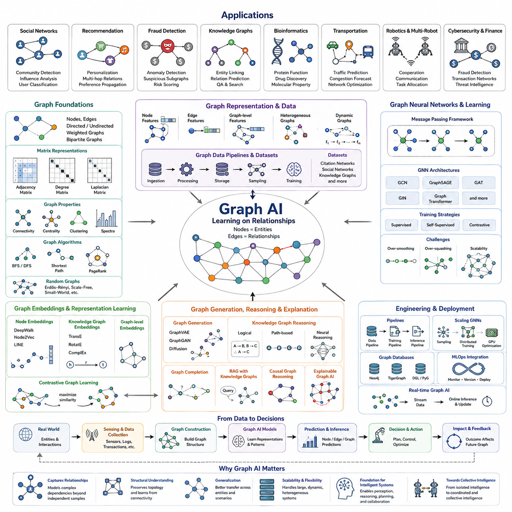
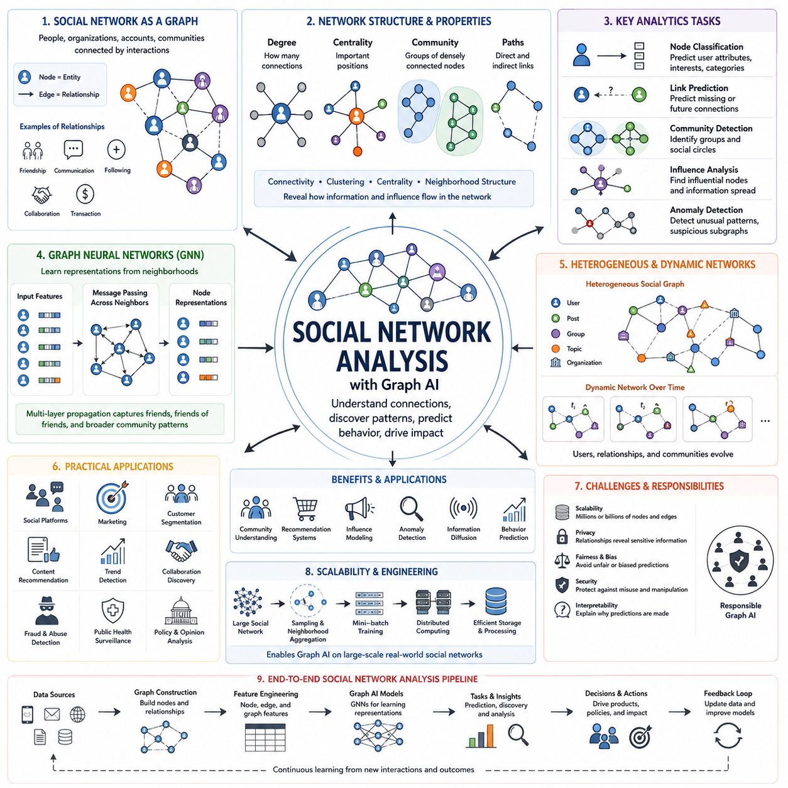
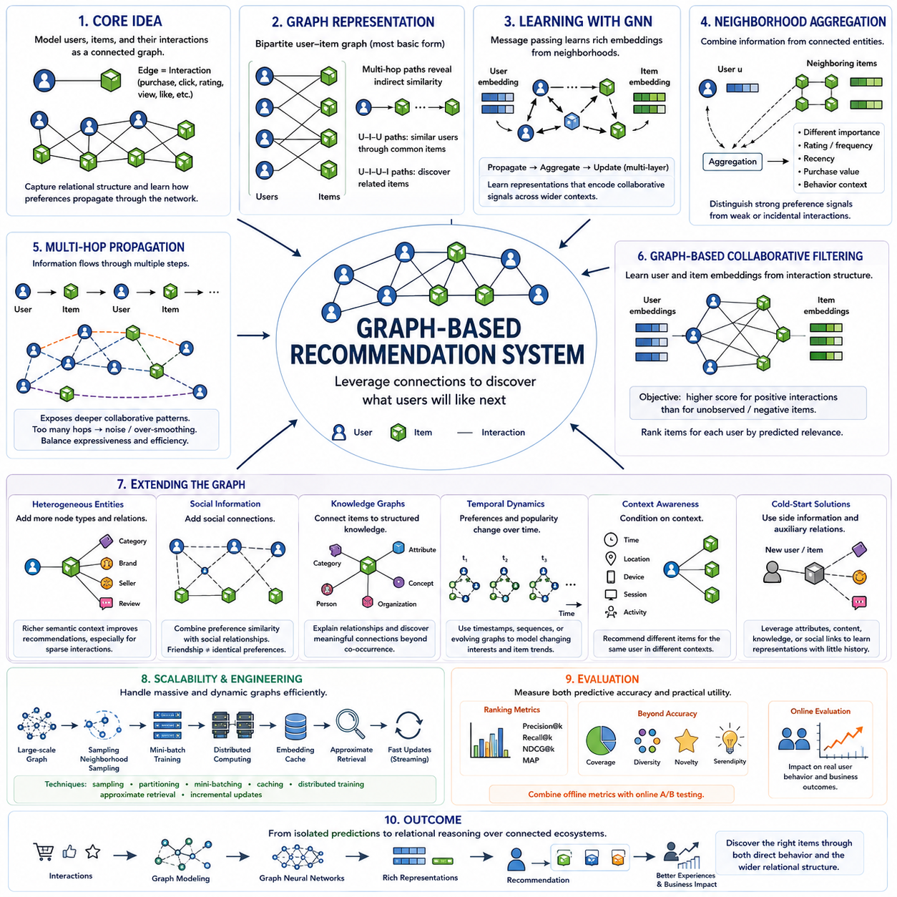
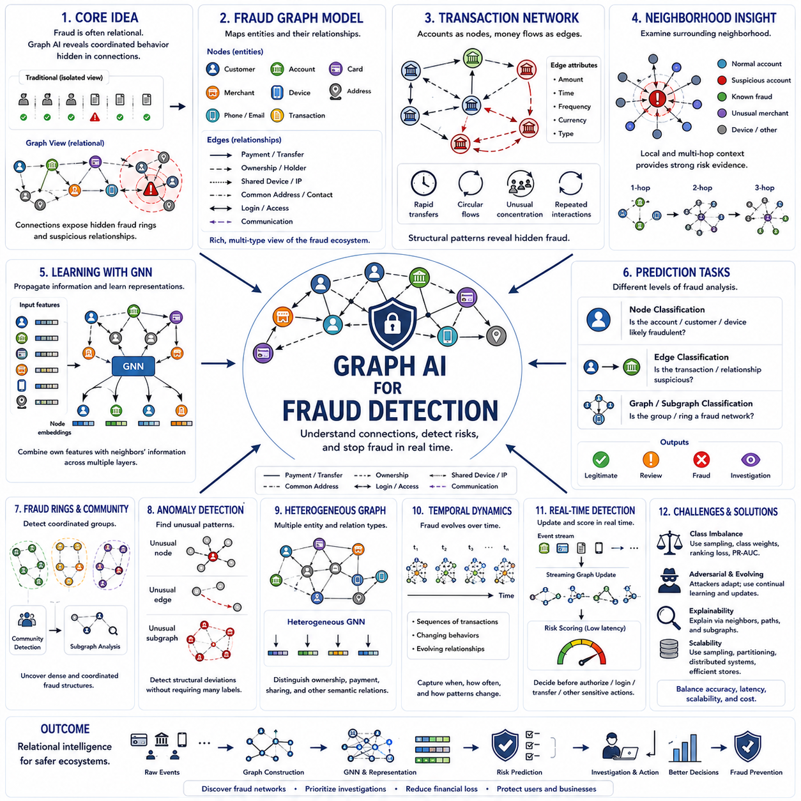
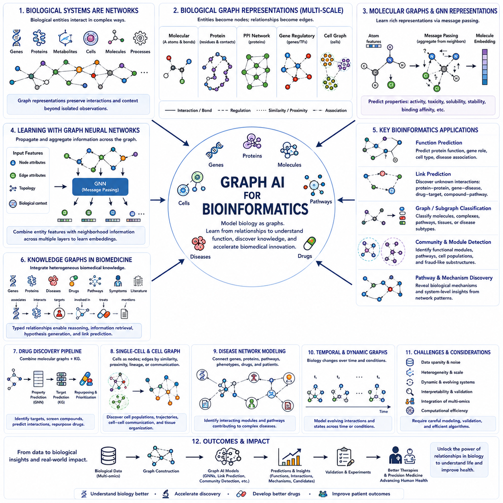
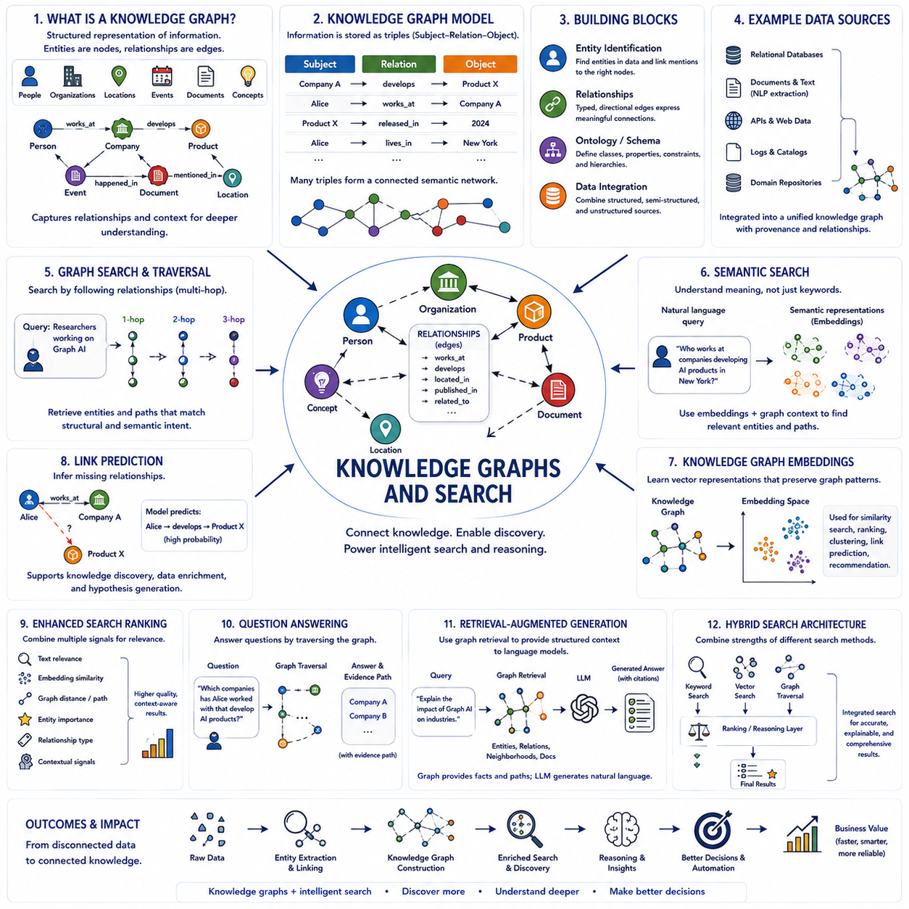
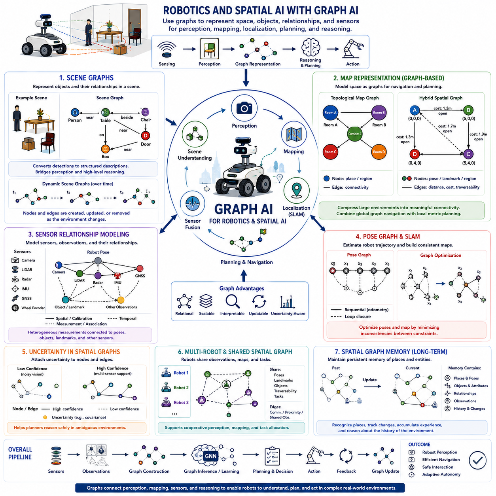
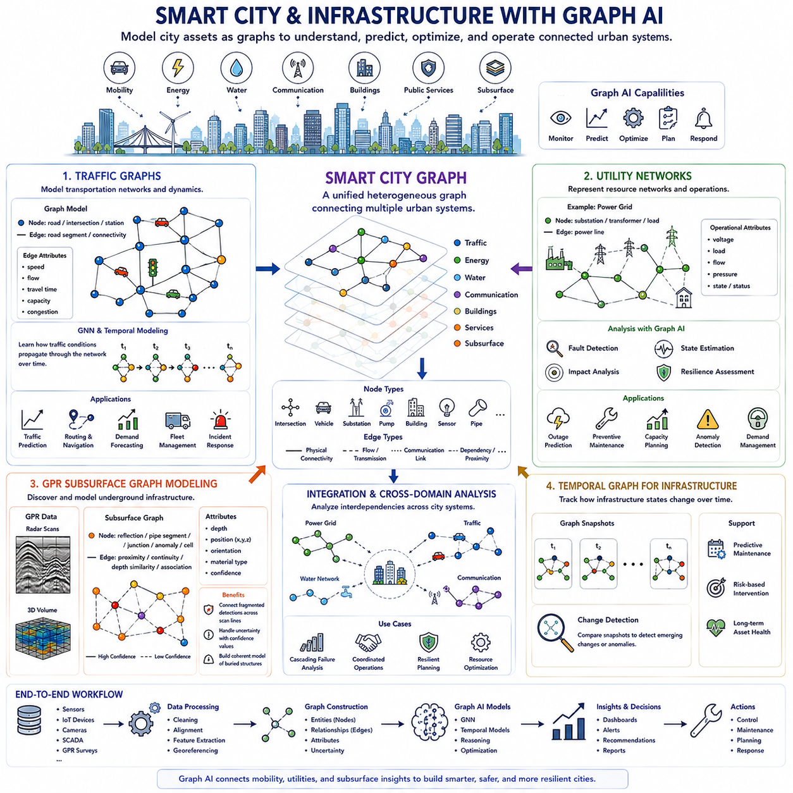
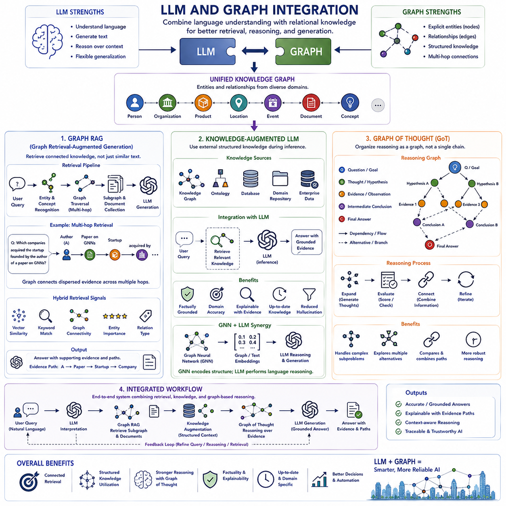

**Volume 29. Graph Deep Learning**

# Chapter 06. Applications of Graph AI

## 06.00. Overview

{width="7.268055555555556in" height="7.268055555555556in"}

그래프 인공지능(Graph AI)은 개별 개체(Entity) 자체만큼이나 개체 사이의 관계(Relationship)가 중요한 문제에 그래프 기반 표현 학습(Graph-based Representation Learning)을 적용합니다. 기존 머신러닝(Machine Learning)이 흔히 독립적인 샘플(Independent Sample)이나 규칙적인 격자(Regular Grid)를 가정하는 것과 달리, 그래프 인공지능은 개체를 노드(Node), 상호작용을 엣지(Edge)로 모델링합니다. 이를 통해 고립된 특징 벡터(Feature Vector)만으로는 자연스럽게 표현하기 어려운 의존성(Dependency), 연결성(Connectivity), 영향력(Influence), 관계적 맥락(Relational Context)을 학습할 수 있습니다.

그래프 인공지능(Graph AI)의 실질적인 중요성은 많은 실제 시스템(Real-world System)이 본질적으로 관계적(Relational)이라는 점에서 비롯됩니다. 소셜 네트워크(Social Network)는 사람을 연결하고, 교통 네트워크(Transportation Network)는 위치를 연결하며, 분자 구조(Molecular Structure)는 원자를 연결하고, 통신 시스템(Communication System)은 장치를 연결합니다. 로봇 플릿(Robotic Fleet) 역시 통신과 공유 환경을 통해 에이전트(Agent)를 연결합니다. 이러한 시스템을 그래프로 표현하면 구조적 조직(Structural Organization)을 보존하면서 관계 자체를 직접 학습할 수 있습니다.

그래프 신경망(Graph Neural Network, GNN)은 많은 그래프 인공지능(Graph AI) 응용의 계산적 기반(Computational Foundation)을 제공합니다. 메시지 패싱(Message Passing)을 통해 각 노드(Node)는 이웃 노드(Neighboring Node)의 정보를 전달받고, 이를 자신의 특징(Feature)과 결합하여 내부 표현(Internal Representation)을 갱신합니다. 이 과정을 여러 계층(Layer)에 걸쳐 반복하면 정보가 점차 넓은 이웃 영역으로 전파되어 그래프 내부의 지역적 상호작용(Local Interaction)과 광범위한 구조적 의존성(Structural Dependency)을 함께 학습할 수 있습니다.

노드 수준 응용(Node-level Application)은 개별 개체(Entity)에 연결된 속성을 예측하는 데 초점을 둡니다. 대표적인 사례로 소셜 네트워크(Social Network)의 사용자 분류, 금융 네트워크(Financial Network)의 사기 계정 식별, 교차로의 교통 상태 추정, 단백질의 기능적 역할 예측, 기계의 운전 상태 판단 등이 있습니다. 이러한 예측은 해당 노드(Node)의 고유 속성뿐 아니라 주변 그래프 이웃(Graph Neighborhood)에 포함된 정보의 영향을 함께 받습니다.

엣지 수준 응용(Edge-level Application)은 두 개체 사이의 관계(Relationship)를 분석합니다. 링크 예측(Link Prediction)은 두 사용자가 상호작용할 가능성, 두 분자 또는 개체 사이에 특정 관계가 존재할 가능성, 통신 링크가 실패할 가능성, 두 장치가 정보를 교환해야 하는지 등을 추정할 수 있습니다. 엣지 분류(Edge Classification)는 기존 관계의 유형과 특성을 구분하여 상호작용의 종류, 강도, 방향 또는 운용 조건(Operational Condition)을 표현할 수 있도록 합니다.

그래프 수준 응용(Graph-level Application)은 개별 노드(Node)나 엣지(Edge)가 아니라 전체 그래프(Graph)에 대한 예측을 생성합니다. 분자 특성 예측(Molecular Property Prediction)이 대표적인 사례로, 분자를 원자와 화학 결합(Chemical Bond)으로 구성된 그래프로 표현하고 독성(Toxicity), 활성(Activity), 안정성(Stability) 등의 특성을 예측할 수 있습니다. 유사한 방법을 전체 회로(Circuit), 소프트웨어 구조, 교통 시스템, 장면(Scene), 로봇 구성(Robotic Configuration)과 같은 관계형 시스템에도 적용할 수 있습니다.

추천 시스템(Recommendation System)은 사용자(User), 제품(Product), 콘텐츠(Content), 행동(Behavior) 사이의 관계가 자연스럽게 대규모 이종 그래프(Heterogeneous Graph)를 형성하기 때문에 그래프 인공지능(Graph AI)의 주요 응용 영역입니다. 그래프 기반 모델(Graph-based Model)은 이러한 관계를 따라 선호도 정보를 전파하고 기존 사용자-아이템 행렬(User-item Matrix)이 놓칠 수 있는 간접적 연관성을 발견합니다. 이를 통해 사회적 맥락, 상호작용 이력, 의미적 유사성(Semantic Similarity), 다중 홉 관계(Multi-hop Relationship)를 통합할 수 있습니다.

지식 그래프(Knowledge Graph)는 그래프 인공지능(Graph AI)을 구조화된 의미 추론(Structured Semantic Reasoning)으로 확장합니다. 사람, 조직, 객체, 장소, 사건, 개념 등의 엔티티(Entity)는 사실적 또는 맥락적 지식을 나타내는 유형화된 관계(Typed Relationship)를 통해 연결됩니다. 그래프 표현 학습(Graph Representation Learning)은 누락된 관계 예측, 관련 엔티티 검색, 질의응답(Question Answering)을 지원하고 언어 모델(Language Model)에 구조화된 맥락을 제공하여 관계 학습과 의미적 추론(Semantic Reasoning)을 연결할 수 있습니다.

그래프 인공지능(Graph AI)은 악의적 활동(Malicious Activity)이 고립된 하나의 관측보다 관계 패턴(Relationship Pattern)으로 나타나는 경우가 많기 때문에 사이버보안(Cybersecurity)과 금융 지능(Financial Intelligence)에서도 특히 유용합니다. 거래(Transaction), 계정(Account), 장치(Device), 주소(Address), 통신 이벤트, 인증 기록(Authentication Record)을 그래프로 구성하면 의심스러운 서브그래프(Subgraph), 비정상적인 연결성, 조직적 행동(Coordinated Behavior), 특이한 정보 흐름을 탐지할 수 있습니다.

과학 분야(Scientific Application)에서는 분자와 단백질에서 재료와 물리적 상호작용 시스템(Physical Interaction System)에 이르기까지 다양한 구조를 그래프로 표현합니다. 노드(Node)는 원자, 잔기(Residue), 입자(Particle), 물리 구성요소를 나타낼 수 있으며, 엣지(Edge)는 결합, 공간적 근접성(Spatial Proximity), 힘(Force), 기능적 관계를 표현할 수 있습니다. 이러한 구조적 관계를 유지하면서 분자 특성 예측, 신약 개발(Drug Discovery), 단백질 분석, 재료 설계(Material Design), 과학 시뮬레이션(Scientific Simulation)을 지원할 수 있습니다.

교통 및 모빌리티 시스템(Transportation and Mobility System)은 도로, 교차로, 차량, 정거장 또는 지리적 영역이 시간에 따라 상호작용하는 동적 그래프(Dynamic Graph)로 자연스럽게 표현됩니다. 그래프 인공지능(Graph AI)은 공간적 연결성(Spatial Connectivity)과 시간적 관측(Temporal Observation)을 결합하여 교통 흐름, 혼잡(Congestion), 이동 수요, 네트워크 장애(Network Disruption)를 예측할 수 있습니다. 시간 모델(Temporal Model)을 그래프 표현과 결합하면 상호작용이 어디에서 발생하는지와 상태가 시간에 따라 어떻게 변화하는지를 동시에 추론할 수 있습니다.

로보틱스(Robotics)와 피지컬 인공지능(Physical AI)은 지능형 기계가 완전히 독립된 개체로만 작동하지 않기 때문에 그래프 인공지능(Graph AI)의 중요한 응용 영역입니다. 하나의 로봇도 관절(Joint), 링크(Link), 센서(Sensor), 액추에이터(Actuator), 기능적 구성요소의 그래프로 모델링할 수 있으며, 여러 로봇은 더 큰 상호작용 그래프(Interaction Graph)를 형성할 수 있습니다. 이를 통해 로봇 모델링, 협업, 통신, 작업 할당(Task Allocation), 협력 인식(Cooperative Perception), 분산 에이전트 간 관계 추론을 지원할 수 있습니다.

다중 로봇 시스템(Multi-robot System)에서 노드(Node)는 개별 로봇을 나타내고, 엣지(Edge)는 통신 가능성, 공간적 근접성, 협업 관계, 공유 관측(Shared Observation), 작업 의존성(Task Dependency)을 나타낼 수 있습니다. 그래프 신경망(Graph Neural Network)은 이웃 로봇 사이에서 정보를 전파하여 집단적 운용 상태(Collective Operational Condition)의 표현을 구축합니다. 이를 통해 모든 에이전트가 전체 전역 상태(Global State)를 직접 처리하지 않고도 분산된 지역 관측(Local Observation)을 협력적 의사결정(Coordinated Decision)에 활용할 수 있습니다.

그래프 인공지능(Graph AI)은 인식(Perception)을 구조화된 장면 이해(Structured Scene Understanding)와 연결할 수도 있습니다. 카메라(Camera), 라이다(LiDAR), 레이더(Radar) 등의 센서가 검출한 객체를 노드(Node)로 만들고, 공간적·의미적·인과적·상호작용 관계를 엣지(Edge)로 구성할 수 있습니다. 이렇게 생성된 장면 그래프(Scene Graph)는 단순한 객체 검출을 넘어 개체들이 서로 어떻게 관련되어 있는지를 표현하며 계획(Planning), 예측(Prediction), 추론(Reasoning), 월드 모델링(World Modeling)을 위한 구조화된 중간 표현(Intermediate Representation)을 제공합니다.

동적 그래프 인공지능(Dynamic Graph AI)은 개체와 관계가 지속적으로 변화하는 환경으로 이러한 개념을 확장합니다. 노드(Node)가 생성되거나 사라질 수 있고, 엣지(Edge)가 새롭게 연결되거나 끊어질 수 있으며, 각 속성(Attribute)도 시간에 따라 변화할 수 있습니다. 이러한 모델은 교통 시스템, 통신 네트워크, 금융 거래, 사회적 상호작용, 자율 시스템(Autonomous System), 로봇 플릿(Robotic Fleet)에서 중요하며, 고정된 그래프가 아니라 그래프 구조(Graph Structure)와 시간적 변화(Temporal Evolution)를 함께 학습해야 합니다.

그래프 인공지능(Graph AI)의 보다 넓은 의미는 독립적인 관측의 집합을 관계 지능(Relational Intelligence)으로 변환할 수 있다는 데 있습니다. 기존 신경망(Neural Network)이 데이터 샘플 내부의 패턴을 학습한다면, 그래프 기반 시스템(Graph-based System)은 개체들이 서로 어떻게 영향을 주고, 제약하고, 협력하며, 의존하는지까지 학습합니다. 이러한 능력은 네트워크(Network), 구조화된 환경(Structured Environment), 상호작용하는 에이전트(Interacting Agent), 분산 지능(Distributed Intelligence)을 이해해야 하는 시스템의 중요한 기반이 됩니다.

인공지능 시스템이 더욱 복잡한 현실 세계의 운용으로 발전함에 따라 그래프 인공지능(Graph AI)은 인식 모델(Perception Model), 월드 모델(World Model), 강화학습(Reinforcement Learning), 파운데이션 모델(Foundation Model), 계획 시스템(Planning System)과 함께 동작할 수 있습니다. 인식은 개체를 식별하고, 그래프 모델(Graph Model)은 개체 사이의 관계를 구성하며, 시간 모델(Temporal Model)은 미래 상태를 예측하고, 의사결정 메커니즘(Decision Mechanism)은 행동을 결정합니다. 이러한 통합 구조에서 그래프 인공지능은 고립된 지능(Isolated Intelligence)을 협력 지능(Coordinated Intelligence)과 집단 지능(Collective Intelligence)으로 확장하는 데 필요한 관계적 구조(Relational Structure)를 제공합니다.

## 06.01. Social Network Analysis

{width="7.268055555555556in" height="7.268055555555556in"}

소셜 네트워크 분석(Social Network Analysis)은 사람, 조직, 계정, 커뮤니티 또는 기타 사회적 개체(Social Entity)가 상호작용을 통해 연결되는 시스템을 분석합니다. 소셜 네트워크(Social Network)는 자연스럽게 그래프(Graph)로 표현할 수 있으며, 노드(Node)는 개체를 나타내고 엣지(Edge)는 친구 관계, 통신, 팔로우(Following), 협업, 거래와 같은 관계를 나타냅니다. 이러한 표현을 통해 사회적 상호작용의 구조 자체를 직접 계산하고 분석할 수 있습니다.

전통적인 분석(Traditional Analysis)은 일반적으로 나이, 위치, 관심사, 활동 빈도 또는 인구통계학적 정보(Demographic Information)와 같은 개별 속성을 사용하여 사람을 설명합니다. 그래프 기반 소셜 네트워크 분석(Graph-based Social Network Analysis)은 누가 누구와 상호작용하며 이러한 상호작용이 어떻게 구성되는지를 고려함으로써 관계적 맥락(Relational Context)을 추가합니다. 비슷한 속성을 가진 두 사용자도 네트워크 내부의 위치가 다르면 매우 다른 역할을 수행할 수 있으므로 토폴로지(Topology)는 기존 특징 벡터(Feature Vector)를 넘어서는 중요한 정보가 됩니다.

그래프 구조(Graph Structure)는 개별 기록만으로는 관찰하기 어려운 패턴을 보여줍니다. 차수(Degree)는 하나의 노드(Node)가 얼마나 많은 직접 연결을 가지고 있는지를 나타내며, 경로(Path)는 여러 노드에 걸친 간접적인 관계를 설명합니다. 연결성(Connectivity), 군집화(Clustering), 중심성(Centrality), 이웃 구조(Neighborhood Structure)는 정보와 영향력이 네트워크를 통해 어떻게 흐르는지를 서로 다른 관점에서 보여줍니다. 이러한 구조적 속성은 현대 그래프 인공지능(Graph AI) 기법이 동작하는 고전적인 기반을 형성합니다.

중심성 분석(Centrality Analysis)은 구조적으로 중요한 위치를 차지하는 노드(Node)를 식별하려고 합니다. 차수 중심성(Degree Centrality)은 많은 연결을 가진 개체를 강조하며, 다른 중심성 척도(Centrality Measure)는 멀리 떨어진 영역을 연결하거나 중요한 경로에 위치한 노드를 파악할 수 있습니다. 실제 소셜 시스템에서 구조적으로 중심적인 사용자는 정보 허브(Information Hub), 조정자(Coordinator), 중개자(Broker), 또는 커뮤니티 사이의 연결점(Bridge) 역할을 할 수 있습니다. 따라서 중요성은 단순한 개별 활동량뿐 아니라 네트워크 위치에 의해 결정됩니다.

커뮤니티 탐지(Community Detection)는 네트워크의 나머지 부분보다 서로 더 강하게 연결된 노드(Node)의 그룹을 찾습니다. 이러한 커뮤니티는 친구 그룹, 전문 조직, 관심 그룹, 고객 세그먼트(Customer Segment), 연구 커뮤니티 또는 조직적으로 행동하는 집단을 나타낼 수 있습니다. 그래프 기반 학습(Graph-based Learning)은 네트워크 토폴로지(Network Topology)와 노드 속성(Node Attribute)을 함께 반영하여 구성원의 특성뿐 아니라 구성원 사이의 관계를 기반으로 커뮤니티를 분석할 수 있습니다.

그래프 신경망(Graph Neural Network, GNN)은 이웃(Neighborhood)으로부터 직접 표현(Representation)을 학습함으로써 소셜 네트워크 분석(Social Network Analysis)을 확장합니다. 메시지 패싱(Message Passing)을 통해 사용자 표현은 자신의 특징과 연결된 사용자의 정보를 결합할 수 있습니다. 여러 GNN 계층(Layer)을 사용하면 정보가 더 넓은 이웃 영역으로 전파되어 각 계정을 독립적인 학습 샘플로 처리하는 대신 친구, 친구의 친구, 그리고 더 넓은 커뮤니티에 걸친 패턴을 학습할 수 있습니다.

노드 분류(Node Classification)는 소셜 네트워크에서 가장 일반적인 그래프 인공지능(Graph AI) 작업 중 하나입니다. 모델은 노드 특징(Node Feature)과 주변 관계를 함께 이용하여 사용자의 관심사, 계정 유형, 행동 그룹 또는 기타 레이블(Label)을 예측할 수 있습니다. 연결된 사용자는 행동적 또는 맥락적 특성을 공유하는 경우가 많기 때문에 이웃 정보(Neighborhood Information)는 예측 성능을 향상시킬 수 있습니다. 그러나 모든 연결된 개체가 반드시 동일한 속성을 가진다고 가정해서는 안 됩니다.

링크 예측(Link Prediction)은 누락되었거나 관찰되지 않았거나 미래에 형성될 가능성이 있는 관계를 추정하는 데 초점을 둡니다. 소셜 플랫폼(Social Platform)은 이를 이용하여 잠재적인 연결, 협업 기회 또는 관련 커뮤니티를 식별할 수 있습니다. 모델은 기존 네트워크 구조와 노드 표현(Node Representation)을 학습하여 두 노드 사이에 의미 있는 엣지(Edge)가 존재해야 하는지를 추정하며, 관계 발견(Relationship Discovery)을 그래프 기반 예측 문제로 변환합니다.

영향력 분석(Influence Analysis)은 정보, 의견, 행동 또는 활동이 연결된 집단을 통해 어떻게 전파되는지를 조사합니다. 하나의 노드(Node)에서 시작된 메시지는 직접 연결된 이웃으로 전달되고 이후 네트워크의 더 먼 영역으로 확산될 수 있습니다. 그래프 표현(Graph Representation)은 이러한 전파 경로(Propagation Path)를 모델링하고 확산(Diffusion)에 큰 영향을 주는 노드나 커뮤니티를 식별하는 데 도움을 줍니다. 시간 정보(Temporal Information)를 추가하면 지속적인 영향력과 단기간의 활동 급증을 구분할 수도 있습니다.

소셜 네트워크(Social Network)는 일반적으로 정적(Static)이지 않습니다. 사용자가 가입하거나 떠나고, 관계가 형성되거나 사라지며, 상호작용 강도가 변화하고, 커뮤니티 역시 지속적으로 진화합니다. 동적 그래프 인공지능(Dynamic Graph AI)은 관계 구조와 시간 정보를 결합하여 이러한 변화를 명시적으로 표현합니다. 고정된 하나의 스냅샷(Snapshot)만 분석하는 대신 시간 그래프 모델(Temporal Graph Model)은 노드 상태와 연결이 어떻게 변화하는지를 분석하여 새로운 커뮤니티 탐지, 상호작용 예측, 영향력 변화 분석 등을 지원할 수 있습니다.

이종 소셜 그래프(Heterogeneous Social Graph)는 여러 종류의 개체와 관계가 동시에 존재하는 경우 더욱 풍부한 표현을 제공합니다. 노드(Node)는 사용자, 게시물, 주제, 조직, 제품 또는 위치를 나타낼 수 있으며, 엣지(Edge)는 팔로우, 작성, 공유, 회원 관계, 구매 또는 언급을 표현할 수 있습니다. 서로 다른 의미를 가진 이러한 관계를 보존하면 그래프 인공지능(Graph AI)은 모든 연결을 하나의 일반적인 엣지 유형으로 단순화하지 않고 근본적으로 다른 상호작용을 구분하여 학습할 수 있습니다.

소셜 네트워크 분석(Social Network Analysis)은 이상 탐지(Anomaly Detection)와 조직적 행동 탐지(Coordinated-behavior Detection)에도 유용합니다. 개별 계정을 따로 분석하면 의심스러운 활동이 정상처럼 보일 수 있지만, 밀집된 상호작용 클러스터(Interaction Cluster), 반복적인 연결 구조, 동기화된 행동 또는 그룹 사이의 비정상적인 연결에서 특이한 패턴이 나타날 수 있습니다. 따라서 그래프 모델(Graph Model)은 기존의 개별 기록 중심 분석이 발견하지 못할 수 있는 관계적 이상(Relational Anomaly)과 의심스러운 서브그래프(Subgraph)를 식별할 수 있습니다.

추천 시스템(Recommendation System)은 사용자, 콘텐츠, 제품, 커뮤니티 사이의 관계를 활용할 수 있기 때문에 소셜 그래프(Social Graph) 정보로부터 큰 이점을 얻습니다. 그래프 기반 추천 모델(Graph-based Recommendation Model)은 직접적인 상호작용과 다중 홉 연관성(Multi-hop Association)을 결합하여 관련 아이템(Item)이나 연결을 발견할 수 있습니다. 이를 통해 기존 행동 이력뿐 아니라 구조적 유사성(Structural Similarity)과 관계적 맥락(Relational Context)을 추천에 반영하여 사용자 선호도에 대한 더욱 풍부한 표현을 구축할 수 있습니다.

대규모 소셜 네트워크(Large-scale Social Network)는 실제 플랫폼이 수백만 또는 수십억 개의 노드(Node)와 엣지(Edge)를 포함할 수 있기 때문에 상당한 확장성 문제(Scalability Challenge)를 발생시킵니다. 매 학습 단계마다 전체 그래프를 처리하는 것은 현실적으로 어려운 경우가 많습니다. 따라서 샘플링 방법(Sampling Method), 이웃 집계(Neighborhood Aggregation), 미니배치 학습(Mini-batch Training), 분산 계산(Distributed Computation), 효율적인 그래프 저장(Graph Storage)은 메모리와 계산 요구량을 관리하면서 대규모 네트워크에 GNN을 적용하기 위한 중요한 엔지니어링 기법입니다.

프라이버시(Privacy), 공정성(Fairness), 보안(Security), 해석 가능성(Interpretability)은 소셜 그래프 인공지능(Social Graph AI)에서 특히 중요합니다. 관계 정보는 개별 기록에 명시적으로 포함되지 않은 민감한 정보를 드러낼 수 있기 때문입니다. 모델은 이웃 사용자나 커뮤니티 소속으로부터 특정 특성을 추론할 수 있으며, 이는 의도하지 않은 프라이버시 또는 편향(Bias) 위험을 발생시킬 수 있습니다. 따라서 책임 있는 시스템에는 신중한 데이터 거버넌스(Data Governance), 접근 제어(Access Control), 평가(Evaluation), 설명 가능성(Explainability), 관계 정보가 예측에 미치는 영향에 대한 검토가 필요합니다.

소셜 네트워크 분석(Social Network Analysis)의 더 넓은 가치는 지능의 분석 단위를 고립된 개인(Isolated Individual)에서 연결된 시스템(Connected System)으로 변화시킨다는 점에 있습니다. 그래프 인공지능(Graph AI)은 각 개체가 무엇인지뿐 아니라 개체들이 어떻게 상호작용하고, 조직되고, 서로 영향을 주며, 더 큰 구조를 형성하는지를 학습합니다. 이러한 관계적 관점(Relational Perspective)은 커뮤니티 이해, 추천, 영향력 모델링, 이상 탐지, 정보 확산(Information Diffusion), 그리고 연결을 통해 집단 행동(Collective Behavior)이 나타나는 다양한 응용의 기반을 제공합니다.

## 06.02. Recommendation Systems

{width="7.268055555555556in" height="7.268055555555556in"}

그래프 기반 추천 시스템(Graph-based Recommendation System)은 추천을 고립된 예측 문제로 처리하는 대신 사용자(User), 아이템(Item), 그리고 이들의 상호작용을 연결된 구조로 모델링합니다. 사용자와 아이템은 노드(Node)가 되고, 구매, 클릭, 평점, 조회, 좋아요 또는 기타 상호작용은 엣지(Edge)가 됩니다. 이러한 표현은 관계 정보를 보존하며, 추천 모델이 사용자, 제품, 콘텐츠, 행동으로 구성된 복잡한 네트워크를 통해 선호도가 어떻게 전파되는지를 학습할 수 있도록 합니다.

전통적인 협업 필터링(Collaborative Filtering)은 일반적으로 사용자-아이템 행렬(User-item Matrix)을 통해 상호작용을 표현하고 행이나 열 사이의 유사성을 이용하여 선호도를 추정합니다. 그래프 기반 추천(Graph-based Recommendation)은 상호작용을 엣지(Edge)로 명시적으로 표현하고 정보가 여러 관계 경로를 따라 전달되도록 함으로써 이러한 개념을 일반화합니다. 따라서 사용자는 직접 소비한 아이템뿐 아니라 유사한 사용자, 관련 아이템, 커뮤니티, 카테고리 및 기타 연결된 개체로부터 정보를 얻을 수 있습니다.

기본적인 추천 그래프(Recommendation Graph)는 일반적으로 사용자와 아이템이라는 두 가지 노드 유형(Node Type)을 포함하는 이분 그래프(Bipartite Graph)로 표현됩니다. 엣지(Edge)는 구매, 평점, 클릭 또는 조회와 같은 관찰된 상호작용에 따라 사용자와 아이템을 연결합니다. 사용자가 사용자와 직접 연결되지 않고 아이템 역시 다른 아이템과 직접 연결되지 않더라도, 다중 홉 경로(Multi-hop Path)를 통해 동일한 아이템을 이용한 사용자나 비슷한 사용자 집단이 선택한 아이템과 같은 간접적인 유사성을 자연스럽게 발견할 수 있습니다.

그래프 신경망(Graph Neural Network, GNN)은 이러한 구조에서 추천 임베딩(Recommendation Embedding)을 학습하기 위한 강력한 메커니즘을 제공합니다. 메시지 패싱(Message Passing) 과정에서 각 사용자는 이웃 아이템으로부터 정보를 받고, 각 아이템은 상호작용한 사용자로부터 정보를 받습니다. 이러한 전파를 반복하면 점점 더 넓은 협업 맥락(Collaborative Context)을 포함하는 표현이 생성됩니다. 결과적으로 얻어진 임베딩은 사용자가 아직 이용하지 않은 아이템을 얼마나 선호할지를 추정하는 데 활용할 수 있습니다.

이웃 집계(Neighborhood Aggregation)는 연결된 개체의 정보가 각 표현(Representation)에 어떻게 반영되는지를 결정합니다. 단순한 방법은 이웃 임베딩의 평균을 사용할 수 있지만, 고급 방법에서는 서로 다른 상호작용에 서로 다른 중요도를 부여합니다. 평점, 상호작용 빈도, 최신성(Recency), 구매 금액 또는 행동 맥락(Behavioral Context)이 집계 과정에 영향을 줄 수 있습니다. 이를 통해 모든 엣지를 동일하게 취급하지 않고 강한 선호 신호와 약하거나 우발적인 상호작용을 구분할 수 있습니다.

다중 홉 전파(Multi-hop Propagation)는 그래프 기반 추천(Graph-based Recommendation)의 주요 장점 중 하나입니다. 사용자는 하나의 아이템과 연결되고, 해당 아이템은 다른 사용자와 연결되며, 그 사용자들은 다시 추가적인 아이템과 연결될 수 있습니다. 이러한 경로는 직접적인 상호작용 이력을 넘어서는 협업 패턴(Collaborative Pattern)을 보여줍니다. 그러나 지나치게 많은 전파는 불필요한 정보나 과도한 평활화(Over-smoothing)를 발생시킬 수 있으므로 실제 시스템에서는 넓은 관계 맥락의 이점과 노이즈 및 계산 비용 사이의 균형을 유지해야 합니다.

그래프 기반 협업 필터링(Graph-based Collaborative Filtering)은 주로 상호작용 구조로부터 사용자와 아이템 임베딩을 학습합니다. 그래프 합성곱 추천 모델(Graph Convolutional Recommender)은 사용자-아이템 그래프를 따라 잠재 표현(Latent Representation)을 전파하고 관찰된 선호 신호를 기준으로 이를 최적화합니다. 일반적으로 긍정적인 상호작용을 가진 아이템이 관찰되지 않았거나 부정적인 후보보다 높은 관련성 점수(Relevance Score)를 갖도록 학습하여 관계적 표현 학습으로부터 직접 추천 순위(Ranking)를 생성합니다.

추천 그래프(Recommendation Graph)는 이종 개체(Heterogeneous Entity)를 추가하여 사용자와 아이템을 넘어 확장할 수 있습니다. 제품은 브랜드, 카테고리, 속성, 판매자, 위치 또는 리뷰와 연결될 수 있으며, 미디어 콘텐츠는 제작자, 장르, 주제 및 키워드와 연결될 수 있습니다. 이러한 이종 그래프(Heterogeneous Graph)는 협업 행동을 보완하는 의미적 맥락(Semantic Context)을 제공하며, 직접적인 상호작용 이력이 부족하거나 아이템 사이의 관계에 유용한 도메인 지식(Domain Knowledge)이 포함된 경우 추천 성능을 향상시킬 수 있습니다.

사회적 정보(Social Information)도 추천 그래프에 통합할 수 있습니다. 사용자는 아이템과의 상호작용뿐 아니라 친구 관계, 팔로우, 통신 또는 커뮤니티 소속을 통해 서로 연결될 수 있습니다. 추천 모델은 이를 통해 선호도 유사성(Preference Similarity)과 사회적 관계(Social Relationship)를 결합할 수 있습니다. 이러한 접근은 연결된 사용자들이 서로 영향을 주는 환경에서 유용하지만, 친구 관계나 의사소통이 반드시 동일한 선호도를 의미하는 것은 아니므로 사회적 연결은 신중하게 해석해야 합니다.

지식 그래프(Knowledge Graph)는 아이템을 구조화된 의미 정보(Structured Semantic Information)와 연결함으로써 또 다른 중요한 확장을 제공합니다. 하나의 아이템은 유형화된 관계(Typed Relationship)를 통해 카테고리, 속성, 조직, 사람, 개념 또는 기타 개체와 연결될 수 있습니다. 지식 그래프 추천(Knowledge Graph Recommendation)은 이러한 경로를 활용하여 서로 다른 아이템이 왜 관련되는지를 설명하고 행동의 동시 발생만으로는 발견하기 어려운 의미 있는 관계를 찾습니다. 이를 통해 의미적 풍부성(Semantic Richness), 해석 가능성(Interpretability), 추천 다양성(Diversity)을 향상시킬 수 있습니다.

사용자의 관심과 아이템의 인기도는 시간에 따라 변화하기 때문에 시간 정보(Temporal Information)가 중요합니다. 최근의 구매는 수년 전의 상호작용보다 더 강한 신호를 제공할 수 있으며, 새롭게 등장한 아이템도 빠르게 높은 관련성을 가질 수 있습니다. 시간 그래프 모델(Temporal Graph Model)은 타임스탬프(Timestamp), 상호작용 순서 또는 변화하는 그래프 구조를 반영하여 사용자-아이템 그래프가 항상 고정되어 있다고 가정하지 않고 변화하는 선호도를 추천에 반영할 수 있습니다.

맥락 인식 그래프 추천(Context-aware Graph Recommendation)은 시간, 위치, 장치, 세션(Session), 작업 또는 현재 활동과 같은 조건을 추가로 반영할 수 있습니다. 동일한 사용자라도 주변 상황에 따라 서로 다른 아이템을 선호할 수 있습니다. 맥락적 개체와 관계를 그래프에 표현하거나 이를 노드 및 엣지 특징(Node and Edge Feature)에 통합하면 장기적인 관계 선호도와 단기적인 운영 맥락(Operational Context)을 모두 조건으로 활용하는 추천을 학습할 수 있습니다.

콜드 스타트 문제(Cold-start Problem)는 새로운 사용자나 아이템의 상호작용이 적어 협업 정보가 제한될 때 발생합니다. 그래프 기반 시스템은 새로운 개체를 속성, 카테고리, 지식 그래프, 사회적 관계 또는 콘텐츠 특징(Content Feature)에 연결하여 이러한 문제를 완화할 수 있습니다. 이러한 보조 관계(Auxiliary Relationship)는 표현 학습을 위한 대체 경로를 제공하므로 충분한 사용자-아이템 상호작용 이력이 축적되기 전에도 유용한 임베딩을 생성할 수 있습니다.

대규모 추천 시스템(Large-scale Recommendation System)은 수백만 개의 사용자와 아이템, 그리고 지속적으로 생성되는 상호작용으로 구성된 그래프를 효율적으로 처리해야 합니다. 전체 그래프 전파(Full-graph Propagation)는 계산 비용이 높을 수 있으므로 이웃 샘플링(Neighborhood Sampling), 그래프 분할(Graph Partitioning), 미니배치 학습(Mini-batch Training), 캐시된 임베딩(Cached Embedding), 분산 계산(Distributed Computation), 근사 검색(Approximate Retrieval) 등이 중요한 엔지니어링 기법이 됩니다. 새로운 상호작용이 관련 추천 신호를 빠르게 변화시킬 수 있기 때문에 실제 운영 시스템은 빈번한 업데이트도 지원해야 합니다.

평가(Evaluation)는 모델이 알려진 상호작용을 정확하게 예측하는지만 측정해서는 충분하지 않습니다. 정밀도(Precision), 재현율(Recall), 정규화 할인 누적 이득(Normalized Discounted Cumulative Gain, NDCG)과 같은 순위 평가 지표(Ranking Metric)는 추천 품질을 측정할 수 있으며, 커버리지(Coverage), 다양성(Diversity), 신규성(Novelty), 의외성(Serendipity)은 시스템이 인기 있는 아이템만 반복적으로 추천하는지를 평가하는 데 도움을 줍니다. 온라인 평가(Online Evaluation)는 추천이 실제 사용자 행동에 미치는 영향까지 측정하여 예측 정확성과 실질적인 효용성을 함께 평가할 수 있습니다.

궁극적으로 그래프 기반 추천(Graph-based Recommendation)은 추천을 고립된 사용자 벡터와 아이템 벡터의 단순한 매칭에서 연결된 생태계(Connected Ecosystem)에 대한 관계 추론(Relational Reasoning)으로 변화시킵니다. 상호작용 그래프(Interaction Graph), 그래프 신경망(Graph Neural Network), 이종 관계(Heterogeneous Relation), 지식 그래프(Knowledge Graph), 시간적 동역학(Temporal Dynamics), 맥락 정보를 결합함으로써 더욱 풍부한 선호도 표현을 학습할 수 있습니다. 그 결과 직접적인 행동뿐 아니라 사용자와 콘텐츠를 둘러싼 더 넓은 관계 구조를 통해 관련 아이템을 발견할 수 있는 추천 프레임워크(Recommendation Framework)를 구축할 수 있습니다.

## 06.03. Fraud Detection

{width="7.268055555555556in" height="7.268055555555556in"}

사기 탐지(Fraud Detection)는 사기 행위가 계정, 거래, 장치, 신원, 가맹점 및 조직 사이의 관계에 의존하는 경우가 많기 때문에 그래프 인공지능(Graph AI)의 자연스러운 응용 분야입니다. 기존 모델은 개별 기록을 독립적으로 평가하는 경우가 많지만, 그래프 기반 시스템(Graph-based System)은 개체 사이의 연결을 보존합니다. 이러한 관계적 관점(Relational View)은 각 거래나 계정을 개별적으로 조사할 때는 정상적으로 보일 수 있는 조직적인 행동(Coordinated Behavior)을 발견할 수 있도록 합니다.

사기 그래프(Fraud Graph)는 관련 개체를 노드(Node)로, 상호작용이나 연관성을 엣지(Edge)로 표현합니다. 노드는 고객, 은행 계좌, 신용카드, 가맹점, 장치, 전화번호, 주소 또는 거래를 나타낼 수 있습니다. 엣지는 결제, 송금, 소유 관계, 공유 장치, 공통 주소, 로그인 활동 또는 통신을 나타낼 수 있습니다. 여러 종류의 개체와 관계를 결합하면 의심스러운 행동에 대해 더욱 풍부한 관점(Richer View)을 구성할 수 있습니다.

거래 네트워크(Transaction Network)는 금융 사기 분석(Financial Fraud Analysis)에서 가장 일반적인 그래프 구조 중 하나입니다. 계좌는 노드(Node)가 되고 자금 이체는 금액, 시간, 빈도, 통화 또는 거래 유형과 같은 속성을 포함하는 방향성 엣지(Directed Edge)가 됩니다. 사기 활동은 빠른 연속 송금, 순환형 자금 흐름(Circular Money Flow), 비정상적인 집중 또는 관련 계정 사이의 반복적인 상호작용과 같은 특징적인 구조를 만들 수 있으며, 기존의 거래 수준 규칙(Transaction-level Rule)은 이러한 구조를 놓칠 수 있습니다.

그래프 구조(Graph Structure)를 이용하면 의심스러운 개체 주변의 이웃(Neighborhood)을 조사할 수 있습니다. 개별적으로는 정상적으로 보이는 계정도 이미 확인된 사기 계정, 비정상적인 가맹점 또는 반복적으로 공유되는 장치와 강하게 연결되어 있을 수 있습니다. 따라서 이웃 정보(Neighborhood Information)는 위험에 대한 맥락적 증거(Contextual Evidence)를 제공합니다. 다중 홉 분석(Multi-hop Analysis)은 이러한 추론을 간접 관계까지 확장하여 여러 중간 개체를 거쳐 연결된 의심스러운 네트워크를 발견할 수 있습니다.

그래프 신경망(Graph Neural Network, GNN)은 이러한 이웃을 통해 정보를 전파하여 사기와 관련된 표현(Representation)을 학습합니다. 메시지 패싱(Message Passing) 과정에서 각 노드(Node)는 자신의 속성과 연결된 개체로부터 받은 정보를 결합합니다. 여러 계층(Layer)을 사용하면 점점 더 넓은 관계적 맥락(Relational Context)을 표현에 포함할 수 있습니다. 이후 사기 분류기(Fraud Classifier)는 이러한 임베딩(Embedding)을 이용하여 개별 특성과 주변 네트워크의 구조적 패턴을 함께 기반으로 위험도를 추정할 수 있습니다.

노드 분류(Node Classification)는 계정, 고객, 가맹점 또는 장치가 사기와 관련될 가능성이 있는지를 판단하는 데 일반적으로 사용됩니다. 엣지 분류(Edge Classification)는 특정 거래나 관계가 의심스러운지를 평가할 수 있으며, 그래프 수준 또는 서브그래프 수준 분류(Graph-level or Subgraph-level Classification)는 조직적으로 행동하는 집단을 식별할 수 있습니다. 이러한 상호 보완적인 예측 수준을 통해 그래프 인공지능(Graph AI)은 개별 개체, 상호작용, 조직적 구조를 하나의 관계적 프레임워크(Relational Framework)에서 분석할 수 있습니다.

사기 조직(Fraud Ring)은 여러 행위자가 의심스러운 활동을 숨기기 위해 협력하는 경우가 많기 때문에 그래프 분석(Graph Analysis)에 특히 적합합니다. 여러 계정이 서로 자금을 송금하거나, 장치 또는 연락처 정보를 공유하거나, 공통 가맹점과 거래하거나, 반복적인 거래 패턴을 만들 수 있습니다. 커뮤니티 탐지(Community Detection)와 서브그래프 분석(Subgraph Analysis)은 비정상적으로 밀집되거나 조직화된 구조를 식별하여 조사자가 개별적인 경고(Alert)를 넘어 조직적인 사기 네트워크(Fraud Network)를 발견하도록 지원합니다.

이상 탐지(Anomaly Detection)는 사기에 대한 레이블(Label)이 충분하지 않거나 새로운 공격 패턴이 나타나는 경우 중요한 또 다른 접근 방법을 제공합니다. 그래프 이상 탐지(Graph Anomaly Detection)는 연결 구조와 속성이 예상되는 행동과 다른 노드, 엣지 또는 서브그래프(Subgraph)를 찾습니다. 비정상적인 거래 금액보다 비정상적인 관계가 더 중요한 신호가 될 수도 있습니다. 이를 통해 기존 특징 기반 이상 탐지(Feature-based Anomaly Detection)가 발견하지 못할 수 있는 구조적 편차(Structural Deviation)를 탐지할 수 있습니다.

이종 그래프(Heterogeneous Graph)는 실제 사기 생태계(Fraud Ecosystem)에 다양한 종류의 개체와 관계가 존재하기 때문에 특히 유용합니다. 고객은 계정을 소유하고, 장치를 사용하며, IP 주소에 접근하고, 거래를 수행하며, 가맹점과 상호작용할 수 있습니다. 이러한 의미적 관계 유형(Semantic Relationship Type)을 보존하면 이종 그래프 신경망(Heterogeneous GNN)은 소유 관계, 결제 관계, 장치 공유를 서로 구분하여 복잡한 사기 시나리오에 대해 더욱 의미 있는 표현을 생성할 수 있습니다.

사기 활동은 빠르게 변화하기 때문에 시간 정보(Temporal Information)가 필수적입니다. 거래는 연속적으로 발생하고, 계정의 행동은 변화하며, 장치가 여러 사용자 사이에서 이동할 수 있고, 조직적인 공격은 짧은 시간 구간에서만 나타날 수도 있습니다. 시간 그래프(Temporal Graph)는 타임스탬프(Timestamp)와 변화하는 관계를 반영하여 어떤 개체들이 연결되어 있는지뿐 아니라 언제 연결되었는지, 얼마나 자주 반복되는지, 의심스러운 구조가 시간에 따라 어떻게 형성되는지를 분석할 수 있습니다.

실시간 사기 탐지(Real-time Fraud Detection)를 위해서는 새로운 이벤트가 발생할 때 그래프 정보를 지속적으로 갱신해야 합니다. 하나의 새로운 거래가 이전에 존재하지 않았던 연결을 생성하여 특정 계정을 갑자기 의심스러운 클러스터(Suspicious Cluster)와 연결할 수 있습니다. 스트리밍 그래프 시스템(Streaming Graph System)은 거래를 처리하면서 이웃, 임베딩 및 위험 특징(Risk Feature)을 갱신할 수 있습니다. 결제, 송금, 로그인 또는 기타 민감한 작업을 승인하기 전에 판단해야 하는 경우 낮은 지연시간 추론(Low-latency Inference)이 특히 중요합니다.

클래스 불균형(Class Imbalance)은 정상적인 활동이 확인된 사기보다 일반적으로 훨씬 많기 때문에 중요한 학습 문제가 됩니다. 이를 적절히 처리하지 않고 모델을 학습하면 전체 정확도(Accuracy)는 높으면서도 중요한 사기 사례를 놓칠 수 있습니다. 따라서 샘플링 전략(Sampling Strategy), 클래스 가중 목적함수(Class-weighted Objective), 순위 손실(Ranking Loss), 이상 탐지 방법 및 적절한 평가 지표가 필요합니다. 정밀도(Precision), 재현율(Recall), F1 점수(F1 Score), 정밀도-재현율 곡선 아래 면적(Area Under Precision-Recall Curve)은 단순 정확도보다 유용할 수 있습니다.

사기 행위자는 탐지 시스템에 적응하기 때문에 사기 탐지(Fraud Detection)는 적대적(Adversarial)이면서 지속적으로 변화하는 문제이기도 합니다. 의심스러운 패턴이 알려지면 공격자는 거래 경로를 변경하거나, 새로운 신원을 생성하거나, 활동을 더 많은 계정에 분산시키거나, 정상적인 행동을 모방할 수 있습니다. 따라서 동적 그래프 학습(Dynamic Graph Learning)과 지속적인 모델 업데이트(Continual Model Update)는 과거의 사기 구조에만 영구적으로 의존하지 않고 새롭게 등장하는 관계 패턴을 식별하기 위해 중요합니다.

설명 가능성(Explainability)은 사기 예측이 거래 차단, 계정 조사 또는 규제 검토(Regulatory Review)로 이어질 수 있기 때문에 매우 중요합니다. 그래프 기반 설명(Graph-based Explanation)은 예측에 영향을 준 이웃, 의심스러운 경로, 공유 개체 또는 서브그래프를 식별할 수 있습니다. 따라서 조사자는 설명되지 않은 위험 점수만 받는 대신 특정 계정이 알려진 사기 계정과 장치를 공유하거나 비정상적인 순환 송금(Unusual Transfer Cycle)에 참여하기 때문에 위험하다는 관계적 근거를 확인할 수 있습니다.

대규모 사기 그래프(Large-scale Fraud Graph)는 금융 및 디지털 플랫폼이 수백만 개의 개체와 지속적으로 증가하는 상호작용 스트림(Interaction Stream)을 처리할 수 있기 때문에 상당한 엔지니어링 요구사항을 발생시킵니다. 그래프 분할(Graph Partitioning), 이웃 샘플링(Neighborhood Sampling), 분산 학습(Distributed Training), 효율적인 그래프 데이터베이스(Graph Database), 캐시된 표현(Cached Representation), 증분 계산(Incremental Computation)은 확장성을 유지하는 데 도움을 줍니다. 실제 운영 아키텍처(Production Architecture)는 탐지 정확도와 메모리 사용량, 처리량(Throughput), 업데이트 빈도 및 추론 지연 사이의 균형을 유지해야 합니다.

궁극적으로 그래프 기반 사기 탐지(Graph-based Fraud Detection)는 위험 분석(Risk Analysis)을 고립된 이벤트의 평가에서 연결된 행동(Connected Behavior)의 이해로 변화시킵니다. 거래 그래프(Transaction Graph), 이종 관계(Heterogeneous Relationship), 그래프 신경망(Graph Neural Network), 이상 탐지(Anomaly Detection), 시간적 동역학(Temporal Dynamics), 커뮤니티 분석(Community Analysis), 실시간 추론(Real-time Inference)을 결합함으로써 그래프 인공지능(Graph AI)은 개별 기록에 숨겨진 조직적 구조를 발견할 수 있습니다. 이러한 관계 지능(Relational Intelligence)은 사기 네트워크 탐색, 조사 우선순위 결정 및 위험 의사결정 개선을 위한 강력한 기반을 제공합니다.

## 06.04. Bioinformatics

{width="7.268055555555556in" height="7.268055555555556in"}

생물정보학(Bioinformatics)은 생물학적 시스템이 본질적으로 고립된 관측값이 아니라 서로 상호작용하는 개체로 구성되어 있기 때문에 그래프 인공지능(Graph AI)의 자연스러운 응용 분야입니다. 유전자(Gene), 단백질(Protein), 대사산물(Metabolite), 세포(Cell), 분자(Molecule), 생물학적 과정(Biological Process)은 복잡한 관계 네트워크를 형성합니다. 그래프 표현(Graph Representation)은 이러한 상호작용을 명시적으로 보존하여 머신러닝 모델이 개체의 특성과 주변의 구조적 맥락(Structural Context)을 함께 이용해 생물학적 기능을 분석할 수 있도록 합니다.

생물학적 그래프(Biological Graph)는 다양한 규모에서 구성될 수 있습니다. 분자 수준에서는 원자(Atom)가 노드(Node)가 되고 화학 결합(Chemical Bond)이 엣지(Edge)가 됩니다. 단백질 구조에서는 아미노산 잔기(Amino Acid Residue)를 노드로 표현하고 순차적, 공간적 또는 생화학적 관계로 연결할 수 있습니다. 더 큰 규모에서는 유전자와 단백질이 조절 또는 상호작용 네트워크를 형성하며, 세포는 물리적 근접성, 통신, 계통(Lineage) 또는 기능적 유사성에 따라 그래프를 형성할 수 있습니다.

분자 그래프(Molecular Graph)는 계산 생물학(Computational Biology)과 신약 개발(Drug Discovery)에서 특히 중요합니다. 분자는 원소 유형(Element Type), 전하(Charge), 혼성화(Hybridization), 화학적 상태와 같은 특징을 가진 원자를 노드(Node)로 표현하고, 결합 및 결합 특성을 엣지(Edge)로 나타내는 그래프로 구성할 수 있습니다. 그래프 신경망(Graph Neural Network, GNN)은 이러한 구조에서 직접 분자 표현(Molecular Representation)을 학습하여 분자를 사람이 설계한 기술자(Descriptor)나 고정된 지문(Fingerprint)만으로 표현해야 하는 한계를 줄일 수 있습니다.

메시지 패싱(Message Passing)을 이용하면 분자 그래프 신경망(Molecular GNN)이 인접한 원자의 정보를 결합할 수 있습니다. 각 원자는 자신의 특징과 화학 결합을 통해 전달받은 정보를 이용하여 표현(Representation)을 갱신합니다. 이 과정을 반복하면 점차 더 넓은 분자 환경(Molecular Environment)을 포함하는 표현을 만들 수 있습니다. 이후 그래프 수준 표현(Graph-level Representation)은 전체 분자를 요약하여 활성(Activity), 독성(Toxicity), 용해도(Solubility), 안정성(Stability), 결합 가능성(Binding Potential) 등의 특성 예측을 지원할 수 있습니다.

단백질 분석(Protein Analysis)은 단백질의 기능이 3차원 조직(Three-dimensional Organization)에 크게 의존하기 때문에 추가적인 구조적 복잡성을 가집니다. 노드(Node)는 아미노산, 잔기(Residue), 원자 또는 구조적 영역을 나타낼 수 있으며, 엣지(Edge)는 서열 인접성(Sequence Adjacency), 공간적 거리, 접촉(Contact), 생화학적 상호작용을 표현할 수 있습니다. 따라서 그래프 모델은 서열 기반 특징과 구조적 관계를 통합하여 단백질 특성 예측, 기능 주석(Functional Annotation), 상호작용 분석 및 구조 인식 생물학적 추론(Structure-aware Biological Reasoning)을 지원할 수 있습니다.

단백질-단백질 상호작용 네트워크(Protein-Protein Interaction Network)는 단백질을 노드(Node)로, 알려졌거나 예측된 상호작용을 엣지(Edge)로 표현합니다. 이러한 그래프는 기능적 모듈(Functional Module), 신호 전달 경로(Signaling Pathway), 관련 생물학적 과정에 참여하는 단백질 집단을 보여줄 수 있습니다. 그래프 학습(Graph Learning)은 생물학적 기능이 하나의 단백질보다 여러 분자 구성요소 사이의 협력 관계에서 나타나는 경우가 많다는 원리를 이용하여 네트워크 이웃으로부터 알려지지 않은 단백질 기능이나 상호작용을 추론할 수 있습니다.

유전자 조절 네트워크(Gene Regulatory Network)는 또 다른 중요한 그래프 표현을 제공합니다. 유전자 또는 조절 요소(Regulatory Element)가 노드(Node)가 되고, 엣지(Edge)는 활성화(Activation), 억제(Repression) 또는 기타 조절 영향을 나타냅니다. 이러한 네트워크는 유전자 발현(Gene Expression)이 어떻게 제어되고 생물학적 시스템을 통해 교란(Perturbation)이 어떻게 전파되는지를 모델링하는 데 도움을 줍니다. 그래프 인공지능(Graph AI)은 조절 토폴로지(Regulatory Topology)와 발현 측정값을 결합하여 기능적 의존성, 질병 메커니즘, 환경 또는 치료 개입(Therapeutic Intervention)에 대한 반응을 분석할 수 있습니다.

지식 그래프(Knowledge Graph)는 유전자, 단백질, 질병, 약물, 경로(Pathway), 증상, 생물학적 과정에 걸친 이종 생의학 정보(Heterogeneous Biomedical Information)를 통합할 수 있습니다. 유형화된 엣지(Typed Edge)는 약물이 단백질을 표적으로 하는 관계, 유전자가 질병과 연관되는 관계, 단백질이 특정 경로에 참여하는 관계 등을 나타냅니다. 생의학 지식 그래프(Biomedical Knowledge Graph)는 서로 분산된 생물학적 데이터베이스의 정보를 연결하여 링크 예측(Link Prediction), 정보 검색, 가설 생성(Hypothesis Generation), 관계 추론을 위한 구조화된 환경을 제공합니다.

신약 개발(Drug Discovery)은 분자 그래프(Molecular Graph)와 생의학 지식 그래프(Biomedical Knowledge Graph)를 결합함으로써 이점을 얻을 수 있습니다. 분자 그래프 신경망(Molecular GNN)은 화학적·약리학적 특성을 추정할 수 있으며, 지식 그래프는 화합물(Compound), 표적(Target), 질병, 경로, 기존 치료법 사이의 관계를 보여줄 수 있습니다. 이러한 표현을 함께 활용하면 표적 식별(Target Identification), 화합물 스크리닝(Compound Screening), 약물-표적 상호작용 예측, 약물 재창출(Drug Repurposing), 후속 실험을 위한 후보 우선순위 결정을 지원할 수 있습니다.

그래프 인공지능(Graph AI)은 단일 세포 생물학(Single-cell Biology)에서도 점점 중요해지고 있습니다. 개별 세포를 유전자 발현 또는 기타 분자 특징을 가진 노드(Node)로 표현하고, 유사성, 공간적 근접성, 발달 관계(Developmental Relationship), 추론된 세포 간 통신에 따라 엣지(Edge)로 연결할 수 있습니다. 세포 그래프(Cell Graph)는 세포 집단, 전이 상태(Transitional State), 조직 구조, 세포 유형 사이의 상호작용을 보여주며, 독립적인 세포 측정을 넘어 생물학적 시스템의 관계 모델(Relational Model)로 분석을 확장할 수 있습니다.

공간 생물학(Spatial Biology)은 세포의 물리적 배열이 생물학적 기능에 영향을 미치기 때문에 그래프 표현에 특히 강한 필요성을 제공합니다. 세포 또는 조직 영역(Tissue Region)을 노드(Node)로 표현하고 공간적 인접성이나 분자 통신을 엣지(Edge)로 정의할 수 있습니다. 그래프 신경망(Graph Neural Network)은 세포 특징과 조직 아키텍처(Tissue Architecture)를 결합하여 국소 미세환경(Local Microenvironment), 인접 세포 유형, 공간적 조직이 질병 진행이나 생물학적 기능에 어떻게 기여하는지를 분석할 수 있습니다.

그래프 기반 질병 모델링(Graph-based Disease Modeling)은 복잡한 질환을 연구하기 위해 분자적 관계와 임상적 관계를 연결합니다. 질병 관련 유전자, 단백질, 경로, 표현형(Phenotype), 약물, 환자 특성은 상호 연결된 네트워크를 형성할 수 있습니다. 하나의 원인 특징만을 찾는 대신 그래프 인공지능(Graph AI)은 결합된 행동이 질병에 기여하는 상호작용 모듈과 경로를 식별할 수 있습니다. 이러한 시스템 수준 관점(Systems-level Perspective)은 여러 생물학적 메커니즘이 관여하는 다인성 질환(Multifactorial Disorder)에 특히 유용합니다.

생물학적 지식은 불완전하기 때문에 링크 예측(Link Prediction)은 다양한 생물정보학 그래프(Bioinformatics Graph)에 폭넓게 적용될 수 있습니다. 모델은 기존에 알려지지 않은 단백질 상호작용, 유전자-질병 연관성(Gene-disease Association), 약물-표적 관계 또는 화합물과 생물학적 경로 사이의 연결을 예측할 수 있습니다. 학습된 그래프 임베딩(Graph Embedding)은 네트워크 맥락을 포함하는 표현을 제공하여 후보 관계의 우선순위를 결정하고 추가적인 계산 분석이나 실험적 검증(Experimental Validation) 대상으로 선정할 수 있도록 합니다.

그래프 분류(Graph Classification)와 노드 분류(Node Classification)는 서로 보완적인 생물학적 작업을 지원합니다. 노드 수준 모델은 단백질 기능, 유전자 역할, 세포 유형 또는 질병 연관성을 예측할 수 있으며, 그래프 수준 모델은 분자, 분자 복합체(Molecular Complex), 생물학적 구조를 분류할 수 있습니다. 서브그래프 분석(Subgraph Analysis)은 기능적 모티프(Functional Motif)나 상호작용 모듈을 식별할 수 있습니다. 이러한 서로 다른 예측 수준을 통해 그래프 인공지능(Graph AI)은 공통된 관계적 프레임워크를 사용하여 생물학적 조직의 다양한 계층에서 동작할 수 있습니다.

생물학적 그래프(Biological Graph)는 고정되어 있기보다 동적(Dynamic)인 경우가 많습니다. 유전자 발현은 시간에 따라 변화하고, 단백질 상호작용은 세포 조건에 반응하며, 신호 전달 경로는 활성화되거나 비활성화되고, 세포 집단은 발달 또는 질병 과정에서 변화합니다. 시간 그래프 인공지능(Temporal Graph AI)은 이러한 변화하는 관계를 표현하고 구조적 정보와 시간에 따른 생물학적 시퀀스(Biological Sequence)를 결합하여 생물학적 시스템이 서로 다른 기능적 상태 사이에서 어떻게 전이되는지를 모델링할 수 있습니다.

생물정보학(Bioinformatics) 응용에서는 학습된 연관성이 자동으로 생물학적 인과관계(Biological Causality)를 의미하지 않기 때문에 신중한 해석과 검증이 필요합니다. 그래프 모델은 불완전한 데이터, 실험적 편향(Experimental Bias), 간접적인 상관관계를 반영하는 통계적으로 유용한 관계를 발견할 수 있습니다. 따라서 계산 예측을 신뢰할 수 있는 과학적 결론으로 전환하기 위해서는 설명 가능성(Explainability), 생물학적 사전 지식(Biological Prior Knowledge), 불확실성 추정(Uncertainty Estimation), 독립 데이터셋, 실험실 검증(Laboratory Validation)이 중요합니다.

궁극적으로 그래프 인공지능(Graph AI)은 생물정보학(Bioinformatics)에 생물학을 상호 연결된 시스템(Interconnected System)으로 모델링하기 위한 프레임워크를 제공합니다. 분자 그래프(Molecular Graph)는 화학 구조를 표현하고, 단백질 및 유전자 네트워크는 기능적 상호작용을 포착하며, 세포 그래프(Cell Graph)는 조직 구조를 표현하고, 생의학 지식 그래프(Biomedical Knowledge Graph)는 서로 다른 생물학적 규모의 정보를 연결합니다. 이러한 관계를 학습함으로써 그래프 인공지능은 생물학적 발견, 질병 이해, 신약 개발 및 복잡한 생명 시스템의 통합 모델링을 지원할 수 있습니다.

## 06.05. Knowledge Graphs and Search

{width="7.268055555555556in" height="7.268055555555556in"}

지식 그래프(Knowledge Graph)는 개체(Entity)를 노드(Node)로, 의미 있는 관계(Relationship)를 엣지(Edge)로 모델링하여 정보를 구조적으로 표현합니다. 주로 레코드를 테이블(Table) 형태로 구성하는 기존 데이터베이스(Database)와 달리, 지식 그래프는 개념, 객체, 사람, 조직, 위치, 사건, 문서가 서로 어떻게 관련되어 있는지를 강조합니다. 이러한 관계 구조(Relational Structure)를 통해 검색 시스템(Search System)은 단순한 키워드 매칭(Keyword Matching)을 넘어 개체, 맥락(Context), 의미적 연결(Semantic Connection)을 이해하는 방향으로 확장될 수 있습니다.

기본적인 지식 그래프(Knowledge Graph)는 주어(Subject), 관계(Relation), 목적어(Object)로 구성된 트리플(Triple)을 통해 정보를 표현합니다. 예를 들어 어떤 회사가 제품을 개발한다는 문장은 Company → develops → Product 형태로 표현할 수 있습니다. 이러한 수많은 트리플이 결합되어 연결된 의미 네트워크(Semantic Network)를 형성합니다. 하나의 개체가 여러 관계에 참여할 수 있기 때문에 복잡한 지식을 표현하면서도 기계가 탐색하고 분석하며 추론에 활용할 수 있는 명시적인 연결을 유지할 수 있습니다.

개체 식별(Entity Identification)은 유용한 지식 그래프를 구축하기 위한 기본 단계입니다. 문서, 데이터베이스, 웹 페이지 또는 기타 데이터 소스에 등장하는 이름을 일관된 개체로 매핑해야 합니다. 개체 해소(Entity Resolution)는 서로 다른 표현이 동일한 실제 객체를 나타내는지를 판단하며, 개체 연결(Entity Linking)은 텍스트에 등장하는 표현을 그래프 노드(Graph Node)와 연결합니다. 정확한 식별은 중복을 줄이고 여러 소스의 정보를 통합할 수 있는 일관된 구조를 형성합니다.

관계(Relationship)는 지식 그래프를 단순한 개체의 집합과 구별하는 의미적 구조(Semantic Structure)를 제공합니다. 엣지(Edge)는 소유, 위치, 소속, 저작, 의존성, 유사성, 인과관계(Causality), 참여 또는 다양한 도메인 특화 관계(Domain-specific Relation)를 표현할 수 있습니다. 유형화된 관계(Typed Relationship)를 사용하면 서로 다른 연결이 서로 다른 의미를 가진다는 것을 시스템이 이해할 수 있습니다. 또한 생산, 소유, 포함, 의존과 같은 관계는 반드시 대칭적이지 않기 때문에 방향성(Directionality) 역시 중요할 수 있습니다.

온톨로지(Ontology)와 스키마(Schema)는 지식이 그래프 내부에서 어떻게 구성되어야 하는지를 정의합니다. 개체 클래스(Entity Class), 관계 유형(Relationship Type), 속성(Property), 제약조건(Constraint), 개념적 계층구조(Conceptual Hierarchy)를 규정합니다. 예를 들어 연구자(Researcher)는 사람(Person)의 한 유형이며 연구자가 논문(Publication)을 작성할 수 있다고 정의할 수 있습니다. 이러한 구조화된 어휘(Structured Vocabulary)는 데이터의 일관성을 향상시키고 서로 다른 데이터 소스를 공통된 의미 프레임워크(Semantic Framework)에서 해석하고 추론할 수 있도록 합니다.

지식 그래프 구축(Knowledge Graph Construction)은 구조화 데이터(Structured Data), 반구조화 데이터(Semi-structured Data), 비구조화 정보(Unstructured Information)를 함께 사용하는 경우가 많습니다. 데이터베이스는 신뢰할 수 있는 개체 속성을 제공하고, 문서와 텍스트에서는 자연어 처리(Natural Language Processing)를 통해 관계를 추출할 수 있습니다. 추가 정보는 API, 카탈로그, 로그(Log), 도메인 저장소(Domain Repository) 등에서 얻을 수 있습니다. 이렇게 생성된 그래프는 원본 소스 사이의 관계와 출처 정보(Provenance)를 유지하면서 분산된 정보를 연결하는 통합 계층(Integration Layer)의 역할을 합니다.

그래프 검색(Graph Search)은 텍스트 유사성(Textual Similarity)에만 의존하지 않고 관계를 따라 질의를 수행할 수 있다는 점에서 기존 키워드 검색(Keyword Search)과 다릅니다. 사용자는 특정 기술을 연구하는 연구자, 해당 연구자와 연관된 조직, 그리고 그들이 작성한 논문과 같이 특정 관계의 연속을 통해 연결된 개체를 검색할 수 있습니다. 그래프 순회(Graph Traversal)를 사용하면 다중 홉 경로(Multi-hop Path)를 탐색하고 구조적 및 의미적 관련성에 따라 결과를 검색할 수 있습니다.

의미 검색(Semantic Search)은 정확히 동일한 단어를 찾는 대신 질의(Query)의 의미를 해석함으로써 이러한 기능을 확장합니다. 개체, 관계, 텍스트, 그래프 이웃(Graph Neighborhood)은 의미적 유사성(Semantic Similarity)을 포착하는 임베딩(Embedding)으로 표현될 수 있습니다. 따라서 검색 시스템은 질의에서 저장된 콘텐츠와 다른 용어를 사용하더라도 관련 정보를 검색할 수 있습니다. 의미 임베딩과 명시적인 그래프 구조를 결합하면 유연한 검색과 해석 가능한 관계 맥락(Relational Context)을 함께 제공할 수 있습니다.

지식 그래프 임베딩(Knowledge Graph Embedding)은 개체와 관계를 머신러닝(Machine Learning)에 적합한 수치 벡터 표현(Numerical Vector Representation)으로 변환합니다. 중요한 그래프 패턴(Graph Pattern)을 보존하여 서로 관련된 개체가 학습된 표현 공간(Representation Space)에서 의미 있는 위치를 갖도록 하는 것이 목적입니다. 이러한 임베딩은 유사성 검색, 개체 순위화(Entity Ranking), 군집화(Clustering), 추천(Recommendation), 링크 예측(Link Prediction)을 지원하며 기호적 그래프 구조(Symbolic Graph Structure)와 신경망 기반 표현 학습(Neural Representation Learning)을 연결하는 역할을 합니다.

링크 예측(Link Prediction)은 지식 그래프에서 누락된 관계를 추론합니다. 기존 그래프 패턴이 두 개체가 연결되어야 한다는 것을 강하게 나타내는 경우 모델은 해당 후보 관계에 높은 확률을 부여할 수 있습니다. 실제 지식 그래프는 완전한 경우가 거의 없기 때문에 이러한 기능은 중요합니다. 예측된 링크는 지식 발견(Knowledge Discovery), 추천, 데이터 보강(Data Enrichment), 가설 생성(Hypothesis Generation)에 활용할 수 있지만, 중요한 추론 관계를 확립된 사실로 취급하기 전에는 검증이 필요합니다.

그래프 신경망(Graph Neural Network, GNN)은 이웃 개체와 관계로부터 정보를 집계하여 지식 그래프 표현을 더욱 풍부하게 만들 수 있습니다. 개체 자체의 속성만을 이용하는 대신 GNN은 연결된 노드(Node)와 다중 홉 이웃(Multi-hop Neighborhood)의 정보를 포함할 수 있습니다. 관계형 그래프 신경망(Relational GNN) 아키텍처는 서로 다른 엣지 유형을 별도로 처리하여 특정 의미 관계가 개체 표현, 예측 및 검색에 서로 다른 방식으로 기여한다는 것을 학습할 수 있습니다.

지식 그래프(Knowledge Graph)는 텍스트 관련성(Textual Relevance)에 관계적 증거(Relational Evidence)를 추가함으로써 검색 결과의 순위(Search Result Ranking)를 개선할 수 있습니다. 검색 결과가 인식된 개체와 직접 연결되어 있거나 적절한 카테고리에 속하거나 질의에 포함된 개념 사이의 의미 있는 경로에 위치한다면 더 높은 중요도를 가질 수 있습니다. 따라서 검색 시스템은 어휘 매칭(Lexical Matching), 임베딩 유사성, 그래프 거리(Graph Distance), 개체 중요도, 관계 유형, 맥락 신호(Contextual Signal)를 함께 사용하여 관련성을 결정할 수 있습니다.

질의응답(Question Answering) 역시 많은 질문이 개체 사이의 관계를 암묵적으로 요구하기 때문에 중요한 응용 분야입니다. 질문에서 개체와 관계를 식별한 후 시스템은 지식 그래프를 탐색하여 관련된 사실이나 경로를 검색할 수 있습니다. 다중 홉 질문(Multi-hop Question)은 정답에 도달하기 전에 여러 연결된 관계를 거쳐야 할 수도 있습니다. 그래프 기반 검색(Graph-based Retrieval)은 명시적인 증거 경로(Evidence Path)를 제공하여 신경망 기반 언어 모델(Neural Language Model)을 보완하고 생성된 응답의 추적 가능성(Traceability)을 향상시킬 수 있습니다.

지식 그래프는 언어 모델(Language Model)에 구조화된 맥락(Structured Context)을 제공하여 검색 증강 생성(Retrieval-Augmented Generation, RAG)을 지원할 수도 있습니다. 서로 독립적인 텍스트 구절만 검색하는 대신 질의와 연결된 개체, 관계, 이웃, 지원 문서(Supporting Document)를 검색할 수 있습니다. 이러한 그래프 기반 검색(Graph-based Retrieval)은 일반적인 벡터 검색(Vector Retrieval)이 놓칠 수 있는 의존성과 다중 홉 증거(Multi-hop Evidence)를 발견할 수 있으며, 언어 모델은 검색된 구조적 지식을 자연어 응답으로 변환합니다.

하이브리드 검색 시스템(Hybrid Search System)은 키워드 검색(Keyword Retrieval), 벡터 검색(Vector Search), 그래프 순회(Graph Traversal)를 점점 더 많이 결합하고 있습니다. 키워드 방식은 정확한 어휘 매칭을 제공하고, 벡터 검색은 의미적 유사성을 포착하며, 지식 그래프는 명시적인 관계와 제약조건을 보존합니다. 이러한 방법을 서로 경쟁하는 방식으로 취급하는 대신 통합 검색 아키텍처(Integrated Search Architecture)는 각각의 장점을 활용할 수 있습니다. 이후 순위화 또는 추론 구성요소가 질의의 요구사항에 따라 각 검색 방식에서 얻은 증거를 결합할 수 있습니다.

궁극적으로 지식 그래프(Knowledge Graph)는 검색(Search)을 일치하는 단어가 포함된 문서를 찾는 과정에서 연결된 지식(Connected Knowledge)을 탐색하는 과정으로 변화시킵니다. 개체(Entity)는 식별 가능한 객체를 제공하고, 관계(Relationship)는 의미 구조를 제공하며, 임베딩(Embedding)은 학습된 유사성을 제공하고, 그래프 알고리즘(Graph Algorithm)은 탐색과 추론을 제공합니다. 이러한 구조를 신경망 기반 검색(Neural Search) 및 언어 모델과 결합하면 더욱 풍부한 지식 발견, 다중 홉 검색, 설명 가능한 관계(Explainable Relationship), 복잡한 정보에 대한 맥락 인식 접근(Context-aware Access)을 지원할 수 있습니다.

## 06.06. Robotics and Spatial AI

{width="7.268055555555556in" height="7.268055555555556in"}

로보틱스(Robotics)와 공간 인공지능(Spatial AI)은 로봇이 객체, 장소, 센서, 에이전트 및 물리적 관계로 구성된 환경에서 작동하기 때문에 그래프 인공지능(Graph AI)의 자연스러운 응용 분야입니다. 기존 인식(Perception)은 개별 객체나 기하학적 특징(Geometric Feature)을 식별할 수 있지만, 그래프 표현(Graph Representation)은 이러한 요소들이 서로 어떻게 관련되어 있는지를 명시적으로 표현합니다. 이러한 관계 구조(Relational Structure)는 로봇이 분산된 센서 관측을 주변 세계에 대한 체계적인 표현으로 변환하도록 지원합니다.

공간 지능(Spatial Intelligence)은 어떤 객체가 존재하는지를 탐지하는 것 이상을 요구합니다. 로봇은 객체가 어디에 위치하는지, 공간이 어떻게 연결되는지, 어떤 영역이 주행 가능(Traversable)한지, 그리고 개체들이 장면(Scene) 안에서 어떻게 상호작용하는지를 이해해야 합니다. 그래프 인공지능(Graph AI)은 객체, 영역, 랜드마크(Landmark), 로봇 자세(Robot Pose), 환경 특징을 노드(Node)로, 공간적·의미적·기하학적·기능적 관계를 엣지(Edge)로 표현하는 공통 구조를 제공합니다.

장면 그래프(Scene Graph)는 인식된 환경을 객체와 객체 사이의 관계를 중심으로 구성합니다. 노드(Node)는 사람, 가구, 차량, 문, 장비, 장애물 또는 기타 탐지된 개체를 나타낼 수 있습니다. 엣지(Edge)는 가까움, 내부에 있음, 뒤에 있음, 연결됨, 지지됨 또는 상호작용함과 같은 관계를 표현할 수 있습니다. 따라서 장면 그래프는 단순한 탐지 결과의 집합을 장면의 구성 요소와 관계적 조직(Relational Organization)을 함께 표현하는 구조화된 설명으로 변환합니다.

장면 그래프(Scene Graph)는 인식(Perception)과 상위 수준 추론(Higher-level Reasoning)을 연결할 수 있습니다. 비전 모델(Vision Model)이 테이블, 의자, 사람, 출입구를 탐지한다면 그래프는 의자가 테이블 옆에 있고, 사람이 출입구 근처에 있으며, 출입구가 두 공간을 연결한다는 관계를 기록할 수 있습니다. 계획(Planning) 및 추론 시스템은 이러한 관계를 직접 활용하여 원시 이미지나 독립적인 객체 탐지 결과에만 의존하지 않고 구조화된 환경 맥락(Structured Environmental Context)에 기반한 로봇 의사결정을 수행할 수 있습니다.

동적 장면 그래프(Dynamic Scene Graph)는 이러한 표현을 시간에 따라 변화하는 환경으로 확장합니다. 사람은 이동하고, 객체의 위치가 변경되며, 문이 열리거나 닫히고, 로봇 자체의 위치도 지속적으로 변화합니다. 따라서 새로운 관측이 입력될 때 노드(Node)와 엣지(Edge)를 생성, 갱신 또는 제거해야 합니다. 시간 그래프 인공지능(Temporal Graph AI)은 현재의 공간 관계와 그 변화 과정을 함께 유지하여 움직임, 상호작용, 점유 상태(Occupancy), 미래 장면 구성(Future Scene Configuration)의 예측을 지원할 수 있습니다.

지도 표현(Map Representation)은 로보틱스에서 그래프를 활용하는 또 다른 중요한 영역입니다. 지도는 반드시 밀집된 기하학적 격자(Dense Geometric Grid)만으로 표현될 필요가 없습니다. 위치, 랜드마크, 방, 교차점, 복도, 웨이포인트(Waypoint), 주행 가능 영역을 노드(Node)로 표현하고, 엣지(Edge)를 통해 연결성 또는 가능한 이동을 나타낼 수 있습니다. 이러한 위상적 표현(Topological Representation)은 로봇이 환경을 통해 어떻게 이동할 수 있는지를 표현하며 정밀한 기하학 정보를 유지하는 계량 지도(Metric Map)를 보완할 수 있습니다.

위상 그래프(Topological Graph)는 상세한 환경을 의미 있는 연결 구조로 압축할 수 있기 때문에 대규모 내비게이션(Large-scale Navigation)에 특히 유용합니다. 모든 격자 셀(Grid Cell)을 대상으로 직접 경로를 계획하는 대신 로봇은 먼저 방, 복도, 교차점 또는 영역을 기반으로 전역 경로를 추론한 다음 선택된 영역 내부에서 지역 기하학 경로 계획(Local Geometric Planning)을 수행할 수 있습니다. 이러한 계층적 표현(Hierarchical Representation)은 전역 그래프 기반 내비게이션과 지역 계량 계획을 결합하여 계산 효율성과 확장성을 향상시킬 수 있습니다.

계량 정보(Metric Information)와 위상 정보(Topological Information)는 하이브리드 공간 그래프(Hybrid Spatial Graph)로 통합할 수도 있습니다. 노드(Node)는 위치, 방향, 점유 통계(Occupancy Statistics), 의미 레이블(Semantic Label), 불확실성(Uncertainty)을 포함할 수 있으며, 엣지(Edge)는 거리, 상대 자세(Relative Pose), 이동 비용(Traversal Cost), 접근 가능성(Accessibility)을 포함할 수 있습니다. 이러한 그래프는 내비게이션에 필요한 기하학적 정보를 유지하면서 추론을 위한 관계 구조를 제공하며, 환경 조건이나 이동 비용이 변화할 때 지도 갱신도 지원할 수 있습니다.

그래프 표현(Graph Representation)은 동시적 위치추정 및 지도작성(Simultaneous Localization and Mapping, SLAM)과도 밀접하게 관련됩니다. 포즈 그래프(Pose Graph)는 로봇 자세(Robot Pose)를 노드(Node)로, 상대 운동 또는 관측 제약조건(Observation Constraint)을 엣지(Edge)로 표현합니다. 오도메트리(Odometry)는 연속적인 제약조건을 생성하고, 루프 폐쇄(Loop Closure)는 이전에 방문한 위치에 해당하는 자세를 연결합니다. 그래프 최적화(Graph Optimization)는 이러한 제약조건 사이의 불일치를 최소화하여 전역적으로 일관된 궤적(Global Consistent Trajectory)과 지도를 추정하며, 이는 로보틱스에서 그래프 구조를 활용하는 대표적인 실제 사례입니다.

센서 관계 모델링(Sensor Relationship Modeling)은 또 다른 관계 지능(Relational Intelligence) 계층을 제공합니다. 현대 로봇은 일반적으로 카메라(Camera), 라이다(LiDAR), 레이더(Radar), 깊이 센서(Depth Sensor), 위성항법시스템(GNSS), 관성측정장치(IMU), 휠 인코더(Wheel Encoder), 마이크 또는 기타 센싱 모달리티(Sensing Modality)를 결합합니다. 이러한 센서는 좌표계(Coordinate Frame), 업데이트 주기, 불확실성, 측정 범위 및 관측 대상이 서로 다릅니다. 그래프는 센서와 관측을 보정(Calibration), 시간적, 공간적, 측정 관계와 함께 명시적으로 표현할 수 있습니다.

센서 노드(Sensor Node)는 로봇 자세, 탐지된 객체, 지도 랜드마크 또는 다른 센서에서 생성된 관측과 연결될 수 있습니다. 예를 들어 카메라 관측과 라이다 클러스터(LiDAR Cluster)가 동일한 물리적 객체에 해당한다면 서로 연결할 수 있습니다. 관성측정장치(IMU)의 측정값은 연속된 로봇 상태를 연결할 수 있으며, 위성항법시스템(GNSS) 관측은 전역 위치(Global Position)를 제약할 수 있습니다. 따라서 그래프 기반 모델링은 이종 측정(Heterogeneous Measurement)이 환경 이해에 어떻게 기여하는지를 표현하는 통합 구조를 제공합니다.

그래프 신경망(Graph Neural Network, GNN)은 고정된 융합 규칙(Fusion Rule)에만 의존하지 않고 이러한 센서 관계로부터 학습할 수 있습니다. 메시지 패싱(Message Passing)을 통해 하나의 센싱 모달리티에서 얻은 정보가 다른 모달리티에서 생성된 표현에 영향을 줄 수 있습니다. 카메라의 신뢰도가 낮을 경우 라이다나 레이더의 기하학적 증거(Geometric Evidence)가 보완적인 맥락을 제공할 수 있습니다. 학습된 그래프 표현은 어떤 센서와 관계가 최종 추정에 기여했는지에 대한 정보를 유지하면서 여러 정보원을 결합할 수 있습니다.

로봇의 인식과 위치추정(Localization)은 완벽하게 정확할 수 없기 때문에 공간 그래프(Spatial Graph)에서 불확실성(Uncertainty)은 필수적입니다. 노드(Node)와 엣지(Edge)는 신뢰도(Confidence), 공분산(Covariance), 탐지 확률(Detection Probability), 신뢰성(Reliability) 정보를 포함할 수 있습니다. 노이즈가 많은 비전으로부터 추론된 관계는 여러 센서가 함께 지지하는 관계보다 낮은 신뢰도를 가질 수 있습니다. 불확실성을 반영하면 계획 및 추론 시스템이 강하게 지지되는 공간 지식과 잠정적인 가설을 구분하여 모호한 환경에 보다 안전하게 대응할 수 있습니다.

다중 로봇 시스템(Multi-robot System)은 공간 그래프를 하나의 플랫폼을 넘어 확장합니다. 각 로봇은 지역 관측(Local Observation), 자세, 랜드마크, 주행 가능성(Traversability) 정보 또는 탐지된 객체를 공유 관계 표현(Shared Relational Representation)에 제공할 수 있습니다. 로봇 자체도 통신, 근접성 또는 공유 관측을 통해 연결된 노드(Node)가 될 수 있습니다. 그래프 인공지능(Graph AI)은 이를 기반으로 로봇 플릿(Robotic Fleet) 전체의 협력 인식(Cooperative Perception), 분산 지도작성(Distributed Mapping), 작업 할당(Task Allocation), 집단 공간 추론(Collective Spatial Reasoning)을 지원할 수 있습니다.

공간 그래프(Spatial Graph)는 장기간 로봇 운용(Long-term Robot Operation)을 위한 구조화된 기억(Structured Memory)의 역할도 수행할 수 있습니다. 모든 센서 프레임을 독립적으로 저장하는 대신 로봇은 지속적으로 유지되는 개체, 위치, 관계 및 관련 관측을 관리할 수 있습니다. 환경이 변화하면 새로운 측정값을 이용하여 그래프를 갱신합니다. 이러한 공간 기억(Spatial Memory)을 통해 로봇은 이전에 방문한 장소를 인식하고, 객체 변화를 추적하며, 경험을 축적하고, 환경의 과거 상태에 대해 추론할 수 있습니다.

궁극적으로 로보틱스(Robotics)와 공간 인공지능(Spatial AI)은 그래프를 이용하여 인식(Perception), 지도작성(Mapping), 위치추정(Localization), 센서 융합(Sensor Fusion), 기억(Memory), 계획(Planning)을 하나의 공통 관계 프레임워크(Relational Framework)로 연결합니다. 장면 그래프(Scene Graph)는 무엇이 존재하며 개체들이 어떻게 관련되는지를 표현하고, 지도 그래프(Map Graph)는 어디로 이동할 수 있는지를 표현하며, 센서 관계 그래프(Sensor Relationship Graph)는 관측이 세계 상태 추정(World Estimate)을 어떻게 뒷받침하는지를 표현합니다. 이러한 표현들은 원시 센싱(Raw Sensing)을 자율적인 의사결정에 활용할 수 있는 구조화된 공간 지능(Structured Spatial Intelligence)으로 변환합니다.

## 06.07. Smart City and Infrastructure

{width="7.268055555555556in" height="7.268055555555556in"}

스마트 시티(Smart City)와 인프라(Infrastructure) 시스템은 도시가 서로 연결된 교통, 에너지, 통신, 상하수도, 건물, 공공 서비스 및 지하 인프라로 구성되어 있기 때문에 그래프 인공지능(Graph AI)을 적용하기에 적합합니다. 이러한 구성요소들은 물리적 및 운영적 관계를 통해 서로 영향을 미칩니다. 그래프 표현(Graph Representation)은 도시의 개체를 노드(Node)로, 연결을 엣지(Edge)로 모델링하여 인공지능 시스템이 도시를 개별 자산의 집합이 아니라 상호 연결된 네트워크로 분석할 수 있도록 합니다.

스마트 시티 그래프(Smart-city Graph)는 도로, 교차로, 차량, 건물, 변전소, 파이프라인, 통신 장치, 센서 및 지리적 영역을 하나의 공통 관계 프레임워크(Relational Framework) 안에서 표현할 수 있습니다. 엣지(Edge)는 물리적 연결성, 교통 흐름, 에너지 흐름, 통신 연결, 공간적 근접성 또는 기능적 의존성(Functional Dependency)을 나타낼 수 있습니다. 이러한 관계를 결합함으로써 그래프 인공지능(Graph AI)은 복잡한 도시 인프라의 모니터링, 예측, 최적화 및 의사결정(Decision Making)을 지원할 수 있습니다.

교통 그래프(Traffic Graph)는 도로, 교차로, 차선, 정거장 또는 지리적 영역을 노드(Node)로 사용하고 이들의 연결성을 엣지(Edge)로 표현하여 교통 네트워크를 모델링합니다. 모델링 목적에 따라 차량 자체를 노드로 표현하고 엣지를 통해 근접성이나 상호작용을 나타낼 수도 있습니다. 속도, 밀도, 교통량, 이동 시간, 점유율과 같은 교통 측정값을 동적 특징(Dynamic Feature)으로 추가하면 도로 네트워크는 지속적으로 변화하는 시공간 그래프(Spatiotemporal Graph)로 변환됩니다.

그래프 신경망(Graph Neural Network, GNN)은 연결된 도로를 통해 교통 상황이 어떻게 전파되는지를 학습할 수 있습니다. 한 교차로에서 발생한 혼잡은 인접한 도로 구간에 영향을 미치고 점차 더 먼 지역까지 영향을 줄 수 있습니다. 메시지 패싱(Message Passing)은 도로 연결 구조를 따라 교통 정보를 전달하고, 시간 모델(Temporal Model)은 시간에 따른 변화를 포착합니다. 공간 그래프 구조와 시간 학습(Temporal Learning)을 결합하면 교통 속도, 혼잡, 수요 및 미래 네트워크 상태를 예측할 수 있습니다.

교통 그래프(Traffic Graph)는 경로 계획(Routing)과 이동성 관리(Mobility Management)도 지원할 수 있습니다. 엣지 속성(Edge Attribute)은 거리, 이동 시간, 혼잡도, 도로 용량, 제한 조건 또는 추정 위험을 나타낼 수 있으며 교통 상황에 따라 동적으로 변화할 수 있습니다. 따라서 그래프 기반 계획(Graph-based Planning)은 네트워크 연결성과 예측된 미래 상황을 함께 고려하여 경로를 선택할 수 있으며, 적응형 내비게이션(Adaptive Navigation), 플릿 경로 계획(Fleet Routing), 긴급 대응 및 도시 교통의 협력적 관리를 지원할 수 있습니다.

유틸리티 네트워크(Utility Network)는 인프라 그래프(Infrastructure Graph)의 또 다른 주요 유형입니다. 전력망(Electrical Grid), 상수도 배급 시스템(Water Distribution System), 가스 파이프라인, 지역난방 네트워크(District Heating Network), 통신 시스템은 본질적으로 서로 연결된 네트워크입니다. 노드(Node)는 변전소, 변압기, 저수조, 펌프, 밸브, 통신 타워, 라우터 또는 서비스 지점을 나타낼 수 있으며, 엣지(Edge)는 자원이나 정보가 흐르는 전력선, 파이프, 케이블 또는 통신 연결을 표현합니다.

그래프 인공지능(Graph AI)은 네트워크 토폴로지(Network Topology)와 운영 측정값을 결합하여 유틸리티 네트워크를 분석할 수 있습니다. 전력 노드는 전압, 부하, 발전량 또는 장비 상태를 포함할 수 있으며, 상수도 네트워크는 압력, 유량, 수요 또는 밸브 상태를 포함할 수 있습니다. 장애나 비정상 상태가 연결된 인프라를 따라 전파될 수 있기 때문에 그래프 모델(Graph Model)은 하나의 구성요소에서 발생한 문제가 인접 구성요소와 더 넓은 네트워크 영역에 어떤 영향을 미치는지 추정할 수 있습니다.

고장 탐지(Fault Detection)와 인프라 회복탄력성(Infrastructure Resilience)은 이러한 관계적 관점(Relational Perspective)을 통해 향상될 수 있습니다. 고장 난 변압기, 손상된 파이프, 단절된 통신 연결 또는 비정상 센서는 여러 연결 자산에 영향을 줄 수 있습니다. 그래프 모델은 네트워크 맥락(Network Context)을 고려하여 비정상 노드, 엣지 및 서브그래프(Subgraph)를 식별할 수 있습니다. 또한 특정 장애로 인해 어떤 하위 서비스, 지역 또는 인프라 구성요소가 영향을 받을 수 있는지를 추정하여 영향 분석(Impact Analysis)을 지원할 수 있습니다.

스마트 인프라(Smart Infrastructure)는 각각의 유틸리티를 독립적으로 운영하기보다 여러 네트워크를 결합하는 경우가 많습니다. 교통 시스템은 전력과 통신에 의존하고, 충전 인프라는 이동성과 전력망을 연결하며, 상하수도 시설은 전력 및 제어 네트워크(Control Network)에 의존합니다. 이종 인프라 그래프(Heterogeneous Infrastructure Graph)는 서로 다른 자산 유형과 도메인 간 의존성(Cross-domain Dependency)을 표현하여 연쇄 장애(Cascading Failure)를 분석하고 상호 연결된 도시 시스템을 통합적으로 운영할 수 있도록 지원합니다.

지표투과레이더(Ground Penetrating Radar, GPR)는 이와는 다르지만 상호 보완적인 형태의 공간 인프라 지능(Spatial Infrastructure Intelligence)을 제공합니다. GPR 측정은 파이프, 케이블, 공동(Void), 지층, 기초 구조물 또는 기타 매설 객체와 같은 지하 구조를 탐지할 수 있습니다. 기존 처리 방식은 레이더 프로파일(Radar Profile)이나 3차원 볼륨(Three-dimensional Volume)을 직접 해석하는 경우가 많지만, 그래프 모델링은 탐지된 지하 특징을 개체로 구성하고 공간적 연속성과 관계를 명시적으로 표현할 수 있습니다.

GPR 지하 그래프(GPR Subsurface Graph)에서 노드(Node)는 탐지된 반사 신호, 쌍곡선 특징(Hyperbolic Signature), 파이프 구간, 접합부, 이상 영역(Anomaly), 물질 경계 또는 공간 셀(Spatial Cell)을 나타낼 수 있습니다. 엣지(Edge)는 기하학적 근접성, 깊이 유사성, 방향, 연속성 또는 추론된 물리적 연관성에 따라 관측을 연결할 수 있습니다. 따라서 개별 스캔에서는 분리되어 보이는 여러 레이더 관측을 연결하여 매설 인프라일 가능성이 있는 더 큰 구조로 표현할 수 있습니다.

GPR 데이터가 여러 조사 경로(Survey Trajectory)를 따라 수집될 경우 그래프 구축(Graph Construction)은 특히 유용합니다. 하나의 매설 파이프가 인접한 레이더 스캔에서 서로 분리된 신호로 나타날 수 있지만, 공간 정렬(Spatial Alignment)과 기하학적 일관성(Geometric Consistency)을 통해 이러한 관측이 동일한 물리적 객체에 속한다는 것을 판단할 수 있습니다. 그래프 기반 연관(Graph-based Association)은 서로 다른 스캔 라인의 탐지를 연결하여 분산된 레이더 관측을 일관된 지하 인프라 표현으로 변환하는 데 도움을 줍니다.

GPR 그래프 모델(Graph Model)은 지하 센싱이 토양 특성, 수분, 물질 구성, 안테나 설정, 노이즈 및 모호한 반사 신호의 영향을 받기 때문에 불확실성(Uncertainty)을 포함할 수 있습니다. 노드(Node)와 엣지(Edge)는 탐지 신뢰성이나 연관 관계의 불확실성을 나타내는 신뢰도 값(Confidence Value)을 포함할 수 있습니다. 그래프 추론(Graph Reasoning)은 하나의 레이더 신호만으로 판단하지 않고 여러 관측에서 얻은 증거를 결합하여 지하 구조 해석의 강건성(Robustness)을 향상시킬 수 있습니다.

지리 좌표(Geographic Coordinate)를 사용할 수 있다면 지하 그래프(Subsurface Graph)를 지상 지도와 인프라 데이터베이스(Infrastructure Database)에 통합할 수 있습니다. 탐지된 지하 파이프나 케이블을 도로, 건물, 유틸리티 자산, 공사 구역 또는 기존 네트워크 기록과 연결할 수 있습니다. 이를 통해 지상 및 지하 인프라를 연결하는 다계층 공간 그래프(Multi-layer Spatial Graph)를 구축하고 굴착 계획, 유지보수, 검사, 건설 및 자산 관리(Asset Management)를 위한 더욱 풍부한 분석을 수행할 수 있습니다.

시간 그래프 모델링(Temporal Graph Modeling)은 반복적인 검사를 통해 환경 상태가 어떻게 변화하는지를 표현함으로써 인프라 유지보수를 더욱 지원할 수 있습니다. 교통 패턴은 변화하고, 유틸리티 부하는 변동하며, 장비는 열화되고, 지하 이상 상태도 시간에 따라 발전할 수 있습니다. 서로 다른 검사 시점의 그래프 상태를 비교하면 노드, 엣지 또는 네트워크 동작에서 새롭게 발생하는 변화를 발견할 수 있으며, 이를 통해 인프라 관리를 주기적 관측에서 예측 유지보수(Predictive Maintenance)와 위험 기반 개입(Risk-based Intervention)으로 발전시킬 수 있습니다.

스마트 시티 그래프 인공지능(Smart City Graph AI)은 궁극적으로 교통, 유틸리티 및 공간 인프라 지능을 위한 공통 관계 프레임워크(Relational Framework)를 제공합니다. 교통 그래프(Traffic Graph)는 이동성과 혼잡을 표현하고, 유틸리티 그래프(Utility Graph)는 자원 네트워크와 의존성을 나타내며, GPR 지하 그래프(GPR Subsurface Graph)는 매설 구조와 불확실한 관측을 구성합니다. 이러한 계층을 통합하면 도시는 서로 연결된 인프라를 종합적으로 추론하고, 장애를 예측하며, 유지보수를 조정하고, 더욱 회복탄력적인 물리적 환경을 구축할 수 있습니다.

## 06.08. LLM and Graph Integration

{width="7.268055555555556in" height="7.268055555555556in"}

대규모 언어 모델(Large Language Model, LLM)과 그래프 인공지능(Graph AI)은 상호 보완적인 형태의 지능을 제공합니다. LLM은 언어 이해, 텍스트 생성, 자연어로 표현된 정보에 대한 추론에 강점을 가지며, 그래프(Graph)는 개체(Entity), 관계(Relationship), 의존성(Dependency), 구조화된 지식(Structured Knowledge)을 명시적으로 표현합니다. 두 접근법을 통합하면 언어 모델은 모델 파라미터에 암묵적으로 저장된 정보나 독립적으로 검색된 텍스트 구절에만 의존하지 않고 관계적 맥락(Relational Context)을 활용할 수 있습니다.

그래프(Graph)는 사람, 조직, 제품, 위치, 사건, 문서, 개념 및 기타 개체(Entity)를 노드(Node)로 표현하는 외부 지식 구조(External Knowledge Structure)를 제공할 수 있습니다. 이들의 관계는 의미를 보존하는 유형화된 엣지(Typed Edge)로 표현됩니다. LLM이 이러한 구조에서 정보를 전달받으면 개별적인 사실뿐만 아니라 사실 사이의 연결도 활용할 수 있으므로 명시적인 관계적 증거(Relational Evidence)와 보다 폭넓은 맥락 구조(Contextual Structure)에 기반한 응답을 생성할 수 있습니다.

그래프 검색 증강 생성(Graph Retrieval-Augmented Generation, Graph RAG)은 의미적으로 유사한 문서 청크(Document Chunk)만 검색하는 기존 검색 증강 생성(Retrieval-Augmented Generation, RAG)을 연결된 지식(Connected Knowledge)의 검색으로 확장합니다. 기존 RAG는 일반적으로 질의를 임베딩(Embedding)한 후 벡터 데이터베이스(Vector Database)에서 가까운 텍스트를 검색합니다. Graph RAG는 여기에 관련 개체를 식별하고, 관계를 순회하며, 인접 노드를 검색하고, 다중 홉 경로(Multi-hop Path)를 추적하며, 생성된 서브그래프(Subgraph)와 관련된 지원 문서를 수집하는 과정을 추가할 수 있습니다.

Graph RAG 파이프라인(Pipeline)은 일반적으로 사용자 질의를 해석하고 중요한 개체, 개념 또는 관계를 식별하는 과정에서 시작됩니다. 이러한 요소들은 지식 그래프(Knowledge Graph)의 노드(Node) 또는 후보 영역에 매핑됩니다. 이후 검색 과정은 관련 엣지 유형(Edge Type), 그래프 거리(Graph Distance), 의미적 유사성(Semantic Similarity) 또는 기타 제약조건에 따라 시작 지점에서 확장됩니다. 이렇게 생성된 서브그래프는 LLM이 답변을 생성하는 데 적합한 표현으로 변환할 수 있는 구조화된 맥락(Structured Context)을 제공합니다.

다중 홉 검색(Multi-hop Retrieval)은 Graph RAG를 사용하는 가장 중요한 이유 중 하나입니다. 일부 질문은 필요한 증거가 여러 개체와 문서에 분산되어 있기 때문에 하나의 문서 구절만으로 답변할 수 없습니다. 그래프는 이러한 정보들을 중간 관계(Intermediate Relationship)를 통해 명시적으로 연결할 수 있습니다. 따라서 검색 시스템은 초기 개체에서 관련 개념을 거쳐 원래 질의와 직접적인 텍스트 유사성이 높지 않은 지원 증거(Supporting Evidence)까지 이어지는 경로를 발견할 수 있습니다.

Graph RAG는 기호적 그래프 순회(Symbolic Graph Traversal)와 신경망 기반 검색(Neural Retrieval)을 결합할 수 있습니다. 벡터 임베딩(Vector Embedding)은 의미적으로 관련된 개체나 문서를 식별하고, 그래프 구조(Graph Structure)는 명시적인 관계에 따라 검색 범위를 제한하거나 확장합니다. 키워드 검색(Keyword Retrieval) 역시 보완적인 신호를 제공할 수 있습니다. 따라서 하이브리드 검색 시스템(Hybrid Retrieval System)은 생성에 필요한 맥락을 선택할 때 어휘적 관련성, 의미적 유사성, 그래프 연결성, 개체 중요도 및 관계 유형을 함께 고려할 수 있습니다.

지식 증강 LLM(Knowledge-Augmented LLM)은 외부의 구조화된 지식(Structured Knowledge)을 사용하여 언어 모델 추론의 사실적·맥락적 기반을 향상시킵니다. 지식 소스(Knowledge Source)는 지식 그래프, 온톨로지(Ontology), 데이터베이스, 도메인 저장소(Domain Repository), 구조화된 기업 정보 등을 포함할 수 있습니다. 모든 관련 사실을 모델 파라미터 내부에 저장할 필요 없이 LLM은 필요할 때 최신 정보나 도메인 특화 지식(Domain-specific Knowledge)을 검색하고 추론 과정에서 맥락적 증거(Contextual Evidence)로 활용할 수 있습니다.

구조화된 지식(Structured Knowledge)은 전문 용어, 계층구조(Hierarchy), 제약조건(Constraint)이 중요한 환경에서 특히 유용합니다. 온톨로지(Ontology)는 특정 개체가 정의된 클래스(Class)에 속하고, 특정 관계가 지정된 유형 사이에서만 유효하며, 개념들이 계층적 의존성(Hierarchical Dependency)을 따른다는 것을 정의할 수 있습니다. 이러한 구조를 LLM에 제공하면 모호성을 줄이고 각각의 텍스트 조각을 독립적으로 처리하는 대신 도메인 특화 의미 프레임워크(Domain-specific Semantic Framework)에 따라 검색 정보를 해석하도록 지원할 수 있습니다.

지식 증강(Knowledge Augmentation)은 검색된 그래프 요소가 생성된 응답에 대한 명시적인 증거를 제공할 수 있기 때문에 설명 가능성(Explainability)도 향상시킬 수 있습니다. 시스템은 근거가 드러나지 않는 답변만 제공하는 대신 검색 과정에서 사용된 개체, 관계, 경로 및 문서를 유지할 수 있습니다. 이러한 증거 구조(Evidence Structure)는 검사, 검증 또는 사용자에게 제시될 수 있으며, 외부 지식에서 획득한 정보와 언어 모델이 생성한 결론을 보다 명확하게 구분할 수 있도록 합니다.

그래프 신경망(Graph Neural Network, GNN)은 지식 증강 아키텍처(Knowledge-Augmented Architecture)에서 LLM을 보완할 수 있습니다. GNN은 지역 그래프 이웃(Local Graph Neighborhood)과 관계 패턴(Relational Pattern)을 학습된 표현으로 인코딩하고, LLM은 언어를 해석하며 검색된 맥락을 기반으로 유연한 추론을 수행합니다. 그래프 임베딩(Graph Embedding), GNN 표현(GNN Representation), 텍스트 임베딩(Text Embedding)을 결합하여 개체의 순위를 결정하고, 유용한 관계를 예측하며, 서브그래프를 선택하거나 언어 모델에 제공할 그래프 정보를 결정할 수 있습니다.

사고 그래프(Graph of Thought)는 그래프 개념을 외부 지식 표현(External Knowledge Representation)에서 추론 과정 자체로 확장합니다. 추론을 하나의 선형적인 순서로 처리하는 대신 중간 사고(Intermediate Thought), 가설(Hypothesis), 하위 문제(Subproblem), 증거(Evidence), 후보 해법(Candidate Solution)을 그래프의 노드(Node)로 표현할 수 있습니다. 엣지(Edge)는 추론 상태 사이의 의존성, 대안, 개선, 모순 또는 결합을 표현하여 여러 추론 경로(Reasoning Path)가 동시에 존재하고 상호작용할 수 있도록 합니다.

이러한 그래프 구조(Graph Structure)는 추론 과정이 여러 경로로 분기된 후 다시 결합될 수 있도록 합니다. 하나의 추론 경로는 기술적 설명을 조사하고 다른 경로는 제약조건이나 대안적인 가정을 평가할 수 있습니다. 이후 중간 결과를 비교하고, 결합하고, 제거하거나 다시 검토할 수 있습니다. 따라서 그래프는 서로 상호작용하는 하위 문제, 경쟁하는 가설 또는 여러 가능한 해결 전략이 존재하는 문제에서 순차적인 추론 체인(Sequential Reasoning Chain)보다 더욱 유연한 구조를 제공합니다.

그래프 기반 추론(Graph-based Reasoning)은 반복적 개선(Iterative Refinement)도 지원할 수 있습니다. 하나의 추론 노드가 여러 후속 노드를 생성하고, 평가 메커니즘(Evaluation Mechanism)이 이들의 유용성이나 일관성을 평가한 다음 가능성이 높은 분기를 추가로 확장할 수 있습니다. 한 분기에서 발견된 정보가 관련성이 있다면 다른 분기와 연결될 수도 있습니다. 이를 통해 생성, 평가, 확장 및 통합 과정을 반복하면서 점진적으로 더욱 일관된 해결책을 구성하는 추론 상태 탐색(Search over Reasoning States)이 가능해집니다.

Graph RAG와 사고 그래프(Graph of Thought)는 LLM 시스템의 서로 다르지만 상호 보완적인 측면을 다룹니다. Graph RAG는 주로 외부 지식 검색(External Knowledge Retrieval)을 구조화하고, 사고 그래프는 내부 문제 해결 과정(Internal Problem-solving Process)을 구조화합니다. 하나의 시스템은 먼저 외부 지식에서 증거 서브그래프(Evidence Subgraph)를 검색한 다음, 검색된 증거가 서로 다른 설명, 의사결정 또는 결론에 어떻게 기여하는지를 탐색하는 추론 그래프(Reasoning Graph)를 구성함으로써 두 접근법을 결합할 수 있습니다.

이러한 통합은 언어(Language), 지식(Knowledge), 추론(Reasoning)을 연결하는 계층형 아키텍처(Layered Architecture)를 형성합니다. 자연어 질의는 LLM에 의해 해석되고, Graph RAG는 관련된 관계적 증거(Relational Evidence)를 검색하며, 지식 증강(Knowledge Augmentation)은 구조화된 의미와 제약조건을 제공합니다. 이후 그래프 기반 추론(Graph-based Reasoning)은 중간 추론 과정을 조직하며, 생성된 응답을 다시 증거 경로(Evidence Path)와 연결하여 보다 추적 가능하고 맥락 인식적인 인공지능 시스템의 기반을 제공할 수 있습니다.

LLM과 그래프 통합(LLM and Graph Integration)은 궁극적으로 언어 모델의 의미적 유연성(Semantic Flexibility)과 그래프의 명시적인 관계 구조(Explicit Relational Structure)를 결합합니다. Graph RAG는 연결된 검색(Connected Retrieval)을 제공하고, 지식 증강 LLM(Knowledge-Augmented LLM)은 구조화된 외부 지식을 제공하며, 사고 그래프(Graph of Thought)는 추론을 그래프 형태로 구성합니다. 이러한 접근법을 결합하면 인공지능은 단순한 텍스트 생성에서 벗어나 관계를 검색하고, 증거를 조직하며, 연결된 정보를 기반으로 추론하고, 더욱 충실한 근거를 갖춘 응답을 생성하는 시스템으로 발전할 수 있습니다.
