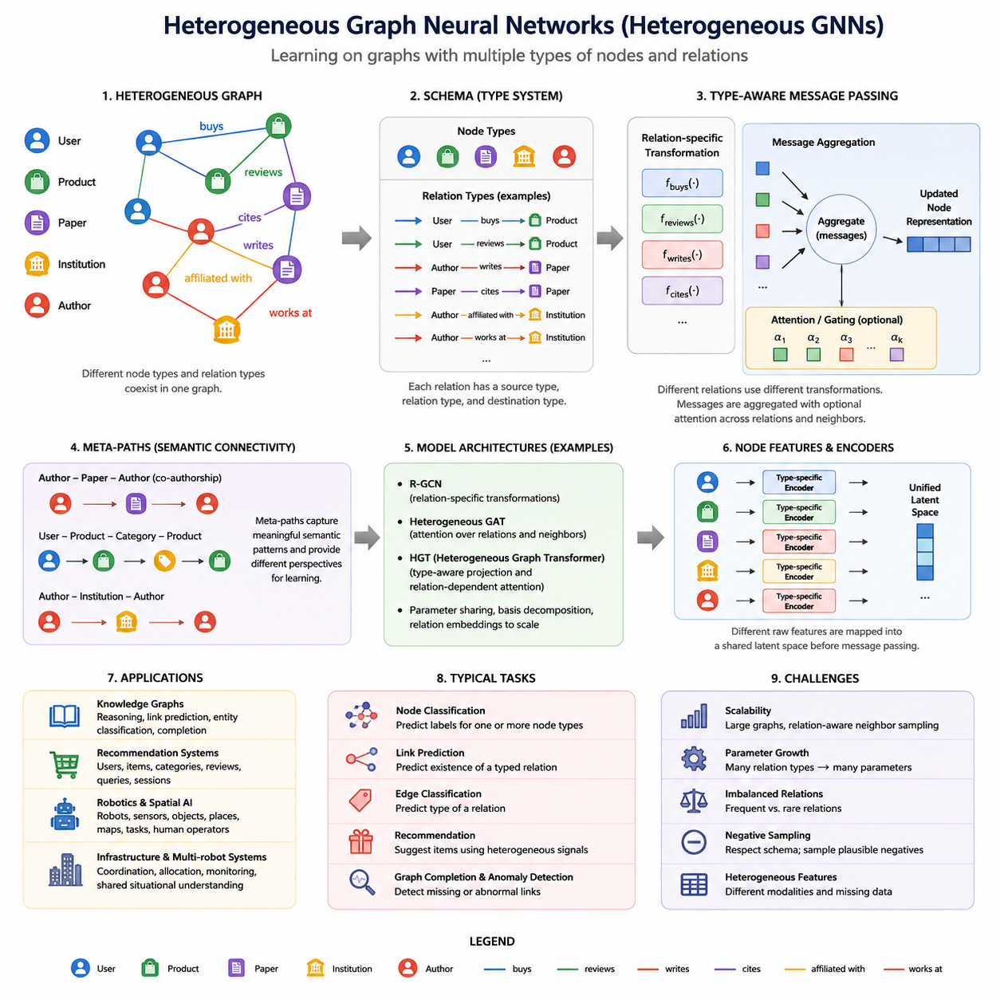
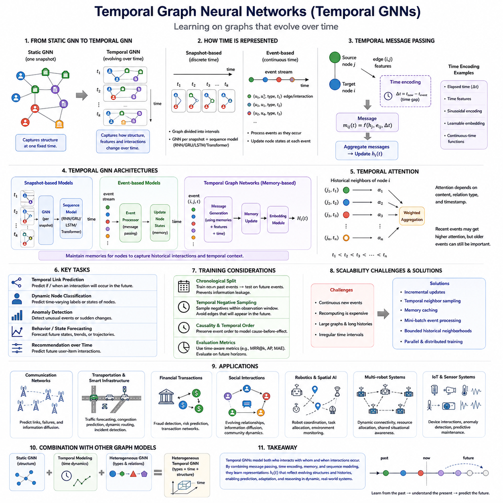
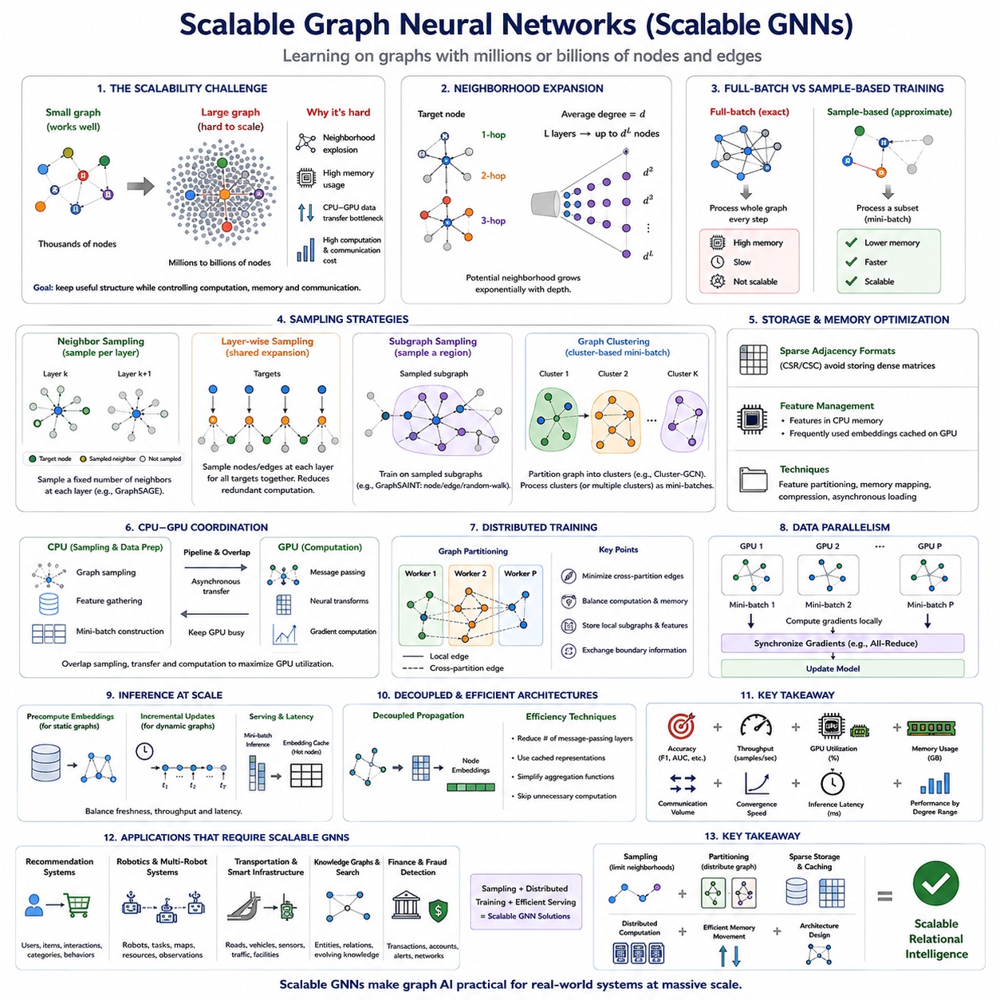
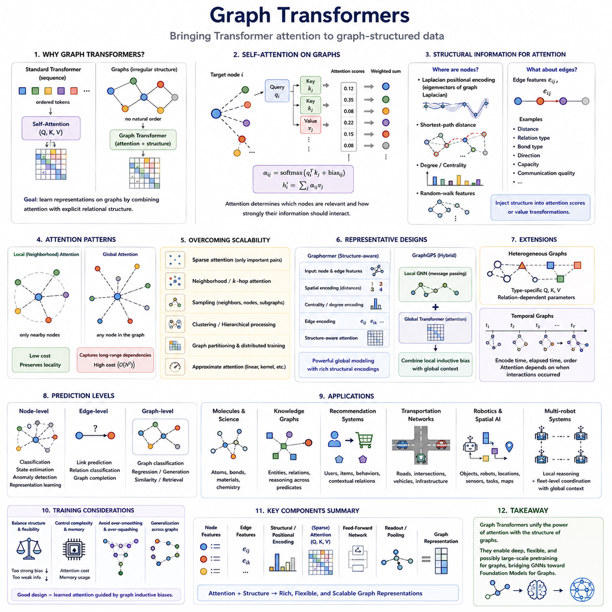
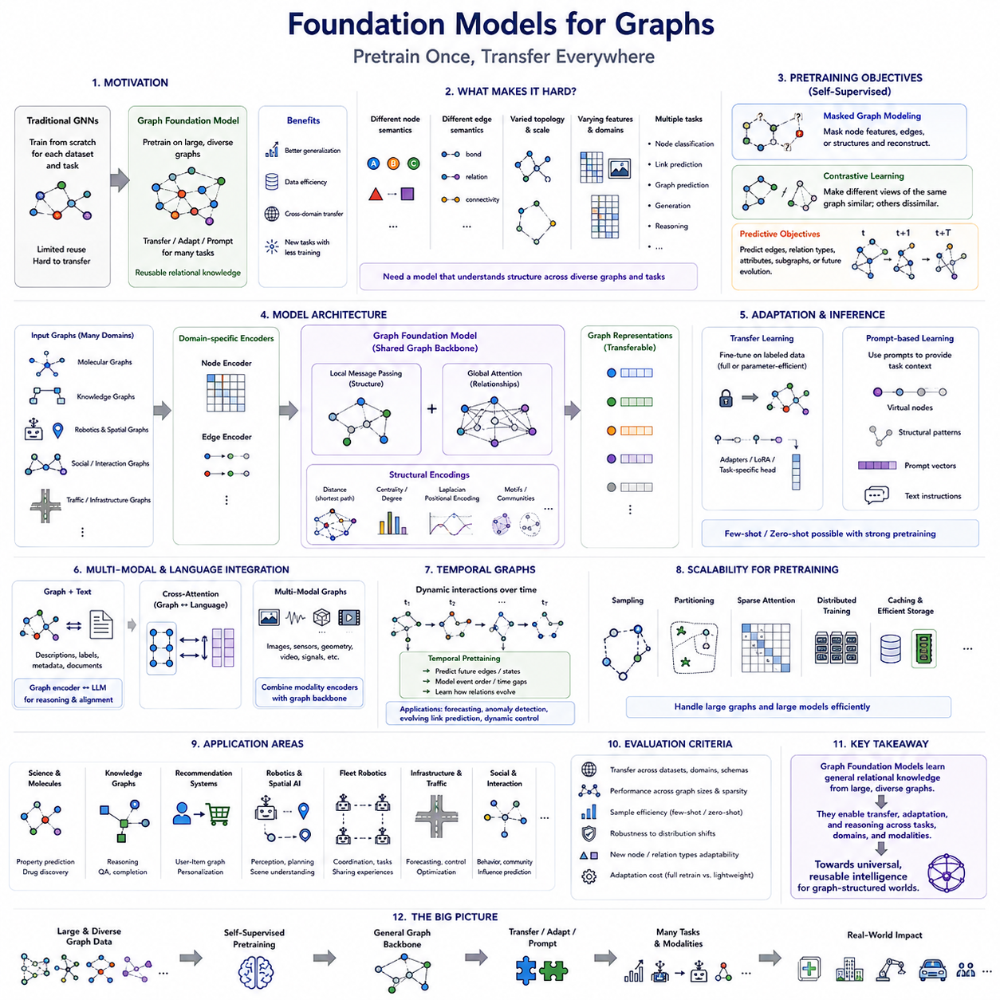
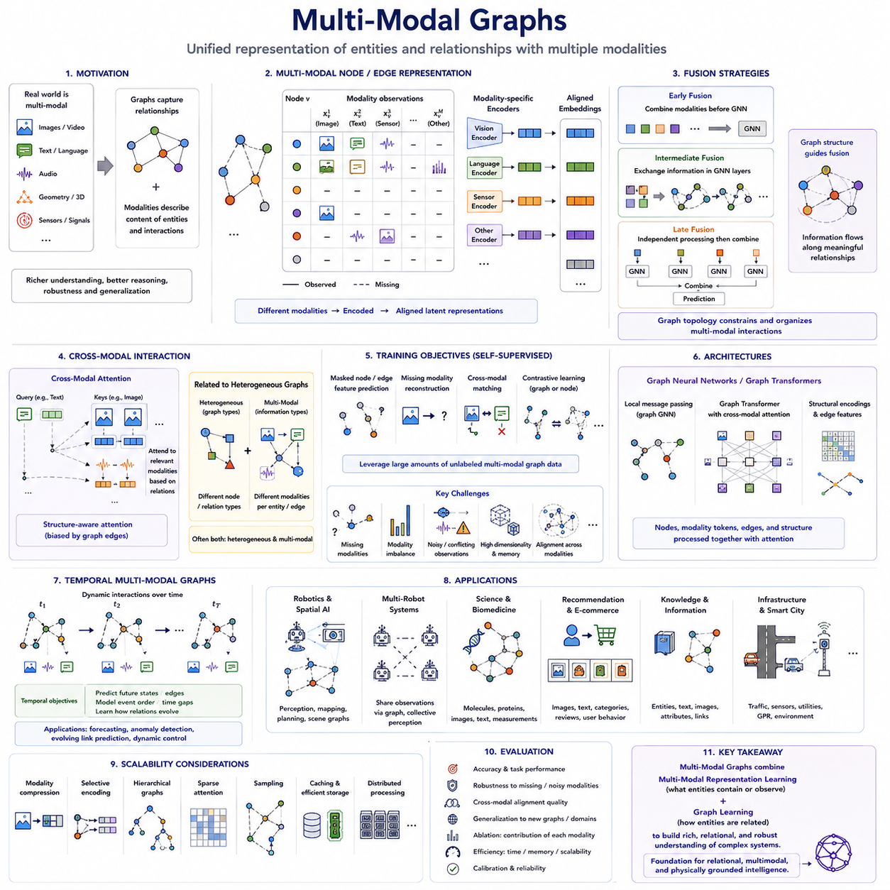

**Volume 29. Graph Deep Learning**

# Chapter 07. Advanced Graph AI

## 07.01. Heterogeneous GNN

{width="7.268055555555556in" height="7.268055555555556in"}

Heterogeneous Graph Neural Networks extend conventional GNNs to graphs containing multiple types of nodes and relationships. Instead of assuming that every vertex and edge has the same semantic meaning, a heterogeneous GNN explicitly represents different entity categories and relation categories. This structure is important when real systems naturally contain interacting objects with distinct roles, attributes, and behaviors.

A heterogeneous graph can be described as a graph in which nodes and edges are associated with type mappings. A node may represent a person, product, document, sensor, robot, road segment, or organization, while edges may represent relations such as purchases, cites, detects, controls, communicates with, or belongs to. The resulting topology therefore represents both connectivity and semantic structure.

This differs fundamentally from a homogeneous graph. In a conventional GCN or GAT, neighboring nodes are usually processed using a shared transformation because their connections are treated as instances of the same general relation. In a heterogeneous graph, a message arriving through a "purchases" relation may have a completely different meaning from a message arriving through a "reviews" or "manufactured-by" relation.

A useful formal representation introduces a node-type mapping φ(v) and an edge-type mapping ψ(e). These mappings associate every node with a node type and every edge with a relation type. The combination of source-node type, relation type, and destination-node type forms a semantic relation pattern often called a canonical edge type, such as User--buys--Product or Sensor--observes--Object.

The central challenge for a heterogeneous GNN is therefore type-aware message passing. Instead of applying one transformation matrix to all incoming information, the model can learn different transformations for different relations. Messages generated by relation r can be expressed conceptually as mᵣ = fᵣ(h_source), where fᵣ is a relation-specific transformation and h_source is the representation of the neighboring source node.

After relation-specific messages have been produced, they must be aggregated into a destination representation. Aggregation may occur in two stages: information is first combined within each relation type and then combined across relations. Sum, mean, attention, or learned gating can perform this operation. The network consequently learns not only which neighboring nodes matter, but also which categories of relationships are important.

Attention mechanisms are especially useful in heterogeneous graphs because different relations rarely contribute equally. For example, when predicting a researcher\'s topic, authorship relations may be more informative than institutional relationships. A heterogeneous attention mechanism can learn importance at the neighbor level, relation level, or both, allowing contextual weighting of structurally and semantically different evidence.

Models such as Relational Graph Convolutional Networks provide an important foundation for this idea. R-GCN assigns relation-dependent transformations during neighborhood aggregation, making it suitable for knowledge graphs and multi-relational networks. Because a large number of relation types can produce too many parameters, techniques such as basis decomposition or block decomposition can share statistical structure among relations.

Heterogeneous Graph Attention Networks extend this principle by learning hierarchical attention across different semantic structures. Rather than simply treating every edge type independently, the model can construct meaningful semantic paths connecting entity types. Such paths, often represented as meta-paths, describe patterns such as Author--Paper--Author or User--Item--Category and encode domain-specific relational meaning.

Meta-paths provide an important bridge between graph topology and semantic reasoning. A direct connection alone indicates that two entities interact, whereas a meta-path describes how they are related through a sequence of typed entities and relations. Different meta-paths therefore correspond to different semantic perspectives, and attention can determine which perspectives are most useful for a particular prediction task.

More recent heterogeneous GNN architectures reduce dependence on manually specified meta-paths. Heterogeneous Graph Transformers, for example, introduce type-aware projection, relation-dependent attention, and relation-specific message transformations within a Transformer-like architecture. This allows the model to discover useful interaction patterns directly while retaining explicit information about node and edge types.

The representation space itself requires careful design because different node types often have incompatible raw features. A document may contain textual embeddings, a user may contain demographic or behavioral attributes, and a sensor may contain numerical measurements. Type-specific encoders can first project these heterogeneous inputs into compatible latent spaces before relational message passing integrates them into contextual representations.

Training objectives depend on the intended graph task. Node classification may predict categories for one or several node types, while link prediction estimates whether a particular typed relationship should exist between entities. Edge classification, recommendation, graph completion, anomaly detection, and representation learning can similarly be formulated while preserving the semantic constraints imposed by node and relation types.

Negative sampling becomes particularly important for heterogeneous link prediction. Randomly connecting arbitrary nodes can generate meaningless negatives because many node-type combinations are structurally impossible. Effective training therefore respects the graph schema, sampling candidate negative edges from source and destination types that are valid for the relation being predicted while distinguishing plausible missing links from observed links.

Heterogeneous graphs also introduce scalability challenges. Real knowledge graphs, recommender systems, communication networks, and industrial systems may contain millions or billions of typed edges. Neighbor sampling must therefore consider relation distributions as well as graph size. Excessive sampling from frequent relation types can suppress rare but informative relations, while uniform sampling can waste computation on less relevant neighborhoods.

Another challenge is parameter growth. Assigning independent neural transformations to every node and relation type becomes expensive when the schema is large. Parameter sharing, relation embeddings, low-rank decomposition, grouped transformations, and shared attention mechanisms can reduce this cost. These methods seek a balance between semantic specialization and statistical sharing across structurally related interactions.

Heterogeneous GNNs are especially natural for knowledge graphs because knowledge is inherently multi-relational. Entities belong to different conceptual classes, and predicates define distinct relationships among them. Combining graph embeddings with type-aware message passing allows local entity attributes, neighborhood evidence, and relational semantics to interact, supporting entity classification, link prediction, graph completion, and neural reasoning.

Recommendation systems provide another important application. Users, products, brands, categories, reviews, queries, and sessions can all be represented as different node types. Interactions such as viewing, purchasing, rating, searching, and belonging-to become distinct edge types. A heterogeneous GNN can integrate these signals rather than compressing every interaction into a single user--item matrix.

In robotics and spatial AI, heterogeneous graphs can represent robots, sensors, objects, places, map elements, tasks, and human operators within one relational structure. Relations may describe spatial proximity, visibility, communication, ownership, navigation connectivity, or control dependencies. Type-aware message passing can therefore combine geometric, semantic, operational, and relational information without pretending that all entities are interchangeable.

For multi-robot or infrastructure systems, the graph can expand further to include robots, charging stations, elevators, doors, road segments, traffic signals, servers, and tasks. Heterogeneous graph reasoning can propagate information across these different operational entities while preserving their functional roles. This creates a relational representation suitable for coordination, allocation, prediction, monitoring, and shared situational understanding.

Temporal evolution adds another dimension. A heterogeneous graph may change as entities appear, disappear, move, communicate, or change state. Although heterogeneous GNNs primarily address diversity of entity and relation types, combining them with temporal modeling creates heterogeneous temporal graphs. This naturally connects the present topic with Temporal GNNs, the next major advanced Graph AI direction in the volume structure.

The broader importance of heterogeneous GNNs is that they move Graph AI from learning over generic connectivity toward learning over structured systems of entities and relations. Their representations encode not merely who is connected to whom, but what each entity is, what each connection means, and how different semantic interactions jointly influence the system. This makes them a fundamental architecture for advanced relational intelligence.

## 07.02. Temporal GNN

{width="7.268055555555556in" height="7.268055555555556in"}

Temporal Graph Neural Networks extend graph learning from static relational structures to systems whose nodes, edges, features, and interactions evolve over time. A conventional GNN processes a graph as if its topology represents one fixed state, while a Temporal GNN models both relational structure and temporal evolution. This capability is essential for dynamic environments such as communication networks, transportation systems, financial transactions, social interactions, and robotics.

A temporal graph can be represented as a sequence of graph snapshots or as a continuous stream of timestamped events. In snapshot-based representations, the graph is divided into discrete intervals G₁, G₂, \..., Gₜ, with each snapshot describing the system during a particular period. Continuous-time representations instead record individual events such as an edge creation, message transmission, transaction, sensor observation, or node-state update at its exact timestamp.

The distinction between static and temporal graphs changes the meaning of neighborhood information. In a static graph, two connected nodes are simply treated as neighbors, but in a temporal graph their interaction may have occurred seconds, hours, or months apart. Consequently, the relevance of a neighboring node depends not only on its features and relationship type but also on when the interaction occurred and how the system has changed since then.

Temporal GNNs therefore combine structural message passing with mechanisms for representing time. A message from node j to node i may conceptually depend on the source representation hⱼ, edge information eᵢⱼ, and a temporal encoding of the elapsed time Δt. The resulting message can be expressed as mᵢⱼ(t)=f(hⱼ,eᵢⱼ,Δt), allowing the network to distinguish recent interactions from older observations.

Time information can be encoded in several ways. Simple approaches use normalized timestamps or elapsed-time values, while more expressive models employ sinusoidal encodings, learnable time embeddings, or continuous-time functions. These representations transform temporal distance into features that neural networks can process, enabling the model to learn periodic behavior, recency effects, long-term dependencies, and irregular temporal patterns.

One major family of Temporal GNNs uses discrete graph snapshots. A GNN first extracts structural representations from each snapshot, and a sequential model such as an RNN, GRU, LSTM, or Transformer then captures changes across snapshots. This architecture separates spatial or relational reasoning from temporal reasoning and is particularly useful when data naturally arrives at regular intervals such as seconds, minutes, hours, or days.

Another family operates directly on continuous temporal events. Instead of repeatedly reconstructing complete graph snapshots, these models update node representations whenever an interaction occurs. Event-driven processing is efficient for sparse dynamic systems because computation focuses on meaningful changes. It also preserves precise temporal ordering, which can be lost when many events are grouped into coarse snapshots.

Temporal Graph Networks introduce memory as a central component of dynamic graph learning. Each node can maintain a memory state summarizing relevant historical interactions. When a new event occurs, messages are generated from the interacting entities, timestamps, and current memories. An update function then modifies the memory, while an embedding module combines stored history with the current graph neighborhood to produce a time-dependent node representation.

Memory provides an important distinction between current features and accumulated history. Two nodes may have identical observable features at the present moment but very different interaction histories. Their internal temporal states can therefore differ substantially. This enables a Temporal GNN to represent path-dependent systems in which future behavior depends not only on the current configuration but also on the sequence of events that produced it.

Attention mechanisms provide another powerful method for temporal reasoning. Temporal attention can assign different importance to historical neighbors according to their content, relation, and timestamp. Recent interactions may receive high attention when short-term behavior dominates, while older interactions can remain important when they reveal persistent relationships. The model learns these dependencies rather than relying exclusively on a fixed temporal decay rule.

Models such as Temporal Graph Attention Networks and Temporal Graph Networks demonstrate how attention, memory, message passing, and time encoding can be combined. Other approaches evolve graph convolution parameters over time or use recurrent mechanisms to update node states. Despite architectural differences, the common objective is to learn representations hᵢ(t) whose meaning depends on both graph structure and temporal context.

Temporal link prediction is one of the most important tasks in this field. Instead of asking whether two nodes are generally connected, the model predicts whether a specific interaction is likely to occur at a future time. Examples include predicting a future transaction, communication event, user-item interaction, vehicle encounter, or robot-resource relationship. Temporal ordering must be preserved carefully to prevent future information from leaking into training.

Dynamic node classification predicts labels or states that change over time. A node representing a machine may transition from normal operation to degraded performance, while a road segment may change from free-flowing to congested. Temporal node embeddings provide representations that reflect both current observations and historical context, making them suitable for state estimation, anomaly detection, risk prediction, and behavior forecasting.

Temporal graph learning also introduces unique data-splitting requirements. Randomly dividing edges into training and test sets can create unrealistic evaluation because future events may indirectly influence representations used to predict the past. Temporal datasets are therefore commonly divided chronologically, with models trained on earlier interactions and evaluated on later events. This better reflects real deployment where future observations are unavailable during prediction.

Negative sampling must also respect time. A node pair that is disconnected at one moment may become connected later, meaning that a supposedly negative example can represent a valid future interaction. Temporal negative sampling therefore requires careful definition of observation windows and prediction horizons. The objective is to distinguish events that do not occur within the relevant period rather than treating all currently absent edges as permanently negative.

Scalability becomes particularly challenging because dynamic graphs continuously generate new events. Recomputing embeddings for the entire graph after every interaction would be prohibitively expensive. Incremental updates, temporal neighbor sampling, memory caching, mini-batch event processing, and bounded historical neighborhoods reduce this cost. Efficient implementations attempt to update only the representations affected by newly arriving information.

Temporal GNNs are highly relevant to transportation and smart infrastructure. Roads, intersections, vehicles, traffic signals, and transportation facilities form a graph whose states continuously change. Traffic density, travel time, incidents, and connectivity conditions evolve over time. Temporal graph models can combine spatial relationships with historical observations to support traffic forecasting, congestion prediction, infrastructure monitoring, and dynamic routing.

In robotics and Spatial AI, temporal graphs provide a natural representation for environments that change as robots move and interact. Nodes may represent robots, objects, locations, sensors, tasks, or infrastructure, while timestamped edges describe observations, communication, proximity, navigation, or task assignments. The graph consequently becomes a continuously evolving relational memory rather than a static representation of the environment.

Multi-robot systems provide an especially important example. Robots may enter or leave communication range, tasks may be reassigned, charging stations may become occupied, and traversability conditions may change. A Temporal GNN can propagate these changes through the relational structure while maintaining historical context, supporting coordination, resource allocation, congestion prediction, shared situational awareness, and fleet-level decision support.

Temporal graphs can also be combined with heterogeneous graphs. In a heterogeneous temporal graph, both entity types and relation types are preserved while their interactions evolve over time. A robot, sensor, object, charging station, map region, and task can therefore retain distinct semantic identities while participating in timestamped relationships. This combines type-aware relational intelligence with dynamic state modeling.

An important conceptual distinction exists between Temporal GNNs and general sequence models. An LSTM or Transformer can model how a vector sequence changes over time, but it does not inherently represent changing relationships among many interacting entities. A Temporal GNN explicitly models both dimensions: graph structure describes who interacts with whom, while temporal mechanisms describe when interactions occur and how their consequences persist.

This combination makes Temporal GNNs suitable for systems where intelligence depends on understanding evolving relationships rather than isolated observations. They transform graphs from static relational maps into dynamic computational representations of interacting entities and their histories. Within advanced Graph AI, they provide the temporal dimension required to move from structural understanding toward prediction, adaptation, and reasoning over continuously changing systems.

## 07.03. Scalable GNN

{width="7.268055555555556in" height="7.268055555555556in"}

Scalable Graph Neural Networks address the challenge of applying graph learning to datasets containing millions or billions of nodes and edges. Conventional GNN computation repeatedly aggregates information from neighboring nodes, which works well for small graphs but becomes expensive as graph size and connectivity increase. Scalability therefore requires redesigning data access, message passing, memory management, training, and distributed execution without losing essential graph structure.

The fundamental scalability problem originates from neighborhood expansion. In a multi-layer GNN, each node aggregates information from its neighbors, those neighbors depend on their own neighbors, and the receptive field grows rapidly with network depth. If the average node degree is d, an L-layer model may potentially access a neighborhood approaching dᴸ nodes, producing a phenomenon commonly called neighborhood explosion.

Full-batch training processes the complete graph during every optimization step. This approach provides exact neighborhood aggregation and is practical for relatively small graphs, but large adjacency structures, node features, intermediate embeddings, and gradients can exceed GPU memory. Even when the graph fits in host memory, repeatedly transferring graph data between CPU and GPU can become a dominant performance bottleneck.

Neighbor sampling provides one of the most widely used solutions. Instead of collecting every neighbor of a target node, the training pipeline samples a limited number at each GNN layer. GraphSAGE popularized this approach by constructing bounded computational neighborhoods for mini-batch learning. Sampling converts potentially enormous receptive fields into manageable computation graphs whose memory and processing requirements can be controlled.

Layer-wise sampling offers another strategy by selecting nodes or edges for each layer rather than independently expanding neighborhoods from every target node. This can reduce duplicated computation because neighboring target nodes frequently share intermediate vertices. Methods based on importance sampling can further prioritize structurally or statistically informative nodes, improving the tradeoff between computational efficiency and approximation quality.

Subgraph sampling changes the unit of computation from individual target neighborhoods to sampled graph regions. A training iteration selects a subgraph and performs ordinary message passing inside that region. Approaches such as GraphSAINT sample nodes, edges, or random-walk subgraphs, while cluster-based methods partition the original graph into densely connected regions that can be processed as mini-batches.

Graph clustering is particularly effective when the original network contains strong community structure. Cluster-GCN partitions the graph so that many important edges remain inside individual clusters, reducing communication outside each training batch. Multiple clusters can also be combined to improve connectivity. The central objective is to preserve useful local graph structure while limiting the amount of graph data processed simultaneously.

Sampling introduces approximation error because only part of the original neighborhood contributes to each update. Small samples improve speed and memory efficiency but may omit important relational information, while large samples approach full-neighborhood computation at greater cost. Sampling strategy therefore becomes an important model-design parameter involving accuracy, variance, computation, memory, and graph connectivity.

Scalability is not determined only by the number of nodes. Edge density, degree distribution, feature dimensionality, relation diversity, and graph dynamics can dramatically change computational requirements. Graphs with hub nodes are particularly challenging because a small number of highly connected vertices may generate enormous neighborhoods. Degree-aware sampling and specialized handling of high-degree nodes can prevent these hubs from dominating computation.

Large-scale GNN systems also depend heavily on efficient graph storage. Sparse adjacency formats such as compressed sparse row representations avoid storing enormous dense adjacency matrices. Node features may remain in CPU memory while frequently accessed embeddings are cached on GPUs. Feature partitioning, memory mapping, compression, and asynchronous data loading can further reduce the cost of moving graph information through the training pipeline.

CPU-GPU coordination becomes critical because graph sampling is often irregular and memory intensive, while neural transformations are well suited to GPU computation. If the GPU waits for the CPU to construct every mini-batch, accelerator utilization falls significantly. High-performance systems therefore overlap sampling, feature gathering, memory transfer, and GPU execution through pipelining and asynchronous processing.

When a graph exceeds the capacity of a single machine, distributed graph training becomes necessary. The graph is partitioned across multiple workers, each storing subsets of nodes, edges, and features. Local message passing can be performed efficiently, but edges crossing partition boundaries require communication between machines. Effective partitioning therefore attempts to minimize cross-partition traffic while balancing computational workloads.

Distributed execution introduces a tension between computation and communication. Increasing the number of GPUs or machines provides additional processing capacity, but graph dependencies require workers to exchange node features, embeddings, or gradients. Poor partitioning can make communication more expensive than neural computation itself. Scalability consequently depends on topology-aware partitioning, caching, communication scheduling, and efficient collective operations.

Data parallelism can replicate the GNN model across workers while assigning different graph mini-batches to each device. Gradients are synchronized during optimization, similarly to conventional distributed deep learning. Graph workloads, however, add irregular data dependencies because different mini-batches may access overlapping remote nodes. Distributed sampling and feature retrieval must therefore be coordinated with gradient synchronization.

Graph partitioning can also support model execution by assigning graph regions according to locality. Frequently interacting nodes should ideally remain on the same worker, reducing remote feature requests. Balanced partitions must simultaneously consider node counts, edge counts, computational complexity, and memory requirements. For heterogeneous graphs, partitioning may additionally need to preserve distributions of node and relation types.

Inference presents scalability challenges different from training. Large production graphs may receive continuous prediction requests while node features and edges change. Precomputing embeddings can reduce latency for relatively stable graphs, whereas dynamic systems may require incremental updates. Mini-batch inference, embedding caches, distributed serving, and selective recomputation allow large GNN services to balance freshness, throughput, and latency.

Decoupled GNN architectures provide another route to scalability. Some methods separate graph propagation from neural feature transformation, allowing expensive neighborhood aggregation to be precomputed or simplified. Other architectures reduce the number of message-passing layers or replace repeated propagation with cached representations. These designs sacrifice some tightly coupled graph computation in exchange for substantially improved efficiency.

Large graphs also create optimization difficulties. Sampling can increase gradient variance, partitions may introduce structural bias, and rare nodes or relations may receive insufficient updates. Evaluation must therefore measure not only predictive accuracy but also training throughput, GPU utilization, memory consumption, communication volume, convergence speed, inference latency, and performance across different node-degree ranges.

Temporal and heterogeneous graphs make scalability even more demanding. Temporal GNNs must retrieve historical neighbors and maintain evolving memories, while heterogeneous GNNs require type-aware sampling and relation-specific computation. A scalable architecture may therefore need to constrain both temporal history and relation-specific neighborhoods while preserving the information most relevant to prediction.

In recommendation systems, scalable GNNs can operate over enormous graphs containing users, products, interactions, categories, and behavioral events. Sampling limits the number of historical interactions processed for each user, while distributed embedding tables store large entity representations. Efficient retrieval and caching allow relational recommendation models to operate without loading the complete interaction graph onto one accelerator.

Robotics, transportation, and smart infrastructure introduce a different form of scale. Graph size may grow across robots, map regions, roads, sensors, tasks, facilities, and accumulated historical observations. Not every relationship needs to be processed at every control cycle. Local subgraphs, hierarchical representations, temporal windows, and selective message passing can focus computation on entities relevant to the current operational context.

For fleet-scale robotics, this principle is particularly important. Individual robots may reason over compact local graphs, while edge or on-premise systems integrate information across larger site or fleet graphs. Hierarchical graph processing prevents every robot from exchanging every observation with every other robot. Relational information can instead be aggregated at appropriate spatial, temporal, and organizational scales.

Scalable GNN design is therefore not a single algorithm but a systems-level combination of sampling, partitioning, sparse storage, caching, distributed computation, efficient memory movement, and architecture selection. The objective is to preserve useful relational reasoning while controlling computational growth. This perspective naturally connects advanced Graph AI with the engineering and deployment topics that later address sampling methods, distributed training, GPU optimization, and real-time graph processing.

## 07.04. Graph Transformers

{width="7.268055555555556in" height="7.268055555555556in"}

Graph Transformers extend the Transformer architecture to graph-structured data by combining attention-based representation learning with explicit relational structure. Standard Transformers operate on ordered token sequences, whereas graphs contain irregular neighborhoods, arbitrary connectivity, and no universal node ordering. A Graph Transformer must therefore determine how attention should incorporate nodes, edges, topology, and structural relationships while preserving permutation-aware graph processing.

The central idea is to replace or augment conventional neighborhood aggregation with self-attention. In a traditional GNN, a node receives messages primarily from directly connected neighbors. In a Graph Transformer, attention can determine which nodes are relevant to each other and how strongly their information should interact. This creates a flexible mechanism for learning relational dependencies rather than relying entirely on predetermined aggregation functions.

Standard self-attention computes relationships among queries, keys, and values. For node i, its representation produces a query qᵢ, while other nodes produce keys kⱼ and values vⱼ. Attention scores measure compatibility between qᵢ and kⱼ, and normalized scores determine how values are aggregated. Graph Transformers preserve this principle but modify attention using graph topology, edge features, positional information, or structural encodings.

A fundamental challenge is that graphs do not naturally contain the positional ordering available in text. In language models, token positions distinguish the first word from the tenth word, but node indices in a graph are usually arbitrary. Graph Transformers therefore require structural or positional encodings that describe where nodes are located relative to the graph topology rather than relying on absolute sequence positions.

Laplacian positional encoding is one approach to this problem. Eigenvectors derived from the graph Laplacian provide coordinates reflecting global structural patterns of the graph. These vectors can be added to or concatenated with node features, giving the Transformer information about graph position. However, eigenvector ambiguity, computational cost, and scalability must be considered when applying this technique to large graphs.

Other structural encodings use shortest-path distance, random-walk statistics, node degree, centrality, or local subgraph properties. Shortest-path encodings allow attention to distinguish nodes separated by one hop from nodes several hops away. Degree information describes local connectivity, while random-walk features capture diffusion behavior. These signals provide structural context that ordinary Transformer attention would otherwise lack.

Edge information is another important component. In conventional Transformers, relationships between tokens are usually inferred from their representations and positions. Graphs may provide explicit edge attributes describing distance, relation type, bond type, communication quality, direction, capacity, or other domain-specific properties. Graph Transformers can inject these edge features directly into attention scores or value transformations.

Attention can be restricted to local graph neighborhoods or applied globally. Local attention resembles message passing because each node attends only to adjacent or nearby nodes, reducing computational cost and preserving graph locality. Global attention allows any node to interact with any other node, potentially capturing long-range dependencies that conventional shallow GNNs may struggle to represent.

Global attention, however, introduces a major scalability problem. Standard self-attention over N nodes has approximately quadratic interaction complexity because every node may attend to every other node. Large graphs can therefore make unrestricted global attention prohibitively expensive. Sparse attention, neighborhood attention, hierarchical processing, graph partitioning, sampling, and approximate attention mechanisms are commonly used to control this computational growth.

The ability to model long-range relationships is one of the main motivations for Graph Transformers. Conventional message-passing GNNs require multiple layers to propagate information across distant regions of a graph. Deep propagation can produce over-smoothing or over-squashing, where information becomes indistinguishable or compressed through narrow graph bottlenecks. Attention can create more direct information pathways between distant but relevant nodes.

Graphormer illustrates an influential design in which structural information is integrated directly into Transformer attention. Spatial encodings represent graph distances, centrality encodings describe node importance or degree-related properties, and edge encodings provide information about relationships along graph paths. This demonstrates that successful Graph Transformers generally require more than applying a standard Transformer directly to an unordered set of nodes.

GraphGPS represents another important architectural direction by combining local message passing with global attention. A local GNN component captures neighborhood structure efficiently, while a Transformer component models broader graph-level dependencies. This hybrid design recognizes that local relational inductive bias and global information exchange provide complementary advantages rather than requiring one mechanism to completely replace the other.

Graph Transformers can also support heterogeneous graphs by making attention dependent on node and relation types. Type-specific query, key, and value projections allow different categories of entities to participate differently in attention. Relation-dependent parameters can further modify interactions between source and destination types. Heterogeneous Graph Transformers therefore combine semantic typing with flexible attention-based relational learning.

Temporal information can similarly be incorporated into graph attention. A temporal Graph Transformer may encode timestamps, elapsed time, event order, or historical interaction patterns together with structural information. Attention then depends not only on which nodes are related but also on when their interactions occurred. This provides a bridge between Graph Transformers and Temporal GNNs for modeling dynamic relational systems.

Graph-level prediction requires converting many node representations into a unified representation. Pooling, special graph tokens, attention-based readout, or hierarchical aggregation can summarize node information after Transformer processing. The resulting graph embedding can support classification, regression, generation, similarity estimation, or other tasks where the prediction concerns an entire molecule, scene, network, or relational system.

At the node level, Graph Transformers can perform classification, state estimation, anomaly detection, and representation learning. At the edge level, they can support link prediction, relation classification, and graph completion. Their flexible attention mechanism also makes them suitable for graph generation and reasoning tasks where relationships among multiple entities must be jointly considered rather than processed through strictly local propagation.

Molecular and scientific graphs are major application areas because interactions between atoms or components may depend on both local bonds and broader structural context. Knowledge graphs can use relation-aware attention to reason across entities and predicates. Recommendation systems can integrate users, items, behaviors, and contextual relationships, while transportation graphs can model interactions among roads, intersections, vehicles, and infrastructure.

In robotics and Spatial AI, Graph Transformers can represent objects, robots, locations, sensors, tasks, and map elements as interacting entities. Local edges can encode physical proximity, visibility, or navigation connectivity, while broader attention can capture task-level or scene-level dependencies. This combination is useful when decisions depend simultaneously on immediate spatial relationships and distant contextual information.

Multi-robot systems further illustrate the value of combining local and global reasoning. Each robot primarily interacts with nearby obstacles, resources, and robots, but fleet-level coordination may depend on distant task assignments, congestion, charging availability, or shared objectives. Hierarchical or sparse Graph Transformers can preserve efficient local reasoning while selectively exchanging information across larger operational graphs.

Training Graph Transformers requires careful treatment of structural bias, computational complexity, and generalization. Excessively strong structural encodings can restrict the flexibility of attention, whereas insufficient graph information can make the model behave like a generic set Transformer. Effective architectures balance learned attention with graph-specific inductive biases so that topology guides learning without completely determining it.

Scalability remains one of the central engineering constraints. Efficient Graph Transformers increasingly combine sparse attention, sampling, clustering, distributed computation, memory-efficient kernels, and local-global architectures. These techniques connect directly with scalable GNN principles because large relational systems cannot afford unrestricted all-to-all attention across every node during every training or inference step.

Graph Transformers represent a broader convergence between graph learning and foundation-model architectures. They bring flexible attention, deep representation learning, and potentially large-scale pretraining into the graph domain while retaining relational structure as a fundamental source of information. This makes them an important bridge from specialized GNN architectures toward the next topic of foundation models for graphs, where transferable graph representations can be learned across datasets, domains, and tasks.

## 07.05. Foundation Models for Graphs

{width="7.268055555555556in" height="7.268055555555556in"}

Foundation Models for Graphs extend the foundation-model paradigm from language, vision, and multimodal data to graph-structured information. Instead of training a separate Graph Neural Network for every dataset and task, the objective is to pretrain a broadly capable graph model on large and diverse graph collections. The learned representations can then be transferred, adapted, or prompted for downstream tasks with substantially less task-specific training.

The motivation comes from a limitation of conventional graph learning. Many GNNs are trained for one graph, one domain, and one prediction objective, causing knowledge acquired from one dataset to remain difficult to reuse elsewhere. A Graph Foundation Model seeks reusable relational knowledge by learning patterns that appear across different graphs, including connectivity, communities, motifs, hierarchies, interactions, and structural roles.

Graphs present a more difficult foundation-model problem than ordinary token sequences because graph structures vary dramatically between domains. A molecular graph contains atoms and bonds, a knowledge graph contains entities and predicates, and a robotics graph may contain robots, objects, places, sensors, and tasks. A general model must therefore accommodate differences in node semantics, edge semantics, feature spaces, topology, scale, and prediction objectives.

Graph pretraining is the central mechanism for building such transferable representations. Large collections of graphs or large individual networks can provide self-supervised learning signals without requiring complete manual labels. The model learns useful structural and semantic representations during pretraining, after which downstream adaptation can specialize these representations for classification, link prediction, graph prediction, generation, reasoning, or control-related applications.

Masked graph modeling provides one important pretraining strategy. Selected node features, edge attributes, or structural elements are hidden, and the model attempts to reconstruct the missing information from surrounding context. This resembles masked language modeling but requires relational context rather than only sequential context. Successful reconstruction encourages the model to learn dependencies between entity attributes and graph structure.

Contrastive learning provides another major approach. Different augmented views of the same node, subgraph, or complete graph are encouraged to produce similar representations, while unrelated examples are separated in representation space. Graph augmentations may involve masking features, dropping edges, sampling subgraphs, or modifying topology, although augmentation must be carefully designed so that the semantic identity of the graph is not accidentally destroyed.

Predictive objectives can also train graph models to infer missing or future relational information. A model may predict whether an edge exists, identify its relation type, estimate attributes of neighboring nodes, reconstruct a subgraph, or predict how a graph evolves. Such objectives encourage representations to capture relational regularities rather than simply memorize node features and can naturally connect graph pretraining with link prediction and temporal graph learning.

Graph Transformers are especially important candidates for Graph Foundation Models because attention supports flexible interactions and large-scale pretraining. Structural encodings, edge representations, local message passing, and global attention can be integrated into Transformer architectures. This combination provides expressive relational modeling while connecting graph learning to optimization and scaling techniques developed for large Transformer-based models.

A major challenge is developing a common representation interface across graph domains. Text models operate with reusable token vocabularies, whereas graph nodes may represent entirely different concepts. Graph Foundation Models may therefore rely on domain-specific feature encoders followed by a shared graph backbone. The encoders translate raw node and edge information into a common latent representation that can be processed by transferable graph layers.

Structural information can provide another source of domain-independent knowledge. Concepts such as node degree, connectivity, shortest-path distance, motifs, communities, centrality, and diffusion patterns have meaning across many graph types even when node features differ. Pretraining on these structural properties can help a model learn general relational principles that transfer between domains with different semantic vocabularies.

Heterogeneous graphs make this problem more complex but also more powerful. A foundation model may need to process multiple node and relation types without assuming that every graph uses the same schema. Type embeddings, relation encoders, semantic adapters, and schema-aware attention can provide flexible interfaces. The objective is to preserve meaningful distinctions while allowing common relational patterns to be shared across different graph schemas.

Temporal graphs add the requirement to learn transferable patterns of relational change. Instead of understanding only static connectivity, a Graph Foundation Model may learn how interactions appear, disappear, strengthen, weaken, or propagate through time. Pretraining on temporal events can support forecasting, anomaly detection, dynamic link prediction, evolving state estimation, and other tasks where historical relational context is essential.

Scale is another defining requirement. Foundation models typically benefit from large datasets and high model capacity, but graph computation can already be expensive before model size is increased. Neighborhood explosion, irregular memory access, global attention complexity, and distributed graph communication therefore become critical. Sampling, partitioning, sparse attention, efficient graph storage, caching, and distributed training are necessary foundations for practical large-scale pretraining.

Transfer learning determines whether pretraining actually produces a useful foundation model. A pretrained graph encoder can be fine-tuned on labeled downstream data, while parameter-efficient approaches may update only adapters, selected layers, or small task-specific modules. When downstream data is limited, strong pretrained representations can reduce the amount of supervision required and improve adaptation compared with training an entire graph model from scratch.

Prompt-based graph learning attempts to extend the prompting paradigm to graph models. Instead of redesigning and fully retraining the network for each task, a graph prompt can provide task context through additional features, virtual nodes, structural patterns, learned prompt vectors, or textual instructions. The exact meaning of prompting in graphs is still evolving because graphs do not possess a universal interface comparable to natural-language tokens.

Zero-shot and few-shot graph learning represent ambitious goals for Graph Foundation Models. In few-shot settings, the model adapts to a new graph task using only a small number of labeled examples. Zero-shot learning attempts to solve previously unseen tasks or recognize unseen categories through transferable semantic and structural knowledge. Achieving this reliably requires alignment between graph representations, task descriptions, and potentially other modalities.

Language models provide an important path toward such alignment. Many real graphs contain textual information associated with nodes and edges, including descriptions, labels, documents, instructions, and metadata. Combining a graph encoder with a Large Language Model can connect structural relationships with semantic reasoning. The graph provides explicit relational grounding, while the language model provides broad conceptual knowledge and instruction-following capabilities.

Graph-language models can exchange information in several ways. Graph embeddings may be projected into the representation space of a language model, graph structures may be converted into structured textual descriptions, or specialized cross-attention modules may connect graph and language representations. The design challenge is to preserve graph topology rather than reducing every relational structure into a long and potentially ambiguous text sequence.

Multimodal Graph Foundation Models extend this idea further. Nodes may contain images, text, sensor measurements, geometry, video, or other modalities, while graph edges describe relationships among them. A unified model can combine modality-specific encoders with a relational backbone, allowing semantic content and structural context to influence one another. This is particularly relevant to embodied and physical systems.

In robotics and Spatial AI, a graph foundation model could learn reusable representations across robots, objects, places, maps, sensors, tasks, and interactions. Different environments would generate different graph instances, but recurring relational concepts such as proximity, reachability, visibility, ownership, task dependency, and resource competition could be shared. Pretraining across many environments could therefore provide reusable relational priors for new deployments.

Fleet robotics expands the concept from individual environments to collective experience. Graphs generated by many robots can contain repeated patterns involving navigation, congestion, charging, task allocation, failures, and human interaction. A sufficiently scalable graph model could learn from this accumulated relational experience and transfer knowledge to new robots or sites, connecting Graph Foundation Models with collective relational intelligence.

Evaluation must measure more than performance on a single benchmark. A genuine foundation model should demonstrate transfer across datasets, graph sizes, schemas, domains, and task types. Important questions include whether pretraining improves sample efficiency, whether representations remain useful under distribution shifts, whether new node or relation types can be accommodated, and whether adaptation requires full retraining or only limited parameter updates.

Graph Foundation Models remain an emerging research direction rather than a single standardized architecture. Their development requires combining advances from GNNs, Graph Transformers, heterogeneous and temporal graph learning, self-supervised learning, scalable training, multimodal models, and language models. The central goal is consistent: move from graph models specialized for individual tasks toward reusable relational models that can learn, transfer, adapt, and reason across many graph-structured environments.

## 07.06. Multi Modal Graphs

{width="7.268055555555556in" height="7.268055555555556in"}

Multi-Modal Graphs extend graph learning by allowing nodes, edges, and graph-level contexts to contain information from multiple modalities rather than a single feature space. Text, images, video, audio, geometry, sensor signals, and structured attributes can coexist within one relational representation. The graph supplies explicit relationships among entities, while modality-specific data describes what those entities contain, observe, or communicate.

The central motivation is that many real systems cannot be understood from one modality alone. A robot may observe an object through RGB images, depth, LiDAR, language labels, and physical measurements, while a social entity may contain text, images, profiles, and interaction histories. Representing these signals independently can lose relational context, whereas a multi-modal graph organizes both heterogeneous content and relationships in a unified computational structure.

A useful conceptual representation associates each node v with modality-dependent observations xᵥ¹, xᵥ², \..., xᵥᴹ. Different nodes do not necessarily contain every modality, and their feature dimensions may be incompatible. Modality-specific encoders therefore transform raw inputs into latent representations, such as a vision encoder for images, a language encoder for text, and specialized neural networks for audio, geometry, or sensor measurements.

After modality-specific encoding, the resulting representations must be aligned into spaces that permit meaningful interaction. Simple approaches concatenate or sum embeddings, while more sophisticated systems use learned projections, gating, attention, or cross-attention. The objective is not merely to place different modalities into vectors of equal size, but to ensure that semantically related observations produce compatible representations that can participate in graph reasoning.

Fusion can occur at several stages of the architecture. Early fusion combines modality features before graph message passing, allowing the GNN to propagate already-integrated node information. Intermediate fusion allows each modality to retain specialized representations before exchanging information through graph layers. Late fusion independently processes modalities and combines their predictions or embeddings near the output, providing greater modularity but weaker early interaction.

Graph structure itself acts as an important fusion mechanism. Instead of combining every modality with every other modality globally, relationships specify which information should interact. An image feature associated with an object can communicate with a text description of that object, while sensor measurements can propagate through spatial or physical edges. The topology therefore constrains multimodal integration according to meaningful relational structure.

Cross-modal attention provides a flexible mechanism for determining which modality should influence another. Queries derived from one modality can attend to keys and values from another, allowing text to retrieve relevant visual regions or sensor representations to emphasize corresponding geometric entities. When combined with graph topology, attention can be restricted or biased according to explicit relationships, producing structure-aware cross-modal reasoning.

Multi-modal graphs are closely related to heterogeneous graphs, but the concepts are not identical. Heterogeneous graphs emphasize different node and relation types, whereas multi-modal graphs emphasize different information modalities associated with entities and relationships. A system may be both heterogeneous and multimodal: a robot node, object node, and location node can have different semantic types while simultaneously containing vision, language, geometry, and sensor information.

Missing modalities are a fundamental practical challenge. A node may have an image but no text, a sensor may temporarily fail, or historical graph data may contain only partial measurements. Robust models must avoid assuming that every modality is always present. Masking, modality dropout, learned missing-modality embeddings, reconstruction objectives, and cross-modal prediction can help maintain useful representations when some inputs are unavailable.

Modality imbalance creates another difficulty because one information source can dominate training. High-dimensional visual embeddings may overwhelm compact numerical features, while abundant text may dominate sparse sensor observations. Normalization, modality-specific projections, attention, gating, loss balancing, and controlled sampling can prevent the model from simply relying on the easiest or most statistically dominant modality.

Self-supervised learning is particularly valuable because multimodal graphs naturally provide cross-modal supervision. A model can predict masked node attributes, reconstruct missing modalities, determine whether two observations correspond to the same entity, or contrast matched and mismatched graph contexts. These objectives allow large amounts of unlabeled relational data to train representations before task-specific supervision is introduced.

Contrastive learning can align representations from different modalities. An image of an object and its textual description can be encouraged to occupy nearby regions of latent space, while unrelated image-text pairs are separated. Graph structure adds additional positive signals because connected entities, shared neighborhoods, or corresponding subgraphs can define meaningful relationships beyond direct modality pairing.

Graph Transformers provide a natural architecture for multi-modal graphs because attention can operate across entities and modality representations. Node tokens, modality tokens, edge features, and structural encodings can be processed together while attention determines relevant interactions. Local graph attention preserves relational locality, whereas selective global attention can capture broader dependencies among distant entities or modalities.

Large Language Models can provide semantic reasoning over the textual components of multimodal graphs. Node descriptions, task instructions, object labels, documents, and metadata can be encoded by language models and connected to graph representations. Conversely, graph embeddings can provide relational grounding to an LLM, helping it reason about explicit connections that would otherwise need to be reconstructed from long textual descriptions.

Vision-language-graph integration extends this relationship further. Visual encoders identify objects, regions, scenes, or geometric features; language encoders represent descriptions and instructions; and the graph specifies relationships among them. The resulting system can reason about statements such as which object is beside another object, which region is reachable, or which entity satisfies a language-defined task condition.

Temporal information can also become another modality or structural dimension. Video frames, sensor streams, event histories, and changing relationships produce observations that evolve over time. Combining temporal modeling with multimodal graph reasoning enables the system to represent not only what different sensors currently observe, but how entities and their relationships have changed across previous observations.

Multi-modal graphs are especially relevant to scientific and biomedical applications. Molecular structures may combine graph connectivity with chemical descriptors, geometric coordinates, experimental measurements, images, and textual knowledge. Biomedical graphs may connect patients, genes, proteins, diseases, images, and clinical text. Relational fusion can reveal dependencies that are difficult to discover when each modality is analyzed independently.

Recommendation and knowledge systems also benefit from multimodal graph learning. Products can contain images, textual descriptions, categories, reviews, and interaction histories, while users provide behavioral signals and preferences. Knowledge entities may combine textual descriptions, images, structured attributes, and relational links. Graph learning allows content similarity and interaction structure to contribute jointly to predictions.

Robotics and Spatial AI provide one of the clearest examples of why multimodal graphs matter. A robot perceives the world through cameras, LiDAR, depth sensors, radar, IMUs, maps, language instructions, and internal state measurements. These signals refer to shared physical entities and locations. A graph can explicitly connect sensor observations to objects, places, robot states, tasks, and navigational relationships.

A spatial scene graph can therefore become a multimodal memory of the environment. An object node may contain a visual embedding, semantic label, 3D position, estimated velocity, uncertainty, and historical observations. Edges may describe proximity, visibility, support, containment, reachability, or motion relationships. Message passing integrates these signals while preserving the relational organization of the physical scene.

Multi-robot systems extend multimodal graphs across agents. Different robots may possess different sensors, viewpoints, compute capabilities, and observations of the same environment. Their local graphs can be aligned through shared objects, locations, maps, or tasks. Rather than transmitting every raw sensor stream, robots can exchange selected graph entities and embeddings, enabling more efficient collective perception and situational awareness.

Scalability becomes difficult as both graph size and modality size increase. Images, video, point clouds, and language embeddings can require substantially more memory than ordinary node attributes. Practical systems therefore need modality compression, selective encoding, hierarchical graphs, sparse attention, sampling, caching, and distributed processing. Expensive raw modalities may be encoded once and represented by compact features during repeated graph computation.

Evaluation should measure more than final prediction accuracy. A multimodal graph model should be tested under missing modalities, noisy sensors, conflicting observations, unseen graph structures, and distribution shifts. Cross-modal alignment quality, robustness, calibration, computational cost, and the contribution of each modality are important. Ablation studies can reveal whether the graph genuinely integrates modalities or merely depends on one dominant source.

Multi-Modal Graphs ultimately combine two complementary forms of intelligence: multimodal representation learning explains the content carried by different information channels, while graph learning explains relationships among entities. Their integration creates representations that connect what is observed with how observations are structurally related. This makes multimodal graphs a natural culmination of Advanced Graph AI and a foundation for relational, multimodal, and physically grounded intelligence.
