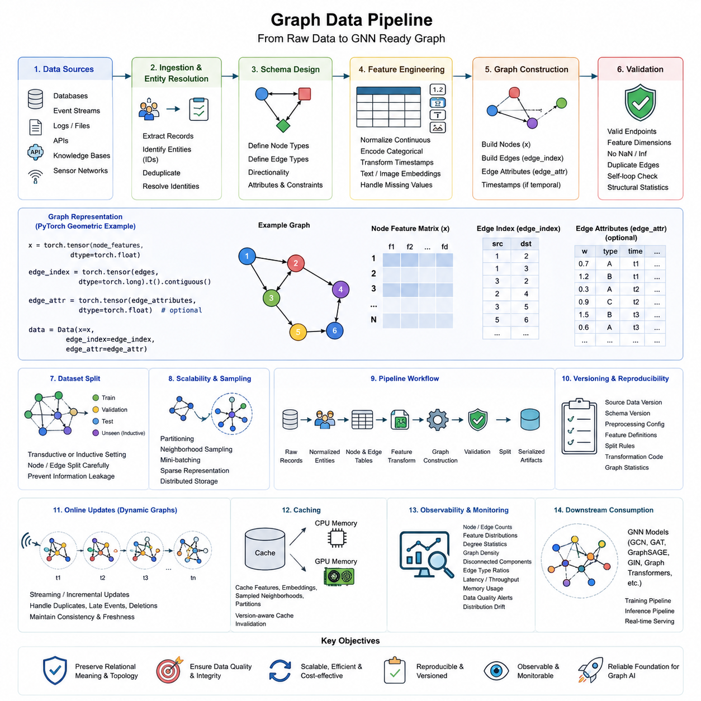
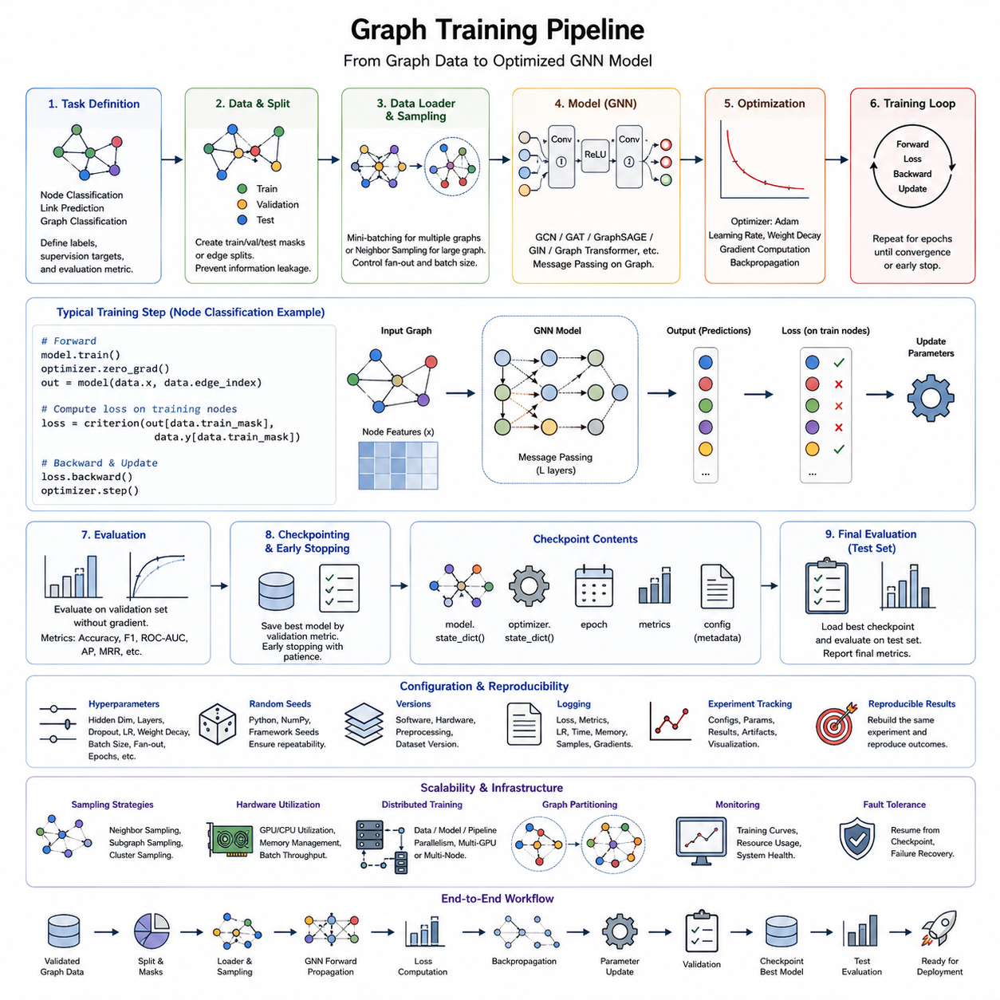
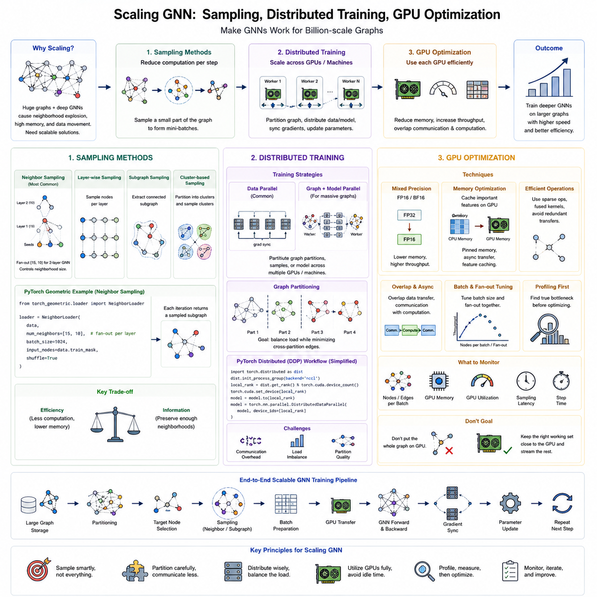
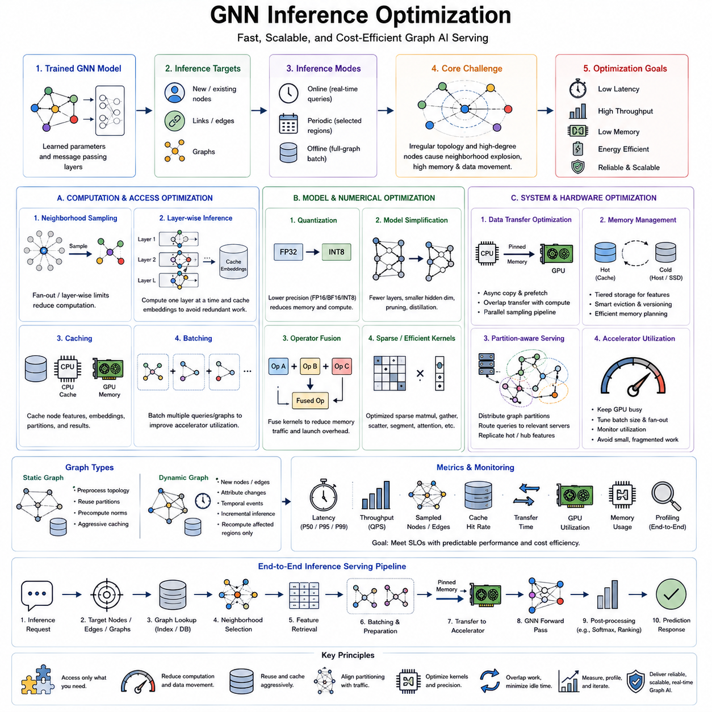
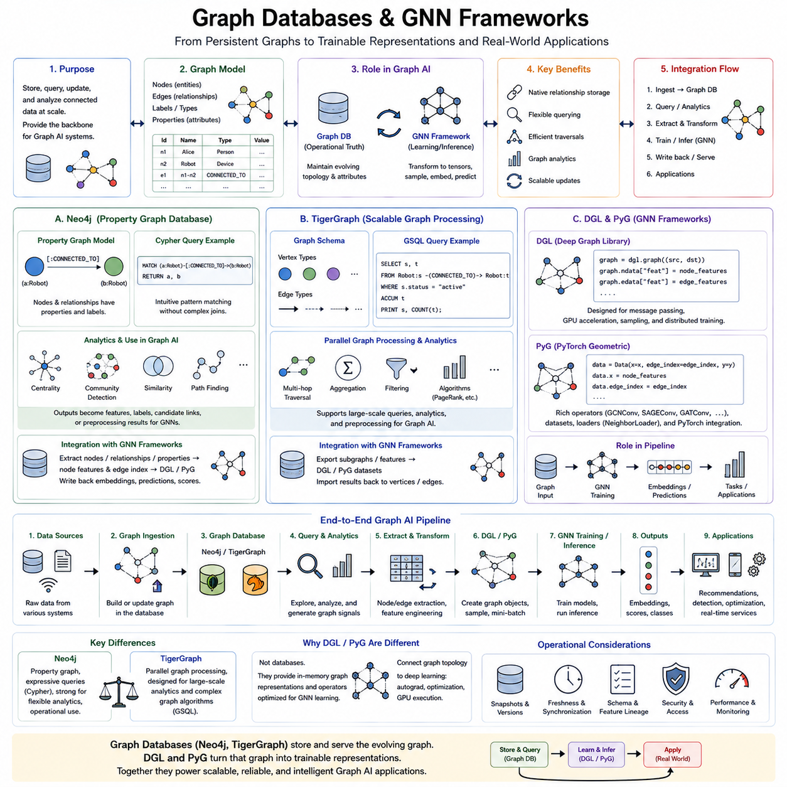
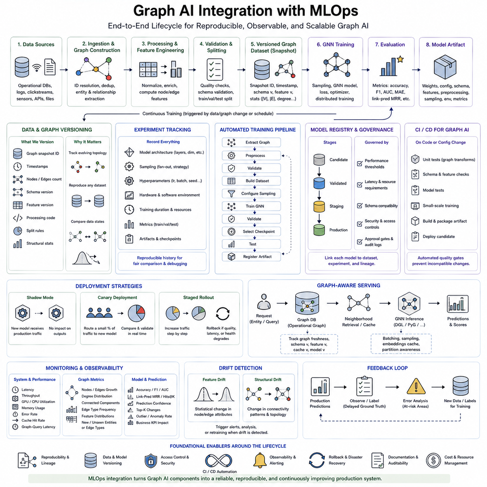
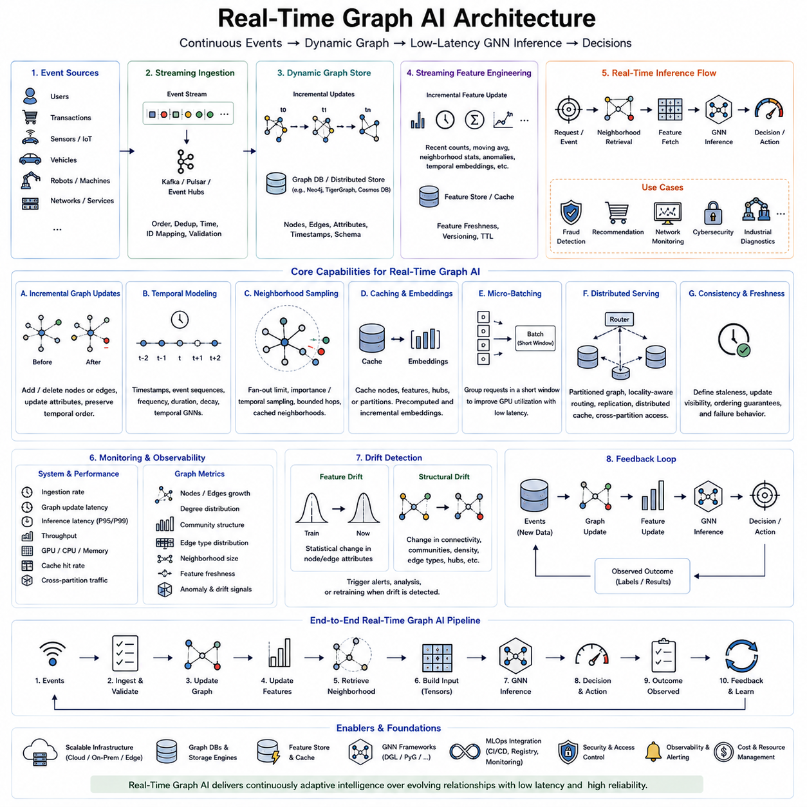

**Volume 29. Graph Deep Learning**


# Chapter 08. Engineering and Deployment

##  

## 08.01. Graph Data Pipeline [w/Code]

{width="7.268055555555556in" height="7.268055555555556in"}

A graph data pipeline transforms raw relational information into a consistent representation that can be consumed by graph learning systems. Unlike conventional tabular pipelines, it must preserve entities, relationships, direction, topology, and associated attributes simultaneously. A production pipeline therefore coordinates ingestion, identity resolution, schema construction, feature processing, graph assembly, validation, partitioning, storage, and delivery to downstream GNN workloads.

Raw graph information may originate from relational databases, event streams, logs, APIs, knowledge bases, sensor networks, or structured files. The first engineering task is to identify which records represent nodes and which interactions represent edges. Stable identifiers are essential because inconsistent entity IDs can fragment one real entity into several nodes or incorrectly merge unrelated entities, producing structural errors that later learning algorithms cannot easily correct.

Graph schema design defines node types, edge types, directionality, attributes, and constraints before model training begins. A homogeneous graph may use one node and edge category, while heterogeneous systems can represent users, products, locations, documents, sensors, or robots as different entity types. Relationships such as purchases, citations, observations, communication links, or spatial adjacency become typed edges that explicitly encode how entities interact.

Feature engineering converts raw attributes into numerical representations suitable for graph models. Continuous variables may be normalized, categorical values encoded, timestamps transformed, and text or images converted into learned embeddings. Missing attributes require explicit handling rather than arbitrary replacement. Feature processing must also remain synchronized with graph topology because a correct feature vector assigned to the wrong node identifier creates a silent but serious data integrity failure.

A minimal graph construction workflow can be expressed with PyTorch Geometric. Node features can be stored in a matrix x, while connectivity is represented by edge_index. For example, x = torch.tensor(node_features, dtype=torch.float) creates the feature matrix, edge_index = torch.tensor(edges, dtype=torch.long).t().contiguous() converts source-target pairs, and data = Data(x=x, edge_index=edge_index) produces a graph object ready for inspection and training.

Edge attributes extend this representation when relationships contain information such as distance, transaction value, communication latency, interaction frequency, confidence, or relationship type. These values must follow exactly the same ordering as edge_index. In temporal applications, timestamps can also be retained so that models distinguish when interactions occurred instead of treating the graph as a permanently static structure. This becomes particularly important for temporal GNNs and continuously changing operational networks.

Validation should occur before graphs enter training. Useful checks include verifying that every edge endpoint refers to a valid node, feature dimensions are consistent, duplicate edges are intentionally handled, prohibited self-loops are detected, and numerical values contain no unexpected NaN or infinite values. Degree distributions, isolated-node counts, connected components, node-type frequencies, and edge-type frequencies provide additional structural diagnostics that can reveal ingestion or transformation errors.

Graph datasets require careful splitting because ordinary random row splitting can introduce structural leakage. In node classification, train, validation, and test masks may share the same topology under a transductive setting, whereas inductive evaluation can reserve previously unseen nodes or subgraphs. Link prediction requires even greater care because validation and test edges must be separated without allowing preprocessing steps or negative sampling procedures to expose information about held-out relationships.

Large graphs cannot always be materialized as one in-memory object. Engineering pipelines therefore use partitioning, neighborhood sampling, mini-batching, compressed sparse representations, and distributed storage. Instead of transferring an entire social, traffic, or knowledge graph to a GPU, a loader may retrieve only the neighborhoods required for the current batch. This separates logical graph size from the amount of graph data that must reside in accelerator memory at any particular moment.

A scalable implementation can organize processing as raw records → normalized entities → node table and edge table → feature transformation → graph construction → validation → dataset split → serialized graph artifacts. Each stage should have explicit inputs and outputs so that failures can be isolated. Intermediate artifacts are valuable because expensive entity resolution or feature extraction does not need to be repeated whenever a GNN architecture or training hyperparameter changes.

Versioning is especially important because graph datasets evolve along two dimensions: attributes and topology. Adding nodes, deleting relationships, correcting identifiers, or changing an edge-generation rule can alter model behavior even when feature-processing code remains unchanged. A reproducible graph artifact should therefore record source-data versions, schema versions, preprocessing configuration, feature definitions, split rules, transformation code, and graph statistics together with the generated dataset.

Production systems should distinguish offline graph construction from online graph updates. Offline pipelines can rebuild large graphs through batch processing, while streaming systems incrementally incorporate newly observed nodes and edges. Incremental updates introduce additional concerns such as duplicate events, late-arriving records, timestamp ordering, deletion semantics, and consistency between graph storage and model-serving representations. Dynamic graphs therefore require explicit policies for both topology updates and feature freshness.

Caching reduces repeated preprocessing and graph-transfer costs. Frequently accessed node features, embeddings, sampled neighborhoods, or graph partitions can be retained in CPU or GPU memory according to access frequency and available capacity. However, cached representations must carry version information because stale embeddings or outdated neighborhoods may silently disconnect inference from the current graph state. Cache invalidation becomes part of graph correctness rather than merely a performance optimization.

Pipeline observability should measure both conventional data quality and graph-specific structural quality. Monitoring can track node and edge counts, feature distributions, graph density, degree statistics, disconnected components, new entity types, edge-type proportions, processing latency, memory consumption, and rejected records. Sudden structural changes may indicate upstream failures, but they can also represent genuine changes in the environment, making graph monitoring useful for detecting both data problems and graph distribution drift.

The pipeline boundary should remain independent from individual GNN architectures whenever possible. GraphSAGE, GCN, GAT, graph transformers, or heterogeneous GNNs may require different loaders or sampling strategies, but they should consume a common validated graph representation. This separation allows model experiments to evolve without rebuilding the complete ingestion system and establishes a stable interface between graph data engineering and the subsequent training pipeline defined in the engineering workflow.

A mature graph data pipeline is therefore not simply a converter that turns CSV files into edge_index tensors. It is the engineering layer that preserves relational meaning while making graph information reproducible, scalable, observable, and computationally accessible. Reliable graph learning depends on this layer because topology errors propagate directly into message passing, neighborhood aggregation, embeddings, reasoning, and predictions, making graph data quality inseparable from model quality.

그래프 데이터 파이프라인(Graph Data Pipeline)은 원시 관계형 정보(raw relational information)를 그래프 학습 시스템(Graph Learning System)이 사용할 수 있는 일관된 표현으로 변환한다. 기존의 테이블형 파이프라인(tabular pipeline)과 달리 엔터티(entity), 관계(relationship), 방향성(direction), 토폴로지(topology), 관련 속성(attribute)을 동시에 보존해야 한다. 따라서 실제 운영 환경의 파이프라인은 데이터 수집(ingestion), 식별자 해결(identity resolution), 스키마 구성(schema construction), 특징 처리(feature processing), 그래프 조립(graph assembly), 검증(validation), 분할(partitioning), 저장(storage), 그리고 후속 GNN 워크로드(workload)로의 전달을 조정한다.

원시 그래프 정보(raw graph information)는 관계형 데이터베이스(relational database), 이벤트 스트림(event stream), 로그(log), API, 지식 베이스(knowledge base), 센서 네트워크(sensor network), 구조화 파일(structured file) 등 다양한 출처에서 생성될 수 있다. 첫 번째 엔지니어링 작업은 어떤 레코드(record)가 노드(node)를 나타내고 어떤 상호작용(interaction)이 엣지(edge)를 나타내는지 식별하는 것이다. 안정적인 식별자(identifier)는 필수적이며, 일관되지 않은 엔터티 ID(entity ID)는 하나의 실제 엔터티를 여러 노드로 분리하거나 서로 다른 엔터티를 잘못 병합하여 이후 학습 알고리즘이 쉽게 수정할 수 없는 구조적 오류(structural error)를 발생시킬 수 있다.

그래프 스키마 설계(Graph Schema Design)는 모델 학습(model training)이 시작되기 전에 노드 유형(node type), 엣지 유형(edge type), 방향성(directionality), 속성(attribute), 제약 조건(constraint)을 정의한다. 동종 그래프(homogeneous graph)는 하나의 노드와 엣지 범주를 사용할 수 있지만, 이종 그래프(heterogeneous graph)는 사용자, 제품, 위치, 문서, 센서, 로봇 등을 서로 다른 엔터티 유형으로 표현할 수 있다. 구매, 인용, 관측, 통신 연결, 공간적 인접성(spatial adjacency) 등의 관계는 엔터티가 어떻게 상호작용하는지를 명시적으로 표현하는 유형화된 엣지(typed edge)가 된다.

특징 엔지니어링(Feature Engineering)은 원시 속성(raw attribute)을 그래프 모델에 적합한 수치 표현(numerical representation)으로 변환한다. 연속 변수(continuous variable)는 정규화(normalization)하고, 범주형 값(categorical value)은 인코딩(encoding)하며, 타임스탬프(timestamp)는 변환하고, 텍스트나 이미지는 학습된 임베딩(learned embedding)으로 표현할 수 있다. 누락된 속성(missing attribute)은 임의로 대체하기보다 명시적으로 처리해야 한다. 올바른 특징 벡터(feature vector)가 잘못된 노드 식별자에 연결되면 발견하기 어려운 심각한 데이터 무결성 오류(data integrity failure)가 발생하므로 특징 처리와 그래프 토폴로지는 항상 동기화되어야 한다.

최소한의 그래프 구성 워크플로(graph construction workflow)는 파이토치 지오메트릭(PyTorch Geometric)을 이용해 표현할 수 있다. 노드 특징(node feature)은 행렬 x에 저장하고 연결 관계(connectivity)는 edge_index로 나타낸다. 예를 들어 x = torch.tensor(node_features, dtype=torch.float)는 특징 행렬(feature matrix)을 생성하고, edge_index = torch.tensor(edges, dtype=torch.long).t().contiguous()는 소스-타깃(source-target) 쌍을 변환하며, data = Data(x=x, edge_index=edge_index)는 검사와 학습에 사용할 수 있는 그래프 객체(graph object)를 생성한다.

엣지 속성(Edge Attribute)은 관계가 거리(distance), 거래 금액(transaction value), 통신 지연시간(communication latency), 상호작용 빈도(interaction frequency), 신뢰도(confidence), 관계 유형(relationship type) 등의 정보를 포함할 때 그래프 표현을 확장한다. 이러한 값은 edge_index의 순서와 정확하게 일치해야 한다. 시간적 응용(temporal application)에서는 타임스탬프도 유지하여 모델이 모든 관계를 영구적으로 고정된 구조로 처리하지 않고 상호작용이 언제 발생했는지를 구분하도록 할 수 있다. 이는 시간 그래프 신경망(Temporal GNN)과 지속적으로 변화하는 운영 네트워크에서 특히 중요하다.

그래프가 학습 과정에 들어가기 전에 검증(validation)이 수행되어야 한다. 모든 엣지의 끝점(endpoint)이 유효한 노드를 참조하는지, 특징 차원(feature dimension)이 일관적인지, 중복 엣지(duplicate edge)가 의도대로 처리되는지, 허용되지 않은 자기 루프(self-loop)가 존재하는지, 수치 데이터에 예상하지 못한 NaN이나 무한대(infinite value)가 포함되어 있지 않은지 확인할 수 있다. 차수 분포(degree distribution), 고립 노드(isolated node) 수, 연결 요소(connected component), 노드 유형 빈도와 엣지 유형 빈도 등의 구조적 진단(structural diagnostic)을 통해 데이터 수집이나 변환 과정의 오류도 발견할 수 있다.

그래프 데이터셋(Graph Dataset)은 일반적인 무작위 행 분할(random row splitting)이 구조적 데이터 누출(structural leakage)을 발생시킬 수 있기 때문에 신중하게 분할해야 한다. 노드 분류(node classification)의 전이적 설정(transductive setting)에서는 학습, 검증, 테스트 마스크(mask)가 동일한 토폴로지를 공유할 수 있지만, 귀납적 평가(inductive evaluation)에서는 이전에 보지 못한 노드나 서브그래프(subgraph)를 별도로 유지할 수 있다. 링크 예측(link prediction)은 더욱 주의해야 하며, 전처리나 음성 샘플링(negative sampling) 과정에서 보류된 관계(held-out relationship)의 정보가 노출되지 않도록 검증 및 테스트 엣지를 분리해야 한다.

대규모 그래프(Large Graph)는 항상 하나의 인메모리 객체(in-memory object)로 구성할 수 있는 것은 아니다. 따라서 엔지니어링 파이프라인은 파티셔닝(partitioning), 이웃 샘플링(neighborhood sampling), 미니배칭(mini-batching), 압축 희소 표현(compressed sparse representation), 분산 저장(distributed storage)을 활용한다. 전체 소셜 그래프, 교통 그래프, 지식 그래프를 GPU로 전송하는 대신 로더(loader)가 현재 배치(batch)에 필요한 이웃만 가져올 수 있다. 이를 통해 논리적 그래프 크기(logical graph size)와 특정 시점에 가속기 메모리에 존재해야 하는 실제 그래프 데이터 크기를 분리할 수 있다.

확장 가능한 구현(scalable implementation)은 원시 레코드(raw record) → 정규화된 엔터티(normalized entity) → 노드 테이블(node table)과 엣지 테이블(edge table) → 특징 변환(feature transformation) → 그래프 구성(graph construction) → 검증(validation) → 데이터셋 분할(dataset split) → 직렬화된 그래프 아티팩트(serialized graph artifact)의 흐름으로 처리할 수 있다. 각 단계는 명확한 입력과 출력을 가져야 하며, 이를 통해 오류가 발생한 위치를 분리하여 추적할 수 있다. 또한 중간 아티팩트(intermediate artifact)를 유지하면 GNN 아키텍처나 학습 하이퍼파라미터(hyperparameter)가 변경될 때마다 비용이 높은 엔터티 해결이나 특징 추출(feature extraction)을 반복할 필요가 없다.

버전 관리(Versioning)는 그래프 데이터셋이 속성(attribute)과 토폴로지(topology)라는 두 차원에서 변화하기 때문에 특히 중요하다. 노드를 추가하거나 관계를 삭제하고, 식별자를 수정하거나 엣지 생성 규칙(edge-generation rule)을 변경하면 특징 처리 코드가 동일하더라도 모델 동작이 달라질 수 있다. 따라서 재현 가능한 그래프 아티팩트(reproducible graph artifact)는 소스 데이터 버전(source-data version), 스키마 버전(schema version), 전처리 설정(preprocessing configuration), 특징 정의(feature definition), 분할 규칙(split rule), 변환 코드(transformation code), 그래프 통계(graph statistics)를 생성된 데이터셋과 함께 기록해야 한다.

운영 시스템(Production System)은 오프라인 그래프 구성(offline graph construction)과 온라인 그래프 업데이트(online graph update)를 구분해야 한다. 오프라인 파이프라인은 배치 처리(batch processing)를 통해 대규모 그래프를 재구축할 수 있으며, 스트리밍 시스템(streaming system)은 새롭게 관측되는 노드와 엣지를 점진적으로 반영한다. 증분 업데이트(incremental update)는 중복 이벤트(duplicate event), 늦게 도착한 레코드(late-arriving record), 타임스탬프 순서(timestamp ordering), 삭제 의미론(deletion semantics), 그래프 저장소와 모델 서빙 표현(model-serving representation) 간의 일관성 같은 추가적인 문제를 발생시킨다. 따라서 동적 그래프(dynamic graph)는 토폴로지 업데이트와 특징 최신성(feature freshness)에 대한 명시적인 정책을 필요로 한다.

캐싱(Caching)은 반복되는 전처리와 그래프 전송 비용을 감소시킨다. 자주 접근하는 노드 특징, 임베딩(embedding), 샘플링된 이웃(sampled neighborhood), 그래프 파티션(graph partition)을 접근 빈도와 사용 가능한 용량에 따라 CPU 또는 GPU 메모리에 유지할 수 있다. 그러나 오래된 임베딩이나 이웃 정보가 현재 그래프 상태와 추론(inference)을 분리할 수 있으므로 캐시된 표현에는 버전 정보가 포함되어야 한다. 따라서 캐시 무효화(cache invalidation)는 단순한 성능 최적화가 아니라 그래프 정확성(graph correctness)의 일부가 된다.

파이프라인 관측 가능성(Pipeline Observability)은 일반적인 데이터 품질(data quality)과 그래프 고유의 구조적 품질(structural quality)을 모두 측정해야 한다. 모니터링(monitoring)을 통해 노드와 엣지 수, 특징 분포(feature distribution), 그래프 밀도(graph density), 차수 통계(degree statistics), 단절된 연결 요소(disconnected component), 새로운 엔터티 유형, 엣지 유형 비율, 처리 지연시간(processing latency), 메모리 소비량(memory consumption), 거부된 레코드 등을 추적할 수 있다. 갑작스러운 구조 변화는 상위 데이터 처리 과정의 장애를 나타낼 수도 있지만 실제 환경의 변화를 의미할 수도 있으므로, 그래프 모니터링은 데이터 문제와 그래프 분포 변화(graph distribution drift)를 모두 탐지하는 데 활용할 수 있다.

파이프라인 경계(pipeline boundary)는 가능한 한 개별 GNN 아키텍처와 독립적으로 유지되어야 한다. GraphSAGE, GCN, GAT, 그래프 트랜스포머(Graph Transformer), 이종 GNN(Heterogeneous GNN)은 서로 다른 로더나 샘플링 전략을 요구할 수 있지만 공통적으로 검증된 그래프 표현(validated graph representation)을 사용하도록 설계하는 것이 바람직하다. 이러한 분리는 전체 데이터 수집 시스템을 다시 구축하지 않고도 모델 실험을 발전시킬 수 있도록 하며, 그래프 데이터 엔지니어링(Graph Data Engineering)과 이후의 학습 파이프라인(Training Pipeline) 사이에 안정적인 인터페이스를 형성한다.

성숙한 그래프 데이터 파이프라인(Graph Data Pipeline)은 단순히 CSV 파일을 edge_index 텐서(tensor)로 변환하는 도구가 아니다. 이는 관계적 의미(relational meaning)를 보존하면서 그래프 정보를 재현 가능하고(reproducible), 확장 가능하며(scalable), 관측 가능하고(observable), 계산적으로 접근 가능한 형태로 만드는 핵심 엔지니어링 계층이다. 토폴로지 오류는 메시지 패싱(message passing), 이웃 집계(neighborhood aggregation), 임베딩, 추론(reasoning), 예측(prediction)에 직접 전파되므로 신뢰할 수 있는 그래프 학습에서 그래프 데이터 품질과 모델 품질은 서로 분리할 수 없다.

##  

## 08.02. Training Pipeline [w/Code]

{width="7.268055555555556in" height="7.268055555555556in"}

A graph training pipeline converts a validated graph dataset into a reproducible sequence of model optimization, evaluation, checkpointing, and experiment management operations. Within the engineering structure of Graph Deep Learning, it follows graph data preparation and precedes large-scale GNN optimization and deployment. The pipeline must coordinate topology, node and edge features, task labels, sampling rules, model configuration, and hardware execution without breaking their structural relationships.

The first stage defines the learning task and determines which graph elements participate in supervision. Node classification predicts labels for individual nodes, link prediction estimates relationships between node pairs, and graph classification produces outputs for complete graphs or subgraphs. This distinction determines how training examples are constructed, which masks or edge sets are used, and how batches are formed before they reach the model.

A typical PyTorch Geometric workflow begins with a graph object containing node features, connectivity, and optional labels. A compact setup may use data = Data(x=x, edge_index=edge_index, y=y), followed by data = data.to(device) to move graph tensors to the selected accelerator. Training masks such as data.train_mask can identify supervised nodes, while validation and test masks preserve separate evaluation populations.

The model stage instantiates a GNN architecture appropriate for the graph and task. A simple implementation may define conv1 = GCNConv(in_channels, hidden_channels) and conv2 = GCNConv(hidden_channels, out_channels). During the forward pass, h = conv1(x, edge_index) aggregates neighborhood information, an activation such as F.relu(h) introduces nonlinearity, and the second graph layer transforms the learned representation into task-specific outputs.

Optimization follows the same gradient-based principles used in conventional deep learning but operates over representations created through graph message passing. An optimizer such as torch.optim.Adam(model.parameters(), lr=0.01, weight_decay=5e-4) updates parameters after backpropagation. The learning rate controls update magnitude, while weight decay can regularize parameters and reduce overfitting when graph labels or training nodes are limited.

A minimal node-classification training step can be expressed as model.train(), optimizer.zero_grad(), out = model(data.x, data.edge_index), loss = criterion(out[data.train_mask], data.y[data.train_mask]), loss.backward(), and optimizer.step(). The mask ensures that only designated training nodes contribute directly to the supervised loss even when message passing uses a larger portion of the graph topology.

Training and evaluation modes must remain explicitly separated. During validation, model.eval() is used together with disabled gradient computation, after which predictions are evaluated only on the validation mask or held-out graph elements. Accuracy may be appropriate for balanced node classification, while F1 score, ROC-AUC, average precision, ranking metrics, or task-specific measures may be required for imbalanced classification and link prediction problems.

Graph mini-batching differs from ordinary tensor batching because examples can have variable numbers of nodes and edges. For collections of independent graphs, a loader can combine several graphs into a disconnected block-diagonal structure while maintaining graph membership information. For a single massive graph, neighborhood sampling selects limited local subgraphs around target nodes so that message passing can proceed without loading the complete topology into accelerator memory.

Sampling changes both computational cost and the information visible during optimization. Neighbor sampling limits the number of adjacent nodes expanded at each GNN layer, while subgraph and cluster-based approaches train on selected regions of the topology. The sampling configuration should therefore be treated as part of the training specification rather than merely a data-loading detail, because it can influence convergence, representation quality, memory usage, and runtime.

Checkpointing protects long-running graph experiments and provides reproducible model states. A checkpoint can store model.state_dict(), optimizer.state_dict(), epoch, validation metrics, and configuration metadata. The best checkpoint is commonly selected using a validation criterion rather than final training loss. Early stopping can terminate optimization when validation performance fails to improve for a defined patience period, reducing unnecessary computation and limiting overfitting.

Experiment configuration should separate model parameters from executable training logic. Hidden dimensions, layer count, dropout, learning rate, weight decay, batch size, neighborhood fan-out, number of epochs, random seed, and dataset version can be stored in a configuration object or file. This allows experiments to be repeated systematically and makes model comparisons meaningful because differences between runs can be traced to explicit parameter changes.

Reproducibility requires more than storing model weights. Random seeds should be controlled across Python, NumPy, and the deep learning framework when applicable, while graph splits and sampling procedures should also be reproducible. Software versions, hardware configuration, preprocessing versions, dataset identifiers, and model definitions should accompany experiment records so that a result can be reconstructed rather than merely remembered as a final metric.

Training observability exposes problems that final accuracy alone cannot reveal. Useful signals include training and validation loss, task metrics, learning rate, epoch duration, GPU utilization, memory consumption, batch throughput, sampled node and edge counts, and gradient behavior. Unexpected changes in these measurements can reveal exploding gradients, inefficient sampling, data-loading bottlenecks, excessive neighborhood expansion, or graph partitions that create highly uneven computational workloads.

Large-scale training introduces distributed execution in which graph data, sampling, computation, or model parameters may span multiple processors or machines. Communication cost becomes especially important because message passing depends on neighboring nodes that may reside on different partitions. Effective partitioning attempts to reduce cross-partition edges while maintaining balanced workloads, preparing the training system for the scalable GNN techniques that follow later in the engineering chapter.

The complete training workflow can therefore be viewed as validated graph data → task-specific split and loader → GNN forward propagation → loss computation → backpropagation → parameter update → validation → checkpoint selection → final evaluation. Surrounding this core loop are configuration management, reproducibility controls, logging, resource monitoring, and failure recovery, transforming a research training script into a dependable graph learning pipeline.

A well-engineered graph training pipeline separates graph preparation, model definition, optimization, evaluation, and infrastructure concerns while preserving a clear contract between them. This modularity makes it possible to replace a GCN with GAT, GraphSAGE, GIN, or a graph transformer without redesigning the entire workflow. The result is a reusable foundation that connects graph data engineering to scalable training, inference optimization, MLOps integration, and ultimately production Graph AI systems.

검증된 그래프 데이터셋(validated graph dataset)을 재현 가능한 모델 최적화(model optimization), 평가(evaluation), 체크포인팅(checkpointing), 실험 관리(experiment management)의 연속적인 과정으로 변환하는 것이 그래프 학습 파이프라인(Graph Training Pipeline)의 핵심이다. 그래프 딥러닝(Graph Deep Learning)의 엔지니어링 구조에서는 그래프 데이터 준비 이후에 위치하며, 대규모 GNN 최적화와 배포 이전의 핵심 단계가 된다. 이 파이프라인은 토폴로지(topology), 노드 및 엣지 특징(node and edge features), 작업 레이블(task labels), 샘플링 규칙(sampling rules), 모델 설정(model configuration), 하드웨어 실행(hardware execution)을 구조적 관계를 손상시키지 않으면서 조정해야 한다.

첫 번째 단계에서는 학습 작업(learning task)을 정의하고 어떤 그래프 요소가 지도 학습(supervision)에 참여하는지를 결정한다. 노드 분류(node classification)는 개별 노드의 레이블을 예측하고, 링크 예측(link prediction)은 노드 쌍 사이의 관계를 추정하며, 그래프 분류(graph classification)는 전체 그래프 또는 서브그래프(subgraph)에 대한 출력을 생성한다. 이러한 차이에 따라 학습 예제(training example)를 구성하는 방법, 사용할 마스크(mask) 또는 엣지 집합(edge set), 모델에 입력하기 전에 배치를 구성하는 방법이 결정된다.

일반적인 파이토치 지오메트릭(PyTorch Geometric) 워크플로는 노드 특징, 연결 관계(connectivity), 선택적 레이블을 포함하는 그래프 객체(graph object)에서 시작한다. 간단한 구성에서는 data = Data(x=x, edge_index=edge_index, y=y)를 사용할 수 있으며, 이후 data = data.to(device)를 통해 그래프 텐서를 선택된 가속기(accelerator)로 이동한다. data.train_mask와 같은 학습 마스크(training mask)는 지도 학습에 사용할 노드를 지정하며, 검증 및 테스트 마스크(validation and test masks)는 별도의 평가 집단을 유지한다.

모델 단계(model stage)에서는 그래프와 학습 작업에 적합한 GNN 아키텍처를 구성한다. 간단한 구현에서는 conv1 = GCNConv(in_channels, hidden_channels)와 conv2 = GCNConv(hidden_channels, out_channels)를 정의할 수 있다. 순전파(forward pass) 과정에서 h = conv1(x, edge_index)는 이웃 정보를 집계하고, F.relu(h)와 같은 활성화 함수(activation function)가 비선형성(nonlinearity)을 추가하며, 두 번째 그래프 계층(graph layer)이 학습된 표현을 작업별 출력(task-specific output)으로 변환한다.

최적화(optimization)는 기존 딥러닝과 동일한 경사 기반 원리(gradient-based principle)를 따르지만 그래프 메시지 패싱(graph message passing)을 통해 생성된 표현을 대상으로 수행된다. torch.optim.Adam(model.parameters(), lr=0.01, weight_decay=5e-4)과 같은 옵티마이저(optimizer)는 역전파(backpropagation) 이후 파라미터를 갱신한다. 학습률(learning rate)은 업데이트 크기를 제어하며, 가중치 감쇠(weight decay)는 그래프 레이블이나 학습 노드가 제한된 상황에서 파라미터를 정규화하고 과적합(overfitting)을 줄이는 데 활용할 수 있다.

최소한의 노드 분류 학습 단계(node-classification training step)는 model.train(), optimizer.zero_grad(), out = model(data.x, data.edge_index), loss = criterion(out[data.train_mask], data.y[data.train_mask]), loss.backward(), optimizer.step()으로 표현할 수 있다. 이때 마스크는 메시지 패싱이 더 넓은 그래프 토폴로지를 사용하더라도 지정된 학습 노드만 지도 손실(supervised loss)에 직접 기여하도록 보장한다.

학습 모드(training mode)와 평가 모드(evaluation mode)는 명확하게 분리되어야 한다. 검증 과정에서는 model.eval()을 사용하고 그래디언트 계산(gradient computation)을 비활성화한 뒤, 검증 마스크 또는 보류된 그래프 요소(held-out graph element)에 대해서만 예측 결과를 평가한다. 균형 잡힌 노드 분류에서는 정확도(accuracy)가 적합할 수 있지만, 불균형 분류와 링크 예측에서는 F1 점수(F1 score), ROC-AUC, 평균 정밀도(average precision), 순위 지표(ranking metric), 작업별 평가 지표(task-specific metric)가 필요할 수 있다.

그래프 미니배칭(graph mini-batching)은 예제마다 노드와 엣지의 수가 달라질 수 있기 때문에 일반적인 텐서 배칭(tensor batching)과 차이가 있다. 독립된 여러 그래프의 집합에서는 로더(loader)가 그래프 소속 정보를 유지하면서 여러 그래프를 서로 연결되지 않은 블록 대각 구조(block-diagonal structure)로 결합할 수 있다. 하나의 거대한 그래프에서는 이웃 샘플링(neighborhood sampling)을 통해 대상 노드 주변의 제한된 로컬 서브그래프(local subgraph)를 선택하여 전체 토폴로지를 가속기 메모리에 적재하지 않고도 메시지 패싱을 수행할 수 있다.

샘플링(sampling)은 계산 비용뿐만 아니라 최적화 과정에서 모델이 관찰할 수 있는 정보에도 영향을 미친다. 이웃 샘플링(neighbor sampling)은 각 GNN 계층에서 확장되는 인접 노드의 수를 제한하며, 서브그래프 및 클러스터 기반 접근(subgraph and cluster-based approach)은 토폴로지의 선택된 영역을 대상으로 학습한다. 따라서 샘플링 설정은 단순한 데이터 로딩 세부사항이 아니라 학습 사양(training specification)의 일부로 다루어야 하며, 수렴(convergence), 표현 품질(representation quality), 메모리 사용량, 실행시간에 영향을 줄 수 있다.

체크포인팅(Checkpointing)은 장시간 실행되는 그래프 실험을 보호하고 재현 가능한 모델 상태(model state)를 제공한다. 체크포인트(checkpoint)는 model.state_dict(), optimizer.state_dict(), 에포크(epoch), 검증 지표(validation metric), 설정 메타데이터(configuration metadata)를 저장할 수 있다. 최적의 체크포인트는 일반적으로 최종 학습 손실(training loss)이 아니라 검증 기준(validation criterion)을 이용해 선택한다. 조기 종료(early stopping)는 정의된 인내 횟수(patience period) 동안 검증 성능이 개선되지 않을 경우 최적화를 종료하여 불필요한 계산과 과적합을 줄일 수 있다.

실험 설정(experiment configuration)은 모델 파라미터(model parameter)와 실행 가능한 학습 로직(training logic)을 분리해야 한다. 은닉 차원(hidden dimension), 계층 수(layer count), 드롭아웃(dropout), 학습률, 가중치 감쇠, 배치 크기(batch size), 이웃 팬아웃(neighborhood fan-out), 에포크 수, 난수 시드(random seed), 데이터셋 버전(dataset version)을 설정 객체(configuration object) 또는 파일에 저장할 수 있다. 이를 통해 실험을 체계적으로 반복하고 실행 간 차이를 명시적인 파라미터 변경으로 추적할 수 있어 의미 있는 모델 비교가 가능해진다.

재현성(Reproducibility)은 단순히 모델 가중치(model weight)를 저장하는 것 이상을 요구한다. 필요한 경우 파이썬(Python), 넘파이(NumPy), 딥러닝 프레임워크(deep learning framework)의 난수 시드를 제어하고, 그래프 분할(graph split)과 샘플링 과정 역시 재현 가능하게 구성해야 한다. 소프트웨어 버전, 하드웨어 구성, 전처리 버전(preprocessing version), 데이터셋 식별자(dataset identifier), 모델 정의(model definition)를 실험 기록과 함께 관리함으로써 최종 지표만 기억하는 것이 아니라 실제 결과를 다시 재구성할 수 있어야 한다.

학습 관측 가능성(training observability)은 최종 정확도만으로는 발견할 수 없는 문제를 보여준다. 유용한 신호에는 학습 및 검증 손실, 작업 지표(task metric), 학습률, 에포크 수행시간(epoch duration), GPU 활용률(utilization), 메모리 소비량, 배치 처리량(batch throughput), 샘플링된 노드와 엣지 수, 그래디언트 동작(gradient behavior)이 포함된다. 이러한 측정값의 비정상적인 변화는 그래디언트 폭주(exploding gradient), 비효율적인 샘플링, 데이터 로딩 병목(data-loading bottleneck), 과도한 이웃 확장, 불균형한 그래프 파티션(graph partition) 등의 문제를 나타낼 수 있다.

대규모 학습(large-scale training)에서는 그래프 데이터, 샘플링, 계산 또는 모델 파라미터가 여러 프로세서나 머신에 분산되는 분산 실행(distributed execution)이 필요할 수 있다. 메시지 패싱은 서로 다른 파티션(partition)에 위치할 수 있는 이웃 노드에 의존하기 때문에 통신 비용(communication cost)이 특히 중요하다. 효과적인 파티셔닝(partitioning)은 작업 부하를 균형 있게 유지하면서 파티션 사이의 엣지(cross-partition edge)를 줄이는 것을 목표로 하며, 이후 엔지니어링 단계에서 다루는 확장 가능한 GNN(scalable GNN) 기술을 위한 기반을 제공한다.

전체 학습 워크플로(training workflow)는 검증된 그래프 데이터(validated graph data) → 작업별 분할 및 로더(task-specific split and loader) → GNN 순전파(GNN forward propagation) → 손실 계산(loss computation) → 역전파(backpropagation) → 파라미터 업데이트(parameter update) → 검증(validation) → 체크포인트 선택(checkpoint selection) → 최종 평가(final evaluation)의 흐름으로 이해할 수 있다. 이 핵심 루프(core loop)를 설정 관리(configuration management), 재현성 제어(reproducibility control), 로깅(logging), 자원 모니터링(resource monitoring), 장애 복구(failure recovery)가 둘러싸면서 연구용 학습 스크립트를 신뢰할 수 있는 그래프 학습 파이프라인으로 발전시킨다.

잘 설계된 그래프 학습 파이프라인(Graph Training Pipeline)은 그래프 준비(graph preparation), 모델 정의(model definition), 최적화, 평가, 인프라 관련 요소를 분리하면서도 이들 사이의 명확한 계약(interface contract)을 유지한다. 이러한 모듈성(modularity)을 통해 전체 워크플로를 다시 설계하지 않고도 GCN을 GAT, GraphSAGE, GIN 또는 그래프 트랜스포머(Graph Transformer)로 교체할 수 있다. 결과적으로 그래프 데이터 엔지니어링(Graph Data Engineering)을 확장 가능한 학습(scalable training), 추론 최적화(inference optimization), MLOps 통합(MLOps integration), 그리고 최종적인 운영 그래프 AI 시스템(production Graph AI system)으로 연결하는 재사용 가능한 기반이 형성된다.

##  

## 08.03. Scaling GNN

{width="7.268055555555556in" height="7.268055555555556in"}

Scaling a Graph Neural Network requires more than increasing batch size or adding GPUs because graph computation is governed by irregular topology and neighborhood expansion. As GNN depth increases, message passing can recursively collect information from rapidly growing neighborhoods, producing high memory consumption and expensive data movement. Scalable GNN engineering therefore combines sampling, partitioning, distributed execution, and accelerator optimization while preserving useful structural context.

Sampling methods reduce the amount of topology processed during each optimization step. Instead of loading every node and edge from a massive graph, the training system selects a computationally manageable subset. This converts full-graph learning into mini-batch training and allows graphs containing millions or billions of relationships to be processed with bounded memory. The central tradeoff is between computational efficiency and preservation of sufficient neighborhood information.

Neighbor sampling begins with a set of target nodes and recursively samples a limited number of neighbors for each GNN layer. For a two-layer model, a fan-out such as [15, 10] can select up to fifteen first-hop neighbors and ten second-hop neighbors per expanded node. This controls neighborhood explosion while maintaining local structural context, making the method particularly suitable for architectures such as GraphSAGE and other message-passing GNNs.

In PyTorch Geometric, neighborhood sampling can be expressed conceptually with loader = NeighborLoader(data, num_neighbors=[15, 10], batch_size=1024, input_nodes=data.train_mask, shuffle=True). Each iteration returns a sampled subgraph containing seed nodes and the neighbors required for message passing. The resulting batch can then be transferred to a GPU and processed without placing the complete graph topology in accelerator memory.

Node-wise sampling is not the only strategy. Layer-wise sampling selects nodes needed by an entire GNN layer, while subgraph sampling extracts connected regions that preserve more internal structure. Cluster-based methods partition the original graph and use individual clusters or groups of clusters as training batches. These approaches can reduce redundant neighborhood expansion and improve data locality, although partition quality may affect how much cross-cluster information is retained.

Graph partitioning becomes increasingly important when a graph exceeds the memory capacity of a single machine. The objective is to divide nodes and edges into balanced partitions while minimizing edges crossing partition boundaries. Good partitions improve locality because most message passing occurs within the same memory or compute domain. Poor partitioning increases remote feature access, communication traffic, synchronization overhead, and imbalance between workers.

Distributed GNN training extends computation across multiple GPUs or multiple machines. Graph partitions, sampled batches, model replicas, or combinations of these components can be distributed among workers. Data parallel training gives each worker a model replica and different graph samples, after which gradients are synchronized. More specialized systems may distribute graph storage and sampling separately from neural-network computation to support graphs larger than aggregate GPU memory.

A simplified PyTorch distributed workflow initializes a process group, assigns one GPU to each process, moves the GNN to the local device, and wraps it with DistributedDataParallel. Conceptually, model = DDP(model, device_ids=[local_rank]) synchronizes gradients across replicas during backward propagation. Each process should receive distinct training samples so that additional GPUs increase effective throughput rather than redundantly processing identical graph batches.

Distributed graph learning is often limited by communication rather than arithmetic. Message passing may require features belonging to neighboring nodes stored on remote partitions, while gradient synchronization also transfers model updates among workers. Communication volume can therefore become comparable to or greater than computation time. Partition-aware sampling, feature caching, asynchronous data preparation, and overlapping communication with computation are important techniques for improving distributed efficiency.

Load balancing presents another challenge because graph degree distributions are frequently highly skewed. A small number of high-degree hubs may generate much larger sampled neighborhoods than ordinary nodes, causing some workers to process significantly more edges than others. Balanced partition sizes alone are therefore insufficient. Practical systems may consider node degree, sampled edge count, feature size, and expected computational workload when assigning graph regions to workers.

GPU optimization begins by recognizing that GNN workloads differ from dense neural networks. Operations such as neighbor gathering, scatter-reduce, sparse matrix multiplication, and irregular memory access can become bottlenecks even when theoretical GPU compute capacity is high. Efficient execution depends on reducing unnecessary transfers, improving memory locality, increasing useful parallelism, and keeping the GPU supplied with graph batches prepared by the CPU or distributed sampler.

Mixed-precision training can reduce GPU memory consumption and increase throughput when the architecture and hardware support lower-precision arithmetic. Automatic mixed precision typically performs suitable operations in FP16 or BF16 while preserving sensitive calculations at higher precision. Gradient scaling may be used with FP16 to avoid numerical underflow. The resulting memory savings can permit larger sampled neighborhoods, larger batches, or deeper GNN architectures.

Memory optimization also includes controlling feature residency. Frequently accessed node features or embeddings can be cached in GPU memory, while less frequently accessed information remains in host memory or distributed graph storage. Pinned CPU memory and asynchronous transfers can reduce data-transfer overhead. The objective is not necessarily to place the entire graph on the GPU, but to keep the most valuable working set close to computation while efficiently streaming the remainder.

Batch size and sampling fan-out must be optimized together because they jointly determine the number of sampled nodes and edges. Increasing the number of target nodes improves parallelism, but large fan-out values can multiply the actual computational graph dramatically. Monitoring nodes per batch, edges per batch, GPU memory, utilization, sampling latency, transfer time, and step duration provides a more meaningful view of GNN efficiency than observing nominal batch size alone.

Profiling is essential before introducing complex scaling mechanisms. Low GPU utilization may indicate slow neighborhood sampling, CPU bottlenecks, synchronization delays, remote feature access, or insufficient batch parallelism rather than an inefficient GNN layer. Profilers and runtime metrics should separate data loading, sampling, host-to-device transfer, forward propagation, backward propagation, gradient synchronization, and optimizer execution so that optimization targets the true bottleneck.

The scalable workflow can therefore be understood as large graph storage → partitioning → target selection → neighborhood or subgraph sampling → batch preparation → GPU transfer → GNN computation → distributed gradient synchronization → parameter update. Caching, mixed precision, asynchronous execution, communication overlap, profiling, and workload balancing surround this path and progressively remove bottlenecks as graph and hardware scale increase.

Sampling Methods, Distributed Training, and GPU Optimization are consequently complementary rather than independent techniques within Scaling GNN. Sampling bounds the computational graph, distributed training expands available compute and memory resources, and GPU optimization improves the efficiency of each worker. Together they provide the engineering foundation for moving GNNs from small research datasets toward large social networks, knowledge graphs, spatial systems, infrastructure networks, and production-scale Graph AI.

그래프 신경망(Graph Neural Network, GNN)의 확장은 단순히 배치 크기(batch size)를 늘리거나 GPU를 추가하는 것만으로 해결되지 않는다. 그래프 연산(graph computation)은 불규칙한 토폴로지(irregular topology)와 이웃 확장(neighborhood expansion)의 영향을 받기 때문이다. GNN 깊이가 증가하면 메시지 패싱(message passing)이 빠르게 증가하는 이웃으로부터 정보를 재귀적으로 수집하여 높은 메모리 사용량과 큰 데이터 이동 비용을 발생시킬 수 있다. 따라서 확장 가능한 GNN 엔지니어링(scalable GNN engineering)은 유용한 구조적 문맥(structural context)을 유지하면서 샘플링(sampling), 파티셔닝(partitioning), 분산 실행(distributed execution), 가속기 최적화(accelerator optimization)를 결합한다.

샘플링 방법(Sampling Methods)은 각각의 최적화 단계에서 처리되는 토폴로지의 양을 줄인다. 거대한 그래프의 모든 노드와 엣지를 로딩하는 대신 학습 시스템은 계산 가능한 규모의 부분집합(subset)을 선택한다. 이를 통해 전체 그래프 학습(full-graph learning)을 미니배치 학습(mini-batch training)으로 변환하고, 수백만 또는 수십억 개의 관계를 포함하는 그래프도 제한된 메모리 안에서 처리할 수 있다. 핵심적인 절충점(tradeoff)은 계산 효율성과 충분한 이웃 정보의 보존 사이에 존재한다.

이웃 샘플링(Neighbor Sampling)은 대상 노드(target node) 집합에서 시작하여 각 GNN 계층마다 제한된 수의 이웃을 재귀적으로 샘플링한다. 2계층 모델의 경우 [15, 10]과 같은 팬아웃(fan-out)을 사용하면 확장되는 각 노드에 대해 최대 15개의 1홉 이웃(first-hop neighbor)과 10개의 2홉 이웃(second-hop neighbor)을 선택할 수 있다. 이는 이웃 폭증(neighborhood explosion)을 제어하면서 로컬 구조적 문맥을 유지하기 때문에 GraphSAGE와 같은 메시지 패싱 GNN에 특히 적합하다.

파이토치 지오메트릭(PyTorch Geometric)에서 이웃 샘플링은 개념적으로 loader = NeighborLoader(data, num_neighbors=[15, 10], batch_size=1024, input_nodes=data.train_mask, shuffle=True)와 같이 표현할 수 있다. 각각의 반복(iteration)은 시드 노드(seed node)와 메시지 패싱에 필요한 이웃을 포함하는 샘플링된 서브그래프(sampled subgraph)를 반환한다. 이후 생성된 배치를 GPU로 전송하여 전체 그래프 토폴로지를 가속기 메모리에 적재하지 않고 처리할 수 있다.

노드 단위 샘플링(node-wise sampling)만이 유일한 전략은 아니다. 계층 단위 샘플링(layer-wise sampling)은 전체 GNN 계층에서 필요한 노드를 선택하고, 서브그래프 샘플링(subgraph sampling)은 내부 구조를 더 많이 보존하는 연결 영역을 추출한다. 클러스터 기반 방법(cluster-based method)은 원본 그래프를 분할한 뒤 개별 클러스터 또는 여러 클러스터의 집합을 학습 배치로 사용한다. 이러한 접근법은 중복되는 이웃 확장을 줄이고 데이터 지역성(data locality)을 향상시킬 수 있지만, 파티션 품질에 따라 클러스터 사이의 정보가 얼마나 유지되는지가 달라질 수 있다.

그래프 파티셔닝(Graph Partitioning)은 그래프가 단일 머신의 메모리 용량을 초과할수록 더욱 중요해진다. 목적은 노드와 엣지를 균형 잡힌 파티션으로 분할하면서 파티션 경계를 통과하는 엣지(cross-partition edge)를 최소화하는 것이다. 좋은 파티션은 대부분의 메시지 패싱이 동일한 메모리 또는 계산 영역 안에서 수행되도록 하여 지역성을 향상시킨다. 반대로 잘못된 파티셔닝은 원격 특징 접근(remote feature access), 통신 트래픽, 동기화 오버헤드(synchronization overhead), 작업자(worker) 간 부하 불균형을 증가시킨다.

분산 GNN 학습(Distributed GNN Training)은 여러 GPU 또는 여러 머신으로 계산을 확장한다. 그래프 파티션, 샘플링된 배치, 모델 복제본(model replica), 또는 이러한 구성 요소들의 조합을 여러 작업자에게 분산할 수 있다. 데이터 병렬 학습(data parallel training)에서는 각 작업자가 모델 복제본과 서로 다른 그래프 샘플을 사용한 뒤 그래디언트(gradient)를 동기화한다. 더욱 전문화된 시스템에서는 그래프 저장 및 샘플링과 신경망 계산을 서로 분리하여 전체 GPU 메모리보다 큰 그래프를 처리할 수 있다.

단순화된 파이토치 분산(PyTorch Distributed) 워크플로에서는 프로세스 그룹(process group)을 초기화하고 각 프로세스에 하나의 GPU를 할당한 다음 GNN을 해당 로컬 장치(local device)로 이동시키고 분산 데이터 병렬(DistributedDataParallel, DDP)로 감싼다. 개념적으로 model = DDP(model, device_ids=[local_rank])은 역전파 과정에서 모델 복제본 사이의 그래디언트를 동기화한다. 각 프로세스에는 서로 다른 학습 샘플이 제공되어야 하며, 그래야 추가된 GPU가 동일한 그래프 배치를 중복 처리하는 것이 아니라 실질적인 처리량(throughput)을 증가시킬 수 있다.

분산 그래프 학습(distributed graph learning)은 산술 연산보다 통신(communication)에 의해 제한되는 경우가 많다. 메시지 패싱에는 원격 파티션에 저장된 이웃 노드의 특징이 필요할 수 있으며, 그래디언트 동기화 역시 작업자 사이에서 모델 업데이트를 전송한다. 따라서 통신량이 계산 시간과 비슷하거나 더 커질 수 있다. 파티션 인식 샘플링(partition-aware sampling), 특징 캐싱(feature caching), 비동기 데이터 준비(asynchronous data preparation), 통신과 계산의 중첩(overlapping communication with computation)은 분산 효율성을 높이는 중요한 기술이다.

부하 균형(Load Balancing)은 그래프의 차수 분포(degree distribution)가 매우 편향되어 있는 경우가 많기 때문에 또 다른 문제가 된다. 소수의 고차수 허브(high-degree hub)가 일반 노드보다 훨씬 큰 샘플링 이웃을 생성하면 일부 작업자가 다른 작업자보다 훨씬 많은 엣지를 처리하게 된다. 따라서 단순히 파티션 크기를 균등하게 만드는 것만으로는 충분하지 않다. 실제 시스템에서는 그래프 영역을 작업자에게 할당할 때 노드 차수, 샘플링된 엣지 수, 특징 크기(feature size), 예상 계산 부하(expected computational workload)를 함께 고려할 수 있다.

GPU 최적화(GPU Optimization)는 GNN 워크로드가 밀집 신경망(dense neural network)의 연산 특성과 다르다는 점을 인식하는 것에서 시작한다. 이웃 수집(neighbor gathering), 스캐터-리듀스(scatter-reduce), 희소 행렬 곱셈(sparse matrix multiplication), 불규칙 메모리 접근(irregular memory access)은 이론적인 GPU 연산 능력이 높더라도 병목이 될 수 있다. 효율적인 실행을 위해서는 불필요한 데이터 전송을 줄이고, 메모리 지역성을 높이며, 유효한 병렬성을 증가시키고, CPU 또는 분산 샘플러가 준비한 그래프 배치를 GPU에 지속적으로 공급해야 한다.

혼합 정밀도 학습(Mixed-Precision Training)은 아키텍처와 하드웨어가 저정밀도 연산(lower-precision arithmetic)을 지원할 경우 GPU 메모리 소비를 줄이고 처리량을 향상시킬 수 있다. 자동 혼합 정밀도(Automatic Mixed Precision)는 일반적으로 적합한 연산을 FP16 또는 BF16으로 수행하면서 민감한 계산은 더 높은 정밀도로 유지한다. FP16에서는 수치 언더플로(numerical underflow)를 방지하기 위해 그래디언트 스케일링(gradient scaling)을 사용할 수 있다. 이렇게 절약된 메모리는 더 큰 샘플링 이웃, 더 큰 배치 또는 더 깊은 GNN 아키텍처를 사용하는 데 활용할 수 있다.

메모리 최적화(memory optimization)에는 특징 상주(feature residency)를 제어하는 것도 포함된다. 자주 접근하는 노드 특징이나 임베딩(embedding)은 GPU 메모리에 캐싱하고, 접근 빈도가 낮은 정보는 호스트 메모리(host memory) 또는 분산 그래프 저장소에 유지할 수 있다. 고정 CPU 메모리(pinned CPU memory)와 비동기 전송(asynchronous transfer)을 사용하면 데이터 전송 오버헤드를 감소시킬 수 있다. 목적은 전체 그래프를 GPU에 배치하는 것이 아니라 계산에 가장 중요한 작업 집합(working set)을 가까운 곳에 유지하면서 나머지 데이터를 효율적으로 스트리밍하는 것이다.

배치 크기와 샘플링 팬아웃은 샘플링되는 노드와 엣지의 수를 함께 결정하므로 동시에 최적화해야 한다. 대상 노드의 수를 증가시키면 병렬성이 향상되지만, 큰 팬아웃 값은 실제 계산 그래프(computational graph)를 급격하게 확대할 수 있다. 따라서 명목상의 배치 크기만 관찰하기보다는 배치당 노드 수, 배치당 엣지 수, GPU 메모리, GPU 활용률, 샘플링 지연시간(sampling latency), 전송 시간, 단계 수행시간(step duration)을 함께 모니터링하는 것이 GNN 효율성을 평가하는 데 더 의미가 있다.

복잡한 확장 기술을 도입하기 전에 프로파일링(Profiling)을 수행하는 것이 중요하다. 낮은 GPU 활용률은 비효율적인 GNN 계층 때문이 아니라 느린 이웃 샘플링, CPU 병목, 동기화 지연, 원격 특징 접근 또는 부족한 배치 병렬성(batch parallelism) 때문에 발생할 수 있다. 프로파일러(profiler)와 실행시간 지표(runtime metric)를 이용해 데이터 로딩, 샘플링, 호스트-GPU 전송(host-to-device transfer), 순전파, 역전파, 그래디언트 동기화, 옵티마이저 실행을 분리해서 측정해야 실제 병목을 정확하게 최적화할 수 있다.

따라서 확장 가능한 워크플로(scalable workflow)는 대규모 그래프 저장(large graph storage) → 파티셔닝(partitioning) → 대상 선택(target selection) → 이웃 또는 서브그래프 샘플링(neighborhood or subgraph sampling) → 배치 준비(batch preparation) → GPU 전송 → GNN 계산 → 분산 그래디언트 동기화(distributed gradient synchronization) → 파라미터 업데이트(parameter update)의 흐름으로 이해할 수 있다. 캐싱, 혼합 정밀도, 비동기 실행(asynchronous execution), 통신 중첩(communication overlap), 프로파일링, 작업 부하 균형(workload balancing)은 이 경로를 둘러싸면서 그래프와 하드웨어 규모가 증가할 때 발생하는 병목을 단계적으로 제거한다.

따라서 GNN 확장(Scaling GNN)에서 샘플링 방법(Sampling Methods), 분산 학습(Distributed Training), GPU 최적화(GPU Optimization)는 서로 독립적인 기술이 아니라 상호 보완적인 기술이다. 샘플링은 계산 그래프의 크기를 제한하고, 분산 학습은 사용할 수 있는 계산 및 메모리 자원을 확장하며, GPU 최적화는 각각의 작업자가 가진 자원을 효율적으로 사용하도록 한다. 이 세 요소의 결합은 GNN을 소규모 연구 데이터셋에서 대규모 소셜 네트워크, 지식 그래프(knowledge graph), 공간 시스템(spatial system), 인프라 네트워크(infrastructure network), 그리고 실제 운영 규모의 그래프 AI(Graph AI)로 확장하기 위한 엔지니어링 기반을 제공한다.

##  

## 08.04. Inference Optimization [w/Code]

{width="7.268055555555556in" height="7.268055555555556in"}

Graph Neural Network inference converts a trained relational model into predictions under operational constraints such as latency, throughput, memory, power, and hardware availability. Unlike dense neural networks, GNN inference combines neural computation with irregular neighborhood access and topology-dependent message passing. Optimization must therefore address both the model execution path and the movement of graph structures, node features, edge information, and intermediate embeddings through the system.

The inference workload depends strongly on the prediction target. Node-level inference may classify newly observed entities, link prediction may score candidate relationships, and graph-level inference may process independent graphs as individual requests. A production design should first determine whether predictions are generated offline for an entire graph, periodically for selected regions, or online for individual queries, because each pattern produces different latency and batching requirements.

Full-graph inference computes embeddings for all nodes and can be efficient when predictions are required for most of a relatively stable graph. However, repeatedly evaluating the entire topology becomes wasteful when only a small number of nodes change or receive queries. Mini-batch and sampled inference instead restrict computation to relevant nodes and neighborhoods, reducing memory requirements while introducing additional sampling and data-access overhead.

Neighborhood explosion remains important during inference because an L-layer message-passing GNN may require information from an L-hop receptive field. High-degree nodes can dramatically increase the number of features and edges retrieved for a single prediction. Fan-out limits, layer-wise inference, cached embeddings, and carefully selected receptive fields can bound this cost while preserving enough relational context for useful predictions.

Layer-wise inference is particularly effective for large static graphs. Instead of recursively constructing a complete multi-hop subgraph for every target batch, the system computes one GNN layer across nodes, stores the resulting embeddings, and then processes the next layer. This can eliminate repeated computation of shared neighbors and transform expensive overlapping neighborhood evaluation into a more systematic sequence of feature propagation operations.

Caching provides another major optimization opportunity because neighboring nodes frequently appear in many inference requests. Frequently accessed node features, intermediate embeddings, graph partitions, or final representations can be retained in CPU or GPU memory. The benefit is greatest when the graph changes slowly, but cache entries require versioning and invalidation policies so that predictions do not unknowingly depend on outdated topology or stale node information.

Batching improves accelerator utilization by combining multiple inference requests into a larger computational unit. For graph-level tasks, independent graphs can be batched naturally, while node and link queries can be grouped according to time windows or compatible neighborhoods. Excessively large batches increase queueing latency, whereas very small batches may leave GPU resources underutilized. Production systems therefore balance per-request latency against aggregate throughput.

Quantization reduces model memory and arithmetic cost by representing weights or activations with lower numerical precision. Depending on framework and hardware support, inference may move from FP32 toward FP16, BF16, INT8, or other optimized representations. GNN quantization requires validation because aggregation operations can react differently to reduced precision, particularly when node degrees, feature magnitudes, or attention scores vary widely across the graph.

Model simplification can reduce inference cost before hardware-specific optimization begins. Fewer message-passing layers reduce receptive-field expansion, smaller hidden dimensions reduce feature traffic, and simpler aggregation operators decrease arithmetic and memory pressure. Distillation can train a smaller student GNN to approximate a larger teacher, while pruning may remove unnecessary parameters or structures when the resulting sparsity can be efficiently exploited by the target runtime.

Kernel optimization targets the low-level operations that dominate GNN execution. Sparse matrix multiplication, gather, scatter, segment reduction, attention, and feature transformation can suffer from irregular memory access and frequent kernel launches. Operator fusion can combine compatible operations, while optimized sparse kernels reduce intermediate memory traffic. The objective is to spend less time moving and reorganizing data relative to performing useful numerical computation.

CPU-to-GPU transfer is often a hidden inference bottleneck. If graph neighborhoods and features are assembled on the CPU for every request, the accelerator may remain idle while waiting for data. Pinned memory, asynchronous copies, prefetching, parallel sampling, feature caching, and overlapping transfer with GPU computation can reduce this delay. Optimizing the GNN model alone provides limited benefit when the input pipeline cannot continuously supply prepared graph batches.

Static and dynamic graphs require different optimization strategies. Static graphs allow topology preprocessing, partition reuse, precomputed normalization, embedding caching, and aggressive memory planning. Dynamic graphs must incorporate newly created nodes, deleted edges, changing attributes, and temporal events, making cached representations harder to maintain. Incremental inference can recompute only affected regions instead of rebuilding predictions for the entire graph after every update.

Distributed inference becomes necessary when the graph, embedding tables, or query volume exceeds a single machine. Graph partitions can be placed across servers while requests are routed toward partitions containing relevant entities. Cross-partition neighborhoods create remote communication, so partition quality and feature placement directly influence latency. Replicating frequently accessed features or high-degree hub information can sometimes reduce expensive remote accesses at the cost of additional memory.

Real-time Graph AI introduces strict service-level objectives for response time and predictability. Average latency alone is insufficient because graph queries can vary dramatically according to node degree and neighborhood size. Systems should therefore monitor median and tail latency such as P95 or P99, batch size, sampled nodes and edges, cache hit rate, transfer time, GPU utilization, memory consumption, and request throughput to identify topology-dependent performance variation.

Profiling should separate graph retrieval, neighborhood sampling, feature lookup, host-to-device transfer, GNN forward execution, post-processing, and communication. A request that appears to have slow model inference may actually spend most of its time retrieving graph features or expanding neighborhoods. End-to-end profiling prevents optimization effort from being concentrated on GPU kernels when the dominant bottleneck lies elsewhere in the graph serving pipeline.

An optimized serving path can be represented as inference request → target nodes or edges → graph lookup → neighborhood selection → feature retrieval → batching → accelerator transfer → GNN forward pass → prediction post-processing → response. Caches, quantization, optimized kernels, asynchronous execution, partition-aware routing, and monitoring surround this path to reduce repeated work and keep computational resources continuously utilized.

Inference optimization is therefore a system-level problem rather than a single model-compression technique. Effective Graph AI serving coordinates topology access, sampling, caching, numerical precision, batching, memory placement, accelerator kernels, and distributed execution according to deployment requirements. This engineering layer connects scalable GNN training to graph databases, MLOps, and real-time Graph AI, which are the subsequent deployment concerns in the chapter structure.

그래프 신경망(Graph Neural Network, GNN) 추론(inference)은 학습된 관계형 모델(relational model)을 지연시간(latency), 처리량(throughput), 메모리(memory), 전력(power), 하드웨어 가용성(hardware availability)과 같은 운영 제약조건 아래에서 실제 예측으로 변환한다. 밀집 신경망(dense neural network)과 달리 GNN 추론은 신경망 계산과 불규칙한 이웃 접근(irregular neighborhood access), 토폴로지 의존적 메시지 패싱(topology-dependent message passing)을 결합한다. 따라서 최적화는 모델 실행뿐 아니라 그래프 구조, 노드 특징, 엣지 정보, 중간 임베딩(intermediate embedding)이 시스템 내부에서 이동하는 과정까지 함께 고려해야 한다.

추론 워크로드(inference workload)는 예측 대상에 따라 크게 달라진다. 노드 수준 추론(node-level inference)은 새롭게 관측된 엔터티(entity)를 분류할 수 있고, 링크 예측(link prediction)은 후보 관계(candidate relationship)의 점수를 계산하며, 그래프 수준 추론(graph-level inference)은 독립적인 그래프를 개별 요청으로 처리한다. 운영 시스템에서는 전체 그래프를 대상으로 오프라인 예측을 수행할 것인지, 선택된 영역을 주기적으로 처리할 것인지, 개별 질의를 온라인으로 처리할 것인지 먼저 결정해야 하며, 이에 따라 지연시간과 배칭(batching) 요구사항이 달라진다.

전체 그래프 추론(full-graph inference)은 모든 노드의 임베딩을 계산하며 비교적 안정적인 그래프에서 대부분의 노드에 대한 예측이 필요한 경우 효율적일 수 있다. 그러나 소수의 노드만 변경되거나 질의를 받는 상황에서 전체 토폴로지를 반복적으로 평가하는 것은 비효율적이다. 미니배치 추론(mini-batch inference)과 샘플링 추론(sampled inference)은 계산을 관련 노드와 이웃으로 제한하여 메모리 요구량을 감소시키지만 추가적인 샘플링 및 데이터 접근 오버헤드를 발생시킬 수 있다.

이웃 폭증(neighborhood explosion)은 추론에서도 중요한 문제이다. L계층 메시지 패싱 GNN은 최대 L홉 수용 영역(L-hop receptive field)의 정보를 필요로 할 수 있으며, 고차수 노드(high-degree node)는 단일 예측에서 검색해야 하는 특징과 엣지의 수를 급격하게 증가시킬 수 있다. 팬아웃 제한(fan-out limit), 계층별 추론(layer-wise inference), 캐시된 임베딩(cached embedding), 적절하게 선택된 수용 영역을 이용하면 유용한 예측에 필요한 관계적 문맥을 유지하면서 이러한 비용을 제한할 수 있다.

계층별 추론(Layer-wise Inference)은 특히 대규모 정적 그래프(static graph)에서 효과적이다. 각각의 대상 배치에 대해 완전한 다중 홉 서브그래프(multi-hop subgraph)를 반복적으로 구성하는 대신 하나의 GNN 계층을 여러 노드에 대해 계산하고 생성된 임베딩을 저장한 다음 다음 계층을 처리한다. 이를 통해 공유 이웃(shared neighbor)에 대한 반복 계산을 제거하고, 중첩된 이웃 평가를 보다 체계적인 특징 전파(feature propagation) 연산의 연속으로 변환할 수 있다.

캐싱(Caching)은 동일한 이웃 노드가 여러 추론 요청에 반복적으로 등장하기 때문에 중요한 최적화 기회를 제공한다. 자주 접근하는 노드 특징(node feature), 중간 임베딩, 그래프 파티션(graph partition), 최종 표현(final representation)을 CPU 또는 GPU 메모리에 유지할 수 있다. 그래프 변화가 느릴수록 효과가 크지만, 오래된 토폴로지나 노드 정보에 기반한 예측을 방지하려면 캐시 항목에 대한 버전 관리(versioning)와 무효화 정책(invalidation policy)이 필요하다.

배칭(Batching)은 여러 추론 요청을 더 큰 계산 단위로 결합하여 가속기 활용률(accelerator utilization)을 향상시킨다. 그래프 수준 작업에서는 독립적인 그래프를 자연스럽게 배치로 결합할 수 있으며, 노드 및 링크 질의는 시간 구간이나 호환 가능한 이웃에 따라 그룹화할 수 있다. 지나치게 큰 배치는 대기 지연시간(queueing latency)을 증가시키고 너무 작은 배치는 GPU 자원을 충분히 활용하지 못할 수 있으므로, 운영 시스템은 개별 요청 지연시간과 전체 처리량 사이의 균형을 맞춰야 한다.

양자화(Quantization)는 가중치(weight)나 활성값(activation)을 낮은 수치 정밀도(numerical precision)로 표현하여 모델 메모리와 연산 비용을 감소시킨다. 프레임워크와 하드웨어 지원에 따라 FP32에서 FP16, BF16, INT8 또는 다른 최적화 표현으로 전환할 수 있다. GNN의 집계 연산(aggregation operation)은 노드 차수, 특징 크기, 어텐션 점수(attention score)가 그래프 전반에서 크게 달라질 경우 낮은 정밀도에 다르게 반응할 수 있으므로 양자화 이후에는 성능 검증이 필요하다.

모델 단순화(Model Simplification)는 하드웨어별 최적화를 시작하기 전에 추론 비용 자체를 줄일 수 있다. 메시지 패싱 계층 수를 줄이면 수용 영역 확장을 감소시키고, 은닉 차원(hidden dimension)을 축소하면 특징 데이터 이동량을 줄이며, 단순한 집계 연산자를 사용하면 연산량과 메모리 부담을 감소시킨다. 지식 증류(distillation)는 작은 학생 GNN(student GNN)이 큰 교사 모델(teacher model)을 근사하도록 학습시킬 수 있으며, 프루닝(pruning)은 대상 런타임(runtime)이 희소성(sparsity)을 효율적으로 활용할 수 있는 경우 불필요한 파라미터나 구조를 제거할 수 있다.

커널 최적화(Kernel Optimization)는 GNN 실행을 지배하는 저수준 연산(low-level operation)을 대상으로 한다. 희소 행렬 곱셈(sparse matrix multiplication), 개더(gather), 스캐터(scatter), 세그먼트 리덕션(segment reduction), 어텐션(attention), 특징 변환(feature transformation)은 불규칙한 메모리 접근과 빈번한 커널 실행(kernel launch)으로 인해 성능이 저하될 수 있다. 연산자 융합(operator fusion)은 호환되는 연산을 결합하고, 최적화된 희소 커널(sparse kernel)은 중간 메모리 이동을 줄여 실제 수치 계산에 더 많은 시간을 사용할 수 있도록 한다.

CPU-GPU 전송(CPU-to-GPU Transfer)은 쉽게 드러나지 않는 추론 병목이 될 수 있다. 각각의 요청마다 그래프 이웃과 특징을 CPU에서 구성하면 GPU는 데이터를 기다리면서 유휴 상태가 될 수 있다. 고정 메모리(pinned memory), 비동기 복사(asynchronous copy), 프리페칭(prefetching), 병렬 샘플링(parallel sampling), 특징 캐싱(feature caching), 데이터 전송과 GPU 계산의 중첩(overlap)을 통해 이러한 지연을 줄일 수 있다. 입력 파이프라인이 준비된 그래프 배치를 지속적으로 공급하지 못한다면 GNN 모델 자체만 최적화하는 것은 제한적인 효과만 제공한다.

정적 그래프(static graph)와 동적 그래프(dynamic graph)는 서로 다른 최적화 전략을 요구한다. 정적 그래프에서는 토폴로지 전처리(topology preprocessing), 파티션 재사용(partition reuse), 사전 계산된 정규화(precomputed normalization), 임베딩 캐싱, 적극적인 메모리 계획(memory planning)을 활용할 수 있다. 동적 그래프에서는 새 노드, 삭제된 엣지, 변화하는 속성, 시간 이벤트를 반영해야 하므로 캐시된 표현을 유지하기 어렵다. 증분 추론(incremental inference)을 사용하면 매번 전체 그래프 예측을 다시 계산하는 대신 변화의 영향을 받은 영역만 재계산할 수 있다.

분산 추론(Distributed Inference)은 그래프, 임베딩 테이블(embedding table), 또는 질의량이 단일 머신의 처리 능력을 초과할 때 필요하다. 그래프 파티션을 여러 서버에 배치하고 관련 엔터티가 존재하는 파티션으로 요청을 라우팅할 수 있다. 파티션을 가로지르는 이웃은 원격 통신(remote communication)을 발생시키므로 파티션 품질과 특징 배치(feature placement)가 지연시간에 직접적인 영향을 준다. 자주 접근하는 특징이나 고차수 허브 정보를 복제하면 추가 메모리를 사용하는 대신 비용이 높은 원격 접근을 줄일 수 있다.

실시간 그래프 AI(Real-time Graph AI)는 응답시간과 예측 가능성에 대한 엄격한 서비스 수준 목표(Service-Level Objective, SLO)를 요구한다. 그래프 질의는 노드 차수와 이웃 크기에 따라 처리시간이 크게 달라질 수 있기 때문에 평균 지연시간만으로는 충분하지 않다. 따라서 P95 또는 P99와 같은 중앙 및 꼬리 지연시간(tail latency), 배치 크기, 샘플링된 노드와 엣지 수, 캐시 적중률(cache hit rate), 전송 시간, GPU 활용률, 메모리 소비량, 요청 처리량을 함께 모니터링하여 토폴로지에 따른 성능 변화를 파악해야 한다.

프로파일링(Profiling)은 그래프 검색(graph retrieval), 이웃 샘플링, 특징 조회(feature lookup), 호스트-장치 전송(host-to-device transfer), GNN 순전파(forward execution), 후처리(post-processing), 통신을 서로 분리하여 측정해야 한다. 모델 추론 자체가 느린 것처럼 보이는 요청도 실제로는 대부분의 시간을 그래프 특징 검색이나 이웃 확장에 소비할 수 있다. 종단 간 프로파일링(end-to-end profiling)은 실제 병목이 다른 위치에 있는데도 GPU 커널만 최적화하는 잘못된 접근을 방지한다.

최적화된 서빙 경로(optimized serving path)는 추론 요청(inference request) → 대상 노드 또는 엣지(target nodes or edges) → 그래프 조회(graph lookup) → 이웃 선택(neighborhood selection) → 특징 검색(feature retrieval) → 배칭(batching) → 가속기 전송(accelerator transfer) → GNN 순전파(GNN forward pass) → 예측 후처리(prediction post-processing) → 응답(response)의 흐름으로 표현할 수 있다. 캐시, 양자화, 최적화된 커널, 비동기 실행, 파티션 인식 라우팅(partition-aware routing), 모니터링은 이 경로에서 반복 계산을 줄이고 계산 자원의 활용률을 높인다.

따라서 추론 최적화(Inference Optimization)는 하나의 모델 압축(model compression) 기법이 아니라 시스템 수준의 문제이다. 효과적인 그래프 AI 서빙(Graph AI Serving)은 배포 요구사항에 따라 토폴로지 접근, 샘플링, 캐싱, 수치 정밀도, 배칭, 메모리 배치, 가속기 커널, 분산 실행을 통합적으로 조정한다. 이러한 엔지니어링 계층은 확장 가능한 GNN 학습(Scalable GNN Training)을 그래프 데이터베이스(Graph Database), MLOps, 실시간 그래프 AI(Real-time Graph AI)와 연결하여 이후의 실제 배포 및 운영 단계로 이어지게 한다.

##  

## 08.05. Graph Databases

{width="7.268055555555556in" height="7.268055555555556in"}

Graph databases provide a persistent infrastructure for storing, querying, updating, and analyzing relational information without flattening connectivity into conventional tables. Within Graph AI engineering, they complement GNN frameworks by maintaining operational topology and attributes while learning systems transform those structures into tensors, sampled neighborhoods, embeddings, and predictions. The database and learning framework therefore serve different but closely connected roles in a production graph architecture.

A graph database commonly represents information through nodes, edges, labels or types, and properties. Nodes identify entities such as people, products, documents, sensors, vehicles, or machines, while edges encode relationships such as ownership, communication, dependency, similarity, or spatial adjacency. Property-based representations attach attributes directly to these elements, allowing applications to combine structural traversal with filtering and attribute-oriented queries.

Neo4j is strongly associated with the property graph model, where nodes and relationships can contain properties and descriptive labels. Its Cypher query language expresses graph patterns in a visually intuitive form. A conceptual query such as MATCH (a:Robot)-[:CONNECTED_TO]-\>(b:Robot) RETURN a,b searches for connected robot pairs, demonstrating how topology can be queried directly rather than reconstructed through repeated relational-table joins.

Neo4j can operate as more than persistent graph storage because graph analytics can be placed near the operational data. Algorithms for centrality, community detection, similarity, path finding, and related structural analysis can produce additional signals for downstream applications. In a Graph AI pipeline, these computed properties may become features, labels, candidate relationships, retrieval signals, or preprocessing outputs before data is transferred into a GNN training environment.

The integration boundary between Neo4j and GNN frameworks should remain explicit. A database may contain the authoritative operational graph, while an extraction process converts selected nodes, relationships, and properties into node-feature matrices and connectivity structures. Model outputs such as embeddings, predicted classes, anomaly scores, or recommended links can subsequently be written back or exposed through a serving layer, creating a controlled database-to-learning-to-application cycle.

TigerGraph addresses graph storage and analytics with an architecture oriented toward large-scale connected datasets and parallel graph processing. Its graph-oriented execution model is useful when algorithms or queries must traverse substantial portions of highly connected data. Rather than treating graph analytics as a sequence of relational joins, the system can execute computation around vertices and edges while exploiting parallelism across the underlying graph infrastructure.

TigerGraph applications can define graph schemas containing vertex and edge types and execute graph queries through GSQL. Such queries may implement multi-hop traversal, aggregation, filtering, and graph algorithms over large datasets. In Graph AI engineering, this capability can support feature generation, neighborhood discovery, candidate selection, graph statistics, or preprocessing before data is delivered to machine-learning frameworks for representation learning.

The practical difference between Neo4j and TigerGraph should be evaluated through workload requirements rather than treating one as universally superior. Important factors include graph size, traversal complexity, update frequency, query latency, analytics workload, deployment environment, operational tooling, integration requirements, and engineering expertise. Benchmarking with representative topology and queries is more reliable than selecting a database solely from generic performance claims.

DGL, or Deep Graph Library, occupies a different layer from Neo4j and TigerGraph. It is primarily a graph deep-learning framework rather than an operational graph database. DGL represents graph structures in forms designed for tensor computation and message passing, allowing developers to implement GCN, GraphSAGE, GAT, heterogeneous GNNs, and other architectures while integrating graph operations with deep-learning execution on CPUs and GPUs.

A DGL workflow converts graph connectivity into a graph object and associates tensors with nodes and edges. Conceptually, graph = dgl.graph((src, dst)) creates connectivity, while graph.ndata["feat"] = node_features attaches node features. GNN layers then consume this representation during message passing. Sampling and distributed capabilities can extend the workflow when the graph becomes too large for straightforward full-graph training.

PyTorch Geometric, commonly abbreviated as PyG, similarly provides graph data structures, operators, datasets, loaders, and GNN layers within the PyTorch ecosystem. A graph can be represented through Data(x=x, edge_index=edge_index, y=y), where x contains node features, edge_index stores connectivity, and y provides supervision when required. This compact representation makes PyG particularly convenient for research, experimentation, and custom graph-learning pipelines.

PyG provides operators such as GCNConv, SAGEConv, GATConv, and many other graph-learning components that can be assembled using familiar PyTorch programming patterns. NeighborLoader and related data-loading mechanisms support sampled mini-batch execution for graphs that cannot be efficiently trained through full-graph propagation. Consequently, PyG connects graph topology directly with autograd, optimization, GPU execution, and the broader PyTorch model-development workflow.

DGL and PyG should therefore not be viewed as direct substitutes for operational graph databases. Neo4j or TigerGraph may preserve the continuously evolving source graph used by applications, whereas DGL or PyG creates computational graph representations optimized for learning. A common architecture can use a graph database as the system of record, an extraction and transformation layer for dataset construction, and DGL or PyG as the GNN training and inference environment.

This separation introduces an important synchronization problem. Operational graphs may change after a training dataset has been extracted, producing differences between database topology and model-visible topology. Production systems should therefore track graph snapshots, timestamps, schema versions, feature definitions, and model versions. Without this lineage, an embedding or prediction may be difficult to associate with the exact graph state from which it was generated.

Online inference can connect these components more tightly. A request may identify a target entity, query its relevant neighborhood from the graph database, transform the returned structure into a DGL or PyG representation, execute the trained GNN, and return a prediction. For strict latency requirements, repeatedly performing this entire path may be expensive, so neighborhood caches, feature stores, precomputed embeddings, batching, and incremental updates can reduce database and accelerator overhead.

The resulting engineering architecture can be understood as data sources → graph ingestion → Neo4j or TigerGraph → graph query and analytics → node/edge extraction → feature transformation → DGL or PyG graph representation → GNN training and inference → predictions and embeddings → application or graph update. Each boundary should define identifiers, schemas, versions, serialization formats, and freshness requirements so relational meaning remains consistent across storage and learning systems.

Graph databases and graph-learning frameworks are therefore complementary foundations of production Graph AI. Neo4j emphasizes expressive property-graph storage and querying, TigerGraph emphasizes scalable graph processing and analytics, while DGL and PyG provide computational environments for GNN development and execution. Their effective integration transforms persistent connected data into trainable graph representations and ultimately into deployable relational intelligence for real-world applications.

그래프 데이터베이스(Graph Database)는 관계형 정보를 기존의 테이블 구조로 평탄화하지 않고 지속적으로 저장, 질의, 갱신, 분석할 수 있는 인프라를 제공한다. 그래프 AI(Graph AI) 엔지니어링에서 그래프 데이터베이스는 운영 토폴로지(operational topology)와 속성을 유지하고, GNN 프레임워크(GNN Framework)는 이러한 구조를 텐서(tensor), 샘플링된 이웃(sampled neighborhood), 임베딩(embedding), 예측(prediction)으로 변환한다. 따라서 데이터베이스와 학습 프레임워크는 서로 다른 역할을 담당하지만 실제 운영 그래프 아키텍처에서는 긴밀하게 연결된다.

그래프 데이터베이스는 일반적으로 노드(node), 엣지(edge), 레이블 또는 유형(label or type), 속성(property)을 이용하여 정보를 표현한다. 노드는 사람, 제품, 문서, 센서, 차량, 기계 등의 엔터티(entity)를 나타내며, 엣지는 소유권, 통신, 의존성, 유사성, 공간적 인접성(spatial adjacency) 등의 관계를 표현한다. 속성 기반 표현(property-based representation)은 이러한 요소에 속성을 직접 연결하여 구조적 탐색(structural traversal)과 필터링 및 속성 중심 질의를 함께 수행할 수 있도록 한다.

네오포제이(Neo4j)는 노드와 관계에 속성 및 설명 레이블(descriptive label)을 포함할 수 있는 속성 그래프 모델(property graph model)과 밀접하게 연관되어 있다. 사이퍼(Cypher) 질의 언어는 그래프 패턴(graph pattern)을 직관적인 형태로 표현한다. 예를 들어 MATCH (a:Robot)-[:CONNECTED_TO]-\>(b:Robot) RETURN a,b와 같은 개념적 질의는 서로 연결된 로봇 쌍을 검색하며, 반복적인 관계형 테이블 조인(relational-table join)을 통해 관계를 재구성하지 않고 토폴로지를 직접 질의할 수 있음을 보여준다.

Neo4j는 그래프 분석(graph analytics)을 운영 데이터 가까이에서 수행할 수 있기 때문에 단순한 영구 그래프 저장소(persistent graph storage) 이상의 역할을 수행할 수 있다. 중심성(centrality), 커뮤니티 탐지(community detection), 유사성(similarity), 경로 탐색(path finding) 등의 구조 분석 알고리즘은 후속 응용 프로그램에 사용할 추가적인 신호를 생성할 수 있다. 그래프 AI 파이프라인에서는 이러한 계산된 속성을 GNN 학습 환경으로 데이터를 전달하기 전 특징(feature), 레이블(label), 후보 관계(candidate relationship), 검색 신호(retrieval signal), 전처리 결과(preprocessing output)로 활용할 수 있다.

Neo4j와 GNN 프레임워크 사이의 통합 경계(integration boundary)는 명확하게 유지되어야 한다. 데이터베이스가 권위 있는 운영 그래프(authoritative operational graph)를 보관하고, 추출 과정(extraction process)이 선택된 노드, 관계, 속성을 노드 특징 행렬(node-feature matrix)과 연결 구조(connectivity structure)로 변환할 수 있다. 이후 임베딩, 예측 클래스(predicted class), 이상 점수(anomaly score), 추천 링크(recommended link) 등의 모델 출력을 다시 기록하거나 서빙 계층(serving layer)을 통해 제공하여 데이터베이스 → 학습 → 애플리케이션으로 이어지는 통제된 순환 구조를 만들 수 있다.

타이거그래프(TigerGraph)는 대규모 연결 데이터셋(connected dataset)과 병렬 그래프 처리(parallel graph processing)를 지향하는 아키텍처를 통해 그래프 저장과 분석을 지원한다. 그래프 중심 실행 모델(graph-oriented execution model)은 알고리즘이나 질의가 고도로 연결된 데이터의 상당 부분을 탐색해야 하는 경우 유용하다. 그래프 분석을 관계형 조인의 연속으로 처리하는 대신 기본 그래프 인프라의 병렬성을 활용하면서 정점(vertex)과 엣지를 중심으로 계산을 수행할 수 있다.

TigerGraph 애플리케이션은 정점 및 엣지 유형을 포함하는 그래프 스키마(graph schema)를 정의하고 GSQL을 통해 그래프 질의를 실행할 수 있다. 이러한 질의는 대규모 데이터셋에서 다중 홉 탐색(multi-hop traversal), 집계(aggregation), 필터링(filtering), 그래프 알고리즘을 구현할 수 있다. 그래프 AI 엔지니어링에서는 이를 특징 생성(feature generation), 이웃 탐색(neighborhood discovery), 후보 선택(candidate selection), 그래프 통계(graph statistics), 또는 표현 학습(representation learning)을 위한 머신러닝 프레임워크로 데이터를 전달하기 전의 전처리에 활용할 수 있다.

Neo4j와 TigerGraph의 실질적인 차이는 어느 하나가 모든 상황에서 우수하다고 보는 것이 아니라 워크로드 요구사항(workload requirement)을 기준으로 평가해야 한다. 주요 고려 요소에는 그래프 크기, 탐색 복잡도(traversal complexity), 갱신 빈도(update frequency), 질의 지연시간(query latency), 분석 워크로드, 배포 환경(deployment environment), 운영 도구(operational tooling), 통합 요구사항, 엔지니어링 전문성이 포함된다. 따라서 일반적인 성능 주장만으로 데이터베이스를 선택하기보다 실제 토폴로지와 대표적인 질의를 이용한 벤치마킹(benchmarking)이 더욱 신뢰할 수 있다.

딥 그래프 라이브러리(Deep Graph Library, DGL)는 Neo4j 및 TigerGraph와 다른 계층에 위치한다. DGL은 운영 그래프 데이터베이스라기보다 그래프 딥러닝 프레임워크(graph deep-learning framework)이다. DGL은 텐서 계산과 메시지 패싱(message passing)에 적합한 형태로 그래프 구조를 표현하여 개발자가 GCN, GraphSAGE, GAT, 이종 GNN(heterogeneous GNN) 등의 아키텍처를 구현하고 CPU와 GPU에서 그래프 연산을 딥러닝 실행 환경과 통합할 수 있도록 한다.

DGL 워크플로는 그래프 연결 관계(graph connectivity)를 그래프 객체(graph object)로 변환하고 노드와 엣지에 텐서를 연결한다. 개념적으로 graph = dgl.graph((src, dst))는 연결 구조를 생성하고 graph.ndata["feat"] = node_features는 노드 특징을 연결한다. 이후 GNN 계층은 메시지 패싱 과정에서 이러한 표현을 사용한다. 그래프가 단순한 전체 그래프 학습(full-graph training)으로 처리하기 어려울 정도로 커지면 샘플링(sampling)과 분산 기능(distributed capability)을 통해 워크플로를 확장할 수 있다.

파이토치 지오메트릭(PyTorch Geometric, PyG) 역시 파이토치(PyTorch) 생태계 안에서 그래프 데이터 구조, 연산자(operator), 데이터셋, 로더(loader), GNN 계층을 제공한다. 그래프는 Data(x=x, edge_index=edge_index, y=y)와 같이 표현할 수 있으며, x는 노드 특징을 포함하고 edge_index는 연결 관계를 저장하며 y는 필요한 경우 지도 학습 정보(supervision)를 제공한다. 이러한 간결한 표현은 PyG를 연구, 실험, 사용자 정의 그래프 학습 파이프라인(custom graph-learning pipeline)에 특히 편리하게 만든다.

PyG는 GCNConv, SAGEConv, GATConv를 비롯한 다양한 그래프 학습 구성 요소를 제공하며, 익숙한 PyTorch 프로그래밍 패턴을 이용하여 이를 조합할 수 있다. NeighborLoader와 관련 데이터 로딩 메커니즘(data-loading mechanism)은 전체 그래프 전파(full-graph propagation)를 효율적으로 수행하기 어려운 그래프를 대상으로 샘플링 기반 미니배치 실행(sampled mini-batch execution)을 지원한다. 따라서 PyG는 그래프 토폴로지를 자동 미분(autograd), 최적화(optimization), GPU 실행, 그리고 광범위한 PyTorch 모델 개발 워크플로와 직접 연결한다.

따라서 DGL과 PyG는 운영 그래프 데이터베이스의 직접적인 대체재로 이해해서는 안 된다. Neo4j 또는 TigerGraph는 애플리케이션에서 지속적으로 변화하는 소스 그래프(source graph)를 유지하고, DGL 또는 PyG는 학습에 최적화된 계산 그래프 표현(computational graph representation)을 생성할 수 있다. 일반적인 아키텍처에서는 그래프 데이터베이스를 기준 정보 시스템(system of record)으로 사용하고, 데이터셋 구성을 위한 추출 및 변환 계층(extraction and transformation layer)을 거쳐 DGL 또는 PyG를 GNN 학습 및 추론 환경으로 사용할 수 있다.

이러한 계층 분리는 중요한 동기화 문제(synchronization problem)를 발생시킨다. 학습 데이터셋이 추출된 이후 운영 그래프가 변경되면 데이터베이스의 토폴로지와 모델이 관찰한 토폴로지 사이에 차이가 발생할 수 있다. 따라서 운영 시스템은 그래프 스냅샷(graph snapshot), 타임스탬프(timestamp), 스키마 버전(schema version), 특징 정의(feature definition), 모델 버전(model version)을 추적해야 한다. 이러한 데이터 계보(lineage)가 없으면 특정 임베딩이나 예측이 어떤 정확한 그래프 상태에서 생성되었는지 확인하기 어려워진다.

온라인 추론(online inference)은 이러한 구성 요소를 더욱 긴밀하게 연결할 수 있다. 요청이 대상 엔터티를 지정하면 그래프 데이터베이스에서 관련 이웃을 질의하고, 반환된 구조를 DGL 또는 PyG 표현으로 변환한 다음 학습된 GNN을 실행하여 예측을 반환할 수 있다. 엄격한 지연시간 요구사항에서는 이러한 전체 경로를 매번 반복하는 비용이 클 수 있으므로 이웃 캐시(neighborhood cache), 특징 저장소(feature store), 사전 계산된 임베딩(precomputed embedding), 배칭(batching), 증분 업데이트(incremental update)를 활용하여 데이터베이스와 가속기의 오버헤드를 줄일 수 있다.

결과적인 엔지니어링 아키텍처는 데이터 소스(data sources) → 그래프 수집(graph ingestion) → Neo4j 또는 TigerGraph → 그래프 질의 및 분석(graph query and analytics) → 노드/엣지 추출(node/edge extraction) → 특징 변환(feature transformation) → DGL 또는 PyG 그래프 표현 → GNN 학습 및 추론 → 예측과 임베딩 → 애플리케이션 또는 그래프 업데이트(graph update)의 흐름으로 이해할 수 있다. 각 경계에서는 식별자(identifier), 스키마, 버전, 직렬화 형식(serialization format), 데이터 최신성 요구사항(freshness requirement)을 정의하여 저장 시스템과 학습 시스템 전체에서 관계적 의미가 일관되게 유지되도록 해야 한다.

따라서 그래프 데이터베이스(Graph Database)와 그래프 학습 프레임워크(graph-learning framework)는 운영 그래프 AI를 구성하는 상호 보완적인 기반이다. Neo4j는 표현력 높은 속성 그래프 저장 및 질의(property-graph storage and querying), TigerGraph는 확장 가능한 그래프 처리 및 분석(scalable graph processing and analytics), DGL과 PyG는 GNN 개발과 실행을 위한 계산 환경(computational environment)을 제공한다. 이들을 효과적으로 통합하면 지속적으로 저장되는 연결 데이터를 학습 가능한 그래프 표현으로 변환하고, 최종적으로 실제 응용 환경에 배포할 수 있는 관계형 지능(relational intelligence)으로 발전시킬 수 있다.

##  

## 08.06. Integration with MLOps

{width="7.268055555555556in" height="7.268055555555556in"}

MLOps integration transforms a Graph AI workflow from a collection of training scripts into a controlled engineering lifecycle for data, models, experiments, deployment, and monitoring. For GNN systems, this lifecycle must manage not only model parameters but also graph topology, node and edge features, sampling policies, graph schemas, and dataset snapshots. Changes in relationships can alter model behavior even when the neural architecture and feature definitions remain unchanged.

The lifecycle begins with versioned graph data. Raw sources pass through ingestion, identity resolution, graph construction, feature engineering, validation, and dataset splitting before training. Each generated graph artifact should be associated with source versions, preprocessing code, schema definitions, feature configurations, and split rules. This lineage makes it possible to determine exactly which graph state was used to train, validate, or evaluate a particular GNN model.

Graph data versioning is more complex than conventional tabular versioning because both attributes and connectivity evolve. Adding nodes, deleting edges, modifying relationship types, or changing graph-generation rules can produce a new learning environment. A practical MLOps system therefore records graph snapshot identifiers, timestamps, node and edge counts, schema versions, feature versions, and relevant structural statistics alongside conventional dataset metadata.

Experiment tracking connects these graph versions with model configurations and training results. Each experiment can record the GNN architecture, number of layers, hidden dimensions, sampling fan-out, optimizer, learning rate, batch size, random seed, hardware configuration, software environment, training duration, and evaluation metrics. This creates a reproducible history in which performance differences can be traced to explicit changes in data, topology, model design, or training configuration.

The training pipeline should be automated as a sequence of repeatable stages rather than executed through manually modified scripts. A typical workflow performs graph extraction → preprocessing → validation → dataset construction → sampling configuration → GNN training → validation → checkpoint selection → testing → artifact registration. Pipeline orchestration allows failed stages to be retried independently and prevents expensive upstream graph processing from being repeated when only the model configuration changes.

Model artifacts require more information than trained weights alone. A deployable GNN package may include model parameters, architecture configuration, graph schema compatibility, expected feature dimensions, preprocessing definitions, sampling settings, inference configuration, framework versions, and evaluation results. Packaging these dependencies together reduces the risk that a model is deployed against graph data whose structure or feature semantics differ from those used during training.

A model registry provides a controlled location for storing candidate, validated, staging, and production models. Each registered model should remain linked to its graph dataset and experiment lineage. Promotion to production can depend on predefined acceptance criteria such as predictive quality, inference latency, memory consumption, robustness, and compatibility with the current graph schema. This creates an auditable path from experiment to operational deployment.

Continuous integration and continuous delivery, commonly expressed as CI/CD, can be adapted to Graph AI development. Code changes can trigger unit tests for graph transformations, schema validation, feature consistency checks, model tests, and small-scale training runs. Successful builds can create versioned artifacts and deployment candidates. Automated gates help prevent changes in preprocessing or graph construction from silently producing incompatible inputs for existing models.

Continuous training extends this approach when graph data changes over time. New nodes, edges, interactions, or labels may trigger scheduled or condition-based retraining. Retraining should not occur merely because new data exists; the pipeline can first evaluate whether sufficient structural or statistical change has occurred. This prevents unnecessary computation while allowing the model to adapt when the operational graph has meaningfully diverged from the training distribution.

Deployment strategies should reduce the risk of replacing a working Graph AI model. A new version can first operate in shadow mode, where it receives production inputs without controlling application outputs. Canary deployment can direct a small portion of requests to the new model, while staged rollout progressively increases traffic after validation. If quality, latency, or system health deteriorates, rollback should restore the previous model and its compatible configuration.

Graph serving requires synchronization between the deployed model and the operational graph. The production graph may continue changing while the model remains fixed, creating differences between training-time topology and inference-time topology. MLOps should therefore track graph freshness, feature freshness, schema compatibility, cache versions, and model versions together. This is particularly important when inference uses cached neighborhoods, precomputed embeddings, or distributed graph partitions.

Monitoring must extend beyond conventional model accuracy. Operational metrics include inference latency, throughput, GPU and CPU utilization, memory consumption, cache hit rate, graph-query latency, sampled neighborhood size, and error rate. Graph-specific monitoring can additionally track node and edge growth, degree distributions, connected components, relationship-type frequencies, feature distributions, and the appearance of previously unseen node or edge categories.

Drift detection should distinguish feature drift from structural drift. Feature drift occurs when node or edge attributes change statistically, while structural drift occurs when connectivity patterns themselves change. Variations in degree distributions, community structure, interaction density, edge-type proportions, or neighborhood composition can indicate that the relational environment has changed. A GNN may therefore require retraining even when conventional feature distributions appear relatively stable.

Prediction monitoring closes the feedback loop by connecting deployed outputs with later observations or labels. When ground truth becomes available, the system can compare production predictions with actual outcomes and detect degradation. Misclassified nodes, incorrect link predictions, uncertain outputs, or unusual graph regions can be collected for analysis. These examples can become candidates for labeling, dataset expansion, targeted retraining, or error-driven model improvement.

Observability should connect data, model, and infrastructure signals rather than monitoring each independently. A sudden increase in inference latency may originate from larger sampled neighborhoods rather than GPU failure, while reduced model accuracy may result from a changed graph schema rather than parameter degradation. Correlating graph statistics, pipeline versions, deployment events, hardware metrics, and prediction quality allows engineers to identify the real source of operational problems.

Reproducibility and governance become increasingly important as Graph AI moves into production. Every significant prediction or deployed model should ideally be traceable to a model version, graph snapshot, feature definition, preprocessing pipeline, and configuration. Access controls, audit logs, approval gates, artifact retention policies, and rollback procedures establish operational accountability while supporting debugging, compliance, and long-term maintenance.

The integrated lifecycle can therefore be represented as graph sources → versioned graph pipeline → automated GNN training → experiment tracking → validation → model registry → controlled deployment → graph-aware serving → monitoring and drift detection → feedback → retraining. CI/CD, reproducibility, governance, observability, and rollback surround this cycle and convert individual Graph AI components into a continuously manageable production system.

Integration with MLOps ultimately provides the operational bridge between Graph AI engineering and dependable deployment. Graph databases maintain evolving relational state, GNN frameworks learn representations, inference systems generate predictions, and MLOps coordinates their versions, automation, quality gates, monitoring, and feedback loops. This enables Graph AI to evolve from experimental models into reproducible, observable, scalable, and maintainable production intelligence.

MLOps 통합(MLOps Integration)은 그래프 AI(Graph AI) 워크플로를 단순한 학습 스크립트들의 집합에서 데이터, 모델, 실험, 배포, 모니터링을 체계적으로 관리하는 엔지니어링 수명주기(engineering lifecycle)로 전환한다. GNN 시스템에서는 모델 파라미터뿐만 아니라 그래프 토폴로지(graph topology), 노드 및 엣지 특징(node and edge features), 샘플링 정책(sampling policy), 그래프 스키마(graph schema), 데이터셋 스냅샷(dataset snapshot)까지 관리해야 한다. 관계의 변화는 신경망 아키텍처와 특징 정의가 동일하더라도 모델의 동작을 변화시킬 수 있다.

수명주기(lifecycle)는 버전 관리된 그래프 데이터(versioned graph data)에서 시작한다. 원시 데이터 소스는 학습 전에 데이터 수집(ingestion), 식별자 해결(identity resolution), 그래프 구성(graph construction), 특징 엔지니어링(feature engineering), 검증(validation), 데이터셋 분할(dataset splitting)을 거친다. 생성된 각 그래프 아티팩트(graph artifact)는 소스 버전, 전처리 코드, 스키마 정의, 특징 설정, 분할 규칙과 연결되어야 한다. 이러한 데이터 계보(lineage)를 통해 특정 GNN 모델의 학습, 검증, 평가에 정확히 어떤 그래프 상태가 사용되었는지를 확인할 수 있다.

그래프 데이터 버전 관리(Graph Data Versioning)는 속성과 연결 구조(connectivity)가 동시에 변화하기 때문에 기존 테이블 데이터의 버전 관리보다 복잡하다. 노드 추가, 엣지 삭제, 관계 유형 변경, 그래프 생성 규칙(graph-generation rule)의 수정은 새로운 학습 환경을 만들 수 있다. 따라서 실용적인 MLOps 시스템은 일반적인 데이터셋 메타데이터와 함께 그래프 스냅샷 식별자(snapshot identifier), 타임스탬프(timestamp), 노드와 엣지 수, 스키마 버전, 특징 버전(feature version), 주요 구조 통계(structural statistics)를 기록한다.

실험 추적(Experiment Tracking)은 이러한 그래프 버전을 모델 설정과 학습 결과에 연결한다. 각 실험에서는 GNN 아키텍처, 계층 수, 은닉 차원(hidden dimension), 샘플링 팬아웃(sampling fan-out), 옵티마이저(optimizer), 학습률(learning rate), 배치 크기(batch size), 난수 시드(random seed), 하드웨어 구성, 소프트웨어 환경, 학습 시간, 평가 지표 등을 기록할 수 있다. 이를 통해 성능 차이가 데이터, 토폴로지, 모델 설계, 학습 설정 중 어떤 명시적인 변화에서 발생했는지 추적할 수 있는 재현 가능한 이력(reproducible history)을 구축한다.

학습 파이프라인(Training Pipeline)은 수동으로 수정되는 스크립트가 아니라 반복 가능한 단계의 연속으로 자동화되어야 한다. 일반적인 워크플로는 그래프 추출(graph extraction) → 전처리(preprocessing) → 검증 → 데이터셋 구성(dataset construction) → 샘플링 설정 → GNN 학습 → 검증 → 체크포인트 선택(checkpoint selection) → 테스트 → 아티팩트 등록(artifact registration)의 순서로 진행된다. 파이프라인 오케스트레이션(pipeline orchestration)을 사용하면 실패한 단계만 독립적으로 재실행할 수 있으며, 모델 설정만 변경되었을 때 비용이 높은 상위 그래프 처리 과정을 반복하는 것을 방지할 수 있다.

모델 아티팩트(Model Artifact)는 학습된 가중치만으로는 충분하지 않다. 배포 가능한 GNN 패키지는 모델 파라미터, 아키텍처 설정, 그래프 스키마 호환성(graph schema compatibility), 예상 특징 차원, 전처리 정의, 샘플링 설정, 추론 설정(inference configuration), 프레임워크 버전, 평가 결과 등을 포함할 수 있다. 이러한 의존성을 함께 패키징하면 학습 당시와 구조나 특징 의미(feature semantics)가 다른 그래프 데이터에 모델이 잘못 배포되는 위험을 줄일 수 있다.

모델 레지스트리(Model Registry)는 후보(candidate), 검증 완료(validated), 스테이징(staging), 운영(production) 모델을 관리하는 통제된 저장 위치를 제공한다. 등록된 각 모델은 해당 그래프 데이터셋과 실험 계보(experiment lineage)에 연결되어 있어야 한다. 운영 환경으로의 승격(promotion)은 예측 품질, 추론 지연시간, 메모리 소비량, 강건성(robustness), 현재 그래프 스키마와의 호환성과 같은 사전에 정의된 승인 기준(acceptance criteria)을 기반으로 결정할 수 있다. 이를 통해 실험에서 실제 운영 배포까지 감사 가능한 경로(auditable path)를 형성한다.

지속적 통합 및 지속적 전달(Continuous Integration and Continuous Delivery, CI/CD)은 그래프 AI 개발에도 적용할 수 있다. 코드 변경은 그래프 변환(graph transformation)에 대한 단위 테스트(unit test), 스키마 검증, 특징 일관성 검사(feature consistency check), 모델 테스트, 소규모 학습 실행을 자동으로 시작할 수 있다. 성공한 빌드(build)는 버전이 부여된 아티팩트와 배포 후보를 생성한다. 자동화된 게이트(automated gate)는 전처리 또는 그래프 구성의 변경으로 인해 기존 모델과 호환되지 않는 입력이 조용히 생성되는 것을 방지한다.

지속적 학습(Continuous Training)은 그래프 데이터가 시간에 따라 변화할 때 이러한 접근을 확장한다. 새로운 노드, 엣지, 상호작용, 레이블이 추가되면 일정 기반(scheduled) 또는 조건 기반(condition-based) 재학습을 시작할 수 있다. 그러나 단순히 새로운 데이터가 존재한다는 이유만으로 재학습할 필요는 없다. 파이프라인은 먼저 충분한 구조적 또는 통계적 변화가 발생했는지를 평가하여 불필요한 계산을 방지하면서 운영 그래프가 학습 분포(training distribution)에서 의미 있게 벗어났을 때 모델을 적응시킬 수 있다.

배포 전략(Deployment Strategy)은 정상적으로 동작하는 그래프 AI 모델을 새로운 모델로 교체할 때 발생하는 위험을 줄여야 한다. 새로운 버전은 먼저 운영 입력을 받지만 실제 애플리케이션 출력에는 영향을 주지 않는 섀도 모드(shadow mode)로 실행할 수 있다. 카나리 배포(canary deployment)는 일부 요청만 새로운 모델로 전달하며, 단계적 롤아웃(staged rollout)은 검증 후 트래픽을 점진적으로 증가시킨다. 품질, 지연시간 또는 시스템 상태가 악화되면 롤백(rollback)을 통해 이전 모델과 호환되는 설정으로 복원해야 한다.

그래프 서빙(Graph Serving)은 배포된 모델과 운영 그래프(operational graph) 사이의 동기화를 요구한다. 모델은 고정되어 있는 동안 운영 그래프는 계속 변화할 수 있기 때문에 학습 시점의 토폴로지와 추론 시점의 토폴로지 사이에 차이가 발생할 수 있다. 따라서 MLOps에서는 그래프 최신성(graph freshness), 특징 최신성(feature freshness), 스키마 호환성, 캐시 버전(cache version), 모델 버전을 함께 추적해야 한다. 이는 추론 과정에서 캐시된 이웃, 사전 계산된 임베딩(precomputed embedding), 분산 그래프 파티션(distributed graph partition)을 사용하는 경우 특히 중요하다.

모니터링(Monitoring)은 기존의 모델 정확도만을 대상으로 해서는 안 된다. 운영 지표에는 추론 지연시간(inference latency), 처리량(throughput), GPU 및 CPU 활용률, 메모리 소비량, 캐시 적중률(cache hit rate), 그래프 질의 지연시간(graph-query latency), 샘플링된 이웃 크기(sampled neighborhood size), 오류율(error rate)이 포함된다. 그래프 특화 모니터링(graph-specific monitoring)은 노드와 엣지 증가량, 차수 분포(degree distribution), 연결 요소(connected component), 관계 유형 빈도, 특징 분포, 이전에 존재하지 않았던 새로운 노드 또는 엣지 범주의 등장도 추적할 수 있다.

드리프트 탐지(Drift Detection)는 특징 드리프트(feature drift)와 구조적 드리프트(structural drift)를 구분해야 한다. 특징 드리프트는 노드 또는 엣지 속성의 통계적 변화이며, 구조적 드리프트는 연결 패턴 자체가 변화하는 현상이다. 차수 분포, 커뮤니티 구조(community structure), 상호작용 밀도(interaction density), 엣지 유형 비율, 이웃 구성(neighborhood composition)의 변화는 관계형 환경 자체가 변화했음을 나타낼 수 있다. 따라서 일반적인 특징 분포가 비교적 안정적으로 보이더라도 GNN은 재학습이 필요할 수 있다.

예측 모니터링(Prediction Monitoring)은 배포된 모델의 출력과 이후 관측 또는 레이블을 연결하여 피드백 루프(feedback loop)를 완성한다. 정답 데이터(ground truth)를 확보하면 운영 예측과 실제 결과를 비교하여 성능 저하를 탐지할 수 있다. 잘못 분류된 노드, 잘못된 링크 예측, 불확실한 출력, 비정상적인 그래프 영역을 분석 대상으로 수집할 수 있다. 이러한 사례는 레이블링(labeling), 데이터셋 확장, 표적 재학습(targeted retraining), 오류 기반 모델 개선(error-driven model improvement)의 후보가 된다.

관측 가능성(Observability)은 데이터, 모델, 인프라 신호를 각각 독립적으로 모니터링하기보다 서로 연결해야 한다. 추론 지연시간이 갑자기 증가한 원인은 GPU 장애가 아니라 샘플링되는 이웃 크기의 증가일 수 있으며, 모델 정확도 감소 역시 파라미터 성능 저하가 아니라 변경된 그래프 스키마에서 발생할 수 있다. 그래프 통계, 파이프라인 버전, 배포 이벤트(deployment event), 하드웨어 지표, 예측 품질을 상호 연관시킴으로써 엔지니어는 운영 문제의 실제 원인을 식별할 수 있다.

재현성(Reproducibility)과 거버넌스(Governance)는 그래프 AI가 실제 운영 환경으로 이동할수록 더욱 중요해진다. 주요 예측이나 배포된 모델은 이상적으로 모델 버전, 그래프 스냅샷, 특징 정의, 전처리 파이프라인, 설정까지 추적할 수 있어야 한다. 접근 제어(access control), 감사 로그(audit log), 승인 게이트(approval gate), 아티팩트 보존 정책(artifact retention policy), 롤백 절차는 운영 책임성을 확립하면서 디버깅(debugging), 규정 준수(compliance), 장기 유지보수를 지원한다.

따라서 통합된 수명주기는 그래프 데이터 소스(graph sources) → 버전 관리된 그래프 파이프라인(versioned graph pipeline) → 자동화된 GNN 학습 → 실험 추적 → 검증 → 모델 레지스트리 → 통제된 배포(controlled deployment) → 그래프 인식 서빙(graph-aware serving) → 모니터링 및 드리프트 탐지 → 피드백 → 재학습(retraining)의 흐름으로 표현할 수 있다. CI/CD, 재현성, 거버넌스, 관측 가능성, 롤백은 이 순환 구조 전체를 둘러싸면서 개별 그래프 AI 구성 요소를 지속적으로 관리 가능한 운영 시스템으로 전환한다.

궁극적으로 MLOps 통합(Integration with MLOps)은 그래프 AI 엔지니어링(Graph AI Engineering)과 신뢰할 수 있는 실제 배포 사이를 연결하는 운영적 가교를 제공한다. 그래프 데이터베이스(Graph Database)는 변화하는 관계 상태를 유지하고, GNN 프레임워크는 표현을 학습하며, 추론 시스템은 예측을 생성하고, MLOps는 이들의 버전, 자동화, 품질 게이트(quality gate), 모니터링, 피드백 루프를 조정한다. 이를 통해 그래프 AI는 실험적인 모델에서 재현 가능하고, 관측 가능하며, 확장 가능하고, 지속적으로 유지보수할 수 있는 운영 지능(production intelligence)으로 발전할 수 있다.

##  

## 08.07. Real Time Graph AI

{width="7.268055555555556in" height="7.268055555555556in"}

Real-Time Graph AI extends graph learning from periodic offline analysis into systems that continuously interpret changing relationships and produce decisions under strict latency constraints. The graph is no longer treated as a fixed dataset captured before training, but as an evolving operational state in which nodes, edges, attributes, and events may change continuously. Engineering such systems requires coordination among streaming ingestion, dynamic graph storage, incremental computation, low-latency GNN inference, and continuous monitoring.

Real-time graphs commonly originate from event streams generated by users, transactions, sensors, vehicles, robots, communication systems, industrial equipment, or digital services. Each event may create a node, add or remove an edge, modify an attribute, or update the strength and timestamp of an existing relationship. The ingestion layer must preserve event ordering, identifiers, timestamps, and relationship semantics while handling duplicated, delayed, or out-of-order events.

A dynamic graph can be viewed as a sequence of graph states G(t), where each state reflects the topology and features available at a particular time. Rebuilding the complete graph whenever an event arrives is usually impractical, so production systems apply incremental updates. Only affected nodes, edges, indexes, features, or graph partitions are modified, allowing the operational representation to evolve without repeatedly reconstructing the entire relational structure.

Temporal information becomes a first-class component of the graph. Two nodes connected yesterday may have a different relationship significance than nodes interacting milliseconds ago. Timestamps, event sequences, interaction frequency, duration, and temporal decay can therefore become graph features or model inputs. Temporal GNNs and dynamic graph models exploit this information to reason not only about which entities are connected, but also about how relationships evolve through time.

Streaming feature engineering must operate at approximately the same pace as graph updates. Features such as recent interaction counts, moving averages, neighborhood statistics, anomaly indicators, or temporal embeddings may need continuous refresh. Precomputing every feature after each event is inefficient, so systems often maintain incremental aggregates and update only the values affected by incoming events. Feature freshness becomes an explicit operational requirement.

Real-time inference typically begins when an event or application request identifies a target node, edge, or local region. The system retrieves the relevant graph context, selects a neighborhood, obtains node and edge features, constructs the computational representation, and executes the trained GNN. The resulting prediction may support fraud detection, recommendation, network monitoring, traffic reasoning, cybersecurity, industrial diagnostics, or autonomous-system coordination.

Latency is determined by the entire serving path rather than GNN execution alone. A request may spend substantial time retrieving graph data, expanding neighborhoods, loading features, transferring tensors, waiting for batching, or communicating across graph partitions. Consequently, optimization should measure event arrival → graph update → feature availability → neighborhood retrieval → GNN inference → decision output as an end-to-end latency path.

Neighborhood sampling is particularly important because graph queries can have unpredictable computational sizes. A low-degree target may require only a small amount of data, while a high-degree hub can expand into thousands of neighbors. Fan-out limits, importance sampling, temporal sampling, bounded-hop retrieval, and cached neighborhoods can constrain this variability. Predictable inference often requires sacrificing some neighborhood completeness to satisfy real-time deadlines.

Caching reduces repeated graph access when related entities appear frequently across requests. Node features, embeddings, neighborhoods, high-degree hubs, or complete graph partitions can be cached close to the inference accelerator. However, real-time systems must balance cache efficiency against freshness. Version identifiers, timestamps, time-to-live policies, and event-driven invalidation mechanisms help prevent predictions from using relational information that has already become obsolete.

Precomputed embeddings provide extremely fast lookup when the graph changes slowly enough to tolerate delayed representation updates. For rapidly changing regions, incremental embedding computation can update only nodes affected by recent events and propagate changes through a bounded neighborhood. Hybrid architectures may therefore combine stable cached embeddings for most of the graph with real-time recomputation for entities whose local topology or features have recently changed.

Micro-batching can improve GPU utilization without imposing the long delays associated with conventional large batches. Requests arriving within a very short interval are grouped and executed together, increasing accelerator efficiency while preserving low response time. The batching window becomes an important tuning parameter: a longer window improves throughput, while a shorter window reduces queueing latency. Adaptive batching can adjust this tradeoff according to current traffic.

Distributed real-time Graph AI becomes necessary when graph size or request volume exceeds one machine. Graph partitions may be distributed across servers, with requests routed toward the partition containing the target entity. Cross-partition edges require remote feature retrieval or communication, which can increase tail latency. Partition-aware routing, replication of frequently accessed nodes, distributed caches, and locality-aware sampling can reduce communication on critical inference paths.

Consistency requirements depend on the application. Some systems require predictions to reflect the newest graph update immediately, while others can tolerate eventual consistency and slightly stale features in exchange for higher throughput. Financial security or safety-related decisions may demand stronger freshness guarantees than recommendation systems. Real-time architecture should therefore define acceptable staleness, update visibility, ordering guarantees, and failure behavior explicitly.

Monitoring must include graph dynamics as well as infrastructure performance. Useful measurements include event ingestion rate, graph-update latency, feature freshness, node and edge growth, neighborhood size, cache hit rate, inference latency, throughput, memory utilization, and cross-partition traffic. P95 and P99 latency are especially important because irregular topology can produce a small number of exceptionally expensive requests even when average performance appears acceptable.

Structural drift can emerge rapidly in streaming graphs. New communities may form, interaction density may change, hubs may appear, relationship types may shift, or previously uncommon connectivity patterns may become dominant. These changes can reduce prediction quality even when individual node features remain statistically stable. Real-time monitoring should therefore connect topology statistics with model confidence, prediction quality, and operational alerts.

Feedback closes the real-time intelligence loop. New events update the graph, the updated graph influences inference, predictions drive actions, and subsequent outcomes generate additional events. Those outcomes can later become labels or training signals for model improvement. The resulting cycle can be represented as events → graph update → feature update → neighborhood retrieval → GNN inference → decision → observed outcome → graph and model feedback.

Real-Time Graph AI therefore combines streaming systems, dynamic graph management, temporal modeling, incremental computation, optimized GNN inference, distributed infrastructure, and MLOps into one continuously operating architecture. Its defining objective is not simply fast GNN execution, but maintaining useful relational intelligence while the underlying world is changing. This capability enables Graph AI to move from static analytical datasets toward continuously adaptive production systems that perceive and reason over evolving relationships.

실시간 그래프 AI(Real-Time Graph AI)는 그래프 학습(graph learning)을 주기적인 오프라인 분석(offline analysis)에서 지속적으로 변화하는 관계를 해석하고 엄격한 지연시간 제약(latency constraint) 안에서 의사결정을 생성하는 시스템으로 확장한다. 그래프는 더 이상 학습 전에 수집된 고정 데이터셋으로 취급되지 않고 노드(node), 엣지(edge), 속성(attribute), 이벤트(event)가 지속적으로 변화하는 운영 상태(operational state)로 간주된다. 이러한 시스템을 구현하려면 스트리밍 수집(streaming ingestion), 동적 그래프 저장(dynamic graph storage), 증분 계산(incremental computation), 저지연 GNN 추론(low-latency GNN inference), 지속적인 모니터링을 통합해야 한다.

실시간 그래프(real-time graph)는 일반적으로 사용자, 거래(transaction), 센서(sensor), 차량, 로봇, 통신 시스템, 산업 장비, 디지털 서비스에서 생성되는 이벤트 스트림(event stream)으로부터 만들어진다. 각각의 이벤트는 노드를 생성하거나, 엣지를 추가 또는 제거하거나, 속성을 변경하거나, 기존 관계의 강도와 타임스탬프(timestamp)를 갱신할 수 있다. 수집 계층(ingestion layer)은 중복되거나 지연되거나 순서가 뒤바뀐 이벤트를 처리하면서 이벤트 순서, 식별자(identifier), 타임스탬프, 관계 의미론(relationship semantics)을 보존해야 한다.

동적 그래프(dynamic graph)는 특정 시점에서 이용 가능한 토폴로지(topology)와 특징(feature)을 반영하는 그래프 상태 G(t)의 연속으로 이해할 수 있다. 이벤트가 도착할 때마다 전체 그래프를 다시 구축하는 것은 일반적으로 비현실적이므로 운영 시스템은 증분 업데이트(incremental update)를 적용한다. 영향을 받는 노드, 엣지, 인덱스(index), 특징, 그래프 파티션(graph partition)만 수정함으로써 전체 관계 구조를 반복적으로 재구성하지 않고 운영 그래프를 지속적으로 변화시킬 수 있다.

시간 정보(temporal information)는 그래프의 핵심 구성 요소가 된다. 어제 연결된 두 노드의 관계 중요도와 몇 밀리초 전에 상호작용한 노드의 관계 중요도는 서로 다를 수 있다. 따라서 타임스탬프, 이벤트 순서(event sequence), 상호작용 빈도(interaction frequency), 지속시간(duration), 시간 감쇠(temporal decay)를 그래프 특징이나 모델 입력으로 사용할 수 있다. 시간 GNN(Temporal GNN)과 동적 그래프 모델(dynamic graph model)은 어떤 엔터티가 연결되어 있는지를 넘어 관계가 시간에 따라 어떻게 변화하는지 추론한다.

스트리밍 특징 엔지니어링(streaming feature engineering)은 그래프 업데이트와 거의 동일한 속도로 동작해야 한다. 최근 상호작용 횟수, 이동 평균(moving average), 이웃 통계(neighborhood statistics), 이상 징후(anomaly indicator), 시간 임베딩(temporal embedding) 등의 특징은 지속적인 갱신이 필요할 수 있다. 각 이벤트가 발생할 때마다 모든 특징을 다시 계산하는 것은 비효율적이므로 시스템은 증분 집계(incremental aggregate)를 유지하면서 들어오는 이벤트의 영향을 받는 값만 갱신할 수 있다. 이에 따라 특징 최신성(feature freshness)은 명시적인 운영 요구사항이 된다.

실시간 추론(real-time inference)은 일반적으로 이벤트 또는 애플리케이션 요청이 대상 노드, 엣지 또는 로컬 영역(local region)을 지정하면서 시작된다. 시스템은 관련 그래프 문맥(graph context)을 검색하고 이웃을 선택한 뒤 노드와 엣지 특징을 가져와 계산 표현(computational representation)을 구성하고 학습된 GNN을 실행한다. 생성된 예측은 사기 탐지(fraud detection), 추천(recommendation), 네트워크 모니터링, 교통 추론(traffic reasoning), 사이버보안(cybersecurity), 산업 진단(industrial diagnostics), 자율 시스템 협조(autonomous-system coordination) 등에 활용될 수 있다.

지연시간(latency)은 GNN 실행 자체가 아니라 전체 서빙 경로(serving path)에 의해 결정된다. 하나의 요청은 그래프 데이터 검색, 이웃 확장(neighborhood expansion), 특징 로딩, 텐서 전송(tensor transfer), 배칭 대기, 그래프 파티션 간 통신 등에 상당한 시간을 소비할 수 있다. 따라서 최적화에서는 이벤트 도착(event arrival) → 그래프 업데이트 → 특징 가용성(feature availability) → 이웃 검색 → GNN 추론 → 의사결정 출력(decision output)을 하나의 종단 간 지연시간(end-to-end latency) 경로로 측정해야 한다.

이웃 샘플링(Neighborhood Sampling)은 그래프 질의의 계산 규모를 예측하기 어려울 수 있기 때문에 특히 중요하다. 낮은 차수(low-degree)의 대상 노드는 소량의 데이터만 필요하지만 고차수 허브(high-degree hub)는 수천 개의 이웃으로 확장될 수 있다. 팬아웃 제한(fan-out limit), 중요도 샘플링(importance sampling), 시간 샘플링(temporal sampling), 제한된 홉 검색(bounded-hop retrieval), 캐시된 이웃(cached neighborhood)을 사용하면 이러한 변동성을 제한할 수 있다. 예측 가능한 추론을 위해서는 실시간 처리 기한을 충족하도록 일부 이웃 완전성(neighborhood completeness)을 포기해야 할 수도 있다.

캐싱(Caching)은 관련 엔터티가 여러 요청에 반복적으로 등장할 때 그래프 접근 비용을 감소시킨다. 노드 특징, 임베딩(embedding), 이웃, 고차수 허브 또는 전체 그래프 파티션을 추론 가속기(inference accelerator) 가까이에 캐싱할 수 있다. 그러나 실시간 시스템에서는 캐시 효율성과 최신성 사이의 균형을 유지해야 한다. 버전 식별자(version identifier), 타임스탬프, 유효시간 정책(time-to-live policy), 이벤트 기반 무효화(event-driven invalidation)를 이용하면 이미 오래된 관계 정보를 기반으로 예측하는 문제를 방지할 수 있다.

사전 계산된 임베딩(precomputed embedding)은 그래프의 변화가 충분히 느려 표현 업데이트 지연을 허용할 수 있는 경우 매우 빠른 조회를 제공한다. 빠르게 변화하는 영역에서는 증분 임베딩 계산(incremental embedding computation)을 통해 최근 이벤트의 영향을 받은 노드만 업데이트하고 제한된 이웃으로 변경 사항을 전파할 수 있다. 따라서 하이브리드 아키텍처(hybrid architecture)는 대부분의 그래프에는 안정적으로 캐시된 임베딩을 사용하면서 최근 로컬 토폴로지나 특징이 변경된 엔터티에 대해서만 실시간 재계산을 수행할 수 있다.

마이크로배칭(Micro-Batching)은 기존의 대규모 배치에서 발생하는 긴 지연을 피하면서 GPU 활용률을 향상시킬 수 있다. 매우 짧은 시간 간격으로 도착한 요청들을 그룹화하여 함께 실행하면 낮은 응답시간을 유지하면서 가속기 효율을 높일 수 있다. 배칭 윈도(batching window)는 중요한 조정 파라미터가 되며, 긴 윈도는 처리량을 향상시키지만 짧은 윈도는 대기 지연시간(queueing latency)을 감소시킨다. 적응형 배칭(adaptive batching)은 현재 트래픽에 따라 이러한 절충 관계를 조절할 수 있다.

분산 실시간 그래프 AI(Distributed Real-Time Graph AI)는 그래프 크기 또는 요청량이 하나의 머신 처리 능력을 초과할 때 필요하다. 그래프 파티션을 여러 서버에 분산하고 대상 엔터티가 위치한 파티션으로 요청을 라우팅할 수 있다. 파티션 간 엣지(cross-partition edge)는 원격 특징 검색이나 통신을 요구하여 꼬리 지연시간(tail latency)을 증가시킬 수 있다. 파티션 인식 라우팅(partition-aware routing), 자주 접근하는 노드의 복제(replication), 분산 캐시(distributed cache), 지역성 인식 샘플링(locality-aware sampling)을 통해 핵심 추론 경로의 통신 비용을 줄일 수 있다.

일관성 요구사항(consistency requirement)은 애플리케이션에 따라 달라진다. 일부 시스템은 최신 그래프 업데이트가 즉시 예측에 반영되어야 하지만, 다른 시스템은 높은 처리량을 위해 최종적 일관성(eventual consistency)과 약간 오래된 특징을 허용할 수 있다. 금융 보안이나 안전 관련 의사결정은 추천 시스템보다 강력한 최신성 보장(freshness guarantee)을 요구할 수 있다. 따라서 실시간 아키텍처는 허용 가능한 데이터 노후도(staleness), 업데이트 가시성(update visibility), 순서 보장(ordering guarantee), 장애 시 동작(failure behavior)을 명확하게 정의해야 한다.

모니터링(Monitoring)은 인프라 성능뿐만 아니라 그래프 동역학(graph dynamics)도 포함해야 한다. 유용한 측정값에는 이벤트 수집률(event ingestion rate), 그래프 업데이트 지연시간, 특징 최신성, 노드 및 엣지 증가량, 이웃 크기, 캐시 적중률(cache hit rate), 추론 지연시간, 처리량(throughput), 메모리 활용률, 파티션 간 트래픽이 포함된다. 불규칙한 토폴로지로 인해 평균 성능이 정상이어도 일부 요청의 처리비용이 매우 커질 수 있으므로 P95와 P99 지연시간이 특히 중요하다.

구조적 드리프트(structural drift)는 스트리밍 그래프에서 빠르게 발생할 수 있다. 새로운 커뮤니티(community)가 형성되거나, 상호작용 밀도가 변하거나, 새로운 허브가 등장하거나, 관계 유형이 변화하거나, 이전에는 드물었던 연결 패턴이 지배적으로 나타날 수 있다. 이러한 변화는 개별 노드 특징의 통계적 분포가 안정적이더라도 예측 품질을 저하시킬 수 있다. 따라서 실시간 모니터링에서는 토폴로지 통계를 모델 신뢰도(model confidence), 예측 품질, 운영 경보(operational alert)와 연결해야 한다.

피드백(Feedback)은 실시간 지능 순환(real-time intelligence loop)을 완성한다. 새로운 이벤트가 그래프를 업데이트하고, 업데이트된 그래프가 추론에 영향을 주며, 예측이 행동(action)을 결정하고, 이후의 결과가 다시 새로운 이벤트를 생성한다. 이러한 결과는 이후 모델 개선을 위한 레이블(label) 또는 학습 신호(training signal)가 될 수 있다. 전체 순환은 이벤트(events) → 그래프 업데이트 → 특징 업데이트 → 이웃 검색 → GNN 추론 → 의사결정 → 관측 결과(observed outcome) → 그래프 및 모델 피드백의 구조로 표현할 수 있다.

따라서 실시간 그래프 AI(Real-Time Graph AI)는 스트리밍 시스템(streaming system), 동적 그래프 관리(dynamic graph management), 시간 모델링(temporal modeling), 증분 계산, 최적화된 GNN 추론, 분산 인프라(distributed infrastructure), MLOps를 하나의 지속적으로 동작하는 아키텍처로 통합한다. 핵심 목표는 단순히 GNN을 빠르게 실행하는 것이 아니라 기반 세계가 계속 변화하는 동안에도 유용한 관계형 지능(relational intelligence)을 유지하는 것이다. 이를 통해 그래프 AI는 정적인 분석 데이터셋을 넘어 지속적으로 변화하는 관계를 인지하고 추론하는 적응형 운영 시스템(adaptive production system)으로 발전할 수 있다.
