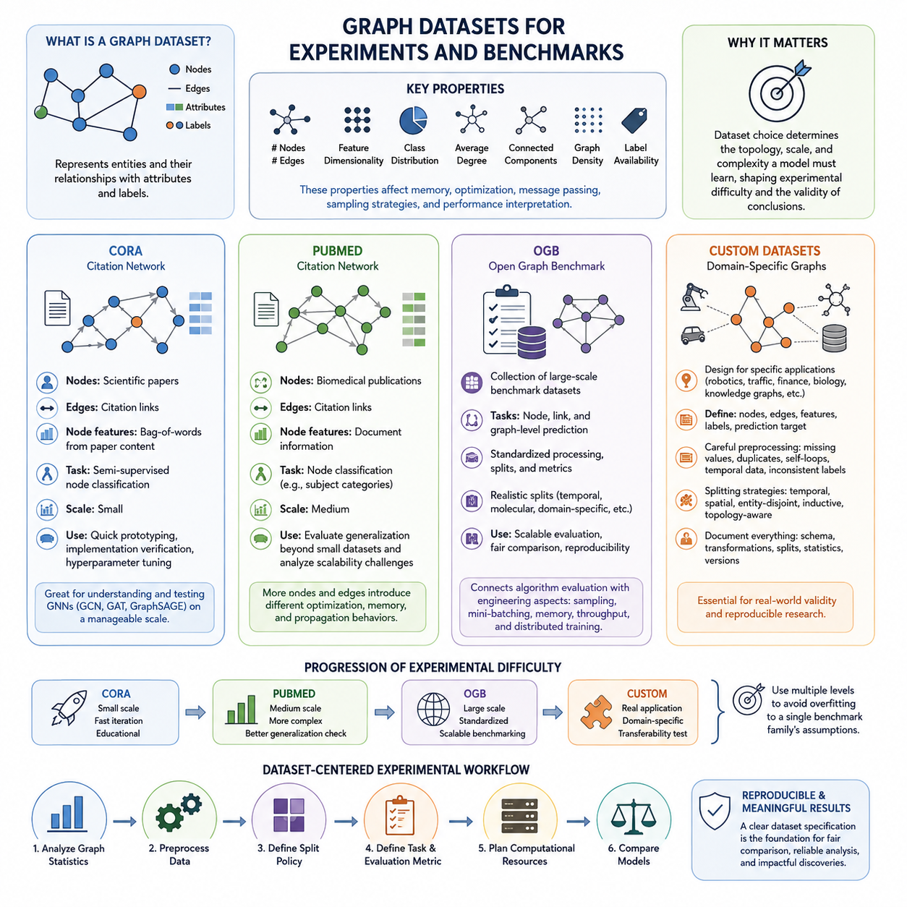
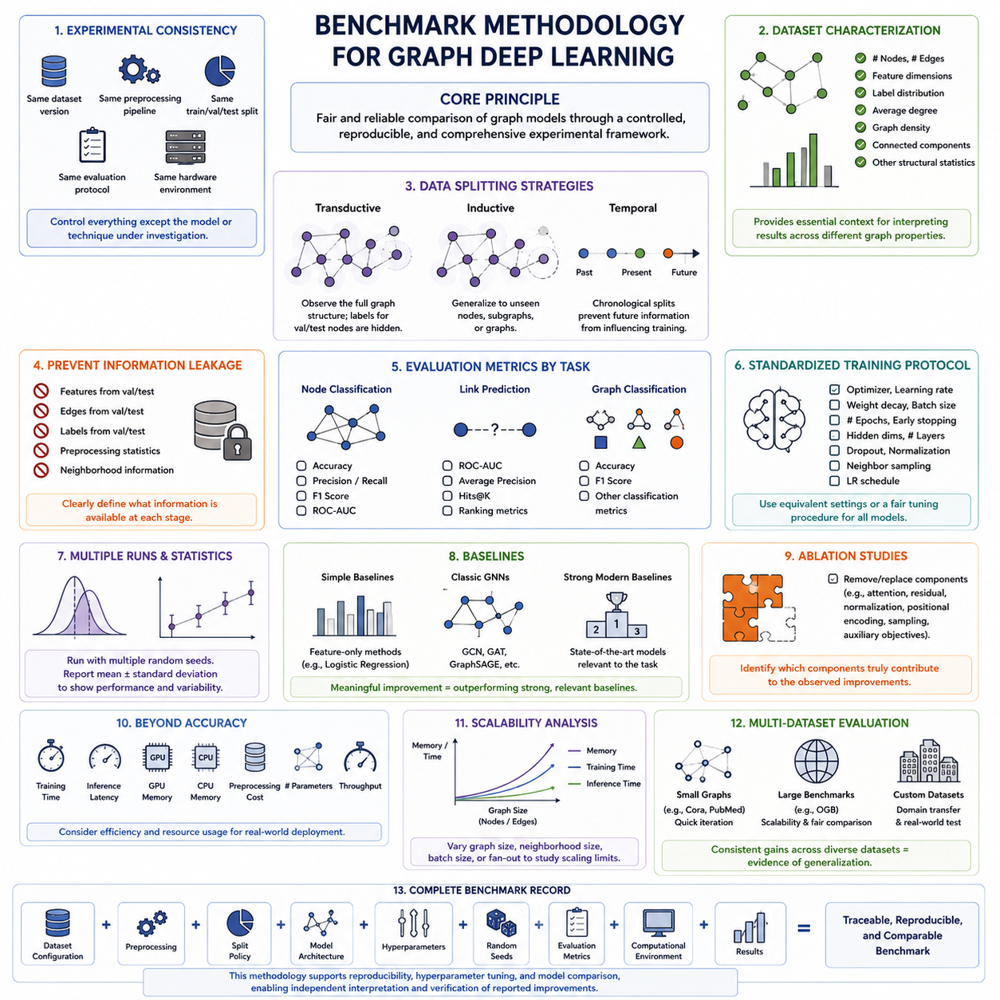
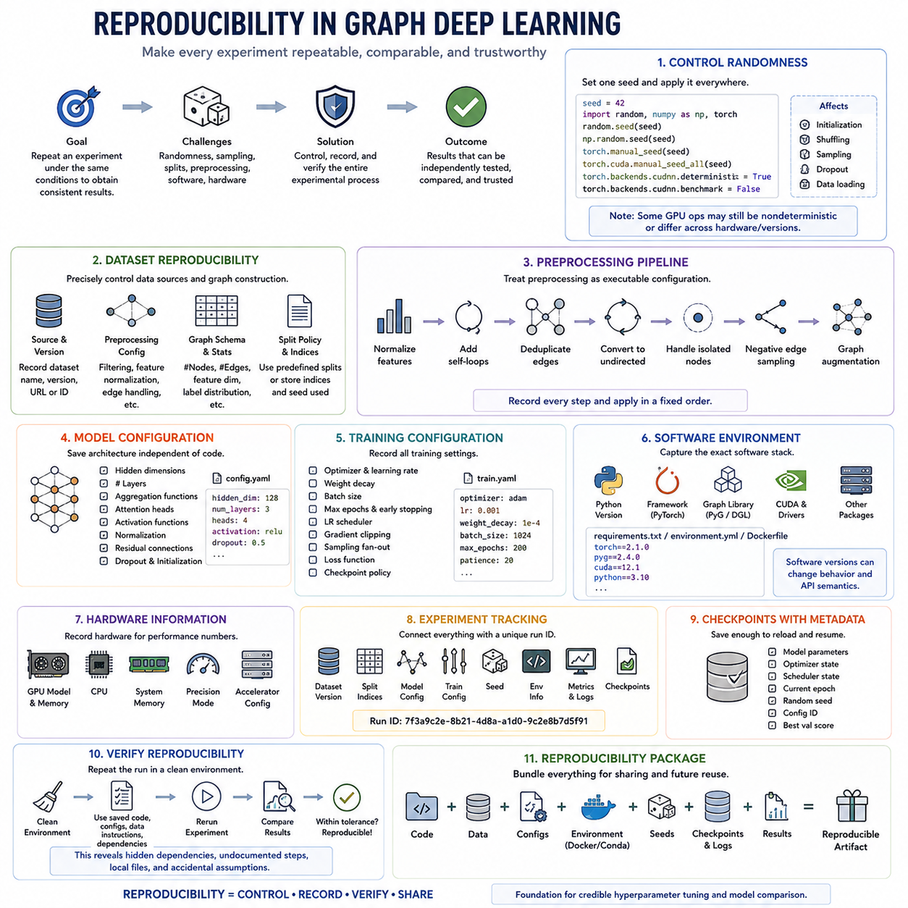
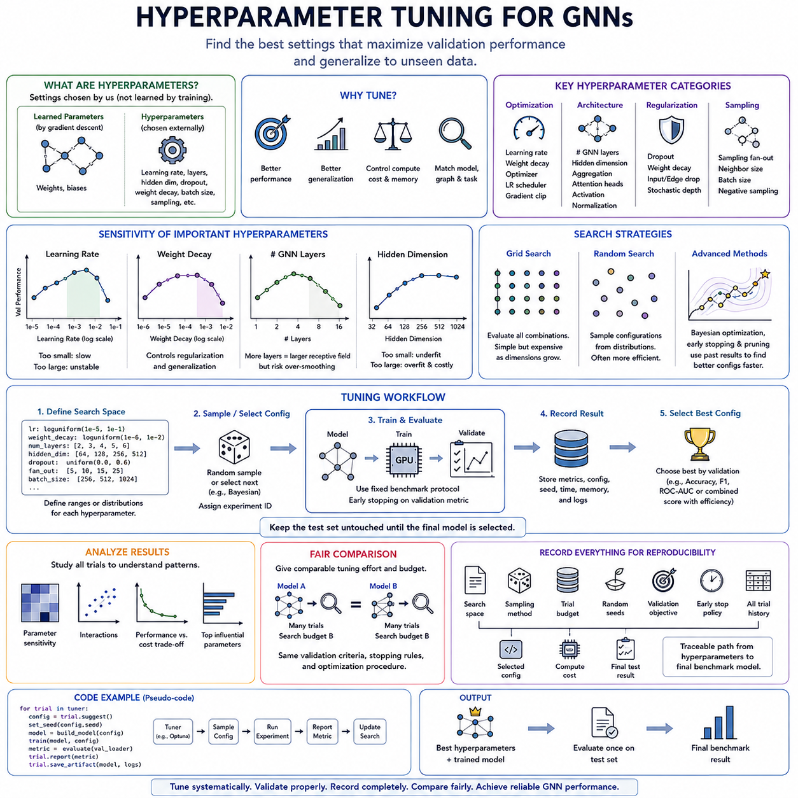
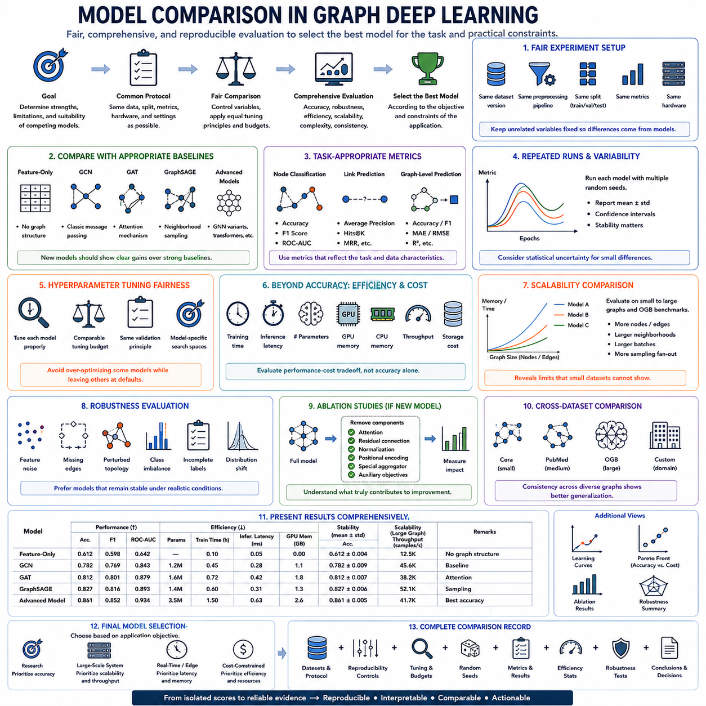

**Volume 29. Graph Deep Learning**

# Chapter 09. Experiments and Benchmarks

## 09.01. Datasets

{width="7.268055555555556in" height="7.268055555555556in"}

Graph datasets provide the experimental foundation for evaluating graph learning models under controlled and comparable conditions. Unlike conventional tabular datasets, they encode entities as nodes and relationships as edges while often attaching attributes, labels, timestamps, or relation types. Dataset selection therefore determines not only the amount of training data but also the topology, sparsity, homophily, scale, and structural complexity that a graph model must learn.

A useful graph benchmark should expose both feature information and relational structure so that experiments can measure how effectively a model combines them. Important characteristics include the number of nodes and edges, feature dimensionality, class distribution, average degree, connected components, graph density, and label availability. These properties strongly influence memory consumption, convergence behavior, neighborhood aggregation, sampling strategies, and the interpretation of final performance.

Cora is one of the most widely used citation-network datasets for introductory graph neural network experiments. Scientific publications are represented as nodes, while citation relationships form edges between papers. Each paper is associated with a feature representation derived from its textual content and a research-category label. This combination makes Cora particularly suitable for studying semi-supervised node classification using both document features and citation structure.

The relatively modest scale of Cora makes it useful for validating implementations of GCN, GAT, GraphSAGE, and related message-passing architectures before moving to larger benchmarks. Researchers can rapidly test propagation depth, hidden dimensions, dropout, normalization, and learning-rate settings without requiring large computational resources. However, strong results on Cora alone should not be interpreted as evidence that a model will remain effective on large, heterogeneous, or dynamically changing graphs.

PubMed provides a larger citation-network environment and is commonly used to evaluate whether graph learning methods remain effective beyond small academic benchmarks. Nodes correspond to biomedical publications, citation links define graph connectivity, and node attributes summarize document information. The prediction problem typically involves assigning publications to predefined categories, allowing models to exploit both semantic features and relationships among scientific documents.

Because PubMed contains substantially more nodes and edges than smaller citation datasets such as Cora, it provides a useful intermediate step between prototype experiments and large-scale graph learning. Models that perform well on Cora may encounter different optimization, memory, and propagation behavior when applied to PubMed. Comparing results across both datasets therefore helps reveal whether improvements arise from robust architectural principles or from characteristics specific to a small graph.

The Open Graph Benchmark, commonly abbreviated as OGB, extends graph evaluation toward larger and more standardized experimental settings. Rather than representing a single graph, OGB provides a collection of benchmark datasets covering node prediction, link prediction, and graph-level prediction. Its standardized dataset processing, evaluation metrics, and predefined data splits are designed to reduce inconsistencies that can otherwise make results from different graph learning studies difficult to compare.

OGB is especially valuable for testing scalability because several of its datasets contain graphs that are substantially larger and structurally more complex than traditional citation benchmarks. Experiments may require neighborhood sampling, mini-batch processing, sparse operations, efficient data loading, or distributed computation. Consequently, OGB connects algorithmic evaluation with engineering concerns such as GPU memory utilization, training throughput, preprocessing cost, and inference scalability.

Another important contribution of OGB is the use of predefined training, validation, and test splits that often reflect realistic prediction conditions. Depending on the benchmark, splits may account for temporal ordering, molecular structure, domain-specific relationships, or other constraints. This discourages arbitrary experimental partitioning and makes comparisons between architectures more meaningful. Evaluation should therefore preserve the official split and metric definitions whenever benchmark comparability is a primary objective.

Custom datasets become necessary when standard benchmarks cannot represent the relationships, attributes, constraints, or operating conditions of a target application. A custom graph may represent robots and spatial regions, road infrastructure, industrial equipment, financial transactions, biological interactions, communication networks, or knowledge entities. Designing such datasets requires explicit definitions of what constitutes a node, an edge, a feature, a label, and the prediction target.

Constructing a custom dataset begins with converting raw domain information into a consistent graph schema. Node identifiers must remain stable, edge direction and relation semantics must be defined, and numerical or categorical attributes must be transformed into usable features. Missing values, duplicated relationships, isolated nodes, self-loops, temporal records, and inconsistent labels require deliberate handling because preprocessing decisions can alter the topology that the learning algorithm ultimately observes.

Data splitting is particularly important for custom graph datasets because random splitting can introduce information leakage through graph connectivity. A node in the training set may be directly connected to test nodes, future edges may accidentally appear during training, or entities representing the same physical object may occur across multiple partitions. Depending on the application, experiments may therefore require temporal, spatial, entity-disjoint, inductive, or topology-aware splits rather than conventional random sampling.

Custom datasets should also be documented with the same rigor expected from public benchmarks. Dataset versions, graph construction rules, feature transformations, label definitions, filtering criteria, split generation, preprocessing software, and basic graph statistics should be recorded. Without this information, improvements attributed to a model may actually result from undocumented changes in data preparation. Dataset versioning therefore becomes an essential component of reproducible graph experimentation.

Cora, PubMed, OGB, and custom datasets together form a practical progression of experimental difficulty within graph deep learning. Cora supports rapid verification and educational experimentation, PubMed introduces greater scale, OGB enables standardized and more demanding benchmarking, and custom datasets test whether graph learning techniques transfer to real application structures. Using multiple dataset levels prevents evaluation from becoming overly dependent on the assumptions of a single benchmark family.

A strong experimental workflow should therefore treat the dataset as part of the benchmark specification rather than merely as input to a model. Graph statistics, preprocessing, split policy, task definition, evaluation metric, and computational requirements should be established before comparing architectures. This dataset-centered discipline provides the foundation for the subsequent benchmark methodology, reproducibility, hyperparameter tuning, and model comparison stages defined in the experimental structure of Graph Deep Learning.

## 09.02. Benchmark Methodology

{width="7.268055555555556in" height="7.268055555555556in"}

A benchmark methodology for graph deep learning defines a controlled experimental framework for determining whether one model actually performs better than another. Because graph models depend simultaneously on node features, connectivity, sampling, propagation depth, and dataset structure, meaningful benchmarking requires more than reporting a final accuracy value. The complete experimental configuration must be treated as part of the benchmark itself.

The first principle is experimental consistency. Models being compared should use the same dataset version, preprocessing pipeline, training-validation-test split, evaluation protocol, and hardware conditions whenever possible. Changing several factors simultaneously makes it difficult to identify why performance changed. A benchmark should therefore isolate the model or technique being investigated while keeping unrelated experimental variables controlled.

Dataset characterization should precede model training. Researchers should record the number of nodes and edges, feature dimensions, label distribution, average degree, graph density, connected components, and other relevant structural statistics. These properties provide essential context because identical GNN architectures can behave very differently on sparse, dense, homophilic, heterophilic, small, or extremely large graphs.

Data splitting must reflect the intended learning scenario. Transductive evaluation allows the model to observe the overall graph structure while labels for validation and test nodes remain hidden during training. Inductive evaluation instead tests whether the model can generalize to previously unseen nodes, subgraphs, or graphs. Temporal applications may require chronological splits so that future information cannot influence predictions made from historical data.

Information leakage deserves special attention because relationships between samples make graph datasets fundamentally different from independent tabular examples. Features, edges, labels, preprocessing statistics, or neighborhood information from validation and test entities can unintentionally influence training. Benchmark methodology should explicitly describe which graph information is available during each stage and ensure that the resulting evaluation corresponds to the intended deployment condition.

Evaluation metrics must match the graph learning task. Node classification commonly uses accuracy, precision, recall, F1 score, or ROC-AUC depending on class balance and application requirements. Link prediction may use ROC-AUC, average precision, Hits@K, or ranking-based metrics, while graph classification can employ conventional classification measures. No single metric captures every aspect of performance, so metric selection should reflect the practical objective.

Training protocols should also be standardized. Optimizer type, learning rate, weight decay, batch size, number of epochs, early-stopping rules, hidden dimensions, propagation layers, dropout, neighborhood sampling, and learning-rate schedules can substantially affect results. A fair comparison should either use equivalent configurations or apply a clearly defined tuning procedure to every model rather than extensively optimizing only the preferred architecture.

Graph neural networks are sensitive to random initialization, data sampling, mini-batch construction, and stochastic optimization. Reporting the result of a single training run can therefore provide a misleading impression of model quality. Reliable benchmarks normally repeat experiments using multiple random seeds and report aggregate statistics such as the mean and standard deviation, making both expected performance and experimental variability visible.

Baseline selection determines whether an experimental improvement is meaningful. Comparisons should include simple feature-only methods when appropriate, established graph architectures such as GCN, GAT, or GraphSAGE, and stronger modern baselines relevant to the task. A complex architecture that only marginally outperforms a simple baseline may offer limited practical value if it requires substantially more memory, training time, or engineering complexity.

Ablation studies complement direct model comparisons by identifying which components actually produce an observed improvement. Individual mechanisms such as attention, residual connections, normalization, positional encoding, sampling strategies, or auxiliary objectives can be removed or replaced while the remaining system stays unchanged. This separates genuine architectural contributions from improvements caused by additional parameters or altered training procedures.

Performance benchmarking should extend beyond predictive quality when models are intended for practical deployment. Training time, inference latency, peak GPU memory, CPU memory, preprocessing cost, parameter count, throughput, and storage requirements may be measured alongside accuracy. For large graphs, scalability as the number of nodes and edges increases can become as important as small improvements in predictive performance.

Computational comparisons require careful interpretation because runtime depends on hardware and software environments. GPU model, CPU configuration, memory capacity, framework version, CUDA stack, sparse kernels, data-loader settings, and mixed-precision configuration can influence measured speed. Hardware-sensitive measurements should therefore be reported together with the environment in which they were obtained rather than presented as universally valid characteristics.

Scalability experiments examine how a graph learning system behaves as graph size or computational workload increases. Researchers can vary node count, edge count, neighborhood size, batch size, or sampling fan-out and observe changes in memory consumption, training throughput, and inference latency. Such experiments reveal practical limits that may remain invisible when evaluation is restricted to compact datasets such as Cora or PubMed.

Benchmarking across multiple datasets provides stronger evidence of generalization than optimizing for one dataset. Small citation networks support rapid iteration, larger standardized benchmarks such as OGB test scalability and controlled comparison, and custom datasets examine domain transfer. Consistent improvements across different graph structures provide stronger evidence that an architectural contribution is broadly useful rather than specialized to one benchmark.

The final benchmark record should connect dataset configuration, preprocessing, split policy, model architecture, hyperparameters, random seeds, evaluation metrics, computational environment, and measured results into one traceable experiment definition. This methodology establishes the foundation for reproducibility, hyperparameter tuning, and model comparison in the remaining experimental workflow, allowing reported improvements to be independently interpreted and verified.

## 09.03. Reproducibility [w/Code]

{width="7.268055555555556in" height="7.268055555555556in"}

Reproducibility in graph deep learning means that an experiment can be repeated under clearly documented conditions and produce results that are statistically consistent with the original findings. This is especially important for graph neural networks because performance may vary with random initialization, graph partitioning, neighborhood sampling, stochastic optimization, and hardware-dependent computation. Reproducibility therefore concerns the complete experimental process rather than only preserving model code.

A reproducible experiment begins with deterministic control of randomness wherever practical. Python, NumPy, and the deep learning framework may each maintain independent random number generators, while graph libraries can introduce additional randomness through sampling or data loading. A common implementation pattern is to define one seed value and propagate it consistently across these components so that initialization, shuffling, sampling, and other stochastic operations can be reconstructed.

In Python-based graph experiments, seed initialization can conceptually be implemented with random.seed(seed), numpy.random.seed(seed), torch.manual_seed(seed), and torch.cuda.manual_seed_all(seed). When CUDA is used, deterministic algorithm settings may further reduce nondeterministic behavior. Complete determinism is not always guaranteed or desirable, however, because some optimized GPU kernels trade deterministic execution for higher performance and may behave differently across hardware or software versions.

Reproducibility should not be confused with reporting only one deterministic run. A fixed seed is useful for debugging and exact experiment reconstruction, but scientific conclusions should account for stochastic variability. Graph models should normally be trained with multiple predefined seeds, after which evaluation metrics can be summarized using the mean, standard deviation, confidence intervals, or other suitable statistics. This separates reproducible execution from statistically reliable evaluation.

Dataset reproducibility requires precise control of both source data and graph construction. The dataset name alone is insufficient because different library versions may apply different preprocessing, filtering, feature normalization, edge handling, or split generation. Experiments should therefore preserve the dataset version, download source or identifier, preprocessing configuration, graph schema, and relevant statistics such as node count, edge count, feature dimensions, and class distribution.

Training, validation, and test splits must also be reproducible. If predefined benchmark splits exist, they should be preserved rather than regenerated without documentation. For custom datasets, split indices or the exact algorithm and seed used to create them should be stored. This is particularly important for graph learning because small changes in node or edge partitions can alter neighborhood information and produce evaluation conditions that are no longer directly comparable.

The preprocessing pipeline should be treated as executable experimental configuration. Operations such as feature normalization, self-loop insertion, edge deduplication, conversion to undirected graphs, isolated-node handling, negative-edge sampling, and graph augmentation can substantially change the effective dataset. These transformations should be explicitly recorded and applied in a fixed order so that another execution reconstructs the same graph presented to the model.

Model configuration must be preserved independently from source code. Hidden dimensions, number of message-passing layers, aggregation functions, attention heads, activation functions, normalization, residual connections, dropout, and initialization rules should be stored as configuration parameters. This makes it possible to reproduce an architecture without relying on undocumented defaults that may change when the implementation or graph-learning framework is updated.

The same principle applies to training configuration. Optimizer, learning rate, weight decay, batch size, epoch limit, early-stopping patience, learning-rate scheduler, gradient clipping, sampling fan-out, loss function, and checkpoint policy should be recorded. Configuration files or structured experiment dictionaries are preferable to manually modifying constants inside source code because they create a traceable connection between a reported result and the exact settings that produced it.

Software environments are another major source of reproducibility failures. Python, PyTorch, CUDA, GPU drivers, graph libraries such as PyTorch Geometric or DGL, and supporting packages can change numerical behavior or API semantics between releases. Environment information should therefore be captured using dependency files, environment specifications, containers, or equivalent mechanisms so that the software stack associated with an experiment can later be reconstructed.

Hardware information should also accompany benchmark results when computational measurements are reported. GPU architecture, GPU memory, CPU, system memory, precision mode, and accelerator configuration can influence runtime, memory consumption, and sometimes numerical behavior. Training time or inference latency without hardware context is difficult to reproduce meaningfully. Reproducibility therefore includes both algorithmic configuration and the computational environment in which measurements were obtained.

Experiment tracking provides a practical mechanism for connecting all of these elements. Each run can be assigned a unique identifier associated with dataset version, split, model configuration, training parameters, seed, software environment, hardware information, metrics, and checkpoints. Logging systems can additionally preserve learning curves and resource statistics, allowing researchers to reconstruct not merely the final score but the sequence of events that produced it.

Model checkpoints should be saved together with sufficient metadata to reload and evaluate them independently. A checkpoint may include model parameters, optimizer state, scheduler state, current epoch, random seed, configuration identifier, and best validation score. Saving only the neural network weights may be adequate for inference, but it is insufficient when the objective is to resume training or reconstruct the precise state of an interrupted experiment.

Reproducibility verification should be performed as an explicit experiment rather than assumed from documentation. A completed run can be repeated from a clean environment using only the stored code, dataset instructions, configuration, and dependencies. The resulting metrics should then be compared with the recorded values within an expected tolerance. This process exposes hidden dependencies, undocumented preprocessing steps, local files, and accidental assumptions before results are published or shared.

A practical reproducibility package ultimately connects code, data, configuration, environment, seeds, checkpoints, logs, and evaluation results into one traceable experimental artifact. Within the Graph Deep Learning experimental workflow, this foundation makes subsequent hyperparameter tuning and model comparison credible because every candidate can be reconstructed under consistent conditions. Reproducibility transforms a successful individual run into evidence that can be independently tested, compared, extended, and trusted.

## 09.04. Hyperparameter Tuning [w/Code]

{width="7.268055555555556in" height="7.268055555555556in"}

Hyperparameter tuning in graph deep learning is the systematic process of selecting training and architectural settings that maximize validation performance while preserving generalization to unseen data. Unlike ordinary neural networks, GNNs are influenced not only by optimization parameters but also by message-passing depth, neighborhood structure, aggregation behavior, and graph sampling. Tuning therefore connects model architecture, graph topology, and training dynamics within one experimental process.

Hyperparameters should be distinguished from parameters learned through gradient descent. Model weights and biases are optimized during training, whereas learning rate, hidden dimension, number of GNN layers, dropout rate, weight decay, attention heads, batch size, and neighborhood sampling settings are selected externally. Their values define the conditions under which learning occurs and can substantially change both predictive quality and computational requirements.

The learning rate is usually one of the most influential optimization hyperparameters. A value that is too large may produce unstable updates or prevent convergence, while an excessively small value can make training unnecessarily slow or trap optimization in weak solutions. Instead of testing only closely spaced linear values, experiments commonly explore learning rates across logarithmic scales, such as orders of magnitude between relatively small and large candidate values.

Weight decay controls regularization by discouraging excessively large parameter values and can improve generalization when graph models overfit labeled nodes. Dropout provides another important regularization mechanism by randomly suppressing intermediate activations during training. These parameters interact with model capacity, dataset size, label availability, and graph structure, so their optimal values should be determined jointly rather than assumed to transfer unchanged across datasets.

The number of message-passing layers determines how far information can propagate through graph neighborhoods. Increasing depth expands the receptive field, allowing a node representation to incorporate information from progressively distant nodes. However, deeper GNNs can suffer from over-smoothing, optimization difficulties, or excessive information mixing. Layer count should therefore be tuned according to graph topology and the relational distance required by the prediction task.

Hidden dimensionality controls representation capacity and directly affects parameter count, memory consumption, and computational cost. Small embeddings may fail to encode sufficient information, whereas unnecessarily large dimensions can increase overfitting and resource usage without meaningful performance improvement. A useful tuning strategy evaluates progressively larger dimensions while monitoring validation quality together with memory consumption and training throughput.

Architecture-specific hyperparameters must also be included. GAT models may require tuning the number of attention heads, GraphSAGE may depend on the selected aggregation function and sampling fan-out, and graph transformers can introduce positional encodings, attention dimensions, and structural biases. Consequently, a universal search space is rarely sufficient; the tuning configuration should contain common parameters together with model-specific choices.

Neighborhood sampling introduces another tuning dimension for large graphs. Sampling fan-out determines how many neighbors are collected at each message-passing layer, influencing both the information available to the model and the computational workload. Large fan-outs approximate broader neighborhoods but increase memory and processing cost, while aggressive sampling improves scalability at the risk of discarding useful relational information.

Grid search evaluates predefined combinations of hyperparameter values and is straightforward to understand and reproduce. It is effective when the number of parameters and candidate values is small, but its computational cost grows rapidly with search-space dimensionality. For example, five hyperparameters with five candidate values each already require thousands of combinations, making exhaustive evaluation inefficient for expensive graph neural network training.

Random search samples configurations from predefined distributions instead of evaluating every combination. This approach often explores large search spaces more efficiently because only a subset of hyperparameters may strongly affect performance. In code, parameter distributions can be defined for learning rate, weight decay, hidden size, dropout, layer count, and sampling settings, after which each trial receives a sampled configuration and an independent experiment identifier.

More advanced optimization methods can use results from previous trials to decide which configurations should be evaluated next. Bayesian optimization estimates promising regions of the search space, while early-stopping and pruning strategies terminate poorly performing trials before they consume the full training budget. These approaches are particularly valuable when individual GNN experiments require substantial GPU memory, long preprocessing, or expensive neighborhood sampling.

The validation set should guide hyperparameter selection, while the test set must remain isolated until the final configuration has been chosen. Repeatedly selecting configurations according to test performance effectively turns the test set into part of the optimization process and produces optimistic estimates of generalization. A rigorous workflow searches on training data, ranks configurations using validation results, and evaluates the selected model on the test set only afterward.

A practical tuning loop can be expressed as a configuration generator followed by repeated train-and-evaluate operations. Each trial creates a model from its sampled hyperparameters, trains using the fixed benchmark protocol, measures validation metrics, and records computational statistics. The best configuration is selected according to a predefined objective such as validation accuracy, F1, ROC-AUC, or a combined performance-efficiency criterion.

Tuning results should be analyzed rather than reduced to only the winning configuration. Recording every trial enables researchers to examine parameter sensitivity, interactions, unstable regions, and performance-cost tradeoffs. Learning rate may dominate optimization behavior, for example, while hidden dimensions beyond a certain threshold may provide negligible gains. Such patterns reveal how the architecture behaves and can guide future experiments more efficiently.

Fair model comparison requires comparable tuning effort. Giving one architecture hundreds of trials while evaluating another with default parameters can create an artificial performance advantage unrelated to architectural quality. Search spaces do not need to be identical, because different models expose different parameters, but computational budgets, validation criteria, stopping rules, and optimization procedures should be reasonably equivalent.

The final tuning record should preserve the search space, sampling method, trial budget, random seeds, validation objective, early-stopping policy, complete trial history, selected configuration, and associated computational cost. Combined with the reproducibility framework, this creates a traceable path from candidate hyperparameters to the final benchmark model and provides the methodological foundation for reliable model comparison in the final stage of Graph Deep Learning experiments.

## 09.05. Model Comparison

{width="7.268055555555556in" height="7.268055555555556in"}

Model comparison in graph deep learning is the final experimental stage in which competing architectures are evaluated under a common benchmark protocol to determine their relative strengths, limitations, and practical suitability. A meaningful comparison extends beyond identifying the model with the highest score. It examines predictive quality, robustness, computational efficiency, scalability, architectural complexity, and consistency across datasets and experimental conditions.

Fair comparison begins by controlling the experimental environment. Models should use the same dataset version, preprocessing pipeline, training-validation-test split, evaluation metrics, and hardware configuration whenever these conditions can reasonably be shared. Model-specific requirements may differ, but unrelated experimental variables should remain fixed so that observed performance differences can be attributed primarily to the architectures or learning strategies being compared.

Graph neural networks should be compared against appropriate baselines representing different levels of complexity. A feature-only model can reveal how much predictive information exists without graph structure, while established architectures such as GCN, GAT, and GraphSAGE provide reference points for message-passing methods. More advanced architectures should then demonstrate measurable benefits over these baselines rather than merely outperforming an artificially weak reference model.

Predictive performance must be evaluated using metrics appropriate to the task. Node classification may emphasize accuracy, F1 score, or ROC-AUC, while link prediction can require average precision, Hits@K, or ranking metrics. Graph-level prediction may use classification or regression measures depending on the target. When class imbalance or asymmetric errors are important, relying on a single aggregate accuracy value can hide meaningful differences between competing models.

Model comparison should incorporate repeated experiments because stochastic training can produce substantial variation. Each architecture can be evaluated across multiple random seeds using the same seed set, after which results are summarized with statistics such as mean and standard deviation. A model whose average performance is slightly higher but highly unstable may be less attractive than one that consistently produces strong results across independent runs.

Statistical uncertainty should be considered when performance differences are small. A fraction of a percentage point between two models may not represent a meaningful improvement if run-to-run variation is of similar magnitude. Confidence intervals, paired comparisons, or suitable statistical tests can help determine whether observed differences are sufficiently consistent to support stronger conclusions rather than being consequences of random experimental variation.

Hyperparameter tuning must be integrated fairly into the comparison process. Each model should receive a reasonably comparable tuning budget and should be selected according to the same validation principle. Search spaces may differ because GCN, GAT, GraphSAGE, and graph transformers expose different architectural parameters, but the comparison should avoid extensively optimizing one model while leaving competitors near arbitrary default configurations.

Accuracy alone is insufficient when models are intended for real systems. Training time, inference latency, parameter count, peak GPU memory, CPU memory, throughput, preprocessing requirements, and storage cost provide additional dimensions of comparison. A model that improves accuracy slightly while requiring several times more memory or computation may be inappropriate for large-scale, real-time, edge, or resource-constrained graph applications.

Efficiency should therefore be interpreted as a performance-cost tradeoff rather than as an isolated measurement. Two models with similar predictive quality may differ substantially in computational requirements. Results can be examined in terms of accuracy per parameter, throughput at a target accuracy, latency under a fixed resource budget, or memory required for a specified graph size. Such analysis helps identify models that lie near a practical performance-efficiency frontier.

Scalability comparison evaluates how competing architectures behave as graphs become larger or denser. Increasing node count, edge count, neighborhood size, batch size, or sampling fan-out can expose memory and throughput limitations that are invisible on small citation datasets. Architectures that appear similar on Cora or PubMed may diverge significantly when evaluated on larger OGB benchmarks or application-specific graphs requiring neighborhood sampling and sparse computation.

Robustness provides another important comparison dimension. Models can be evaluated under feature noise, missing edges, perturbed topology, class imbalance, incomplete labels, or distribution shifts when these conditions are relevant to the target application. A graph model that achieves the best result on a clean benchmark but degrades sharply under moderate structural disturbance may be less useful than a slightly less accurate model with stable behavior.

Ablation results should accompany comparisons when a proposed model introduces several new components. Removing attention modules, residual connections, normalization, positional encodings, specialized aggregators, or auxiliary objectives can reveal how much each component contributes. Without such analysis, it is difficult to determine whether improvement comes from the central architectural idea, additional parameters, stronger regularization, or a more favorable training configuration.

Cross-dataset comparison provides evidence about generalization across graph structures. A useful evaluation may progress from small citation networks such as Cora, through larger datasets such as PubMed and standardized OGB benchmarks, to custom domain-specific datasets. A model that consistently performs well across graphs with different scales and structural characteristics provides stronger evidence of general usefulness than one optimized for a single benchmark.

Results should be presented in a form that makes tradeoffs visible rather than reducing every experiment to one ranking. Comparison tables can combine predictive metrics with parameter count, training time, inference latency, memory consumption, and variability across runs. Learning curves and scaling measurements can further show convergence behavior and computational growth, helping readers understand why one model may be preferable under different deployment constraints.

The final model should therefore be selected according to the objective of the application rather than automatically choosing the architecture with the highest benchmark score. Research experiments may prioritize predictive improvement, large-scale systems may emphasize scalability and throughput, and real-time applications may prioritize latency and memory efficiency. Model comparison becomes a multi-objective decision process in which performance, reliability, complexity, and resource requirements must be balanced.

A complete comparison record connects datasets, benchmark methodology, reproducibility controls, hyperparameter tuning, repeated runs, evaluation metrics, computational measurements, robustness tests, and final conclusions. Within the Graph Deep Learning structure, this closes the experimental workflow by transforming isolated model scores into evidence that can be reproduced, interpreted, and compared fairly, providing a defensible basis for selecting architectures for research and real-world deployment.
